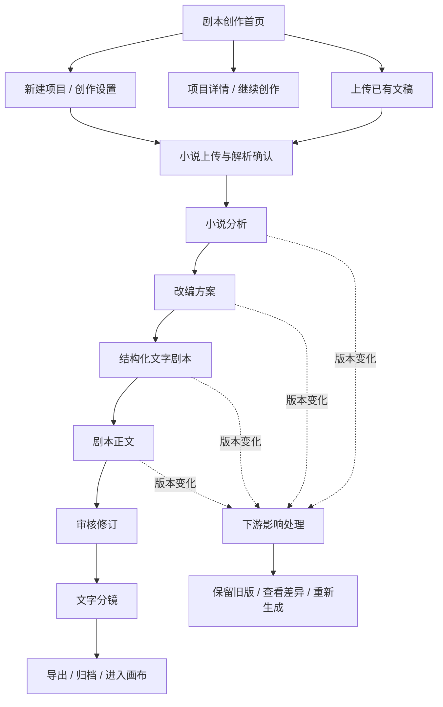

# 剧本创作页面逻辑盘点与补充清单

> 盘点日期：2026-08-05  
> 盘点对象：`http://localhost:62096/` 当前静态原型  
> 对照资料：`漫剧视频创作平台_PRD.md`、`/Users/apple/Desktop/未命名文件夹 4/` 产品截图  
> 结论：八阶段主导航已经成立，但当前实现仍是“主页面展示原型”，尚未覆盖可以支持真实创作的页面状态、编辑器、任务、版本与异常闭环。

## 1. 推荐的完整页面逻辑

八阶段顺序建议保持：

1. 创作设置
2. 小说上传
3. 小说分析
4. 改编方案
5. 结构化文字剧本
6. 剧本正文
7. 审核修订
8. 文字分镜

“内容交付”不作为创作阶段，而是第 8 步完成后的结果动作。

## 2. 现有页面健康度

| 步骤 | 当前已有内容 | 健康度 | 主要问题 |
|---|---|---|---|
| 0. 剧本创作首页 | 四种入口、待办、最近项目 | 一般 | 项目详情、项目列表、搜索筛选、删除归档等入口没有对应页面；四种创建方式缺少清晰的分支逻辑 |
| 1. 创作设置 | 类型、模式、平台、受众、集数、四轴分类 | 较好但不完整 | 缺项目名称、单集时长、画幅/语言/内容安全级别；快速创作与专业创作最终仍进入同一链路；缺校验和保存反馈 |
| 2. 小说上传 | 粘贴、上传切换、解析结果摘要 | 不完整 | 没有真实文件选择、上传进度、解析中、失败、重试、取消、替换确认、章节预览和截取范围确认 |
| 3. 小说分析 | 基础信息、人物小传、世界观及其子页签 | 框架较完整 | 内容以只读展示为主；缺新增、编辑、删除、排序、搜索、完整人物列表、部分模块失败与完整性校验 |
| 4. 改编方案 | 四个摘要卡片及确认按钮 | 严重不足 | 未形成“卖点分析 + 高压场景候选 + 创作策略编辑器”三块结构；无法选择前三集开场方案和维护自定义规则 |
| 5. 结构化文字剧本 | 分集列表、钩子/冲突评分 | 严重不足 | 只有列表，没有单集编辑详情、节拍表、时间轴校验、开场/核心内容/结尾钩子编辑和逐集任务状态 |
| 6. 剧本正文 | 集数切换、简单正文和 AI 工具按钮 | 严重不足 | 未按场景与内容块结构化；缺场景目录、关联信息、内容块菜单、局部重生成、一致性定位和导出 |
| 7. 审核修订 | 总分、三条问题、修订动作 | 严重不足 | 缺问题详情、筛选、定位、批量处理、修订编辑器、差异对比、审核结论、评论与审计记录 |
| 8. 文字分镜 | 简化镜头表、三种交付动作 | 严重不足 | 镜头字段不足、没有目录/卡片视图/资产引用/提示词编辑/拆分合并/连续性检查/导出配置和结果页 |
| 全局能力 | 右侧上下文、版本摘要、过期提醒文案 | 严重不足 | 步骤可任意跳转；进度按当前位置计算；没有真实任务中心、版本列表、差异恢复、冲突、离线和权限状态 |

## 3. 必须补充的页面或面板

### P0：形成可开发的最小完整闭环

#### 3.1 项目基础页面

1. **新建项目确认页/弹窗**
   - 项目名称、创作方式、内容类型、创建人、默认语言。
   - 创建后才生成项目 ID，不能所有入口都直接进入同一个样例项目。
2. **项目详情/项目概览页**
   - 项目状态、当前阶段、各阶段版本、最近任务、待处理问题、成员与操作记录。
   - 首页“查看详情”目前没有对应内容。
3. **全部项目页**
   - 搜索、状态筛选、类型筛选、排序、分页、继续创作、复制、归档、删除与恢复。

#### 3.2 任务与生成状态

4. **生成任务面板/任务中心**
   - 排队、运行、成功、失败、取消五种状态。
   - 展示已耗时、任务范围、失败原因、请求编号、重试与取消。
5. **重新生成配置弹窗**
   - 选择全部/指定集/指定场景/指定模块。
   - 展示使用的上游版本、人工修改影响及“保留当前版本并生成新版本”。
6. **前置条件阻断页**
   - 用户点击未满足条件的阶段时，不应直接看到成功数据；应显示缺失项、返回前一步和去完成按钮。

#### 3.3 版本与上下游依赖

7. **历史版本抽屉**
   - 版本号、来源、创建人、时间、输入版本、备注、查看与恢复。
8. **版本差异页/弹窗**
   - 当前版本与目标版本左右或行级对比；支持恢复为新版本。
9. **下游影响确认弹窗**
   - 修改小说、分析、改编或某集结构后，明确列出受影响阶段和集数。
10. **产物过期处理页/顶部面板**
    - 查看上游变更摘要、继续使用旧版本、基于最新版重新生成。

#### 3.4 阶段专属补充页面

11. **小说上传解析确认页**
    - 文件信息、章节目录、无法识别章节、解析警告、前 50 章范围、原文预览、替换/删除。
12. **小说分析编辑态**
    - 故事梗概富文本编辑；事件增删改排；章节搜索折叠；人物全量列表及人物编辑表单；世界观字段编辑。
13. **小说分析任务状态页**
    - 故事、人物、事件、世界观子任务分别显示状态；部分失败时保留成功模块并支持单独重试。
14. **改编方案工作台**
    - 左侧卖点分析；中部策略文档编辑；高压场景候选和前三集开场选择；右侧选择理由、节拍摘要和历史版本。
15. **结构化剧本单集编辑页**
    - 分集页签、故事梗概、核心内容、结尾钩子、钩子要点、节拍时间表、角色/事件引用、逐集生成与重试。
16. **剧本正文结构化编辑页**
    - 集数与场景目录、场景编辑器、动作/对白/旁白/字幕/音效/VFX/转场等内容块、关联信息面板。
17. **剧本检查结果面板**
    - 错误、警告、建议分级；定位到具体场景或内容块；阻断项处理后才能进入分镜。
18. **审核修订详情页**
    - 问题筛选、定位、原文/建议/修订后内容、批量处理、审核结论、退回与通过、评论和操作记录。
19. **文字分镜完整编辑页**
    - 集/场景/镜头目录；表格/卡片双视图；17 个镜头字段；新增、复制、删除、排序、拆分、合并和批量编辑。
20. **连续性与质量检查面板**
    - 时长、对白覆盖、人物/服装/道具/方位连续性、景别重复、提示词完整性，并可定位到镜头。
21. **导出配置与导出结果页**
    - XLSX、JSON、Markdown、DOCX 的范围和版本选择；生成中、成功、失败、重新下载与文件名预览。

### P1：支持团队化与规模化生产

22. **完整人物库/资产引用页**：人物、服装、地点、道具的版本和引用关系。
23. **源文追溯抽屉**：从事件、人物、节拍、场景、镜头回查来源章节和原文段落。
24. **审核工作台/待办列表**：按项目、集数、风险等级分配和处理审核任务。
25. **成员与权限页**：创作者、审核人员、管理员的查看、编辑、审核和导出权限。
26. **项目操作日志页**：上传、生成、修改、恢复、导出、归档等审计记录。

## 4. 现有功能不完善点

### 4.1 流程控制

- 所有阶段当前均可直接点击，没有前置条件判断。
- 左侧“已完成”状态根据当前位置自动点亮，并不代表产物已生成、已保存或已确认。
- 完成度按 `当前步骤 / 8` 计算，不能反映单集和子模块的真实完成情况。
- 缺少统一的“上一步 / 保存并下一步”；多数阶段只有孤立按钮。
- 快速创作、专业创作、上传文稿、TVC 四个入口缺少差异化流程定义。

### 4.2 保存与版本

- “自动保存于 15:42”是静态文案，没有未保存、保存中、已保存、失败状态。
- 顶部与右侧的版本记录只是摘要，无法打开、对比或恢复。
- 缺少 `base_version` 冲突处理、本地草稿恢复和离线提醒。
- 修改上游只展示通用提示，没有准确到阶段、集数和镜头的影响清单。

### 4.3 编辑与 AI 生成

- 大多数产物只能阅读，不能进行字段级编辑、增删、排序和保存。
- “生成”“确认”“修订”“导出”等主要按钮普遍没有形成新的可见页面状态或结果反馈。
- 缺少任务排队、生成中、失败、取消和局部重试。
- 缺少“本次生成范围、临时指令、使用版本、是否保留人工修改”的生成前确认。

### 4.4 数据一致性

- 人物、事件、世界观、节拍、场景和镜头之间没有可点击的引用关系。
- 没有来源章节、上游版本和生成输入快照，结果不可追溯。
- 结构、正文和分镜按集的完成状态没有真正独立管理。
- 审核问题没有和正文/分镜中的具体位置建立锚点。

### 4.5 异常和边界状态

当前缺少以下通用状态模板：

- 首次进入空状态。
- 前置数据缺失。
- 上传进度和上传中断。
- 解析中与解析失败。
- AI 排队、生成中、超时、失败、取消。
- 部分集成功、部分集失败、部分集生成中的混合状态。
- 网络离线、保存失败、版本冲突和本地草稿恢复。
- 产物过期、只读权限、项目归档和内容安全阻断。

### 4.6 可访问性风险

- 大量辅助文字字号较小、灰度较低，长时间创作时阅读负担较高。
- 阶段完成状态仍较依赖颜色，需要明确的文字状态或图标标签。
- 当前只从截图确认了视觉状态；键盘焦点顺序、焦点可见性、屏幕阅读器语义和对比度仍需专项测试。

## 5. 建议的补充顺序

### 第一批：先让链路“跑得通”

1. 前置条件与阶段状态模型。
2. 上传/解析完整状态。
3. 统一任务中心及失败重试。
4. 自动保存、版本列表、版本差异和过期处理。
5. 结构化剧本单集编辑、正文结构化编辑、分镜完整编辑。
6. 导出配置和结果反馈。

### 第二批：让创作“可控、可改、可追溯”

1. 小说分析全字段编辑。
2. 改编方案完整工作台。
3. 人物/事件/世界观/节拍/场景/镜头引用追溯。
4. 剧本检查、连续性检查和审核定位修订。
5. 局部重新生成与临时指令。

### 第三批：支持团队生产

1. 项目列表与项目详情。
2. 审核任务列表、评论和处理记录。
3. 成员权限、资产库和审计日志。
4. 批量生产、多集任务和画布工作台交接状态。

## 6. 产品结论

当前版本已经解决了“八阶段顺序”和“小说分析信息架构”两项核心问题，但仍不足以直接作为完整开发范围。最需要补的不是再增加一个主导航步骤，而是补齐四类横向能力：

1. **任务状态**：AI 生成可等待、可取消、可失败、可重试。
2. **编辑与版本**：所有产物可编辑、自动保存、比较和恢复。
3. **依赖与校验**：上游变化可准确影响下游，未满足条件不可误入。
4. **异常与交付**：上传、网络、冲突、过期、导出均有完整结果反馈。

在这四类能力补齐前，现有原型更适合用于确认信息架构和视觉方向，不宜直接作为研发完整验收范围。

## 7. 本次审计证据

- `artifacts/script-creation-flow-audit-2026-08-05/01-home.png`
- `artifacts/script-creation-flow-audit-2026-08-05/02-creation-settings.png`
- `artifacts/script-creation-flow-audit-2026-08-05/03-novel-upload.png`
- `artifacts/script-creation-flow-audit-2026-08-05/04-novel-analysis.png`
- `artifacts/script-creation-flow-audit-2026-08-05/05-adaptation.png`
- `artifacts/script-creation-flow-audit-2026-08-05/06-structured-script.png`
- `artifacts/script-creation-flow-audit-2026-08-05/07-script-body.png`
- `artifacts/script-creation-flow-audit-2026-08-05/08-review.png`
- `artifacts/script-creation-flow-audit-2026-08-05/09-storyboard.png`

