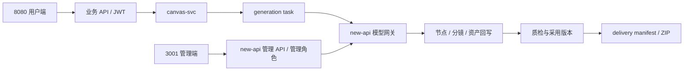
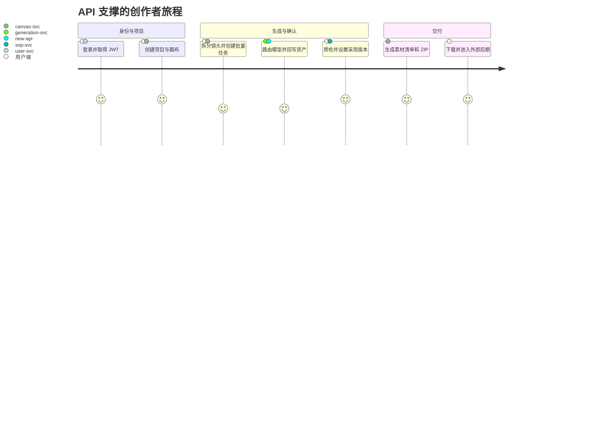
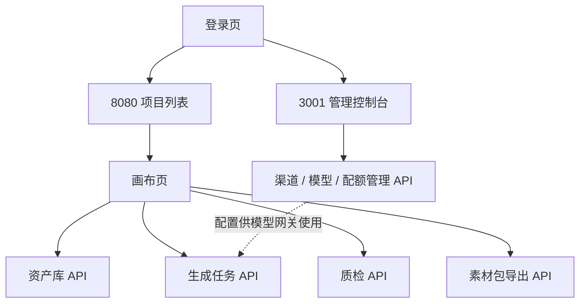
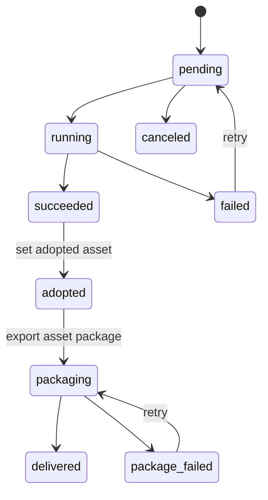

# AI漫剧与视频内容工业化生产工作台 · API接口文档

> 基于《用户端产品功能设计.md》v0.6+《后端产品功能设计_V1.5.md》+《流程图文档.md》+《AI漫剧与视频内容工业化生产工作台 PRD V1.5》  
> 文档版本：v1.7 `[superpowers 更新 V1.7]`  
> API版本：v1  
> 接口总数：350+ 个
> 文档格式：OpenAPI 3.0 风格 Markdown  
> **V1.5 更新**：以 AI 视频工业化生产工作台为口径，补强画布节点、素材拖入、分镜解析、批量生图/视频、全能参考、多副本并行、资产历史、镜头采用版本、素材包导出、算力预估、Agent 会话与 Skill 执行接口。平台不提供视频剪辑、视频拼接、转场特效、音视频混合或多轨编辑接口。

---

## 基于 superpowers 的更新记录（2026-07-04）

本文档基于 `docs/superpowers/` 下的最新设计文档进行了增量更新，V1.5 → V1.6 → V1.7。主要变更：

| 更新项 | 说明 | 依据 superpowers |
|---|---|---|
| 新增域 | `/api/v1/task-center/**`、`/api/v1/ops/task-center/**` — 统一任务事件中心；SSE 事件流；SLA 告警；对账；命令路由 | `2026-07-04-unified-task-event-center-design.md` |
| 新增域 | `/api/v1/assets/workbench/**`、`/api/v1/assets/history/**` — 资产工作台；合并 AssetHistory + TaskMonitor；workspace_assets 扩展 | `2026-07-04-asset-generation-history-workbench-design.md` |
| 新增域 | `/api/v1/agent/blueprints`、`/api/v1/agent/definitions`、`/api/v1/agent/versions`、`/api/v1/agent/user-bindings`、`/api/v1/agent/resolve-preview` — Agent 配置中心 | `2026-07-04-user-configurable-agent-center-design.md` |
| 扩展域 | `/api/v1/enterprise/**` — 企业工作台：3001 BFF 代理；采购预算；统一审批；跨域审计 | `2026-07-04-enterprise-workbench-completion-design.md` |
| 扩展域 | `/api/v1/sop/**` — 生产 SOP：双界面；6 生产 Gate；返工工单；规则引擎 | `2026-07-04-production-sop-completion-design.md` |
| 扩展域 | `/api/v1/canvas/projects` — 独立空白画布：POST canvas/projects 放行 nullable 字段 | `2026-07-04-standalone-blank-canvas-design.md` |
| 跨域规范 | 幂等键 Header 强制；乐观锁 ETag/If-Match；故障关闭 503；不可变快照 | 全部 07-04 superpowers |
| 新增 API 域 | `/api/v1/creative-bible` — 创作圣经版本、生态系统规则、写作指南、上下文快照 | `script-creation-creative-bible-design.md` |
| 新增 API 域 | `/api/v1/agent` — Agent 会话持久化、计划审批、SSE 事件流、步骤重试 | `agent-session-completion-design.md` |
| 新增 API 域 | `/api/v1/trade` — 脚本交易市场、四种许可证、订单/支付、权益/退款 | `script-trading-market-completion-design.md` |
| 扩展 API 域 | `/api/v1/asset` — 从 mock 升级为完整资产市场（工作区库、企业审批、项目应用） | `ai-asset-market-completion-design.md` |
| 扩展 API 域 | `/api/v1/canvas` — 画布项目管理、源快照 diff、生产准入 | `platform-home-canvas-center-design.md` |
| 新增 API 域 | `/api/v1/storyboards` — 专业分镜编辑器（13 维镜头、A/B/C 分层、XLSX 导入导出） | `storyboard-professional-editor-redesign.md` |
| 扩展 API 域 | `/api/v1/content-projects` — 仓库生命周期操作（三轴状态过滤、提交审核/锁定/归档） | `script-creation-warehouse-flow-design.md` |
| 扩展 API 域 | `/api/v1/content-projects/{id}/settings` — 五类设定 CRUD + AI 提取确认 | `work-editor-evolution-design.md` |
| 认证更新 | 明确 3001 为账户中心唯一数据源，JWT 声明映射规则，`X-Workspace-Id` header | `unified-account-model-billing-design.md` |
| 错误码补充 | 新增 45xxx（分镜）、46xxx（创作圣经）、47xxx（交易）、48xxx（资产市场）、49xxx（Agent）、50xxx（任务事件）、51xxx（资产工作台）、52xxx（Agent 配置）、53xxx（企业扩展）、503xx（故障关闭） | 对应 superpowers specs |
| PATCH 修正 | 2.5 节”暂不使用 PATCH”→”PATCH 用于部分更新”，与 V1.5 大量 PATCH 端点保持一致 | 文档内部一致性 |
| 画布节点更新 | 反映浮动编辑器改造后的新交互模型 | `canvas-node-floating-editor-design.md` |
| **Canvas 生产内核 V1.8** `[superpowers 更新 V1.8]` | 新增 16 个 Canvas 生产内核端点（model-requests/preview、candidates、director-scene/draft/validate/revisions、adoptions、delivery-manifests/packages、migration-report、upgrade）；节点类型参数 11→6 收缩；废弃 compose/export/音频截取/变速端点；强制 Idempotency-Key + If-Match/ETag | `canvas-production-kernel-completion-design.md` + R0-R4 实施计划 |

> **注意**：标注 `[superpowers 更新 V1.8]` 为 2026-07-05 新增（Canvas 生产内核）。标注 `[superpowers 更新 V1.7]` 为 07-04 新增。标注 `[superpowers 更新]` 为 07-02 之前的更新。

---

## 目录

- [1. API概述](#1-api概述)
- [2. 通用规范](#2-通用规范)
- [3. 认证接口（auth）](#3-认证接口auth)
- [4. 用户与账户接口（user）](#4-用户与账户接口user)
- [5. 企业管理接口（enterprise）](#5-企业管理接口enterprise)
- [6. 剧本生成接口（script-gen）](#6-剧本生成接口script-gen)
- [7. 剧本仓库接口（script-repo）](#7-剧本仓库接口script-repo)
- [8. 交易与支付接口（trade）](#8-交易与支付接口trade)
- [9. AI资产市场接口（asset-market）](#9-ai资产市场接口asset-market)
- [10. 画布视频工作台接口（canvas）](#10-画布视频工作台接口canvas)
- [🆕 11. Agent与Skill接口（agent）](#-11-agent与skill接口agent)
- [12. 生产SOP接口（sop）](#12-生产sop接口sop)
- [13. 通知消息接口（notify）](#13-通知消息接口notify)
- [14. 支付回调接口（webhook）](#14-支付回调接口webhook)
- [🔥 14-A. 创作圣经接口（creative-bible）](#-14-a-创作圣经接口creative-bible)
- [🔥 14-B. 专业分镜接口（storyboards）](#-14-b-专业分镜接口storyboards)
- [🔥 14-C. 工作编辑器设定接口（settings）](#-14-c-工作编辑器设定接口settings)
- [15. Open API接口（openapi）](#15-open-api接口openapi)
- [🆕 16. 统一任务事件接口（task-center）`[superpowers 更新 V1.7]`](#-16-统一任务事件接口task-center)
- [🆕 17. 资产工作台接口（asset-workbench）`[superpowers 更新 V1.7]`](#-17-资产工作台接口asset-workbench)
- [🆕 18. Agent配置中心接口（agent-config）`[superpowers 更新 V1.7]`](#-18-agent配置中心接口agent-config)
- [🆕 19. 企业工作台接口扩展（enterprise-ext）`[superpowers 更新 V1.7]`](#-19-企业工作台接口扩展enterprise-ext)
- [20. 通用数据模型](#20-通用数据模型)
- [21. 枚举字典](#21-枚举字典)
- [22. 错误码参考](#22-错误码参考)
- [附录A：接口版本矩阵](#附录a接口版本矩阵)

---

## 1. API概述

### 1.1 基础信息

| 项目 | 值 |
|------|-----|
| **Base URL (生产)** | `https://api.ai-comic-platform.com` |
| **Base URL (测试)** | `https://api-staging.ai-comic-platform.com` |
| **Base URL (开发)** | `http://localhost:8080` |
| **API版本** | `v1`（URL路径版本：`/api/v1/`） |
| **字符编码** | UTF-8 |
| **请求格式** | `application/json` |
| **响应格式** | `application/json` |
| **认证方式** | JWT Bearer Token（`Authorization: Bearer <token>`） |
| **时间格式** | ISO 8601（`2026-06-08T15:30:00+08:00`） |
| **日期格式** | `YYYY-MM-DD`（`2026-06-08`） |

#### 本地双端入口与认证边界

| 入口 | 用途 | 认证口径 |
|---|---|---|
| `http://localhost:8080` | AICP 用户端及业务 API | 平台 JWT，账号主数据由 `user-svc` 管理 |
| `http://localhost:3001` | new-api 管理端及模型网关 | 复用平台统一身份；仅平台管理员/运维角色可进入管理功能 |
| `http://localhost:5173` | AICP Vite 调试入口 | 仅开发调试，调用 `8080` 业务 API |

双端”账号共用”不等于”功能共用”。`8080` 与 `3001` 使用同一平台用户标识和登录身份，但分别执行创作业务与模型供应商管理。

`[superpowers 更新]` **V1.6 架构决策**：`3001` 已确定为账户中心**唯一数据源（Single Source of Truth）**。用户、工作区、成员、角色、余额、API Key、模型目录、计费等所有账户主数据由 `3001` 管理。`8080` 不得维护这些数据的重复副本。`8080` 通过 BFF 适配层调用 `3001` 版本化 API 读取/操作账户数据。

> 当前联调状态（2026-06-27）：端口与服务已分离；统一登录票据、角色映射和账号自动同步为 P0 遗留项。详见 `docs/superpowers/specs/2026-06-28-unified-account-model-billing-design.md`。

### 1.2 服务路由

| 路由前缀 | 目标服务 | 认证 |
|----------|---------|:---:|
| `/api/v1/auth/*` | user-svc / 3001（账户中心） | 无 |
| `/api/v1/user/*` | user-svc / 3001（账户中心） | JWT |
| `/api/v1/enterprise/**` 🔄 | enterprise-svc（8080 BFF → 3001 代理） | JWT + `X-Workspace-Id` + WorkspaceContext 权限码 |
| `/api/v1/content-projects/*` | contentproject-svc | JWT + `X-Workspace-Id` |
| `/api/v1/script/gen/*` | script-gen-svc（兼容旧路径） | JWT |
| `/api/v1/script/repo/*` | script-repo-svc（兼容旧路径） | JWT |
| `/api/v1/trade/*` `[superpowers 更新]` | trade-svc（8080 业务 + 3001 钱包） | JWT + `X-Workspace-Id` |
| `/api/v1/asset/*` `[superpowers 更新]` | asset-svc（8080 资产市场 + WorkspaceContextFilter） | JWT + `X-Workspace-Id` |
| `/api/v1/canvas/*` `[superpowers 更新]` | canvas-svc（画布编辑器 + 画布项目中心） | JWT + `X-Workspace-Id` |
| `/api/v1/storyboards/*` `[superpowers 更新]` | storyboard-svc（统一专业分镜编辑器） | JWT + `X-Workspace-Id` |
| `/api/v1/creative-bible/*` `[superpowers 更新]` | creative-bible-svc（创作圣经） | JWT + `X-Workspace-Id` |
| `/api/v1/generation/*` | generation-svc | JWT |
| `/api/v1/credits/*` | billing-svc（8080 信用 + 3001 预扣/结算） | JWT |
| `/api/v1/agent/*` `[superpowers 更新]` | agent-svc（Agent 会话/计划/执行/SSE） | JWT + `X-Workspace-Id` |
| `/api/v1/skills/*` | agent-svc | JWT |
| `/api/v1/sop/*` | sop-svc | JWT |
| `/api/v1/notify/*` | notify-svc | JWT |
| `/api/v1/task-center/**` `[superpowers 更新 V1.7]` | task-event-svc | JWT + `X-Workspace-Id` |
| `/api/v1/ops/task-center/**` `[superpowers 更新 V1.7]` | task-event-svc (admin only) | JWT + 运营角色 |
| `/api/v1/assets/workbench/**` `[superpowers 更新 V1.7]` | asset-workbench-svc | JWT + `X-Workspace-Id` |
| `/api/v1/assets/history/**` `[superpowers 更新 V1.7]` | asset-workbench-svc | JWT + `X-Workspace-Id` |
| `/api/v1/agent/blueprints/**` `[superpowers 更新 V1.7]` | agent-config-svc | JWT + `X-Workspace-Id` |
| `/api/v1/agent/definitions/**` `[superpowers 更新 V1.7]` | agent-config-svc | JWT + `X-Workspace-Id` |
| `/api/v1/agent/versions/**` `[superpowers 更新 V1.7]` | agent-config-svc | JWT + `X-Workspace-Id` |
| `/api/v1/agent/user-bindings/**` `[superpowers 更新 V1.7]` | agent-config-svc | JWT + `X-Workspace-Id` |
| `/api/v1/agent/resolve-preview` `[superpowers 更新 V1.7]` | agent-config-svc | JWT + `X-Workspace-Id` |
| `/api/v1/enterprise/**` (扩展) `[superpowers 更新 V1.7]` | enterprise-svc (BFF→3001) | JWT + `X-Workspace-Id` + WorkspaceContext 权限码 |
| `/api/v1/callback/*` | trade-svc | 签名验证 |
| `/openapi/v1/*` | Open API BFF | API Key + HMAC签名 |

---

### 1.3 V1.5 工业化生产接口补强

V1.5 接口设计以“项目生产闭环”为主线，所有生成结果必须可追踪、可复用、可计费、可回写画布。

| 能力域 | 接口 | 方法 | 说明 |
|---|---|---|---|
| 画布节点 | `/api/v1/canvas/projects/{projectId}/nodes` | POST | 创建节点，支持双击坐标、左侧栏、右键、Agent 自动创建 |
| 画布节点 | `/api/v1/canvas/projects/{projectId}/nodes/{nodeId}` | PUT/PATCH | 更新节点位置、尺寸、名称、输入参数、输出结果、状态 |
| 画布节点 | `/api/v1/canvas/projects/{projectId}/nodes/positions` | PATCH | 批量更新节点坐标，支撑拖拽、框选、自动排版 |
| 画布连线 | `/api/v1/canvas/projects/{projectId}/nodes/connect` | POST | 创建节点连线，表达上下游依赖；后续可兼容 `/connections` 别名 |
| 画布分组 | `/api/v1/canvas/projects/{projectId}/groups` | POST | 创建节点组，用于整组执行和保存工作流模板 |
| 素材拖入 | `/api/v1/canvas/projects/{projectId}/assets/drop` | POST | 上传或引用本地素材，自动识别类型并创建节点 |
| 分镜 | `/api/v1/storyboards/{storyboardId}/parse` | POST | AI 拆分场次、镜头、台词、旁白、角色、场景、道具 |
| 分镜 | `/api/v1/storyboards/{storyboardId}/shots/{shotId}` | PATCH | 更新分镜行字段、Prompt、资产引用和状态 |
| 分镜生成 | `/api/v1/storyboards/{storyboardId}/generate-images` | POST | 批量分镜生图，结果回写分镜行和图片节点 |
| 视频生成 | `/api/v1/storyboards/{storyboardId}/generate-videos` | POST | 批量图生视频，结果回写分镜行和视频节点 |
| 全能参考 | `/api/v1/generation/video/reference` | POST | 多图、多视频、音频、文本共同参考生成视频 |
| 多副本 | `/api/v1/generation/variants` | POST | 创建 2 / 4 / 8 个候选版本并行生成 |
| 任务 | `/api/v1/generation/tasks/{taskId}` | GET | 查询任务进度、成本、错误、输出资产 |
| 任务 | `/api/v1/generation/tasks/{taskId}/cancel` | POST | 取消任务 |
| 任务 | `/api/v1/generation/tasks/{taskId}/retry` | POST | 重试任务 |
| 算力 | `/api/v1/credits/estimate` | POST | 预估算力消耗，Agent 执行前必须调用 |
| 资产 | `/api/v1/assets/history` | GET | 查询历史生成和手动资产 |
| 资产 | `/api/v1/assets/{assetId}/send-to-canvas` | POST | 将资产拖回画布并创建节点 |
| 采用版本 | `/api/v1/canvas/projects/{projectId}/shots/{shotId}/adopted-assets` | PUT | 设置镜头采用的图片、视频、音频、字幕版本 |
| 素材清单 | `/api/v1/canvas/projects/{projectId}/delivery-manifest` | GET | 获取按镜头排序的交付素材清单 |
| 导出 | `/api/v1/canvas/projects/{projectId}/export` | POST | 创建项目素材包导出任务 |
| AI 模型 | `/api/v1/ai/models` | GET | 按节点类型和 Agent 类型返回可用模型，用于文本节点模型下拉等场景 |
| Agent | `/api/v1/agent/sessions` | POST | 创建 Agent 会话 |
| Agent | `/api/v1/agent/sessions/{sessionId}/messages` | POST | 发送自然语言任务，生成执行计划 |
| 文本节点 Agent | `/api/v1/canvas/projects/{projectId}/text-node-agent/plan` | POST | 基于当前文本、用户指令和模型生成修改方案 |
| 文本节点 Agent | `/api/v1/canvas/projects/{projectId}/text-node-agent/apply` | POST | 用户确认后把修改结果写回文本节点 |
| Skill | `/api/v1/skills/{skillId}/execute` | POST | 执行 Skill，结果回写画布和资产库 |

#### 1.3.1 总流程图



#### 1.3.2 用户旅程图



#### 1.3.3 页面与接口跳转图



#### 1.3.4 状态流转图



### 1.4 V1.5 任务状态要求

所有生图、生视频、TTS、BGM、音效、素材打包导出、Agent/Skill 执行都必须进入统一任务模型。

| 字段 | 类型 | 说明 |
|---|---|---|
| `task_id` | string | 任务 ID |
| `project_id` | string | 项目 ID |
| `node_id` | string | 关联节点，可为空 |
| `shot_id` | string | 关联分镜，可为空 |
| `type` | string | image / video / audio / asset_package / agent / skill |
| `provider` | string | 服务商 |
| `model_id` | string | 模型 ID |
| `parameters` | object | 输入参数 |
| `status` | string | pending / running / succeeded / failed / canceled |
| `progress` | int | 进度 0-100 |
| `credit_cost` | int | 消耗积分 |
| `error_code` | string | 错误码 |
| `error_message` | string | 错误信息 |
| `output_assets` | array | 输出资产列表 |

### 1.5 V1.5 开发/测试可执行接口口径

本节作为前端、后端和测试的共同基线。若后续 OpenAPI 文件或代码实现与本节不一致，必须同步修订文档，不能只在代码里“约定俗成”。

#### 1.5.1 画布节点与连线基础接口

| 场景 | 方法 | 路径 | 前端触发 | 后端要求 | 测试重点 |
|---|---|---|---|---|---|
| 加载节点 | GET | `/api/v1/canvas/projects/{projectId}/nodes` | 进入画布、刷新、复制副本后重载 | 返回节点、端口、状态、输入输出、资产引用 | 刷新后节点和结果不丢 |
| 创建节点 | POST | `/api/v1/canvas/projects/{projectId}/nodes` | 双击空白画布、左侧栏添加、拖入素材、端口拉出下游 | 保存世界坐标、类型、尺寸、默认输入参数 | 坐标准确、自动选中、右侧面板联动 |
| 更新节点 | PUT/PATCH | `/api/v1/canvas/projects/{projectId}/nodes/{nodeId}` | 拖拽、改名、改参数、状态回写 | 只更新传入字段，保留已有输出和资产引用 | 部分字段更新不覆盖其他字段 |
| 删除节点 | DELETE | `/api/v1/canvas/projects/{projectId}/nodes/{nodeId}` | Delete 键、右键删除 | 删除节点并清理相关连线，必要时保留资产历史 | 删除后画布无孤儿连线 |
| 复制副本 | POST | `/api/v1/canvas/projects/{projectId}/nodes/{nodeId}/duplicate` | 右键“创建副本”、多副本抽卡 | 复制节点输入、输出和同源连线，生成新节点 ID | 副本位置偏移、连线关系正确 |
| 批量坐标 | PATCH | `/api/v1/canvas/projects/{projectId}/nodes/positions` | 多选拖拽、自动排版 | 批量保存坐标，失败时返回明细 | 大量节点拖拽后刷新坐标正确 |
| 创建连线 | POST | `/api/v1/canvas/projects/{projectId}/nodes/connect` | 从端口拖到端口或拖到空白新建下游 | 校验端口类型、节点归属、重复连线 | 不兼容端口不能连接 |
| 删除连线 | DELETE | `/api/v1/canvas/projects/{projectId}/connections/{connectionId}` | 选中连线删除、删除节点联动 | 删除指定连线，不影响节点本体 | 删除后拓扑和执行顺序更新 |
| 创建分组 | POST | `/api/v1/canvas/projects/{projectId}/groups` | 框选后打组、保存工作流模板 | 保存组范围、成员节点、组名称 | 解组、移动组、刷新后保持 |
| 应用预设动作 | POST | `/api/v1/canvas/projects/{projectId}/nodes/{nodeId}/preset-actions` | 点击文本节点“自己编写内容/文生视频/图片反推提示词/文字生音乐” | 切换编辑态或自动创建预设组、节点和连线 | 不执行 AI 任务，不直接扣积分 |

#### 1.5.2 节点生成动作统一接口流程

所有会消耗积分的节点动作必须执行同一流程：

```text
前端收集节点参数
→ POST /api/v1/credits/estimate
→ 用户确认积分消耗
→ 调用画布/分镜/生成接口创建任务
→ 返回 generation_task
→ 前端展示 pending/running
→ 后端执行 AI Router -> new-api
→ 成功后回写节点/分镜/资产库
→ 前端轮询或订阅任务状态并刷新结果
```

积分预估请求示例：

```json
{
  "project_id": "proj-uuid",
  "node_id": "node-uuid",
  "task_type": "image",
  "sub_type": "storyboard_image",
  "model_id": "gpt-image-1",
  "count": 4,
  "parameters": {
    "resolution": "1024x1024",
    "quality": "standard"
  }
}
```

任务创建成功后的统一返回字段：

```json
{
  "task_id": "task-uuid",
  "project_id": "proj-uuid",
  "node_id": "node-uuid",
  "shot_id": "shot-uuid",
  "type": "image",
  "sub_type": "storyboard_image",
  "status": "pending",
  "progress": 0,
  "provider": "new-api",
  "model_id": "gpt-image-1",
  "credit_cost": 40,
  "result_location": {
    "node_output": true,
    "asset_library": true,
    "storyboard_shot": true,
    "delivery_manifest": false
  }
}
```

#### 1.5.3 节点按钮与结果位置约定

| 节点 | 前端按钮/动作 | 扣费口径 | 后端任务 | 结果显示位置 |
|---|---|---|---|---|
| 脚本节点 | “AI拆分分镜” | 按 LLM Token 或镜头数预估 | `storyboard_parse` | 脚本全屏表格、分镜行、右侧任务日志 |
| 图片节点 | “生成图片”“重新生成”“生成多副本” | 按模型、尺寸、张数、多副本数预估 | `image` / `image_variants` | 图片节点预览、资产库、历史生成 |
| 视频节点 | “图生视频”“首尾帧生成”“全能参考生成” | 按模型、时长、分辨率、参考素材数预估 | `video` / `video_reference` | 视频节点播放器、资产库、镜头采用候选 |
| 音频节点 | “生成配音”“生成BGM”“生成音效” | 按字数、时长或模型单价预估 | `audio` | 音频节点波形、资产库、镜头/项目素材关联 |
| 素材交付 | “设为采用版本”“导出素材包” | 生成任务按原模型计费；文件打包按存储策略计费 | `asset_package` | 素材清单、导出中心、ZIP 下载地址 |
| Agent/Skill | “执行计划”“运行Skill” | 先预估，执行前二次确认 | `agent` / `skill` | Agent会话、画布新增/更新节点、资产库 |

#### 1.5.4 LibTV式节点显示与生成器字段

节点接口必须返回足够的 UI 状态，支撑刷新后恢复“标题外置 + 卡片空态 + 尝试动作 + 底部生成器”的体验。后端只保存展示状态和参数，不绑定 DOM / SVG / Canvas / WebGL 渲染实现。

节点响应建议包含：

```json
{
  "id": "node_img_003",
  "type": "image",
  "label": "图片节点 3",
  "x": 1200,
  "y": 360,
  "width": 420,
  "height": 360,
  "status": "ready",
  "style_config": {
    "theme": "dark",
    "card_variant": "media_empty",
    "title_position": "outside_top",
    "icon": "image",
    "handles": ["left", "right"],
    "empty_actions": [
      { "key": "image_to_image", "label": "图生图", "icon": "upload" },
      { "key": "image_upscale", "label": "图片高清", "icon": "hd" }
    ]
  },
  "input_data": {
    "prompt": "",
    "generator": {
      "panel": "image",
      "model_id": "lib-image",
      "aspect_ratio": "auto",
      "quality": "standard",
      "resolution": "2K",
      "camera": "default",
      "panorama": false,
      "count": 1
    }
  },
  "output_data": {
    "main_asset_id": null,
    "candidate_asset_ids": []
  }
}
```

各节点的 `style_config.empty_actions` 与 `input_data.generator` 最低要求：

| 节点类型 | `empty_actions` | `generator.panel` | 必填生成器字段 |
|---|---|---|---|
| `text` | `manual_write`、`text_to_video`、`image_to_prompt`、`text_to_music` | `text` | `model_id`、`prompt`、`target_type` |
| `image` | `image_to_image`、`image_upscale` | `image` | `model_id`、`prompt`、`aspect_ratio`、`quality`、`resolution`、`count` |
| `video` | `start_end_frame_video`、`first_frame_video` | `video` | `mode`、`model_id`、`prompt`、`aspect_ratio`、`resolution`、`duration`、`motion`、`count` |
| `script` | `script_to_storyboard`、`character_to_storyboard` | `script` | `model_id`、`plot_prompt`、`parse_mode`、`target_shot_count` |

前端提交生成任务时，必须把当前生成器参数写入任务 `parameters`，并把用户点击的尝试动作写入 `sub_type`，便于产品解释、计费和测试断言。

#### 1.5.5 文本节点尝试动作接口

文本节点的四个空态动作不都等价于“生成任务”。其中“自己编写内容”是节点编辑态切换，不扣积分；“文生视频”“图片反推提示词”“文字生音乐”会自动创建预设组、节点和连线，但建组本身不扣积分，只有执行组或下游节点时才扣积分。

```
POST /api/v1/canvas/projects/{projectId}/nodes/{nodeId}/preset-actions
```

请求体：

```json
{
  "action_key": "text_to_video",
  "position": { "x": 1200, "y": 360 },
  "seed_content": "高级广告镜头，黑色背景中一款高端腕表悬浮出现...",
  "source_asset_id": "asset_img_001"
}
```

| 字段 | 类型 | 必填 | 说明 |
|---|---|:---:|---|
| `action_key` | string | 是 | `manual_write` / `text_to_video` / `image_to_prompt` / `text_to_music`；前端可把“文本生音乐”作为“文字生音乐”的同义文案 |
| `position` | object | 否 | 自动成组时的组左上角世界坐标；不传则以当前节点附近自动排布 |
| `seed_content` | string | 否 | 文生视频、文字生音乐的初始文本；不传则使用当前文本节点内容 |
| `source_asset_id` | string | 否 | 图片反推提示词的初始图片资产；不传则创建空图片节点等待上传 |

响应示例：`manual_write`

```json
{
  "mode": "single_node",
  "node": {
    "id": "node_text_009",
    "type": "text",
    "label": "文本节点 9",
    "style_config": {
      "card_variant": "text_editor",
      "editor_toolbar": ["clear_style", "h1", "h2", "h3", "paragraph", "bold", "italic", "bullet_list", "ordered_list", "divider", "duplicate", "fullscreen"]
    },
    "input_data": {
      "editor": {
        "placeholder": "输入内容...",
        "format": "rich_text"
      }
    }
  }
}
```

响应示例：自动预设组

```json
{
  "mode": "preset_group",
  "group": {
    "id": "group_text_to_video_001",
    "label": "预设 - 文生视频",
    "preset_key": "text_to_video",
    "x": 900,
    "y": 240,
    "width": 1120,
    "height": 620,
    "toolbar_actions": ["group_color", "layout", "run_group", "add_to_toolbox", "convert_to_storyboard_group", "ungroup", "batch_download"],
    "disabled_actions": ["convert_to_storyboard_group"]
  },
  "nodes": [
    { "id": "node_text_010", "type": "text", "label": "文本节点 10" },
    { "id": "node_video_001", "type": "video", "label": "视频" }
  ],
  "edges": [
    { "source_node_id": "node_text_010", "source_port": "output", "target_node_id": "node_video_001", "target_port": "prompt" }
  ],
  "run_policy": {
    "auto_execute": false,
    "execute_entry": "run_group",
    "requires_credit_estimate": true
  }
}
```

预设动作创建规则：

| `action_key` | 展示结果 | 自动节点 | 自动连线 | 默认组名 |
|---|---|---|---|---|
| `manual_write` | 文本节点富文本编辑态 | 无新增 | 无新增 | 无 |
| `text_to_video` | 文本到视频预设组 | 文本节点、视频节点 | `text.output -> video.prompt` | `预设 - 文生视频` |
| `image_to_prompt` | 图片反推提示词预设组 | 图片节点、文本节点 | `image.asset -> text.prompt` | `预设 - 图片反推提示词` |
| `text_to_music` | 文字生音乐预设组 | 文本节点、音频节点 | `text.output -> audio.prompt` | `预设 - 文字生音乐` |

#### 1.5.5.1 文本节点 Agent 交互接口

文本节点 Agent 是一期当前落地的节点级自然语言修改能力，入口由用户点击画布中的文本节点触发。当前版本仅支持文本节点，后续图片、视频、音频节点根据各自能力再扩展独立 Agent。

**获取文本节点可用模型**

```
GET /api/v1/ai/models?node_type=text&agent_type=text_agent
```

请求参数：

| 字段 | 类型 | 必填 | 说明 |
|---|---|:---:|---|
| `node_type` | string | 否 | 当前固定传 `text`；后续可扩展 `image`、`video`、`audio` |
| `agent_type` | string | 否 | 当前固定传 `text_agent` |

响应示例：

```json
{
  "code": 0,
  "message": "success",
  "data": {
    "models": [
      {
        "model_id": "deepseek-v3",
        "model_name": "DeepSeek V3",
        "description": "快速文本模型",
        "provider": "new-api",
        "capabilities": ["text", "json_output", "long_context"],
        "estimated_latency": "10s",
        "context_window": 128000,
        "input_token_price": 0.001,
        "output_token_price": 0.001,
        "status": "available",
        "priority": 1
      }
    ]
  }
}
```

前端展示规则：

| 字段 | 展示位置 | 规则 |
|---|---|---|
| `model_name` | 模型下拉主标题 | 必须展示 |
| `description` | 模型下拉副标题 | 为空时展示“文本模型” |
| `estimated_latency` | 右侧耗时标签 | 为空时不展示 |
| `status` | 可用状态 | 非 `available` 时置灰且不可选 |
| `priority` | 默认排序 | 数字越小越靠前 |

**生成文本修改方案**

```
POST /api/v1/canvas/projects/{projectId}/text-node-agent/plan
```

请求体：

```json
{
  "node_id": "node_62d1552f",
  "model_id": "deepseek-v3",
  "instruction": "把这段角色设定扩写得更有悬念，适合漫剧开场",
  "current_content": "一个来自未来的机器人，在城市屋顶看星星。",
  "billing_mode": "token"
}
```

| 字段 | 类型 | 必填 | 说明 |
|---|---|:---:|---|
| `node_id` | string | 是 | 当前文本节点 ID，可使用节点 `uuid` |
| `model_id` | string | 是 | 模型下拉选中的 `model_id` |
| `instruction` | string | 是 | 用户自然语言修改指令 |
| `current_content` | string | 否 | 当前文本节点内容；为空时以 `instruction` 作为初始写作方向 |
| `billing_mode` | string | 否 | 默认 `token`；本地可操作模式为 `local` |

响应示例：

```json
{
  "code": 0,
  "message": "success",
  "data": {
    "agent_type": "text_agent",
    "selected_model": {
      "model_id": "deepseek-v3",
      "model_name": "DeepSeek V3",
      "estimated_latency": "10s"
    },
    "usage_estimate": {
      "input_tokens_estimated": 42,
      "output_tokens_estimated": 180,
      "estimated_cost": 0.0003,
      "estimated_credits": 1,
      "billing_mode": "token"
    },
    "original_content": "一个来自未来的机器人，在城市屋顶看星星。",
    "revised_content": "一个来自未来的机器人，在城市屋顶看星星。\n\n修改要求：把这段角色设定扩写得更有悬念，适合漫剧开场",
    "need_confirm": true
  }
}
```

业务规则：

| 规则 | 说明 |
|---|---|
| 必须确认 | `need_confirm=true` 时前端必须展示结果对比，不得直接覆盖节点内容 |
| 计费口径 | 按 `instruction + current_content` 估算输入 Token，按返回文本估算输出 Token |
| 不重复扣费 | `apply` 仅保存结果，不再次发起模型调用，不重复计费 |
| 本地模式 | 后端不可用时前端可进入本地预览，`billing_mode=local`、`estimated_credits=0`，不得写入真实消耗流水 |
| 错误保留 | 规划失败时保留用户输入和当前模型，不清空 Agent 面板 |

**应用修改结果**

```
POST /api/v1/canvas/projects/{projectId}/text-node-agent/apply
```

请求体：

```json
{
  "node_id": "node_62d1552f",
  "model_id": "deepseek-v3",
  "revised_content": "一个来自未来的机器人，在城市屋顶看星星。\n\n修改要求：把这段角色设定扩写得更有悬念，适合漫剧开场"
}
```

响应要求：

| 字段 | 说明 |
|---|---|
| `type` | 必须仍为 `text` |
| `status` | 应更新为 `ready` |
| `width` / `height` | 可扩展到适合展示长文本的尺寸 |
| `input_data.text_mode` | 建议写入 `prompt` |
| `input_data.prompt` / `input_data.content` | 写入 `revised_content` |
| `input_data.source` | 固定 `text_node_agent` |
| `input_data.agent_type` | 固定 `text_agent` |
| `input_data.model_id` | 写入用户实际选择模型 |

错误码建议：

| 场景 | HTTP/业务码 | message |
|---|---|---|
| 未登录 | 401 / 40101 | 未登录 |
| 节点为空 | 200 / 40002 | 文本节点不能为空 |
| 指令为空 | 200 / 40002 | 请输入你想如何修改当前文本 |
| 节点不存在 | 200 / 46011 | 画布节点不存在 |
| 模型不可用 | 200 / 47001 | 当前模型不可用，请切换模型 |

#### 1.5.6 LibTV PDF 融合增强接口矩阵

以下接口用于承接《LibTV使用指南.pdf》中确认的生产级功能。接口可按阶段实现，但路径、任务类型和结果回写位置需要保持稳定。

| 能力 | 方法 | 路径 | 说明 | 任务/结果 |
|---|---|---|---|---|
| 脚本三步门禁 | PATCH | `/api/v1/canvas/projects/{projectId}/script-nodes/{nodeId}/workflow-state` | 更新确认镜头、整理资产、合成提示词状态 | 回写 `input_data.workflow_state` |
| shot 行编辑 | PATCH | `/api/v1/canvas/projects/{projectId}/script-nodes/{nodeId}/shots/{shotId}` | 编辑、排序、新增、删除、颜色标记 shot | 回写 `storyboard_shots` |
| 资产卡片抽屉 | POST | `/api/v1/canvas/projects/{projectId}/script-nodes/{nodeId}/asset-cards` | 创建/上传/从画布选择角色、场景、道具资产卡 | 回写资产引用和自动连线 |
| 合成最终提示词 | POST | `/api/v1/canvas/projects/{projectId}/script-nodes/{nodeId}/compose-prompts` | 基于 shot、资产和风格合成最终提示词 | `storyboard_prompt_compose` |
| 生成器组 | POST | `/api/v1/canvas/projects/{projectId}/generator-groups` | 从脚本勾选行创建分镜图/视频生成器组 | 创建 group、nodes、edges |
| 分镜组 | POST | `/api/v1/canvas/projects/{projectId}/storyboard-groups` | 多图合并分镜组或普通组转分镜组 | 创建/更新 group |
| 分镜组布局 | PATCH | `/api/v1/canvas/projects/{projectId}/storyboard-groups/{groupId}` | 比例、行列、序号、转普通组、清空、解组 | 回写 group 布局 |
| 分镜组拼接 | POST | `/api/v1/canvas/projects/{projectId}/storyboard-groups/{groupId}/stitch` | 拼接 2K/4K 大图 | `image_stitch`，结果创建图片节点 |
| 图像全景 | POST | `/api/v1/canvas/projects/{projectId}/image-nodes/{nodeId}/panorama` | 文本/参考图生成 720 全景 | `image_panorama` |
| 全景截图 | POST | `/api/v1/canvas/projects/{projectId}/image-nodes/{nodeId}/panorama/screenshots` | 4/12 视角截图 | 创建图片节点和资产 |
| 多角度 | POST | `/api/v1/canvas/projects/{projectId}/image-nodes/{nodeId}/multi-angle` | 水平/垂直/景别多角度生成 | `image_multi_angle` |
| 打光 | POST | `/api/v1/canvas/projects/{projectId}/image-nodes/{nodeId}/lighting` | 光源角度、颜色、亮度、轮廓光 | `image_lighting` |
| 焦点编辑 | POST | `/api/v1/canvas/projects/{projectId}/image-nodes/{nodeId}/focus-edit` | 从画布图片提取元素组合生成 | `image_focus_edit` |
| 镜头聚焦 | POST | `/api/v1/canvas/projects/{projectId}/image-nodes/{nodeId}/shot-focus` | 框选细节生成特写分镜 | `image_shot_focus` |
| 摄像机控制 | PATCH | `/api/v1/canvas/projects/{projectId}/image-nodes/{nodeId}/camera-control` | 保存相机、镜头、焦距、光圈 | 写入 `input_data.generator.camera_control` |
| 视频高清 | POST | `/api/v1/canvas/projects/{projectId}/video-nodes/{nodeId}/upscale` | 放大 2/4/6 倍、帧率 30/60/90fps | `video_upscale` |
| 视频解析 | POST | `/api/v1/canvas/projects/{projectId}/video-nodes/{nodeId}/parse` | 分镜拆解为表格 | `video_parse`，可创建脚本节点 |
| 人声/背景声分离 | POST | `/api/v1/canvas/projects/{projectId}/video-nodes/{nodeId}/separate-audio` | 分离人声或背景声 | `audio_separate`，创建音频节点 |
| 镜头采用版本 | PUT | `/api/v1/canvas/projects/{projectId}/shots/{shotId}/adopted-assets` | 选择镜头交付使用的图片、视频、音频与字幕版本 | 回写 adopted asset IDs |
| 素材包导出 | POST | `/api/v1/canvas/projects/{projectId}/export` | 按素材清单收集原文件并生成 ZIP | `asset_package` |
| 导演台 | POST/PUT | `/api/v1/canvas/projects/{projectId}/director-desk/{nodeId}` | 保存 3D 元素、摄像机、截图、全景 | 回写导演台节点 |
| 主体库 | POST | `/api/v1/subjects` | 从图片/视频创建主体，支持智能补全、音色绑定 | 创建 subject asset |
| 合规校验 | POST | `/api/v1/compliance/assets/verify` | 真人/素材合规校验 | 回写 `compliance_status` |
| 运镜预设 | GET/POST | `/api/v1/motion-presets` | 预设、收藏、自定义运镜 | 写入视频任务参数 |
| 音色克隆 | POST | `/api/v1/voice-clones` | 上传样本、生成音色、试听校验 | 创建 voice asset |

#### 1.5.7 画布状态机、事件同步与测试断言接口

前端画布可以使用 DOM/SVG、Canvas、WebGL 或混合渲染，但接口必须只表达业务状态，不暴露具体渲染实现。测试断言以接口字段为准。

**节点状态字段**

所有节点查询、创建、更新、任务回写接口都需要返回以下最低字段：

| 字段 | 类型 | 说明 |
|---|---|---|
| `status` | string | `unconfigured` / `ready` / `queued` / `generating` / `success` / `failed` / `cancelled` / `locked` |
| `ui_flags.is_stale` | boolean | 上游节点变更后，下游结果是否已过期 |
| `ui_flags.can_execute` | boolean | 当前节点参数是否满足执行条件 |
| `ui_flags.can_retry` | boolean | 最近一次失败任务是否允许重试 |
| `last_task_id` | string | 最近一次关联任务 ID |
| `last_error_code` | string | 最近一次失败错误码 |
| `last_error_message` | string | 面向用户可读的失败说明 |
| `output_revision` | int | 当前输出版本号，上游变更和下游过期判断使用 |
| `input_revision` | int | 当前输入版本号，参数变更时递增 |

节点状态流转必须遵守以下规则：

| 触发动作 | 允许前置状态 | 后置状态 | 说明 |
|---|---|---|---|
| 创建空节点 | 无 | `unconfigured` | 只创建节点，不扣积分 |
| 参数补齐 | `unconfigured` / `failed` / `success` | `ready` | 不创建任务 |
| 确认执行 | `ready` / `failed` / `success` | `queued` | 必须先完成积分预估和用户确认 |
| Worker 开始 | `queued` | `generating` | 写入 `last_task_id` 和开始时间 |
| 任务成功 | `generating` | `success` | 回写 `output_data`、资产和历史记录 |
| 任务失败 | `queued` / `generating` | `failed` | 写入错误码、错误信息和退费状态 |
| 用户取消 | `queued` / `generating` | `cancelled` | 取消后可重试 |
| 上游变更 | `success` | `success` + `ui_flags.is_stale=true` | 不自动重新扣费 |

**积分预估接口补充字段**

`POST /api/v1/credits/estimate` 响应需要支持前端提交按钮、确认弹窗和测试断言：

```json
{
  "estimate_id": "est_001",
  "estimated_cost": 120,
  "balance": 860,
  "can_execute": true,
  "blocking_reason": null,
  "result_location": {
    "node_id": "node_video_001",
    "node_output": true,
    "asset_library": true,
    "history": true,
    "delivery_manifest": false
  },
  "expires_at": 1717843800
}
```

执行类接口必须携带 `estimate_id`。后端需要校验预估是否过期、参数是否变化、余额是否仍足够；不通过时返回 `409 ESTIMATE_EXPIRED` 或 `402 INSUFFICIENT_CREDITS`。

**任务事件同步**

P0 可以使用轮询 `GET /api/v1/generation/tasks/{taskId}`；P1 可升级为项目级事件流。若实现事件流，路径固定为：

```
GET /api/v1/canvas/projects/{projectId}/events?cursor={cursor}
```

事件格式：

```json
{
  "event_id": "evt_001",
  "event_type": "task.completed",
  "project_id": "proj_001",
  "node_id": "node_img_003",
  "task_id": "task_001",
  "node_patch": {
    "status": "success",
    "output_data": {
      "main_asset_id": "asset_001",
      "candidate_asset_ids": ["asset_001"]
    },
    "ui_flags": {
      "is_stale": false,
      "can_retry": false
    }
  },
  "asset_patch": {
    "created_asset_ids": ["asset_001"]
  },
  "credit_patch": {
    "estimated_cost": 120,
    "actual_cost": 116,
    "refund": 4
  },
  "cursor": "next_cursor"
}
```

事件类型最低要求：

| `event_type` | 触发时机 | 前端动作 |
|---|---|---|
| `node.updated` | 节点坐标、参数、标题、分组变化 | 局部刷新节点和连线 |
| `edge.updated` | 连线创建、删除、端口变更 | 重算拓扑和下游过期状态 |
| `task.queued` | 任务创建并冻结积分 | 节点进入排队态 |
| `task.progress` | Worker 上报进度 | 更新进度条和耗时 |
| `task.completed` | 任务成功 | 回写结果、刷新资产库和历史记录 |
| `task.failed` | 任务失败 | 展示错误、退费状态和重试入口 |
| `credit.updated` | 预估、冻结、结算、退还 | 刷新余额和积分流水 |

**测试断言口径**

| 场景 | 必查接口/字段 |
|---|---|
| 刷新恢复 | `GET /nodes` 返回 `style_config`、`input_data`、`output_data`、`status`、`ui_flags` |
| 文本节点手写 | `preset-actions` 返回 `card_variant=text_editor`，不得创建 `generation_tasks` |
| 文本节点 Agent 模型 | `GET /api/v1/ai/models?node_type=text&agent_type=text_agent` 返回 `models[]`，可用模型 `status=available` |
| 文本节点 Agent 规划 | `POST /text-node-agent/plan` 返回 `original_content`、`revised_content`、`usage_estimate`、`need_confirm=true` |
| 文本节点 Agent 应用 | `POST /text-node-agent/apply` 后 `GET /nodes` 返回更新后的 `input_data.prompt/content` |
| 自动预设组 | `preset-actions` 返回 group、nodes、edges，`run_policy.requires_credit_estimate=true` |
| 余额不足 | `credits/estimate.can_execute=false`，提交按钮禁用且不创建任务 |
| 任务成功 | `generation/tasks/{taskId}` 或事件返回 `status=success`、资产 ID、实际扣费 |
| 任务失败 | 返回 `status=failed`、`last_error_code`、`refund` 或部分结算说明 |

---

## 2. 通用规范

### 2.1 统一响应格式

所有API返回统一JSON结构：

```json
{
  "code": 0,
  "message": "success",
  "data": { },
  "request_id": "a1b2c3d4-e5f6-7890-abcd-ef1234567890",
  "timestamp": 1717843200
}
```

| 字段 | 类型 | 说明 |
|------|------|------|
| `code` | int | 业务错误码，`0` 表示成功 |
| `message` | string | 错误描述，成功时为 `"success"` |
| `data` | object/array/null | 响应数据，错误时为 `null` |
| `request_id` | string | 请求唯一标识（UUID），用于排查问题 |
| `timestamp` | int | 服务器响应时间戳（Unix秒） |

### 2.2 分页响应格式

```json
{
  "code": 0,
  "message": "success",
  "data": {
    "items": [ ],
    "pagination": {
      "page": 1,
      "page_size": 20,
      "total": 128,
      "total_pages": 7,
      "has_more": true
    }
  },
  "request_id": "...",
  "timestamp": 1717843200
}
```

**分页参数**：`?page=1&page_size=20`（page_size 范围 1-100，默认20）

### 2.3 请求头规范

| Header | 必需 | 说明 |
|--------|:---:|------|
| `Authorization` | 是* | `Bearer <jwt_token>` |
| `Content-Type` | 是 | `application/json` |
| `Accept` | 是 | `application/json` |
| `X-Request-ID` | 否 | 客户端生成的请求ID（推荐） |
| `X-Client-Version` | 否 | 客户端版本号 |
| `Accept-Language` | 否 | 语言偏好 `zh-CN` / `en`，默认 `zh-CN` |

> *认证接口（`/api/v1/auth/*`）和支付回调（`/api/v1/callback/*`）不需要 JWT Token。

### 2.4 JWT Token结构

```json
{
  "sub": "user_uuid",
  "uid": 12345,
  "type": "personal",
  "ent_id": null,
  "role": "creator_member",
  "permissions": ["can_generate_script", "can_purchase_script"],
  "iat": 1717843200,
  "exp": 1717929600
}
```

- **Access Token**：有效期 2小时
- **Refresh Token**：有效期 30天，存储在Redis

### 2.5 HTTP方法语义

| 方法 | 语义 | 幂等 |
|------|------|:---:|
| `GET` | 查询资源 | ✅ |
| `POST` | 创建资源 / 触发操作 | ❌ |
| `PUT` | 完整更新资源 | ✅ |
| `PATCH` | 部分更新资源（支持，用于只更新传入字段而不覆盖其他已有数据） | ✅ |
| `DELETE` | 删除资源 | ✅ |

### 2.6 幂等键规范 `[superpowers 更新 V1.7]`

- 所有 POST/PATCH/PUT/DELETE 操作强制要求 `Idempotency-Key` header
- 相同 key + 相同 request hash → 返回原始结果（幂等成功）
- 相同 key + 不同 request hash → 返回 409 Conflict
- 幂等键存储为 `(workspace_id, user_id, idempotency_key)` 唯一

### 2.7 乐观锁规范 `[superpowers 更新 V1.7]`

- 状态变更接口返回 `ETag`（值为 `row_version`）
- 客户端在 PATCH/PUT 时必须带 `If-Match` header
- 版本不匹配返回 409 Conflict，客户端需刷新后重试
- 缺失 `If-Match` 返回 428 Precondition Required

### 2.8 故障关闭规范 `[superpowers 更新 V1.7]`

- 3001（new-api）不可用时，所有依赖 3001 的操作必须失败（fail-closed）
- 返回 HTTP 503 + `Retry-After` header
- 禁止返回 mock 数据或降级为假成功
- 公开市场只读操作可继续

### 2.9 不可变快照规范 `[superpowers 更新 V1.7]`

- 关键里程碑生成不可变快照（JSON）：创作圣经版本、内容版本、分镜版本、画布生产快照、Agent 执行快照、交易交付快照
- 快照创建后不可修改；上游变更产生 diff，用户主动选择是否创建新快照
- 快照用于审计、回溯和问题定位

---

## 3. 认证接口（auth）

> 路由前缀：`/api/v1/auth` | 认证要求：无 | 限流：100次/分钟/IP

### 3.1 发送验证码

```
POST /api/v1/auth/send-code
```

**请求体**：
```json
{
  "target": "13800138000",
  "type": "sms",
  "scene": "register"
}
```

| 字段 | 类型 | 必需 | 说明 |
|------|------|:---:|------|
| `target` | string | ✅ | 手机号 或 邮箱地址 |
| `type` | string | ✅ | `sms` / `email` |
| `scene` | string | ✅ | `register` / `login` / `reset_password` / `bind` |

**成功响应** `200`：
```json
{
  "code": 0,
  "message": "success",
  "data": {
    "expire_seconds": 300,
    "retry_after_seconds": 60
  }
}
```

**错误码**：`40001` 频率超限 | `40002` 发送失败 | `40003` 目标格式无效

---

### 3.2 用户注册

```
POST /api/v1/auth/register
```

**请求体**：
```json
{
  "account": "13800138000",
  "account_type": "phone",
  "password": "Abc@123456",
  "verify_code": "123456",
  "account_category": "personal",
  "nickname": "创作者小明"
}
```

| 字段 | 类型 | 必需 | 说明 |
|------|------|:---:|------|
| `account` | string | ✅ | 手机号 或 邮箱 |
| `account_type` | string | ✅ | `phone` / `email` |
| `password` | string | ✅ | 8-20位，含大小写字母+数字+特殊字符 |
| `verify_code` | string | ✅ | 6位验证码 |
| `account_category` | string | ✅ | `personal` / `enterprise` |
| `nickname` | string | ✅ | 2-20字符 |
| `invite_code` | string | ❌ | 邀请码 |

**成功响应** `201`：
```json
{
  "code": 0,
  "message": "success",
  "data": {
    "user": {
      "uuid": "usr_a1b2c3d4e5f6",
      "nickname": "创作者小明",
      "account_type": "personal",
      "member_level": "free",
      "created_at": "2026-06-08T15:30:00+08:00"
    },
    "token": {
      "access_token": "eyJhbGciOi...",
      "refresh_token": "eyJhbGciOi...",
      "expires_in": 7200
    }
  }
}
```

**错误码**：`40004` 账号已存在 | `40005` 验证码错误/过期 | `40006` 密码格式不符 | `40007` 昵称已占用

---

### 3.3 账号密码登录

```
POST /api/v1/auth/login
```

**请求体**：
```json
{
  "account": "13800138000",
  "account_type": "phone",
  "password": "Abc@123456"
}
```

**成功响应** `200`：
```json
{
  "code": 0,
  "message": "success",
  "data": {
    "user": {
      "uuid": "usr_a1b2c3d4e5f6",
      "nickname": "创作者小明",
      "account_type": "personal",
      "member_level": "free",
      "avatar_url": "https://cdn.example.com/avatars/default.png"
    },
    "token": {
      "access_token": "eyJhbGciOi...",
      "refresh_token": "eyJhbGciOi...",
      "expires_in": 7200
    }
  }
}
```

**错误码**：`40101` 账号或密码错误 | `40102` 账号已禁用 | `40103` 登录失败次数过多，请15分钟后重试

---

### 3.4 短信验证码登录

```
POST /api/v1/auth/login/sms
```

**请求体**：
```json
{
  "phone": "13800138000",
  "verify_code": "123456"
}
```

**成功响应** `200`：同 3.3

---

### 3.5 微信OAuth登录

```
POST /api/v1/auth/login/wechat
```

**请求体**：
```json
{
  "code": "021aBcDeFgHiJkLmNoPqRsTuVwXyZ",
  "state": "random_state_string"
}
```

**成功响应** `200`：同 3.3（新用户自动注册）

---

### 3.6 企业SSO登录 `V1.2`

```
POST /api/v1/auth/login/sso
```

**请求体**：
```json
{
  "enterprise_id": 100,
  "sso_token": "sso_token_from_idp"
}
```

**成功响应** `200`：同 3.3（含企业角色+权限）

---

### 3.7 刷新Token

```
POST /api/v1/auth/refresh-token
```

**请求体**：
```json
{
  "refresh_token": "eyJhbGciOi..."
}
```

**成功响应** `200`：
```json
{
  "code": 0,
  "data": {
    "access_token": "eyJhbGciOi...",
    "refresh_token": "eyJhbGciOi...",
    "expires_in": 7200
  }
}
```

---

### 3.8 登出

```
POST /api/v1/auth/logout
Authorization: Bearer <token>
```

**请求体**：无

**成功响应** `200`：Token被加入黑名单（Redis），Refresh Token失效。

---

## 4. 用户与账户接口（user）

> 路由前缀：`/api/v1/user` | 认证要求：JWT | 限流：1000次/分钟

### 4.1 获取个人信息

```
GET /api/v1/user/profile
```

**成功响应** `200`：
```json
{
  "code": 0,
  "data": {
    "uuid": "usr_a1b2c3d4e5f6",
    "nickname": "创作者小明",
    "avatar_url": "https://cdn.example.com/avatars/usr_001.png",
    "account_type": "personal",
    "phone": "138****8000",
    "email": "xiaoming@example.com",
    "wechat_bound": true,
    "real_name_status": "verified",
    "member_level": "creator",
    "member_expire_at": "2027-06-08T00:00:00+08:00",
    "status": "active",
    "stats": {
      "scripts_generated": 45,
      "asset_packages_exported": 12,
      "scripts_in_repo": 8,
      "storage_used_mb": 256
    },
    "created_at": "2026-01-15T10:00:00+08:00",
    "last_login_at": "2026-06-08T09:30:00+08:00"
  }
}
```

---

### 4.2 更新个人信息

```
PUT /api/v1/user/profile
```

**请求体**：
```json
{
  "nickname": "创作者小明V2",
  "avatar_url": "https://cdn.example.com/avatars/usr_001_v2.png",
  "bio": "专注AI漫剧创作"
}
```

**成功响应** `200`：返回更新后的 `user` 对象。

---

### 4.3 实名认证

```
POST /api/v1/user/verify/real-name
```

**请求体**：
```json
{
  "real_name": "张三",
  "id_card_number": "110101199001011234",
  "id_card_front_url": "https://cdn.example.com/...",
  "id_card_back_url": "https://cdn.example.com/..."
}
```

**成功响应** `200`：
```json
{
  "code": 0,
  "data": {
    "real_name_status": "pending",
    "estimated_review_hours": 24
  }
}
```

---

### 4.4 获取会员状态 `V1.1`

```
GET /api/v1/user/membership
```

**成功响应** `200`：
```json
{
  "code": 0,
  "data": {
    "level": "creator",
    "expire_at": "2027-06-08T00:00:00+08:00",
    "auto_renew": true,
    "benefits": {
      "daily_gen_quota": -1,
      "repo_capacity": -1,
      "can_list_script": true,
      "export_no_watermark": true,
      "batch_generate": true,
      "max_resolution": "1080p",
      "export_queue_priority": "medium"
    },
    "usage_this_month": {
      "gen_count": 23,
      "export_count": 5,
      "storage_used_mb": 256
    }
  }
}
```

---

### 4.5 升级会员 `V1.1`

```
POST /api/v1/user/membership/upgrade
```

**请求体**：
```json
{
  "target_level": "creator",
  "plan": "yearly",
  "payment_method": "wechat"
}
```

| 字段 | 类型 | 必需 | 说明 |
|------|------|:---:|------|
| `target_level` | string | ✅ | `creator` / `enterprise` |
| `plan` | string | ✅ | `monthly` / `yearly` |
| `payment_method` | string | ✅ | `wechat` / `alipay` |

**成功响应** `200`：返回支付参数（调起支付客户端）。

---

### 4.6 API Key管理 `V1.2`

```
GET    /api/v1/user/api-keys           # 列表
POST   /api/v1/user/api-keys           # 创建
DELETE /api/v1/user/api-keys/:id        # 删除
```

**创建请求体**：
```json
{
  "name": "我的自动化脚本",
  "scopes": ["script:read", "canvas:write"],
  "ip_whitelist": ["1.2.3.4"]
}
```

**创建成功响应** `201`：
```json
{
  "code": 0,
  "data": {
    "id": 1,
    "name": "我的自动化脚本",
    "api_key": "ak-a1b2c3d4e5f6...",
    "scopes": ["script:read", "canvas:write"],
    "created_at": "2026-06-08T15:30:00+08:00"
  }
}
```

> ⚠️ `api_key` 仅在创建时返回一次，之后不可查看。

---

## 5. 企业管理接口（enterprise）

> 🔄 **V1.6 重构**：路由前缀 `/api/v1/enterprise` | 认证要求：JWT + `X-Workspace-Id` + WorkspaceContext 权限码  
> 企业端点已从 `user-svc` 迁移至 `enterprise-svc`（8080 BFF → 3001 代理）。旧版 5.1–5.4（注册/CRUD/成员/仪表盘）已下线，由以下新端点替代。  
> 3001 是 Workspace、部门、成员、角色、余额的唯一事实源。完整设计见 `docs/superpowers/specs/2026-07-04-enterprise-workbench-completion-design.md` 第 10 节。

### 5.1 企业上下文 `V1.6`

```
GET /api/v1/enterprise/context
```
返回当前 Workspace 身份、可见菜单和 `allowed_actions`。

### 5.2 部门管理 `V1.6`

```
GET    /api/v1/enterprise/departments           ← BFF → 3001 GET  /api/aicp/workspaces/{id}/departments
POST   /api/v1/enterprise/departments           ← BFF → 3001 POST /api/aicp/workspaces/{id}/departments
PATCH  /api/v1/enterprise/departments/{deptId}  ← BFF → 3001 PATCH /api/aicp/workspaces/{id}/departments/{deptId}
DELETE /api/v1/enterprise/departments/{deptId}  ← BFF → 3001 DELETE /api/aicp/workspaces/{id}/departments/{deptId}
```

### 5.3 成员管理 `V1.6`

```
GET   /api/v1/enterprise/members                ← BFF → 3001 GET  /api/aicp/workspaces/{id}/members
POST  /api/v1/enterprise/invitations            ← BFF → 3001 POST /api/aicp/workspaces/{id}/invitations
PATCH /api/v1/enterprise/members/{memberId}     ← BFF → 3001 PATCH /api/aicp/workspaces/{id}/members/{memberId}
```

### 5.4 角色管理 `V1.6`

```
GET   /api/v1/enterprise/roles                  ← BFF → 3001 GET  /api/aicp/workspaces/{id}/roles
POST  /api/v1/enterprise/roles                  ← BFF → 3001 POST /api/aicp/workspaces/{id}/roles
PATCH /api/v1/enterprise/roles/{roleId}         ← BFF → 3001 PATCH /api/aicp/workspaces/{id}/roles/{roleId}
```

### 5.5 统一审批 `V1.6`

```
GET  /api/v1/enterprise/approvals                                      ← 分页查询
GET  /api/v1/enterprise/approvals/{type}/{id}                           ← 详情（回源业务域）
POST /api/v1/enterprise/approvals/{type}/{id}/decisions                 ← 批准/驳回（幂等）
```
`{type}`：`PURCHASE` | `ASSET_PUBLISH` | `PROJECT_EXPORT`

### 5.6 采购预算 `V1.6`

```
GET /api/v1/enterprise/budgets              ← 预算策略分页
GET /api/v1/enterprise/budget-entries       ← 不可变流水
```

### 5.7 审计事件 `V1.6`

```
GET /api/v1/enterprise/audit-events         ← 跨域审计分页（需要 enterprise.audit.view）
```

### ~~5.1 企业注册与认证（已下线）~~ `V1.1`

```
POST /api/v1/enterprise/register
```

**请求体**：
```json
{
  "name": "XX文化传媒有限公司",
  "license_number": "91110108MA01XXXXXX",
  "license_image_url": "https://cdn.example.com/licenses/ent_001.png",
  "contact_name": "张三",
  "contact_phone": "13800138000",
  "member_plan": "10人版"
}
```

**成功响应** `201`：
```json
{
  "code": 0,
  "data": {
    "enterprise_id": 100,
    "name": "XX文化传媒有限公司",
    "verify_status": "pending",
    "estimated_review_hours": 72
  }
}
```

---

### 5.2 企业信息 CRUD `V1.1`

```
GET  /api/v1/enterprise/profile         # 获取企业信息
PUT  /api/v1/enterprise/profile         # 更新企业信息
```

---

### 5.3 成员管理 `V1.1`

```
GET    /api/v1/enterprise/members                  # 成员列表
POST   /api/v1/enterprise/members/invite            # 邀请成员
PUT    /api/v1/enterprise/members/:uid/role         # 设置角色权限
DELETE /api/v1/enterprise/members/:uid              # 移除成员
```

**邀请成员请求体**：
```json
{
  "targets": ["13800138001", "user@company.com"],
  "department": "内容一部",
  "role": "writer",
  "permissions": ["can_generate_script", "can_purchase_script"]
}
```

**设置角色权限请求体**：
```json
{
  "role": "dept_head",
  "permissions": [
    "can_generate_script", "can_purchase_script", "can_manage_assets",
    "can_approve_purchase", "can_view_analytics"
  ],
  "department": "内容一部",
  "purchase_budget_monthly": 5000,
  "purchase_budget_single": 500
}
```

---

### 5.4 企业仪表盘 `V1.1`

```
GET /api/v1/enterprise/dashboard
```

**成功响应** `200`：
```json
{
  "code": 0,
  "data": {
    "overview": {
      "member_count": 12,
      "scripts_generated_this_month": 45,
      "asset_packages_exported_this_month": 28,
      "total_assets": 86
    },
    "financial": {
      "monthly_spending": 3280.00,
      "purchase_orders": 15,
      "pending_approvals": 3,
      "api_calls_this_month": 1280
    },
    "pending_items": [
      {
        "type": "purchase_request",
        "from_user": "张三",
        "script_title": "霸道总裁的替身新娘",
        "amount": 29.90,
        "created_at": "2026-06-08T10:00:00+08:00"
      }
    ],
    "recent_activity": [
      {
        "user": "王五",
        "action": "export_asset_package",
        "target": "重生之商业帝国 第3集",
        "time": "2026-06-08T14:30:00+08:00"
      }
    ]
  }
}
```

---

## 6. 剧本生成接口（script-gen）

> 路由前缀：`/api/v1/script/gen` | 认证要求：JWT | 限流：50次/分钟（AI调用）

### 6.1 快速模式

```
POST /api/v1/script/gen/quick
```

> 快速模式默认返回“源头文本资产初稿”，不是最终可生产稿。用户仍需在内容资产工作台完成单章正文修订、钩子检查、可选改编脚本和可选分镜后，才能进入画布生产。分镜和投流素材允许为空。

**请求体**：
```json
{
  "idea": "一个外卖小哥其实是隐藏的豪门继承人",
  "source_type": "novel",
  "target_type": "ai_comic",
  "with_adaptation": false,
  "with_storyboard": false,
  "tags": {
    "genre": "言情",
    "plot": ["重生", "先婚后爱"],
    "tone": ["甜宠", "打脸"],
    "setting": "现代"
  },
  "target_platform": "douyin",
  "episode_count": 40,
  "target_audience": "female",
  "reference_works": "类似于《霸道总裁xxx》的风格"
}
```

**成功响应** `200`（异步任务）：
```json
{
  "code": 0,
  "data": {
    "task_id": "gen_abc123",
    "status": "pending",
    "estimated_seconds": 120
  }
}
```

**任务完成后 `output_data` 建议结构**：
```json
{
  "title": "霸道总裁的替身新娘",
  "synopsis": "她是被家族抛弃的私生女...",
  "episodes": [
    {
      "episode_no": 1,
      "title": "命运的相遇",
      "content": "第1集正文...",
      "scenes": []
    }
  ],
  "story_bible": {
    "worldview": "现代豪门商业世界",
    "world_map": [],
    "characters": [],
    "missions": [],
    "rules": []
  },
  "outline_episodes": [],
  "adaptation_versions": [],
  "storyboard_shots": [],
  "promotion_materials": {
    "titles": [],
    "hooks": [],
    "cover_copy": []
  }
}
```

---

### 6.2 分步生成（Step 1-6）

```
POST /api/v1/script/gen/topic          # Step1: 爆款选题
POST /api/v1/script/gen/synopsis       # Step2: 故事梗概
POST /api/v1/script/gen/outline        # Step3: 分集大纲
POST /api/v1/script/gen/episode        # Step4: 单集剧本
POST /api/v1/script/gen/adaptation     # Step5: 源头文本改编为AI漫剧/短剧/网剧/TVC脚本
POST /api/v1/script/gen/storyboard     # Step6: 分镜脚本(A/B/C档，可选)
POST /api/v1/script/gen/promotion      # Step7: 投流素材 (V1.2，可选)
POST /api/v1/script/review/preview     # 单集预览审核：钩子Agent+编导Agent+导演Agent
```

**Step1 请求示例**：
```json
{
  "idea": "一个外卖小哥其实是隐藏的豪门继承人",
  "tags": { "genre": "言情", "plot": ["重生"], "tone": ["甜宠"], "setting": "现代" },
  "target_platform": "douyin",
  "target_audience": "female"
}
```

**Step1 成功响应**：
```json
{
  "code": 0,
  "data": {
    "task_id": "gen_topic_xyz",
    "status": "pending"
  }
}
```

**Step5 (分镜) 请求体**：
```json
{
  "script_id": 12345,
  "source_version": "v1.0",
  "tier": "A",
  "target_duration_seconds": 180,
  "aspect_ratio": "9:16",
  "source": "script_master_version",
  "project_plugin_pack": {
    "characters": [
      { "character_id": "CH_LIN", "face_id": "FACE_LIN_V01", "costume_id": "CST_LIN_SUIT_V01" }
    ],
    "locations": [
      { "location_id": "LOC_OFFICE", "reference_url": "..." }
    ],
    "style_id": "STYLE_KMANGA"
  }
}
```

> Step2-7必须接收用户已修改后的上一阶段内容。例如用户修改了梗概或章节正文，后续大纲、改编脚本、分镜、投流都以修订版为准，不能仅以AI原始生成结果为准。
> Step3 分集/分章大纲必须返回章节钩子结构；Step4 源头正文生成必须接收当前章节钩子结构作为硬约束；Step5 改编脚本必须继承源头文本钩子；Step6 分镜生成必须继承改编脚本或正文版本。

**Step3 分集大纲输出需包含钩子结构**：
```json
{
  "episodes": [
    {
      "number": 4,
      "title": "旧疤暴露",
      "core_event": "男主追问女主手腕旧疤来历",
      "macro_hook_ref": "身份秘密",
      "previous_episode_question": "男主是否发现女主旧疤？",
      "opening_hook": "男主盯着女主手腕旧疤，脸色瞬间变了。",
      "midpoint_escalation": "女主撒谎掩盖，男主拿出旧案照片。",
      "closing_hook": "男主低声说：那晚救我的人，是不是你？",
      "next_episode_promise": "男主将调查旧案照片，女主身份即将暴露。",
      "hook_segments": [
        { "key": "S1", "name": "强钩", "target_strength": 5, "content": "旧疤特写" },
        { "key": "S2", "name": "人物", "target_strength": 3, "content": "女主回避" },
        { "key": "S3", "name": "冲突", "target_strength": 4, "content": "男主追问" },
        { "key": "S4", "name": "升级", "target_strength": 4, "content": "旧案照片" },
        { "key": "S5", "name": "爽点", "target_strength": 3, "content": "女主反问" },
        { "key": "S6", "name": "留白", "target_strength": 5, "content": "救命真相逼近" }
      ]
    }
  ]
}
```

---

### 6.2B 源头正文版本与改编脚本接口

#### 6.2B.1 单章正文列表与版本

```
GET   /api/v1/script/repo/scripts/{scriptId}/chapters
PATCH /api/v1/script/repo/chapters/{chapterId}
GET   /api/v1/script/repo/chapters/{chapterId}/versions
POST  /api/v1/script/repo/chapters/{chapterId}/versions
```

`PATCH /chapters/{chapterId}` 请求体：

```json
{
  "title": "第4章 旧疤暴露",
  "content": "单章小说/剧本文本...",
  "opening_hook": "男主盯着女主手腕旧疤，脸色瞬间变了。",
  "closing_hook": "男主低声说：那晚救我的人，是不是你？",
  "create_version": true,
  "change_summary": "强化章尾留白"
}
```

`POST /chapters/{chapterId}/versions` 请求体：

```json
{
  "script_id": 12345,
  "chapter_number": 4,
  "title": "旧疤暴露",
  "content": "单章正文版本内容",
  "content_format": "novel",
  "change_summary": "AI润色后人工修改",
  "source": "manual_edit"
}
```

业务规则：

| 规则 | 说明 |
|---|---|
| 正文可独立保存 | 单章正文版本不要求已有分镜 |
| 不自动覆盖 | 正文更新后，只标记关联改编脚本/分镜需同步 |
| 钩子前置 | 正文版本应保存开场钩子、章尾留白或钩子报告引用 |

#### 6.2B.2 源头文本改编脚本

```
POST /api/v1/script/gen/adaptation
GET  /api/v1/script/repo/adaptations?script_id=&chapter_version_id=&target_type=
POST /api/v1/script/repo/adaptations
GET  /api/v1/script/repo/adaptations/{adaptationId}
PATCH /api/v1/script/repo/adaptations/{adaptationId}
POST /api/v1/script/repo/adaptations/{adaptationId}/lock
```

生成请求：

```json
{
  "script_id": 12345,
  "source_type": "chapter",
  "source_text": "源头小说/故事文本...",
  "source_chapter_version_id": 987,
  "target_type": "ai_comic",
  "inherit_hook_strategy": true,
  "opening_hook": "旧疤特写开场",
  "closing_hook": "救命真相逼近"
}
```

保存改编版本请求：

```json
{
  "script_id": 12345,
  "source_chapter_version_id": 987,
  "target_type": "ai_comic",
  "title": "AI漫剧改编脚本",
  "content": "[第1集 开场] ...",
  "hook_strategy": {
    "inherit_source_hook": true,
    "opening_hook": "旧疤特写开场",
    "closing_hook": "救命真相逼近"
  },
  "status": "draft"
}
```

业务规则：

| 规则 | 说明 |
|---|---|
| 改编不覆盖源头 | AI漫剧、短剧、网剧、TVC 脚本保存为 `adaptation_versions` |
| 保留来源版本 | 必须尽量保存 `source_chapter_version_id` 或 `source_project_version_id` |
| 分镜可选 | 分镜可从源头正文生成，也可从改编脚本生成；存在改编版本时优先用改编脚本 |

---

### 6.2A 每集联合审核接口（script-review）

> 路由前缀：`/api/v1/script/review` | 认证要求：JWT | 说明：服务于 Step4 剧本编辑器和 Step5 分镜前准入。

#### 6.2A.1 预览审核：未入库文本

```
POST /api/v1/script/review/preview
```

**请求体**：
```json
{
  "script_id": 12345,
  "episode_number": 4,
  "title": "旧疤暴露",
  "content": "[场景1 办公室 日 内]\n△ 男主盯着女主手腕旧疤...\n男主：那晚救我的人，是不是你？",
  "opening_hook": "男主盯着女主手腕旧疤，脸色瞬间变了。",
  "closing_hook": "男主低声说：那晚救我的人，是不是你？",
  "core_event": "男主追问女主旧疤来历",
  "next_episode_promise": "男主将调查旧案照片，女主身份即将暴露。",
  "genre_tag": "都市言情",
  "audience_mode": "female"
}
```

**成功响应**：
```json
{
  "code": 0,
  "data": {
    "overall_status": "needs_revision",
    "overall_score": 0.76,
    "hook_score": 0.82,
    "showrunner_score": 0.74,
    "director_score": 0.70,
    "agent_reviews": [
      {
        "agent_type": "hook",
        "agent_name": "钩子 Agent",
        "score": 0.82,
        "score_text": "★★★★☆",
        "status": "pass",
        "summary": "开场和结尾钩子较强，承接关系成立。",
        "issues": [],
        "suggestions": ["中段可继续强化冲突升级。"]
      }
    ],
    "actions": ["optimize_hook", "optimize_dialogue", "compress_scenes", "approve"]
  }
}
```

#### 6.2A.2 已入库分集审核与报告查询

```
POST /api/v1/script/review/episodes/{episodeId}
GET  /api/v1/script/review/episodes/{episodeId}
POST /api/v1/script/review/episodes/{episodeId}/approve
```

| 接口 | 行为 |
|---|---|
| `POST /episodes/{episodeId}` | 读取 `script_episodes`，执行钩子/编导/导演联合审核，并写入 `episode_review_reports` |
| `GET /episodes/{episodeId}` | 获取该集最新审核报告 |
| `POST /episodes/{episodeId}/approve` | 用户确认本集审核通过，允许进入分镜 |

错误码：

| code | message |
|---|---|
| 47020 | 分集不存在 |

### 6.3 分镜升档 `V1.1`

```
POST /api/v1/script/gen/storyboard/upgrade
```

**请求体**：
```json
{
  "script_id": 12345,
  "from_tier": "A",
  "to_tier": "B",
  "focus_scenes": ["EP01_SC02", "EP01_SC05"]
}
```

**成功响应** `200`：
```json
{
  "code": 0,
  "data": {
    "task_id": "gen_upgrade_xyz",
    "from_tier": "A",
    "to_tier": "B",
    "status": "pending"
  }
}
```

---

### 6.4 查询任务状态

```
GET /api/v1/script/gen/task/:task_id
```

**成功响应** `200`：
```json
{
  "code": 0,
  "data": {
    "task_id": "gen_abc123",
    "gen_type": "quick",
    "status": "completed",
    "progress": 100,
    "result": {
      "script_id": 12345,
      "title": "霸道总裁的替身新娘",
      "synopsis": "她是被家族抛弃的私生女...",
      "episode_count": 40,
      "tags": {
        "genre": "言情",
        "plot": ["重生", "先婚后爱"],
        "tone": ["甜宠", "打脸"],
        "setting": "现代"
      }
    },
    "tokens_used": 45000,
    "duration_ms": 85000,
    "created_at": "2026-06-08T15:30:00+08:00",
    "completed_at": "2026-06-08T15:31:25+08:00"
  }
}
```

**任务状态枚举**：`pending` → `processing` → `completed` / `failed` / `cancelled`

---

### 6.5 生成历史

```
GET /api/v1/script/gen/tasks?page=1&page_size=20&gen_type=storyboard&status=completed
```

**查询参数**：`gen_type` | `status` | `date_from` | `date_to` | `page` | `page_size`

---

## 7. 剧本仓库接口（script-repo）

> 路由前缀：`/api/v1/script/repo` | 认证要求：JWT | 限流：500次/分钟

### 7.1 剧本CRUD

```
POST   /api/v1/script/repo/scripts             # 创建/保存
GET    /api/v1/script/repo/scripts              # 列表
GET    /api/v1/script/repo/scripts/:id          # 详情
PUT    /api/v1/script/repo/scripts/:id          # 更新
DELETE /api/v1/script/repo/scripts/:id          # 删除（软删除）
```

**创建/更新请求体**：
```json
{
  "project_id": "PROJ_DOMINEERING_PRESIDENT",
  "title": "霸道总裁的替身新娘",
  "synopsis": "她是被家族抛弃的私生女...",
  "episode_count": 40,
  "cover_image_url": "https://cdn.example.com/covers/script_001.png",
  "tags": {
    "genre": "言情",
    "plot": ["重生", "先婚后爱"],
    "tone": ["甜宠", "打脸"],
    "setting": "现代"
  },
  "content": {
    "episodes": [
      {
        "episode_id": "EP01",
        "episode_no": 1,
        "title": "命运的相遇",
        "content": "第1集正文...",
        "scenes": [
          {
            "scene_id": "EP01_SC01",
            "location": "总裁办公室",
            "time": "上午",
            "characters": ["林默", "苏小晚"],
            "content": "△ 苏小晚端着咖啡推门而入..."
          }
        ]
      }
    ]
  },
  "story_bible": {
    "worldview": "现代豪门商业世界",
    "world_map": [],
    "characters": [],
    "missions": [],
    "rules": []
  },
  "outline_episodes": [],
  "storyboard": {
    "version": "master",
    "tier": "A",
    "shots": []
  },
  "promotion_materials": {
    "titles": [],
    "hooks": [],
    "cover_copy": []
  },
  "sale_package": {
    "package_type": "production",
    "license_scope": "platform_internal",
    "price": 0
  }
}
```

> 创建/更新剧本必须保存完整剧本资产包，并生成或更新版本快照。版本快照至少包含章节、故事圣经、大纲、分镜Master、投流素材和标签，避免“保存仓库后只剩标题/梗概/标签”。

**列表查询参数**：
```
?page=1&page_size=20
&status=draft
&genre=言情
&plot=重生,先婚后爱
&tone=甜宠
&setting=现代
&sort=updated_at_desc
&keyword=总裁
```

---

### 7.2 标签管理

```
PUT /api/v1/script/repo/scripts/:id/tags
```

**请求体**：
```json
{
  "genre": "言情",
  "plot": ["重生", "先婚后爱", "打脸"],
  "tone": ["甜宠", "爽文"],
  "setting": "现代"
}
```

> 自动校验标签合法性（题材1个、情节≤3、情绪≤3、时空1个）

---

### 7.3 版本管理

```
GET  /api/v1/script/repo/scripts/:id/versions                    # 版本列表
POST /api/v1/script/repo/scripts/:id/versions                    # 创建新版本
POST /api/v1/script/repo/scripts/:id/versions/:vid/restore       # 还原版本
```

**创建版本请求体**：
```json
{
  "version": "v1.2",
  "change_summary": "第3集增加反转情节，调整第5集对白"
}
```

**版本详情**：
```json
{
  "id": 123,
  "script_id": 12345,
  "version": "v1.2",
  "change_summary": "第3集增加反转情节",
  "created_by": {
    "uuid": "usr_xxx",
    "nickname": "创作者小明"
  },
  "created_at": "2026-06-08T16:00:00+08:00"
}
```

---

### 7.4 剧本状态管理

```
PUT /api/v1/script/repo/scripts/:id/status
```

**请求体**：
```json
{
  "status": "pending_review"
}
```

**状态流转**：`draft` → `pending_review` → `listed` → `sold` → `delisted`

---

### 7.5 资产管理 `V1.0`

```
GET  /api/v1/script/repo/assets                              # 资产列表
POST /api/v1/script/repo/assets/character                    # 创建角色资产
POST /api/v1/script/repo/assets/scene                        # 创建场景资产
PUT  /api/v1/script/repo/assets/:type/:id/maturity            # 更新成熟度
PUT  /api/v1/script/repo/assets/:type/:id/lock               # 锁定资产 (V1.2)
```

**创建角色资产请求体**：
```json
{
  "asset_id": "CH_LIN",
  "name": "林默",
  "description": "28岁，林氏集团总裁，冷面霸道...",
  "face_id": "FACE_LIN_V01",
  "costume_id": "CST_LIN_SUIT_V01",
  "voice_id": "VOICE_LIN_V01",
  "maturity_level": "L2",
  "short_anchor": "冷峻面容，剑眉星目，黑色短发，身高185cm，穿定制深色西装",
  "long_anchor": "面部结构: 轮廓分明... 身型: 宽肩窄腰... 标志物: 左腕机械表...",
  "reference_image_urls": [
    "https://cdn.example.com/assets/characters/lin_ref_01.png"
  ],
  "consistency_prompt": "Chinese male CEO, sharp jawline, short black hair, tailored dark suit, cold expression",
  "seed_value": 42424242
}
```

---

### 7.6 连续性状态 `V1.2`

```
GET /api/v1/script/repo/continuity/:project_id          # 获取
PUT /api/v1/script/repo/continuity/:project_id          # 更新
```

---

## 8. 交易与支付接口（trade）

> 路由前缀：`/api/v1/trade` | 认证要求：JWT | 限流：200次/分钟

### 8.1 市场搜索 `V1.1`

```
GET /api/v1/trade/market/search
```

**请求参数**：
```
?keyword=霸道总裁
&genre=言情
&plot=重生,先婚后爱
&tone=甜宠
&setting=现代
&episode_count_min=20
&episode_count_max=80
&license_type=normal
&price_min=0
&price_max=50
&rating_min=4
&sort=sales_desc
&page=1&page_size=20
```

**响应 `data.items` 元素**：
```json
{
  "script_id": 12345,
  "title": "霸道总裁的替身新娘",
  "author": { "uuid": "usr_xxx", "nickname": "编剧小王" },
  "cover_image_url": "https://cdn.example.com/...",
  "tags": {
    "genre": "言情",
    "plot": ["重生", "先婚后爱"],
    "tone": ["甜宠", "打脸"],
    "setting": "现代"
  },
  "episode_count": 40,
  "total_words": 58000,
  "rating": 4.8,
  "review_count": 128,
  "sales_count": 128,
  "licenses": [
    { "type": "normal", "price": 29.90 },
    { "type": "exclusive", "price": 199.90 },
    { "type": "buyout", "price": 999.90 }
  ],
  "listed_at": "2026-05-01T00:00:00+08:00"
}
```

---

### 8.2 剧本详情与试读 `V1.1`

```
GET /api/v1/trade/market/scripts/:id              # 详情
GET /api/v1/trade/market/scripts/:id/preview      # 试读(前1-3集)
```

---

### 8.3 订单管理 `V1.1`

```
POST /api/v1/trade/orders                     # 创建订单
GET  /api/v1/trade/orders/:id                 # 订单详情
GET  /api/v1/trade/orders                     # 我的订单列表
POST /api/v1/trade/orders/:id/pay             # 发起支付
```

**创建订单请求体**：
```json
{
  "script_id": 12345,
  "license_type": "normal",
  "coupon_code": "SUMMER2026"
}
```

**订单详情响应**：
```json
{
  "order_no": "ORD20260608153000001",
  "script": { "id": 12345, "title": "霸道总裁的替身新娘" },
  "buyer": { "nickname": "创作者小明" },
  "seller": { "nickname": "编剧小王" },
  "license_type": "normal",
  "amount": 29.90,
  "platform_fee": 5.98,
  "seller_income": 23.92,
  "status": "pending",
  "expire_at": "2026-06-08T15:45:00+08:00",
  "created_at": "2026-06-08T15:30:00+08:00"
}
```

**发起支付响应**：
```json
{
  "code": 0,
  "data": {
    "payment_method": "wechat",
    "payment_params": {
      "appId": "wx1234567890",
      "timeStamp": "1717843200",
      "nonceStr": "abc123",
      "package": "prepay_id=wx1234567890",
      "signType": "RSA",
      "paySign": "..."
    }
  }
}
```

---

### 8.4 企业采购 `V1.1`

```
POST /api/v1/trade/enterprise/purchase-request              # 提交采购申请
PUT  /api/v1/trade/enterprise/purchase-request/:id/approve   # 审批
```

**采购申请请求体**：
```json
{
  "script_id": 12345,
  "license_type": "normal",
  "reason": "用于矩阵号@霸道剧场 第3季内容填充"
}
```

**审批请求体**：
```json
{
  "action": "approved",
  "note": "符合部门预算，同意采购"
}
```

---

### 8.5 售卖与收益 `V1.1`

```
GET  /api/v1/trade/sales                      # 我的售卖数据
GET  /api/v1/trade/earnings                   # 收益明细
POST /api/v1/trade/earnings/withdraw          # 提现申请
```

---

## 9. AI资产市场接口（asset-market）

> 路由前缀：`/api/v1/asset` | 认证要求：JWT | 限流：500次/分钟

### 9.1 市场浏览

```
GET /api/v1/asset/market/search?type=checkpoint&keyword=韩漫&sort=popular
GET /api/v1/asset/market/models                    # 风格模型列表
GET /api/v1/asset/market/models/:id                # 模型详情
GET /api/v1/asset/market/characters                # 角色资产列表
GET /api/v1/asset/market/scenes                    # 场景资产列表
GET /api/v1/asset/market/prompts                   # 提示词市场
GET /api/v1/asset/market/voices                    # 音色库
GET /api/v1/asset/market/sounds                    # 音效/BGM库
```

**风格模型响应元素**：
```json
{
  "id": 1,
  "asset_type": "checkpoint",
  "name": "韩漫风格 - 都市言情",
  "author": { "nickname": "AI视觉师" },
  "preview_urls": [
    "https://cdn.example.com/previews/model_001_01.png",
    "https://cdn.example.com/previews/model_001_02.png"
  ],
  "tags": ["韩漫", "都市", "言情", "甜宠"],
  "price": 9.90,
  "recommended_params": {
    "cfg_scale": 7,
    "sampler": "DPM++ 2M Karras",
    "steps": 30,
    "resolution": "1080x1920",
    "trigger_words": "korean manhwa style, soft shading"
  },
  "download_count": 2340,
  "use_count": 5600,
  "rating": 4.9,
  "created_at": "2026-03-01T00:00:00+08:00"
}
```

---

### 9.2 资产操作

```
POST /api/v1/asset/market/models/:id/apply        # 应用模型到画布
POST /api/v1/asset/market/assets/:id/download     # 下载资产
POST /api/v1/asset/market/assets/:id/favorite     # 收藏
POST /api/v1/asset/market/publish                 # 上架资产
PUT  /api/v1/asset/market/assets/:id              # 编辑资产
```

**上架资产请求体**：
```json
{
  "asset_type": "character",
  "name": "冷艳女总裁 - 李雪",
  "description": "适合都市言情/豪门类剧本的女主角色",
  "preview_urls": ["https://cdn.example.com/..."],
  "tags": ["女总裁", "冷艳", "都市", "豪门"],
  "price": 0,
  "metadata": {
    "face_id": "FACE_LIXUE_V01",
    "costume_ids": ["CST_LIXUE_OFFICE_V01", "CST_LIXUE_CASUAL_V01"],
    "consistency_prompt": "Chinese female CEO, cold beauty, long black hair, sharp eyes..."
  }
}
```

---

### 9.3 个人资产管理

```
GET /api/v1/asset/market/my/assets          # 我上架的
GET /api/v1/asset/market/my/favorites       # 我收藏的
GET /api/v1/asset/market/my/downloads       # 我下载的
```

---

## 10. 画布视频工作台接口（canvas）`V1.3`

> 路由前缀：`/api/v1/canvas` | 认证要求：JWT | 限流：300次/分钟  
> **V1.3 画布功能增强**：本章涵盖画布基础接口（V1.0-V1.2）与 V1.3 增强 API（节点引擎、下游处理节点、去重、镜头采用版本、素材清单、图像节点操作、视频生成操作、音频素材操作等）。详细设计参见 **[《后端产品功能设计_V1.5.md》Section 9.1](../01-core/后端产品功能设计_V1.5.md)**。

### 10.1 画布项目

```
POST /api/v1/canvas/projects                       # 创建
GET  /api/v1/canvas/projects/:id                   # 获取（含完整状态）
PUT  /api/v1/canvas/projects/:id                   # 更新
POST /api/v1/canvas/projects/:id/import-script      # 从仓库导入剧本
```

**创建画布项目请求体**：
```json
{
  "script_id": 12345,
  "name": "霸道总裁的替身新娘 - 画布项目",
  "episode_index": 1,
  "style_config": {
    "style_id": "STYLE_KMANGA",
    "aspect_ratio": "9:16",
    "resolution": "1080p",
    "fps": 25
  }
}
```

**从剧本导入画布请求体**：
```json
{
  "script_id": 12345,
  "source_version": "v1.0",
  "coupling_mode": "semi",
  "shots": [
    {
      "shot_no": 1,
      "episode_no": 1,
      "scene": "总裁办公室",
      "content": "苏小晚端着咖啡推门而入",
      "camera": "中景",
      "duration_ms": 3000,
      "characters": ["苏小晚"]
    }
  ]
}
```

| 字段 | 类型 | 说明 |
|---|---|---|
| `script_id` | long | 剧本ID |
| `source_version` | string | 导入的剧本版本，默认当前版本 |
| `coupling_mode` | enum | `weak` / `semi` / `strong`，默认`semi` |
| `shots` | array | 从分镜脚本Master导入的镜头列表 |

> 导入成功后，画布保存生产快照。半耦合模式下，后续画布内修改不自动覆盖剧本分镜Master；强耦合模式下，同步必须经过用户确认。

**获取画布项目响应 `data`**：
```json
{
  "id": 1,
  "uuid": "canvas_a1b2c3",
  "name": "霸道总裁的替身新娘",
  "script_id": 12345,
  "episode_index": 1,
  "style_config": { },
  "canvas_state": {
    "version": 56,
    "shots": [
      {
        "shot_id": "EP01_SC01_SH001",
        "order": 1,
        "status": "completed",
        "keyframe_start": {
          "image_url": "https://cdn.example.com/frames/shot_001_start.png",
          "prompt": "man in suit at desk, looking up from documents..."
        },
        "keyframe_end": { "image_url": null },
        "camera_movement": "push",
        "duration_ms": 3000,
        "characters": ["CH_LIN"],
        "scenes": ["LOC_OFFICE"],
        "dialogue": {
          "character": "林默",
          "voice_id": "VOICE_LIN_V01",
          "text": "你之前在哪儿工作？",
          "emotion": "平静",
          "speed": 1.0
        },
        "inpaint_regions": [],
        "layer_state": {}
      }
    ],
    "delivery_manifest": {
      "version": 1,
      "shots": [
        {
          "shot_id": "EP01_SC01_SH001",
          "order": 1,
          "adopted_image_asset_id": "IMG_001",
          "adopted_video_asset_id": "VID_001",
          "voice_asset_id": "AUD_001",
          "subtitle_asset_id": "SUB_001"
        }
      ],
      "bgm_asset_ids": [],
      "sfx_asset_ids": []
    }
  },
  "status": "editing",
  "updated_at": "2026-06-08T15:30:00+08:00"
}
```

---

### 10.2 分镜管理

```
GET    /api/v1/canvas/projects/:id/shots                    # 分镜列表
POST   /api/v1/canvas/projects/:id/shots                    # 创建/导入
PUT    /api/v1/canvas/projects/:id/shots/:shot_id            # 更新
PUT    /api/v1/canvas/projects/:id/shots/reorder             # 排序
DELETE /api/v1/canvas/projects/:id/shots/:shot_id            # 删除
POST   /api/v1/canvas/projects/:id/shots/:shot_id/generate   # 生成画面
POST   /api/v1/canvas/projects/:id/shots/batch-generate      # 批量生成(V1.2)
```

**分镜排序请求体**：
```json
{
  "shot_ids": [
    "EP01_SC01_SH001",
    "EP01_SC01_SH003",
    "EP01_SC01_SH002"
  ]
}
```

---

### 10.3 关键帧编辑

```
PUT /api/v1/canvas/projects/:id/shots/:shot_id/keyframe
```

**请求体**：
```json
{
  "keyframe_start": {
    "image_url": "https://cdn.example.com/...",
    "prompt": "man in dark suit, seated at mahogany desk..."
  },
  "keyframe_end": {
    "prompt": "same man from closer angle, slight tilt..."
  },
  "camera_movement": "push",
  "motion_intensity": 0.6,
  "motion_curve": "ease_in_out"
}
```

---

### 10.4 画布编辑

```
POST /api/v1/canvas/projects/:id/shots/:shot_id/inpaint       # Inpaint重绘
POST /api/v1/canvas/projects/:id/shots/:shot_id/outpaint      # Outpaint扩图(V1.2)
```

**Inpaint请求体**：
```json
{
  "mask_region": {
    "x": 320, "y": 240, "width": 200, "height": 150,
    "mask_type": "brush"
  },
  "prompt": "fix the character's left hand position, natural pose",
  "strength": 0.75
}
```

---

### 10.5 镜头采用版本与配套素材 `[已废弃-superpowers V1.8 — 由 Section 10.19.3-10.19.4 替代]`

> **[superpowers 更新 V1.8]**：旧 `/adopted-assets` 端点已被 `POST /api/v1/canvas/projects/{projectId}/shot-units/{unitId}/adoptions` 替代（ShotAdoption 唯一事实源）。旧 `/delivery-manifest` 端点已被 `POST /api/v1/canvas/projects/{projectId}/delivery-manifests` + `POST /api/v1/delivery-manifests/{manifestId}/packages` 替代（ZIP/EDL/FCPXML）。旧端点保留兼容读取。原始定义保留如下。

```text
PUT  /api/v1/canvas/projects/:id/shots/:shot_id/adopted-assets # [已废弃] 设置镜头采用版本
GET  /api/v1/canvas/projects/:id/delivery-manifest             # [已废弃] 获取交付素材清单
POST /api/v1/canvas/projects/:id/audio/dub                      # 批量生成镜头配音素材
POST /api/v1/canvas/projects/:id/subtitles                      # 批量生成 SRT/VTT 字幕素材
```

**设置镜头采用版本请求体**：

```json
{
  "image_asset_id": "IMG_001",
  "video_asset_id": "VID_001",
  "voice_asset_id": "AUD_001",
  "subtitle_asset_id": "SUB_001",
  "sfx_asset_ids": ["SFX_001"]
}
```

服务端仅保存镜头与素材版本的关联，不对音视频执行裁剪、混合或叠加。

---

### 10.6 项目素材包导出 `[已废弃-superpowers V1.8 — 由 Section 10.19.4 替代]`

> **[superpowers 更新 V1.8]**：旧导出端点已被 DeliveryManifest + ZIP/EDL/FCPXML 打包任务替代。不再提供视频合成或成片导出。旧端点保留审计读取。

```text
POST /api/v1/canvas/projects/:id/export                      # [已废弃] 创建 ZIP 素材包任务
GET  /api/v1/canvas/export/:task_id                          # 查询打包进度
GET  /api/v1/canvas/export/:task_id/download                 # 下载素材包
```

**导出请求体**：

```json
{
  "manifest_version": 3,
  "episodes": [1, 2, 3],
  "include": ["images", "videos", "voice", "bgm", "sfx", "subtitles", "prompts"],
  "archive_format": "zip"
}
```

**导出进度响应**：

```json
{
  "code": 0,
  "data": {
    "task_id": "export_xyz",
    "status": "processing",
    "progress": 65,
    "current_stage": "copying_assets",
    "estimated_remaining_seconds": 20
  }
}
```

**导出完成响应**：

```json
{
  "code": 0,
  "data": {
    "task_id": "export_xyz",
    "status": "completed",
    "download_url": "https://cdn.example.com/exports/project_001_assets.zip?sign=...&expires=...",
    "file_info": {
      "file_name": "霸道总裁的替身新娘_第1-3集_素材包.zip",
      "file_size_bytes": 125829120,
      "file_count": 96,
      "manifest_version": 3,
      "checksum": "sha256:..."
    },
    "expire_at": "2026-07-08T15:30:00+08:00"
  }
}
```

---

### 10.7 🆕 画布节点管理 `V1.2` — 对标 LibTV 无限画布

```
POST   /api/v1/canvas/projects/:id/nodes                       # 创建节点
GET    /api/v1/canvas/projects/:id/nodes                       # 获取所有节点
PUT    /api/v1/canvas/projects/:id/nodes/:nodeId               # 更新节点位置/属性
DELETE /api/v1/canvas/projects/:id/nodes/:nodeId               # 删除节点
POST   /api/v1/canvas/projects/:id/nodes/:nodeId/duplicate     # 复制节点(保留连线)
```

**创建节点请求体**：
```json
{
  "type": "script",
  "x": 60,
  "y": 40,
  "width": 420,
  "height": 360,
  "data": {
    "label": "脚本 · EP01 命运的相遇",
    "script_id": 12345,
    "episode_index": 1
  },
  "style_config": {
    "theme": "dark",
    "card_variant": "text_empty",
    "title_position": "outside_top",
    "icon": "script",
    "handles": ["left", "right"],
    "empty_actions": [
      { "key": "script_to_storyboard", "label": "剧本生成分镜脚本" },
      { "key": "character_to_storyboard", "label": "角色生成分镜脚本" }
    ]
  },
  "input_data": {
    "generator": {
      "panel": "script",
      "model_id": "gvlm-3.1",
      "plot_prompt": "",
      "parse_mode": "storyboard",
      "target_shot_count": 20
    }
  }
}
```

**节点类型**：`text` / `image` / `video` / `audio` / `script`

**获取所有节点响应**：
```json
{
  "code": 0,
  "data": {
    "nodes": [
      {
        "id": "node_abc123",
        "type": "script",
        "x": 60, "y": 40,
        "width": 340, "height": 280,
        "data": { "label": "脚本 · EP01", "shots": [...] },
        "connections": [
          { "target_node_id": "node_def456", "target_port": "in" }
        ]
      }
    ],
    "connections": [
      { "id": "conn_001", "source_node_id": "node_abc123", "target_node_id": "node_def456" }
    ]
  }
}
```

### 10.8 🆕 节点连线管理 `V1.2`

```
POST /api/v1/canvas/projects/:id/nodes/connect                  # 创建连线
DELETE /api/v1/canvas/projects/:id/connections/:connId          # 删除连线
POST /api/v1/canvas/projects/:id/nodes/group                    # 节点打组(Ctrl+G)
POST /api/v1/canvas/projects/:id/workflows                      # 保存为工作流模板
GET  /api/v1/canvas/projects/:id/workflows                      # 获取已保存工作流
POST /api/v1/canvas/projects/:id/workflows/:wfId/apply          # 应用工作流到画布
POST /api/v1/canvas/projects/:id/workflows/:wfId/execute-all    # 整组执行
```

**创建连线请求体**：
```json
{
  "source_node_id": "node_abc123",
  "source_port": "out",
  "target_node_id": "node_def456",
  "target_port": "in"
}
```

### 10.9 🆕 脚本节点·批量流水线 `V1.2`

```
POST /api/v1/canvas/projects/:id/nodes/:nodeId/script/generate-storyboard  # AI生成分镜脚本
POST /api/v1/canvas/projects/:id/nodes/:nodeId/script/batch-image          # 批量生成分镜图
POST /api/v1/canvas/projects/:id/nodes/:nodeId/script/batch-video          # 批量生成视频
PUT  /api/v1/canvas/projects/:id/nodes/:nodeId/script/cell                  # 修改分镜表格单元格
```

**生成分镜脚本请求体**：
```json
{
  "mode": "character",
  "character_images": ["https://cdn.example.com/chars/hero.png"],
  "prompt": "一个霸道总裁在办公室遇到神秘咖啡店员的故事",
  "style": "韩漫风格",
  "episode_count": 1
}
```

**批量生成分镜图请求体**：
```json
{
  "shot_ids": ["SH001", "SH002", "SH003"],
  "style_model": "STYLE_KMANGA",
  "image_model": "seedream_5.0",
  "aspect_ratio": "9:16",
  "resolution": "1080p",
  "batch_size": 3
}
```

### 10.10 🆕 Slash快捷命令 `V1.2`

```
POST /api/v1/canvas/projects/:id/slash/:command                  # 执行Slash命令
```

**支持的命令**：`nine-grid` / `four-grid` / `25-grid` / `character-3view` / `lighting-fix` / `director-desk` / `split` / `stitch-2k` / `panorama-720` / `push-forward-3s` / `push-back-5s`

> `[superpowers 更新 V1.8]`：`video-clip`（视频剪辑）已从产品边界移除。`director-desk` 命令现在打开 Three.js 导演台（DIRECTOR_V2 flag 控制）。

**九宫格请求体**：
```json
{
  "source_node_id": "node_img_001",
  "mode": "multi-camera",
  "style": "cinematic"
}
```

**响应**：
```json
{
  "code": 0,
  "data": {
    "task_id": "slash_nine_grid_001",
    "status": "pending",
    "result_node_ids": ["node_grid_01", "node_grid_02", "..."]
  }
}
```

### 10.11 🆕 导演台·3D构图 `V1.2` → `[已废弃-superpowers V1.8]`

> **[superpowers 更新 V1.8]**：以下 DOM/CSS 导演台 API 已被 Three.js DirectorScene Draft/Revision API 替代（见新增 Section 10.19.2）。旧端点保留兼容读取，新链路使用 DirectorScene 版本流。原始 API 定义保留如下作为历史参考。

```
POST /api/v1/canvas/projects/:id/director-desk                                      # 创建导演台节点
GET  /api/v1/canvas/projects/:id/director-desk/:deskId                              # 获取导演台状态
PUT  /api/v1/canvas/projects/:id/director-desk/:deskId                              # 更新3D场景
POST /api/v1/canvas/projects/:id/director-desk/:deskId/assets/model                 # 上传3D模型
POST /api/v1/canvas/projects/:id/director-desk/:deskId/capture                      # 创建截图
POST /api/v1/canvas/projects/:id/director-desk/:deskId/screenshots/:screenshotId/send-to-canvas
POST /api/v1/canvas/projects/:id/director-desk/:deskId/ai-import                    # AI识图导入场景
```

**当前落地说明**：

| 项 | 说明 |
|---|---|
| 页面入口 | 最终验收入口为 `http://localhost:8080/canvas`，不是 Vite 开发页 |
| 前端 API 封装 | `aicp-frontend/src/api/canvas.js` 中 `createDirectorDesk`、`captureDirectorDesk` 等方法 |
| 后端 Controller | `CanvasController` 相对路径为 `/canvas/projects/...`，经网关前缀后为 `/api/v1/canvas/projects/...` |
| MVP 状态 | 当前模型上传、截图生成、AI识图为 mock 实现（返回占位 URL/结果）。前端本地生成 SVG 截图预览并同步调用后端 API；后端待接入 MinIO 存储、3D 渲染管线、AI 识图服务后替换为真实实现。前后端均已完成画布节点联动、状态持久化、截图发送闭环。 |

**更新3D场景请求体**：
```json
{
  "director": {
    "scene": {
      "zoom": 300,
      "pan": { "x": 0, "y": 0, "z": 0 },
      "rotation": { "x": 0, "y": 0, "z": 0 },
      "skyColor": "#060608",
      "panoramaStatus": "未连接全景图"
    },
    "camera": {
      "id": "camera_1",
      "name": "机位1",
      "x": 0,
      "y": 2.2,
      "z": 10,
      "lookAtX": 0,
      "lookAtY": 1.2,
      "lookAtZ": 0,
      "fov": 50
    },
    "objects": [
      { "id": "director_obj_001", "type": "human", "subType": "male", "name": "男性素体", "x": -60, "y": 0, "z": 0, "rotate": 0, "scale": 100, "color": "#86b7ff" }
    ],
    "shots": [],
    "ai_imports": []
  }
}
```

**上传3D模型请求**：

```
POST /api/v1/canvas/projects/:id/director-desk/:deskId/assets/model
Content-Type: multipart/form-data
```

| 字段 | 类型 | 必填 | 说明 |
|---|---|:---:|---|
| `file` | file | 否 | glb/gltf 文件；当前 MVP 可为空并返回 mock URL |
| `name` | string | 否 | 文件为空时用于生成 mock 文件名 |

响应示例：

```json
{
  "code": 0,
  "data": {
    "asset_id": "asset_model_ab12cd34",
    "model_url": "/mock/models/local-model.glb",
    "metadata": {
      "format": "glb",
      "size": 0,
      "triangle_count": 0
    }
  }
}
```

**创建截图请求**：

```json
{
  "aspect_ratio": "16:9",
  "camera_id": "camera_1",
  "mode": "camera"
}
```

**创建截图响应**：
```json
{
  "code": 0,
  "data": {
    "screenshots": [
      {
        "id": "shot_ab12cd34",
        "name": "机位 01",
        "camera_id": "camera_1",
        "aspect": "16:9",
        "aspect_ratio": "16:9",
        "view": "服务端截图",
        "fov": 50,
        "image_url": "/mock/captures/{deskId}_shot_ab12cd34.png",
        "preview_url": "/mock/captures/{deskId}_shot_ab12cd34.png",
        "created_at": "Tue Jun 23 13:57:31 CST 2026"
      }
    ]
  }
}
```

**发送截图到画布请求**：

```json
{
  "target_position": { "x": 1600, "y": 640 },
  "duplicate": false
}
```

响应示例：

```json
{
  "code": 0,
  "data": {
    "image_node_id": "node_image_001",
    "edge_id": "edge_001"
  }
}
```

业务规则：

| 规则 | 说明 |
|---|---|
| 图片节点来源 | `input_data.source=director`，并写入 `director_node_id`、`director_shot_id`、`aspect_ratio`、`preview_url` |
| 位置默认值 | 未传 `target_position` 时，在导演台节点右侧创建图片节点 |
| 连线 | 自动创建导演台节点 `out` 到图片节点 `in` 的连线 |
| 截图状态 | 成功后写入 `sent_to_canvas=true`、`target_node_id=image_node_id` |

**AI识图导入请求**：

```json
{
  "source_asset_id": "asset_image_001",
  "mode": "insert",
  "options": {
    "generate_panorama": true,
    "extract_layout": true
  }
}
```

响应示例：

```json
{
  "code": 0,
  "data": {
    "task_id": "task_ai_import_ab12cd34",
    "import_id": "import_ab12cd34",
    "status": "succeeded"
  }
}
```

回写字段：

| 字段 | 说明 |
|---|---|
| `director.scene.panoramaStatus` | 更新为“AI 识图导入完成，已生成全景背景候选” |
| `director.scene.panoramaAssetId` | 写入 mock 全景资产 ID |
| `director.ai_imports[]` | 追加识图记录，包含 `source_asset_id`、`mode`、`status`、`recognized_scene` |

错误码：

| 场景 | 业务码 | message |
|---|---:|---|
| 项目不存在 | 46001 | 画布项目不存在 |
| 导演台不存在 | 46011 | 导演台不存在 |
| 截图不存在 | 46021 | 截图不存在 |

### 10.13 🆕 多模态参考生视频 `V1.2` — 对标 Seedance 2.0

```
POST /api/v1/canvas/projects/:id/shots/:shotId/generate-multimodal  # 多模态参考生视频
```

**请求体**：
```json
{
  "model": "seedance_2.0",
  "references": [
    { "type": "image", "url": "https://cdn.example.com/refs/style.png", "usage": "@图片1 作为风格参考" },
    { "type": "video", "url": "https://cdn.example.com/refs/camera.mp4", "usage": "@视频1 参考镜头语言" },
    { "type": "audio", "url": "https://cdn.example.com/refs/bgm.mp3", "usage": "@音频1 用于配乐" }
  ],
  "prompt": "根据参考图的风格和参考视频的运镜方式，生成一段5秒的视频",
  "duration": 5,
  "aspect_ratio": "9:16",
  "audio_sync": true
}
```

---

## 🆕 10.14 Agent协作接口（agent）`V1.2` — 对标 ToonFlow

> 路由前缀：`/api/v1/agent` | 认证要求：JWT | 限流：100次/分钟

```
POST /api/v1/agent/orchestrate            # 启动Agent协作任务
GET  /api/v1/agent/task/:taskId           # 查询Agent任务状态
GET  /api/v1/agent/task/:taskId/review    # 获取监督层审阅结果
POST /api/v1/agent/task/:taskId/retry     # 监督层触发重生成
PUT  /api/v1/agent/config                 # 更新Agent配置
```

**启动Agent协作请求体**：
```json
{
  "intent": "将《霸道总裁的替身新娘》第1章改编为40集漫剧",
  "mode": "semi_auto",
  "config": {
    "script_agent": { "model": "claude-4", "style": "甜宠打脸" },
    "production_agent": { "max_concurrent": 5, "quality": "1080p" },
    "quality_agent": { "threshold": 0.7, "auto_retry": true }
  }
}
```

**监督层审阅结果响应**：
```json
{
  "code": 0,
  "data": {
    "task_id": "agent_task_001",
    "overall_score": 0.85,
    "passed": true,
    "issues": [
      { "shot_id": "EP01_SC03_SH008", "type": "continuity_break", "severity": "P0", "suggestion": "场景跳跃，增加转场镜头" }
    ],
    "reviewed_at": "2026-06-09T15:30:00+08:00"
  }
}
```

## 🆕 10.15 Agent记忆接口（agent/memory）`V1.2`

```
POST /api/v1/agent/memory/store          # 存储记忆
GET  /api/v1/agent/memory/recall         # 语义召回记忆(?query=角色林默&type=long_term)
GET  /api/v1/agent/memory/list           # 记忆列表(?project_id=xxx&type=short|long|project)
PUT  /api/v1/agent/memory/:id            # 编辑记忆
DELETE /api/v1/agent/memory/:id          # 删除记忆
POST /api/v1/agent/memory/export         # 导出项目记忆(JSON)
```

**存储记忆请求体**：
```json
{
  "project_id": "PROJ_DOMINEERING_PRESIDENT",
  "type": "long_term",
  "category": "character",
  "key": "林默_性格设定",
  "content": "林默：28岁，林氏集团总裁，冷面霸道，外表冷漠内心细腻...",
  "importance": 0.9,
  "tags": ["主角", "性格", "设定"]
}
```

**语义召回响应**：
```json
{
  "code": 0,
  "data": {
    "query": "角色林默",
    "results": [
      { "id": 1, "content": "林默：28岁...", "similarity": 0.95, "type": "long_term" },
      { "id": 2, "content": "林默习惯左手拿咖啡杯...", "similarity": 0.82, "type": "short_term" }
    ]
  }
}
```

## 🆕 10.16 Skill文件接口（skill）`V1.2`

```
GET    /api/v1/skill/files                    # Skill文件列表
GET    /api/v1/skill/files/:name              # 获取Skill内容
PUT    /api/v1/skill/files/:name              # 更新Skill (Markdown)
POST   /api/v1/skill/files/preview            # 预览Skill效果(渲染后Prompt)
GET    /api/v1/skill/templates                # Skill模板库
POST   /api/v1/skill/files/:name/rollback     # 回滚到历史版本
```

**更新Skill请求体**：
```json
{
  "content": "# ScriptAgent Skill\n\n## 创作风格\n- 甜宠打脸\n- 节奏快，每集至少1个反转\n\n## 对白偏好\n- 男主：简短有力\n- 女主：外柔内刚\n\n## 变量\n- genre: {{genre}}\n- character_count: {{character_count}}",
  "change_summary": "调整反转密度为每集1个"
}
```

## 🆕 10.17 供应商管理接口（setting）`V1.2`

```
GET    /api/v1/setting/providers                # 供应商列表
PUT    /api/v1/setting/providers/:id            # 更新供应商配置(TS代码)
POST   /api/v1/setting/providers/test           # 测试供应商连接
GET    /api/v1/setting/providers/:id/health     # 健康检查
POST   /api/v1/setting/providers/templates      # 从模板创建供应商
```

**更新供应商请求体**：
```json
{
  "name": "DeepSeek-V3",
  "type": "text",
  "endpoint": "https://api.deepseek.com/v1",
  "api_key": "sk-xxxx",
  "models": ["deepseek-chat", "deepseek-reasoner"],
  "priority": 1,
  "fallback_provider_id": "openai-gpt4"
}
```

## 🆕 10.18 事件图谱接口（script/event-graph）`V1.2`

```
POST /api/v1/script/event-graph/extract       # 提取章节事件图谱
GET  /api/v1/script/event-graph/:projectId    # 获取事件图谱
PUT  /api/v1/script/event-graph/:projectId    # 编辑事件图谱
GET  /api/v1/script/event-graph/:projectId/export   # 导出图谱(PNG/SVG)
```

**事件图谱响应**：
```json
{
  "code": 0,
  "data": {
    "project_id": "PROJ_DOMINEERING_PRESIDENT",
    "events": [
      { "id": "evt_001", "chapter": 1, "type": "character_intro", "title": "林默首次登场",
        "summary": "林默在总裁办公室首次亮相，展现冷面霸道气质",
        "characters": ["林默"], "importance": 0.95 },
      { "id": "evt_002", "chapter": 1, "type": "conflict", "title": "苏小晚受辱",
        "summary": "苏小晚在员工餐厅被同事当众嘲讽", "characters": ["苏小晚"], "importance": 0.8 }
    ],
    "edges": [
      { "source": "evt_001", "target": "evt_002", "relation": "causality", "label": "为后续英雄救美埋下伏笔" }
    ]
  }
}
```

---

### 10.19 🆕 Canvas 生产内核 V1.8 `[superpowers 更新 V1.8]`

> 本节新增端点基于 `docs/superpowers/specs/2026-07-05-canvas-production-kernel-completion-design.md` Section 11。所有写接口携带 `Idempotency-Key`；草稿更新携带 `If-Match`。

#### 10.19.1 模型请求与候选

```text
POST /api/v1/canvas/nodes/{nodeId}/model-requests/preview    # 能力编译、路由预览、素材职责和费用预览
POST /api/v1/canvas/nodes/{nodeId}/model-requests            # 冻结不可变请求快照并创建生成任务
GET  /api/v1/canvas/nodes/{nodeId}/candidates                # 节点候选列表和当前选择
PUT  /api/v1/canvas/nodes/{nodeId}/candidate-selection       # 更新节点局部候选选择
```

**模型请求预览响应**：
```json
{
  "code": 0,
  "data": {
    "preview_fingerprint": "sha256:abc123",
    "recommended_model": { "id": "seedance-2.0", "version": "20260701", "adapter_version": "seedance-v1" },
    "quality_tier": "standard",
    "cost_tier": "standard",
    "references": [
      { "role": "identity", "asset_id": "ast_001", "version_id": "v3", "status": "included" },
      { "role": "scene", "asset_id": "ast_002", "version_id": "v1", "status": "included" },
      { "role": "composition", "asset_id": "ast_003", "version_id": "v2", "status": "trimmed", "reason": "exceeds max image count" }
    ],
    "warnings": ["duplicate identity reference removed"],
    "estimated_credits": 50,
    "alternatives": [{ "model_id": "kling-2.0", "estimated_credits": 80, "quality_tier": "high" }],
    "model_limits_notice": "最大输入 9 图 / 3 视频 / 3 音频，最长 15 秒"
  }
}
```

**创建模型请求体**：
```json
{
  "preview_fingerprint": "sha256:abc123",
  "confirmed_model_id": "seedance-2.0",
  "confirmed_credits": 50,
  "idempotency_key": "req-ck-20260705-001"
}
```

响应返回 `generation_task` 引用和 `request_snapshot_id`，任务状态通过任务事件中心 SSE 推送。

#### 10.19.2 导演台 Draft/Revision API

```text
GET  /api/v1/canvas/projects/{projectId}/shot-units/{unitId}/director-scene         # 读取导演草稿和版本摘要
PUT  /api/v1/canvas/projects/{projectId}/shot-units/{unitId}/director-scene/draft    # 乐观锁保存导演草稿（If-Match）
POST /api/v1/canvas/projects/{projectId}/shot-units/{unitId}/director-scene/validate # 校验草稿（冻结前检查）
POST /api/v1/canvas/projects/{projectId}/shot-units/{unitId}/director-scene/revisions # 冻结不可变 revision
POST /api/v1/director-revisions/{revisionId}/preview-renders                         # 创建 Blender 预演任务
POST /api/v1/director-revisions/{revisionId}/model-requests/preview                  # 预览导演包的模型适配与费用
POST /api/v1/director-revisions/{revisionId}/model-requests                          # 创建导演包生成任务
```

**PUT draft 请求头**：`If-Match: "etag-v3"`。冲突时返回 `409 Conflict` + 差异摘要。

**POST revisions 请求体**：
```json
{
  "idempotency_key": "freeze-ck-20260705-001",
  "acknowledged_warnings": ["ACTION_OVERLAP: 角色A 和 角色B 在第 3 秒存在动作时间重叠"]
}
```

冻结校验覆盖：资产缺失、动作重叠、时间越界、越轴风险、相机穿模、参考职责冲突、模型能力超限。错误阻止冻结，警告需确认后冻结。

#### 10.19.3 正式采用 API

```text
POST /api/v1/canvas/projects/{projectId}/shot-units/{unitId}/adoptions  # 创建正式采用 revision
```

**请求体**：
```json
{
  "candidate_id": "cand_001",
  "override_reason": null,
  "idempotency_key": "adopt-ck-20260705-001"
}
```

- 正常采用（PASS/WARN 候选）：不需要 `override_reason`
- 强制采用（BLOCK 候选）：需要 `canvas:quality:override` 权限 + 非空 `override_reason`
- 正式采用只允许 ShotWorkUnit API；节点 API 不能改变正式采用

#### 10.19.4 交付清单与打包 API

```text
POST /api/v1/canvas/projects/{projectId}/delivery-manifests              # 固化交付清单
POST /api/v1/delivery-manifests/{manifestId}/packages                    # 创建 ZIP/EDL/FCPXML 异步打包任务
```

**POST delivery-manifests 请求体**：
```json
{
  "idempotency_key": "dm-ck-20260705-001"
}
```

固化条件：项目为 PRODUCTION 模式，所有 ShotWorkUnit 均已正式采用。返回 `manifest_hash`（SHA-256）。

**POST packages 请求体**：
```json
{
  "formats": ["zip", "edl", "fcpxml"],
  "idempotency_key": "pkg-ck-20260705-001"
}
```

异步任务返回统一任务引用，打包完成后输出：
- ZIP：版本化素材 + `manifest.json` + `checksums.txt`
- EDL（CMX3600）：按采用镜头顺序的编辑决策列表
- FCPXML 1.9：Final Cut Pro 交换格式，含素材相对路径映射

#### 10.19.5 迁移与升级 API

```text
GET  /api/v1/canvas/projects/{projectId}/migration-report  # 读取旧画布迁移审计报告
POST /api/v1/canvas/projects/{projectId}/upgrade             # 确认后执行单画布事务升级
```

**迁移报告响应**：
```json
{
  "code": 0,
  "data": {
    "project_uuid": "canvas_001",
    "node_count": 45,
    "edge_count": 62,
    "issues": [
      { "object_id": "node_12", "object_type": "node", "current_type": "reference",
        "suggested_type": "director", "status": "AUTO_CLASSIFIED", "reason": "director JSON detected" },
      { "object_id": "node_15", "object_type": "node", "current_type": "reference",
        "suggested_type": null, "status": "NEEDS_CONFIRMATION", "reason": "empty reference data" }
    ],
    "upgrade_ready": false
  }
}
```

`NEEDS_CONFIRMATION` 的歧义数据必须人工确认后才可升级。

---

## 🆕 11. Agent与Skill接口（agent）`V1.3` → `[superpowers 更新] V1.6`

> 路由前缀：`/api/v1/agent` | 认证要求：JWT + `X-Workspace-Id` | 限流：100次/分钟

`[superpowers 更新]` Agent 会话已从 demo 级 in-memory 实现升级为持久化、项目绑定的生产级 AI 协作者系统。关键变更：

- **持久化会话**：`agent_sessions` + `agent_messages` 表，浏览器刷新/服务重启不丢失
- **结构化计划**：AI Router 输出 JSON Schema 约束的计划 → 审批 → 执行，非自由对话
- **Tool Registry**：READ（自动执行）/ WRITE（需审批）/ BILLABLE（需审批+信用预授权）
- **SSE 事件流**：`GET /sessions/{id}/events?after=`，`Last-Event-ID` 支持断线重连
- **写作/画布集成**：`WritingAgentFacade`（Patch 预览→审批→应用）、`CanvasAgentFacade`（节点 CRUD + 生成任务）

> **详细设计见**：`docs/superpowers/specs/2026-07-02-agent-session-completion-design.md`

以下为 V1.3 原有接口（保留兼容），V1.6 新增端点参见上述 superpowers spec。

### 11.1 启动Agent协作

```
POST /api/v1/agent/orchestrate
```

**请求体**：
```json
{
  "intent": "将《霸道总裁的替身新娘》第1章改编为40集漫剧",
  "mode": "semi_auto",
  "config": {
    "script_agent": { "model": "claude-4", "style": "甜宠打脸" },
    "production_agent": { "max_concurrent": 5, "quality": "1080p" },
    "quality_agent": { "threshold": 0.7, "auto_retry": true }
  }
}
```

**成功响应** `200`：
```json
{
  "code": 0,
  "message": "success",
  "data": {
    "task_id": "agent_task_001",
    "status": "pending",
    "estimated_seconds": 300,
    "pipeline": ["script", "storyboard", "image_gen", "video_gen", "quality_check", "asset_delivery"]
  }
}
```

---

### 11.2 查询Agent任务

```
GET /api/v1/agent/task/:id
```

**成功响应** `200`：
```json
{
  "code": 0,
  "message": "success",
  "data": {
    "task_id": "agent_task_001",
    "status": "processing",
    "progress": 0.65,
    "current_stage": "image_gen",
    "stages": {
      "script": "completed",
      "storyboard": "completed",
      "image_gen": "processing",
      "video_gen": "pending",
      "quality_check": "pending",
      "asset_delivery": "pending"
    },
    "result": null,
    "created_at": "2026-06-15T10:00:00+08:00",
    "updated_at": "2026-06-15T10:03:30+08:00"
  }
}
```

---

### 11.3 Skill管理

```
POST /api/v1/agent/skills        — 创建/注册Skill
GET  /api/v1/agent/skills        — Skill列表
POST /api/v1/agent/skills/:id/execute  — 执行Skill
```

**创建Skill请求体**：
```json
{
  "name": "script_agent_kmanhwa",
  "type": "script",
  "description": "韩漫风格剧本生成Skill，适用于甜宠打脸类都市言情",
  "content": "# ScriptAgent Skill\n\n## 创作风格\n- 甜宠打脸\n- 节奏快，每集至少1个反转\n\n## 对白偏好\n- 男主：简短有力\n- 女主：外柔内刚\n\n## 变量\n- genre: {{genre}}\n- character_count: {{character_count}}",
  "tags": ["韩漫", "甜宠", "都市言情"],
  "version": "1.0.0"
}
```

**成功响应** `201`：
```json
{
  "code": 0,
  "message": "success",
  "data": {
    "id": "skill_001",
    "name": "script_agent_kmanhwa",
    "type": "script",
    "version": "1.0.0",
    "created_at": "2026-06-15T10:00:00+08:00"
  }
}
```

**Skill列表响应** `200`：
```json
{
  "code": 0,
  "message": "success",
  "data": {
    "items": [
      {
        "id": "skill_001",
        "name": "script_agent_kmanhwa",
        "type": "script",
        "description": "韩漫风格剧本生成Skill",
        "version": "1.0.0",
        "usage_count": 128,
        "created_at": "2026-06-15T10:00:00+08:00"
      },
      {
        "id": "skill_002",
        "name": "quality_review_strict",
        "type": "quality",
        "description": "严格质检Skill，P0/P1问题零容忍",
        "version": "1.0.0",
        "usage_count": 56,
        "created_at": "2026-06-14T08:30:00+08:00"
      }
    ],
    "pagination": { "page": 1, "page_size": 20, "total": 8, "total_pages": 1, "has_more": false }
  }
}
```

**执行Skill请求体**：
```json
{
  "skill_id": "skill_001",
  "inputs": {
    "genre": "言情",
    "character_count": 6,
    "idea": "一个外卖小哥其实是隐藏的豪门继承人"
  },
  "project_id": "PROJ_DOMINEERING_PRESIDENT"
}
```

**成功响应** `200`：
```json
{
  "code": 0,
  "message": "success",
  "data": {
    "execution_id": "exec_abc123",
    "task_id": "agent_task_002",
    "status": "pending"
  }
}
```

---

### 11.4 执行日志

```
GET /api/v1/agent/executions/:id
```

**成功响应** `200`：
```json
{
  "code": 0,
  "message": "success",
  "data": {
    "execution_id": "exec_abc123",
    "skill_id": "skill_001",
    "task_id": "agent_task_002",
    "status": "completed",
    "inputs": {
      "genre": "言情",
      "character_count": 6,
      "idea": "一个外卖小哥其实是隐藏的豪门继承人"
    },
    "outputs": {
      "script_id": 12346,
      "title": "外卖小哥的豪门人生",
      "episode_count": 40
    },
    "logs": [
      { "timestamp": "2026-06-15T10:00:00+08:00", "level": "info", "message": "开始执行Skill script_agent_kmanhwa" },
      { "timestamp": "2026-06-15T10:00:05+08:00", "level": "info", "message": "生成选题完成，选择'豪门外卖'" },
      { "timestamp": "2026-06-15T10:02:30+08:00", "level": "info", "message": "剧本生成完成，共40集" }
    ],
    "duration_ms": 150000,
    "created_at": "2026-06-15T10:00:00+08:00",
    "completed_at": "2026-06-15T10:02:30+08:00"
  }
}
```

---

### 11.5 画布编排

```
POST /api/v1/agent/orchestrate/canvas
```

**请求体**：
```json
{
  "project_id": "PROJ_DOMINEERING_PRESIDENT",
  "episode_ids": ["EP01", "EP02", "EP03"],
  "pipeline": {
    "image_gen": {
      "model": "seedream_5.0",
      "style": "STYLE_KMANGA",
      "aspect_ratio": "9:16",
      "resolution": "1080p"
    },
    "video_gen": {
      "model": "seedance_2.0",
      "duration_per_shot": 5,
      "audio_sync": true
    },
    "asset_delivery": {
      "set_latest_success_as_adopted": false,
      "include": ["images", "videos", "voice", "bgm", "sfx", "subtitles", "prompts"]
    }
  },
  "auto_quality_check": true
}
```

**成功响应** `200`：
```json
{
  "code": 0,
  "message": "success",
  "data": {
    "task_id": "agent_canvas_task_001",
    "status": "pending",
    "pipeline_stages": ["image_gen", "video_gen", "quality_check", "asset_delivery"],
    "estimated_seconds": 600
  }
}
```

---

### 11.6 可用工具

```
GET /api/v1/agent/tools
```

**成功响应** `200`：
```json
{
  "code": 0,
  "message": "success",
  "data": {
    "tools": [
      {
        "name": "generate_script",
        "description": "生成漫剧剧本（快速模式/分步模式）",
        "category": "script",
        "parameters": {
          "idea": { "type": "string", "required": true, "description": "创作灵感/故事核心" },
          "tags": { "type": "object", "required": true, "description": "4轴标签" },
          "episode_count": { "type": "integer", "required": false, "default": 40 }
        }
      },
      {
        "name": "generate_storyboard",
        "description": "从剧本生成分镜脚本（A/B/C档可选）",
        "category": "storyboard",
        "parameters": {
          "script_id": { "type": "integer", "required": true },
          "tier": { "type": "string", "required": false, "default": "A", "enum": ["A", "B", "C"] }
        }
      },
      {
        "name": "generate_image",
        "description": "为分镜生成关键帧图像",
        "category": "image",
        "parameters": {
          "shot_id": { "type": "string", "required": true },
          "style_model": { "type": "string", "required": true },
          "prompt": { "type": "string", "required": true }
        }
      },
      {
        "name": "generate_video",
        "description": "从关键帧生成视频片段",
        "category": "video",
        "parameters": {
          "shot_id": { "type": "string", "required": true },
          "model": { "type": "string", "required": false, "default": "seedance_2.0" },
          "duration": { "type": "integer", "required": false, "default": 5 }
        }
      },
      {
        "name": "export_asset_package",
        "description": "按镜头采用版本生成项目素材包",
        "category": "asset_delivery",
        "parameters": {
          "project_id": { "type": "string", "required": true },
          "manifest_version": { "type": "integer", "required": false }
        }
      },
      {
        "name": "quality_check",
        "description": "执行质量检查（SOP准入/画布质量巡检）",
        "category": "quality",
        "parameters": {
          "project_id": { "type": "string", "required": true },
          "check_type": { "type": "string", "required": false, "default": "canvas", "enum": ["pre_production", "canvas", "pre_export"] }
        }
      }
    ],
    "total": 6
  }
}
```

---

## 12. 生产SOP接口（sop）

> 路由前缀：`/api/v1/sop` | 认证要求：JWT（企业成员需对应权限） | 限流：500次/分钟

### 12.1 生产准入检查 `V1.1`

```
POST /api/v1/sop/check/production-readiness
```

**请求体**：
```json
{
  "project_id": "PROJ_DOMINEERING_PRESIDENT",
  "episode_id": "EP01"
}
```

**成功响应** `200`：
```json
{
  "code": 0,
  "data": {
    "overall": "yellow",
    "passed": 11,
    "failed": 2,
    "checks": [
      { "id": 1, "name": "剧情事实无偏移", "result": "pass" },
      { "id": 2, "name": "场景目标明确", "result": "pass" },
      { "id": 8, "name": "AI提示词不过长", "result": "fail", "detail": "Shot EP01_SC05_SH003 prompt exceeds 500 chars" }
    ],
    "recommendation": "2项未通过，可进入生产但需标记风险，生产前修正P1项"
  }
}
```

---

### 12.2 审计返工 `V1.1`

```
GET  /api/v1/sop/projects/:id/audit-list              # 审计列表
POST /api/v1/sop/projects/:id/audit                   # 提交审计
PUT  /api/v1/sop/projects/:id/audit/:audit_id         # 更新修复状态
```

**提交审计请求体**：
```json
{
  "shot_id": "EP01_SC03_SH008",
  "check_item": "场景连续性",
  "issue_type": "空间跳变",
  "severity": "P0",
  "quality_grade": "C",
  "description": "SH008角色在室内门口，SH009无转场出现在街道",
  "fix_suggestion": "在SH008-SH009之间增加转场镜头，或标注时间/空间变化",
  "responsible_role": "director"
}
```

---

### 12.3 版本管理 `V1.1`

```
GET  /api/v1/sop/versions/:project_id                    # 版本历史
POST /api/v1/sop/versions/:project_id/promote            # 版本升级
```

**版本升级请求体**：
```json
{
  "from_version": "V0.5",
  "to_version": "V0.8",
  "comment": "导演确认通过，所有镜头意图已审核"
}
```

---

### 12.4 资产锁定 `V1.2`

```
POST /api/v1/sop/assets/:type/:id/lock             # 锁定（L4）
POST /api/v1/sop/assets/:type/:id/unlock           # 解锁（触发审计）
```

---

### 12.5 AI失败管理 `V1.2`

```
POST /api/v1/sop/failure/record                    # 记录失败
GET  /api/v1/sop/failure/strategy                  # 推荐恢复策略
```

**查询恢复策略响应**：
```json
{
  "code": 0,
  "data": {
    "shot_id": "EP01_SC05_SH012",
    "failure_count": 3,
    "history": [
      { "attempt": 1, "action": "优化Prompt", "result": "failed" },
      { "attempt": 2, "action": "优化Prompt+参数", "result": "failed" }
    ],
    "recommended_action": "检查资产与参考图",
    "suggestions": [
      "强化 Face_ID: FACE_LIN_V01 的参考图",
      "减少动作复杂度：当前单镜包含3个动作"
    ]
  }
}
```

---

### 12.6 产能估算 `V1.2`

```
GET /api/v1/sop/projects/:id/capacity
```

---

### 12.7 🆕 画布质量巡检 `V1.3`

```
POST /api/v1/sop/canvas/:project_id/check-before-generate
POST /api/v1/sop/canvas/:project_id/check-before-video
POST /api/v1/sop/canvas/:project_id/check-before-adopt
POST /api/v1/sop/canvas/:project_id/check-before-export
GET  /api/v1/sop/canvas/:project_id/risk-report
POST /api/v1/sop/canvas/:project_id/auto-fix
```

**check-before-generate 请求体**：
```json
{
  "project_id": "PROJ_DOMINEERING_PRESIDENT",
  "episode_ids": ["EP01", "EP02"],
  "check_items": ["asset_maturity", "prompt_length", "character_continuity", "scene_consistency"]
}
```

**成功响应** `200`：
```json
{
  "code": 0,
  "message": "success",
  "data": {
    "project_id": "PROJ_DOMINEERING_PRESIDENT",
    "overall": "green",
    "passed": 12,
    "failed": 0,
    "warnings": 1,
    "checks": [
      { "item": "asset_maturity", "result": "pass", "detail": "所有资产≥L3" },
      { "item": "prompt_length", "result": "warn", "detail": "EP01_SC05_SH003 prompt 480chars，接近500上限" },
      { "item": "character_continuity", "result": "pass", "detail": "角色一致性检查通过" },
      { "item": "scene_consistency", "result": "pass", "detail": "场景连续性检查通过" }
    ],
    "recommendation": "可以进入图像生成阶段"
  }
}
```

**risk-report 响应** `200`：
```json
{
  "code": 0,
  "message": "success",
  "data": {
    "project_id": "PROJ_DOMINEERING_PRESIDENT",
    "risk_level": "low",
    "overall_score": 0.88,
    "categories": {
      "asset_risk": { "score": 0.92, "level": "low", "issues": 0 },
      "continuity_risk": { "score": 0.85, "level": "medium", "issues": 2 },
      "quality_risk": { "score": 0.90, "level": "low", "issues": 1 },
      "pipeline_risk": { "score": 0.95, "level": "low", "issues": 0 }
    },
    "top_issues": [
      { "shot_id": "EP01_SC03_SH008", "type": "scene_jump", "severity": "P1", "description": "室内到室外无转场" },
      { "shot_id": "EP01_SC05_SH012", "type": "prompt_near_limit", "severity": "P2", "description": "Prompt接近字符上限" }
    ],
    "generated_at": "2026-06-15T14:00:00+08:00"
  }
}
```

**auto-fix 请求体**：
```json
{
  "project_id": "PROJ_DOMINEERING_PRESIDENT",
  "fix_targets": [
    { "shot_id": "EP01_SC03_SH008", "issue_type": "scene_jump", "auto_fix": true },
    { "shot_id": "EP01_SC05_SH012", "issue_type": "prompt_near_limit", "auto_fix": false }
  ]
}
```

**成功响应** `200`：
```json
{
  "code": 0,
  "message": "success",
  "data": {
    "task_id": "autofix_task_001",
    "status": "pending",
    "fixes_applied": 1,
    "fixes_skipped": 1,
    "details": [
      { "shot_id": "EP01_SC03_SH008", "action": "insert_transition_shot", "status": "pending" },
      { "shot_id": "EP01_SC05_SH012", "action": "skipped", "reason": "auto_fix=false，需人工处理" }
    ]
  }
}
```

---

## 13. 通知消息接口（notify）

> 路由前缀：`/api/v1/notify` | 认证要求：JWT | 限流：500次/分钟

### 13.1 站内通知

```
GET /api/v1/notify/in-app                    # 列表
PUT /api/v1/notify/in-app/:id/read           # 标记已读
PUT /api/v1/notify/in-app/read-all           # 全部已读
```

**通知元素**：
```json
{
  "id": 1,
  "type": "script_generated",
  "title": "剧本生成完成",
  "content": "《霸道总裁的替身新娘》已生成完毕，点击查看",
  "target_url": "/scripts/12345",
  "is_read": false,
  "created_at": "2026-06-08T15:31:30+08:00"
}
```

---

### 13.2 通知偏好

```
GET  /api/v1/notify/preferences              # 获取
PUT  /api/v1/notify/preferences              # 更新
```

**更新请求体**：
```json
{
  "script_generated": { "in_app": true, "email": false, "push": true },
  "order_paid": { "in_app": true, "email": true, "sms": true },
  "export_completed": { "in_app": true, "email": true, "push": true },
  "audit_failed": { "in_app": true, "email": true }
}
```

---

## 14. 支付回调接口（webhook）

> 路由前缀：`/api/v1/callback` | 认证要求：签名验证 | 由支付渠道主动调用

### 14.1 微信支付回调

```
POST /api/v1/callback/wechat
```

**接收数据**（XML，由Gateway转为JSON）：
```json
{
  "id": "evt_abc123",
  "create_time": "2026-06-08T15:32:00+08:00",
  "resource_type": "encrypt-resource",
  "event_type": "TRANSACTION.SUCCESS",
  "resource": {
    "algorithm": "AEAD_AES_256_GCM",
    "ciphertext": "...",
    "associated_data": "",
    "nonce": "..."
  }
}
```

> 解密后验签 → 双查确认 → 更新订单状态 → 返回 `{"code": "SUCCESS"}`

### 14.2 支付宝回调

```
POST /api/v1/callback/alipay
```

> 同理，RSA2验签 → 查询确认 → 更新订单 → 返回 `success`

---

## 🔥 14-A. 创作圣经接口（creative-bible）`[superpowers 更新] V1.6`

> 路由前缀：`/api/v1/content-projects/{projectId}/creative-bible` | 认证要求：JWT + `X-Workspace-Id`

创作圣经是项目世界构建和创作规则的唯一权威数据源。所有 AI 生成必须引用特定圣经版本通过 `generation_context_snapshots` 注入上下文。

### 14-A.1 圣经版本管理

| 方法 | 路径 | 说明 |
|------|------|------|
| GET | `/` | 获取当前激活的圣经版本 |
| GET | `/health` | 圣经健康检查（规则覆盖度、待确认候选数） |
| POST | `/versions` | 创建新版本草稿（可选 `sourceVersionId` 复制已有规则） |
| POST | `/versions/{versionId}/confirm` | 确认版本（生成 `snapshotJson`，ContextAssembler 从快照读取） |
| POST | `/versions/{versionId}/submit-review` | 提交审核 |
| POST | `/versions/{versionId}/archive` | 归档版本 |

### 14-A.2 生态系统规则

| 方法 | 路径 | 说明 |
|------|------|------|
| GET | `/versions/{versionId}/ecosystem-rules` | 查询规则列表（按 `rule_type` 过滤） |
| POST | `/versions/{versionId}/ecosystem-rules` | 批量创建/更新规则 |
| PATCH | `/versions/{versionId}/ecosystem-rules/{ruleId}` | 更新单条规则 |

`rule_type` 枚举：`era_world_type`、`world_rules`、`social_structure`、`institutions_taboos`、`factions`、`resources`、`abilities`、`locations`、`key_history`

### 14-A.3 三层写作指南

| 方法 | 路径 | 说明 |
|------|------|------|
| GET | `/versions/{versionId}/writing-guides` | 查询写作指南（按 `scope_type` 过滤：project/character/content_unit） |
| POST | `/versions/{versionId}/writing-guides` | 创建/更新写作指南 |
| POST | `/writing-guides/resolve` | 解析合并三层指南（预览最终生效配置） |

> L1（项目基线）→ L2（角色声音）→ L3（单集覆盖）。`hard_bans`、`platform_rules`、`compliance_rules` 为 `NON_OVERRIDABLE`，下层覆盖尝试记录为冲突。

### 14-A.4 AI 提取与上下文快照

| 方法 | 路径 | 说明 |
|------|------|------|
| POST | `/extraction-batches` | 发起 AI 提取任务（规则/实体/关系/指南候选） |
| POST | `/extraction-batches/{batchId}/apply` | 人工确认后事务写入 |
| GET | `/context-snapshots/{snapshotId}` | 查看历史生成上下文快照（不可变） |
| POST | `/impact-reports` | 生成上游变更影响报告 |

> **详细设计见**：`docs/superpowers/specs/2026-07-02-script-creation-creative-bible-design.md`

---

## 🔥 14-B. 专业分镜接口（storyboards）`[superpowers 更新] V1.6`

> 路由前缀：`/api/v1/content-projects/{projectId}/storyboards` | 认证要求：JWT + `X-Workspace-Id`

统一专业分镜编辑器，取代旧 `storyboard_shots`（canvas 模块）和 `cp_storyboard_*`（content-project 模块）双轨。支持 13 维镜头编辑、A/B/C 层级版本、XLSX 双向导入导出。

### 14-B.1 分镜与版本管理

| 方法 | 路径 | 说明 |
|------|------|------|
| GET | `/` | 查询项目的分镜列表 |
| POST | `/` | 创建分镜（绑定 `content_project_id`） |
| GET | `/{storyboardId}/versions` | 查询版本列表 |
| POST | `/{storyboardId}/versions/{versionId}/submit-review` | 提交审核 |
| POST | `/{storyboardId}/versions/{versionId}/lock` | 锁定版本（锁定后拒绝所有变更） |
| POST | `/{storyboardId}/versions/{versionId}/fork` | 派生新版本 |
| POST | `/{storyboardId}/versions/{versionId}/upgrade-b` | 升级至 B 档（导演确认） |
| POST | `/{storyboardId}/versions/{versionId}/upgrade-c` | 升级至 C 档（生产就绪） |

### 14-B.2 场景与镜头

| 方法 | 路径 | 说明 |
|------|------|------|
| GET/POST | `/{storyboardId}/versions/{versionId}/scenes` | 场景 CRUD |
| GET/POST | `/{storyboardId}/versions/{versionId}/shots` | 镜头 CRUD（13 维编辑） |
| POST | `/{storyboardId}/versions/{versionId}/shots/reorder` | 镜头重新排序 |
| POST | `/{storyboardId}/versions/{versionId}/shots/split` | 拆分镜头 |
| POST | `/{storyboardId}/versions/{versionId}/shots/merge` | 合并镜头 |

### 14-B.3 XLSX 导入导出

| 方法 | 路径 | 说明 |
|------|------|------|
| POST | `/{storyboardId}/versions/{versionId}/xlsx/import` | 预检 + 事务写入（失败回滚） |
| GET | `/{storyboardId}/versions/{versionId}/xlsx/export` | 导出 7 工作表 XLSX（签名短效下载 URL） |

### 14-B.4 画布快照

| 方法 | 路径 | 说明 |
|------|------|------|
| POST | `/{storyboardId}/versions/{versionId}/canvas-snapshot` | 创建不可变画布快照（SHA-256 校验） |

所有写操作携带 `revision` 字段（乐观锁），冲突返回 `409 STORYBOARD_REVISION_CONFLICT` + 字段级 diff。

> **详细设计见**：`docs/superpowers/specs/2026-06-30-storyboard-professional-editor-redesign.md`

---

## 🔥 14-C. 工作编辑器设定接口（settings）`[superpowers 更新] V1.6`

> 路由前缀：`/api/v1/content-projects/{projectId}/settings` | 认证要求：JWT + `X-Workspace-Id`

五类结构化设定（角色/背景/势力/地点/物品）的通用 CRUD + AI 提取人工确认流水线。

### 14-C.1 设定 CRUD

| 方法 | 路径 | 说明 |
|------|------|------|
| GET | `/` | 查询设定列表（按 `setting_type`、`status` 过滤） |
| POST | `/` | 创建设定 |
| PATCH | `/{settingId}` | 更新设定（携带 `revision`） |
| DELETE | `/{settingId}` | 归档设定（软删除） |
| POST | `/{settingId}/copy` | 复制设定 |
| POST | `/{settingId}/restore` | 恢复已归档设定 |
| GET | `/{settingId}/versions` | 查看设定版本历史 |

### 14-C.2 AI 提取

| 方法 | 路径 | 说明 |
|------|------|------|
| POST | `/extraction-batches` | 发起 AI 提取（返回候选列表 + 匹配置信度） |
| PUT | `/extraction-batches/{batchId}/decisions` | 提交逐字段决策（merge/keep/adopt） |
| POST | `/extraction-batches/{batchId}/apply` | 事务写入确认的候选 |
| POST | `/extraction-batches/{batchId}/retry` | 重试失败的提取 |

> **详细设计见**：`docs/superpowers/specs/2026-06-30-work-editor-evolution-design.md`

---

## 15. Open API接口（openapi）

> 路由前缀：`/openapi/v1` | 认证要求：API Key + HMAC-SHA256签名 | 限流：按套餐

### 15.1 认证方式

```
Authorization: Bearer <api_key>
X-Signature: t=1717843200,sign=abc123...
```

**签名算法**：`HMAC-SHA256(timestamp + method + path + body, api_secret)`

### 15.2 可用接口（企业版）

```
POST /openapi/v1/script/gen/quick              # 剧本生成
GET  /openapi/v1/script/repo/scripts/:id       # 获取剧本
POST /openapi/v1/canvas/projects               # 创建画布项目
POST /openapi/v1/canvas/projects/:id/export    # 导出
GET  /openapi/v1/canvas/export/:task_id        # 查询导出
```

---

## 🆕 16. 统一任务事件接口（task-center）`[superpowers 更新 V1.7]`

> 路由前缀：`/api/v1/task-center`、`/api/v1/ops/task-center` | 认证要求：JWT + `X-Workspace-Id`（运营端点需运营角色）

统一任务事件中心提供跨域的案例统一视图、SSE 事件流、命令路由、SLA 告警和对账能力。

### 16.1 用户任务中心 `/api/v1/task-center/`

| 方法 | 路径 | 说明 |
|------|------|------|
| GET | `/overview` | 用户任务概览（分状态计数/最近任务/待处理项） |
| GET | `/cases` | 分页列表（支持 status/type/project/model/channel 筛选） |
| GET | `/cases/{caseUuid}` | 案例详情含 `allowed_actions` 和时间线 |
| GET | `/cases/{caseUuid}/events` | 光标分页事件时间线 |
| GET | `/stream` | SSE 增量事件流（cursor-based 重连，Last-Event-ID） |

### 16.2 命令（统一动作端点）

`POST /api/v1/task-center/cases/{caseUuid}/commands/{action}`

支持动作：`cancel`、`retry`、`continue_payment`、`cancel_order`、`submit_refund`、`add_evidence`、`claim`、`assign`、`requery_payment`、`redeliver`、`retry_asset_registration`、`request_compensation`、`ack_alert`、`close_alert`

所有命令需 `Idempotency-Key` header；危险操作需 `reason` 字段。命令路由回源业务域执行。

### 16.3 运营控制台 `/api/v1/ops/task-center/`

| 方法 | 路径 | 说明 |
|------|------|------|
| GET | `/overview` | 全局态势与趋势 |
| GET | `/exceptions` | 异常处理队列 |
| GET | `/reconciliation` | 对账差异列表 |
| GET | `/alerts` | 告警列表 |
| GET | `/work-orders` | 工单与分派人 |

所有运营端点需运营角色权限。

---

## 🆕 17. 资产工作台接口（asset-workbench）`[superpowers 更新 V1.7]`

> 路由前缀：`/api/v1/assets/workbench`、`/api/v1/assets/history` | 认证要求：JWT + `X-Workspace-Id`

资产工作台合并 AssetHistory 与 TaskMonitor，提供统一的资产生成历史查询与工作台操作。

### 17.1 查询

| 方法 | 路径 | 说明 |
|------|------|------|
| GET | `/api/v1/assets/workbench/projects` | 项目树 + 特殊集合（未归档/收藏/回收站）计数 |
| GET | `/api/v1/assets/history/records` | 统一任务+资产分页查询（支持 scope/project_uuid/collection/record_kind/asset_type/status/media_type/model_id/created_by/日期范围/标签/关键词/排序/分页） |
| GET | `/api/v1/assets/history/records/{recordKind}/{recordUuid}` | 任务或资产详情 |

### 17.2 资产命令

| 方法 | 路径 | 说明 |
|------|------|------|
| PATCH | `/api/v1/assets/{assetUuid}` | 编辑名称/asset_type/标签（需 `If-Match`） |
| PUT/DELETE | `/api/v1/assets/{assetUuid}/favorite` | 幂等收藏/取消收藏 |
| POST | `/api/v1/assets/{assetUuid}/move` | 移动到目标项目/类型（需 `If-Match`） |
| POST | `/api/v1/assets/batch` | 批量操作（1-100 UUID，operation: archive/trash/restore/tag） |
| DELETE | `/api/v1/assets/{assetUuid}` | 软删除→30天回收站（需 `If-Match`） |
| POST | `/api/v1/assets/{assetUuid}/restore` | 恢复（需 `If-Match`） |
| GET | `/api/v1/assets/{assetUuid}/download-url` | 生成短期签名下载 URL |
| POST | `/api/v1/assets/{assetUuid}/regenerate` | 重新生成（保留原始参数，允许修改） |
| POST | `/api/v1/assets/{assetUuid}/publish` | 发布到市场 |
| POST | `/api/v1/assets/{assetUuid}/send-to-canvas` | 发送到画布（需 `Idempotency-Key`，支持 viewport_center/auto/absolute 放置模式） |

### 17.3 任务命令

| 方法 | 路径 | 说明 |
|------|------|------|
| POST | `/api/v1/generation/tasks/{taskUuid}/cancel` | 取消（仅 pending/running） |
| POST | `/api/v1/generation/tasks/{taskUuid}/retry` | 重试（仅 failed/canceled，写 `retry_of_task_id`） |
| GET | `/api/v1/generation/tasks/{taskUuid}` | 查询（需验证 Workspace 和项目权限） |

> 所有写操作需 `X-Workspace-Id` header。所有状态变更需 `Idempotency-Key`。`media_type`（image/video/audio/data/other）与 `asset_type`（CHARACTER/SCENE/PROP/STORYBOARD/VOICE/MUSIC/OTHER）为不同维度。

---

## 🆕 18. Agent配置中心接口（agent-config）`[superpowers 更新 V1.7]`

> 路由前缀：`/api/v1/agent` | 认证要求：JWT + `X-Workspace-Id`

Agent 配置中心提供用户可配置的 Agent Blueprint/定义/版本/绑定体系。

### 18.1 Blueprint `/api/v1/agent/blueprints`

| 方法 | 路径 | 说明 |
|------|------|------|
| GET | `/` | 列出所有 ACTIVE 蓝图（HOOK/SCREENWRITER/STORYBOARD/DIRECTOR） |
| GET | `/{id}` | 蓝图详情（完整 parameter_schema_json + 锁定 prompt 模板） |

### 18.2 用户 Agent 定义 `/api/v1/agent/definitions`

| 方法 | 路径 | 说明 |
|------|------|------|
| POST | `/` | 创建 Agent（选 Blueprint + name + description） |
| GET | `/` | 列出当前用户 Agent 列表 |
| GET | `/{id}` | Agent 详情 |
| PATCH | `/{id}` | 更新名称/描述/icon 等元数据 |
| POST | `/{id}/copies` | 复制 Agent（新定义 + 初始 DRAFT） |
| POST | `/{id}/archive` | 归档 Agent |

### 18.3 版本管理 `/api/v1/agent/versions`

| 方法 | 路径 | 说明 |
|------|------|------|
| GET | `/definitions/{id}/versions` | 列出某 Agent 所有版本 |
| POST | `/definitions/{id}/drafts` | 从当前 PUBLISHED 版本创建新 DRAFT |
| GET | `/{versionId}` | 版本详情（含完整 prompt） |
| PUT | `/{versionId}` | 更新 DRAFT（需 `rowVersion`） |
| POST | `/{versionId}/validate` | 校验参数/变量/Prompt |
| POST | `/{versionId}/test-runs` | 执行试跑（返回输出+token/费用数据） |
| POST | `/{versionId}/publish` | 发布（需至少一次成功试跑） |
| POST | `/{versionId}/activate` | 回滚激活历史 PUBLISHED 版本 |

### 18.4 绑定 `/api/v1/agent/`

| 方法 | 路径 | 说明 |
|------|------|------|
| PUT | `/user-bindings/{roleType}` | 设置用户默认绑定 |
| DELETE | `/user-bindings/{roleType}` | 移除用户默认绑定 |
| GET | `/projects/{projectId}/agent-bindings` | 列出项目所有角色绑定 |
| PUT | `/projects/{projectId}/agent-bindings/{roleType}` | 设置项目默认绑定（需项目管理员权限） |
| DELETE | `/projects/{projectId}/agent-bindings/{roleType}` | 移除项目默认绑定 |

### 18.5 解析预览

| 方法 | 路径 | 说明 |
|------|------|------|
| POST | `/api/v1/agent/resolve-preview` | 预览配置解析（不创建快照）；输入 `projectId`、`roleType`、可选 `temporaryOverrides`；返回 `bindingSource`、`userAgentId`、`versionId`、`resolvedParameters`、`compiledPrompt`、`promptHash` |

### 18.6 执行快照

| 方法 | 路径 | 说明 |
|------|------|------|
| GET | `/api/v1/agent/execution-snapshots/{id}` | 查看历史执行快照 |

---

## 🆕 19. 企业工作台接口扩展（enterprise-ext）`[superpowers 更新 V1.7]`

> 路由前缀：`/api/v1/enterprise` | 认证要求：JWT + `X-Workspace-Id` + WorkspaceContext 权限码

企业工作台在已有企业管理接口基础上扩展 3001 BFF 代理、统一审批、采购预算和跨域审计能力。

### 19.1 企业上下文与仪表盘

| 方法 | 路径 | 说明 |
|------|------|------|
| GET | `/context` | 当前企业上下文、菜单、能力列表 |
| GET | `/dashboard` | 角色化企业概览（管理员/部门负责人/成员不同视图） |

### 19.2 统一审批 `/api/v1/enterprise/approvals`

| 方法 | 路径 | 说明 |
|------|------|------|
| GET | `/` | 统一审批分页查询（支持 type/status/部门/日期 筛选） |
| GET | `/{type}/{id}` | 回源审批详情 |
| POST | `/{type}/{id}/decisions` | 幂等审批/拒绝（需 `Idempotency-Key`） |

### 19.3 采购预算 `/api/v1/enterprise/budgets`

| 方法 | 路径 | 说明 |
|------|------|------|
| GET | `/` | 查询当前 workspace 预算（支持部门/成员维度） |
| PUT | `/` | 设置/更新预算（`amount_cents`、`single_limit_cents`） |
| GET | `/entries` | 预算流水（RESERVE/RELEASE/CONSUME/REVERSE） |

### 19.4 组织管理 BFF（→3001）

| 方法 | 路径 | 说明 |
|------|------|------|
| GET | `/departments` | 部门列表 |
| POST | `/departments` | 创建部门 |
| PATCH | `/departments/{deptId}` | 更新部门 |
| DELETE | `/departments/{deptId}` | 停用部门 |
| GET | `/members` | 成员分页列表 |
| POST | `/invitations` | 邀请成员（手机/邮箱） |
| PATCH | `/members/{memberId}` | 变更部门/角色/状态 |
| GET/POST/PATCH | `/roles/**` | 角色 CRUD |

### 19.5 跨域审计

| 方法 | 路径 | 说明 |
|------|------|------|
| GET | `/audit-events` | 跨域审计索引查询（支持 domain/action/operator/日期 筛选） |

> 所有企业写操作需 `Idempotency-Key` header。组织/成员/角色写操作全部由 8080 BFF 转发至 3001，禁止 8080 本地写入。

---

## 20. 通用数据模型

### 20.1 用户对象

```json
{
  "uuid": "usr_a1b2c3d4e5f6",
  "nickname": "创作者小明",
  "avatar_url": "https://cdn.example.com/avatars/default.png",
  "account_type": "personal",
  "member_level": "free",
  "status": "active"
}
```

### 20.2 4轴标签对象

```json
{
  "genre": "言情",
  "plot": ["重生", "先婚后爱"],
  "tone": ["甜宠", "打脸"],
  "setting": "现代"
}
```

### 20.3 分镜卡片对象

```json
{
  "shot_id": "EP01_SC01_SH001",
  "order": 1,
  "status": "completed",
  "keyframe_start": {
    "image_url": "https://cdn.example.com/frames/shot_001_start.png",
    "prompt": "man in suit at desk..."
  },
  "keyframe_end": {
    "image_url": null,
    "prompt": null
  },
  "camera_movement": "push",
  "duration_ms": 3000,
  "characters": ["CH_LIN"],
  "scenes": ["LOC_OFFICE"],
  "dialogue": {
    "character": "林默",
    "voice_id": "VOICE_LIN_V01",
    "text": "你之前在哪儿工作？",
    "emotion": "平静",
    "speed": 1.0
  }
}
```

### 20.4 交付素材清单对象

```json
{
  "manifest_version": 3,
  "shots": [
    {
      "shot_id": "EP01_SC01_SH001",
      "order": 1,
      "adopted_image_asset_id": "IMG_001",
      "adopted_video_asset_id": "VID_001",
      "voice_asset_id": "AUD_001",
      "subtitle_asset_id": "SUB_001",
      "sfx_asset_ids": ["SFX_DOOR_KNOCK"]
    }
  ],
  "global_assets": {
    "bgm_asset_ids": ["MUS_SUSPENSE_V01"]
  }
}
```

---

## 21. 枚举字典

### 21.1 账户类型

| 值 | 说明 |
|------|------|
| `personal` | 个人创作者 |
| `enterprise` | 企业用户 |

### 21.2 会员等级

| 值 | 说明 |
|------|------|
| `free` | 免费用户 |
| `creator` | 创作者会员 |
| `enterprise` | 企业版 |

### 21.3 剧本状态

| 值 | 说明 |
|------|------|
| `draft` | 草稿 |
| `pending_review` | 待审核 |
| `listed` | 已上架 |
| `sold` | 已售出 |
| `delisted` | 已下架 |

### 21.4 授权类型

| 值 | 说明 | 价格区间 |
|------|------|------|
| `normal` | 普通授权 | ¥9.9-49.9 |
| `exclusive` | 独家授权 | ¥99.9-499.9 |
| `buyout` | 买断授权 | ¥499.9-2999.9 |

### 21.5 分镜档位

| 值 | 说明 | 版本号 |
|------|------|------|
| `A` | 快速创作档（编导速看） | V0.1→V0.5 |
| `B` | 导演确认档 | V0.8 |
| `C` | 生产交付档 | V1.0 |

### 21.6 资产成熟度

| 值 | 说明 |
|------|------|
| `L0` | 无资产（仅文字锚点） |
| `L1` | 有文字描述（临时ID） |
| `L2` | 有参考图/音频（候选ID） |
| `L3` | 已审核（可批量生产） |
| `L4` | 已锁定（不可随意修改） |

### 21.7 资产类型

| 值 | 说明 |
|------|------|
| `character` | 角色资产 |
| `scene` | 场景资产 |
| `prop` | 道具资产 |
| `voice` | 声音资产 |
| `style` | 风格模型 |
| `checkpoint` | Checkpoint底模 |
| `lora` | LoRA模型 |
| `style_pack` | 风格套餐 |
| `prompt` | 提示词 |
| `bgm` | 背景音乐 |
| `sfx` | 音效 |

### 21.8 AI任务状态

| 值 | 说明 |
|------|------|
| `pending` | 等待处理 |
| `processing` | 处理中 |
| `completed` | 已完成 |
| `failed` | 失败 |
| `cancelled` | 已取消 |

### 21.9 审计严重等级

| 值 | 说明 |
|------|------|
| `P0` | 剧情/连续性硬断裂，不得进入生产 |
| `P1` | 影响生产质量，生产前必须修正 |
| `P2` | 可优化问题，可进入生产但需记录 |
| `P3` | 轻微表达问题，后期优化 |

### 21.10 质量等级

| 值 | 标准 |
|------|------|
| `S` | 可直接生产 |
| `A` | 小修后生产 |
| `B` | 需导演复核 |
| `C` | 不建议生产 |
| `D` | 需要重写 |

### 21.11 视频生成模式

| 值 | 说明 |
|------|------|
| `text_to_video` | 文生视频 |
| `img_to_video` | 图生视频 |
| `keyframe_video` | 首尾帧AI插值视频 |
| `omni_reference_video` | 多图/视频/音频/文本作为生成参考 |

### 21.12 导出画幅

| 值 | 分辨率 | 适用平台 |
|------|------|------|
| `9:16` | 720×1280 / 1080×1920 | 抖音/快手/TikTok |
| `16:9` | 1280×720 / 1920×1080 | B站/YouTube |
| `1:1` | 1080×1080 | 小红书/Instagram |

### 21.13 4轴标签 — 题材

| 值 |
|------|
| `言情` `现实情感` `悬疑` `惊悚` `科幻` `武侠` `脑洞` `太空歌剧` `赛博朋克` `游戏` `仙侠` `历史` |

### 21.14 4轴标签 — 情节（部分）

| 值 |
|------|
| `权谋` `重生` `穿越` `系统` `校园` `职场` `娱乐圈` `宫斗宅斗` `犯罪` `探险` `丧尸` `克苏鲁` `规则怪谈` `团宠` `囤物资` `先婚后爱` `追妻火葬场` `破镜重圆` `争霸` `听心声` `读心术` `倒计时文学` `日久生情` `一见钟情` `强取豪夺` `欢喜冤家` `出轨` `婚姻` `家庭` `无系统` |

### 21.15 4轴标签 — 情绪

| 值 |
|------|
| `纯爱` `HE` `BE` `甜宠` `虐恋` `暗恋` `先虐后甜` `沙雕` `爽文` `复仇` `反转` `逆袭` `励志` `烧脑` `热血` `求生` `打脸` `多视角反转` `治愈` `迪化` |

### 21.16 4轴标签 — 时空

| 值 |
|------|
| `古代` `现代` `未来` `架空` `民国` `五零年代` `六零年代` `七零年代` `八零年代` `兽世` |

---

## 22. 错误码参考

### 22.1 错误码结构

```
A B C D E
│ │ │ │ └── 具体错误序号 (0-9)
│ │ │ └──── 错误子类 (0-9)
│ │ └────── 错误大类 (0-9)
│ └──────── 服务编码:
│            0=网关, 1=user, 2=script-gen, 3=script-repo,
│            4=trade, 5=asset, 6=canvas, 7=sop, 8=notify, 9=system
└────────── 错误级别: 4=客户端错误, 5=服务端错误
```

### 22.2 通用错误码

| 错误码 | HTTP状态 | 说明 |
|--------|:---:|------|
| `0` | 200 | 成功 |
| `40001` | 429 | 请求频率超限 |
| `40002` | 400 | 参数校验失败 |
| `40003` | 401 | 未认证 |
| `40004` | 403 | 无权限 |
| `40005` | 404 | 资源不存在 |
| `40006` | 409 | 资源冲突 |
| `50001` | 500 | 服务器内部错误 |
| `50002` | 503 | 服务不可用 |
| `50003` | 504 | 上游服务超时 |

### 22.3 user-svc 错误码 (1xxxx)

| 错误码 | 说明 |
|--------|------|
| `41001` | 账号已存在 |
| `41002` | 验证码错误或过期 |
| `41003` | 密码格式不符 |
| `41004` | 账号或密码错误 |
| `41005` | 账号已禁用 |
| `41006` | 登录失败次数过多 |
| `41007` | Token过期 |
| `41008` | Token无效 |
| `41009` | 企业认证未通过 |
| `41010` | 成员数已达上限 |
| `41011` | 企业预算不足 |

### 22.4 script-gen-svc 错误码 (2xxxx)

| 错误码 | 说明 |
|--------|------|
| `42001` | 生成配额已用完 |
| `42002` | AI服务不可用 |
| `42003` | 生成任务超时 |
| `42004` | 输入内容不合规 |
| `42005` | 生成内容被安全拦截 |
| `42006` | Token预算不足 |

### 22.5 canvas-svc 错误码 (6xxxx)

| 错误码 | 说明 |
|--------|------|
| `46001` | 画布项目不存在 |
| `46002` | 分镜或采用素材未完成，无法导出素材包 |
| `46003` | 渲染失败 |
| `46004` | 导出队列已满 |
| `46005` | 无水印导出需要会员 |

### 22.6 trade-svc 错误码 (4xxxx)

| 错误码 | 说明 |
|--------|------|
| `44001` | 剧本已下架 |
| `44002` | 订单已过期 |
| `44003` | 支付失败 |
| `44004` | 已购买过该剧本 |
| `44005` | 余额不足 |
| `44006` | 提现金额低于最低限额 |

### 22.7 sop-svc 错误码 (7xxxx)

| 错误码 | 说明 |
|--------|------|
| `47001` | 生产准入未通过 |
| `47002` | 资产已锁定，无法修改 |
| `47003` | 版本冲突 |
| `47004` | AI失败次数超限 |

### 22.8 内容项目错误码 (43xxx) `[superpowers 更新]`

| 错误码 | 说明 |
|--------|------|
| `43001` | 内容项目不存在（`PROJECT_NOT_FOUND`） |
| `43002` | 无权访问该项目（`PROJECT_ACCESS_DENIED`） |
| `43003` | 编辑冲突（`EDIT_CONFLICT`，409） |
| `43004` | 工作流阶段不允许此操作 |
| `43005` | 产出物已锁定（`ARTIFACT_LOCKED`） |
| `43006` | 依赖版本过期（`DEPENDENCY_STALE`） |
| `43007` | 生成预算超限（`GENERATION_BUDGET_EXCEEDED`） |
| `43008` | 生产准入未通过（`PRODUCTION_PREFLIGHT_FAILED`） |
| `43009` | 画布导入冲突（`CANVAS_IMPORT_CONFLICT`，409） |
| `43010` | 幂等冲突（`IDEMPOTENCY_CONFLICT`，409） |

### 22.9 分镜错误码 (45xxx) `[superpowers 更新]`

| 错误码 | 说明 |
|--------|------|
| `45001` | 分镜不存在（`STORYBOARD_NOT_FOUND`） |
| `45002` | 分镜版本已锁定（`STORYBOARD_VERSION_LOCKED`） |
| `45003` | 分镜版本冲突（`STORYBOARD_REVISION_CONFLICT`，409） |
| `45004` | 源内容版本过期（`SOURCE_CONTENT_VERSION_STALE`） |
| `45005` | 无效的层级转换（`INVALID_TIER_TRANSITION`） |
| `45006` | 审查问题未解决（`REVIEW_ISSUES_UNRESOLVED`） |
| `45007` | 生产门禁失败（`PRODUCTION_GATE_FAILED`） |
| `45008` | XLSX 模板不支持（`XLSX_TEMPLATE_UNSUPPORTED`） |
| `45009` | XLSX 校验失败（`XLSX_VALIDATION_FAILED`） |

### 22.10 创作圣经错误码 (46xxx) `[superpowers 更新]`

| 错误码 | 说明 |
|--------|------|
| `46001` | 圣经版本不存在（`BIBLE_VERSION_NOT_FOUND`） |
| `46002` | 圣经未确认（`BIBLE_NOT_CONFIRMED`） |
| `46003` | 圣经不可变（`BIBLE_IMMUTABLE`，已确认版本拒绝修改） |
| `46004` | 候选冲突（`CANDIDATE_CONFLICT`） |
| `46005` | AI 提取失败（`EXTRACTION_FAILED`） |
| `46006` | 配额超限（`QUOTA_EXCEEDED`，规则/关系/快照容量上限） |

### 22.11 交易错误码 (47xxx) `[superpowers 更新]`

| 错误码 | 说明 |
|--------|------|
| `47001` | 挂牌不可用（`LISTING_NOT_AVAILABLE`） |
| `47002` | 许可证选项不可用（`LICENSE_OPTION_NOT_AVAILABLE`） |
| `47003` | 独家许可已预留（`EXCLUSIVE_LICENSE_RESERVED`） |
| `47004` | 独家许可已售出（`EXCLUSIVE_LICENSE_SOLD`） |
| `47005` | 订单已过期（`ORDER_EXPIRED`） |
| `47006` | 订单状态冲突（`ORDER_STATE_CONFLICT`） |
| `47007` | 需要企业采购审批（`PURCHASE_APPROVAL_REQUIRED`） |
| `47008` | 需要企业工作区钱包（`WORKSPACE_WALLET_REQUIRED`） |
| `47009` | 余额不足（`INSUFFICIENT_BALANCE`） |
| `47010` | 钱包服务不可用（`WALLET_SERVICE_UNAVAILABLE`） |
| `47011` | 支付结果未知（`PAYMENT_RESULT_UNKNOWN`） |
| `47012` | 退款不允许（`REFUND_NOT_ALLOWED`） |

### 22.12 资产市场错误码 (48xxx) `[superpowers 更新]`

| 错误码 | 说明 |
|--------|------|
| `48001` | 资产不存在（`ASSET_NOT_FOUND`） |
| `48002` | 无权访问资产（跨工作区返回 404） |
| `48003` | 挂牌不可用（`LISTING_UNAVAILABLE`） |
| `48004` | 版本冲突（`VERSION_CONFLICT`） |
| `48005` | 类型不兼容（`TYPE_INCOMPATIBLE`） |
| `48006` | 发布冲突（`PUBLISH_CONFLICT`） |
| `48007` | 项目应用不可撤消（Token 无效/过期） |

### 22.13 Agent 错误码 (49xxx) `[superpowers 更新]`

| 错误码 | 说明 |
|--------|------|
| `49001` | Agent 会话不存在（`AGENT_SESSION_NOT_FOUND`） |
| `49002` | 无权访问会话（`AGENT_SESSION_ACCESS_DENIED`） |
| `49003` | 项目上下文无效（`AGENT_PROJECT_CONTEXT_INVALID`） |
| `49004` | 计划 Schema 无效（`AGENT_PLAN_SCHEMA_INVALID`） |
| `49005` | 计划版本冲突（`AGENT_PLAN_VERSION_CONFLICT`） |
| `49006` | 需要审批（`AGENT_APPROVAL_REQUIRED`） |
| `49007` | 审批已过期（`AGENT_APPROVAL_EXPIRED`） |
| `49008` | 信用不足（`AGENT_INSUFFICIENT_CREDITS`） |
| `49009` | Tool 不允许（`AGENT_TOOL_NOT_ALLOWED`） |
| `49010` | Tool 执行失败（`AGENT_TOOL_EXECUTION_FAILED`） |
| `49011` | 幂等冲突（`AGENT_IDEMPOTENCY_CONFLICT`） |

### 22.14 任务事件中心错误码 (50xxx) `[superpowers 更新 V1.7]`

| 错误码 | 说明 |
|--------|------|
| `50001` | 任务不存在（`TASK_NOT_FOUND`） |
| `50002` | 任务不可取消（`TASK_NOT_CANCELABLE`） |
| `50003` | 命令不支持（`COMMAND_NOT_SUPPORTED`） |

### 22.15 资产工作台错误码 (51xxx) `[superpowers 更新 V1.7]`

| 错误码 | 说明 |
|--------|------|
| `51001` | 资产不存在（`ASSET_WB_NOT_FOUND`） |
| `51002` | 资产不可编辑（`ASSET_WB_NOT_EDITABLE`） |
| `51003` | 画布放置失败（`CANVAS_PLACEMENT_FAILED`） |

### 22.16 Agent 配置中心错误码 (52xxx) `[superpowers 更新 V1.7]`

| 错误码 | 说明 |
|--------|------|
| `52001` | 蓝图不存在（`BLUEPRINT_NOT_FOUND`） |
| `52002` | 版本不可编辑（`VERSION_NOT_EDITABLE`） |
| `52003` | 试跑失败（`TEST_RUN_FAILED`） |
| `52004` | 发布前置条件不满足（`PUBLISH_PREREQUISITE_NOT_MET`） |

### 22.17 企业工作台扩展错误码 (53xxx) `[superpowers 更新 V1.7]`

| 错误码 | 说明 |
|--------|------|
| `53001` | 预算不存在（`BUDGET_NOT_FOUND`） |
| `53002` | 预算额度不足（`BUDGET_INSUFFICIENT`） |
| `53003` | 审批不存在（`APPROVAL_NOT_FOUND`） |

### 22.18 故障关闭错误码 (503xx) `[superpowers 更新 V1.7]`

| 错误码 | 说明 |
|--------|------|
| `50301` | 3001 不可用（`SERVICE_3001_UNAVAILABLE`） |
| `50302` | 钱包服务不可用（`WALLET_SERVICE_UNAVAILABLE`） |

---

## 附录A：接口版本矩阵

| 版本 | 新增接口数 | 累计接口数 | 新增模块 |
|------|:---:|:---:|------|
| **V1.0** | 58 | 58 | auth(8) + user(5) + script-gen(9) + script-repo(14) + canvas(19) + notify(3) |
| **V1.1** | 42 | 100 | enterprise(9) + trade(12) + asset-market(15) + sop(6) |
| **V1.2** | 76 | 176 | SSO(1) + API Key(3) + batch-generate(1) + outpaint(1) + L4 lock(2) + continuity(2) + failure(2) + capacity(1) + promotion(1) + export advanced(4) + 🆕 nodes CRUD(5) + connections(3) + workflows(3) + script pipeline(4) + slash commands(1) + director-desk(3) + multimodal(1) + 🆕 agent orchestrate(5) + memory CRUD(5) + skill files(5) + providers(5) + event-graph(4) |
| **V1.3** | 40+ | 210+ | 🆕 独立Agent服务(7) + 画布增强API + 画布质量巡检 + node engine/downstream/duplicates/adopted-assets/delivery-manifest/asset-package/image node ops/video generation ops/audio asset ops |
| **V1.5** | 范围调整 | 210+ | 取消视频剪辑、视频合成、多轨时间轴接口；统一为 adopted-assets、delivery-manifest、asset-package export 契约 |
| **V1.6** `[superpowers 更新]` | +80+ | 290+ | 创作圣经 API(14-A)、专业分镜 API(14-B)、工作编辑器设定 API(14-C)、交易市场完整 API(47xxx)、资产市场完整 API(48xxx)、Agent 持久化会话/计划审批/SSE(49xxx)、画布项目中心、3001 账户中心集成 |
| **V1.7** `[superpowers 更新 V1.7]` | +60+ | 350+ | 统一任务事件中心(50xxx)、资产工作台(51xxx)、Agent 配置中心(52xxx)、企业工作台扩展(53xxx/503xx)、幂等/乐观锁/故障关闭/不可变快照跨域规范 |

> **总计**：V1.0 = 58 | V1.1 = +42 | V1.2 = +76 | V1.3 = +40+ = **210+个有效 API 端点**。已取消的视频剪辑、视频合成和多轨编辑接口不计入有效接口。

---

> **文档状态**：v1.7 修订版（基于 superpowers 增量更新）
> **最后修订**：2026-07-04
> **更新依据**：`docs/superpowers/specs/` 下 18 份设计文档
> **文档用途**：供前端开发、后端开发、测试工程师、第三方集成使用  
> **后续步骤**：生成 OpenAPI 3.0 YAML 文件 → 导入 Swagger/Apifox → Mock Server → 联调
