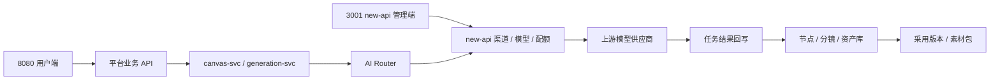
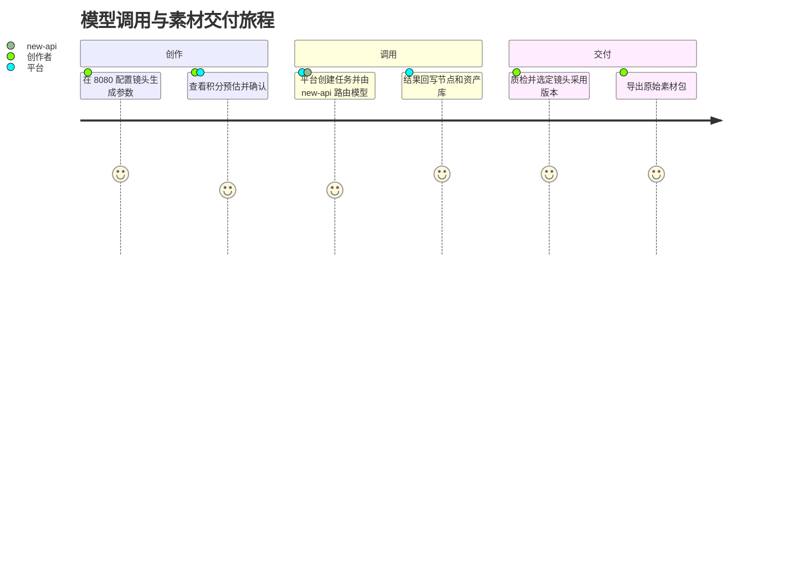
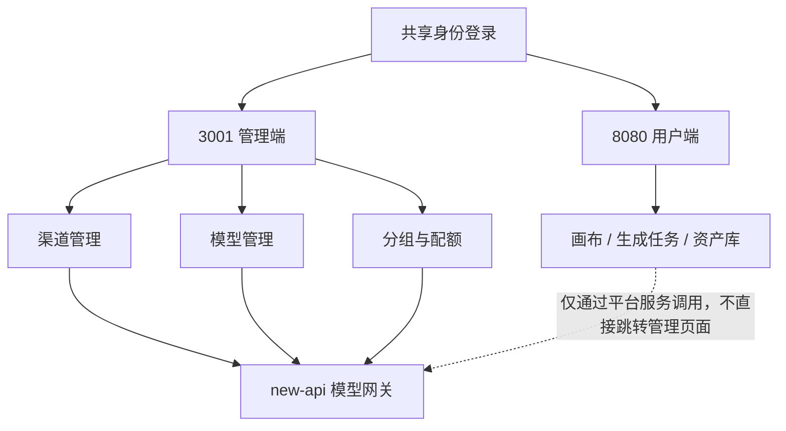
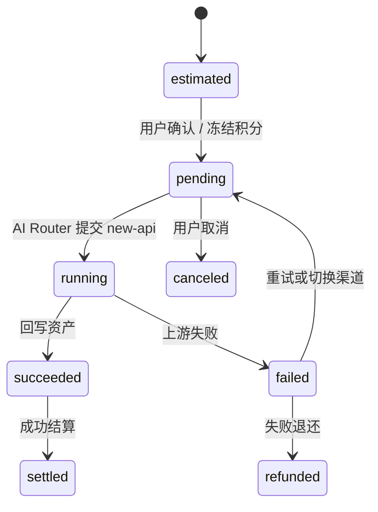

# new-api 对接技术规划 V1.8

> 基于《后端产品功能设计_V1.5.md》与《AI漫剧与视频内容工业化生产工作台 PRD V1.5》  
> 对接目标：[new-api](https://github.com/QuantumNous/new-api) — 新一代 AI 模型聚合管理与分发系统  
> 文档性质：技术规划说明书（Tech Planning Spec）  
> 适用对象：后端、架构、算法、项目管理  
> `[superpowers 更新 V1.8]`：新增 Canvas 生产内核模型适配器管线、CapabilityCompiler、Seedance 供应商 Gate、Blender Worker 集成

---

## 基于 superpowers 的更新记录（2026-07-04 → 2026-07-05）

| 更新项 | 说明 | 依据 superpowers |
|---|---|---|
| **Canvas 生产内核模型管线** `[superpowers 更新 V1.8]` | CapabilityCompiler（Canvas 侧编译模型无关 CapabilityRequest）→ ModelAdapter 版本化预览（推荐模型/费用/素材职责/警告）→ 用户确认→ GenerationRequestSnapshot（不可变）→ AiRouter/new-api 路由→ TaskAttempt→ Candidate；GenerationVariant 写路径废弃 | `canvas-production-kernel-completion-design.md` |
| **Seedance 供应商 Gate** `[superpowers 更新 V1.8]` | 8 项验证（真实 API/鉴权/模型ID/输入限制/异步语义/计费/内容安全/限流）；Gate 未通过只能使用 Provider Sandbox；`model-capabilities/seedance-2.0.json` 版本化能力 profile | `canvas-production-kernel-r3-model-blender.md` |
| **Blender Worker 集成** `[superpowers 更新 V1.8]` | DirectorRevision→Blender Y-up/Z-up 坐标转换→Eevee 预演→FFmpeg 输出；隔离临时目录+镜像固定版本+HMAC 回调签名；幂等重试结构一致 | `canvas-production-kernel-r3-model-blender.md` |
| **generation_tasks 扩展** `[superpowers 更新 V1.8]` | 新增 `request_snapshot_id`、`adapter_version`、`actual_credit_cost`；新增 `generation_task_attempts` 表（task_id/attempt_no/provider_request_id/status） | `canvas-production-kernel-r1-core.md` |

| 更新项 | 说明 | 依据 superpowers |
|---|---|---|
| 统一账户模型 | 明确 3001 为账户中心唯一数据源（用户/工作区/余额/API Key/计费），8080 通过 BFF 适配层调用 | `unified-account-model-billing-design.md` |
| 影子用户映射 | 描述 3001 用户↔8080 完整映射流程（自动注册、双向禁用同步） | `unified-account-model-billing-design.md` |
| AI Router 扩展 | 增加创作圣经上下文注入路径、Agent 会话模型调用路径 | `script-creation-creative-bible-design.md`、`agent-session-completion-design.md` |
| 交易支付链路 | 8080→3001 钱包预扣/结算/退款调用链，双服务财务架构（Outbox + 最终一致性） | `script-trading-market-completion-design.md` |
| 部署拓扑 | 反映 3001 内部 API 端点、8080 新增模块（创作圣经/Agent/交易/资产市场） | 全部 |
| 风险更新 | 视频生成通道扩展 → 已规划、统一身份同步 → 已决策（3001 为唯一源） | `unified-account-model-billing-design.md` |
| 统一任务事件中心 `[superpowers 更新 V1.7]` | new-api 回调 + SSE 推送、任务状态变更事件、供应商侧任务状态回写、SLA 检测集成、任务案例关联 | `unified-task-event-center-design.md` |
| Agent 配置中心 `[superpowers 更新 V1.7]` | 模型调用通道（4 系统蓝图路由规则）、试跑链路、执行快照冻结、配置解析优先级链 | `agent-config-center-design.md` |
| 企业工作台 `[superpowers 更新 V1.7]` | 3001 BFF 适配层（组织/成员/角色/余额查询代理） | `enterprise-workbench-bff-design.md` |
| 资产工作台 `[superpowers 更新 V1.7]` | generation_tasks 扩展（workspace_id/idempotency_key 字段）、统一生成历史+任务监控查询 | `asset-workbench-generation-tasks-design.md` |
| 跨域规范补强 `[superpowers 更新 V1.7]` | 幂等键去重（409 拒绝）、乐观锁并发控制、故障关闭策略（fail-closed） | `cross-domain-specifications-design.md` |

> **注意**：本文档中标注 `[superpowers 更新]` 和 `[superpowers 更新 V1.7]` 的段落为本次新增或修改内容。

---

## 目录

1. [边界划分：new-api 做什么，我们不做什么](#1-边界划分new-api-做什么我们不做什么)
2. [整体对接架构](#2-整体对接架构)
3. [AI Router 设计：我们自建的核心层](#3-ai-router-设计我们自建的核心层)
4. [各微服务与 new-api 的对接关系](#4-各微服务与-new-api-的对接关系)
5. [画布节点生成 → new-api 调用链路](#5-画布节点生成--new-api-调用链路)
6. [多副本并行生成对接](#6-多副本并行生成对接)
7. [全能参考视频引擎对接](#7-全能参考视频引擎对接)
8. [Agent/Skill 与 new-api 的交互](#8-agentskill-与-new-api-的交互)
9. [计费与成本控制方案](#9-计费与成本控制方案)
10. [部署拓扑](#10-部署拓扑)
11. [分期实施路线图](#11-分期实施路线图)
12. [风险与应对](#12-风险与应对)
13. [统一任务事件中心的 new-api 集成](#13-统一任务事件中心的-new-api-集成-superpowers-更新-v17)
14. [Agent 配置中心的模型调用通道](#14-agent-配置中心的模型调用通道-superpowers-更新-v17)

---

## 1. 边界划分：new-api 做什么，我们不做什么

### 1.0 V1.5 对接目标

V1.5 中，new-api 不再只是模型调用代理，而是 AI 视频工业化生产工作台的模型供应商中台。平台所有 LLM、文生图、图生图、文生视频、图生视频、首尾帧视频、全能参考视频、TTS、BGM、音效、质量评分调用都必须通过 AI Router → new-api 进入统一任务体系。

每一次模型调用都必须在平台侧形成 `generation_tasks` 记录，并至少写入：

| 字段 | 要求 |
|---|---|
| `project_id` | 归属项目 |
| `node_id` | 归属画布节点，可为空 |
| `shot_id` | 归属分镜，可为空 |
| `type` | image / video / audio / quality / agent / skill |
| `provider` | new-api 实际路由的供应商 |
| `model_id` | 模型 ID |
| `parameters` | 输入参数 |
| `status` | pending / running / succeeded / failed / canceled |
| `progress` | 进度 |
| `credit_cost` | 消耗算力 |
| `error_code` / `error_message` | 错误追踪 |
| `output_assets` | 输出资产，必须可回写画布和资产库 |

生成前必须支持 `/api/v1/credits/estimate` 算力预估；生成后必须完成节点状态回写、资产入库和成本入账。

### 1.0.1 当前开发基线与闭环要求

当前阶段允许先以单体后端内的 `canvas-svc` + `generation-svc` 跑通闭环，但接口、数据和任务状态必须按未来微服务拆分设计，避免后续重构推翻前端和测试用例。

标准调用链路如下：

```text
前端节点按钮/批量操作
→ /api/v1/credits/estimate 预估积分
→ 用户确认
→ canvas-svc 创建 generation_tasks
→ GenerationExecutor 异步执行
→ AI Router 选择模型和供应商
→ new-api 调用真实模型
→ 任务状态更新为 succeeded / failed
→ 回写 canvas_nodes / storyboard_shots / assets
→ billing-svc 结算或退还积分
→ 前端刷新节点预览、任务日志、资产库
```

开发实现必须区分两类任务字段：

| 字段 | 用途 | 示例 |
|---|---|---|
| `type` | 执行层大类，用于路由到 image / video / audio / quality / agent / skill 执行器 | `image` |
| `sub_type` | 业务动作，用于产品解释、测试断言、计费细分和数据分析 | `storyboard_image`、`image_to_video`、`video_reference` |

成本控制按三个阶段实现：

| 阶段 | 目标 | 最低实现要求 |
|---|---|---|
| 预估 | 用户点击前知道大约消耗 | `/api/v1/credits/estimate` 返回 `estimated_cost`、`balance`、`can_execute` |
| 冻结 | 防止并发任务超额消费 | 创建任务时冻结积分，记录 `credit_transactions` |
| 结算 | 成功扣除、失败退还、部分成功按实际结算 | 任务完成后写入最终 `credit_cost`、失败原因和退还流水 |

P0 最低验收不要求一次性接入所有模型，但必须做到：

| 能力 | P0 验收 |
|---|---|
| 任务可追踪 | 任一生成按钮都会创建 `generation_tasks`，前端能查到状态 |
| 结果可回写 | 生成成功后节点 `output_data` 有结果，资产库有记录 |
| 失败可解释 | new-api 超时、额度不足、参数错误必须写入 `error_code` 和 `error_message` |
| 费用可核对 | 任务记录、用户积分、计费流水三者可对账 |
| 测试可模拟 | 本地环境可用 mock provider 返回固定图片/视频/音频 URL，保证 E2E 不依赖真实模型额度 |

### 1.0.2 LibTV PDF 融合后的模型能力约束

LibTV 指南中暴露的生成能力需要在 AI Router 层抽象为“模型能力矩阵”，前端只展示当前模型可执行的模式，后端提交任务前再次校验。

| 能力 | Router 校验项 | 任务参数 |
|---|---|---|
| 全能参考视频 | 文本、图片、视频、音频混合输入；按模型限制参考文件总数和各类型上限 | `reference_assets`、`reference_roles`、`mode=omni_reference` |
| 首帧/首尾帧 | 与全能参考、多帧参考等入口互斥；严格首尾一致优先走首尾帧模式 | `first_frame_asset_id`、`last_frame_asset_id`、`mode=start_end_frame` |
| Prompt 优化 | 仅对支持的模型展示，优化结果需用户确认填回输入框 | `prompt_optimize=true`、`optimized_prompt` |
| 运镜预设 | 模型适配、景别冲突、主体动作复杂度提示 | `motion_preset_id`、`custom_motion_prompt`、`motion_risk_tips` |
| 主体库 | 仅对支持主体一致性的模型开放；主体描述需拼接进 Prompt | `subject_ids`、`subject_prompt_injection=true` |
| 真人/合规素材 | 真人素材必须通过合规校验，未通过禁止提交到受限模型 | `compliance_status=verified` |
| 图像全景/多角度/焦点编辑 | 路由到图像工具模型或 mock provider，结果统一为图片资产 | `image_tool_type`、`camera_params`、`selected_regions` |
| 视频解析/音频分离 | 解析走视觉理解模型；音频分离走独立媒体工具队列 | `video_tool_type`、`separate_target` |
| 音色克隆 | 样本时长、清晰度和试听状态必须满足最低要求 | `voice_sample_asset_ids`、`voice_quality_scores` |

### 1.1 核心原则

```
new-api = 模型供应商的“聚合层 + 计费层 + 渠道层”
我们的平台 = 漫剧业务的“逻辑层 + 画布引擎 + 资产体系 + 交易体系”
```

### 1.2 职责边界表

| 能力域 | new-api 负责 | 我们的平台负责 | 说明 |
|---|---|---|---|
| **模型供应商对接** | ✅ 对接 OpenAI/Claude/DeepSeek/Kling/Seedance 等 40+ 供应商 | ❌ 不直连供应商 | new-api 的 `relay/channel/` 已实现各供应商适配器 |
| **API Key 管理** | ✅ 管理上游供应商 API Key、渠道负载均衡 | ❌ | new-api 自带 Key Vault |
| **用户配额管理** | ✅ 用户级/组级模型调用次数、Token 配额 | ⚠️ 仅做业务级会员权益判断 | new-api 管底层配额，我们管会员权益（如免费用户每日3次） |
| **模型调用计费** | ✅ 按 Token/次数/时长计费，支持充值 | ✅ 业务级算力预估、用户确认、任务成本记录、会员/算力包权益判断 | new-api 管底层单价和渠道扣费，我们管生产任务的可解释成本和商业化权益 |
| **文本生成（LLM）** | ✅ `/v1/chat/completions` | ✅ 剧本生成编排（6步向导、Prompt模板） | 我们调 new-api，new-api 路由到具体 LLM |
| **图像生成** | ✅ `/v1/images/generations`（OpenAI 兼容） | ✅ 画布图片节点（文生图/图生图/重绘/抠图/镜头聚焦） | 我们调 new-api 图生图接口 |
| **视频生成** | ⚠️ 需扩展（原生不支持） | ✅ 画布视频节点（图生视频/首尾帧/全能参考/续写） | **需在 new-api 中添加视频渠道适配器** |
| **TTS 语音合成** | ✅ `/v1/audio/speech` | ✅ 画布音频节点（TTS/BGM/SFX） | — |
| **多副本并行** | ❌ 不感知 | ✅ 画布多副本创建、参数差异化、结果选择 | 我们并行调用 new-api N 次 |
| **全能参考视频** | ❌ 不感知 | ✅ 多模态素材组合、权重配置、Seedance 路由 | 我们组装请求，调 new-api 视频接口 |
| **画布节点引擎** | ❌ 不感知 | ✅ 节点 CRUD、连线、状态机、版本历史、结果回写 | 纯业务逻辑 |
| **素材交付** | ❌ 不感知 | ✅ 镜头采用版本、素材清单、ZIP 打包与下载 | 不请求模型；不执行视频剪辑或合成 |
| **剧本/资产/交易** | ❌ 不感知 | ✅ 8 个微服务全部业务逻辑 | — |

### 1.4 V1.5 P0 调用场景

| 场景 | 平台动作 | new-api 调用 |
|---|---|---|
| 脚本节点生成分镜 | LLM 拆分场次、镜头、台词、旁白、角色、场景、道具 | `/v1/chat/completions` |
| 批量分镜生图 | 为勾选分镜创建图片任务并回写图片节点 | `/v1/images/generations` 或图像扩展接口 |
| 批量图生视频 | 将图片资产转换为视频节点 | `/v1/video/generations` |
| 首尾帧视频 | 校验首尾帧比例，生成过渡视频 | `/v1/video/generations` |
| 全能参考视频 | 多图、多视频、音频、文本共同参考 | `/v1/video/generations` 扩展请求 |
| 多副本并行生成 | 同 Prompt 创建 2 / 4 / 8 个候选任务 | 并行调用图片或视频接口 |
| 音频生产 | TTS、BGM、音效 | `/v1/audio/speech` 或音频扩展接口 |
| 质量评分 | 对候选结果做一致性、清晰度、运动稳定性评分 | `/v1/chat/completions` 或视觉模型接口 |

### 1.3 一句话总结

> **new-api 是我们的“AI 供应商中台”**：我们不再直连任何模型供应商，所有 AI 调用全部经过 new-api。我们在 new-api 之上构建漫剧业务的 **AI Router + Adapter + 业务编排层**。

---

## 2. 整体对接架构

```
                                    ┌─────────────────────────────────────┐
                                    │            new-api (独立部署)          │
                                    │                                     │
                                    │  ┌───────────────────────────────┐  │
                                    │  │  OpenAI 兼容 API 层             │  │
                                    │  │  /v1/chat/completions          │  │
                                    │  │  /v1/images/generations        │  │
                                    │  │  /v1/audio/speech              │  │
                                    │  │  /v1/video/generations  🆕     │  │
                                    │  └───────────────┬───────────────┘  │
                                    │                  │                  │
                                    │  ┌───────────────┴───────────────┐  │
                                    │  │  渠道路由层 (Channel Router)    │  │
                                    │  │  · 负载均衡    · 故障转移      │  │
                                    │  │  · 优先级排序  · 自动重试      │  │
                                    │  └───────────────┬───────────────┘  │
                                    │                  │                  │
                                    │  ┌───────────────┴───────────────┐  │
                                    │  │  供应商适配器 (relay/channel/)  │  │
                                    │  │  OpenAI│Claude│DeepSeek│Kling  │  │
                                    │  │  Seedance│Minimax│火山│阿里    │  │
                                    │  └───────────────────────────────┘  │
                                    │                                     │
                                    │  自带：计费 │ 配额 │ 限流 │ 多租户   │
                                    └──────────────────┬──────────────────┘
                                                       │
                                          OpenAI 兼容 HTTP API
                                          (统一端点，内部路由)
                                                       │
    ┌──────────────────────────────────────────────────┼──────────────────────────────┐
    │                                                  │         我们的平台             │
    │                                                  │                              │
    │  ┌───────────────────────────────────────────────┴────────────────────────────┐ │
    │  │                         🆕 AI Router (自建核心层)                           │ │
    │  │                                                                            │ │
    │  │  职责：画布任务 → 模型选择 → Adapter 翻译 → new-api 调用 → 结果回写        │ │
    │  │                                                                            │ │
    │  │  ┌─────────────┐  ┌─────────────┐  ┌─────────────┐  ┌─────────────────┐  │ │
    │  │  │ 任务路由器    │  │ 成本预估器  │  │ Adapter 层  │  │ 结果回写器       │  │ │
    │  │  │             │  │             │  │             │  │                 │  │ │
    │  │  │ 节点类型→   │  │ 生成前预估  │  │ txt2img→   │  │ 图片→节点资产  │  │ │
    │  │  │ 模型映射    │  │ 用户确认    │  │ OpenAI格式 │  │ 视频→节点资产  │  │ │
    │  │  │             │  │ 余额校验    │  │ img2video→ │  │ 音频→节点资产  │  │ │
    │  │  │ 质量/成本   │  │             │  │ 扩展格式   │  │ 状态→节点更新  │  │ │
    │  │  │ 排序        │  │             │  │             │  │                 │  │ │
    │  │  └─────────────┘  └─────────────┘  └─────────────┘  └─────────────────┘  │ │
    │  └──────────────────────────────────────┬─────────────────────────────────────┘ │
    │                                         │                                       │
    │  ┌──────────────────────────────────────┼─────────────────────────────────────┐ │
    │  │                              微服务层                                       │ │
    │  │                                                                             │ │
    │  │  user-svc  │ script-gen-svc │ script-repo-svc │ trade-svc │ canvas-svc     │ │
    │  │  (用户)    │ (剧本生成)     │ (剧本仓库)       │ (交易)    │ (画布引擎)     │ │
    │  │            │                │                  │           │         │      │ │
    │  │  asset-market-svc │ sop-svc │ notify-svc │ agent-svc                       │ │
│  │            │                │                  │           │         │      │ │
│  │  🆕 task-event-svc │ 🆕 enterprise-svc │ 🆕 asset-workbench-svc            │ │
│  │  (任务事件中心)    │ (企业工作台 BFF)   │ (资产工作台)                      │ │
│  │                    │                    │                                  │ │
│  │  🆕 agent-config-svc                                                            │ │
│  │  (Agent 配置中心)                                                               │ │
    │  │  (资产市场)       │ (质检)  │ (通知)     │ (Agent/Skill)                   │ │
    │  └─────────────────────────────────────────────────────────────────────────────┘ │
    └──────────────────────────────────────────────────────────────────────────────────┘
```

### 2.1 跨端与模型调用流程图集

#### 2.1.1 总流程图



#### 2.1.2 用户旅程图



#### 2.1.3 页面跳转图



#### 2.1.4 状态流转图



---

## 3. AI Router 设计：我们自建的核心层

AI Router 是我们平台与 new-api 之间的唯一桥梁。**所有 AI 调用必须经过 AI Router**，不允许微服务直连 new-api。

### 3.0 任务事件采集与 SLA 检测 `[superpowers 更新 V1.7]`

`[superpowers 更新 V1.7]` AI Router 层新增以下能力：

- **任务事件采集路径**：生成任务 events → `task_events` 表。每次模型调用从 AI Router → new-api 链路采集 `provider_request_id`、模型、参数、耗时、费用，统一写入任务事件中心。
- **SLA 超时检测集成**：在 Router 层检测模型调用耗时，超过阈值触发 `task_alerts`。包括：生成排队超时、模型执行超时、2 分钟无有效资产、5 分钟无结算回执。
- **资产工作台查询支持**：`generation_tasks` 新增 `workspace_id`、`content_project_id`、`idempotency_key` 字段，支持按 workspace/项目/幂等键查询生成历史与任务监控。

### 3.1 模块架构

```
┌─────────────────────────────────────────────────────────────────┐
│                         AI Router                                │
├─────────────────────────────────────────────────────────────────┤
│                                                                  │
│  ┌─────────────────┐    ┌──────────────────┐                    │
│  │  Task Router     │    │  Cost Estimator  │                    │
│  │                  │    │                  │                    │
│  │  · 节点类型→     │    │  · 模型单价表    │                    │
│  │    模型映射表    │    │  · 用户余额查询  │                    │
│  │  · 质量/成本排序 │    │  · 预估Token数   │                    │
│  │  · 可用性过滤    │    │  · 费用确认流程  │                    │
│  │  · 降级链配置   │    │  · 余额不足拦截  │                    │
│  └────────┬────────┘    └────────┬─────────┘                    │
│           │                      │                               │
│           └──────────┬───────────┘                               │
│                      ▼                                           │
│  ┌──────────────────────────────────────┐                        │
│  │          Adapter Layer               │                        │
│  │                                      │                        │
│  │  ┌──────────┐ ┌──────────┐ ┌──────┐ │                        │
│  │  │ LLM      │ │ Image    │ │Video │ │                        │
│  │  │ Adapter  │ │ Adapter  │ │Adapter│ │                        │
│  │  │          │ │          │ │      │ │                        │
│  │  │ 剧本生成 │ │ 文生图   │ │图生视频│ │                       │
│  │  │ 分镜分析 │ │ 图生图   │ │首尾帧 │ │                       │
│  │  │ 角色提取 │ │ 重绘     │ │全能参考│ │                       │
│  │  │ Prompt   │ │ 抠图     │ │续写   │ │                       │
│  │  │ 优化     │ │ 放大     │ │高清化 │ │                       │
│  │  └────┬─────┘ └────┬─────┘ └──┬───┘ │                        │
│  │       └─────────────┼──────────┘     │                        │
│  │                     ▼                │                        │
│  │           ┌──────────────────┐       │                        │
│  │           │ new-api 调用层    │       │                        │
│  │           │ (HTTP Client)    │       │                        │
│  │           │ 统一鉴权/重试/超时│       │                        │
│  │           └──────────────────┘       │                        │
│  └──────────────────────────────────────┘                        │
│                                                                  │
│  ┌──────────────────────────────────────┐                        │
│  │         Result Writer                │                        │
│  │                                      │                        │
│  │  · 图片 → OSS + asset 表 + 节点回写  │                        │
│  │  · 视频 → OSS + asset 表 + 节点回写  │                        │
│  │  · 文本 → 节点/剧本表回写            │                        │
│  │  · 音频 → OSS + asset 表 + 节点回写  │                        │
│  │  · 失败 → 节点状态 + 错误原因        │                        │
│  │  · 事件 → MQ 发布 NodeGenerated      │                        │
│  └──────────────────────────────────────┘                        │
└─────────────────────────────────────────────────────────────────┘
```

### 3.2 任务路由核心逻辑

```go
// pkg/ai-router/router.go

// RouteRequest 路由请求
type RouteRequest struct {
    TaskType    TaskType          // txt2img / img2video / llm_chat / tts / omni_reference
    InputParams map[string]any    // 画布节点参数
    UserTier    UserTier          // free / creator / enterprise
    PreferredModel string         // 用户指定模型（可选）
}

// RouteResult 路由结果
type RouteResult struct {
    Model       string            // 选中的模型
    Provider    string            // 服务商
    AdapterName string            // 使用的 Adapter
    CostEstimate CostEstimate     // 费用预估
    ChannelID   string            // new-api 渠道 ID
}

// Route 执行路由
func (r *Router) Route(ctx context.Context, req *RouteRequest) (*RouteResult, error) {
    // 1. 根据任务类型查询可用模型列表
    models := r.capabilityRepo.FindByTaskType(req.TaskType)
    
    // 2. 过滤：排除不可用/维护中的模型
    models = r.filterAvailable(models)
    
    // 3. 排序：质量优先 + 成本控制 + 用户等级
    models = r.rankByStrategy(models, req.UserTier)
    
    // 4. 预估成本
    for _, m := range models {
        cost := r.estimator.Estimate(m, req.InputParams)
        if r.balanceCheck(ctx, cost) {
            return &RouteResult{Model: m.Name, CostEstimate: cost, ...}, nil
        }
    }
    
    // 5. 所有模型都超出预算 → 降级
    return r.fallbackRoute(models)
}
```

### 3.3 能力注册表

```sql
-- ai_model_capabilities 表
CREATE TABLE ai_model_capabilities (
    id BIGINT AUTO_INCREMENT PRIMARY KEY,
    provider VARCHAR(100) NOT NULL,          -- 服务商：openai / deepseek / kling / seedance
    model_name VARCHAR(100) NOT NULL,        -- 模型名：gpt-4o / deepseek-v3 / seedance-2.0
    model_version VARCHAR(50),               -- 版本号
    new_api_channel_type VARCHAR(50),        -- new-api 渠道类型
    new_api_channel_id INT,                  -- new-api 渠道 ID
    
    -- 能力标签
    support_llm_chat BOOLEAN DEFAULT FALSE,        -- LLM 对话
    support_txt2img BOOLEAN DEFAULT FALSE,         -- 文生图
    support_img2img BOOLEAN DEFAULT FALSE,         -- 图生图
    support_txt2video BOOLEAN DEFAULT FALSE,       -- 文生视频
    support_img2video BOOLEAN DEFAULT FALSE,       -- 图生视频
    support_start_end_frame BOOLEAN DEFAULT FALSE, -- 首尾帧
    support_omni_reference BOOLEAN DEFAULT FALSE,  -- 全能参考
    support_audio_sync BOOLEAN DEFAULT FALSE,      -- 音画同步
    support_tts BOOLEAN DEFAULT FALSE,             -- TTS
    
    -- 参数限制
    max_duration_sec INT,                     -- 最大视频时长
    max_reference_files INT,                  -- 最大参考文件数
    supported_ratios JSON,                    -- 支持画幅
    supported_resolutions JSON,              -- 支持分辨率
    
    -- 成本
    cost_rule JSON,                           -- 计费规则
    
    -- 路由
    priority INT DEFAULT 100,                 -- 优先级（越小越优先）
    quality_score DECIMAL(2,1) DEFAULT 4.0,   -- 质量评分
    avg_latency_ms INT,                       -- 平均延迟
    
    status ENUM('active','maintenance','disabled') DEFAULT 'active',
    created_at DATETIME DEFAULT CURRENT_TIMESTAMP,
    updated_at DATETIME DEFAULT CURRENT_TIMESTAMP ON UPDATE CURRENT_TIMESTAMP
);
```

### 3.4 模型路由映射表

| 画布任务 | 任务类型 | 优先模型 (new-api 渠道) | 备选模型 | 降级模型 |
|---|---|---|---|---|
| 剧本生成/分镜分析 | `llm_chat` | DeepSeek-V3 | GPT-4o | Claude 3.5 Sonnet |
| 钩子/编导/导演联合审核 | `llm_chat` / `rule_review` | DeepSeek-V3 | GPT-4o | 规则引擎 |
| 文生图 | `txt2img` | Seedream 5.0 | Flux.1 Pro | SD 3.5 |
| 图生图/重绘 | `img2img` | Seedream 5.0 | Flux.1 Pro | SD 3.5 |
| 抠图 | `remove_bg` | 自建模型 | remove.bg API | — |
| 高清放大 | `image_upscale` | Real-ESRGAN | 自建模型 | — |
| 图生视频 | `img2video` | Seedance 2.0 | Kling 3.0 | Runway Gen-4 |
| 首尾帧视频 | `start_end_frame` | Seedance 2.0 | Kling 3.0 | Shot V2 |
| 全能参考视频 | `omni_reference` | Seedance 2.0 | HappyHorse 1.0 | — |
| 视频续写 | `video_extend` | Video 3.1 | Wan 2.6 | — |
| 视频高清 | `video_upscale` | Video 3.1 | Topaz API | — |
| TTS 配音 | `tts` | Minimax 2.8 | 火山引擎 | 阿里云 |
| BGM 生成 | `bgm` | Suno API | MusicGen | — |

---

## 4. 各微服务与 new-api 的对接关系

| 微服务 | 需要 AI 能力 | 调用路径 | 说明 |
|---|---|---|---|
| **script-gen-svc** | LLM 文本生成 + 规则审核 | `script-gen-svc` → AI Router → new-api `/v1/chat/completions` | 源头文本生成、钩子策略、单章正文版本、AI漫剧/短剧/网剧/TVC改编脚本、可选分镜、Prompt优化 |
| **script-repo-svc** | — | 不直接调 AI | 仅存储剧本和资产 |
| **canvas-svc** | 图像/视频/音频生成 | `canvas-svc` → AI Router → new-api 多种端点 | **调用量最大的服务** |
| **agent-svc** | LLM Agent对话 + Tool调用 | `agent-svc` → AI Router → new-api `/v1/chat/completions` | AI 导演决策、Skill 执行 |
| **asset-market-svc** | — | 不直接调 AI | 仅管理资产上架和搜索 |
| **sop-svc** | — | 不直接调 AI | 仅质检逻辑 |
| **user-svc** | — | 不直接调 AI | — |
| **trade-svc** | — | 不直接调 AI | — |
| **notify-svc** | — | 不直接调 AI | — |
| 🆕 **task-event-svc** `[superpowers 更新 V1.7]` | 事件消费 + SSE 推送 | new-api 回调 + SSE 推送 | 消费生成/交易事件，构建统一任务案例（P0） |
| 🆕 **enterprise-svc** `[superpowers 更新 V1.7]` | 3001 内部 API 代理 | 3001 内部 API | 组织/成员/角色/余额查询（P0） |
| 🆕 **agent-config-svc** `[superpowers 更新 V1.7]` | LLM 模型调用 | new-api LLM | 试跑 + 配置解析 + 执行快照冻结（P1） |
| 🆕 **asset-workbench-svc** `[superpowers 更新 V1.7]` | 生成任务查询 | new-api 生成任务 | 任务状态查询 + 结果消费 + 统一生成历史（P0） |

### 4.1 调用量预估

| 服务 | AI 调用类型 | 预估日调用量 | 峰值 QPS |
|---|---|---|---|
| script-gen-svc | LLM Chat | 3,000-10,000 | 10 |
| script-gen-svc | Episode Review | 5,000-20,000 | 20 |
| canvas-svc | Image Gen | 10,000-50,000 | 50 |
| canvas-svc | Video Gen | 1,000-5,000 | 10 |
| canvas-svc | TTS | 5,000-20,000 | 30 |
| agent-svc | LLM Chat | 500-2,000 | 5 |

---

## 5. 画布节点生成 → new-api 调用链路

### 5.1 图片节点：文生图完整链路

```
用户在画布图片节点点击「生成」
  │
  ▼
canvas-svc: POST /projects/:id/image-nodes/:nodeId/txt2img
  │  参数: { prompt, negative_prompt, aspect_ratio, resolution, count, style_id,
  │          character_asset_ids, scene_asset_ids, seed }
  │
  ▼
canvas-svc → AI Router (gRPC): RouteAndGenerate(req)
  │
  ▼
AI Router:
  1. TaskRouter 查询 ai_model_capabilities WHERE support_txt2img=true
     → 候选: [Seedream 5.0 (q=4.8, ¥0.05/img), Flux.1 Pro (q=4.6, ¥0.08/img), SD 3.5 (q=4.2, ¥0.02/img)]
  
  2. CostEstimator 预估:
     Model=Seedream, Count=4, Resolution=1080p → ¥0.20
     用户余额: ¥50.00 → 通过
  
  3. 返回预估给用户确认（前端弹窗：「本次生成4张图，预计消耗 ¥0.20，确认？」）
     ← 用户确认
  
  4. ImageAdapter 组装 OpenAI 兼容请求:
     POST new-api/v1/images/generations
     {
       "model": "seedream-5.0",
       "prompt": "男主站在办公室落地窗前，中景，缓慢推进，国漫风格...",
       "n": 4,
       "size": "1920x1080",
       "response_format": "url",
       "user": "our_user_12345"    // 传我们的用户ID，方便 new-api 端计费
     }
  
  5. new-api 接收到请求 → 根据 model 找到对应渠道 → 转发到 Seedance API
     → 返回图片 URLs
  │
  ▼
AI Router ResultWriter:
  1. 下载图片 → 上传到 OSS
  2. 写入 asset 表（每张图片一个 asset_id）
  3. 写入 canvas_node_versions 表（input_snapshot + output_snapshot）
  4. 更新 canvas_nodes.output_data + status=success
  5. 发布 CanvasNodeGenerated 事件 → MQ
  6. 返回结果给 canvas-svc → 前端
```

### 5.2 视频节点：图生视频 完整链路

```
canvas-svc → AI Router → ImageAdapter → 上传首帧 → VideoAdapter
  → POST new-api/v1/video/generations 🆕
  {
    "model": "seedance-2.0",
    "input_image_url": "https://oss.xxx/xxx.png",
    "prompt": "缓慢推进，男主转身...",
    "duration": 5,
    "aspect_ratio": "16:9",
    "camera_move": "push",
    "motion_strength": 60,
    "user": "our_user_12345"
  }
  → new-api 路由到 Seedance API → 异步任务
  → AI Router 轮询结果 → 下载视频 → OSS → 回写节点
```

### 5.3 脚本节点：批量生成链路

```
canvas-svc: POST /script-nodes/:nodeId/generate-images
  │  请求: { storyboard_rows: [...], batch_size: 4, parallel: true }
  │
  ▼
AI Router 收到批量任务:
  1. 总预估费用: 20行 × 4图 × ¥0.05 = ¥4.00
  2. 用户确认
  3. 并发提交 20×4=80 个图片生成任务到 new-api
     (new-api 侧通过 channel 负载均衡分散到多个供应商 Key)
  4. 收集结果 → 批量写入节点版本表
  5. 按行更新 storyboard_rows[].image_node_id + status
```

---

## 6. 多副本并行生成对接

```
用户对视频节点创建4个副本 (不同Seed+运镜)
  │
  ▼
canvas-svc: POST /video-nodes/:nodeId/duplicates
  {
    "duplicate_count": 4,
    "diff_strategy": "seed_and_camera",
    "diff_params": [
      { "seed": 1001, "camera_move": "push" },
      { "seed": 1002, "camera_move": "pan_left" },
      { "seed": 1003, "camera_move": "orbit" },
      { "seed": 1004, "camera_move": "static" }
    ]
  }
  │
  ▼
canvas-svc 创建 4 个子节点（标记 parent_node_id）
  │
  ▼
AI Router 并行提交 4 个视频生成任务到 new-api:
  ├── Task 1: POST new-api/v1/video/generations { seed: 1001, camera_move: "push" }
  ├── Task 2: POST new-api/v1/video/generations { seed: 1002, camera_move: "pan_left" }
  ├── Task 3: POST new-api/v1/video/generations { seed: 1003, camera_move: "orbit" }
  └── Task 4: POST new-api/v1/video/generations { seed: 1004, camera_move: "static" }
  │
  ▼
4个任务并行执行 → new-api 内部路由到不同/相同渠道
  │
  ▼
全部完成后 → 用户在画布中选择最佳结果
  → POST /nodes/:nodeId/set-main-result { version_id: "v3" }
  → 其他3个副本保留为历史版本
```

---

## 7. 全能参考视频引擎对接

这是 V1.3 的核心差异化能力。new-api 原生不支持此模式，需要在我们的 Adapter 层做转换。

```
用户配置全能参考:
  - 角色图片 (IMG_001) weight=0.8
  - 场景图片 (IMG_002) weight=0.7
  - 参考视频 (VID_001) weight=0.6
  - 参考音频 (AUD_001) weight=0.4
  - Prompt: "男主缓慢转身..."
  │
  ▼
AI Router OmniReferenceAdapter:
  1. 下载所有参考文件
  2. 根据素材组合选择模型:
     图片+视频+音频 → Seedance 2.0 (支持全能参考)
     仅图片 → Seedance 2.0 / Kling 3.0
  3. 组装请求:
     POST new-api/v1/video/generations
     {
       "model": "seedance-2.0",
       "input_reference": [
         { "type": "image", "url": "...", "role": "character", "weight": 0.8 },
         { "type": "image", "url": "...", "role": "scene", "weight": 0.7 },
         { "type": "video", "url": "...", "role": "motion", "weight": 0.6 },
         { "type": "audio", "url": "...", "role": "rhythm", "weight": 0.4 }
       ],
       "prompt": "男主缓慢转身，镜头从中景推进到近景...",
       "duration": 5,
       "user": "our_user_12345"
     }
  4. 如 Seedance 不可用 → 降级到 HappyHorse 1.0（也支持多参考）
  5. 如所有全能参考模型不可用 → 降级到 Kling（仅支持首尾帧）
     → 通知用户「全能参考模式不可用，已降级为首尾帧模式」
```

---

## 8. Agent/Skill 与 new-api 的交互

### 8.0 Agent 配置中心的模型调用通道 `[superpowers 更新 V1.7]`

`[superpowers 更新 V1.7]` Agent 配置中心提供以下能力：

- **配置读取与路由**：Agent 配置中心读取已发布 Agent 配置（4 系统蓝图：HOOK/SCREENWRITER/STORYBOARD/DIRECTOR）→ 解析优先级链（临时参数 > 项目绑定 > 用户默认 > 系统默认）→ 编译 Prompt → 调用 new-api LLM。
- **执行快照冻结**：每次正式执行时保存完整配置快照到 `agent_execution_snapshots`，记录 `blueprint_id`/`version`、`resolved_prompt`、`model_id`。
- **模型调用参数解耦**：模型调用参数由配置解析优先级链决定，不再硬编码在业务服务中。

### 8.1 Agent 决策调用链路

```
用户自然语言指令: "把第3集的角色图全部生成，用国漫风格"
  │
  ▼
agent-svc → AI Router → new-api /v1/chat/completions
  {
    "model": "claude-sonnet-4-6",    // 用最强模型做 Agent 决策
    "messages": [
      { "role": "system", "content": "你是AI导演...可用工具: canvas.create_node, canvas.run_node..." },
      { "role": "user", "content": "把第3集的角色图全部生成，用国漫风格" }
    ],
    "tools": [
      { "type": "function", "function": { "name": "canvas.list_nodes", ... } },
      { "type": "function", "function": { "name": "canvas.run_node", ... } },
      { "type": "function", "function": { "name": "canvas.update_node", ... } }
    ]
  }
  │
  ▼
new-api 路由到 Claude API → 返回 tool_calls
  │
  ▼
agent-svc 执行 tool_calls:
  1. canvas.list_nodes(project_id, type="character")
     → 返回 5 个角色节点，状态为 pending
  2. canvas.update_node(input_data.generator.style_preset="国漫")
     → 设置生成画风参数
  3. canvas.run_node(node_ids=[...]) × 5
     → 每个角色节点触发图片生成
     → AI Router → new-api /v1/images/generations × 5
  │
  ▼
全部生成完成 → agent-svc 回写执行日志
  → 通知用户「5个角色图已生成完成」
```

---

## 9. 计费与成本控制方案

### 9.1 双轨计费模型

```
┌──────────────────────────────────────────────────────┐
│                    计费架构                           │
├──────────────────────────────────────────────────────┤
│                                                      │
│  new-api 层 (底层计费)                                │
│  ┌────────────────────────────────────────────────┐  │
│  │ · 管理上游供应商的实际成本                       │  │
│  │ · 用户充值（微信/支付宝/Stripe）                 │  │
│  │ · 每次 API 调用扣费                             │  │
│  │ · 用户余额/配额管理                             │  │
│  │ · 成本价 = 供应商价格 × 倍数                    │  │
│  └────────────────────────────────────────────────┘  │
│                         │                            │
│                         ▼                            │
│  我们的平台 (业务计费)                                │
│  ┌────────────────────────────────────────────────┐  │
│  │ · 画布任务级算力预估                             │  │
│  │ · 用户确认扣费（前端弹窗）                       │  │
│  │ · 会员权益控制（免费每日3次等）                  │  │
│  │ · 企业算力池管理                                │  │
│  │ · 成本追踪和分析                                │  │
│  └────────────────────────────────────────────────┘  │
└──────────────────────────────────────────────────────┘
```

### 9.1.1 交易支付链路 `[superpowers 更新]`

`[superpowers 更新]` V1.6 引入了脚本交易市场，需要 8080→3001 的钱包操作链路：

```
8080 trade-svc（业务层）
  → POST /api/aicp/wallets/precheck     （余额预检查）
  → POST /api/aicp/wallet-transfers/purchase （创建购买转账）
  → 3001 内部：钱包转账 CREATED → PROCESSING → SUCCEEDED/FAILED
  → 3001 内部：双记账本条目（不可变）
  → 8080 查询：GET /wallet-transfers/by-business-order/{orderNo}
  → 结算：POST /wallet-transfers/{transferNo}/release   （7天后解冻）
  → 退款：POST /wallet-transfers/{transferNo}/reverse   （原路退回）
```

**关键约束**：
- 8080 和 3001 不能共享数据库，通过签名内部 API + 幂等键通信
- 每笔购买创建平衡的借贷记账条目，不可修改（修正通过新 reversal 条目）
- 卖家收入 7 天冻结期后解冻
- 最终一致性通过 Outbox 模式 + 对账保证

### 9.2 费用确认流程

```
AI Router.CostEstimator 预估费用
  │
  ├── 费用 ≤ 阈值（如 ¥1.00）→ 免确认，直接执行
  │
  ├── 费用 > 阈值 → 前端弹窗确认
  │     ├── 个人用户：显示「本次消耗 ¥4.00，余额 ¥50.00」
  │     └── 企业用户：显示「本次消耗 ¥40.00，企业算力池余额 ¥5,000.00」
  │
  └── 余额不足 → 阻止生成，引导充值
```

### 9.3 统一账号体系（V1.6 架构更新）

> **V1.6 架构决策**：`3001` 是用户、Workspace、部门、成员、角色权限、余额和 AI 用量的**唯一事实源**。旧的“影子用户”概念已废弃——`3001` 用户即为平台用户，不存在第二套用户表。

```
3001 账户中心（唯一事实源）        8080 业务域（消费方）
────────────────────────         ──────────────────
user_id                   ←──→   JWT subject (aicp_user_id)
workspace (personal/ent)  ←──→   X-Workspace-Id + WorkspaceContext
department / role / grant ←──→   WorkspaceContext (enriched membership)
wallet balance            ←──→   采购预算对比展示（不存储余额副本）
```

架构规则（替代旧“影子用户”口径）：

1. `3001` 是账号、密码、手机、邮箱、Workspace、部门、成员、角色权限、余额的唯一事实源。
2. `8080` 不复制用户表、企业主数据表或余额表。所有组织写操作通过 BFF 代理到 `3001`。
3. WorkspaceContext 每次受保护请求实时验证 Membership，不使用本地缓存鉴权。
4. 旧 `can_*`、`ent_admin`、`dept_head` 权限已迁移至新权限码（`trade.purchase.approve`、`org.member.manage` 等），附带 WORKSPACE/DEPARTMENT/SELF 数据范围。

充值与会员入口由 `8080` 提供，平台通过内部 API 查询和同步 new-api 底层余额：

```
GET new-api/api/user/balance?platform_user_id=our_user_12345
→ { "balance": 50.00, "quota": { "gpt-4o": 1000, "seedance": 50 } }
```

> 当前状态（2026-06-27）：端口和服务已拆分，但统一登录票据、角色映射、影子用户自动创建及双向禁用同步尚未实现。new-api 本地管理员只用于初始化和调试。

---

## 10. 部署拓扑

```
┌─────────────────────────────────────────────────────────────────┐
│                     Kubernetes Cluster                           │
│                                                                  │
│  ┌─────────────────────┐  ┌─────────────────────────────────┐   │
│  │  new-api (1 Pod)     │  │  我们的平台                      │   │
│  │                      │  │                                  │   │
│  │  · Go Gin 服务       │  │  API Gateway (APISIX) ×2        │   │
│  │  · 本地入口 3001     │  │  BFF (Gin) ×3                   │   │
│  │  · MySQL (共享/独立) │  │                                  │   │
│  │  · Redis (共享/独立) │  │  AI Router ×3                    │   │
│  │                      │  │  ├── TaskRouter                  │   │
│  │  管理界面: 3001      │  │  ├── CostEstimator               │   │
│  │  API端点: 3001       │  │  ├── Adapter层                   │   │
│  │                      │  │  └── ResultWriter                │   │
│  └──────────┬──────────┘  │                                  │   │
│             │              │  微服务 Pods (每个 2-5 副本)      │   │
│             │              │  user-svc │ script-gen-svc       │   │
│             │              │  canvas-svc │ agent-svc │ ...    │   │
│             │              │  🆕 task-event-svc               │   │
│             │              │  🆕 agent-config-svc             │   │
│             │              │  🆕 enterprise-svc (3001 BFF)    │   │
│             │              │  🆕 asset-workbench-svc          │   │
│             │  内网 HTTP   │  Outbox 投递器（trade_outbox、   │   │
│             │              │  asset_outbox、                  │   │
│             │              │  generation_settlement_outbox）  │   │
│             └──────────────┤                                  │   │
│                            │  前端 (Nginx + Vue 3) ×2         │   │
│                            └──────────────────────────────────┘   │
│                                                                  │
│  ┌──────────────────────────────────────────────────────────┐   │
│  │  中间件 (StatefulSet 或云服务)                             │   │
│  │  MySQL 8.0 │ Redis Cluster │ Elasticsearch │ RocketMQ    │   │
│  │  OSS/MinIO │ Prometheus + Grafana + Jaeger              │   │
│  └──────────────────────────────────────────────────────────┘   │
└─────────────────────────────────────────────────────────────────┘
```

### 10.1 new-api 配置要点

| 配置项 | 值 | 说明 |
|---|---|---|
| 数据库 | 与平台共享 MySQL（不同 database）| `new_api` database |
| Redis | 可共享或独立 | 推荐独立 Redis 实例 |
| 供应商 Key | 在 new-api 管理后台配置 | 不暴露给我们的平台 |
| 用户体系 | 3001 为唯一用户事实源（V1.6 起，废弃“影子用户”模式） | 8080 通过 JWT + WorkspaceContext 消费，不复制用户表 |
| 管理端权限 | 仅 `platform_admin` / `operator` | 普通创作者不得访问管理界面 |
| 内部调用 | 生产环境仅允许网关/AI Router 访问 API | 本地联调管理与 API 入口均为 `3001` |

本地端口固定为：`3001` new-api 管理端与模型网关、`8080` AICP 用户端、`5173` AICP Vite 调试入口。生产环境可使用容器内部端口映射，但对外职责不得混用。

---

## 11. 分期实施路线图

### 第一阶段（2-3周）：基础设施搭建

| 任务 | 产出 |
|---|---|
| 部署 new-api（Docker/K8s） | new-api 运行，配置 3-5 个 LLM 渠道 |
| 搭建 AI Router 骨架 | TaskRouter + 基础 Adapter（LLM + 文生图） |
| 🔄 实现 Workspace 底座（V1.6 已完成） | `ListActiveWorkspacesForUser`、enriched `MembershipResult`、部门/成员/角色/邀请 CRUD、billing-summary 端点 |
| script-gen-svc 对接 | 源头文本生成、改编脚本、钩子策略、分阶段审核走 AI Router；MVP 可规则引擎降级 |
| 计费联调 | 确认 new-api 扣费 + 我们平台余额查询通 |

### 第二阶段（3-4周）：画布核心对接

| 任务 | 产出 |
|---|---|
| 图片节点对接 | 文生图、图生图、重绘走 new-api |
| 视频节点对接 | 在 new-api 中扩展视频渠道（Kling/Seedance） |
| 音频节点对接 | TTS 走 new-api `/v1/audio/speech` |
| 批量生成对接 | 脚本节点批量生图走并发调用 |
| ResultWriter 完善 | 自动回写资产表和节点表 |

### 第三阶段（2-3周）：高级能力

| 任务 | 产出 |
|---|---|
| 全能参考视频 | OmniReferenceAdapter 开发 + Seedance 2.0 渠道对接 |
| 多副本并行 | 副本创建 + 并行提交 + 结果选择 |
| Agent/Skill 对接 | agent-svc 通过 new-api 调用 LLM 决策 |
| SOP 质检联动 | 生成前成本检查 + 余额拦截 |

### 第四阶段（1-2周）：优化与上线

| 任务 | 产出 |
|---|---|
| 降级策略 | 模型不可用时的自动切换 |
| 成本追踪面板 | 按用户/项目/节点类型的成本报表 |
| 压测 | 日调用量 10 万级压力测试 |
| 灰度上线 | 10% → 50% → 100% 流量切换 |

---

## 12. 风险与应对

| 风险 | 影响 | 概率 | 应对 |
|---|---|---|---|
| new-api 不支持视频生成 | 画布视频节点无法走统一网关 | 高 | **在 new-api 中扩展视频渠道**（参考其 `relay/channel/` 模式添加 Kling/Seedance 适配器）。new-api 是开源的，可以 PR 贡献或 fork |
| new-api 单点故障 | 所有 AI 调用中断 | 中 | new-api 部署多副本 + 我们的 AI Router 内置 fallback 直连（紧急模式） |
| 供应商 API 格式变更 | Adapter 报错 | 中 | new-api 社区活跃（38K stars），通常会及时更新。必要时 fork 自行维护 |
| 成本失控 | 用户批量生成导致高额费用 | 中 | AI Router 层做费用预估 + 用户确认 + 日预算上限 + 企业审批流 |
| 视频生成异步等待 | 用户体验差 | 低 | WebSocket/SSE 实时推送生成进度，不阻塞画布操作 |
| 8080↔3001 数据一致性 `[superpowers 更新]` | 交易订单与钱包状态不一致 | 中 | Outbox 模式 + 幂等键 + 定期对账；3001 账本不可变 |
| 统一账号同步延迟 `[superpowers 更新]` | 用户禁用/权限变更不及时 | 低 | 决策：3001 为唯一数据源；8080 关键路径实时查询（不缓存授权信息） |
| 3001 不可用故障关闭 `[superpowers 更新 V1.7]` | 所有依赖 3001 的操作中断 | 中 | 所有依赖 3001 的操作必须 fail-closed（返回 503 + Retry-After），禁止 mock 成功；关键路径实施断路器模式 |
| 幂等键去重风险 `[superpowers 更新 V1.7]` | 相同 key 不同 payload 导致重复扣费 | 中 | 相同 key 不同 payload 必须拒绝（409 Conflict），防止重复扣费；幂等键格式统一为 `{service}_{entity}_{idempotency_key}` |
| Workspace ID 格式不一致 `[superpowers 更新 V1.7]` | 跨服务路由错误、数据归属混乱 | 低 | 统一 `personal_{userId}` / `enterprise_{enterpriseId}` 格式；所有服务在入口层校验并标准化 |
| Outbox 投递失败 `[superpowers 更新 V1.7]` | 事件丢失导致跨服务数据不一致 | 中 | 指数退避重试 → 死信队列 → 告警 → 人工介入；定期对账兜底 |

---

## 13. 统一任务事件中心的 new-api 集成 `[superpowers 更新 V1.7]`

`[superpowers 更新 V1.7]` 任务事件中心（task-event-svc）负责统一消费所有生成/交易事件，构建可追溯的任务案例。

### 13.1 事件采集链路

```
生成任务 events 从 AI Router → new-api 链路采集
  │
  ├── provider_request_id  (new-api 侧请求 ID)
  ├── model                (实际使用的模型)
  ├── parameters           (输入参数快照)
  ├── duration_ms          (调用耗时)
  ├── credit_cost          (费用)
  └── → task_events 表
```

### 13.2 SSE 推送机制

8080 任务事件中心通过 SSE（Server-Sent Events）向客户端实时推送任务状态变更：

| 事件类型 | 触发条件 | 推送内容 |
|---|---|---|
| `task.created` | generation_task 创建 | task_id、type、status=pending |
| `task.progress` | 进度更新 | task_id、progress%、estimated_remaining |
| `task.completed` | 任务成功 | task_id、output_assets、credit_cost |
| `task.failed` | 任务失败 | task_id、error_code、error_message |
| `task.alert` | SLA 检测触发 | task_id、alert_type、threshold、actual |

### 13.3 供应商侧任务状态回写

```
new-api 异步任务完成
  → new-api 回调 webhook (POST /api/callback/new-api/task-status)
  → Domain Event Adapter 转换为平台事件格式
  → Task Event Store 写入 task_events + 更新 generation_tasks.status
  → SSE 推送到订阅客户端
```

### 13.4 SLA 检测集成

| 检测项 | 阈值 | 触发动作 |
|---|---|---|
| 生成排队超时 | > 60s 未进入 running | 创建 `task_alerts` 记录 + SSE 推送 |
| 模型执行超时 | > 300s 模型侧未返回 | 取消任务 + 退还积分 + 通知用户 |
| 2 分钟无有效资产 | succeeded 后 120s 内无 output_assets | 标记异常 + 触发人工审核 |
| 5 分钟无结算回执 | succeeded 后 300s 内 credit_cost=0 | 触发对账 + 告警 |

### 13.5 任务案例关联

`task_case_links` 表记录任务与外部案例的关联：

```sql
CREATE TABLE task_case_links (
    id BIGINT AUTO_INCREMENT PRIMARY KEY,
    task_id BIGINT NOT NULL,                    -- generation_tasks.id
    link_type VARCHAR(50) NOT NULL,             -- 'generation_task'
    external_id VARCHAR(255) NOT NULL,          -- new-api provider_request_id
    created_at DATETIME DEFAULT CURRENT_TIMESTAMP,
    UNIQUE KEY uk_task_link (task_id, link_type, external_id)
);
```

---

## 14. Agent 配置中心的模型调用通道 `[superpowers 更新 V1.7]`

`[superpowers 更新 V1.7]` Agent 配置中心（agent-config-svc）作为模型调用的配置管理层，解耦业务服务与模型参数。

### 14.1 4 系统蓝图与模型路由

| 蓝图 (Blueprint) | 英文标识 | 用途 | 默认模型 |
|---|---|---|---|
| 钩子 | HOOK | 剧本钩子策略分析 | DeepSeek-V3 |
| 编剧 | SCREENWRITER | 剧本生成与改编 | DeepSeek-V3 / GPT-4o |
| 分镜师 | STORYBOARD | 分镜拆分与优化 | DeepSeek-V3 |
| 导演 | DIRECTOR | AI 导演决策与 Skill 编排 | Claude Sonnet 4 |

### 14.2 试跑调用链路

```
前端触发试跑
  → AgentConfigService 读取已发布配置
  → 解析优先级链：临时参数 > 项目绑定 > 用户默认 > 系统默认
  → 编译最终 Prompt（含创作圣经上下文注入）
  → AI Router → new-api LLM
  → 返回输出 + token 统计 + 费用
  → 写入 agent_test_runs 表
```

### 14.3 执行快照冻结

每次正式执行时保存完整配置快照到 `agent_execution_snapshots`：

```sql
CREATE TABLE agent_execution_snapshots (
    id BIGINT AUTO_INCREMENT PRIMARY KEY,
    blueprint_id VARCHAR(50) NOT NULL,          -- HOOK/SCREENWRITER/STORYBOARD/DIRECTOR
    blueprint_version INT NOT NULL,             -- 配置版本号
    resolved_prompt TEXT NOT NULL,              -- 编译后的完整 Prompt
    model_id VARCHAR(100) NOT NULL,             -- 实际使用的模型
    parameters JSON,                            -- 解析后的模型参数
    token_usage JSON,                           -- token 消耗统计
    credit_cost DECIMAL(10,4),                  -- 费用
    created_at DATETIME DEFAULT CURRENT_TIMESTAMP
);
```

### 14.4 配置解析优先级链

最终模型调用参数由以下优先级链决定（高到低）：

1. **临时参数**：单次调用时前端/调用方传入的覆盖参数
2. **项目绑定**：`content_project_id` 绑定的 Agent 配置版本
3. **用户默认**：用户在 Agent 配置中心设置的默认值
4. **系统默认**：平台级别的全局默认配置

任何低优先级配置会在高优先级配置存在时被覆盖。业务服务不再硬编码模型参数，全部从 Agent 配置中心读取。

---

> **文档状态**：V1.7 修订版（基于 superpowers 增量更新）
> **编写日期**：2026-06-15  
> **最后修订**：2026-07-04
> **依赖文档**：《后端产品功能设计_V1.5.md》、`docs/superpowers/specs/` 下统一账户模型/交易市场设计/任务事件中心/Agent配置中心/企业工作台/资产工作台
> **后续步骤**：AI Router 联调 → new-api 视频渠道扩展 → 交易支付链路 8080↔3001 联调 → 任务事件中心 + Agent 配置中心联调
