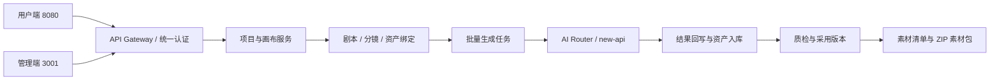
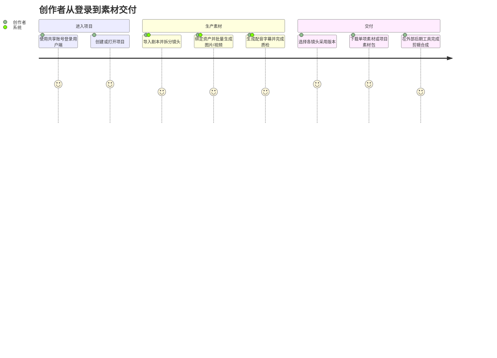
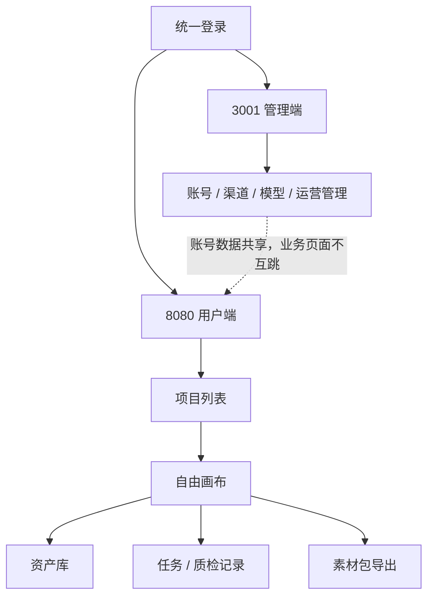
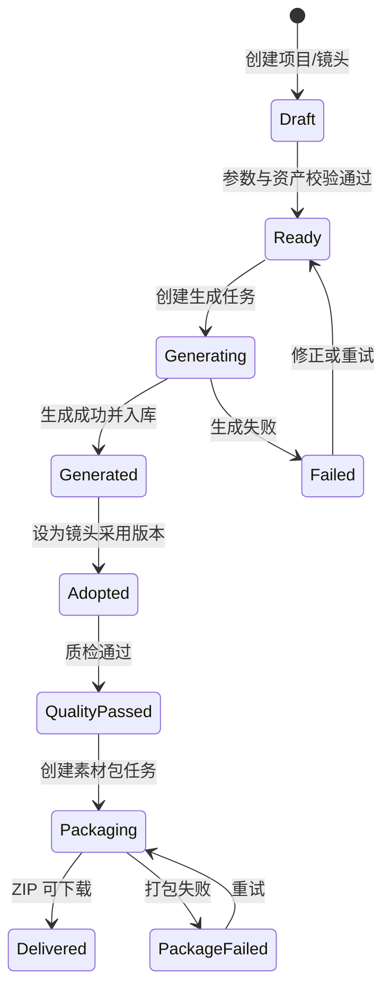

# AI漫剧与视频内容工业化生产工作台 · 后端产品功能设计（V1.5修订版）

> 基于《后端产品功能设计_母版_DEPRECATED.md》作为母版进行迭代  
> 融合《AI 视频创作自由画布产品 PRD V1.2》与《AI漫剧与视频内容工业化生产工作台 PRD V1.5》的画布、节点、Agent/Skill、资产联动与视频生产功能  
> 覆盖版本：V1.0 → V1.1 → V1.2 → V1.3 → V1.5  
> 文档性质：后端功能规格说明书 + 画布功能迭代 PRD + Agent/Skill 接入设计  
> 适用对象：产品、后端、前端、算法、架构、测试、项目管理

---

## 基于 superpowers 的更新记录（2026-07-04）

本文档基于 `docs/superpowers/` 下的最新设计文档进行了增量更新，主要变更：

| 更新项 | 说明 | 依据 superpowers |
|---|---|---|
| 架构定位 | 标注当前为模块化单体部署，微服务拓扑为目标架构；3001 为账户中心唯一数据源 | `unified-account-model-billing-design.md` |
| 新增域：创作圣经 | `module/creativebible`：`creative_bible_versions`、`ecosystem_rules`、`project_writing_guides`、`generation_context_snapshots`；ContextAssembler 集成 | `script-creation-creative-bible-design.md` |
| 新增域：Agent 会话 | `module/agent`：`agent_sessions`、`agent_messages`、`agent_plans`、`agent_plan_steps`、`agent_events`；Tool Registry + WritingAgentFacade + CanvasAgentFacade | `agent-session-completion-design.md` |
| 新增域：交易市场 | `module/trade`：`script_listings`、`trade_orders`、`script_entitlements`、`purchased_script_copies`；3001 钱包对接 | `script-trading-market-completion-design.md` |
| 新增域：资产管理 | `module/asset`：`workspace_assets`、`market_listings`、`asset_entitlements` 等 6 表；WorkspaceContextFilter | `ai-asset-market-completion-design.md` |
| 扩展域：分镜系统 | 双轨分镜（`storyboard_shots` + `cp_storyboard_*`）→ 统一专业分镜域（`module/storyboard`），13 维镜头编辑 + A/B/C 层级版本 | `storyboard-professional-editor-redesign.md` |
| 扩展域：内容项目 | `content_project_profiles`、`project_setting_entities`；五类设定 CRUD；生命周期状态；审计日志 | `work-editor-evolution-design.md`、`script-creation-warehouse-flow-design.md` |
| 扩展域：画布 | `canvas_projects` 增加内容项目归属字段；生产快照/源 diff/生产准入；浮动编辑器改造；独立空白画布 | `platform-home-canvas-center-design.md`、`canvas-node-floating-editor-design.md`、`standalone-blank-canvas-design.md` |
| 账户/计费模型 | 8080 不再维护用户/工作区/余额主数据，通过 BFF 适配层调用 3001 版本化 API | `unified-account-model-billing-design.md` |
| **新增域：统一任务事件中心** | `module/taskevent`：`task_cases`、`task_events`、`task_attempts`、`task_alerts`、`reconciliation_cases`；跨服务任务案例聚合+SSE 事件流+SLA 告警+用户/运营双视图 | `2026-07-04-unified-task-event-center-design.md` |
| **新增域：资产工作台** | `module/assetworkbench`：合并旧 AssetHistory + TaskMonitor 为统一资产工作台；`workspace_assets` 扩展字段+`asset_activity_logs`+`canvas_asset_placements`；项目树+分类+详情三栏布局 | `2026-07-04-asset-generation-history-workbench-design.md` |
| **新增域：企业工作台** | `module/enterprise`：领域化渐进完成；组织成员管理(BFF→3001)；采购预算治理(`enterprise_purchase_budgets`+`_entries`)；统一审批投影(`enterprise_approval_items`)；跨域审计索引 | `2026-07-04-enterprise-workbench-completion-design.md` |
| **新增域：Agent 配置中心** | `module/agentconfig`：独立 Agent 配置模型，4 系统蓝图(钩子/编剧/分镜/导演)；`user_agent_definitions`+`agent_versions`+`agent_bindings`；结构化+高级双编辑模式；草稿/校验/试跑/发布/回滚生命周期 | `2026-07-04-user-configurable-agent-center-design.md` |
| **扩展域：生产 SOP 完成** | 双界面架构(项目控制台+画布质检侧栏)；规则引擎 13 项准入规则；返工工单闭环；6 个生产 Gate；修复策略(自动/确认/手动) | `2026-07-04-production-sop-completion-design.md` |
| **跨域规范补强** | 幂等键(Idempotency-Key)强制要求；乐观锁(row_version/If-Match)；故障关闭(3001 不可用→503)；不可变快照机制；Outbox 模式确保最终一致性 | 全部 07-04 superpowers |

> **注意**：本文档中标注 `[superpowers 更新 V1.7]` 的段落为 2026-07-04 新增或修改内容。标注 `[superpowers 更新]` 的段落为 07-02 之前的更新。未标注的原有内容保持不变，作为历史基线参考。

---

## 变更说明

| 版本 | 变更重点 |
|---|---|
| V1.0 | 第一周期后端 MVP：用户、剧本生成、剧本仓库、画布项目、分镜卡片、导出 |
| V1.1 | 交易、资产市场、企业中心、生产 SOP、权限审批 |
| V1.2 | 画布节点引擎、脚本流水线、导演台、多模态参考、Agent 协作雏形 |
| V1.3 | 以 AI 视频创作自由画布 PRD 为基础，对 `canvas-svc` 进行系统化增强：无限画布、节点体系、节点下游菜单、全能参考、多副本生成、角色/场景/道具资产联动、镜头采用版本管理、Agent/Skill 自动执行、OpenAPI、Adapter、SOP 质检闭环 |
| V1.5 | 以“AI 漫剧与视频内容工业化生产工作台”为最终定位，后端支撑项目、画布、节点、连线、分镜、资产、批量生成、素材清单与打包导出、工作流、Agent/Skill 的生产闭环；P0 新增双击建节点、拖入素材建节点、脚本全屏编辑、钩子策略与每集联合审核、批量生图/视频、图片拉出视频节点、首尾帧视频、全能参考、多副本并行、资产历史生成、Agent 会话/Skill 调用。平台不提供视频剪辑、视频拼接、转场特效、音视频混合或多轨编辑能力 |

## V1.5 后端补强摘要

V1.5 不再把 `canvas-svc` 理解为“画布页面接口”，而是将其升级为生产编排核心。后端需要提供以下稳定能力：

```text
项目管理
→ 画布状态持久化
→ 节点创建 / 拖拽 / 连线 / 打组
→ 脚本节点分镜解析
→ 批量图片 / 视频 / 音频生成任务
→ 资产入库与历史检索
→ 镜头采用版本与素材包导出任务
→ 工作流模板保存与执行
→ Agent / Skill 调用平台 Tool
```

### V1.5 P0 数据表补强

| 表 | 目的 | 关键字段 |
|---|---|---|
| `canvas_nodes` | 画布节点持久化 | `id`、`project_id`、`type`、`name`、`x`、`y`、`width`、`height`、`input_data`、`output_data`、`status`、`locked`、`group_id` |
| `canvas_edges` | 节点连线与依赖 | `id`、`project_id`、`source_node_id`、`source_port`、`target_node_id`、`target_port`、`edge_type` |
| `storyboard_shots` | 画布分镜生产单元（canvas 模块） | `id`、`storyboard_id`、`project_id`、`shot_no`、`scene_no`、`duration`、`shot_size`、`camera_motion`、`visual_description`、`characters`、`scene_asset_id`、`image_prompt`、`video_prompt`、`image_status`、`video_status` |
| `cp_storyboard_masters` | 内容项目分镜 Master（content-project 模块，V7） | `id`、`uuid`、`project_id`、`content_unit_id`、`tier`、`status`、`total_shots`、`estimated_duration_sec`、`source_version_id`、`locked_by`、`locked_at`、`revision` |
| `cp_storyboard_scenes` | 内容项目场景卡片（content-project 模块，V7） | `id`、`master_id`、`scene_no`、`dramatic_goal`、`beat_description`、`location_id`、`character_ids`、`duration_sec`、`sort_order` |
| `cp_storyboard_shots` | 内容项目镜头（content-project 模块，V7） | `id`、`uuid`、`scene_id`、`master_id`、`shot_no`、`shot_type`、`duration_sec`、`description`、`camera_action`、`dialogue_ref`、`visual_ref_url`、`status`、`sort_order` |
| `assets` | 生成结果和手动资产沉淀 | `id`、`team_id`、`project_id`、`source_node_id`、`type`、`name`、`file_url`、`thumbnail_url`、`prompt`、`model_id`、`parameters`、`metadata`、`tags`、`favorite` |
| `generation_tasks` | 异步生成与成本追踪 | `id`、`project_id`、`node_id`、`shot_id`、`type`、`provider`、`model_id`、`parameters`、`status`、`progress`、`credit_cost`、`error_code`、`error_message`、`output_assets` |
| `episode_review_reports` | 每集联合审核报告 | `id`、`script_id`、`episode_id`、`overall_status`、`overall_score`、`hook_score`、`showrunner_score`、`director_score`、`report_json` |
| `skills` | Skill 配置与市场化 | `id`、`name`、`description`、`content`、`type`、`version`、`visibility`、`permissions`、`capabilities`、`owner_id`、`status` |

> **V7 架构说明（2026-06-30）**：本项目包含两套分镜体系：
> - **canvas 模块** `storyboard_shots` — 画布生产单元，与画布节点、资产、生成任务联动
> - **content-project 模块** `cp_storyboard_*` — 内容项目分镜 Master/Scene/Shot，用于剧本创作阶段生成 A/B/C 档分镜
> 
> 两套表通过 `CanvasBridgeService` 桥接：`cp_storyboard_shots` → canvas nodes。不要混淆两套表的字段和用途。
> 
> 内容项目模块（V7）新增了 24 张表（M0-M4）、9 个 Controller、23 个 Service。所有项目端点已接入 `ProjectAccessService` 细粒度鉴权。AI 响应解析统一使用 `AiResponseParser` 共享工具类。详见 `docs/superpowers/specs/2026-06-29-script-creation-v7-prd.md`。

### V1.5 P0 接口补强

| 能力域 | 接口 | 方法 | 说明 |
|---|---|---|---|
| 画布 | `/api/v1/canvas/projects/{id}/nodes` | POST | 创建节点，支持双击坐标、左侧栏、右键、Agent 自动创建 |
| 画布 | `/api/v1/canvas/projects/{id}/nodes/{nodeId}` | PATCH/PUT | 更新节点位置、名称、配置、输入输出、状态 |
| 画布 | `/api/v1/canvas/projects/{id}/nodes/positions` | PATCH | 批量更新坐标，支撑拖拽与自动排版 |
| 画布 | `/api/v1/canvas/projects/{id}/nodes/connect` | POST | 创建节点连线，表达上下游依赖；可在后续兼容 `/connections` 别名 |
| 画布 | `/api/v1/canvas/projects/{id}/groups` | POST | 创建节点组，支撑工作流模板 |
| 分镜 | `/api/v1/storyboards/{id}/parse` | POST | AI 拆分镜头、台词、旁白、角色、场景、道具 |
| 分镜 | `/api/v1/storyboards/{id}/generate-images` | POST | 批量分镜生图，状态回写分镜行和图片节点 |
| 分镜 | `/api/v1/storyboards/{id}/generate-videos` | POST | 批量图生视频，状态回写分镜行和视频节点 |
| 生成 | `/api/v1/generation/tasks/{id}` | GET | 查询生成任务状态、成本、输出资产 |
| 生成 | `/api/v1/generation/tasks/{id}/cancel` | POST | 取消任务 |
| 生成 | `/api/v1/generation/tasks/{id}/retry` | POST | 失败重试 |
| 算力 | `/api/v1/credits/estimate` | POST | 预估算力消耗，Agent 执行前必须调用 |
| Agent | `/api/v1/agent/sessions` | POST | 创建 Agent 会话 |
| Agent | `/api/v1/agent/sessions/{id}/messages` | POST | 发送自然语言任务并生成执行计划 |
| 剧本审核 | `/api/v1/script/review/preview` | POST | 对未入库单集正文执行钩子/编导/导演联合审核 |
| 剧本审核 | `/api/v1/script/review/episodes/{episodeId}` | POST/GET | 对已入库分集执行或查询联合审核 |
| Skill | `/api/v1/skills/{id}/execute` | POST | 执行 Skill，结果回写画布和资产库 |

### V1.5 开发执行基线

本节作为前端、后端、测试共同使用的开发基线。V1.5 首要目标不是堆更多静态页面，而是跑通“画布节点 -> 生成任务 -> new-api -> 结果回写 -> 资产入库 -> 积分结算”的生产闭环。

#### 1. 技术与工程基线

| 项目 | 基线要求 |
|---|---|
| Java 版本 | 后端编译目标使用 Java 17，避免本地 JDK 与 Maven target 不匹配 |
| 项目 ID | 前后端均按 UUID 字符串传递，后端不得强制按纯数字解析 |
| 节点 ID | API 层使用 UUID，数据库内部可保留自增 ID；服务层负责互相解析 |
| 异步任务 | 节点生成、批量生成、导出、Agent/Skill 执行不得阻塞 HTTP 请求 |
| 任务入口 | 画布相关生成统一由 `CanvasService` 创建 `generation_tasks` 后交给 `GenerationExecutor` |
| 模型调用 | `GenerationExecutor` 只能通过 AI Router / new-api 客户端调用模型，不允许业务服务直连供应商 |

#### 2. 后端 Definition of Done

| 能力 | 必须完成 |
|---|---|
| 节点 CRUD | 创建、更新、删除、批量坐标保存、刷新后恢复 |
| 连线 | 使用 `/nodes/connect` 创建连线，校验节点归属、端口类型和重复连线 |
| 复制副本 | `duplicate` 复制节点输入输出，并保留与原节点相关的上下游连线关系 |
| 任务创建 | 每个生成按钮都创建 `generation_tasks`，写入 `project_id`、`node_id`、`shot_id`、`type`、`sub_type`、`status`、`credit_cost` |
| 任务执行 | pending -> running -> succeeded / failed 状态可查询，失败写入错误码和错误信息 |
| 结果回写 | 成功结果写入 `canvas_nodes.output_data`，分镜任务回写 `storyboard_shots`，文件资产写入 `assets` |
| 积分 | 创建任务前支持预估，执行时冻结，成功结算，失败退还，流水可追踪 |
| 可观测性 | 任务 ID、请求 ID、模型、供应商、耗时、错误原因必须进入日志 |

#### 3. 前端对接口径

| 前端行为 | 后端契约 |
|---|---|
| 双击新建节点 | POST `/api/v1/canvas/projects/{projectId}/nodes`，传入世界坐标、节点类型和默认尺寸 |
| 拖拽节点 | PATCH `/api/v1/canvas/projects/{projectId}/nodes/positions`，节流保存多个节点坐标 |
| 端口连线 | POST `/api/v1/canvas/projects/{projectId}/nodes/connect`，传入 source/target 节点和端口 |
| 创建副本 | POST `/api/v1/canvas/projects/{projectId}/nodes/{nodeId}/duplicate`，前端成功后重新加载节点和连线 |
| 点击生成 | 先 POST `/api/v1/credits/estimate`，确认后再创建任务 |
| 查看结果 | 根据任务状态刷新节点 `output_data`、资产库和右侧任务日志 |

#### 4. 测试验收口径

| 测试类型 | 用例要求 |
|---|---|
| 接口测试 | 节点 CRUD、连线、复制副本、任务创建、任务查询、任务失败、积分不足 |
| 数据库测试 | `canvas_nodes`、`canvas_edges`、`generation_tasks`、`assets`、`credit_transactions` 数据一致 |
| E2E 测试 | 创建脚本节点 -> 拆分分镜 -> 批量生图 -> 图生视频 -> 设为采用版本 -> 导出项目素材包 |
| 异常测试 | new-api 超时、余额不足、参数缺失、删除上游节点、重复提交、刷新页面 |
| 回归测试 | 复制副本后连线仍存在，刷新后节点位置不变，失败任务可重试且不会重复扣费 |

---

## 目录

1. [总体架构设计](#1-总体架构设计)
2. [微服务拆分与职责](#2-微服务拆分与职责)
3. [API网关设计](#3-api网关设计)
4. [服务一：用户与账户服务](#4-服务一用户与账户服务)
5. [服务二：剧本生成服务](#5-服务二剧本生成服务)
6. [服务三：剧本仓库服务](#6-服务三剧本仓库服务)
7. [服务四：交易与支付服务](#7-服务四交易与支付服务)
8. [服务五：AI资产市场服务](#8-服务五ai资产市场服务)
9. [服务六：画布与视频工作台服务（V1.3增强版）](#9-服务六画布与视频工作台服务v13增强版)
10. [服务七：工业化生产SOP服务](#10-服务七工业化生产sop服务)
11. [服务八：通知与消息服务](#11-服务八通知与消息服务)
12. [AI/ML推理编排层](#12-aiml推理编排层)
13. [存储架构设计](#13-存储架构设计)
14. [异步任务与消息队列](#14-异步任务与消息队列)
15. [多租户架构](#15-多租户架构)
16. [安全与合规](#16-安全与合规)
17. [监控与可观测性](#17-监控与可观测性)
18. [部署架构与基础设施](#18-部署架构与基础设施)
19. [版本迭代计划（后端）](#19-版本迭代计划后端)
20. [附录：核心数据模型ER图](#20-附录核心数据模型er图)
21. [附录：自由画布 PRD 融合映射表](#21-附录自由画布-prd-融合映射表)

---


## 1. 总体架构设计

### 1.1 架构选型

```
┌─────────────────────────────────────────────────────────────┐
│                      客户端层                                │
│  ┌──────────┐  ┌──────────┐  ┌──────────┐  ┌─────────────┐ │
│  │ Web (Vue)│  │ 企业后台  │  │ API Client  │               │ │
│  └────┬─────┘  └────┬─────┘  └────┬─────┘  └──────┬──────┘ │
│       └──────────────┴─────────────┴───────────────┘        │
├─────────────────────────────────────────────────────────────┤
│                      CDN / WAF / DDoS                       │
├─────────────────────────────────────────────────────────────┤
│                   🆕 API Gateway (Kong / APISIX)             │
│        ┌──────────────┬──────────────┬──────────────┐       │
│        │ 认证/鉴权    │ 限流/熔断    │ 路由/负载    │       │
│        └──────────────┴──────────────┴──────────────┘       │
├─────────────────────────────────────────────────────────────┤
│                      BFF Layer (Backend For Frontend)        │
│  ┌──────────┐  ┌──────────┐  ┌──────────┐  ┌────────────┐  │
│  │ Web BFF  │  │ Admin    │  │ Open API   │               │  │
│  │          │  │ BFF      │  │ BFF        │               │  │
│  └────┬─────┘  └────┬─────┘  └────┬─────┘  └──────┬─────┘  │
├───────┴──────────────┴─────────────┴───────────────┴────────┤
│                    核心微服务层                               │
│  ┌─────────┐ ┌─────────┐ ┌─────────┐ ┌─────────────────┐   │
│  │用户账户 │ │剧本生成 │ │剧本仓库 │ │交易与支付       │   │
│  │Service  │ │Service  │ │Service  │ │Service          │   │
│  └────┬────┘ └────┬────┘ └────┬────┘ └───────┬─────────┘   │
│  ┌────┴────┐ ┌────┴────┐ ┌────┴────┐ ┌───────┴─────────┐   │
│  │AI资产   │ │画布视频 │ │生产SOP  │ │通知与消息       │   │
│  │市场     │ │工作台   │ │Service  │ │Service          │   │
│  │Service  │ │Service  │ │         │ │                 │   │
│  └────┬────┘ └────┬────┘ └────┬────┘ └───────┬─────────┘   │
├───────┴──────────────┴─────────────┴───────────────┴────────┤
│                   AI/ML 推理编排层                            │
│  ┌──────────┐ ┌──────────┐ ┌──────────┐ ┌──────────────┐   │
│  │LLM推理   │ │图像生成  │ │视频生成  │ │TTS/ASR      │   │
│  │(GPT/DS)  │ │(SD/Flux) │ │(Kling/   │ │(火山/阿里)  │   │
│  │          │ │          │ │Seedance) │ │             │   │
│  └──────────┘ └──────────┘ └──────────┘ └──────────────┘   │
├─────────────────────────────────────────────────────────────┤
│                   中间件与基础设施                            │
│  ┌──────┐ ┌──────┐ ┌──────┐ ┌──────┐ ┌──────┐ ┌──────┐   │
│  │MySQL │ │Redis │ │  ES  │ │ OSS  │ │  MQ  │ │ K8s  │   │
│  └──────┘ └──────┘ └──────┘ └──────┘ └──────┘ └──────┘   │
└─────────────────────────────────────────────────────────────┘
```

### 1.2 技术栈推荐

| 层级 | 技术选型 | 说明 |
|------|---------|------|
| **API网关** | Kong / APISIX | 统一入口、认证、限流、路由 |
| **BFF** | Node.js (Express/Fastify) 或 Go (Gin) | 前端适配层，聚合后端服务 |
| **微服务** | Go (Kratos) 或 Java (Spring Cloud) | 核心业务服务 |
| **服务通信** | gRPC (内部) + REST (对外) | 同步调用 |
| **消息队列** | RocketMQ / Kafka | 异步任务、事件驱动 |
| **数据库** | MySQL 8.0 (主库) + Redis (缓存) + Elasticsearch (搜索) | 持久化 + 缓存 + 全文检索 |
| **对象存储** | 阿里云OSS / AWS S3 / MinIO | 图片/视频/模型文件存储 |
| **容器编排** | Kubernetes (K8s) | 服务部署与弹性伸缩 |
| **服务网格** | Istio (可选) | 高级流量管理 |
| **监控** | Prometheus + Grafana + Jaeger | 指标+链路追踪 |
| **日志** | ELK (Elasticsearch + Logstash + Kibana) 或 Loki | 集中日志 |
| **CI/CD** | GitLab CI / GitHub Actions / ArgoCD | 持续交付 |

### 1.3 全局流程图集

#### 1.3.1 总流程图



#### 1.3.2 用户旅程图



#### 1.3.3 页面跳转图



#### 1.3.4 状态流转图



---


## 2. 模块化架构与职责

> **当前状态（V1.5）：模块化单体（Modular Monolith）**
> 
> 实际部署为单一 Spring Boot 应用（`aicp-backend`），所有业务模块通过 Java package 隔离，
> 共享同一 JVM 和数据源。new-api（Go）独立部署作为 AI API 网关。
> 
> **未来路线**：当单模块性能或团队规模需要时，可按以下领域边界逐步拆分为独立微服务。

### 2.1 模块职责矩阵

| 模块名 | Package | 职责 | 核心领域 | 优先级 |
|--------|---------|------|---------|:---:|
| **用户与账户模块** | `module.auth` + `module.user` | 注册/登录/认证/个人中心/企业中心/权限（注：账户主数据由 3001 管理，8080 通过 BFF 适配层调用） | 用户、企业、角色权限 | P0 |
| **内容项目模块** | `module.contentproject` | 内容项目 CRUD、自适应工作流、不可变参数版本、内容单元/版本、生成任务编排（取代旧 `module.script` 剧本生成） | 内容项目、工作流、版本、生成任务 | P0 |
| **创作圣经模块** `[superpowers 更新]` | `module.creativebible` | 创作圣经版本管理、生态系统规则、实体设定、三层写作指南、连续性快照、上下文快照 | 创作圣经、世界构建、写作指南 | P0 |
| **剧本仓库模块** | `module.script` | 剧本 CRUD、4轴标签、版本管理、L0-L4资产；兼容旧 `scripts` 表读取 | 剧本、标签、版本、资产 | P0 |
| **交易市场模块** `[superpowers 更新]` | `module.trade` | 脚本交易市场、四种许可证（免费/普通/独家/买断）、订单/支付、权益/交付、退款/争议；双服务财务架构（8080 业务 + 3001 账本） | 交易、支付、授权、退款 | P1 |
| **AI资产市场模块** `[superpowers 更新]` | `module.asset` | 资产管理（`workspace_assets`、`market_listings`、`asset_entitlements` 等 6 表）；WorkspaceContextFilter 租户隔离；企业发布审批 | 资产、市场、租户隔离 | P0 |
| **画布视频工作台模块** | `module.canvas` | 画布编排、节点浮动编辑器、画布项目归属、生产准入/源快照/diff、批量生成、采用版本、素材包导出 | 画布、节点、视频、素材清单、导出 | P0 |
| **专业分镜模块** `[superpowers 更新]` | `module.storyboard` | 统一专业分镜编辑器，13 维镜头编辑、A/B/C 层级版本、XLSX 双向导入导出、审查门禁、画布快照（替换旧 `storyboard_shots` + `cp_storyboard_*` 双轨） | 分镜、版本、审查、快照 | P0 |
| **工业化生产SOP模块** | `module.sop` | 生产准入、审计返工、版本锁定、产能估算 | SOP、审计、权限 | P1 |
| **通知与消息模块** | `module.notify` | 站内通知、邮件、短信、浏览器推送 | 通知、消息 | P0 |
| **Agent与Skill模块** `[superpowers 更新]` | `module.agent` | Agent 会话持久化、结构化计划审批/执行、SSE 事件流、Tool Registry（READ/WRITE/BILLABLE 分级）、WritingAgentFacade + CanvasAgentFacade、信用预留/结算 | Agent、会话、计划、Tool、信用 | P0 |
| **统一任务事件中心模块** `[superpowers 更新 V1.7]` | `module.taskevent` | 跨服务任务案例聚合（生成+交易）、SSE 事件流、SLA 告警/对账/补偿工单；用户任务中心+运营控制台双视图；命令路由回源业务域 | 任务案例、事件流、SLA、对账 | P0 |
| **资产工作台模块** `[superpowers 更新 V1.7]` | `module.assetworkbench` | 合并旧 AssetHistory + TaskMonitor 为统一资产工作台；`workspace_assets` 为唯一资产本体（`media_type`≠`asset_type`）；项目树+分类+详情三栏；批量整理/发布/回收站 | 资产工作台、生成历史、任务监控 | P0 |
| **企业工作台模块** `[superpowers 更新 V1.7]` | `module.enterprise` | 领域化渐进完成：组织管理(BFF→3001)、采购预算治理(`enterprise_purchase_budgets`+`_entries`)、统一审批投影(`enterprise_approval_items`)、跨域审计索引；角色化概览 | 企业工作台、预算、审批、审计 | P0 |
| **Agent 配置中心模块** `[superpowers 更新 V1.7]` | `module.agentconfig` | 独立 Agent 配置模型（替代旧 `prompt_templates`）；4 系统蓝图(钩子/编剧/分镜/导演)；`user_agent_definitions`+`agent_versions`+`agent_bindings`；结构化+高级双编辑模式；草稿/校验/试跑/发布/回滚生命周期；执行快照冻结 | Agent 配置、蓝图、版本、绑定 | P0 |
| **独立空白画布** `[superpowers 更新 V1.7]` | `module.canvas` (扩展) | 允许仅凭名称创建画布（无需内容项目绑定），`purpose=experiment` 默认；生产 Gate 在正式生图/生视频/导出时强制检查上游绑定 | 画布、独立创建、实验 | P1 |
| **AI API 网关** | `new-api/` (Go, 独立部署) | 40+ AI 提供商聚合、渠道管理、配额计费；同时作为账户中心唯一数据源（用户/工作区/余额/API Key 主数据） | AI 路由、计费、限流、账户中心 | P0 |

### 2.2 当前部署架构

```
                         ┌──────────────────┐
                         │   用户/前端 SPA   │
                         └────────┬─────────┘
                                  │
                    ┌─────────────┼──────────────┐
                    ▼             ▼              ▼
           ┌────────────┐ ┌────────────┐ ┌──────────────┐
           │ 端口 8080   │ │ 端口 3001   │ │ 端口 5173     │
           │ AICP 后端   │ │ new-api    │ │ Vite Dev     │
           │ Spring Boot │ │ Go/Gin     │ │ (开发环境)    │
           │ (模块化单体) │ │ (AI网关)   │ │              │
           └──────┬─────┘ └──────┬─────┘ └──────────────┘
                  │              │
        ┌─────────┼──────┐       │
        ▼         ▼      ▼       ▼
   ┌────────┐ ┌──────┐ ┌──────┐ ┌──────────────┐
   │ MySQL  │ │Redis │ │MinIO │ │ 40+ AI 提供商 │
   │  8.0   │ │  7   │ │      │ │ (OpenAI等)   │
   └────────┘ └──────┘ └──────┘ └──────────────┘
                       ▼
                ┌──────────┐
                │sop-svc   │
                │(生产SOP) │
                └──────────┘
```

### 2.3 事件驱动通信

各服务通过MQ发布领域事件，解耦核心流程：

| 事件 | 发布方 | 消费方 |
|------|--------|--------|
| `UserRegistered` | user-svc | notify-svc（发欢迎通知） |
| `ContentProjectCreated` | contentproject-svc | creative-bible-svc（初始化创作圣经草稿）、notify-svc |
| `BibleVersionConfirmed` `[superpowers 更新]` | creative-bible-svc | context-assembler（刷新上下文快照）、notify-svc |
| `ContentVersionLocked` | contentproject-svc | storyboard-svc（解锁分镜创建）、canvas-svc（解锁画布导入） |
| `ScriptGenerated` | script-gen-svc | script-repo-svc（自动入库）、notify-svc |
| `ScriptListed` | script-repo-svc | trade-svc（上架）、notify-svc |
| `OrderPaid` `[superpowers 更新]` | trade-svc | script-repo-svc（权益授权）、3001（钱包转账）、notify-svc |
| `AssetPublished` | asset-market-svc | canvas-svc（缓存更新）、notify-svc |
| `CanvasExportCompleted` | canvas-svc | notify-svc（导出完成通知） |
| `AuditFailed` | sop-svc | notify-svc（审计失败通知） |
| `AssetLocked` | script-repo-svc | sop-svc（审计触发）、canvas-svc |
| `AgentPlanApproved` `[superpowers 更新]` | agent-svc | canvas-svc、contentproject-svc（执行已批准计划） |
| `AgentStepCompleted` `[superpowers 更新]` | agent-svc | canvas-svc（更新节点）、notify-svc（推送进度） |
| `AgentSessionCostSettled` `[superpowers 更新]` | agent-svc | billing-svc（信用结算入账） |
| `SkillPublished` | agent-svc | notify-svc、asset-market-svc |
| `CanvasNodeGenerated` | canvas-svc | script-repo-svc、asset-market-svc、sop-svc |
| `TradeOutboxEvent` `[superpowers 更新]` | trade-svc | 3001（通过 Outbox 模式确保最终一致性） |
| `SettingExtractionApplied` `[superpowers 更新]` | contentproject-svc | creative-bible-svc（标记圣经草稿需更新）、context-assembler（刷新上下文） |

---


## 3. API网关设计

### 3.1 路由策略

| 路由前缀 | 目标服务 | 认证要求 | 限流策略 |
|----------|---------|:---:|------|
| `/api/v1/auth/*` | user-svc | 无（登录/注册） | 100次/分钟/IP |
| `/api/v1/user/*` | user-svc | JWT Token | 1000次/分钟 |
| `/api/v1/enterprise/**` | enterprise-svc (8080 BFF) | JWT + X-Workspace-Id + WorkspaceContext 权限码 | 2000次/分钟 |
| `/api/v1/script/gen/*` | script-gen-svc | JWT Token | 50次/分钟（AI调用） |
| `/api/v1/script/repo/*` | script-repo-svc | JWT Token | 500次/分钟 |
| `/api/v1/trade/*` | trade-svc | JWT Token | 200次/分钟 |
| `/api/v1/asset/*` | asset-market-svc | JWT Token | 500次/分钟 |
| `/api/v1/canvas/*` | canvas-svc | JWT Token | 300次/分钟 |
| `/api/v1/sop/*` | sop-svc | JWT + 企业角色 | 500次/分钟 |
| `/api/v1/notify/*` | notify-svc | JWT Token | 500次/分钟 |
| `/openapi/v1/*` | Open API BFF | API Key + 签名 | 按套餐 |
| `/admin/api/*` | Admin BFF | JWT + 管理员 | 1000次/分钟 |

### 3.2 统一认证流程

```
客户端请求
    → API Gateway 提取 Token
        → 调用 user-svc 验证 Token
            → 解析用户ID + 角色 + 权限列表
                → 注入 Header：X-User-ID, X-User-Role, X-Permissions
                    → 转发到目标微服务
```

### 3.3 API规范（OpenAPI 3.0）

所有API遵循统一规范：

- **请求格式**：JSON（GET参数用Query String）
- **响应格式**：
```json
{
  "code": 0,
  "message": "success",
  "data": { },
  "request_id": "uuid",
  "timestamp": 1717843200
}
```
- **错误码**：统一5位错误码体系（见附录）
- **分页**：`?page=1&page_size=20`，响应含 `total`、`has_more`
- **版本控制**：URL路径版本 `/api/v1/`、`/api/v2/`

---


## 4. 服务一：用户与账户服务

> **服务ID**：`user-svc`  
> **优先级**：P0  
> **职责**：用户注册/登录/认证、个人中心、企业中心、角色权限管理

`[superpowers 更新]` **V1.6 架构决策**：`3001`（new-api）已确定为账户中心的**唯一数据源（Single Source of Truth）**。用户、个人工作区、企业工作区、成员、角色、余额、API Key、模型目录、模型定价、计费等所有账户相关数据的主数据均由 `3001` 管理。`8080` 不得维护这些数据的重复副本。

`8080` 中的 `user-svc` 当前仍负责注册/登录/认证流程，但账户主数据的读写将逐步迁移至通过 BFF 适配层调用 `3001` 的版本化 API。短期允许 `8080` 维护只读展示缓存，但授权、配额检查、计费等关键路径必须实时查询 `3001`。

**关键 3001 内部 API**（`8080` → `3001`）：

| 方法 | 路径 | 说明 |
|------|------|------|
| GET | `/api/aicp/workspaces` | 当前用户可用 Workspace 列表 |
| GET | `/api/aicp/workspaces/{id}/membership` | 验证成员身份，返回 enriched：`department_id`、`roles[]`、`permissions[]`、`permission_grants[]` |
| GET/POST | `/api/aicp/workspaces/{id}/departments` | 部门查询与创建 |
| PATCH/DELETE | `/api/aicp/workspaces/{id}/departments/{deptId}` | 部门变更与停用 |
| GET | `/api/aicp/workspaces/{id}/members` | 成员分页 |
| POST | `/api/aicp/workspaces/{id}/invitations` | 邀请成员 |
| PATCH | `/api/aicp/workspaces/{id}/members/{memberId}` | 成员变更 |
| GET/POST | `/api/aicp/workspaces/{id}/roles` | 角色查询与创建 |
| PATCH | `/api/aicp/workspaces/{id}/roles/{roleId}` | 角色权限变更 |
| GET | `/api/aicp/workspaces/{id}/billing-summary` | 余额与 AI 用量摘要 |
| GET | `/api/aicp/models/available` | 查询可用模型列表及定价 |
| POST | `/api/aicp/wallets/precheck` | 余额预检查 |
| POST | `/api/aicp/wallet-transfers/purchase` | 创建购买转账 |

> **详细设计见**：`docs/superpowers/specs/2026-06-28-unified-account-model-billing-design.md`

### 4.1 核心API

| 方法 | 路径 | 说明 | 版本 |
|------|------|------|:---:|
| POST | `/api/v1/auth/register` | 用户注册（手机/邮箱） | V1.0 |
| POST | `/api/v1/auth/login` | 账号密码登录 | V1.0 |
| POST | `/api/v1/auth/login/sms` | 短信验证码登录 | V1.0 |
| POST | `/api/v1/auth/login/wechat` | 微信OAuth登录 | V1.0 |
| POST | `/api/v1/auth/login/sso` | 企业SSO登录 | V1.2 |
| POST | `/api/v1/auth/send-code` | 发送验证码（短信/邮箱） | V1.0 |
| POST | `/api/v1/auth/refresh-token` | 刷新Token | V1.0 |
| POST | `/api/v1/auth/logout` | 登出 | V1.0 |
| GET | `/api/v1/user/profile` | 获取个人信息 | V1.0 |
| PUT | `/api/v1/user/profile` | 更新个人信息 | V1.0 |
| POST | `/api/v1/user/verify/real-name` | 实名认证 | V1.0 |
| GET | `/api/v1/user/membership` | 获取会员状态 | V1.1 |
| POST | `/api/v1/user/membership/upgrade` | 升级会员 | V1.1 |
| GET | `/api/v1/user/api-keys` | 管理API Key | V1.2 |
| POST | `/api/v1/user/api-keys` | 创建API Key | V1.2 |
| DELETE | `/api/v1/user/api-keys/:id` | 删除API Key | V1.2 |
| 🔄 GET | `/api/v1/enterprise/context` | 企业上下文（菜单+allowedActions） | V1.6 |
| 🔄 GET | `/api/v1/enterprise/departments` | 部门列表（BFF → 3001） | V1.6 |
| 🔄 POST/DELETE | `/api/v1/enterprise/departments/**` | 部门管理（BFF → 3001） | V1.6 |
| 🔄 GET | `/api/v1/enterprise/members` | 成员分页（BFF → 3001） | V1.6 |
| 🔄 PATCH | `/api/v1/enterprise/members/{id}` | 成员变更（BFF → 3001） | V1.6 |
| 🔄 POST | `/api/v1/enterprise/invitations` | 邀请成员（BFF → 3001） | V1.6 |
| 🔄 GET/POST/PATCH | `/api/v1/enterprise/roles/**` | 角色管理（BFF → 3001） | V1.6 |
| 🔄 GET | `/api/v1/enterprise/approvals` | 统一审批分页 | V1.6 |
| 🔄 POST | `/api/v1/enterprise/approvals/{type}/{id}/decisions` | 审批决定 | V1.6 |
| 🔄 GET | `/api/v1/enterprise/budgets` | 采购预算 | V1.6 |
| 🔄 GET | `/api/v1/enterprise/audit-events` | 审计事件 | V1.6 |

> **V1.6 架构说明**：以上 🔄 标记的企业端点已从 `user-svc` 迁移至 `enterprise-svc`（8080 BFF），所有组织、成员、角色写入通过 BFF 代理到 `3001` 账户中心。旧版 `/enterprise/register`、`/enterprise/profile`、`/enterprise/dashboard` 等端点已下线。`3001` 是 Workspace、部门、成员、角色、余额的唯一事实源。

### 4.2 数据模型

#### 用户表 `users`

| 字段 | 类型 | 说明 |
|------|------|------|
| `id` | BIGINT PK | 用户ID |
| `uuid` | VARCHAR(36) UK | 对外暴露UUID |
| `phone` | VARCHAR(20) UK | 手机号（加密存储） |
| `email` | VARCHAR(255) UK | 邮箱（加密存储） |
| `wechat_openid` | VARCHAR(128) UK | 微信OpenID |
| `password_hash` | VARCHAR(255) | 密码哈希 |
| `nickname` | VARCHAR(100) | 昵称 |
| `avatar_url` | VARCHAR(500) | 头像URL |
| `account_type` | ENUM('personal','enterprise') | 账户类型 |
| `real_name_status` | ENUM('unverified','pending','verified') | 实名状态 |
| `member_level` | ENUM('free','creator','enterprise') | 会员等级 |
| `member_expire_at` | DATETIME | 会员到期时间 |
| `status` | ENUM('active','disabled','deleted') | 账户状态 |
| `last_login_at` | DATETIME | 最后登录时间 |
| `last_login_ip` | VARCHAR(45) | 最后登录IP |
| `created_at` | DATETIME | 创建时间 |
| `updated_at` | DATETIME | 更新时间 |

#### 企业表 `enterprises`

| 字段 | 类型 | 说明 |
|------|------|------|
| `id` | BIGINT PK | 企业ID |
| `owner_user_id` | BIGINT FK | 企业管理员 |
| `name` | VARCHAR(200) | 企业名称 |
| `license_number` | VARCHAR(100) | 营业执照号 |
| `license_image_url` | VARCHAR(500) | 营业执照图片 |
| `verify_status` | ENUM('unverified','pending','verified','rejected') | 认证状态 |
| `member_limit` | INT | 成员上限 |
| `created_at` | DATETIME | 创建时间 |

#### 企业成员表 `enterprise_members`

| 字段 | 类型 | 说明 |
|------|------|------|
| `id` | BIGINT PK | — |
| `enterprise_id` | BIGINT FK | 企业ID |
| `user_id` | BIGINT FK | 用户ID |
| `role` | VARCHAR(50) | 角色（admin/dept_head/writer/artist/editor/reviewer） |
| `permissions` | JSON | 11项细粒度权限 |
| `department` | VARCHAR(100) | 所属部门 |
| `status` | ENUM('pending','active','disabled') | 状态 |
| `joined_at` | DATETIME | 加入时间 |

### 4.3 认证流程

**JWT Token设计**：
```json
{
  "sub": "user_uuid",
  "uid": 12345,
  "type": "personal|enterprise",
  "ent_id": 100,        // 企业用户携带
  "role": "admin",
  "permissions": ["can_generate_script", "can_purchase_script", ...],
  "iat": 1717843200,
  "exp": 1717929600
}
```

**Token刷新策略**：
- Access Token：有效期2小时
- Refresh Token：有效期30天，存储在Redis中
- 企业SSO Token：与企业IdP同步过期

#### 4.3.1 双端统一身份流程

```text
用户在 8080 登录
  -> user-svc 校验账号并签发平台 JWT
  -> 访问 8080：按个人/企业业务权限进入创作工作台
  -> 访问 3001：鉴权网关校验 platform_admin / operator 角色
  -> 签发短时单点登录票据或交换 new-api 会话
  -> new-api 按 platform_user_id 查找或创建影子用户
```

| 领域 | 唯一事实源 | new-api 处理范围 |
|---|---|---|
| 账号、密码、手机、邮箱 | `user-svc` | 不重复存储平台登录凭据 |
| 企业、成员、平台角色 | `user-svc` | 接收角色/分组映射结果 |
| 渠道、模型、上游密钥 | new-api | 独立管理，仅管理员可见 |
| API 令牌、调用配额、底层账单 | new-api | 绑定 `platform_user_id`，回传平台业务层 |
| 漫剧项目、画布、资产、交易 | AICP 业务服务 | new-api 不感知业务数据 |

角色映射最低要求：`super_admin` 映射 new-api Root，`operator` 映射 new-api Admin；个人创作者和普通企业成员不得进入 `3001` 管理界面，但其生成任务可通过 `8080 -> AI Router -> new-api` 使用对应配额。

> 当前状态（2026-06-27）：统一身份流程尚未落地，new-api 本地 `admin` 账号仅用于初始化与联调，不作为正式账号源。

### 4.4 权限模型（RBAC）

```
角色(Role)
  ├── 平台角色：super_admin / operator / content_reviewer
  ├── 个人角色：free_user / creator_member
  └── 企业角色：ent_admin / dept_head / writer / artist / editor / reviewer

权限(Permission) — 11项企业细粒度权限
  ├── can_generate_script
  ├── can_purchase_script
  ├── can_purchase_asset
  ├── can_generate_video
  ├── can_export_no_watermark
  ├── can_manage_assets
  ├── can_approve_purchase
  ├── can_approve_export
  ├── can_manage_members
  ├── can_access_api
  └── can_view_analytics
```

---


## 5. 服务二：剧本生成服务

> **服务ID**：`script-gen-svc`  
> **优先级**：P0  
> **职责**：源头小说/故事文本生成、单章正文版本、AI漫剧/短剧/网剧/TVC 改编脚本生成、可选分镜生成、钩子策略与分阶段审核、A/B/C三档分镜升级、与LLM/图像模型交互

### 5.0 修订边界：剧本资产工作台

剧本生成服务不产出“一次性最终稿”，而是产出可被用户继续编辑、可版本化、可出售、可导入画布的剧本资产包。后端必须保证生成任务、剧本保存、版本快照、画布导入之间的数据结构一致。

**标准数据流**：

```text
gen_tasks.output_data
→ scripts / script_episodes / chapter_versions
→ adaptation_versions（可选）
→ storyboard_versions / storyboard_shots（可选）
→ canvas.import-script(snapshot)
→ canvas shots / nodes
```

**P0落地约束**：

| 约束 | 后端要求 |
|---|---|
| 生成任务一致性 | 创建、执行、查询统一使用`gen_tasks`，生成结果写入`output_data` |
| 上下文连续 | Step2-6必须接收用户已修订的上一阶段内容，不得只依赖AI原始输出 |
| 钩子策略 | Step1/Step3/Step4 必须保存源头钩子、章节钩子、章尾留白和改编继承关系 |
| 分阶段审核 | 正文阶段为钩子/编辑/连续性审核；改编阶段为钩子/改编/编导审核；分镜阶段为编导/导演/生产审核 |
| 完整保存 | 保存已产生资产；源头正文必须保存，改编脚本、分镜、投流素材允许为空 |
| 上传解析 | 上传接口只创建解析任务，前端通过任务ID轮询真实状态 |
| 改编脚本 | AI漫剧/短剧/网剧/TVC 默认从源头小说/故事文本生成，并保存 `adaptation_versions` |
| 分镜Master | 分镜由用户主动从源头正文或改编脚本生成；画布导入时生成生产快照 |
| 画布导入 | `import-script`必须支持`script_id`、`source_version`、`coupling_mode`、`shots` |
| 出售资产 | 上架时按基础剧本包/创作包/生产包/工业包控制可见资产范围 |

### 5.1 核心API

| 方法 | 路径 | 说明 | 版本 |
|------|------|------|:---:|
| POST | `/api/v1/script/gen/topic` | Step1: 爆款选题生成 | V1.0 |
| POST | `/api/v1/script/gen/synopsis` | Step2: 故事梗概生成 | V1.0 |
| POST | `/api/v1/script/gen/outline` | Step3: 分集大纲生成 | V1.0 |
| POST | `/api/v1/script/gen/episode` | Step4: 单集剧本生成 | V1.0 |
| POST | `/api/v1/script/gen/adaptation` | Step5: 源头文本改编为 AI漫剧/短剧/网剧/TVC 脚本 | V1.0 |
| POST | `/api/v1/script/gen/storyboard` | Step5: 分镜脚本生成（A/B/C档） | V1.0 |
| POST | `/api/v1/script/gen/promotion` | Step6: 投流素材生成 | V1.2 |
| POST | `/api/v1/script/gen/quick` | 快速模式（生成剧本资产初稿） | V1.0 |
| POST | `/api/v1/script/gen/storyboard/upgrade` | 分镜升档（A→B→C） | V1.1 |
| GET | `/api/v1/script/gen/task/:task_id` | 查询生成任务状态 | V1.0 |
| GET | `/api/v1/script/gen/tasks` | 生成历史列表 | V1.0 |
| POST | `/api/v1/script/review/preview` | 未入库单集联合审核（不落库） | V1.0 |
| POST | `/api/v1/script/review/episodes/:episode_id` | 已入库单集联合审核（生成报告） | V1.0 |
| GET | `/api/v1/script/review/episodes/:episode_id` | 获取单集最新审核报告 | V1.0 |
| POST | `/api/v1/script/review/episodes/:episode_id/approve` | 用户确认审核通过 | V1.0 |
| GET | `/api/v1/script/repo/scripts/:script_id/chapters` | 获取章节正文列表 | V1.0 |
| PATCH | `/api/v1/script/repo/chapters/:chapter_id` | 更新单章正文 | V1.0 |
| POST | `/api/v1/script/repo/chapters/:chapter_id/versions` | 保存单章正文版本 | V1.0 |
| GET | `/api/v1/script/repo/adaptations` | 查询改编脚本版本 | V1.0 |
| POST | `/api/v1/script/repo/adaptations` | 保存改编脚本版本 | V1.0 |

### 5.2 生成任务编排引擎

```
用户请求 → 参数校验 → 创建生成任务(状态:pending)
    → 推入任务队列
        → Worker消费 → 调用AI推理层
            ├── Step1: LLM → 选题方向
            ├── Step2: LLM → 故事梗概
            ├── Step3: LLM + HookAgent → 分章/分集大纲 + 章节钩子
            ├── Step4: LLM → 源头正文 → 钩子/编辑/连续性审核
            ├── Step5: LLM → 改编脚本 → 钩子/改编/编导审核
            ├── Step6: LLM → A档分镜 / B档导演意图 / C档生产表
            └── Step7: LLM → 投流素材
        → 更新任务状态(completed/failed)
            → 发布 ScriptGenerated 事件
```

### 5.3 AI编排配置

| 步骤 | AI模型 | 输入 | 输出 | 平均耗时 | 并发限制 |
|------|--------|------|------|:---:|:---:|
| Step1 选题 | LLM (DeepSeek/GPT-4) | 创意+标签+平台 | 3-5个选题方案 | 5-10s | 20 |
| Step2 梗概 | LLM (DeepSeek/GPT-4) | 选题+标签 | 500字梗概+世界观 | 10-15s | 20 |
| Step3 大纲 | LLM (DeepSeek/GPT-4) | 梗概+集数 | 分集大纲 | 15-30s | 15 |
| Step4 剧本 | LLM (Claude/GPT-4) | 大纲+角色+标签+已修订上下文 | 单集章节正文 | 20-60s | 10 |
| 钩子策略 | LLM/规则引擎 | 内容大类+标签矩阵+集数/时长 | 全剧大钩子+每集S1-S6曲线+下一集承诺 | 5-15s | 20 |
| 每集联合审核 | 规则引擎→LLM增强 | 单集正文+钩子结构+标签 | 钩子/编导/导演评分与建议 | 3-10s | 30 |
| Step5 A档 | LLM (Claude/GPT-4) | 剧本 | A档分镜表 | 15-30s | 10 |
| Step5 B档 | LLM (Claude/GPT-4) | A档分镜 | B档导演确认表 | 15-30s | 10 |
| Step5 C档 | LLM (Claude) | B档分镜+资产ID | C档生产三表 | 20-40s | 5 |
| Step6 投流 | LLM (DeepSeek/GPT-4) | 剧本+题材 | 标题/封面/钩子 | 10-20s | 20 |

### 5.4 Prompt模板管理

| 功能 | 说明 |
|------|------|
| **Prompt模板库** | 每步骤预置3-5个Prompt模板（按题材/风格/平台变体） |
| **标签化参数注入** | 用户选择的4轴标签自动注入Prompt |
| **A/B测试** | 支持Prompt变体对比，记录生成质量 |
| **用户Prompt记录** | 保存每次生成的完整Prompt，支持回溯和复用 |
| **Prompt长度优化** | 自动截断过长的Prompt，保护Token预算 |

### 5.5 数据模型

#### 生成任务表 `gen_tasks`

| 字段 | 类型 | 说明 |
|------|------|------|
| `id` | BIGINT PK | 任务ID |
| `user_id` | BIGINT FK | 用户ID |
| `project_id` | BIGINT FK | 所属项目（可选） |
| `gen_type` | ENUM('topic','synopsis','outline','episode','storyboard','promotion','quick') | 生成类型 |
| `storyboard_tier` | ENUM('A','B','C') | 分镜档位 |
| `input_params` | JSON | 输入参数（创意/标签/平台/风格/钩子策略/审核上下文） |
| `output_data` | JSON | 生成结果 |
| `prompt_used` | TEXT | 使用的Prompt |
| `model_used` | VARCHAR(100) | 使用的模型 |
| `status` | ENUM('pending','processing','completed','failed','cancelled') | — |
| `tokens_used` | INT | 消耗Token数 |
| `duration_ms` | INT | 耗时(ms) |
| `error_msg` | TEXT | 错误信息 |
| `created_at` | DATETIME | — |
| `updated_at` | DATETIME | — |

---


## 6. 服务三：剧本仓库服务

> **服务ID**：`script-repo-svc`  
> **优先级**：P0  
> **职责**：剧本CRUD、4轴标签分类、版本管理、L0-L4资产成熟度追踪、连续性状态管理

### 6.1 核心API

| 方法 | 路径 | 说明 | 版本 |
|------|------|------|:---:|
| POST | `/api/v1/script/repo/scripts` | 创建/保存剧本 | V1.0 |
| GET | `/api/v1/script/repo/scripts` | 剧本列表（支持标签筛选） | V1.0 |
| GET | `/api/v1/script/repo/scripts/:id` | 剧本详情 | V1.0 |
| PUT | `/api/v1/script/repo/scripts/:id` | 更新剧本 | V1.0 |
| DELETE | `/api/v1/script/repo/scripts/:id` | 删除剧本（软删除） | V1.0 |
| PUT | `/api/v1/script/repo/scripts/:id/tags` | 更新4轴标签 | V1.0 |
| GET | `/api/v1/script/repo/scripts/:id/versions` | 版本历史 | V1.0 |
| POST | `/api/v1/script/repo/scripts/:id/versions` | 创建新版本 | V1.0 |
| POST | `/api/v1/script/repo/scripts/:id/versions/:vid/restore` | 还原版本 | V1.0 |
| PUT | `/api/v1/script/repo/scripts/:id/status` | 更新状态（草稿→审核→上架） | V1.0 |
| 🆕 GET | `/api/v1/script/repo/assets` | 资产列表（角色/场景/道具） | V1.0 |
| 🆕 POST | `/api/v1/script/repo/assets/character` | 创建角色资产 | V1.0 |
| 🆕 POST | `/api/v1/script/repo/assets/scene` | 创建场景资产 | V1.0 |
| 🆕 PUT | `/api/v1/script/repo/assets/:type/:id/maturity` | 更新资产成熟度L0-L4 | V1.0 |
| 🆕 PUT | `/api/v1/script/repo/assets/:type/:id/lock` | 锁定资产（L4） | V1.2 |
| 🆕 GET | `/api/v1/script/repo/continuity/:project_id` | 获取连续性状态表 | V1.2 |
| 🆕 PUT | `/api/v1/script/repo/continuity/:project_id` | 更新连续性状态 | V1.2 |

### 6.2 数据模型

#### 剧本表 `scripts`

| 字段 | 类型 | 说明 |
|------|------|------|
| `id` | BIGINT PK | 剧本ID |
| `uuid` | VARCHAR(36) UK | 对外UUID |
| `project_id` | VARCHAR(50) | 项目ID |
| `title` | VARCHAR(200) | 剧本名称 |
| `author_user_id` | BIGINT FK | 作者ID |
| `owner_user_id` | BIGINT FK | 当前拥有者（购买后变更） |
| `owner_type` | ENUM('personal','enterprise') | 拥有者类型 |
| `enterprise_id` | BIGINT FK | 所属企业 |
| `episode_count` | INT | 总集数 |
| `completed_episodes` | INT | 已完成集数 |
| `total_words` | INT | 总字数 |
| `cover_image_url` | VARCHAR(500) | 封面图 |
| `synopsis` | TEXT | 故事梗概 |
| 🆕 `genre_tag` | VARCHAR(50) | 题材标签（4轴之一） |
| 🆕 `plot_tags` | JSON | 情节标签（最多3） |
| 🆕 `tone_tags` | JSON | 情绪标签（最多3） |
| 🆕 `setting_tag` | VARCHAR(50) | 时空标签（4轴之一） |
| `source` | ENUM('ai_generated','purchased','uploaded') | 剧本来源 |
| `status` | ENUM('draft','pending_review','listed','sold','delisted') | 状态 |
| `current_version` | VARCHAR(20) | 当前版本号 |
| `created_at` | DATETIME | — |
| `updated_at` | DATETIME | — |

#### 剧本章节表 `script_episodes`

| 字段 | 类型 | 说明 |
|------|------|------|
| `id` | BIGINT PK | — |
| `script_id` | BIGINT FK | 剧本ID |
| `episode_no` | INT | 集数/章节序号 |
| `title` | VARCHAR(200) | 章节标题 |
| `content` | LONGTEXT | 章节正文 |
| `scenes` | JSON | 场次结构化数据 |
| `opening_hook` | TEXT | 开场钩子缓存 |
| `closing_hook` | TEXT | 结尾悬念缓存 |
| `hook_score_avg` | DECIMAL(3,2) | 钩子平均分 |
| `hook_count` | INT | 钩子数量 |
| `word_count` | INT | 字数 |
| `status` | ENUM('draft','reviewing','locked') | 章节状态 |
| `created_at` | DATETIME | — |
| `updated_at` | DATETIME | — |

#### 每集联合审核报告表 `episode_review_reports`

| 字段 | 类型 | 说明 |
|------|------|------|
| `id` | BIGINT PK | 报告ID |
| `script_id` | BIGINT FK | 剧本ID |
| `episode_id` | BIGINT FK | 分集ID |
| `episode_number` | INT | 集序号 |
| `overall_status` | ENUM('pass','needs_revision','approved') | 总体状态 |
| `overall_score` | DECIMAL(4,2) | 总分 |
| `hook_score` | DECIMAL(4,2) | 钩子 Agent 分数 |
| `showrunner_score` | DECIMAL(4,2) | 编导 Agent 分数 |
| `director_score` | DECIMAL(4,2) | 导演 Agent 分数 |
| `report_json` | JSON | 三 Agent 问题、建议、可执行动作 |
| `created_at` | DATETIME | 创建时间 |
| `updated_at` | DATETIME | 更新时间 |

#### 单章正文版本表 `chapter_versions`

| 字段 | 类型 | 说明 |
|------|------|------|
| `id` | BIGINT PK | 单章版本ID |
| `script_id` | BIGINT FK | 所属内容资产 |
| `episode_id` | BIGINT FK | 对应 `script_episodes`，可为空 |
| `chapter_number` | INT | 章/集序号 |
| `title` | VARCHAR(200) | 章节标题 |
| `content` | LONGTEXT | 单章正文版本内容 |
| `content_format` | VARCHAR(30) | novel / screenplay / tvc |
| `version_no` | VARCHAR(30) | 版本号 |
| `change_summary` | VARCHAR(500) | 变更说明 |
| `source` | VARCHAR(30) | ai_generated / manual_edit / imported |
| `created_by` | BIGINT | 创建人 |
| `created_at` | DATETIME | 创建时间 |

#### 改编脚本版本表 `adaptation_versions`

| 字段 | 类型 | 说明 |
|------|------|------|
| `id` | BIGINT PK | 改编版本ID |
| `script_id` | BIGINT FK | 所属内容资产 |
| `source_chapter_version_id` | BIGINT FK | 来源单章正文版本 |
| `source_project_version_id` | BIGINT FK | 来源整本快照版本 |
| `target_type` | ENUM | ai_comic / short_drama / web_drama / tvc |
| `version_no` | VARCHAR(30) | 改编版本号 |
| `title` | VARCHAR(200) | 改编脚本标题 |
| `content` | LONGTEXT | 改编脚本文本或结构化JSON |
| `hook_strategy_json` | JSON | 继承和重构后的钩子策略 |
| `status` | ENUM | draft / needs_sync / reviewing / locked |
| `created_by` | BIGINT | 创建人 |
| `created_at` | DATETIME | 创建时间 |
| `updated_at` | DATETIME | 更新时间 |

#### 剧本版本表 `script_versions`

| 字段 | 类型 | 说明 |
|------|------|------|
| `id` | BIGINT PK | — |
| `script_id` | BIGINT FK | 剧本ID |
| `version` | VARCHAR(20) | 版本号（v1.0, v1.1, ...） |
| `content` | LONGTEXT | 完整剧本资产快照（含章节、故事圣经、大纲、分镜、投流数据） |
| `change_summary` | VARCHAR(500) | 变更说明 |
| `created_by` | BIGINT FK | 创建人 |
| `created_at` | DATETIME | — |

#### 剧本资产扩展表（V1.0可先存JSON，V1.1拆表）

| 表/字段 | 类型 | 说明 |
|---|---|---|
| `script_versions.content.story_bible` | JSON | 世界观、世界地图、人物设定、任务设定、规则体系 |
| `script_versions.content.outline_episodes` | JSON | 分卷大纲、剧情大纲、分集大纲 |
| `script_versions.content.storyboard_master` | JSON | 剧本侧分镜脚本Master，进入画布的来源 |
| `script_versions.content.promotion_materials` | JSON | 投流标题、封面文案、钩子、切片脚本 |
| `script_canvas_links` | TABLE | 剧本版本与画布项目的关联，记录`coupling_mode`、`source_version`、同步状态 |
| `script_sale_packages` | TABLE | 剧本售卖包配置，记录包类型、授权范围、价格、可见资产范围 |

#### 🆕 资产表 `assets`

| 字段 | 类型 | 说明 |
|------|------|------|
| `id` | BIGINT PK | — |
| `asset_id` | VARCHAR(50) UK | 统一ID（CH_xxx / LOC_xxx / PROP_xxx） |
| `asset_type` | ENUM('character','scene','prop','voice','style') | — |
| `name` | VARCHAR(200) | 资产名称 |
| `owner_user_id` | BIGINT FK | 所有者 |
| `enterprise_id` | BIGINT FK | 所属企业（企业共享资产） |
| `maturity_level` | ENUM('L0','L1','L2','L3','L4') | 成熟度 |
| `is_locked` | BOOLEAN | 是否锁定 |
| `face_id` | VARCHAR(50) | 角色资产—面部ID |
| `costume_id` | VARCHAR(50) | 角色资产—服装ID |
| `voice_id` | VARCHAR(50) | 角色资产—声音ID |
| `location_id` | VARCHAR(50) | 场景资产—场景ID |
| `description` | TEXT | 文字锚点描述 |
| `reference_image_urls` | JSON | 参考图URL列表 |
| `consistency_prompt` | TEXT | 一致性提示词 |
| `seed_value` | BIGINT | 固定种子值 |
| `metadata` | JSON | 扩展元数据 |
| `is_public` | BOOLEAN | 是否公开（可上架到资产市场） |
| `created_at` | DATETIME | — |
| `updated_at` | DATETIME | — |

#### 🆕 连续性状态表 `continuity_states`

| 字段 | 类型 | 说明 |
|------|------|------|
| `id` | BIGINT PK | — |
| `project_id` | VARCHAR(50) | 项目ID |
| `episode_id` | VARCHAR(20) | 集ID |
| `state_type` | ENUM('character','relation','prop','foreshadow','info','voice','scene','asset') | — |
| `target_id` | VARCHAR(100) | 对象ID |
| `start_state` | TEXT | 开始状态 |
| `end_state` | TEXT | 结束状态 |
| `must_inherit` | BOOLEAN | 是否必须继承 |
| `risk` | VARCHAR(200) | 风险标记 |
| `created_at` | DATETIME | — |

---


## 7. 服务四：交易与支付服务

> **服务ID**：`trade-svc`  
> **优先级**：P1  
> **职责**：剧本交易市场、三级授权管理、支付集成、订单管理、收益结算

### 7.1 核心API

| 方法 | 路径 | 说明 | 版本 |
|------|------|------|:---:|
| GET | `/api/v1/trade/market/search` | 市场搜索（4轴标签+全文） | V1.1 |
| GET | `/api/v1/trade/market/scripts/:id` | 剧本详情（含试读） | V1.1 |
| GET | `/api/v1/trade/market/scripts/:id/preview` | 试读剧本（前1-3集） | V1.1 |
| POST | `/api/v1/trade/orders` | 创建订单 | V1.1 |
| GET | `/api/v1/trade/orders/:id` | 订单详情 | V1.1 |
| POST | `/api/v1/trade/orders/:id/pay` | 发起支付 | V1.1 |
| GET | `/api/v1/trade/orders` | 我的订单列表 | V1.1 |
| 🆕 POST | `/api/v1/trade/enterprise/purchase-request` | 企业成员采购申请 | V1.1 |
| 🆕 PUT | `/api/v1/trade/enterprise/purchase-request/:id/approve` | 审批采购申请 | V1.1 |
| GET | `/api/v1/trade/sales` | 我的售卖数据 | V1.1 |
| GET | `/api/v1/trade/earnings` | 收益明细 | V1.1 |
| POST | `/api/v1/trade/earnings/withdraw` | 提现申请 | V1.1 |

### 7.2 数据模型

#### 订单表 `orders`

| 字段 | 类型 | 说明 |
|------|------|------|
| `id` | BIGINT PK | 订单ID |
| `order_no` | VARCHAR(32) UK | 订单号 |
| `buyer_user_id` | BIGINT FK | 买家 |
| `buyer_enterprise_id` | BIGINT FK | 买家所属企业 |
| `seller_user_id` | BIGINT FK | 卖家 |
| `script_id` | BIGINT FK | 剧本ID |
| `license_type` | ENUM('normal','exclusive','buyout') | 授权类型 |
| `amount` | DECIMAL(10,2) | 订单金额 |
| `platform_fee` | DECIMAL(10,2) | 平台手续费 |
| `seller_income` | DECIMAL(10,2) | 卖家收入 |
| `status` | ENUM('pending','paid','completed','refunded','cancelled') | — |
| `payment_method` | ENUM('wechat','alipay') | — |
| `paid_at` | DATETIME | — |
| `created_at` | DATETIME | — |

#### 🆕 企业采购申请表 `enterprise_purchase_requests`

| 字段 | 类型 | 说明 |
|------|------|------|
| `id` | BIGINT PK | — |
| `enterprise_id` | BIGINT FK | — |
| `requester_user_id` | BIGINT FK | 申请人 |
| `script_id` | BIGINT FK | 剧本ID |
| `license_type` | ENUM | 授权类型 |
| `amount` | DECIMAL(10,2) | 金额 |
| `budget_remaining` | DECIMAL(10,2) | 本次采购后剩余预算 |
| `status` | ENUM('pending','approved','rejected','cancelled') | — |
| `approver_user_id` | BIGINT FK | 审批人 |
| `approval_note` | VARCHAR(500) | 审批意见 |
| `created_at` | DATETIME | — |

### 7.3 支付流程

```
用户下单 → 创建订单(status:pending, 15分钟过期)
    → 调用支付渠道（微信/支付宝）统一下单
        → 用户支付
            → 支付回调(webhook) → 验签
                → 更新订单(status:paid)
                → 剧本所有权转移（调用 script-repo-svc）
                → 发布 OrderPaid 事件
                → 卖家收入计入余额
```

### 7.4 搜索引擎（Elasticsearch）

交易市场搜索由ES提供：

**索引 `script_market`**：
```json
{
  "script_id": 12345,
  "title": "霸道总裁的替身新娘",
  "author_name": "编剧小王",
  "genre_tag": "言情",
  "plot_tags": ["重生", "先婚后爱"],
  "tone_tags": ["甜宠", "爽文"],
  "setting_tag": "现代",
  "episode_count": 40,
  "license_types": ["normal", "exclusive", "buyout"],
  "price_normal": 29.9,
  "price_exclusive": 199.9,
  "price_buyout": 999.9,
  "rating": 4.8,
  "sales_count": 128,
  "status": "listed",
  "created_at": "2026-06-01T00:00:00Z"
}
```

---


## 8. 服务五：AI资产市场服务

> **服务ID**：`asset-market-svc`  
> **优先级**：P1  
> **职责**：风格模型市场、角色/场景资产上架、提示词市场、音色/BGM/音效库

### 8.1 核心API

| 方法 | 路径 | 说明 | 版本 |
|------|------|------|:---:|
| GET | `/api/v1/asset/market/search` | 资产搜索（分类/标签） | V1.1 |
| GET | `/api/v1/asset/market/models` | 风格模型列表 | V1.1 |
| GET | `/api/v1/asset/market/models/:id` | 模型详情 | V1.1 |
| POST | `/api/v1/asset/market/models/:id/apply` | 应用模型到画布 | V1.1 |
| GET | `/api/v1/asset/market/characters` | 角色资产列表 | V1.1 |
| GET | `/api/v1/asset/market/scenes` | 场景资产列表 | V1.1 |
| GET | `/api/v1/asset/market/prompts` | 提示词市场列表 | V1.1 |
| GET | `/api/v1/asset/market/voices` | 音色库列表 | V1.1 |
| GET | `/api/v1/asset/market/sounds` | 音效/BGM库列表 | V1.1 |
| POST | `/api/v1/asset/market/publish` | 上架资产 | V1.1 |
| PUT | `/api/v1/asset/market/assets/:id` | 编辑资产信息 | V1.1 |
| POST | `/api/v1/asset/market/assets/:id/download` | 下载资产 | V1.1 |
| POST | `/api/v1/asset/market/assets/:id/favorite` | 收藏资产 | V1.1 |
| GET | `/api/v1/asset/market/my/assets` | 我的资产（已上架） | V1.1 |
| GET | `/api/v1/asset/market/my/favorites` | 我的收藏 | V1.1 |
| GET | `/api/v1/asset/market/my/downloads` | 我的下载记录 | V1.1 |

### 8.2 数据模型

#### 市场资产表 `market_assets`

| 字段 | 类型 | 说明 |
|------|------|------|
| `id` | BIGINT PK | — |
| `asset_type` | ENUM('checkpoint','lora','style_pack','character','scene','prompt','voice','bgm','sfx') | — |
| `name` | VARCHAR(200) | — |
| `description` | TEXT | — |
| `author_user_id` | BIGINT FK | 发布者 |
| `preview_urls` | JSON | 预览图/音频 |
| `tags` | JSON | 分类标签 |
| `price` | DECIMAL(10,2) | 价格（0=免费） |
| `download_count` | INT | 下载次数 |
| `use_count` | INT | 使用次数 |
| `rating` | DECIMAL(2,1) | 评分 |
| `status` | ENUM('pending','published','delisted') | — |
| `metadata` | JSON | 资产元数据（模型参数/触发词/推荐设置） |
| `created_at` | DATETIME | — |

### 8.3 文件存储策略

| 资产类型 | 文件格式 | 存储路径 | CDN |
|------|---------|---------|:---:|
| Checkpoint模型 | `.safetensors` / `.ckpt` | `/models/checkpoints/{id}/` | ✅ |
| LoRA模型 | `.safetensors` | `/models/lora/{id}/` | ✅ |
| 角色/场景图 | `.png` / `.webp` | `/assets/images/{type}/{id}/` | ✅ |
| 提示词 | `.json` | 存数据库，无需文件 | — |
| 音色配置文件 | `.json` + `.wav`(参考) | `/assets/voices/{id}/` | ✅ |
| BGM/音效 | `.mp3` / `.wav` | `/assets/audio/{type}/{id}/` | ✅ |

---


## 9. 服务六：画布与视频工作台服务（V1.3增强版）

> **服务ID**：`canvas-svc`  
> **优先级**：P0  
> **职责**：无限画布状态管理、节点编排、剧本/分镜/图片/视频/音频节点管理、角色/场景/道具资产联动、单镜头视频生成、采用版本管理、素材清单与项目素材包导出、工作流模板、Agent 执行落盘。视频剪辑与合成交由外部后期工具处理。

### 9.0 本次迭代定位

V1.3 不推翻原第一周期的画布与视频工作台设计，而是在原有“分镜卡片 + 资产导出”的基础上，将画布能力升级为：

> **AI 视频创作自由画布 / AI 漫剧工业化生产工作台**

核心变化：

| 原 V1.2 能力 | V1.3 迭代增强 |
|---|---|
| 画布项目 + 分镜卡片 | 无限画布 + 多类型节点 + 连线依赖 |
| 分镜生成画面 | 脚本节点批量生图 + 图片节点编辑 + 图生视频 |
| 镜头结果管理 | 分镜按顺序关联图片、视频、配音、字幕的采用版本并形成素材清单 |
| 简单工作流 | 节点打组、模板化、整组执行、失败重试 |
| 多模态参考 | 全能参考视频：多图 / 视频 / 音频 / 文本组合控制 |
| Agent 协作雏形 | AI 导演 + Skill 执行 + Tool Router + Adapter 接入 |
| 资产库基础调用 | 角色库 / 场景库 / 道具库 / 音色库与节点双向绑定 |

---

### 9.1 核心API总览

#### 9.1.1 项目与画布API

| 方法 | 路径 | 说明 | 版本 |
|---|---|---|:---:|
| POST | `/api/v1/canvas/projects` | 创建画布项目 | V1.0 |
| GET | `/api/v1/canvas/projects/:id` | 获取画布项目完整状态 | V1.0 |
| PUT | `/api/v1/canvas/projects/:id` | 更新画布项目信息 | V1.0 |
| DELETE | `/api/v1/canvas/projects/:id` | 删除画布项目，软删除 | V1.3 |
| POST | `/api/v1/canvas/projects/:id/duplicate` | 复制项目，保留节点、连线、资产引用 | V1.3 |
| POST | `/api/v1/canvas/projects/:id/import-script` | 从剧本仓库导入剧本 | V1.0 |
| POST | `/api/v1/canvas/projects/:id/import-assets` | 从资产库批量导入资产 | V1.3 |
| GET | `/api/v1/canvas/projects/:id/snapshot` | 获取画布快照 | V1.3 |
| POST | `/api/v1/canvas/projects/:id/snapshot` | 创建画布版本快照 | V1.3 |
| POST | `/api/v1/canvas/projects/:id/restore/:snapshotId` | 恢复指定画布快照 | V1.3 |

#### 9.1.2 节点与连线API

| 方法 | 路径 | 说明 | 版本 |
|---|---|---|:---:|
| POST | `/api/v1/canvas/projects/:id/nodes` | 创建节点 | V1.2 |
| GET | `/api/v1/canvas/projects/:id/nodes` | 获取所有节点 | V1.2 |
| GET | `/api/v1/canvas/projects/:id/nodes/:nodeId` | 获取节点详情 | V1.3 |
| PUT | `/api/v1/canvas/projects/:id/nodes/:nodeId` | 更新节点 | V1.2 |
| DELETE | `/api/v1/canvas/projects/:id/nodes/:nodeId` | 删除节点 | V1.2 |
| POST | `/api/v1/canvas/projects/:id/nodes/:nodeId/duplicate` | 复制节点 | V1.3 |
| POST | `/api/v1/canvas/projects/:id/nodes/batch` | 批量创建节点 | V1.3 |
| PUT | `/api/v1/canvas/projects/:id/nodes/batch` | 批量更新节点位置、尺寸、状态 | V1.3 |
| POST | `/api/v1/canvas/projects/:id/nodes/connect` | 创建连线 | V1.5 |
| GET | `/api/v1/canvas/projects/:id/connections` | 获取连线 | V1.2 |
| DELETE | `/api/v1/canvas/projects/:id/connections/:connectionId` | 删除连线 | V1.2 |
| POST | `/api/v1/canvas/projects/:id/auto-layout` | 自动排版 | V1.3 |

#### 9.1.3 节点生成与编辑API

| 方法 | 路径 | 说明 | 版本 |
|---|---|---|:---:|
| POST | `/api/v1/canvas/projects/:id/nodes/:nodeId/generate` | 执行节点生成 | V1.3 |
| POST | `/api/v1/canvas/projects/:id/nodes/:nodeId/regenerate` | 重新生成，保留历史版本 | V1.3 |
| POST | `/api/v1/canvas/projects/:id/nodes/:nodeId/cancel` | 取消生成任务 | V1.3 |
| GET | `/api/v1/canvas/projects/:id/nodes/:nodeId/versions` | 获取节点历史版本 | V1.3 |
| POST | `/api/v1/canvas/projects/:id/nodes/:nodeId/versions/:versionId/set-main` | 设为主结果 | V1.3 |
| POST | `/api/v1/canvas/projects/:id/nodes/:nodeId/downstream` | 从节点创建下游节点 | V1.3 |
| POST | `/api/v1/canvas/projects/:id/nodes/:nodeId/preset-actions` | 应用节点空态预设动作，切换编辑态或自动创建预设组 | V1.5 |
| POST | `/api/v1/canvas/projects/:id/nodes/:nodeId/save-asset` | 将节点结果保存为资产 | V1.3 |

#### 9.1.3A LibTV PDF 融合增强API

| 能力域 | 方法 | 路径 | 说明 | 版本 |
|---|---|---|---|:---:|
| 脚本门禁 | PATCH | `/api/v1/canvas/projects/:id/script-nodes/:nodeId/workflow-state` | 更新确认镜头、整理资产、合成提示词状态 | V1.5 |
| 脚本资产卡 | POST | `/api/v1/canvas/projects/:id/script-nodes/:nodeId/asset-cards` | 创建/上传/选择角色、场景、道具卡 | V1.5 |
| 提示词合成 | POST | `/api/v1/canvas/projects/:id/script-nodes/:nodeId/compose-prompts` | 合成最终图像/视频提示词 | V1.5 |
| 生成器组 | POST | `/api/v1/canvas/projects/:id/generator-groups` | 从脚本勾选行创建带参数生成器组 | V1.5 |
| 分镜组 | POST/PATCH | `/api/v1/canvas/projects/:id/storyboard-groups` | 创建、布局、转普通组、解组、清空 | V1.5 |
| 分镜拼接 | POST | `/api/v1/canvas/projects/:id/storyboard-groups/:groupId/stitch` | 拼接 2K/4K 大图 | V1.5 |
| 图像工具 | POST | `/api/v1/canvas/projects/:id/image-nodes/:nodeId/panorama` | 全景 720 生成 | V1.5 |
| 图像工具 | POST | `/api/v1/canvas/projects/:id/image-nodes/:nodeId/multi-angle` | 多角度生成 | V1.5 |
| 图像工具 | POST | `/api/v1/canvas/projects/:id/image-nodes/:nodeId/focus-edit` | 焦点编辑 | V1.5 |
| 图像工具 | POST | `/api/v1/canvas/projects/:id/image-nodes/:nodeId/shot-focus` | 镜头聚焦 | V1.5 |
| 视频工具 | POST | `/api/v1/canvas/projects/:id/video-nodes/:nodeId/parse` | 视频分镜解析 | V1.5 |
| 视频工具 | POST | `/api/v1/canvas/projects/:id/video-nodes/:nodeId/separate-audio` | 人声/背景声分离 | V1.5 |
| 导演台 | PUT | `/api/v1/canvas/projects/:id/director-desk/:nodeId` | 保存 3D 场景、机位、截图 | V1.5 |
| 主体库 | POST | `/api/v1/subjects` | 创建主体资产 | V1.5 |
| 合规 | POST | `/api/v1/compliance/assets/verify` | 真人/素材合规校验 | V1.5 |
| 运镜 | GET/POST | `/api/v1/motion-presets` | 预设、收藏、自定义运镜 | V1.5 |
| 音色 | POST | `/api/v1/voice-clones` | 音色克隆 | V1.5 |

#### 9.1.4 脚本 / 分镜节点API

| 方法 | 路径 | 说明 | 版本 |
|---|---|---|:---:|
| POST | `/api/v1/canvas/projects/:id/script-nodes` | 创建脚本节点 | V1.3 |
| POST | `/api/v1/canvas/projects/:id/script-nodes/:nodeId/import` | 导入小说 / 剧本 | V1.3 |
| POST | `/api/v1/canvas/projects/:id/script-nodes/:nodeId/parse` | 剧本拆解为分镜表 | V1.3 |
| POST | `/api/v1/canvas/projects/:id/script-nodes/:nodeId/extract-assets` | 提取角色、场景、道具 | V1.3 |
| PUT | `/api/v1/canvas/projects/:id/script-nodes/:nodeId/rows/:rowId` | 更新分镜表行 | V1.3 |
| POST | `/api/v1/canvas/projects/:id/script-nodes/:nodeId/generate-prompts` | 生成图片/视频Prompt | V1.3 |
| POST | `/api/v1/canvas/projects/:id/script-nodes/:nodeId/generate-images` | 批量生成分镜图 | V1.3 |
| POST | `/api/v1/canvas/projects/:id/script-nodes/:nodeId/generate-videos` | 批量分镜图生视频 | V1.3 |
| GET | `/api/v1/canvas/projects/:id/script-nodes/:nodeId/export` | 导出分镜表 | V1.3 |

#### 9.1.5 图片节点API

| 方法 | 路径 | 说明 | 版本 |
|---|---|---|:---:|
| POST | `/api/v1/canvas/projects/:id/image-nodes/:nodeId/txt2img` | 文生图 | V1.3 |
| POST | `/api/v1/canvas/projects/:id/image-nodes/:nodeId/img2img` | 图生图 | V1.3 |
| POST | `/api/v1/canvas/projects/:id/image-nodes/:nodeId/upscale` | 高清放大 | V1.3 |
| POST | `/api/v1/canvas/projects/:id/image-nodes/:nodeId/inpaint` | 局部重绘 | V1.0 |
| POST | `/api/v1/canvas/projects/:id/image-nodes/:nodeId/outpaint` | 扩图 | V1.2 |
| POST | `/api/v1/canvas/projects/:id/image-nodes/:nodeId/remove-bg` | 抠图 | V1.3 |
| POST | `/api/v1/canvas/projects/:id/image-nodes/:nodeId/erase` | 擦除元素 | V1.3 |
| POST | `/api/v1/canvas/projects/:id/image-nodes/:nodeId/focus-shot` | 镜头聚焦，局部生成特写 | V1.3 |
| POST | `/api/v1/canvas/projects/:id/image-nodes/:nodeId/multi-angle` | 多角度生成 | V1.3 |
| POST | `/api/v1/canvas/projects/:id/image-nodes/:nodeId/lighting` | 打光调整 | V1.3 |
| POST | `/api/v1/canvas/projects/:id/image-nodes/:nodeId/create-subject` | 创建主体/角色/商品资产 | V1.3 |

#### 9.1.6 视频节点API

| 方法 | 路径 | 说明 | 版本 |
|---|---|---|:---:|
| POST | `/api/v1/canvas/projects/:id/video-nodes/:nodeId/txt2video` | 文生视频 | V1.3 |
| POST | `/api/v1/canvas/projects/:id/video-nodes/:nodeId/img2video` | 图生视频 | V1.3 |
| POST | `/api/v1/canvas/projects/:id/video-nodes/:nodeId/start-end-frame` | 首尾帧视频 | V1.3 |
| POST | `/api/v1/canvas/projects/:id/video-nodes/:nodeId/omni-reference` | 全能参考视频 | V1.3 |
| POST | `/api/v1/canvas/projects/:id/video-nodes/:nodeId/extend` | 续写视频 | V1.3 |
| POST | `/api/v1/canvas/projects/:id/video-nodes/:nodeId/upscale` | 视频高清 / 补帧 | V1.3 |
| POST | `/api/v1/canvas/projects/:id/video-nodes/:nodeId/analyze` | 视频解析为分镜 | V1.3 |
| POST | `/api/v1/canvas/projects/:id/video-nodes/:nodeId/duplicates` | 多副本并行生成 | V1.3 |

#### 9.1.7 音频、采用版本与素材包API

| 方法 | 路径 | 说明 | 版本 |
|---|---|---|:---:|
| POST | `/api/v1/canvas/projects/:id/audio-nodes/:nodeId/tts` | 文本转语音 | V1.3 |
| POST | `/api/v1/canvas/projects/:id/audio-nodes/:nodeId/bgm` | 生成BGM | V1.3 |
| POST | `/api/v1/canvas/projects/:id/audio-nodes/:nodeId/sfx` | 生成音效 | V1.3 |
| PUT | `/api/v1/canvas/projects/:id/shots/:shotId/adopted-assets` | 设置镜头采用的图片、视频、音频、字幕版本 | V1.5 |
| GET | `/api/v1/canvas/projects/:id/delivery-manifest` | 获取按镜头排序的素材清单 | V1.5 |
| POST | `/api/v1/canvas/projects/:id/export` | 创建项目素材包导出任务 | V1.0 |
| GET | `/api/v1/canvas/export/:task_id/download` | 下载导出文件 | V1.0 |

---

### 9.2 产品侧功能映射

#### 9.2.1 画布页面功能结构

| 页面区域 | 前端功能 | 后端能力 |
|---|---|---|
| 顶部工具栏 | 返回项目、项目名、撤销、重做、自动排版、分享、素材包导出、算力 | 项目CRUD、快照、操作日志、素材打包任务、积分预估 |
| 左侧节点栏 | 文本、脚本、图片、视频、音频、角色、场景、道具节点 | 节点类型注册、节点创建、资产引用 |
| 中央无限画布 | 拖拽、缩放、框选、连线、打组、右键菜单 | 节点坐标、连线、分组、CRDT/增量状态同步 |
| 右侧属性面板 | Prompt、模型、参考图、比例、Seed、版本 | 节点参数、模型能力、版本历史 |
| 底部生成器 | 图片/视频/音频参数设置与生成 | AI任务创建、推理路由、任务队列 |
| 底部镜头序列 | 按镜头只读展示采用版本与素材完整性 | 分镜顺序、采用版本、delivery manifest |
| AI导演面板 | 自然语言创建节点、执行计划、日志 | agent-svc、Skill、Tool Router、执行日志 |
| 资产抽屉 | 搜索、拖入画布、查看来源 | asset-svc、asset-market-svc、节点资产引用 |

#### 9.2.2 画布基础交互与后端状态

| 前端交互 | 后端行为 |
|---|---|
| 双击空白处创建节点 | `POST /nodes`，写入 `canvas_nodes` |
| 拖入图片 / 视频 / 音频 | 上传文件到 OSS，创建资产，再创建对应节点 |
| 节点拖拽 | 批量更新节点坐标，写入增量操作日志 |
| 节点连线 | 创建 `canvas_edges`，校验节点类型兼容；历史字段名 `canvas_connections` 只作为迁移兼容 |
| 图片节点拉出下游菜单 | 调用 `/downstream` 创建下游节点与连线 |
| 框选多个节点打组 | 创建 `canvas_node_groups` |
| 整组执行 | 拓扑排序后提交工作流任务 |
| 节点重新生成 | 创建 `node_versions`，旧结果不覆盖 |
| 节点设为主结果 | 更新 `main_version_id` |
| 加入资产库 | 写入 `assets` 并记录来源节点 |
| 导出项目素材包 | 固化素材清单并创建 asset-package export 任务，异步通知用户 |

---

### 9.3 画布状态管理

画布项目采用“快照 + 增量操作日志 + 节点表”三层结构。

| 层级 | 存储内容 | 技术建议 | 说明 |
|---|---|---|---|
| 快照层 | `canvas_state` 完整JSON | MySQL LONGTEXT / JSON | 用于项目打开时快速加载 |
| 增量层 | 节点移动、连线、删除、版本切换等操作 | MySQL + Redis Stream | 用于撤销、重做、协作同步 |
| 实体层 | 节点、连线、资产、任务、版本 | MySQL | 用于查询、检索、权限控制 |
| 缓存层 | 当前在线编辑状态 | Redis | 用于高频拖拽和协作状态 |
| 事件层 | 节点生成、导出完成、Agent执行完成 | MQ | 解耦通知、资产沉淀、SOP质检 |

#### 9.3.1 画布项目表 `canvas_projects`

| 字段 | 类型 | 说明 |
|---|---|---|
| `id` | BIGINT PK | 内部ID |
| `uuid` | VARCHAR(36) UK | 对外项目ID |
| `user_id` | BIGINT FK | 创建人 |
| `enterprise_id` | BIGINT FK | 企业ID，可空 |
| `script_id` | BIGINT FK | 来源剧本 |
| `name` | VARCHAR(200) | 项目名称 |
| `project_type` | ENUM('comic','short_drama','ad','short_video') | 项目类型 |
| `canvas_state` | JSON / LONGTEXT | 画布快照 |
| `thumbnail_url` | VARCHAR(500) | 项目缩略图 |
| `status` | ENUM('editing','rendering','completed','archived','deleted') | 状态 |
| `episode_index` | INT | 当前集数 |
| `canvas_version` | BIGINT | 当前画布版本号 |
| `last_snapshot_id` | VARCHAR(50) | 最近快照ID |
| `created_at` | DATETIME | 创建时间 |
| `updated_at` | DATETIME | 更新时间 |

#### 9.3.2 画布操作日志表 `canvas_operations`

| 字段 | 类型 | 说明 |
|---|---|---|
| `id` | BIGINT PK | 操作ID |
| `project_id` | VARCHAR(50) | 项目ID |
| `user_id` | BIGINT | 操作人 |
| `operation_type` | ENUM('create_node','update_node','delete_node','move_node','create_edge','delete_edge','group','ungroup','set_main_version','set_adopted_asset','update_delivery_manifest') | 操作类型 |
| `payload` | JSON | 操作内容 |
| `before_state` | JSON | 操作前关键状态，用于撤销 |
| `after_state` | JSON | 操作后关键状态 |
| `client_seq` | BIGINT | 客户端序列号 |
| `server_version` | BIGINT | 服务端版本号 |
| `created_at` | DATETIME | 操作时间 |

---

### 9.4 节点引擎设计

#### 9.4.1 节点类型

| 节点类型 | 类型值 | 主要用途 | 是否P0 |
|---|---|---|:---:|
| 文本节点 | `text` | 剧本片段、Prompt、旁白、说明 | ✅ |
| 脚本/分镜节点 | `script` | 分镜表、镜头表、批量生成入口 | ✅ |
| 图片节点 | `image` | 角色图、场景图、分镜图、产品图 | ✅ |
| 视频节点 | `video` | 文生视频、图生视频、首尾帧视频 | ✅ |
| 音频节点 | `audio` | TTS、BGM、音效、角色音色 | ✅ |
| 角色节点 | `character` | 角色资产、三视图、表情、音色 | ✅ |
| 场景节点 | `scene` | 固定场景、多机位、天气版本 | ✅ |
| 道具节点 | `prop` | 商品、关键道具、线索物 | P1 |
| 工作流节点 | `workflow` | 打组后的可执行工作流 | P1 |
| Agent节点 | `agent` | AI导演执行入口、Skill调用记录 | P1 |

#### 9.4.2 节点表 `canvas_nodes`

| 字段 | 类型 | 说明 |
|---|---|---|
| `id` | VARCHAR(50) PK | 节点ID |
| `project_id` | VARCHAR(50) FK | 所属画布项目 |
| `type` | ENUM('text','script','image','video','audio','character','scene','prop','workflow','agent') | 节点类型 |
| `label` | VARCHAR(200) | 节点标题 |
| `x` | INT | X坐标 |
| `y` | INT | Y坐标 |
| `width` | INT | 节点宽度 |
| `height` | INT | 节点高度 |
| `z_index` | INT | 层级 |
| `group_id` | VARCHAR(50) | 所属分组 |
| `data` | JSON | 节点业务数据，例如标题、脚本ID、分镜摘要、资产标签 |
| `input_data` | JSON | 输入参数与底部生成器参数，例如 prompt、model_id、比例、清晰度、时长、张数 |
| `output_data` | JSON | 输出结果，例如主资产、候选资产、预览地址、任务结果摘要 |
| `style_config` | JSON | 前端显示配置，例如卡片类型、外置标题、图标、空态尝试动作、左右端口 |
| `status` | ENUM('unconfigured','ready','queued','generating','success','failed','cancelled','locked') | 节点状态 |
| `main_version_id` | VARCHAR(50) | 当前主版本 |
| `source_asset_ids` | JSON | 输入资产ID列表 |
| `output_asset_ids` | JSON | 输出资产ID列表 |
| `created_by` | BIGINT | 创建人 |
| `created_at` | DATETIME | 创建时间 |
| `updated_at` | DATETIME | 更新时间 |

#### 9.4.2A LibTV式节点显示数据约定

后端只保存节点恢复所需的展示状态，不直接关心前端使用 DOM/SVG、Canvas 或 WebGL 渲染。选中态、悬停态、拖拽中、底部生成器是否展开等瞬时状态由前端本地管理；以下字段需要持久化，确保刷新后节点仍按 LibTV 式样恢复。

| 字段位置 | 子字段 | 说明 | 示例 |
|---|---|---|---|
| `style_config` | `theme` | 节点主题，P0 默认 `dark` | `dark` |
| `style_config` | `card_variant` | 卡片样式，区分文本空态、媒体空态、结果态 | `media_empty` |
| `style_config` | `title_position` | 标题位置，LibTV式为卡片外上方 | `outside_top` |
| `style_config` | `icon` | 节点类型图标标识，由前端映射为图标组件 | `image` |
| `style_config` | `handles` | 显示哪些连接端口 | `["left","right"]` |
| `style_config` | `empty_actions` | 空态推荐动作列表，点击后切换底部生成器模式 | `image_to_image`、`image_upscale` |
| `input_data.generator` | `panel` | 底部生成器类型 | `text` / `image` / `video` / `script` |
| `input_data.generator` | `model_id` | 当前选择模型 | `gvlm-3.1`、`lib-image` |
| `input_data.generator` | `mode` | 视频或脚本生成模式 | `text_to_video`、`start_end_frame` |
| `input_data.generator` | `aspect_ratio` / `resolution` / `duration` / `count` | 生成参数，用于积分预估和任务参数 | `16:9`、`720P`、`5s`、`1` |
| `output_data` | `main_asset_id` | 当前节点主结果资产 | `asset_001` |
| `output_data` | `candidate_asset_ids` | 候选结果资产列表 | `["asset_001","asset_002"]` |

四类 P0 节点的默认空态配置：

| 节点 | 默认标题 | `card_variant` | `empty_actions` |
|---|---|---|---|
| 文本节点 | `文本节点 N` | `text_empty` | 自己编写内容、文生视频、图片反推提示词、文字生音乐 |
| 图片节点 | `图片节点 N` | `media_empty` | 图生图、图片高清 |
| 视频节点 | `视频节点 N` | `media_empty` | 首尾帧生成视频、首帧生成视频 |
| 脚本生成器 | `脚本生成器` | `text_empty` | 剧本生成分镜脚本、角色生成分镜脚本 |

#### 9.4.2B 文本节点预设动作与自动成组

文本节点的空态动作由 `canvas-svc` 统一处理，保证前端不需要手工拼接节点、连线和组。建组动作只落库，不直接执行 AI 任务；执行入口为组工具条“整组执行”或下游节点提交按钮。

| 动作 | 后端行为 | 需要落库 | 是否创建任务 |
|---|---|---|:---:|
| `manual_write` 自己编写内容 | 更新当前文本节点为富文本编辑态 | `canvas_nodes.style_config.card_variant=text_editor`、`input_data.editor` | 否 |
| `text_to_video` 文生视频 | 创建/复用文本节点，创建视频节点，创建预设组和连线 | `canvas_nodes`、`canvas_edges`、`canvas_node_groups` | 否 |
| `image_to_prompt` 图片反推提示词 | 创建图片节点和文本节点，创建预设组和连线；如传入 `source_asset_id` 则绑定图片资产 | `canvas_nodes`、`canvas_edges`、`canvas_node_groups`、资产引用 | 否 |
| `text_to_music` 文字生音乐 | 创建/复用文本节点，创建音频节点，创建预设组和连线 | `canvas_nodes`、`canvas_edges`、`canvas_node_groups` | 否 |

预设组默认配置：

| 字段 | 文生视频 | 图片反推提示词 | 文字生音乐 |
|---|---|---|---|
| `label` | `预设 - 文生视频` | `预设 - 图片反推提示词` | `预设 - 文字生音乐` |
| `preset_key` | `text_to_video` | `image_to_prompt` | `text_to_music` |
| 节点布局 | 左文本，右视频 | 左图片，右文本 | 左文本，右音频 |
| 连线 | `text.output -> video.prompt` | `image.asset -> text.prompt` | `text.output -> audio.prompt` |
| 工具条 | 组色、布局、整组执行、添加到工具箱、转分镜组、解组、批量下载 | 同左 | 同左 |
| 默认禁用 | `convert_to_storyboard_group` | `convert_to_storyboard_group` | `convert_to_storyboard_group` |

`canvas_node_groups` 至少需要保存：

| 字段 | 说明 |
|---|---|
| `id` | 组ID |
| `project_id` | 项目ID |
| `label` | 组标题 |
| `preset_key` | 预设动作类型，可为空 |
| `x` / `y` / `width` / `height` | 组框世界坐标和尺寸 |
| `node_ids` | 组内节点ID列表 |
| `toolbar_actions` | 组工具条动作 |
| `disabled_actions` | 当前置灰动作 |
| `run_policy` | 是否自动执行、执行入口、是否需要积分预估 |

#### 9.4.2C LibTV PDF 融合增强数据模型

为支撑新版脚本、生成器组、分镜组、导演台、主体库和合规校验，后端需补充以下数据结构。P0 可先落在现有 JSON 字段中，P1 再拆独立表，但 API 字段必须保持一致。

| 数据结构 | 建议落库 | 关键字段 | 说明 |
|---|---|---|---|
| 脚本流程状态 | `canvas_nodes.input_data.workflow_state` | `shot_confirmed`、`assets_prepared`、`prompts_composed` | 三步门禁，控制批量生图/视频是否可执行 |
| shot 行状态 | `storyboard_shots` | `sort_index`、`color_tag`、`asset_refs`、`final_image_prompt`、`final_video_prompt` | 支持排序、新增、删除、颜色标记和最终提示词 |
| 资产卡片 | `canvas_nodes.input_data.asset_cards` 或 `asset_cards` | `type`、`asset_id`、`prompt`、`source`、`linked_node_id` | 角色/场景/道具卡片抽屉，支持上传、生成、从画布选择 |
| 生成器组 | `canvas_node_groups` | `group_type=generator`、`source_script_node_id`、`shot_ids`、`generator_params`、`one_way_sync=true` | 从脚本创建的生图/生视频组，解组不丢参数 |
| 分镜组 | `canvas_node_groups` | `group_type=storyboard_grid`、`aspect_ratio`、`rows`、`cols`、`show_index`、`stitch_resolution` | 图片宫格分镜组，支持拼接、序号、转普通组、解组 |
| 导演台状态 | `canvas_nodes.data.director_desk` | `objects`、`groups`、`cameras`、`screenshots`、`panorama_assets`、`shortcuts` | 3D 空间元素、机位、截图和全景 |
| 主体资产 | `subjects` / `assets.metadata.subject` | `subject_type`、`views`、`voice_asset_id`、`description_prompt`、`model_scope` | 角色/商品/宠物/人物主体，描述参与生成 Prompt |
| 合规状态 | `asset_compliance_records` | `asset_id`、`person_auth_id`、`status`、`reason`、`verified_at` | 真人素材、Seedance 类模型生成前置校验 |
| 运镜预设 | `motion_presets` | `name`、`prompt`、`provider_scope`、`favorite`、`custom`、`risk_tips` | 官方/自定义/收藏运镜 |
| 音色克隆 | `voice_assets` | `sample_asset_ids`、`similarity_score`、`clarity_score`、`stability_score`、`status` | 音色生成、试听和可用状态 |

增强能力的任务类型：

| 能力 | `generation_tasks.type` | `sub_type` |
|---|---|---|
| 合成最终提示词 | `text` | `storyboard_prompt_compose` |
| 生成器组批量生图 | `image` | `generator_group_image` |
| 生成器组批量生视频 | `video` | `generator_group_video` |
| 分镜组拼接 | `image` | `storyboard_group_stitch` |
| 全景 720 | `image` | `image_panorama` |
| 全景截图 | `image` | `panorama_screenshot` |
| 多角度 | `image` | `image_multi_angle` |
| 焦点编辑 | `image` | `image_focus_edit` |
| 镜头聚焦 | `image` | `image_shot_focus` |
| 视频解析 | `video` | `video_parse` |
| 视频高清 | `video` | `video_upscale` |
| 人声/背景声分离 | `audio` | `audio_separate` |
| 音色克隆 | `audio` | `voice_clone` |

#### 9.4.2D 节点状态机与落库边界

后端负责持久化“刷新后必须恢复、计费必须可审计、任务必须可追踪”的状态；前端负责 hover、选中、拖拽中、连接预览、右键菜单等瞬时状态。生成类状态只能由任务系统推进，前端不得直接把节点改成 `success` 或 `failed`。

P0 可先把以下运行字段放在 `canvas_nodes.data.runtime` 或同级 JSON 中，后续高频查询再拆列：

| 字段 | 建议位置 | 说明 |
|---|---|---|
| `last_task_id` | `canvas_nodes.data.runtime` | 最近一次生成任务 ID |
| `last_error_code` | `canvas_nodes.data.runtime` | 最近一次失败错误码 |
| `last_error_message` | `canvas_nodes.data.runtime` | 面向用户展示的失败原因 |
| `ui_flags.is_stale` | `canvas_nodes.data.runtime` | 上游输入或输出变更后，下游结果是否过期 |
| `ui_flags.can_execute` | 服务端计算后返回 | 当前输入是否满足执行条件，不一定落库 |
| `ui_flags.can_retry` | 服务端计算后返回 | 是否允许失败重试 |
| `input_revision` | `canvas_nodes.data.runtime` | 输入参数、上游引用、资产引用变化时递增 |
| `output_revision` | `canvas_nodes.data.runtime` | 成功生成新结果时递增 |
| `locked_reason` | `canvas_nodes.data.runtime` | 权限锁、协作锁、审核锁等原因 |

**状态转移规则**

| 动作 | 前置状态 | 后置状态 | 后端校验 |
|---|---|---|---|
| 创建空节点 | 无 | `unconfigured` | 项目权限、节点类型、坐标合法 |
| 保存输入参数 | `unconfigured` / `ready` / `success` / `failed` | `ready` 或保持原状态并置 `is_stale` | 必填参数、资产归属、端口类型 |
| 积分预估 | `ready` / `success` / `failed` | 不改节点状态 | 模型能力、参数完整、余额、会员权益 |
| 创建任务 | `ready` / `success` / `failed` | `queued` | `estimate_id` 未过期、参数未变化、冻结积分成功 |
| Worker 开始 | `queued` | `generating` | 任务归属、任务未取消 |
| Worker 成功 | `generating` | `success` | 资产落库、`output_data` 回写、积分结算成功 |
| Worker 失败 | `queued` / `generating` | `failed` | 错误码归一化、退费或部分结算流水写入 |
| 用户取消 | `queued` / `generating` | `cancelled` | 任务可取消、供应商取消结果记录 |
| 上游变更 | 下游 `success` | `success` + `is_stale=true` | 只标记过期，不自动创建新任务 |
| 锁定节点 | 任意 | `locked` | 权限、审核、协作锁来源可追踪 |

**操作日志要求**

`canvas_operations.operation_type` 需要覆盖前端测试能断言的关键动作：

| 操作类型 | 触发来源 | 是否支持撤销 |
|---|---|:---:|
| `create_node` / `delete_node` / `move_node` | 双击、拖拽、删除、素材拖入 | 是 |
| `update_node_input` | 修改 Prompt、模型、比例、时长、张数 | 是 |
| `update_node_style` | 切换富文本编辑态、卡片样式、标题 | 是 |
| `create_edge` / `delete_edge` | 端口连线、删除连线 | 是 |
| `group` / `ungroup` / `run_group` | 打组、解组、整组执行 | 部分支持 |
| `create_task` / `cancel_task` / `retry_task` | 生成、取消、失败重试 | 否，需走任务版本 |
| `mark_stale` | 上游变更导致下游过期 | 是 |

**计费一致性**

创建任务必须同时写入 `generation_tasks`、冻结积分流水和节点 `last_task_id`。任务成功时必须在同一业务事务或补偿事务中完成：结果资产入库、节点 `output_data` 更新、节点版本写入、积分结算、事件发布。任何一步失败都要进入补偿队列，避免出现“扣费成功但节点无结果”或“节点有结果但无资产记录”。

#### 9.4.3 节点版本表 `canvas_node_versions`

| 字段 | 类型 | 说明 |
|---|---|---|
| `id` | VARCHAR(50) PK | 版本ID |
| `node_id` | VARCHAR(50) FK | 节点ID |
| `project_id` | VARCHAR(50) | 项目ID |
| `version_no` | INT | 版本号 |
| `input_snapshot` | JSON | 本次生成输入参数快照 |
| `output_snapshot` | JSON | 生成结果快照 |
| `model_used` | VARCHAR(100) | 使用模型 |
| `provider` | VARCHAR(100) | 服务商 |
| `task_id` | VARCHAR(50) | 推理任务ID |
| `asset_ids` | JSON | 结果资产ID |
| `cost_detail` | JSON | 算力消耗 |
| `status` | ENUM('success','failed','cancelled') | 状态 |
| `error_msg` | TEXT | 失败原因 |
| `created_at` | DATETIME | 创建时间 |

#### 9.4.4 连线表 `canvas_edges`（历史兼容名：`canvas_connections`）

| 字段 | 类型 | 说明 |
|---|---|---|
| `id` | VARCHAR(50) PK | 连线ID |
| `project_id` | VARCHAR(50) FK | 项目ID |
| `source_node_id` | VARCHAR(50) | 源节点 |
| `source_port` | VARCHAR(50) | 源端口 |
| `target_node_id` | VARCHAR(50) | 目标节点 |
| `target_port` | VARCHAR(50) | 目标端口 |
| `relation_type` | ENUM('prompt','reference','asset','image','video','audio','timeline','control') | 连接关系 |
| `metadata` | JSON | 连线元数据 |
| `created_at` | DATETIME | 创建时间 |

#### 9.4.5 连线兼容规则

| 上游 | 下游 | relation_type | 是否支持 | 说明 |
|---|---|---|:---:|---|
| text | image | prompt | ✅ | 文本作为生图Prompt |
| text | video | prompt | ✅ | 文本作为生视频Prompt |
| text | script | prompt | ✅ | 剧本转分镜 |
| script | image | prompt | ✅ | 分镜行批量生图 |
| script | video | prompt | ✅ | 分镜行批量生视频 |
| image | image | reference | ✅ | 图生图、重绘、扩图 |
| image | video | image | ✅ | 图生视频 |
| image + image | video | image | ✅ | 首尾帧视频 |
| image + video + audio | video | reference | ✅ | 全能参考视频 |
| video | video | video | ✅ | 续写、高清 |
| audio | video | reference | ✅ | 音频作为视频生成的节奏、情绪或表演参考 |
| character | image/video | asset | ✅ | 角色一致性参考 |
| scene | image/video | asset | ✅ | 场景一致性参考 |
| prop | image/video | asset | ✅ | 道具一致性参考 |

---

### 9.5 脚本 / 分镜节点设计

脚本节点是 AI 漫剧生产的核心中枢，负责从剧本到分镜表，再到批量图片与视频节点。

#### 9.5.1 脚本节点数据结构

```json
{
  "script_source": {
    "source_type": "upload|paste|repo|agent",
    "script_id": "SCRIPT_001",
    "episode_id": "EP01",
    "raw_text": "..."
  },
  "storyboard_rows": [
    {
      "row_id": "SHOT_001",
      "shot_no": "EP01_SC01_SH001",
      "scene_id": "LOC_OFFICE",
      "duration_ms": 3000,
      "shot_size": "中景",
      "camera_move": "缓慢推进",
      "visual": "男主站在办公室落地窗前...",
      "characters": ["CH_MALE_001"],
      "props": ["PROP_PHONE_001"],
      "dialogue": [{"character_id": "CH_MALE_001", "text": "这一次，我不会再输。"}],
      "narration": "",
      "sfx": ["城市远处车流声"],
      "image_prompt": "",
      "video_prompt": "",
      "image_node_id": "",
      "video_node_id": "",
      "status": "pending|image_generated|video_generated|failed"
    }
  ],
  "field_visibility": {
    "shot_size": true,
    "camera_move": true,
    "image_prompt": true,
    "video_prompt": true
  }
}
```

#### 9.5.2 脚本节点生成模式

| 模式 | 输入 | 输出 | 适用场景 |
|---|---|---|---|
| 剧本转分镜 | 小说/剧本文本 | 分镜表 | 标准漫剧生产 |
| 视频转分镜 | 参考视频 | 镜头拆解表 | 模仿爆款结构 |
| 角色生成分镜 | 角色资产 | 围绕角色生成剧情镜头 | 角色驱动型短剧 |
| 场景生成分镜 | 场景资产 | 围绕场景生成镜头 | 固定场景低成本生产 |
| C档生产表 | B档导演分镜 + 资产ID | AI抽卡表、AI视频表、配音字幕表 | 工业化交付 |

#### 9.5.3 脚本节点流水线

```
导入剧本
  → LLM 拆解场次/镜头
  → 提取角色/场景/道具
  → 绑定资产库ID
  → 生成图片Prompt
  → 批量生成分镜图
  → 分镜图批量图生视频
  → 设置各镜头采用版本
  → 生成项目素材清单
  → 触发SOP生产准入检查
```

#### 9.5.4 脚本节点行状态

| 状态 | 含义 | 可执行操作 |
|---|---|---|
| `pending` | 未生成 | 生成Prompt、生成图片 |
| `prompt_ready` | Prompt已生成 | 生图、编辑Prompt |
| `image_generating` | 图片生成中 | 取消 |
| `image_generated` | 分镜图已生成 | 图生视频、重绘、设主图 |
| `video_generating` | 视频生成中 | 取消 |
| `video_generated` | 视频已生成 | 设为采用版本、下载、重新生成 |
| `failed` | 失败 | 查看原因、重试、拆镜 |
| `locked` | 已锁定 | 需权限解锁后修改 |

---

### 9.6 图片节点设计

#### 9.6.1 图片节点参数

| 参数 | 字段 | 说明 |
|---|---|---|
| Prompt | `prompt` | 图片描述 |
| Negative Prompt | `negative_prompt` | 排除内容 |
| 模型 | `model` | 生图模型 |
| 风格 | `style_id` | 写实、国漫、动漫、电商、电影感 |
| 比例 | `aspect_ratio` | 16:9、9:16、1:1、4:3、3:4 |
| 分辨率 | `resolution` | 720P、1080P、2K、4K |
| 数量 | `count` | 1、2、4、8 |
| Seed | `seed` | 固定随机种子 |
| 参考图 | `reference_asset_ids` | 图片资产ID |
| 角色参考 | `character_asset_ids` | 角色资产ID |
| 场景参考 | `scene_asset_ids` | 场景资产ID |
| 道具参考 | `prop_asset_ids` | 道具资产ID |

#### 9.6.2 图片节点功能

| 功能 | 后端任务类型 | 输出 |
|---|---|---|
| 文生图 | `txt2img` | 图片资产 |
| 图生图 | `img2img` | 图片资产 |
| 高清放大 | `image_upscale` | 高清图片资产 |
| 扩图 | `outpaint` | 扩展后图片 |
| 局部重绘 | `inpaint` | 修复后图片 |
| 擦除 | `erase` | 擦除后图片 |
| 抠图 | `remove_bg` | 透明背景PNG |
| 镜头聚焦 | `focus_shot` | 特写分镜图 |
| 多角度 | `multi_angle` | 多张视角图 |
| 打光 | `relighting` | 光影调整图 |
| 创建主体 | `create_subject` | 角色/商品/主体资产 |

#### 9.6.3 图片节点下游菜单

用户从图片节点右侧连接点向外拖拽，后端通过 `/downstream` 接口创建下游节点。

| 菜单项 | 创建节点 | 自动传参 |
|---|---|---|
| 图生图 | image | 当前图片作为参考图 |
| 图生视频 | video | 当前图片作为首帧 |
| 首尾帧视频 | video | 当前图片作为首帧，等待选择尾帧 |
| 全能参考视频 | video | 当前图片加入参考素材列表 |
| 局部重绘 | image | 当前图片 + mask区域 |
| 镜头聚焦 | image | 当前图片 + crop区域 |
| 创建角色 | character | 当前图片作为角色主参考 |
| 创建场景 | scene | 当前图片作为场景主图 |
| 创建道具 | prop | 当前图片作为道具参考 |
| 加入资产库 | asset | 保存为图片资产 |

---

### 9.7 视频节点设计

#### 9.7.1 视频节点参数

| 参数 | 字段 | 说明 |
|---|---|---|
| Prompt | `prompt` | 视频描述 |
| 首帧图 | `start_frame_asset_id` | 视频起始画面 |
| 尾帧图 | `end_frame_asset_id` | 视频结束画面 |
| 参考视频 | `reference_video_asset_ids` | 动作/运镜参考 |
| 参考音频 | `reference_audio_asset_ids` | 节奏/情绪参考 |
| 模型 | `model` | 视频模型 |
| 时长 | `duration_sec` | 3、5、8、10秒 |
| 比例 | `aspect_ratio` | 16:9、9:16、1:1 |
| 分辨率 | `resolution` | 720P、1080P、2K |
| 运镜 | `camera_move` | 推、拉、摇、移、跟、环绕 |
| 动作强度 | `motion_strength` | 0-100 |
| 角色参考 | `character_asset_ids` | 保持角色一致 |
| 场景参考 | `scene_asset_ids` | 保持场景一致 |
| Seed | `seed` | 固定随机种子 |

#### 9.7.2 视频生成模式

| 模式 | 任务类型 | 输入 | 输出 |
|---|---|---|---|
| 文生视频 | `txt2video` | Prompt | 视频资产 |
| 图生视频 | `img2video` | 首帧图 + Prompt | 视频资产 |
| 首尾帧视频 | `start_end_frame_video` | 首帧 + 尾帧 + Prompt | 视频资产 |
| 全能参考视频 | `omni_reference_video` | 多图/视频/音频/文本 | 视频资产 |
| 续写视频 | `video_extend` | 原视频尾帧 | 新视频片段 |
| 视频高清 | `video_upscale` | 原视频 | 高清/补帧视频 |
| 视频解析 | `video_analyze` | 参考视频 | 分镜表/镜头表 |

---

### 9.8 全能参考视频引擎

#### 9.8.1 功能目标

全能参考是自由画布区别于普通图生视频的核心能力。它允许用户把多张图、视频片段、音频、文本一起作为视频生成参考。

#### 9.8.2 支持素材

| 素材类型 | 用途 |
|---|---|
| 图片 | 角色、场景、道具、风格、首帧、尾帧 |
| 视频 | 动作、运镜、节奏、姿态、表演参考 |
| 音频 | 配音、节奏、BGM、情绪参考 |
| 文本 | 剧情、动作、镜头、氛围说明 |
| 角色资产 | 跨镜头人物一致性 |
| 场景资产 | 空间结构和光线一致性 |

#### 9.8.3 请求结构

```json
{
  "project_id": "PROJ_001",
  "node_id": "VIDEO_NODE_001",
  "mode": "omni_reference_video",
  "references": [
    { "asset_id": "IMG_001", "type": "image", "role": "character", "weight": 0.8 },
    { "asset_id": "IMG_002", "type": "image", "role": "scene", "weight": 0.7 },
    { "asset_id": "VID_001", "type": "video", "role": "motion", "weight": 0.6 },
    { "asset_id": "AUD_001", "type": "audio", "role": "rhythm", "weight": 0.4 }
  ],
  "prompt": "男主缓慢转身，镜头从中景推进到近景，情绪克制但坚定",
  "model": "seedance_2_0",
  "duration_sec": 5,
  "aspect_ratio": "16:9",
  "resolution": "1080p"
}
```

#### 9.8.4 多模态路由策略

| 输入组合 | 优先模型 | 备选模型 | 说明 |
|---|---|---|---|
| 单图 + Prompt | Seedance 2.0 | Kling 3.0 | 图生视频 |
| 首帧 + 尾帧 + Prompt | Seedance 2.0 | Kling 3.0 | 首尾帧控制 |
| 多图 + Prompt | Seedance 2.0 | Shot V2 | 多参考一致性 |
| 图片 + 视频 + Prompt | HappyHorse / Seedance | Kling | 动作参考 |
| 图片 + 视频 + 音频 | Seedance 2.0 | HappyHorse | 全能参考 |
| 长视频续写 | Video 3.1 | Wan 2.6 | 尾帧续写 |
| 模型不可用 | 降级可用模型 | — | 返回降级提示 |

---

### 9.9 多副本并行生成

#### 9.9.1 功能目标

解决 AI 视频抽卡效率低的问题。用户可基于同一视频节点一次生成多个候选版本。

#### 9.9.2 API

| 方法 | 路径 | 说明 |
|---|---|---|
| POST | `/api/v1/canvas/projects/:id/video-nodes/:nodeId/duplicates` | 创建多个副本并行生成 |
| PUT | `/api/v1/canvas/projects/:id/nodes/:nodeId/sync-params` | 将主节点参数同步到副本 |
| POST | `/api/v1/canvas/projects/:id/nodes/:nodeId/diff-generate` | 差异生成，仅修改Seed/模型/运镜 |
| POST | `/api/v1/canvas/projects/:id/nodes/:nodeId/set-main-result` | 设置最佳结果 |

#### 9.9.3 请求示例

```json
{
  "duplicate_count": 4,
  "diff_strategy": "seed_and_camera",
  "base_params": {
    "model": "seedance_2_0",
    "duration_sec": 5,
    "camera_move": "push"
  },
  "diff_params": [
    { "seed": 1001, "camera_move": "push" },
    { "seed": 1002, "camera_move": "pan_left" },
    { "seed": 1003, "camera_move": "orbit" },
    { "seed": 1004, "camera_move": "static" }
  ]
}
```

#### 9.9.4 任务执行规则

```
用户创建副本
  → 复制主节点参数
  → 创建 N 个副本节点
  → 预估总算力
  → 用户确认
  → 并行提交视频生成任务
  → 每个副本独立返回状态
  → 用户选择主结果
  → 非主结果仍保留为历史版本
```

---

### 9.10 音频节点与角色声音一致性

#### 9.10.1 音频节点类型

| 类型 | 用途 |
|---|---|
| TTS配音 | 角色台词、旁白 |
| BGM | 背景音乐 |
| SFX | 环境声、动作音效 |
| 原声 | 视频原始声音 |
| 音色参考 | 角色Voice_ID绑定 |

#### 9.10.2 API

| 方法 | 路径 | 说明 |
|---|---|---|
| POST | `/api/v1/canvas/projects/:id/audio-nodes/:nodeId/tts` | 生成配音 |
| POST | `/api/v1/canvas/projects/:id/audio-nodes/:nodeId/bgm` | 生成BGM |
| POST | `/api/v1/canvas/projects/:id/audio-nodes/:nodeId/sfx` | 生成音效 |
| POST | `/api/v1/canvas/projects/:id/audio-nodes/:nodeId/bind-character` | 绑定角色音色 |
| POST | `/api/v1/canvas/projects/:id/audio-nodes/:nodeId/bind-shot` | 绑定到指定镜头的配音/BGM/音效素材 |

#### 9.10.3 角色声音一致性规则

| 规则 | 说明 |
|---|---|
| 同一 `Character_ID` 必须绑定唯一 `Voice_ID` | 默认不允许同一角色多音色漂移 |
| 角色音色变更需创建新版本 | 保留旧音色历史 |
| 脚本节点生成配音前检查 `Voice_ID` | 缺失则进入SOP准入失败项 |
| 不同语言版本可绑定多语言音色 | 例如中文、土耳其语、英语 |

---

### 9.11 镜头采用版本与素材包交付

#### 9.11.1 素材清单数据结构

```json
{
  "project_id": "PROJ_001",
  "manifest_version": 3,
  "shots": [
    {
      "shot_id": "SHOT_001",
      "shot_no": 1,
      "adopted_image_asset_id": "IMG_001",
      "adopted_video_asset_id": "VID_001",
      "voice_asset_id": "AUD_001",
      "subtitle_asset_id": "SUB_001",
      "sfx_asset_ids": ["SFX_001"],
      "duration_ms": 5000,
      "quality_status": "passed"
    }
  ],
  "global_assets": {
    "bgm_asset_ids": ["BGM_001"]
  }
}
```

#### 9.11.2 素材包导出管线

```text
用户触发素材包导出
  → 锁定本次 manifest_version
  → 校验镜头编号、采用版本、文件可用性与质检状态
  → 创建 asset_package_task
  → 按 images/videos/audio/subtitles/manifests 目录复制源文件
  → 生成 manifest.json 与 checksum.txt
  → 压缩为 ZIP 并上传 OSS
  → 写入导出记录
  → 发布 CanvasAssetPackageCompleted 事件
```

素材包任务只做文件收集、命名、校验与压缩，不转码、不拼接、不叠加特效、不混音、不烧录字幕。

#### 9.11.3 素材包目录规范

| 目录/文件 | 内容 | 命名示例 |
|---|---|---|
| `images/` | 镜头采用图、角色/场景/道具参考图 | `S001_image.png` |
| `videos/` | 各镜头采用视频原文件 | `S001_video.mp4` |
| `audio/voice/` | 镜头配音 | `S001_voice.wav` |
| `audio/bgm/`、`audio/sfx/` | BGM 与音效原文件 | `bgm_theme.mp3` |
| `subtitles/` | SRT/VTT 字幕文件 | `S001_zh-CN.srt` |
| `manifest.json` | 镜头顺序、资产映射、来源与参数 | `manifest.json` |
| `checksum.txt` | 文件完整性校验 | `checksum.txt` |

---

### 9.12 资产库与画布双向联动

#### 9.12.1 资产流转

```
本地上传 / AI生成 / 市场购买 / 剧本提取
  → 写入资产库
  → 拖入画布生成节点
  → 节点生成新结果
  → 新结果可再次沉淀为资产
  → 可上架资产市场或绑定剧本项目
```

#### 9.12.2 节点保存资产规则

| 节点类型 | 可保存资产 |
|---|---|
| image | 图片资产、角色资产、场景资产、道具资产 |
| video | 视频资产、动作参考资产 |
| audio | 音频资产、角色音色资产、BGM、SFX |
| character | 角色资产 |
| scene | 场景资产 |
| prop | 道具资产 |
| script | 分镜表资产、Prompt模板资产 |
| workflow | 工作流模板资产 |

#### 9.12.3 资产成熟度联动

沿用 `script-repo-svc` 的 L0-L4 资产成熟度，并在画布内展示。

| 成熟度 | 定义 | 画布表现 |
|---|---|---|
| L0 | 文本描述阶段 | 灰色资产标签 |
| L1 | 有初始参考图/Prompt | 蓝色资产标签 |
| L2 | 有多图参考/基础一致性 | 绿色资产标签 |
| L3 | 有三视图/多机位/音色 | 紫色资产标签 |
| L4 | 已锁定生产资产 | 金色锁定标签，不允许随意修改 |

---

### 9.13 工作流模板与整组执行

#### 9.13.1 工作流模板表 `canvas_workflows`

| 字段 | 类型 | 说明 |
|---|---|---|
| `id` | VARCHAR(50) PK | 工作流ID |
| `user_id` | BIGINT | 创建者 |
| `enterprise_id` | BIGINT | 企业ID，可空 |
| `name` | VARCHAR(200) | 工作流名称 |
| `description` | TEXT | 描述 |
| `category` | ENUM('script_to_storyboard','character_design','scene_design','image_to_video','asset_delivery','custom') | 分类 |
| `nodes_snapshot` | JSON | 节点快照 |
| `connections_snapshot` | JSON | 连线快照 |
| `input_schema` | JSON | 输入参数定义 |
| `output_schema` | JSON | 输出结果定义 |
| `visibility` | ENUM('private','team','public') | 可见性 |
| `status` | ENUM('draft','published','offline') | 状态 |
| `created_at` | DATETIME | 创建时间 |

#### 9.13.2 工作流执行

```
用户框选节点 → 打组 → 创建工作流
  → 保存节点和连线快照
  → 用户下次拖入工作流
  → 输入必要参数
  → 拓扑排序
  → 按依赖执行
  → 成功节点继续下游
  → 失败节点进入重试或人工处理
```

#### 9.13.3 标准工作流模板

| 模板 | 节点链路 |
|---|---|
| 小说转漫剧素材 | 文本节点 → 脚本节点 → 图片节点 → 视频节点 → 采用版本 → 素材包 |
| 角色设定 | 文本节点 → 角色节点 → 图片节点 → 三视图 / 表情图 |
| 场景设定 | 文本节点 → 场景节点 → 多机位图片节点 |
| 图生视频 | 图片节点 → 视频节点 → 高清节点 |
| 广告片素材 | 产品图 → 脚本节点 → 分镜图 → 视频节点 → 采用版本 → 素材包 |
| 项目素材交付 | 视频节点 + 音频节点 + 字幕资产 → 素材清单 → ZIP 素材包 |

---

### 9.14 AI导演 / Agent / Skill 联动

> 注意：`agent-svc` 作为独立服务负责 Agent 编排，但所有执行结果必须通过 `canvas-svc` 落到画布节点上。

#### 9.14.1 画布侧接收Agent执行结果

| Agent行为 | canvas-svc落盘行为 |
|---|---|
| 生成剧本结构 | 创建 text/script 节点 |
| 拆解分镜 | 更新 script 节点分镜表 |
| 提取角色 | 创建 character 节点并写入资产库 |
| 生成角色图 | 创建 image 节点并绑定 character_asset_id |
| 生成场景图 | 创建 scene/image 节点 |
| 生成分镜图 | 创建 image 节点，与 script row 建立关联 |
| 生成视频 | 创建 video 节点，与 image 节点连线 |
| 导出素材包 | 固化采用版本并创建 asset package export task |
| 执行失败 | 更新节点状态为 failed，写入失败原因 |
| 质检不通过 | 写入 audit_records，生成返工节点 |

#### 9.14.2 Skill调用画布工具

| Tool | 对应canvas-svc接口 |
|---|---|
| `canvas.create_node` | `POST /nodes` |
| `canvas.update_node` | `PUT /nodes/:nodeId` |
| `canvas.create_edge` | `POST /nodes/connect` |
| `canvas.create_group` | `POST /groups` |
| `canvas.create_workflow` | `POST /workflows` |
| `canvas.run_node` | `POST /nodes/:nodeId/generate` |
| `canvas.run_workflow` | `POST /workflows/:workflowId/run` |
| `canvas.save_asset` | `POST /nodes/:nodeId/save-asset` |
| `canvas.set_adopted_asset` | `PUT /shots/:shotId/adopted-assets` |
| `canvas.export_asset_package` | `POST /export` |

---

### 9.15 画布协作与权限

#### 9.15.1 权限矩阵

| 操作 | 所有者 | 编辑者 | 评论者 | 查看者 |
|---|:---:|:---:|:---:|:---:|
| 查看画布 | ✅ | ✅ | ✅ | ✅ |
| 创建节点 | ✅ | ✅ | ❌ | ❌ |
| 编辑节点参数 | ✅ | ✅ | ❌ | ❌ |
| 删除节点 | ✅ | ✅ | ❌ | ❌ |
| 发起生成 | ✅ | ✅ | ❌ | ❌ |
| 消耗企业算力 | ✅ | 需权限 | ❌ | ❌ |
| 创建工作流 | ✅ | ✅ | ❌ | ❌ |
| 导出项目素材包 | ✅ | 需权限 | ❌ | ❌ |
| 分享项目 | ✅ | ❌ | ❌ | ❌ |
| 查看执行日志 | ✅ | ✅ | ✅ | ❌ |

#### 9.15.2 高危操作确认

以下操作必须后端校验权限并前端弹窗确认：

| 操作 | 原因 |
|---|---|
| 批量生成视频 | 高成本 |
| 多副本并行生成 | 高成本 |
| 删除节点组 | 防误删 |
| 覆盖主版本 | 防止生产版本被污染 |
| 解锁 L4 资产 | 影响一致性 |
| 导出无水印视频 | 会员/权限相关 |
| 调用第三方Adapter | 涉及外部服务成本 |
| Agent自动执行批量任务 | 防止不可控扣费 |

---

### 9.16 异常状态与失败恢复

#### 9.16.1 节点异常状态

| 状态 | 触发原因 | 处理 |
|---|---|---|
| `failed_prompt_invalid` | Prompt过长或缺字段 | 自动优化Prompt或提示用户 |
| `failed_asset_missing` | 角色/场景/道具资产缺失 | 引导绑定资产 |
| `failed_model_error` | 模型服务失败 | 自动重试或切换模型 |
| `failed_credit_insufficient` | 算力不足 | 引导充值或降低参数 |
| `failed_safety_blocked` | 合规拦截 | 展示原因并禁止继续 |
| `failed_timeout` | 生成超时 | 重试或降级模型 |
| `failed_continuity_risk` | SOP一致性风险 | 进入返工列表 |

#### 9.16.2 与SOP失败恢复联动

```
节点生成失败
  → canvas-svc 写入节点失败状态
  → 发布 CanvasNodeGenerateFailed 事件
  → sop-svc 记录 ai_failure_logs
  → 根据失败次数推荐策略
      1次：优化Prompt
      2次：强化参考资产
      3次：判断是否镜头过载
      4次：建议拆镜
      5次：人工介入
  → 结果回写节点与审计列表
```

---

### 9.17 埋点与指标

| 指标 | 事件名 | 说明 |
|---|---|---|
| 创建画布 | `canvas_project_created` | 新建项目 |
| 创建节点 | `canvas_node_created` | 记录节点类型 |
| 创建连线 | `canvas_connection_created` | 记录上下游关系 |
| 运行节点 | `canvas_node_run` | 节点发起生成 |
| 生成成功 | `canvas_node_success` | 记录模型、耗时、成本 |
| 生成失败 | `canvas_node_failed` | 记录失败原因 |
| 创建副本 | `canvas_duplicate_created` | 多副本抽卡 |
| 使用全能参考 | `omni_reference_used` | 记录素材组合 |
| 保存资产 | `node_saved_as_asset` | 节点沉淀资产 |
| 创建工作流 | `workflow_created` | 流程模板化 |
| 执行工作流 | `workflow_run` | 整组执行 |
| 使用AI导演 | `agent_canvas_run` | Agent落盘节点 |
| 导出素材包 | `canvas_asset_package_completed` | 项目素材交付 |

---

### 9.18 V1.3验收标准

| 模块 | 验收标准 |
|---|---|
| 画布基础能力 | 100个节点内拖拽、缩放、连线无明显卡顿 |
| 节点系统 | 支持 text/script/image/video/audio/character/scene 节点创建和编辑 |
| 节点连线 | 节点类型兼容校验正确，非法连线拦截 |
| 脚本节点 | 可导入剧本、生成分镜表、批量生成图片/视频 |
| 图片节点 | 支持文生图、图生图、重绘、扩图、抠图、镜头聚焦 |
| 视频节点 | 支持图生视频、首尾帧、全能参考、多副本并行 |
| 资产联动 | 节点结果可保存资产，资产可拖回画布生成节点 |
| 素材交付 | 可为镜头设置采用版本，生成素材清单并导出 ZIP 素材包 |
| 工作流 | 支持节点打组、保存模板、整组执行 |
| Agent联动 | Agent可创建节点、连线、执行节点、回写结果 |
| 权限 | 高成本/高风险操作需权限和确认 |
| 失败恢复 | 生成失败可重试、记录失败原因并联动SOP |


## 10. 服务七：工业化生产SOP服务

> **服务ID**：`sop-svc`  
> **优先级**：P1  
> **职责**：生产准入检查、审计返工管理、版本锁定、产能估算、AI失败恢复

### 10.0 架构升级：双界面单内核 `[superpowers 更新 V1.7]`

V1.7 将 SOP 升级为“双界面、单内核”架构：

- **项目 SOP 控制台**（`/content-projects/:projectId/sop`）：概览（红/黄/绿灯）、生产准入（13 项规则检查）、返工工单、生产放行、失败恢复、产能估算、检查历史
- **画布质检侧栏**：节点级红/黄/绿/灰着色；按严重级别/规则/节点/角色筛选；定位问题到具体节点；执行安全修复；确认中风险变更；创建高风险工单

共享同一规则引擎和数据集。

### 10.1 核心API

| 方法 | 路径 | 说明 | 版本 |
|------|------|------|:---:|
| POST | `/api/v1/sop/check/production-readiness` | 生产准入13项检查 | V1.1 |
| GET | `/api/v1/sop/projects/:id/audit-list` | 审计返工列表 | V1.1 |
| POST | `/api/v1/sop/projects/:id/audit` | 提交审计结果 | V1.1 |
| PUT | `/api/v1/sop/projects/:id/audit/:audit_id` | 更新修复状态 | V1.1 |
| POST | `/api/v1/sop/assets/:type/:id/lock` | 锁定资产（L4） | V1.2 |
| POST | `/api/v1/sop/assets/:type/:id/unlock` | 解锁资产（触发审计） | V1.2 |
| GET | `/api/v1/sop/projects/:id/capacity` | 产能估算 | V1.2 |
| POST | `/api/v1/sop/failure/record` | 记录AI失败 | V1.2 |
| GET | `/api/v1/sop/failure/strategy` | 推荐失败恢复策略 | V1.2 |
| GET | `/api/v1/sop/versions/:project_id` | 项目版本历史 | V1.1 |
| POST | `/api/v1/sop/versions/:project_id/promote` | 版本升级（V0.1→V0.5→V1.0） | V1.1 |

### 10.2 生产准入检查引擎

```
POST /check/production-readiness
  → 加载项目当前状态
  → 逐项检查13项规则：
      1. 剧情事实是否偏移 → 对比当前版本与锁定版本
      2. 场景目标是否明确 → 检查 scene_objectives 字段
      3. Beat是否完整 → 检查 beat_table 完整性
      4. 人物关系变化是否明确 → 检查 relationship_changes
      5. 关键对白是否锁定 → 检查 dialogue_lock_status
      6. 资产ID是否完整 → 扫描所有 Character_ID/Location_ID/Voice_ID
      7. 高风险镜头是否标记 → 统计 D/E级镜头数
      8. AI提示词是否过 → 检查 prompt_length
      9. D/E级镜头是否拆分 → 检查 shot_split_strategy
      10. AI抽卡表与AI视频表是否区分 → 检查 C档表 完整性
      11. Voice_ID是否明确 → 扫描出声角色
      12. 配音字幕表是否就绪 → 检查 dub_subtitle_table
      13. 上一章状态是否继承 → 检查 continuity_state
  → 返回检查报告：{ pass: bool, failures: [...], warnings: [...] }
```

### 10.3 数据模型

#### 审计记录表 `audit_records`

| 字段 | 类型 | 说明 |
|------|------|------|
| `id` | BIGINT PK | — |
| `project_id` | VARCHAR(50) | — |
| `shot_id` | VARCHAR(50) | — |
| `check_item` | VARCHAR(200) | 检查项 |
| `issue_type` | VARCHAR(100) | 问题类型 |
| `severity` | ENUM('P0','P1','P2','P3') | 严重等级 |
| `quality_grade` | ENUM('S','A','B','C','D') | 质量等级 |
| `description` | TEXT | 问题描述 |
| `fix_suggestion` | TEXT | 修复建议 |
| `responsible_role` | VARCHAR(50) | 责任岗位 |
| `fix_status` | ENUM('unfixed','fixed','reviewing','passed') | 修复状态 |
| `created_by` | BIGINT | 提交人 |
| `created_at` | DATETIME | — |

#### AI失败记录表 `ai_failure_logs`

| 字段 | 类型 | 说明 |
|------|------|------|
| `id` | BIGINT PK | — |
| `project_id` | VARCHAR(50) | — |
| `shot_id` | VARCHAR(50) | — |
| `task_type` | ENUM('image_gen','video_gen','tts','asset_package') | — |
| `failure_reason` | VARCHAR(200) | 失败原因分类 |
| `retry_count` | INT | 当前已重试次数 |
| `recovery_action` | VARCHAR(200) | 采取的恢复策略 |
| `is_resolved` | BOOLEAN | — |
| `created_at` | DATETIME | — |

### 10.4 AI失败自动恢复状态机

```
[首次失败] → retry_count=1 → 优化Prompt参数 → 重试
[二次失败] → retry_count=2 → 检查并强化资产/参考图 → 重试
[三次失败] → retry_count=3 → 反推分镜是否过载 → 人工介入
[四次失败] → retry_count=4 → 拆镜策略 → 重试
[五次失败] → retry_count≥5 → 标记为不可自动恢复 → 通知责任人
```

---


### 10.5 画布生产准入联动优化 `V1.3`

V1.3 中，SOP 服务不再只对剧本和资产进行检查，还需要直接参与画布节点生产流程。

#### 10.5.1 触发场景

| 触发点 | 检查内容 |
|---|---|
| 脚本节点批量生图前 | 分镜表字段完整性、角色/场景/道具资产绑定 |
| 图片节点转视频前 | 首帧质量、角色一致性、场景一致性 |
| 视频节点设为采用版本前 | 视频时长、画幅、清晰度、动作连续性 |
| 素材包导出前 | 镜头顺序、采用版本、配音/字幕/BGM/SFX 文件完整性 |
| L4资产解锁后 | 是否影响后续镜头一致性 |
| Agent批量执行前 | 是否存在高成本、高风险、缺资产任务 |

#### 10.5.2 画布节点质检项

| 检查项 | 数据来源 | 不通过处理 |
|---|---|---|
| 角色资产是否完整 | `canvas_nodes.character_asset_ids` | 阻止批量生成 |
| 场景资产是否完整 | `scene_asset_ids` | 提示补充场景图 |
| Voice_ID 是否绑定 | `character.voice_id` | 阻止TTS批量生成 |
| 分镜时长是否异常 | `storyboard_rows.duration_ms` | 标记风险 |
| Prompt是否过长 | `image_prompt/video_prompt` | 自动优化或拆分 |
| D/E级复杂镜头是否拆镜 | 分镜复杂度评分 | 建议拆镜 |
| 视频结果是否匹配画幅 | video metadata | 禁止设为采用版本 |
| 字幕是否覆盖全部台词 | subtitle assets | 阻止素材包导出 |
| BGM/SFX文件是否可用 | asset metadata | 标记素材缺失 |
| 连续性状态是否继承 | `continuity_states` | 创建返工项 |

#### 10.5.3 画布质检API

| 方法 | 路径 | 说明 |
|---|---|---|
| POST | `/api/v1/sop/canvas/:project_id/check-before-generate` | 生成前检查 |
| POST | `/api/v1/sop/canvas/:project_id/check-before-video` | 图生视频前检查 |
| POST | `/api/v1/sop/canvas/:project_id/check-before-adopt` | 采用镜头版本前检查 |
| POST | `/api/v1/sop/canvas/:project_id/check-before-export` | 素材包导出前检查 |
| GET | `/api/v1/sop/canvas/:project_id/risk-report` | 获取画布风险报告 |
| POST | `/api/v1/sop/canvas/:project_id/auto-fix` | 自动修复可修复问题 |

### 10.6 画布失败恢复策略增强 `V1.3`

| 失败类型 | 自动恢复策略 | 人工介入条件 |
|---|---|---|
| 生图失败 | 缩短Prompt、替换模型、降低分辨率 | 连续3次失败 |
| 角色漂移 | 强化角色参考图、固定Seed、绑定L4资产 | 同镜头仍不一致 |
| 场景漂移 | 追加场景锚点、使用场景主图 | 场景结构明显错误 |
| 视频动作异常 | 降低动作强度、拆镜、换模型 | 4次失败 |
| 音频生成失败 | 切换TTS服务商、清洗台词 | 音色缺失 |
| 素材包导出失败 | 检查源文件可用性、存储配额和压缩任务后重试 | 同一清单连续3次失败 |
| Agent执行失败 | 回滚到上一步、标记失败节点 | 影响主流程 |

### 10.7 六生产 Gate `[superpowers 更新 V1.7]`

| Gate | 触发时机 | 检查内容 |
|------|---------|---------|
| PRODUCTION_ADMISSION | 进入生产阶段前 | 13 项准入规则 |
| BEFORE_IMAGE_GENERATE | 批量生图前 | 分镜锁定、角色/场景/道具 ID 完整、Prompt 合规 |
| BEFORE_VIDEO_GENERATE | 图生视频前 | 图片节点已产出、动作描述清晰、参考视频可用 |
| BEFORE_ADOPT | 采用版本前 | 质量评分达标、一致性检查通过 |
| BEFORE_EXPORT | 素材包导出前 | 字幕/BGM/SFX 文件可用、采用版本完整 |
| BEFORE_ASSET_UNLOCK | 解锁 L4 资产前 | 下游影响评估、替代方案就绪 |

### 10.8 返工工单闭环 `[superpowers 更新 V1.7]`

**工单生命周期**：`OPEN → ASSIGNED → FIXING → PENDING_REVIEW → PASSED`（审核不通过 → `REOPENED → FIXING`）

**问题指纹**：`SHA256(rule_code:target_type:target_id)` 用于去重

**修复策略**：
| 风险等级 | 策略 | 说明 |
|---------|------|------|
| LOW | AUTO_SAFE | 一键自动修复，无需审批 |
| MEDIUM | CONFIRM_REQUIRED | 展示 diff，需用户确认 |
| HIGH | MANUAL_ONLY | 仅创建工单，不可自动修复 |

**核心数据模型扩展**：

| 表 | 用途 |
|---|------|
| `sop_rule_set_versions` | 规则集版本（不可变） |
| `sop_check_runs` | 检查运行记录 |
| `sop_check_results` | 逐项检查结果（含指纹） |
| `sop_work_orders` | 返工工单 |
| `sop_work_order_events` | 工单事件流 |
| `sop_gate_decisions` | Gate 判定结果 |

> **详细设计见**：`docs/superpowers/specs/2026-07-04-production-sop-completion-design.md`


## 11. 服务八：通知与消息服务

> **服务ID**：`notify-svc`  
> **优先级**：P0  
> **职责**：站内通知、邮件、短信、浏览器推送、消息偏好管理

### 11.1 核心API

| 方法 | 路径 | 说明 |
|------|------|------|
| GET | `/api/v1/notify/in-app` | 站内通知列表 |
| PUT | `/api/v1/notify/in-app/:id/read` | 标记已读 |
| PUT | `/api/v1/notify/in-app/read-all` | 全部已读 |
| GET | `/api/v1/notify/preferences` | 通知偏好 |
| PUT | `/api/v1/notify/preferences` | 更新通知偏好 |

### 11.2 通知渠道与触发

| 事件 | 站内 | 邮件 | 短信 | 浏览器推送 |
|------|:---:|:---:|:---:|:---:|
| `ScriptGenerated`（剧本生成完成） | ✅ | — | — | ✅ |
| `OrderPaid`（购买成功） | ✅ | ✅ | ✅ | — |
| `CanvasExportCompleted`（导出完成） | ✅ | ✅ | — | ✅ |
| `AuditFailed`（审计失败） | ✅ | ✅ | — | — |
| `EnterpriseMemberInvited`（企业邀请） | ✅ | ✅ | ✅ | — |
| `PurchaseRequestApproved`（采购审批） | ✅ | — | — | ✅ |
| `AssetPublished`（资产上架审核） | ✅ | ✅ | — | — |

---


## 11-B. 创作圣经服务 `[superpowers 更新]`

> **服务ID**：`creative-bible-svc`（归属 `module.creativebible`）  
> **优先级**：P0  
> **职责**：创作圣经版本管理、生态系统规则、实体设定、三层写作指南、连续性快照、生成上下文快照

创作圣经是项目世界构建和创作规则的**唯一权威数据源**。所有 AI 生成（大纲、章节、对话、分镜、画布资产）必须引用特定圣经版本通过 `generation_context_snapshots` 注入上下文。

### 核心数据表

| 表 | 用途 |
|---|---|
| `creative_bible_versions` | 不可变圣经版本（draft → reviewable → confirmed → superseded） |
| `ecosystem_rules` | 9 类生态系统规则（时代/世界类型、世界规则、社会结构、制度/禁忌、势力、资源、能力、地点、关键历史） |
| `project_writing_guides` | 三层写作指南（L1 项目基线 → L2 角色声音 → L3 单集覆盖），`hard_bans`/`platform_rules`/`compliance_rules` 不可被下层覆盖 |
| `generation_context_snapshots` | 每次生成任务的不可变上下文记录 |

### 核心 API

| 方法 | 路径 | 说明 |
|------|------|------|
| GET | `/api/v1/content-projects/{id}/creative-bible` | 获取当前圣经 |
| GET | `/api/v1/content-projects/{id}/creative-bible/health` | 圣经健康检查 |
| POST | `.../versions` | 创建新版本草稿 |
| POST | `.../versions/{id}/confirm` | 确认版本（生成 snapshotJson） |
| GET/POST | `.../versions/{vid}/ecosystem-rules` | 生态系统规则 CRUD |
| GET/POST | `.../versions/{vid}/writing-guides` | 写作指南 CRUD |
| POST | `.../writing-guides/resolve` | 解析合并三层指南 |
| POST | `.../extraction-batches` / `.../{bid}/apply` | AI 提取 + 人工确认 |

> **详细设计见**：`docs/superpowers/specs/2026-07-02-script-creation-creative-bible-design.md`

---

## 11-C. 专业分镜服务 `[superpowers 更新]`

> **服务ID**：`storyboard-svc`（归属 `module.storyboard`）  
> **优先级**：P0  
> **职责**：统一专业分镜编辑器，取代旧的 `storyboard_shots`（canvas 模块）和 `cp_storyboard_*`（content-project 模块）双轨实现

### 关键架构决策

- **统一域模型**：`storyboards`、`storyboard_versions`、`storyboard_scenes`、`storyboard_shots` + 8 张专业辅助表
- **13 维镜头编辑**：镜头编号、时长、景别、视觉描述、灯光氛围、角色动作、情感描述、对话、场景标签、音效、参考文本、图片提示词、视频运动提示词
- **A/B/C 层级版本**：A（概念验证）→ B（导演确认）→ C（批量生产），每层独立锁定，升级创建派生版本
- **XLSX 双向导入导出**：7 张工作表完整往返，稳定键支持再导入匹配
- **乐观并发**：所有写操作携带 `revision`，冲突返回 409 + 字段级 diff

### 核心 API（路径前缀 `/api/v1/content-projects/{projectId}/storyboards`）

| 方法 | 路径 | 说明 |
|------|------|------|
| GET/POST | `/` | 查询/创建分镜 |
| POST | `/{id}/versions/{vid}/submit-review` / `lock` / `fork` | 状态流转 |
| POST | `/{id}/versions/{vid}/upgrade-b` / `upgrade-c` | 升级至 B/C 档 |
| GET/POST | `/{id}/versions/{vid}/scenes` / `shots` | 场景/镜头 CRUD |
| POST | `/{id}/versions/{vid}/xlsx/import` / `export` | XLSX 导入导出 |
| POST | `/{id}/versions/{vid}/canvas-snapshot` | 创建画布快照 |

> **详细设计见**：`docs/superpowers/specs/2026-06-30-storyboard-professional-editor-redesign.md`

---

## 11-D. Agent 会话服务 `[superpowers 更新]`

> **服务ID**：`agent-svc`（归属 `module.agent`）  
> **优先级**：P0  
> **职责**：持久化 Agent 会话、结构化计划审批/执行、SSE 事件流、Tool Registry、信用预留/结算

Agent 会话不是独立聊天机器人——每个会话必须绑定 `project_id`。

### 关键架构决策

- **Tool Registry 风险分级**：READ（自动执行）、WRITE（需审批）、BILLABLE（需审批 + 信用预授权），P0 白名单 13 个 Tool
- **结构化计划**：AI Router 输出 JSON Schema 约束的计划，步骤含依赖、风险级别、成本估算
- **计划状态机**：DRAFT → AWAITING_APPROVAL → QUEUED → RUNNING → terminal
- **SSE 事件流**：`agent_events` 表持久化，`Last-Event-ID` 支持断线重连
- **写作/画布集成**：`WritingAgentFacade` 预览 Patch diff → 审批 → 乐观锁应用；`CanvasAgentFacade` 节点操作

### 核心 API

| 方法 | 路径 | 说明 |
|------|------|------|
| GET/POST | `/api/v1/agent/sessions` | 查询/创建会话 |
| GET/POST | `/api/v1/agent/sessions/{id}/messages` | 消息 CRUD |
| GET | `/api/v1/agent/sessions/{id}/events?after=` | SSE 事件流 |
| POST | `/api/v1/agent/plans/{id}/approval` | 审批计划 |
| POST | `/api/v1/agent/runs/{id}/actions` | PAUSE/RESUME/CANCEL |

> **详细设计见**：`docs/superpowers/specs/2026-07-02-agent-session-completion-design.md`

---

## 11-E. 统一任务事件中心服务 `[superpowers 更新 V1.7]`

### 定位

独立的“统一任务事件中心”模块，覆盖生成任务和脚本交易任务的统一查询、时间线、SLA 告警、对账和补偿闭环。**任务中心不接管各业务域的状态机**——它消费标准事件，构建 append-only 时间线和可重建读模型。

双视图：
- **用户任务中心**（`/task-center`）：当前 Workspace 内所有任务的统一入口
- **运营任务控制台**（`/ops/task-center`）：跨 Workspace 全局态势

### 核心架构组件

| 组件 | 职责 |
|------|------|
| **Domain Event Adapters** | 将生成/交易/钱包事件转换为统一事件信封 |
| **Task Event Store** | append-only、脱敏事件持久化，`(source_system, event_id)` 唯一幂等 |
| **Task Projector** | 构建 `task_cases` 摘要、阶段、健康度、时间线、关联对象、`allowed_actions` |
| **Command Router** | 鉴权→幂等校验→审批验证→路由回源业务服务执行 |
| **SLA/告警引擎** | 计算阶段截止时间，聚合/关闭/升级告警 |
| **对账引擎** | 对比生成/订单事实、Outbox 和 3001 账本；自动对账并生成差异案例 |

### 核心数据模型

| 表 | 用途 | 关键字段 |
|---|------|---------|
| `task_cases` | 统一查询摘要 | `case_uuid`、`workspace_id`、`domain`(generation/trade)、`task_type`、`summary_status`(WAITING_ACTION/IN_PROGRESS/SUCCEEDED/FAILED/CANCELED/EXCEPTION)、`health_status`(NORMAL/AT_RISK/SLA_BREACHED/INCONSISTENT)、`domain_stage`、`sla_due_at` |
| `task_case_links` | 业务对象关联 | `case_id`、`link_type`(generation_task/order/refund/wallet_transfer/entitlement/asset)、`source_system`、`external_id` |
| `task_events` | 不可变事件存储 | `case_id`、`source_system`、`event_id`、`event_type`、`aggregate_type`、`aggregate_id`、`payload`(脱敏)、`occurred_at` |
| `task_attempts` | 执行尝试记录 | `case_id`、`attempt_no`、`source_task_id`、`provider_request_id`、`status`、估算/实际成本、`retry_of_attempt_id` |
| `task_alerts` | SLA/异常告警 | 规则、严重级别(P1-P4)、首次/最近触发时间、聚合键、状态(OPEN/ACKNOWLEDGED/RESOLVED) |
| `reconciliation_cases` | 对账差异 | 对账类型、左/右事实引用、差异金额/状态、当前结论、责任域、关联工单 |
| `task_commands` | 命令审计日志 | `idempotency_key`、`request_hash`、case 引用、动作、操作人、原因、审批状态、目标服务 |

### 关键规则

- 生成、交易、钱包各为数据源；任务中心的投影是可重建读模型
- cancel/retry/pay/refund/compensate 必须通过 Command Router 路由回源业务服务——**绝不直接修改业务表**
- 任务中心不存储或计算可用余额；余额仅来自 3001
- 资产工作台展示成功资产；任务中心展示任务过程。两者通过 `task_uuid`/`asset_uuid` 交叉链接
- 金融金额使用最小货币单位(BIGINT 分或整数积分)，禁止浮点数

### 核心 API

**用户查询**（`/api/v1/task-center/`）：

| 方法 | 路径 | 说明 |
|------|------|------|
| GET | `/overview` | 用户任务概览 |
| GET | `/cases` | 分页列表（支持 status/type/project/model 筛选） |
| GET | `/cases/{caseUuid}` | 案例详情含 `allowed_actions` |
| GET | `/cases/{caseUuid}/events` | 光标分页时间线 |
| GET | `/stream` | SSE 增量事件（cursor-based 重连） |

**命令**（统一动作端点）：

`POST /api/v1/task-center/cases/{caseUuid}/commands/{action}`

支持动作：`cancel`、`retry`、`continue_payment`、`cancel_order`、`submit_refund`、`add_evidence`、`claim`、`assign`、`requery_payment`、`redeliver`、`retry_asset_registration`、`request_compensation`、`ack_alert`、`close_alert`

所有命令需 `Idempotency-Key` header；危险操作需 `reason` 字段。

**运营控制台**（`/api/v1/ops/task-center/`）：

| 方法 | 路径 | 说明 |
|------|------|------|
| GET | `/overview` | 全局态势与趋势 |
| GET | `/exceptions` | 异常处理队列 |
| GET | `/reconciliation` | 对账差异列表 |
| GET | `/alerts` | 告警列表 |
| GET | `/work-orders` | 工单与责任人 |

> **详细设计见**：`docs/superpowers/specs/2026-07-04-unified-task-event-center-design.md`

---

## 11-F. 资产工作台服务 `[superpowers 更新 V1.7]`

### 定位

合并现有“资产生成历史”和“任务监控”为统一资产工作台。关键模型收敛：不再扩展 `platform_assets`，以 `workspace_assets + asset_versions` 为唯一资产本体。

### 模型关系

```
generation_tasks 1 ── 0..1 workspace_assets (via source_task_id)
workspace_assets 1 ── 1..n asset_versions
workspace_assets ── workspace_asset_favorites
workspace_assets ── asset_activity_logs
workspace_assets ── canvas_asset_placements
```

### 核心数据模型 — workspace_assets（扩展现有表）

| 新增/变更字段 | 类型 | 用途 |
|-------------|------|------|
| `content_project_id` | BIGINT NULL | 内容项目归属；NULL = 未归档 |
| `source_canvas_project_id` | BIGINT NULL | 来源画布 |
| `source_node_id` | BIGINT NULL | 来源节点 |
| `source_task_id` | BIGINT NULL | 来源生成任务 |
| `asset_type` | VARCHAR(32) | 业务分类：CHECKPOINT/LORA/STYLE_PACK/PROMPT/CHARACTER/SCENE/PROP/STORYBOARD/VOICE/MUSIC/OTHER |
| `media_type` | VARCHAR(16) | 技术媒体类型：image/video/audio/data/other |
| `status` | VARCHAR(16) | ACTIVE/ARCHIVED/TRASHED（独立状态机） |
| `deleted_at` | DATETIME NULL | 回收站时间 |
| `purge_at` | DATETIME NULL | 计划清理时间 |
| `legacy_platform_asset_id` | BIGINT NULL UNIQUE | 迁移映射 |

> **注意**：`workspace_type` 和 `asset_type` 从 MySQL ENUM 改为 VARCHAR，避免表级 DDL。

### 新增表

| 表 | 用途 |
|---|------|
| `workspace_asset_favorites` | 用户收藏（独立于市场收藏） |
| `asset_activity_logs` | append-only 操作日志 |
| `canvas_asset_placements` | 画布放置记录（`idempotency_key` 幂等） |
| `asset_command_idempotencies` | 命令幂等存储 |

### `media_type` vs `asset_type` 区分

- **`media_type`**：技术媒体类别（image/video/audio/data/other）
- **`asset_type`**：业务分类（角色/场景/道具/分镜/语音/音乐/其他）
- UI 资产分类标签页使用 `asset_type`，禁止混用

### generation_tasks 扩展

新增字段：`workspace_id`、`content_project_id`、`asset_type`、`retry_of_task_id`、`idempotency_key`、`request_id`

任务状态（小写）：`pending/running/succeeded/failed/canceled`。任务必须至少有一个有效 `asset_version` 才能标记 `succeeded`。

### 页面布局

- 左侧：项目树 + 未归档集合
- 中间：按业务分类（角色/场景/道具/分镜/语音/音乐/其他）的资产记录
- 右侧：详情抽屉
- 个人/企业双视图

### 核心操作

| 操作 | 说明 |
|------|------|
| 发送到画布 | 带 `Idempotency-Key`，创建节点引用 |
| 重新生成 | 保留原始参数，允许修改 |
| 移动/归档 | 修改 `content_project_id` 和 `asset_type` |
| 发布到市场 | 复用现有发布审批服务 |
| 删除 | 30 天回收站，含活跃画布引用的项隐藏但保留文件 |

### 核心 API

| 方法 | 路径 | 说明 |
|------|------|------|
| GET | `/api/v1/assets/workbench/projects` | 项目树 + 特殊集合计数 |
| GET | `/api/v1/assets/history/records` | 统一任务+资产分页查询 |
| GET | `/api/v1/assets/history/records/{recordKind}/{recordUuid}` | 任务或资产详情 |
| PATCH | `/api/v1/assets/{assetUuid}` | 编辑名称/类型/标签（需 `If-Match`） |
| POST | `/api/v1/assets/{assetUuid}/move` | 移动（需 `If-Match`） |
| POST | `/api/v1/assets/batch` | 批量操作（1-100 UUID） |
| DELETE | `/api/v1/assets/{assetUuid}` | 软删除（需 `If-Match`） |
| POST | `/api/v1/assets/{assetUuid}/restore` | 恢复 |
| POST | `/api/v1/assets/{assetUuid}/regenerate` | 重新生成 |
| POST | `/api/v1/assets/{assetUuid}/send-to-canvas` | 发送到画布（需 `Idempotency-Key`） |

> **详细设计见**：`docs/superpowers/specs/2026-07-04-asset-generation-history-workbench-design.md`

---

## 11-G. 企业工作台服务 `[superpowers 更新 V1.7]`

### 定位

企业工作台采用“领域化渐进完成”方式：它是企业控制台 + 聚合查询 BFF + 权限限域命令入口。

- **3001** 为账户/工作区/部门/成员/角色/权限/余额/AI 限额唯一数据源
- **8080** 存储漫剧业务数据、采购预算治理规则和审批投影；**不**复制企业主数据或权威余额
- 企业工作台统一展示三类审批（采购/资产发布/项目导出），但审批命令必须回源业务域执行

### 模块/路由结构

```
/enterprise/overview      — 角色化企业仪表盘
/enterprise/approvals     — 统一审批收件箱
/enterprise/organization  — 部门与成员
/enterprise/budgets       — 采购预算与 AI 用量
/enterprise/audit         — 跨域审计日志
```

### 核心数据模型（8080 侧）

| 表 | 用途 |
|---|------|
| `enterprise_purchase_budgets` | 采购预算治理配额：`workspace_id`、`subject_type`(WORKSPACE/DEPARTMENT/MEMBER)、`subject_id`、`period_month`、`amount_cents`、`single_limit_cents`、`reserved_cents`(事务投影)、`consumed_cents`(事务投影)、`row_version` |
| `enterprise_purchase_budget_entries` | 不可变流水：RESERVE→RELEASE→CONSUME→REVERSE；关联采购申请/订单/钱包转账引用及幂等键 |
| `enterprise_approval_items` | 可重建审批投影：`source_type`(PURCHASE/ASSET_PUBLISH/PROJECT_EXPORT)、`source_id`、状态、申请人、金额、截止时间；消费各域 Outbox 事件，幂等重放 |
| `enterprise_audit_index` | 跨域审计索引：`workspace_id`、操作人、动作、对象、源域、`request_id`、脱敏摘要；可重建，不替代原始日志 |

### 权限模型 `[superpowers 更新 V1.7]`

新权限码替代旧 `can_*`/`ent_admin`/`dept_head`：

| 权限码 | 说明 | 数据域 |
|--------|------|:---:|
| `enterprise.dashboard.view` | 查看企业仪表盘 | WORKSPACE/DEPARTMENT/SELF |
| `org.department.manage` | 管理部门 | WORKSPACE |
| `org.member.manage` | 管理成员 | WORKSPACE/DEPARTMENT |
| `org.role.manage` | 管理角色 | WORKSPACE |
| `enterprise.budget.view` | 查看预算 | WORKSPACE/DEPARTMENT |
| `enterprise.budget.manage` | 管理预算 | WORKSPACE |
| `trade.purchase.request` | 发起采购 | SELF |
| `trade.purchase.approve` | 审批采购 | WORKSPACE/DEPARTMENT |
| `trade.purchase.pay` | 确认付款 | WORKSPACE |
| `asset.publish.request` | 发起资产发布 | SELF |
| `asset.publish.approve` | 审批资产发布 | WORKSPACE |
| `project.export.request` | 发起项目导出 | SELF |
| `project.export.approve` | 审批项目导出 | WORKSPACE |
| `enterprise.audit.view` | 查看审计日志 | WORKSPACE/DEPARTMENT |

### 关键规则

- 企业 facade 可短时间缓存只读展示数据，但**缓存不得用于鉴权/预算占用/余额判断/命令决策**
- 组织/成员/权限写操作必须调用 3001 API，禁止写 8080 本地企业表
- 审批列表使用可重建投影。审批/拒绝/撤回/付款必须路由回源业务服务
- 采购预算是治理配额而非钱包。可用余额/扣款/退款/账本仍由 3001 负责
- 3001 不可用 = 企业操作故障关闭；公开市场功能不受影响
- 私有资源统一返回 404 防止跨 Workspace 枚举

### 3001 BFF 核心 API（`/api/v1/enterprise/`）

| 方法 | 路径 | 说明 |
|------|------|------|
| GET | `/context` | 当前企业上下文、菜单、能力 |
| GET | `/dashboard` | 角色化企业概览 |
| GET | `/approvals` | 统一审批分页查询 |
| GET | `/approvals/{type}/{id}` | 回源审批详情 |
| POST | `/approvals/{type}/{id}/decisions` | 幂等审批/拒绝 |
| GET/PUT | `/budgets` | 采购预算查询/设置 |
| GET | `/budget-entries` | 预算流水 |
| GET/POST/PATCH/DELETE | `/departments/**` | 部门 BFF（→3001） |
| GET/POST/PATCH | `/members/**` | 成员 BFF（→3001） |
| GET/POST/PATCH | `/roles/**` | 角色 BFF（→3001） |
| GET | `/audit-events` | 跨域审计索引 |

> **详细设计见**：`docs/superpowers/specs/2026-07-04-enterprise-workbench-completion-design.md`

---

## 11-H. 独立空白画布 `[superpowers 更新 V1.7]`

### 定位

允许仅凭名称创建画布（无需内容项目/生产单元/版本绑定）。现有 `POST /api/v1/canvas/projects` 端点和 `canvas_projects` 表复用，改动纯粹是**放行已有 nullable 字段**。

### 后端变更

1. **DTO 验证放宽**：接受两种合法请求形态：
   - 独立空白画布：仅 `name`、`purpose`、`owner_id`、`idempotency_key` 必填
   - 上游绑定画布：继续接受所有五个可选字段
2. **服务层分支**：
   - 空白画布：跳过生产准入检查，生成仅含基础画布配置的最小空白快照
   - 绑定画布：验证关联字段关系一致性；正式项目继续执行生产准入检查
3. **生产 Gate**：空白画布可自由创建/编辑，但正式生图/生视频/导出必须检查上游绑定完成且状态合法
4. `purpose=experiment` 为空白画布默认值
5. 修复准入检查的查询参数命名：前端使用 `contentProjectId` 和 `productionUnitId`

### 无新表或迁移

所有数据库列已 nullable。无破坏性迁移。无新表。

> **详细设计见**：`docs/superpowers/specs/2026-07-04-standalone-blank-canvas-design.md`

---

## 11-I. Agent 配置中心服务 `[superpowers 更新 V1.7]`

### 定位

独立的 Agent 配置中心域。用户可以创建/修改/复制/试跑/发布/回滚 Agent，但每个新 Agent 必须选择一个系统基础角色框架（Blueprint）。Blueprint 锁定角色能力边界、工具权限、安全规则、上下文策略和输出协议。

配置解析优先级：
```
单次临时参数 > 项目绑定已发布版本 > 用户默认已发布版本 > 系统默认已发布版本
```

每次正式执行冻结最终配置快照。发布新 Agent 版本**不**改变历史任务或内容。

### 核心数据模型

| 表 | 用途 | 关键字段 |
|---|------|---------|
| `agent_blueprints` | 系统定义角色能力合约（不可变） | `role_type`(HOOK/SCREENWRITER/STORYBOARD/DIRECTOR)、`parameter_schema_json`、`locked_system_prompt`、`editable_prompt_template`、`allowed_tools_json`、`context_policy_json`、`model_policy_json`；唯一：`(role_type, blueprint_version)` |
| `user_agent_definitions` | 用户创建的 Agent 实例 | `blueprint_id`、`owner_user_id`、`name`(用户唯一)、`visibility`(PRIVATE/TEAM)、`lifecycle_status`(ACTIVE/ARCHIVED)、`row_version` |
| `agent_versions` | 不可变已发布版本+可变草稿 | `user_agent_id`、`version_no`(复合唯一)、`parameters_json`、`editable_prompt`(max 16000 chars)、`status`(DRAFT/PUBLISHED/ARCHIVED)、`content_hash`、`row_version` |
| `agent_bindings` | 默认版本绑定 | `scope_type`(USER/PROJECT)、`scope_id`、`role_type`、`user_agent_id`、`agent_version_id`；唯一：`(scope_type, scope_id, role_type)` |
| `agent_test_runs` | 试跑结果 | `agent_version_id`、input/output snapshot、`output_schema_valid`、token/cost 数据 |
| `agent_execution_snapshots` | 正式执行冻结快照 | `binding_source`(USER/PROJECT/SYSTEM/TEMPORARY)、`resolved_parameters_json`、`resolved_prompt`、`prompt_hash`、`project_id`、`business_task_type`、`business_task_id` |

### 四种内置 Blueprint

| Blueprint | 能力 |
|-----------|------|
| HOOK | 钩子生成、钩子分析、钩子审核 |
| SCREENWRITER | 大纲、分集、全文生成、剧本修订 |
| STORYBOARD | A/B/C 档分镜生成、镜头策略 |
| DIRECTOR | 节奏、视觉构图、可制作性、导演审核 |

### Prompt 三层架构

```
平台锁定层（工具、安全、I/O Schema、审计）
  + 用户可编辑层（角色方法、评判标准、风格、任务指令、变量、Few-shot）
  + 运行时上下文层（创作圣经、当前剧本/分镜、用户选中、项目约束、临时参数）
```

前端绝不提交最终 System Prompt——后端解析、编译、校验、冻结。

### 版本生命周期

```
DRAFT → (校验 + 至少一次成功试跑 + 发布) → PUBLISHED → (归档) → ARCHIVED
```

- 已发布版本不可变（row_version 冻结）
- 编辑已发布 Agent 创建新 DRAFT
- 回滚：选择历史 PUBLISHED 版本重新激活为当前版本
- 被项目或执行快照引用的版本只能归档，不可物理删除

### 核心 API（`/api/v1/agent/`）

| 方法 | 路径 | 说明 |
|------|------|------|
| GET | `/blueprints` | 列出所有 ACTIVE 蓝图 |
| GET | `/blueprints/{id}` | 蓝图详情（完整 schema） |
| POST | `/definitions` | 创建用户 Agent |
| GET | `/definitions` | 列出当前用户 Agent 列表 |
| GET/PATCH | `/definitions/{id}` | 查看/更新元数据 |
| POST | `/definitions/{id}/drafts` | 从当前已发布版本创建新 DRAFT |
| GET/PUT | `/versions/{versionId}` | 查看/更新 DRAFT（需 `rowVersion`） |
| POST | `/versions/{versionId}/validate` | 校验参数/变量/Prompt |
| POST | `/versions/{versionId}/test-runs` | 执行试跑 |
| POST | `/versions/{versionId}/publish` | 发布（需成功试跑） |
| POST | `/versions/{versionId}/activate` | 回滚激活 |
| PUT/DELETE | `/user-bindings/{roleType}` | 设置/移除用户默认绑定 |
| PUT/DELETE | `/projects/{projectId}/agent-bindings/{roleType}` | 设置/移除项目默认绑定 |
| POST | `/resolve-preview` | 预览配置解析（不创建快照） |
| GET | `/execution-snapshots/{id}` | 查看历史执行快照 |

> **详细设计见**：`docs/superpowers/specs/2026-07-04-user-configurable-agent-center-design.md`


## 12. AI/ML推理编排层

### 12.1 推理网关

```
                    ┌──────────────────┐
                    │   AI Router       │
                    │  (推理路由网关)    │
                    └────────┬─────────┘
                             │
        ┌────────────────────┼────────────────────┐
        ▼                    ▼                    ▼
┌──────────────┐    ┌──────────────┐    ┌──────────────┐
│ LLM Pool     │    │ Image Gen    │    │ Video Gen    │
│              │    │ Pool         │    │ Pool         │
│ DeepSeek     │    │ SD/Flux      │    │ Kling/       │
│ GPT-4/Claude │    │ Midjourney   │    │ Seedance     │
│ 文心/通义    │    │ DALLE        │    │ Runway/Pika  │
└──────────────┘    └──────────────┘    └──────────────┘
        │                    │                    │
        ▼                    ▼                    ▼
┌──────────────┐    ┌──────────────┐    ┌──────────────┐
│ TTS Pool     │    │ ASR Pool     │    │ Safety Check │
│ 火山/阿里    │    │ 语音识别     │    │ 内容安全审核  │
└──────────────┘    └──────────────┘    └──────────────┘
```

### 12.2 推理调度策略

| 模型类型 | 提供商 | 优先级策略 | 并发控制 | 超时 |
|---------|--------|----------|:---:|:---:|
| LLM | DeepSeek (主力) / GPT-4 (高质) / Claude (分镜) | 低价优先 + 质量降级 | 全局50并发 | 120s |
| 图像生成 | SD/Flux (自建) / Midjourney (高品质) | 自建优先 + 按需升级 | 自建100并发 | 60s |
| 视频生成 | Kling / Seedance / Runway | 质量优先 + 成本控制 | 20并发 | 300s |
| TTS | 火山引擎 / 阿里云 | 低价优先 | 50并发 | 30s |

### 12.3 Token预算与成本控制

| 用户层级 | 单次Token上限 | 月Token总额 | 图像生成次数/月 | 视频生成秒数/月 |
|---------|:---:|:---:|:---:|:---:|
| 免费用户 | 8K | 100K | 30次 | — |
| 创作者会员 | 32K | 1M | 300次 | 600s |
| 企业版(5人) | 32K | 5M | 1500次 | 3000s |

### 12.4 模型版本管理

| 功能 | 说明 |
|------|------|
| **模型注册** | 注册模型名称、版本、提供商、能力标签 |
| **A/B路由** | 按比例将请求路由到不同模型版本对比效果 |
| **降级策略** | 主模型不可用时自动切换到备用模型 |
| **成本追踪** | 每次推理记录Token消耗和费用 |
| **Prompt版本** | Prompt模板版本管理，支持回滚 |

---


### 12.5 画布多模型适配增强 `V1.3`

画布的视频生成不应直接绑定单一模型，而应通过统一 `Adapter` 接入不同模型能力。

#### 12.5.1 Adapter标准接口

```typescript
interface GenerationAdapter {
  provider: string;
  authenticate(config: AuthConfig): Promise<boolean>;
  uploadFile(file: File | AssetRef): Promise<UploadedFile>;
  estimateCost(input: GenerationInput): Promise<CostEstimate>;
  createTask(input: GenerationInput): Promise<GenerationTask>;
  queryTask(taskId: string): Promise<TaskStatus>;
  cancelTask(taskId: string): Promise<boolean>;
  downloadResult(taskId: string): Promise<GeneratedAsset[]>;
}
```

#### 12.5.2 模型能力注册表 `ai_model_capabilities`

| 字段 | 类型 | 说明 |
|---|---|---|
| `id` | BIGINT PK | — |
| `provider` | VARCHAR(100) | 服务商 |
| `model_name` | VARCHAR(100) | 模型名称 |
| `model_version` | VARCHAR(50) | 模型版本 |
| `support_txt2img` | BOOLEAN | 文生图 |
| `support_img2img` | BOOLEAN | 图生图 |
| `support_txt2video` | BOOLEAN | 文生视频 |
| `support_img2video` | BOOLEAN | 图生视频 |
| `support_start_end_frame` | BOOLEAN | 首尾帧 |
| `support_omni_reference` | BOOLEAN | 全能参考 |
| `support_audio_sync` | BOOLEAN | 音画同步 |
| `max_duration_sec` | INT | 最大时长 |
| `max_reference_files` | INT | 最大参考文件数 |
| `supported_ratios` | JSON | 支持画幅 |
| `cost_rule` | JSON | 成本规则 |
| `status` | ENUM('active','maintenance','disabled') | 状态 |

#### 12.5.3 画布推理路由策略

```
canvas-svc 发起生成请求
  → AI Router 获取节点类型与输入组合
  → 查询 ai_model_capabilities
  → 按质量、成本、可用性、用户会员等级排序
  → 预估成本
  → 用户确认
  → 创建推理任务
  → 回写 node_versions / assets
```

#### 12.5.4 画布任务队列优先级

| 任务类型 | 队列 | 优先级 | 超时 |
|---|---|---:|---:|
| 文本/分镜解析 | `llm.queue` | P0 | 120s |
| 图片生成 | `image.queue` | P1 | 120s |
| 图片编辑 | `image-edit.queue` | P1 | 120s |
| 视频生成 | `video.queue` | P0 | 600s |
| 多副本视频 | `video-batch.queue` | P1 | 900s |
| TTS配音 | `audio.queue` | P1 | 60s |
| 素材包导出 | `asset-package.queue` | P1 | 300s |
| Agent执行 | `agent.queue` | P0 | 1800s |

### 12.6 算力预估与费用确认

所有画布生成任务必须先调用 `credit.estimate`，再由用户确认后执行。

```json
{
  "estimate_id": "EST_001",
  "project_id": "PROJ_001",
  "tasks": [
    { "type": "image_generate", "count": 20, "model": "seedream", "estimated_cost": 200 },
    { "type": "video_generate", "count": 20, "duration_sec": 5, "model": "seedance", "estimated_cost": 3000 }
  ],
  "total_cost": 3200,
  "balance": 5000,
  "need_confirm": true
}
```


## 13. 存储架构设计

### 13.1 存储分层

```
┌─────────────────────────────────────────────────┐
│  热数据层（Redis Cluster）                        │
│  · Session/Token · 实时画布状态 · API限流计数器  │
│  · 热门搜索结果缓存 · 用户权限缓存               │
├─────────────────────────────────────────────────┤
│  温数据层（MySQL 8.0 主库集群）                    │
│  · 用户/企业/订单/剧本/资产/标签/SOP审计         │
│  · 读写分离：1写 + 2读                           │
├─────────────────────────────────────────────────┤
│  搜索引擎（Elasticsearch）                        │
│  · 剧本市场全文检索 · 资产搜索 · 日志检索        │
├─────────────────────────────────────────────────┤
│  冷数据层（对象存储 OSS/S3）                      │
│  · 图片（角色/场景/分镜关键帧）                   │
│  · 视频（单镜头生成结果/预览）                    │
│  · 音频（配音/BGM/音效）                          │
│  · AI模型文件（Checkpoint/LoRA）                  │
│  · 导出文件                                      │
├─────────────────────────────────────────────────┤
│  归档层（低频存储）                                │
│  · 30天前的导出文件 · 已删除数据的30天保留        │
└─────────────────────────────────────────────────┘
```

### 13.2 数据库分库分表策略

| 表 | 分片键 | 分片数 | 说明 |
|------|--------|:---:|------|
| `users` / `enterprises` | `id` | 不分片 | 核心表，数据量可控 |
| `scripts` | `user_id` | 4 | 按用户哈希 |
| `script_versions` | `script_id` | 8 | 按剧本哈希 |
| `assets` | `owner_user_id` | 4 | 按所有者哈希 |
| `gen_tasks` | `user_id` | 8 | 高频写入 |
| `orders` | `buyer_user_id` | 4 | 按买家哈希 |
| `canvas_projects` | `user_id` | 4 | 大JSON字段 |
| `audit_records` | `project_id` | 8 | 审计记录 |
| `ai_failure_logs` | `created_at` | 按月分区 | 时序数据 |

### 13.3 CDN策略

| 内容类型 | CDN缓存时间 | 说明 |
|---------|:---:|------|
| 静态资源（JS/CSS） | 7天 | 版本化URL |
| 图片（角色/场景/关键帧） | 30天 | 不常变化 |
| 镜头视频与素材包 | 90天 | 用户下载 |
| 模型文件 | 30天 | 版本化发布 |
| BGM/音效 | 30天 | 免版权素材 |

---


## 14. 异步任务与消息队列

### 14.1 消息队列拓扑

```
┌───────────────────────────────────────────────┐
│               RocketMQ / Kafka                │
│                                               │
│  ┌─────────┐  ┌─────────┐  ┌─────────────┐  │
│  │ AI生成   │  │ 素材打包 │  │ 通知发送    │  │
│  │ Topic   │  │ Topic   │  │ Topic       │  │
│  └────┬────┘  └────┬────┘  └──────┬──────┘  │
│       │            │              │          │
│  ┌────┴────┐  ┌────┴────┐  ┌─────┴───────┐  │
│  │ 事件     │  │ 导出    │  │ 数据同步    │  │
│  │ Topic   │  │ Topic   │  │ Topic       │  │
│  └─────────┘  └─────────┘  └─────────────┘  │
└───────────────────────────────────────────────┘
```

### 14.2 异步任务清单

| 任务 | 触发方式 | 消费者 | 优先级 | 超时 |
|------|---------|--------|:---:|:---:|
| AI剧本生成 | 用户请求→MQ | `script-gen-worker` | 高 | 120s |
| AI图像生成 | 画布请求→MQ | `image-gen-worker` | 高 | 60s |
| AI视频生成 | 画布请求→MQ | `video-gen-worker` | 中 | 300s |
| TTS配音生成 | 画布请求→MQ | `tts-worker` | 高 | 30s |
| 字幕自动打轴 | ASR完成→MQ | `subtitle-worker` | 中 | 30s |
| 项目素材包导出 | 用户请求→MQ | `asset-package-worker` | 低 | 300s |
| ES索引同步 | 数据变更事件 | `index-sync-worker` | 低 | 10s |
| 缩略图生成 | 图片上传事件 | `thumbnail-worker` | 低 | 10s |
| 通知发送 | 业务事件→MQ | `notify-worker` | 中 | 10s |

### 14.3 任务状态追踪

所有异步任务统一通过 `async_tasks` 表追踪：

| 字段 | 说明 |
|------|------|
| `task_id` | 任务UUID |
| `task_type` | 任务类型 |
| `user_id` | 用户ID |
| `status` | pending/processing/completed/failed/cancelled |
| `progress` | 进度百分比 |
| `input_params` | 输入参数 |
| `output_result` | 输出结果 |
| `error_message` | 错误信息 |
| `retry_count` | 重试次数 |
| `created_at` | 创建时间 |
| `completed_at` | 完成时间 |

### 14.4 Outbox 模式 `[superpowers 更新 V1.7]`

为确保 8080 与 3001 之间的数据最终一致性，关键跨服务写操作采用 Outbox 模式：

| Outbox 表 | 所属域 | 消费方 | 用途 |
|-----------|--------|--------|------|
| `trade_outbox_events` | trade-svc | 3001 钱包 | 订单支付/退款/结算事件 |
| `asset_outbox_events` | asset-svc | 企业审批投影 | 资产状态变更事件 |
| `generation_settlement_outbox` | canvas-svc | 任务事件中心 | 生成任务结算事件 |

**Outbox 模式规则**：
- 事件与业务数据在同一事务中写入
- 投递器独立轮询 + 至少一次投递 + 消费方按 `event_id` 去重
- 投递失败：指数退避重试 → 死信队列 → 告警
- `generation_settlement_outbox` 投递/重试/死信/告警完整链路
- 严禁在业务方法中直接调用 3001 API（必须通过 Outbox 异步投递）

> **详见**：`docs/superpowers/specs/2026-07-04-unified-task-event-center-design.md`（对账引擎）、`docs/superpowers/specs/2026-07-04-enterprise-workbench-completion-design.md`（审批投影 Outbox 消费）

---


## 15. 多租户架构

### 15.1 租户隔离策略

| 数据层级 | 隔离方式 | 说明 |
|---------|---------|------|
| **个人用户数据** | `owner_user_id` 字段隔离 | 剧本、资产、画布项目 |
| **企业共享数据** | `enterprise_id` 字段隔离 | 企业资产库、企业剧本 |
| **公开市场数据** | 全局共享 | 剧本市场、资产市场 |
| **数据库** | 共享数据库 + 字段隔离 | 第一周期不拆库 |

### 15.2 企业数据权限

```
企业管理员 (ent_admin)
    ├── 可查看/管理企业内所有数据
    ├── 可设定成员的预算和权限
    └── 可审批采购和导出

部门负责人 (dept_head)
    ├── 可查看/管理部门内所有数据
    └── 可审批部门内采购（金额≤设定上限）

普通成员 (writer/artist/editor)
    ├── 仅查看/操作自己的数据
    └── 部分操作需审批（采购/导出/资产修改）

跨企业隔离
    ├── 企业A成员无法访问企业B的任何数据
    └── 企业资产库仅企业内部可见
```

### 15.3 Workspace 上下文隔离 `[superpowers 更新 V1.7]`

**Workspace ID 标准化格式**：
| 类型 | 格式 | 示例 |
|------|------|------|
| 个人工作区 | `personal_{userId}` | `personal_12345` |
| 企业工作区 | `enterprise_{enterpriseId}` | `enterprise_67890` |

**WorkspaceContextFilter 覆盖范围**：
所有新模块路径（`/api/v1/task-center/**`、`/api/v1/asset-workbench/**`、`/api/v1/agent-config/**`、`/api/v1/enterprise/**`）均强制注入 `X-Workspace-Id` header，缺失返回 400。

**隔离规则**：
- 私有资源读取必须包含服务端注入的 `workspace_id`；`X-Workspace-Id` 不匹配返回 403
- 跨 Workspace 访问私有资源统一返回 **404**（防止 Workspace 枚举）
- `WorkspaceContext` 携带部门与权限域用于企业场景
- 资产/任务/画布项目按 Workspace 严格隔离
- 公开市场列表不要求 Workspace 上下文

> **详见**：`docs/superpowers/specs/2026-06-28-unified-account-model-billing-design.md`、`docs/superpowers/specs/2026-07-04-enterprise-workbench-completion-design.md`

---


## 16. 安全与合规

### 16.1 安全措施矩阵

| 安全层面 | 措施 |
|---------|------|
| **传输安全** | 全站HTTPS、API签名验证、防重放攻击（Nonce+Timestamp） |
| **认证安全** | JWT + MFA、密码bcrypt哈希、登录失败锁定、异地登录检测 |
| **数据安全** | 敏感字段加密（手机/邮箱AES-256）、数据库TLS连接、备份加密 |
| **AI安全** | 用户输入敏感词过滤、AI生成内容安全扫描（色情/暴力/政治）、生成记录留痕 |
| **内容合规** | 剧本/资产上架前机审+人审、AI生成内容标识、投诉下架通道 |
| **API安全** | API Key签名验证、调用频率限制、IP白名单（企业版） |
| **企业安全** | 企业SSO支持、成员操作日志审计、数据导出权限管控 |

### 16.2 数据保留与删除

| 数据类型 | 保留策略 | 删除方式 |
|---------|---------|---------|
| 用户账号 | 注销后保留30天 | 30天后物理删除 |
| 剧本/资产 | 用户主动删除后保留30天 | 回收站机制 |
| 订单/交易记录 | 保留5年（财务合规） | — |
| AI生成记录 | 保留1年 | 滚动删除 |
| 导出文件 | 保留30天 | 自动清理 |
| 操作日志 | 保留6个月 | 按月归档 |

---


## 17. 监控与可观测性

### 17.1 四层监控体系

```
┌─────────────────────────────────────────┐
│  业务监控                                │
│  · 注册转化率 · 生成成功率 · 付费转化率  │
│  · 各模块使用量 · 活跃用户数             │
├─────────────────────────────────────────┤
│  应用监控                                │
│  · API QPS/延迟/错误率                  │
│  · 服务健康状态 · 依赖调用链             │
├─────────────────────────────────────────┤
│  基础设施监控                             │
│  · CPU/内存/磁盘/网络 · K8s Pod状态     │
│  · MySQL慢查询 · Redis命中率            │
├─────────────────────────────────────────┤
│  AI推理监控                              │
│  · 模型延迟 · Token消耗 · 生成成功率    │
│  · 模型降级触发次数 · 成本统计          │
└─────────────────────────────────────────┘
```

### 17.2 告警规则

| 告警项 | 阈值 | 级别 | 通知方式 |
|--------|------|:---:|------|
| API错误率 > 5% | 连续5分钟 | P0 | 电话+IM |
| AI生成成功率 < 80% | 连续10分钟 | P1 | IM+邮件 |
| 支付回调延迟 > 5分钟 | 任意 | P0 | 电话+IM |
| MySQL主库CPU > 80% | 连续5分钟 | P1 | IM |
| Redis内存 > 80% | 连续5分钟 | P2 | 邮件 |
| 导出队列积压 > 100 | 连续10分钟 | P2 | IM |

---


## 18. 部署架构与基础设施

### 18.1 K8s部署拓扑

```
┌─────────────────────────────────────────────────┐
│                 Kubernetes Cluster               │
│                                                 │
│  ┌─────────────────────────────────────────┐   │
│  │  Ingress Controller (Nginx/Traefik)      │   │
│  └─────────────────────────────────────────┘   │
│                                                 │
│  ┌──────────┐ ┌──────────┐ ┌──────────────┐   │
│  │ Gateway  │ │ BFF Pods │ │ Service Pods  │   │
│  │ Pods (2) │ │ (3)      │ │ (per svc 2-5) │   │
│  └──────────┘ └──────────┘ └──────────────┘   │
│                                                 │
│  ┌──────────┐ ┌──────────┐ ┌──────────────┐   │
│  │ Worker   │ │ CronJob  │ │ AI推理Worker  │   │
│  │ Pods     │ │ Pods     │ │ Pods(自建GPU) │   │
│  └──────────┘ └──────────┘ └──────────────┘   │
│                                                 │
│  ┌─────────────────────────────────────────┐   │
│  │  StatefulSet (MySQL/Redis/ES/MQ)         │   │
│  │  · 生产环境：云服务托管                  │   │
│  │  · 测试环境：K8s内StatefulSet            │   │
│  └─────────────────────────────────────────┘   │
└─────────────────────────────────────────────────┘
```

### 18.2 环境规划

| 环境 | 用途 | 规格 | 数据 |
|------|------|------|------|
| **dev** | 开发联调 | 单副本 | Mock数据 |
| **staging** | 预发测试 | 2副本 | 脱敏生产数据 |
| **production** | 生产环境 | 3-5副本 | 生产数据 |
| **dr** | 灾备环境 | 最小规格 | 准实时同步 |

### 18.3 CI/CD流水线

```
代码提交 → 单元测试 → 构建镜像 → 推送镜像仓库
    → 部署Staging → 自动化回归测试
        → 人工审批 → 灰度发布(10%→50%→100%)
            → 生产健康检查 → 全量上线
```

---


## 19. 版本迭代计划（后端）

### 19.1 V1.0 — 后端MVP

| 服务 | 范围 |
|---|---|
| **user-svc** | 注册、登录、JWT认证、个人中心、基础权限 |
| **script-gen-svc** | LLM编排、快速模式、Step1-5(A档)、异步任务队列 |
| **script-repo-svc** | 剧本CRUD、4轴标签、基础版本管理、L0-L2资产 |
| **canvas-svc** | 画布CRUD、分镜卡片管理、首帧生成、镜头采用版本、素材清单、ZIP导出 |
| **notify-svc** | 站内通知、浏览器推送 |
| **基础设施** | MySQL、Redis、OSS、MQ、K8s、API Gateway、CI/CD |

**不包含**：交易、资产市场、企业中心、B/C档分镜、生产SOP、复杂节点自由画布、Agent/Skill。

---

### 19.2 V1.1 — 交易+资产+企业

| 新增/升级 | 范围 |
|---|---|
| **trade-svc** | 市场搜索、订单、支付、三级授权 |
| **asset-market-svc** | 模型/资产/提示词/音色市场、上架审核 |
| **user-svc升级** | 企业注册认证、组织管理、成员权限、采购审批 |
| **script-gen-svc升级** | B档分镜生成、分镜升档API |
| **sop-svc** | 生产准入13项检查、P0-P3审计返工、版本锁定 |
| **notify-svc升级** | 邮件+短信通知 |

---

### 19.3 V1.2 — 完整生产体系

| 新增/升级 | 范围 |
|---|---|
| **canvas-svc升级** | 节点CRUD、连线、工作流、脚本节点流水线、多模态参考 |
| **script-gen-svc升级** | C档生产三表、投流素材生成 |
| **script-repo-svc升级** | L3-L4资产成熟度、连续性状态表 |
| **sop-svc升级** | 资产锁定、失败恢复、产能估算 |
| **agent-svc雏形** | 三层Agent协作、Skill Markdown解析 |
| **AI Router升级** | 视频模型路由、图像模型路由、TTS路由 |

---

### 19.4 V1.3 — AI视频创作自由画布增强版

| 模块 | 范围 | 优先级 |
|---|---|:---:|
| 无限画布 | 节点坐标、缩放、拖拽、框选、连线、分组、自动排版、快照 | P0 |
| 节点体系 | text/script/image/video/audio/character/scene/prop/workflow/agent | P0 |
| 脚本节点 | 剧本导入、分镜表、Prompt生成、批量生图、批量生视频 | P0 |
| 图片节点 | 文生图、图生图、高清、扩图、局部重绘、抠图、镜头聚焦、多角度、打光 | P0 |
| 视频节点 | 图生视频、文生视频、首尾帧、全能参考、视频续写、视频高清、视频解析 | P0 |
| 多副本生成 | 同参数多Seed/多模型并行抽卡、设为主结果 | P1 |
| 资产联动 | 节点保存资产、资产拖入画布、角色/场景/道具L0-L4成熟度展示 | P0 |
| 素材交付 | 镜头采用版本、只读镜头序列、素材清单、ZIP 素材包导出 | P0 |
| 工作流模板 | 打组、保存、复用、整组执行、失败节点处理 | P1 |
| Agent/Skill | AI导演、Skill调用、Tool Router、执行日志、画布回写 | P1 |
| Adapter | 第三方模型统一接入、模型能力注册、费用预估 | P1 |
| SOP联动 | 生成前检查、导出前检查、失败恢复、连续性质检 | P1 |
| 埋点监控 | 节点创建、运行、成功、失败、全能参考、多副本、导出 | P0 |

---

### 19.5 V2.0 — 生态化与商业化

| 模块 | 范围 |
|---|---|
| Skill市场 | Skill创建、订阅、发布、分成、版本管理 |
| 模板市场 | 工作流模板售卖、评分、复用 |
| 资产交易 | 角色、场景、声音、Prompt、模型资产交易 |
| 团队协作 | 多人实时编辑、评论、权限、审计 |
| OpenAPI | 第三方Agent接入、企业批量生成、API套餐 |
| 企业版 | 私有资产库、团队算力池、审批流、数据隔离 |
| 多集工业化 | 多集项目、统一角色库、统一场景库、连续性继承 |

### 19.6 V1.6 — 架构重构与创作体系 `[superpowers 更新 V1.7]`

| 交付项 | 内容 |
|--------|------|
| 统一账户架构 | 3001 为唯一数据源，8080 BFF 适配层；Workspace 隔离标准化 |
| 三层解耦 | 源正文→改编脚本→可选分镜，`content_projects` 为统一根对象 |
| 创作圣经 | 生态系统规则、五类实体设定、三层写作指南、连续性快照 |
| 专业分镜编辑器 | 统一 A/B/C 三级编辑器，13 维镜头字段，XLSX 导入导出 |
| Agent 会话统一 | AgentSessionService facade，结构化计划审批，SSE 事件流 |
| 画布浮动编辑器 | 碰撞感知定位，6 节点类型专属标签页 |
| 脚本交易市场 | 四种许可证，3001 钱包对接，企业采购审批 |
| 资产市场完成 | workspace_assets 模型，WorkspaceContextFilter，免费领取/项目申请 |
| 工作编辑器进化 | 九段导航，五类设定 CRUD，AI 提取候选 |
| 仓库/发射台分离 | 自适应工作流，三轴状态模型，生命周期管理 |
| 画布中心 | 画布项目归属，不可变源快照，生产准入检查 |

### 19.7 V1.7 — 工业化完成 `[superpowers 更新 V1.7]`

| 交付项 | 内容 |
|--------|------|
| 统一任务事件中心 | 跨服务任务案例，SSE 事件流，SLA 告警/对账/补偿工单 |
| 资产工作台 | 合并生成历史+任务监控，workspace_assets 迁移，三栏布局 |
| 企业工作台完成 | 组织管理(BFF→3001)，采购预算，统一审批，跨域审计 |
| 生产 SOP 完成 | 双界面，6 个生产 Gate，规则引擎，返工工单闭环 |
| Agent 配置中心 | 4 系统蓝图，双编辑模式，版本生命周期，执行快照 |
| 独立空白画布 | 无内容项目绑定创建，purpose=experiment |
| 跨域规范 | 幂等键强制、乐观锁、故障关闭、不可变快照、Outbox 模式 |


## 20. 附录：核心数据模型ER图

```
┌──────────┐       ┌──────────────┐       ┌──────────────┐
│  users   │───┬───│ enterprise_  │───┬───│ enterprise_  │
│          │   │   │ members      │   │   │ purchase_    │
│  id (PK) │   │   │              │   │   │ requests     │
│  uuid    │   │   │ ent_id (FK)  │   │   │              │
│  phone   │   │   │ user_id (FK) │   │   │ ent_id (FK)  │
│  email   │   │   │ role         │   │   │ requester(FK)│
│  ...     │   │   │ permissions  │   │   │ script_id(FK)│
└────┬─────┘   │   └──────────────┘   │   │ amount       │
     │         │                      │   └──────────────┘
     │         │   ┌──────────────┐   │
     │         ├───│ enterprises  │───┤
     │         │   │              │   │
     │         │   │ id (PK)      │   │
     │         │   │ owner_id(FK) │   │
     │         │   │ name         │   │
     │         │   │ verify_status│   │
     │         │   └──────────────┘   │
     │         │                      │
┌────┴─────┐  │   ┌──────────────┐   │   ┌──────────────┐
│ scripts  │  │   │ script_      │   │   │ gen_tasks    │
│          │  │   │ versions     │   │   │              │
│ id (PK)  │  │   │              │   │   │ id (PK)      │
│ author   │  │   │ script_id(FK)│   │   │ user_id (FK) │
│  _id (FK)│  │   │ version      │   │   │ gen_type     │
│ owner    │  │   │ content      │   │   │ input_params │
│  _id (FK)│  │   │ change_      │   │   │ output_data  │
│ ent_id   │  │   │   summary    │   │   │ status       │
│  (FK)    │  │   └──────────────┘   │   └──────────────┘
│ tags(JSON│  │                      │
│ status   │  │   ┌──────────────┐   │   ┌──────────────┐
└────┬─────┘  │   │ assets       │   │   │ orders       │
     │        │   │              │   │   │              │
     │        │   │ id (PK)      │   │   │ id (PK)      │
     │        │   │ asset_id(UK) │   │   │ buyer_id(FK) │
     │        │   │ owner_id(FK) │   │   │ seller_id(FK)│
     │        │   │ ent_id (FK)  │   │   │ script_id(FK)│
     │        │   │ maturity     │   │   │ license_type │
     │        │   │ is_locked    │   │   │ amount       │
     │        │   │ ...          │   │   │ status       │
     │        │   └──────┬───────┘   │   └──────────────┘
     │        │          │           │
     │        │   ┌──────┴───────┐   │   ┌──────────────┐
     │        │   │ market_      │   │   │ canvas_      │
     │        └───│ assets       │   └───│ projects     │
     │            │              │       │              │
     │            │ id (PK)      │       │ id (PK)      │
     │            │ asset_type   │       │ user_id (FK) │
     │            │ author_id(FK)│       │ script_id(FK)│
     │            │ price        │       │ canvas_state │
     │            │ ...          │       │ status       │
     │            └──────────────┘       └──────┬───────┘
     │                                          │
     │   ┌──────────────┐       ┌──────────────┤
     │   │ audit_records│       │ continuity_  │
     │   │              │       │ states       │
     │   │ id (PK)      │       │              │
     │   │ project_id   │       │ project_id   │
     │   │ shot_id      │       │ state_type   │
     │   │ severity     │       │ target_id    │
     │   │ fix_status   │       │ end_state    │
     │   └──────────────┘       └──────────────┘
     │
     │   ┌──────────────┐       ┌──────────────┐
     └───│ ai_failure_  │       │ notify_      │
         │ logs         │       │ records      │
         │ id (PK)      │       │ id (PK)      │
         │ shot_id      │       │ user_id (FK) │
         │ retry_count  │       │ channel      │
         │ is_resolved  │       │ is_read      │
         └──────────────┘       └──────────────┘
```

---

> **文档状态**：v0.1 后端初稿  
> **编写日期**：2026-06-08  
> **文档定位**：与前端产品功能设计 v0.5 对应的后端架构与服务设计  
> **后续步骤**：API详细规格(OpenAPI 3.0)、数据字典、接口Mock、技术选型评审、开发排期

## 21. 附录：自由画布 PRD 融合映射表

### 21.1 功能融合关系

| AI视频自由画布PRD能力 | 融合到第一周期后端模块 | 具体落点 |
|---|---|---|
| 无限画布 | `canvas-svc` | 9.3 画布状态管理、9.4 节点引擎 |
| 文本节点 | `canvas-svc` + `script-gen-svc` | text节点、剧本导入、Prompt生成 |
| 脚本/分镜节点 | `canvas-svc` + `script-gen-svc` | 9.5 脚本节点设计 |
| 图片节点 | `canvas-svc` + AI Router | 9.6 图片节点设计 |
| 视频节点 | `canvas-svc` + AI Router | 9.7 视频节点设计 |
| 全能参考视频 | `canvas-svc` + AI Router | 9.8 全能参考视频引擎 |
| 多副本抽卡 | `canvas-svc` + MQ | 9.9 多副本并行生成 |
| 音频节点 | `canvas-svc` + TTS Pool | 9.10 音频节点 |
| 角色库/场景库/道具库 | `script-repo-svc` + `asset-market-svc` + `canvas-svc` | 6.2资产表、8资产市场、9.12资产联动 |
| 镜头采用版本与素材包 | `canvas-svc` | 9.11 镜头采用版本与素材包交付 |
| 工作流模板 | `canvas-svc` | 9.13 工作流模板 |
| AI导演 | `agent-svc` + `canvas-svc` | 9.14 画布联动、9.9 Agent服务 |
| Skill接入 | `agent-svc` | 9.14 Skill调用画布工具、10 Agent/Skill设计 |
| OpenAPI | API Gateway + Open API BFF | 3 API网关、Agent接入 |
| 模型Adapter | AI/ML推理编排层 | 12.5 Adapter标准接口 |
| SOP质检 | `sop-svc` | 10.5 画布生产准入联动 |
| 失败恢复 | `sop-svc` + `canvas-svc` | 9.16 与SOP失败恢复联动 |

### 21.2 V1.3后端研发拆分建议

| 研发包 | 主要内容 | 建议排期 |
|---|---|---|
| 包1：画布基础状态 | nodes/connections/groups/operations/snapshot | 2-3周 |
| 包2：脚本节点 | 剧本导入、分镜表、Prompt生成、批量任务 | 2-3周 |
| 包3：图片节点 | 生图、图生图、重绘、扩图、资产保存 | 2-3周 |
| 包4：视频节点 | 图生视频、首尾帧、全能参考、多副本 | 3-4周 |
| 包5：素材交付 | adopted assets、delivery manifest、asset package export | 1-2周 |
| 包6：资产联动 | 角色/场景/道具资产引用、成熟度、锁定 | 2周 |
| 包7：Agent/Skill | Tool Router、Skill执行、画布回写、日志 | 3-4周 |
| 包8：SOP质检 | 生成前检查、失败恢复、导出检查 | 2周 |
| 包9：监控与埋点 | 事件埋点、任务监控、成本追踪 | 1-2周 |

### 21.3 V1.3最终定义

V1.3 的核心不是增加几个生成按钮，而是将原第一周期后端的“画布与视频工作台服务”升级成：

> **AI漫剧工业化生产的可视化工程管理系统。**

它应同时满足：

1. 创作者可以在画布上组织剧本、角色、场景、分镜、图片、视频、音频。
2. AI抽卡师可以通过图片节点、视频节点、多副本生成提高抽卡效率。
3. 编导可以通过脚本节点、分镜表和只读镜头序列控制叙事顺序与采用版本。
4. 团队可以通过资产库、工作流模板、SOP质检保证生产一致性。
5. Agent可以通过Skill调用画布工具，自动创建节点、连线、生成内容并回写结果。
6. 平台可以通过算力、模型Adapter、模板/Skill/资产市场形成商业化闭环。
