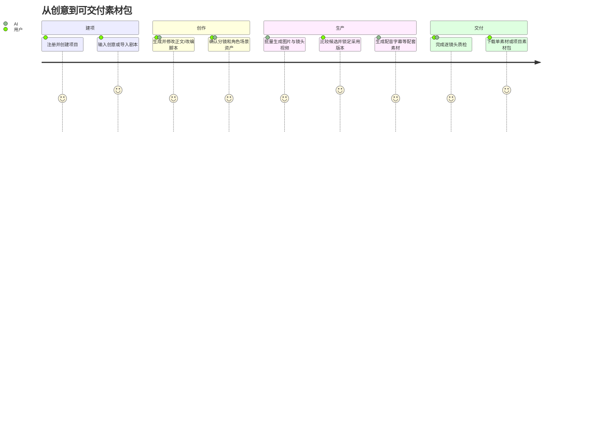
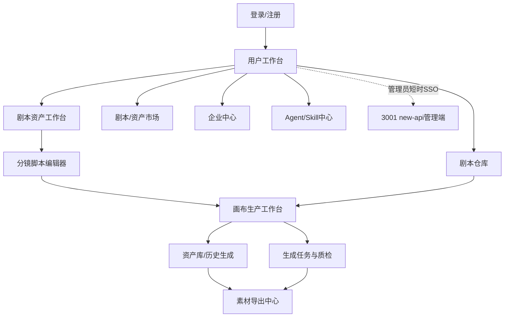
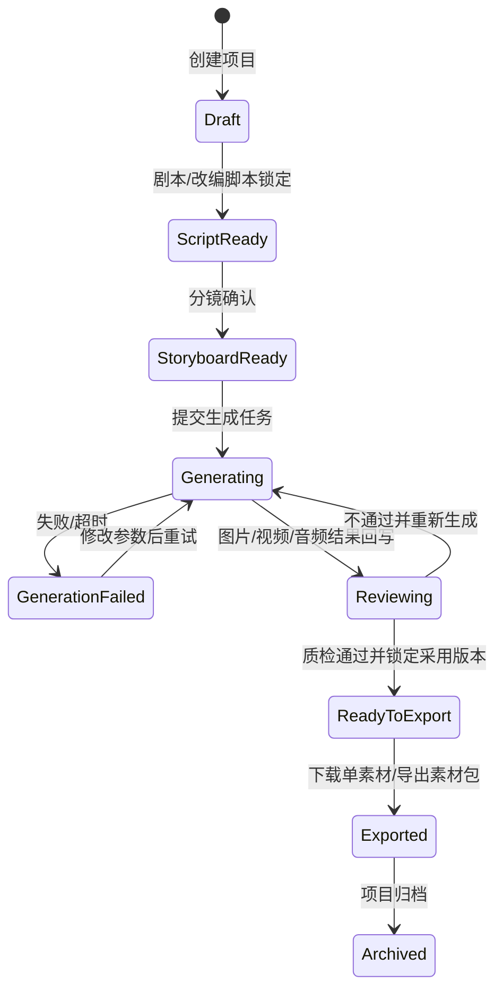

# AI漫剧与视频内容工业化生产工作台 · 用户端PRD

> 产品需求文档（Product Requirements Document）  
> 基于：[用户端产品功能设计 v0.6] + [后端产品功能设计 v0.1] + [流程图文档 v1.0] + [API接口文档 v1.0] + [AI漫剧与视频内容工业化生产工作台 PRD V1.5]  
> 版本：v1.5（工业化生产工作台修订版）  
> 日期：2026-06-16  
> 状态：评审中  
> 🆕 V1.5修订：产品不再定位为单一 AI 视频生成工具或简单自由画布，而是面向 AI 漫剧、短剧、广告片、短视频创作者的 **AI 漫剧与视频内容工业化生产工作台**。核心能力以无限画布、节点系统、资产库、分镜生产、批量生成、工作流模板、Agent / Skill 自动执行共同构成生产闭环。平台不提供视频合成、视频剪辑或多轨时间轴编辑，交付物为可下载的镜头视频与配套素材包。

---

## 目录

1. [文档概述](#1-文档概述)
2. [产品摘要](#2-产品摘要)
3. [项目背景与目标](#3-项目背景与目标)
4. [用户画像与用户故事](#4-用户画像与用户故事)
5. [功能需求清单（MoSCoW）](#5-功能需求清单moscow)
6. [功能需求详述](#6-功能需求详述)
   - [M1：账户体系](#m1-账户体系)
   - [M2：剧本创作与分镜生成](#m2-剧本创作与分镜生成)
   - [M3：剧本仓库](#m3-剧本仓库)
   - [M4：剧本交易市场](#m4-剧本交易市场)
   - [M5：AI资产与风格模型市场](#m5-ai资产与风格模型市场)
   - [M6：画布视频工作台](#m6-画布视频工作台)
   - [M7：企业中心](#m7-企业中心)
   - [M8：工业化生产SOP](#m8-工业化生产sop)
   - [M9：Agent与Skill协作](#m9agent与skill协作) `V1.5`
7. [非功能性需求](#7-非功能性需求)
8. [验收标准](#8-验收标准)
9. [风险与依赖](#9-风险与依赖)
10. [附录：用户故事映射表](#附录用户故事映射表)

---

## 1. 文档概述

### 1.1 文档信息

| 项目 | 内容 |
|------|------|
| 产品名称 | AI漫剧与视频内容工业化生产工作台 |
| 产品代号 | AICP（AI Comic Platform） |
| 文档类型 | 用户端PRD（Product Requirements Document） |
| 版本周期 | 第一周期（V1.0 → V1.1 → V1.2 → V1.3 → V1.5） |
| 目标读者 | 产品团队、前端开发、后端开发、UI/UX设计、QA测试、项目管理 |

### 1.2 术语表

| 术语 | 说明 |
|------|------|
| **漫剧** | AI生成的漫画风格短剧，面向抖音/快手等短视频平台 |
| **分镜** | Storyboard，将剧本拆解为镜头级别的视觉化脚本 |
| **A/B/C档** | V7.6工业分镜体系的三层输出：A档编导速看/B档导演确认/C档生产交付 |
| **4轴标签** | 剧本分类体系：题材(1选)×情节(≤3选)×情绪(≤3选)×时空(1选) |
| **L0-L4** | 资产成熟度等级：L0无资产→L4锁定资产 |
| **项目插件包** | 每个项目的专属配置：人物/场景/声音/风格/世界观/伏笔/禁止偏移规则 |
| **Inpaint/Outpaint** | 画布内局部重绘/向外扩图 |
| **Camera Lock** | 锁定摄像机参数（景别/机位/高度/主体位置）确保AI视频生成稳定 |
| **SOP** | Standard Operating Procedure，工业化生产标准操作流程 |
| **BFF** | Backend For Frontend，前端专属后端聚合层 |
| **CRDT** | Conflict-free Replicated Data Type，画布多端同步数据结构 |

---

## 2. 产品摘要

### 2.1 产品一句话

**AI漫剧与视频内容工业化生产工作台** — 通过无限画布、节点系统、资产库、分镜生产、批量生成、工作流模板与 Agent / Skill 自动执行，完成从剧本到可交付镜头素材包的工业化生产闭环。

### 2.2 产品定位

| 维度 | 描述 |
|------|------|
| **是什么** | 面向 AI 漫剧、短剧、广告片、短视频生产的一站式工业化生产工作台 |
| **为谁做** | 短剧编剧、AI漫剧团队、MCN机构、矩阵号团队、内容创业者、企业品牌方 |
| **解决什么** | AI工具分散、单次生成不可控、角色/场景资产无法沉淀、分镜到可交付素材链路断裂、团队生产不可追溯 |
| **差异化** | 以「项目→画布→节点→连线→分镜→资产→批量生成→质检→素材包导出→工作流→Agent/Skill」组织完整生产系统，竞争力不只在单次生成效果，而在工程化、标准化、可追溯、可复用和可规模化 |

### 2.2.1 V1.5 正确产品边界

本产品不再定义为“AI 视频生成工具”“AI 生图/生视频平台”“在线剪辑工具”“Prompt 工具”或“简单自由画布”。这些能力都只是生产链路中的局部环节。

V1.5 的正确边界是：

```text
剧本导入
→ AI 拆分镜
→ 角色 / 场景 / 道具资产化
→ 分镜图批量生成
→ 图生视频 / 首尾帧 / 全能参考
→ 多副本并行抽卡
→ 配音 / BGM / 音效
→ 镜头与配套素材质检
→ 单镜头下载 / 素材包导出
→ 资产沉淀
→ 工作流模板
→ Agent / Skill 自动执行
```

**明确不包含**：视频剪辑、视频拼接、转场编辑、特效叠加、音视频混轨、多轨时间轴、平台内视频合成与整片渲染。用户可将导出的镜头视频、配音、字幕、BGM、音效和清单文件交给外部剪辑工具完成后期制作。

### 2.2.1A 剧本创作修订边界

剧本创作模块不再定义为“一句话直接生成最终可生产剧本”，而是定义为**可编辑、可版本化、可出售、可进入画布生产的剧本资产工作台**。AI负责产出可继续加工的初稿和结构化建议，用户必须能够在平台内完成章节修订、世界观补全、人物/任务设定、分卷大纲、剧情大纲、分镜脚本整理与锁稿。

**标准链路**：

```text
AI样章/上传导入
→ 用户手动修订章节
→ 构建故事圣经（世界观/世界地图/人物/任务/规则）
→ 分卷大纲与剧情大纲
→ 章节正文定稿
→ 分镜脚本Master
→ 锁定版本
→ 送入画布生产 / 上架出售
```

**模块边界**：

| 模块 | 职责 | 不承担 |
|---|---|---|
| 剧本创作 | 生成初稿、章节编辑、故事设定、大纲、分镜脚本Master、版本、出售准备 | 不直接承载画布节点生产 |
| 剧本仓库 | 管理剧本资产、标签、版本、状态、售卖包 | 不生成画布执行数据 |
| 分镜脚本 | 作为剧本进入画布的生产桥梁，可在剧本侧维护Master版本 | 不替代画布内的镜头执行状态 |
| 画布 | 镜头生产、节点编排、资产生成、逐镜头预览和素材包导出 | 不承载视频剪辑、合成或多轨时间轴；不反向覆盖剧本Master，除非用户选择强耦合同步 |

**剧本与画布耦合方式**：

| 模式 | 适用场景 | 行为 |
|---|---|---|
| 弱耦合 | 剧本作为可售卖文本资产 | 仅保存剧本和分镜脚本，不创建画布项目 |
| 半耦合（默认） | 大多数创作生产 | 锁定某个剧本版本后导入画布，画布生成独立快照 |
| 强耦合 | 团队工业化生产 | 剧本Master、分镜脚本、画布镜头保持关联，变更需同步确认 |

**可出售资产包**：

| 包类型 | 内容 | 买家获得 |
|---|---|---|
| 基础剧本包 | 标题、梗概、章节正文、标签 | 可阅读/改编的文本剧本 |
| 创作包 | 基础剧本 + 故事圣经 + 人物设定 + 世界地图 + 分卷/剧情大纲 | 可继续开发的完整创作资产 |
| 生产包 | 创作包 + 分镜脚本Master + 投流素材 | 可直接进入画布生产 |
| 工业包 | 生产包 + 角色/场景/道具资产引用 + 画布项目快照 | 可复用的生产工程包 |

### 2.2.1B 全局流程视图

#### 总流程图


#### 用户旅程图



#### 页面跳转图



#### 状态流转图



### 2.2.2 V1.5 P0 功能补强

| 功能 | 补强要求 | 优先级 |
|---|---|:---:|
| 双击画布新建节点 | 节点菜单、默认坐标、自动选中、右侧属性联动、刷新后持久化 | P0 |
| 拖入素材自动建节点 | 文件识别、上传、节点创建、预览、失败处理、自动入库 | P0 |
| 脚本节点全屏编辑 | 表格编辑、字段配置、筛选、批量勾选、导出分镜表 | P0 |
| 批量分镜生图 | 勾选行、批量任务、状态回写、失败重试、自动入库 | P0 |
| 批量图生视频 | 视频节点批量创建、图生视频任务、状态回写、失败重试 | P0 |
| 图片拉出视频节点 | 图片右侧端口拖出，弹出下游菜单并创建视频节点 | P0 |
| 首尾帧视频 | 首帧、尾帧、比例校验、过渡描述、任务追踪 | P0 |
| 全能参考视频 | 多图、多视频、音频、文本共同参考，支持用途标注 | P0 |
| 多副本并行生成 | 支持 2 / 4 / 8 个候选并行抽卡、人工择优、成本预估 | P0 |
| 资产库历史生成 | 生成资产、手动资产、角色/场景资产可检索并拖回画布 | P0 |
| Agent 会话 / Skill 调用 | 执行计划、OpenAPI、日志、权限、结果回写画布与资产库 | P0 |

### 2.2.3 V1.5 跨角色执行口径

V1.5 的 PRD 不只定义“页面有什么”，还必须定义“用户怎么完成生产、开发怎么实现、测试怎么验收”。所有 P0 功能按以下统一结构落地。

| 维度 | 产品口径 | 前端口径 | 后端口径 | 测试口径 |
|---|---|---|---|---|
| 双端账号 | `8080` 与 `3001` 使用同一平台账号，但分别提供创作功能与模型管理功能 | 普通用户只展示 `8080` 菜单；管理员可通过短时 SSO 票据进入 `3001` | `user-svc` 作为身份事实源，new-api 只保存用户、分组和配额影子映射 | 验证同一 `platform_user_id`、角色隔离、无感跳转及账号禁用后的双端会话失效 |
| 页面布局 | 用户在一个无限画布工作台完成节点编排、生成、资产沉淀和素材交付 | 左侧栏、中央画布、右侧属性面板、底部生成器、小地图、顶部项目栏必须同时可用 | 提供项目、节点、连线、任务、资产和导出清单聚合接口 | 校验各区域在空项目、已有项目、加载失败、权限不足下都能正常展示 |
| 节点操作 | 每个节点都代表一个可配置、可执行、可复用的生产单元 | 支持选中、拖拽、复制、创建副本、删除、右键菜单、端口连线、状态徽标 | 节点坐标、尺寸、类型、输入、输出、状态、资产引用必须持久化 | 刷新后节点位置、状态、连线、输出结果不丢失 |
| 生成动作 | 用户点击生成前必须看到积分预估和结果去向 | 点击生成、批量生成、重新生成、执行工作流前弹出积分确认 | 创建 `generation_tasks`，记录 `credit_cost`、`status`、`provider`、`model_id`、参数和关联节点 | 校验余额不足、任务失败、取消、重试、成功入库全链路 |
| 结果展示 | 结果必须回写到触发节点、资产库和必要的下游节点 | 节点卡片显示预览、状态、成本、耗时；右侧面板展示任务日志和输出资产 | 成功后更新 `canvas_nodes.output_data`，生成资产写入 `assets`，分镜任务回写 `storyboard_shots` | 校验图片、视频、音频、导出文件的预览、下载、再次使用 |
| 商业化 | 每个 AI 动作都能解释为什么扣费、扣多少、失败是否退还 | 积分余额、预估消耗、确认按钮、失败提示必须明确 | 支持预估、冻结、结算、退还和流水追踪 | 对免费额度、会员权益、积分包、并发多任务做回归 |

节点级需求必须按以下模板补齐，后续产品新增节点也沿用该模板：

| 字段 | 必填说明 |
|---|---|
| 节点名称/类型 | 例如脚本节点、图片节点、视频节点、音频节点、角色节点 |
| 页面布局 | 节点卡片展示区、主编辑区、右侧属性区、底部生成器区分别展示什么 |
| 触发方式 | 点击按钮、拖出端口、批量勾选、右键菜单、Agent/Skill 自动触发 |
| 积分规则 | 是否预估、是否确认、扣费时机、失败是否退回、并发多副本如何计费 |
| 后端任务 | 创建什么任务类型，关联哪些 `project_id`、`node_id`、`shot_id`、`asset_id` |
| 结果位置 | 输出回写到节点、分镜行、资产库或素材导出中心的具体位置 |
| 异常处理 | 余额不足、参数缺失、模型失败、超时、取消、重试、部分成功 |
| 验收标准 | 前端状态、接口数据、数据库记录、资产文件、计费流水均可核对 |

节点视觉与交互验收必须参考 LibTV 风格形成统一体验：

| 节点 | 卡片空态 | 底部生成器 | 必验交互 |
|---|---|---|---|
| 文本节点 | 外置标题“文本节点 N”，卡片内居中文本图标，展示“自己编写内容 / 文生视频 / 图片反推提示词 / 文字生音乐”尝试动作 | 大文本输入框、模型选择、翻译/优化、积分预估、提交按钮 | 选中节点后底部生成器切换为文本输入；点击尝试动作自动填充任务类型 |
| 图片节点 | 外置标题“图片节点 N”，卡片内居中图片图标，展示“图生图 / 图片高清”尝试动作 | 风格、标记、Prompt、模型、比例/画质/分辨率、摄像机、全景、张数、提交按钮 | 生成成功后当前节点显示主图，候选进入版本列表，结果入资产库 |
| 视频节点 | 外置标题“视频节点 N”，卡片内居中播放图标，展示“首尾帧生成视频 / 首帧生成视频”尝试动作 | 文生视频/全能参考/图生视频/首尾帧/图片参考模式切换，标记/特效/角色库，比例、清晰度、时长、运镜、候选数、提交按钮 | 图片端口拖入视频节点时自动带入首帧/参考图；生成结果显示播放器 |
| 脚本生成器 | 外置标题“脚本生成器”，卡片内居中文本图标，展示“剧本生成分镜脚本 / 角色生成分镜脚本”尝试动作 | 剧情片段输入框、模型选择、翻译/优化、积分预估、提交按钮 | 结果进入脚本节点全屏分镜表，并可继续批量生图/生视频 |

文本节点四个尝试动作必须按 LibTV 截图形成明确展开态：

| 点击动作 | 展开结果 | 是否自动成组 | 计费入口 | 验收标准 |
|---|---|:---:|---|---|
| 自己编写内容 | 当前文本节点切换为富文本编辑态，顶部浮出 H1/H2/H3、段落、加粗、斜体、列表、分割线、复制、全屏等工具条 | 否 | 不扣积分，仅保存用户输入 | 文本框可编辑、可调整尺寸、刷新后内容和格式恢复 |
| 文生视频 | 自动创建“预设 - 文生视频”组：左侧文本节点、右侧视频节点，中间连线 | 是 | 点击组工具条“整组执行”或视频节点提交时预估并扣费 | 组框、组标题、连线、视频占位、整组执行、解组、批量下载可见 |
| 图片反推提示词 | 自动创建“预设 - 图片反推提示词”组：左侧图片节点、右侧文本节点，中间连线 | 是 | 执行图片反推提示词任务时预估并扣费 | 图片节点可上传/引用图片，结果回写右侧文本节点 |
| 文字生音乐 | 自动创建“预设 - 文字生音乐”组：左侧文本节点、右侧音频节点，中间连线 | 是 | 执行音乐生成任务时预估并扣费 | 音频节点显示结果波形/播放器，结果进入资产库和历史生成 |

### 2.2.4 LibTV PDF 功能融合补强

基于《LibTV使用指南.pdf》补充以下功能边界。平台不照搬竞品文案和模型名，但必须吸收其工作流组织方式、节点能力和验收口径。

| 能力域 | 融入功能 | 优先级 | 产品验收口径 |
|---|---|:---:|---|
| 脚本节点 | 确认镜头信息、整理角色/场景/道具资产、合成最终提示词三步门禁 | P0 | 未完成三步时不得批量生图/生视频；每步状态可见 |
| 脚本节点 | shot 单元格可编辑、整行可排序/新增/删除/颜色标记、资产可 `@` 唤起并自动连线 | P0 | 修改后提示词可重新合成，刷新后表格和资产引用不丢失 |
| 生成器组 | 批量生图/生视频前创建带参数的生成器组，包含资产连线、脚本提示词、模型、比例、分辨率 | P0 | 解组后生成器信息不丢失；生成器内修改不反向覆盖脚本 |
| 左侧栏 | 添加、我的工具箱、我的资产、历史记录、教程五入口 | P0 | 历史生成支持查看、发送到画布、批量下载、批量删除、批量使用，批量使用上限 10 个 |
| 分镜组 | 多图节点合并为宫格分镜组，支持普通组转分镜组、宫格切分创建、比例/行列/序号/拼接/清空/转普通组/解组 | P0 | 分镜组可保存排序，拼接可导出 2K/4K 大图 |
| 图像工具 | 全景 720、全景预览、4/12 视角截图、多角度、打光、焦点编辑、镜头聚焦、摄像机控制 | P1 | 工具结果回写图片节点或创建新图片节点，可进入资产历史 |
| 视频工具 | 高清放大、帧率提升、视频解析 | P0/P1 | 处理结果回写视频节点并形成新版本；不提供剪辑、拼接、转场或合成入口 |
| 导演台 | 3D 构图节点，支持人体素模、基础几何、群众阵列、本地上传、姿势、摄像机、FOV、注视目标、截图发送画布 | P1 | 截图可创建图片节点并作为图像/视频参考 |
| 主体库/角色库 | 图片/视频创建主体，智能补全多视角，绑定音色，主体描述参与 Prompt；真人素材需合规校验 | P1 | 主体可被视频节点调用，合规状态影响是否可生成 |
| 视频生成器 | 全能参考支持文本、图像、视频、音频混合输入，参考素材用 `@素材名` 标注用途 | P0 | 不同参考场景互斥校验明确，最多参考数量按模型能力限制 |
| 运镜 | 20+ 运镜预设、收藏、自定义运镜、模型适配提示和冲突提醒 | P0 | 运镜参数进入任务参数，失败时给出模型/场景冲突提示 |
| 音频工具 | 音频截取、变速、音色克隆、试听校验 | P1 | 音色克隆需保存样本、试听结果和可用状态 |

### 2.2.5 画布技术与交互验收基线

为避免直接开发时前后端理解不一致，画布工作台按以下基线验收：

| 验收域 | 产品要求 | 开发要求 | 测试口径 |
|---|---|---|---|
| 前端画布引擎 | 用户可在一个无限画布中完成节点编排、连线、生成和资产回流 | P0 采用 DOM/SVG + transform；Canvas/Konva/Pixi 用于性能层；WebGL/Three.js 用于导演台和全景 | 100/500/1000 节点下验证缩放、拖拽、连线和刷新恢复 |
| 坐标与视口 | 节点拖动、缩放、平移不能出现漂移 | 后端保存世界坐标，前端负责 `screen <-> world` 换算 | 缩放后端口、连线、选区和小地图位置一致 |
| 节点状态机 | 节点状态必须让用户知道能否生成、是否扣费、结果在哪 | `unconfigured/ready/queued/generating/success/failed/cancelled/locked` 由任务和节点接口返回 | 刷新页面后状态、错误、结果、积分流水不丢失 |
| 积分交互 | 所有付费动作先预估再确认，失败需解释是否退还 | 执行接口必须携带 `estimate_id`，任务创建后冻结积分 | 余额不足不得创建任务；失败重试不得重复扣费 |
| 结果回写 | 结果必须显示在当前节点或明确的下游节点，同时进入资产库/历史 | 成功任务回写 `canvas_nodes.output_data`、`assets`、`history` | 图片/视频/音频/文本结果均可二次使用 |
| 上游变更 | 上游内容变化后，下游结果不能悄悄失效 | 下游节点设置 `ui_flags.is_stale=true`，由用户确认是否重新生成 | 不自动扣费；用户确认后重新预估 |
| LibTV式交互 | 点击空态动作、端口拖线、自动成组、整组执行必须行为一致 | `preset-actions` 负责自动创建组、节点、连线；建组不扣费 | 四个文本动作、分镜组、生成器组逐项回归 |

### 2.3 第一周期核心指标

| 指标 | 目标值 | 衡量方式 |
|------|--------|---------|
| 注册用户数 | 500-1,000人 | 注册流程埋点 |
| 剧本生成次数 | 3,000次以上 | AI生成任务完成计数 |
| 平台剧本数 | 100-300部 | 仓库状态为已完成的剧本 |
| 剧本成交订单 | 100单以上 | 支付成功订单计数 |
| 镜头视频生成次数 | 300-1,000次 | 视频节点生成成功计数 |
| 成功导出视频 | 100-300条 | 下载完成计数 |
| 付费用户数 | 50-100人 | 会员/交易付费用户 |
| 月收入 | ¥10,000-50,000 | 支付系统汇总 |
| 素材交付满意度 | ≥70% | 素材包导出后5星评价≥4星占比 |
| 用户复购率 | ≥20% | 重复购买用户/总购买用户 |
| 🆕 画布工作流模板数(V1.5) | ≥30个 | 已发布可复用模板计数 |
| 🆕 Agent任务置信度均值(V1.5) | ≥0.78 | QualityAgent评分汇总 |
| 🆕 SOP画布质检通过率(V1.5) | ≥85% | 首次扫描绿灯/总扫描次数 |
| 🆕 多副本择优采纳率(V1.5) | ≥60% | 择优副本被采用/总生成副本数 |
| 🆕 资产双向联动同步延迟(V1.5) | ≤3秒 | 画布↔仓库变更同步耗时 |

---

## 3. 项目背景与目标

### 3.1 市场背景

- 短剧市场爆发：抖音/快手短剧日活过亿，AI漫剧作为新兴品类快速增长
- AI工具碎片化：创作者需要在多个平台（剧本AI→生图AI→视频AI→剪辑工具）间切换
- 剧本交易缺失：国内尚无剧本在线交易+SaaS工具一体化平台
- 生产标准空白：AI漫剧行业缺乏统一的工业级生产SOP和团队协作体系

### 3.2 第一周期目标

```
跑通「项目创建 → 剧本导入/创意输入 → AI拆分镜 → 资产沉淀 → 批量生图/生视频 → 逐镜头质检 → 素材包导出 → 工作流复用」最小生产闭环
```

具体目标：
1. **创作闭环**：用户可在30分钟内从一句话创意到导出1集镜头与配套素材包
2. **交易闭环**：剧本可上架、可试读、可购买、可授权
3. **生产闭环**：V7.6分镜体系 + 画布工作台 + 生产SOP，团队可稳定协作

### 3.3 第一周期明确的「不做」

- ❌ 承制方入驻与撮合（第二周期）
- ❌ 数字资产授权市场/演员声音形象交易（第三周期）
- ❌ 复杂收益分账（第三周期）
- ❌ ComfyUI在线工作流编排（第二周期）
- ❌ LoRA在线训练服务（第二周期）
- ❌ 实时多人协同编辑画布（V1.2+）

---

## 4. 用户画像与用户故事

### 4.1 五类核心用户

| 画像 | 身份 | 核心诉求 | 关键行为 | 付费意愿 |
|------|------|---------|---------|:---:|
| **A：短剧编剧** | 自由编剧/网文作者 | 快速将创意→可售卖剧本 | 高频使用剧本生成+上架 | 中 |
| **B：AI漫剧团队** | 2-5人小工作室 | 批量高效生产漫剧 | 画布批量生成+团队协作 | 高 |
| **C：MCN/矩阵号** | 运营10+账号的团队 | 低成本大批量内容填充 | 批量采购+快速出片 | 高 |
| **D：个人创业者** | 兼职/全职运营1-3号 | 零门槛试错验证选题 | 样片测试+投流验证 | 低→中 |
| **E：企业品牌方** | 品牌市场部/发行公司 | 定制品牌漫剧+API对接 | 组织管理+采购审批+API | 高 |

### 4.2 用户故事地图（User Story Map）

```
┌─────────────────────────────────────────────────────────────────┐
│ 用户活动                        │ V1.0 │ V1.1 │ V1.2 │ V1.3 │
├─────────────────────────────────────────────────────────────────┤
│ 注册与入驻                      │      │      │      │
│  · 手机/邮箱/微信注册登录        │  ✅  │      │      │
│  · 企业注册+营业执照认证         │      │  ✅  │      │
│  · 企业SSO单点登录              │      │      │  ✅  │
├─────────────────────────────────────────────────────────────────┤
│ 剧本创作                        │      │      │      │
│  · 4轴标签体系(52+标签+交互规则) │  ✅  │      │      │
│  · 8种智能标签组合卡片          │  ✅  │      │      │
│  · 一句话→剧本资产初稿(快速模式) │  ✅  │      │      │
│  · 精细引导创作(选题/梗概/大纲/章节/分镜/投流) │  ✅  │      │      │
│  · AI开书向导(灵感→整本方案)    │  ✅  │      │      │
│  · 写法资产面板(风格模板复用)    │  ✅  │      │      │
│  · 角色阵容工作台(AI提取角色)    │  ✅  │      │      │
│  · 上传小说→AI分析→修订         │  ✅  │      │      │
│  · 标签编辑器(独立页面)         │  ✅  │      │      │
├─────────────────────────────────────────────────────────────────┤
│ 分镜生产 (V7.6)                 │      │      │      │
│  · A档编导速看(场景卡+Beat表)   │  ✅  │      │      │
│  · B档导演确认(意图+调度+声画)  │      │  ✅  │      │
│  · C档生产交付(抽卡+视频+配音)  │      │      │  ✅  │
│  · 分镜A→B→C升档               │      │  ✅  │  ✅  │
├─────────────────────────────────────────────────────────────────┤
│ 剧本管理                        │      │      │      │
│  · 仓库CRUD+状态管理            │  ✅  │      │      │
│  · 版本管理+历史回溯            │  ✅  │      │      │
│  · 资产L0-L4成熟度追踪          │  ✅  │      │      │
│  · 统一ID体系                  │  ✅  │      │      │
│  · 章节连续性状态               │      │      │  ✅  │
├─────────────────────────────────────────────────────────────────┤
│ 剧本交易                        │      │      │      │
│  · 市场上架+4轴标签筛选         │      │  ✅  │      │
│  · 试读+购买+支付(微信/支付宝)  │      │  ✅  │      │
│  · 三级授权(普通/独家/买断)     │      │  ✅  │      │
│  · 企业采购审批流程             │      │  ✅  │      │
│  · 卖家销售面板+收益提现        │      │  ✅  │      │
├─────────────────────────────────────────────────────────────────┤
│ AI资产市场                      │      │      │      │
│  · 风格模型浏览+应用到画布      │      │  ✅  │      │
│  · 角色/场景/提示词资产市场     │      │  ✅  │      │
│  · 音色/BGM/音效素材库         │      │  ✅  │      │
│  · 资产上架+个人资产管理        │      │  ✅  │      │
│  · 角色LoRA市场                │      │      │  ✅  │
├─────────────────────────────────────────────────────────────────┤
│ 画布视频制作                    │      │      │      │
│  · 分镜卡片拖拽编排             │  ✅  │      │      │
│  · 首帧关键帧+运镜设置          │  ✅  │      │      │
│  · 画布内Inpaint角色编辑        │  ✅  │      │      │
│  · 分镜顺序预览+素材清单         │  ✅  │      │      │
│  · 单镜头MP4下载+素材包导出      │  ✅  │      │      │
│  · 图生视频模式                 │      │      │  ✅  │
│  · 首尾帧AI插值视频             │      │      │  ✅  │
│  · Outpaint扩图+图层管理        │      │      │  ✅  │
│  · 多集批量生成+导出            │      │      │  ✅  │
│  · 无限画布节点系统(11种节点)    │      │      │      │  ✅  │
│  · 脚本节点批量流水线            │      │      │      │  ✅  │
│  · 图片节点下游菜单              │      │      │      │  ✅  │
│  · 全能参考视频引擎              │      │      │      │  ✅  │
│  · 多副本并行抽卡                │      │      │      │  ✅  │
│  · 资产双向联动                  │      │      │      │  ✅  │
│  · 工作流模板化                  │      │      │      │  ✅  │
├─────────────────────────────────────────────────────────────────┤
│ 企业B2B                        │      │      │      │
│  · 企业工作台仪表盘             │      │  ✅  │      │
│  · 组织架构+成员权限管理        │      │  ✅  │      │
│  · 企业共享资产库               │      │  ✅  │      │
│  · 采购审批+素材审核            │      │  ✅  │      │
│  · 11项细粒度权限              │      │      │  ✅  │
│  · 企业API+数据报表             │      │      │  ✅  │
├─────────────────────────────────────────────────────────────────┤
│ 生产SOP                        │      │      │      │
│  · 基础P0/P1审计拦截            │  ✅  │      │      │
│  · 13项生产准入检查             │      │  ✅  │      │
│  · 审计返工表(P0-P3)            │      │  ✅  │      │
│  · 版本管理(V0.1→VFinal)       │      │  ✅  │      │
│  · L3/L4资产锁定               │      │      │  ✅  │
│  · AI失败自动恢复状态机         │      │      │  ✅  │
│  · 产能复杂度估算               │      │      │  ✅  │      │
├─────────────────────────────────────────────────────────────────┤
│ Agent与Skill协作 `V1.3`          │      │      │      │      │
│  · Agent三层协作(Script/Prod/QA)│      │      │      │  ✅  │
│  · 持久化记忆+向量检索           │      │      │      │  ✅  │
│  · Skill Markdown文件化配置      │      │      │      │  ✅  │
│  · Tool Router工具路由           │      │      │      │  ✅  │
│  · Adapter模型适配器             │      │      │      │  ✅  │
│  · SOP画布质检(AI自动审计)       │      │      │      │  ✅  │
├─────────────────────────────────────────────────────────────────┤
│ 画布节点引擎增强 `V1.3`          │      │      │      │      │
│  · 11种节点类型全支持            │      │      │      │  ✅  │
│  · 节点端口连线+工作流执行        │      │      │      │  ✅  │
│  · 图片节点下游菜单(生视频/配音等)│      │      │      │  ✅  │
│  · 视频节点扩展(首尾帧/多模态)    │      │      │      │  ✅  │
│  · 资产双向联动(画布↔仓库)       │      │      │      │  ✅  │
│  · 多副本并行生成+择优            │      │      │      │  ✅  │
│  · 镜头序列质检+批量下载          │      │      │      │  ✅  │
└─────────────────────────────────────────────────────────────────┘
```

---

## 5. 功能需求清单（MoSCoW）

### 5.1 优先级定义

| 优先级 | 含义 | 说明 |
|:---:|------|------|
| **M** (Must) | 必须有 | 本版本必须上线，否则产品不可用 |
| **S** (Should) | 应该有 | 重要但非阻塞，可延期到本版本后期 |
| **C** (Could) | 可以有 | 锦上添花，资源允许时做 |
| **W** (Won't) | 不做 | 明确本周期不做 |

### 5.2 V1.0 功能清单（56项）

> 范围调整（2026-06-27）：F-41、F-45 已移除且编号不复用。平台保留分镜顺序查看和单镜头预览，不提供时间轴编辑或视频合成。

| ID | 模块 | 功能点 | 优先级 |
|------|------|------|:---:|
| F-01 | 账户 | 手机号注册+短信验证 | M |
| F-02 | 账户 | 邮箱注册+邮箱验证 | M |
| F-03 | 账户 | 微信OAuth登录 | M |
| F-04 | 账户 | 账号密码登录 | M |
| F-05 | 账户 | 短信验证码登录 | S |
| F-06 | 账户 | JWT Token认证+自动刷新 | M |
| F-07 | 账户 | MFA多因素认证 | S |
| F-08 | 账户 | 个人中心（信息/会员/统计） | M |
| F-09 | 账户 | 实名认证 | S |
| F-10 | 剧本 | 快速模式（一句话→剧本资产初稿，可继续修订） | M |
| F-11 | 剧本 | Step1 爆款选题生成 | M |
| F-12 | 剧本 | Step1 4轴标签化创作参数 | M |
| F-13 | 剧本 | Step2 故事梗概生成 | M |
| F-14 | 剧本 | Step3 分集大纲生成（20/40/80集） | M |
| F-15 | 剧本 | Step4 单集剧本生成与章节手动编辑 | M |
| 🆕 F-15A | 剧本 | 每集联合审核：钩子Agent + 编导Agent + 导演Agent | M |
| 🆕 F-15B | 剧本 | 单章正文编辑与版本管理 | M |
| 🆕 F-15C | 剧本 | 正文完成后的去向选择 | M |
| 🆕 F-15D | 剧本 | 源头文本改编为 AI漫剧/短剧/网剧/TVC 脚本 | M |
| F-16 | 剧本 | Step5 分镜脚本Master（A档起步，可升B/C档） | M |
| F-17 | 剧本 | 分镜表三视图（表格/卡片/时间轴）与锁稿版本 | M |
| F-18 | 剧本 | AI续写（Tab键触发） | S |
| F-19 | 剧本 | 敏感词检测 | M |
| F-20 | 剧本 | 情绪曲线可视化 | S |
| F-21 | 仓库 | 剧本保存+列表+搜索 | M |
| F-22 | 仓库 | 剧本详情+编辑 | M |
| F-23 | 仓库 | 4轴标签编辑器（独立页面） | M |
| F-24 | 仓库 | 版本管理（自动+手动+还原） | M |
| F-25 | 仓库 | 剧本状态管理（草稿→审核→上架→下架） | M |
| F-26 | 仓库 | 剧本软删除 | M |
| F-27 | 仓库 | 资产创建（角色/场景） | M |
| F-28 | 仓库 | 资产L0-L4成熟度追踪 | M |
| F-29 | 仓库 | 统一ID体系 | M |
| F-30 | 仓库 | 项目插件包配置 | S |
| F-31 | 画布 | 创建画布项目（可绑定剧本版本） | M |
| F-32 | 画布 | 从仓库导入锁定剧本/分镜Master→生成画布分镜卡片 | M |
| F-33 | 画布 | 分镜卡片拖拽排序 | M |
| F-34 | 画布 | 分镜卡片编辑（景别/内容/时长） | M |
| F-35 | 画布 | 分镜卡片状态（待编辑/生成中/已完成） | M |
| F-36 | 画布 | 角色生成（AI提取+选择风格+批量生成） | M |
| F-37 | 画布 | 画布内Inpaint角色编辑 | M |
| F-38 | 画布 | 场景生成（AI识别+风格+批量生成） | M |
| F-39 | 画布 | 首帧关键帧设置+编辑 | M |
| F-40 | 画布 | 运镜方式选择（固定/推/拉/摇/移） | M |
| F-42 | 画布 | 配音生成（10音色+情绪+语速） | M |
| F-43 | 画布 | 字幕自动打轴+样式选择 | M |
| F-44 | 画布 | BGM添加+音效标记 | S |
| F-46 | 画布 | 画布实时预览（低分辨率逐镜头） | M |
| F-47 | 画布 | 单镜头视频下载与项目素材包导出 | M |
| F-48 | 画布 | 带水印预览/无水印导出 | M |
| F-49 | 画布 | 导出队列+通知+下载 | M |
| F-50 | SOP | 基础P0/P1审计拦截 | M |
| F-51 | 首页 | 个人工作台（快捷入口+最近项目+灵感） | M |
| F-52 | 首页 | 数据概览（生成/导出/消费统计） | M |
| F-53 | 通知 | 站内通知列表+已读 | M |
| F-54 | 通知 | 生成完成/导出完成浏览器推送 | S |
| F-55 | 通用 | 全局搜索 | C |
| F-56 | 通用 | 新手引导（首次使用分步引导） | S |
| F-57 | 通用 | 反馈（👍/👎 AI生成结果快速评价） | S |
| F-58 | 通用 | 帮助中心 | C |

### 5.3 V1.1 新增功能（42项）

| ID | 模块 | 功能点 | 优先级 |
|------|------|------|:---:|
| F-59 | 账户 | 会员体系（免费/创作者/企业三级） | M |
| F-60 | 账户 | 会员升级支付 | M |
| F-61 | 企业 | 企业注册+营业执照认证 | M |
| F-62 | 企业 | 企业工作台仪表盘 | M |
| F-63 | 企业 | 组织架构管理（部门/团队） | M |
| F-64 | 企业 | 成员邀请（手机/邮箱） | M |
| F-65 | 企业 | 成员角色分配+基础权限 | M |
| F-66 | 企业 | 企业共享资产库 | M |
| F-67 | 企业 | 采购审批流程（申请→一审→二审） | M |
| F-68 | 企业 | 项目素材包导出审核机制 | S |
| F-69 | 交易 | 市场首页（4轴标签筛选+搜索） | M |
| F-70 | 交易 | 剧本详情页（含标签+评价） | M |
| F-71 | 交易 | 剧本试读（前1-3集） | M |
| F-72 | 交易 | 三级授权选择（普通/独家/买断） | M |
| F-73 | 交易 | 订单创建+确认 | M |
| F-74 | 交易 | 微信支付 | M |
| F-75 | 交易 | 支付宝支付 | M |
| F-76 | 交易 | 已购剧本自动入库 | M |
| F-77 | 交易 | 购买后引导进入画布 | M |
| F-78 | 交易 | 卖家销售面板+数据 | M |
| F-79 | 交易 | 剧本上架流程（信息+审核） | M |
| F-80 | 交易 | 收益明细+提现申请 | M |
| F-81 | 资产 | 风格模型市场（Checkpoint/LoRA） | M |
| F-82 | 资产 | 模型详情页（参数+触发词+示例） | M |
| F-83 | 资产 | 一键应用模型到画布 | M |
| F-84 | 资产 | 角色资产市场 | M |
| F-85 | 资产 | 场景资产市场 | M |
| F-86 | 资产 | 提示词市场（Prompt分享+套用） | M |
| F-87 | 资产 | 音色库（试听+应用） | S |
| F-88 | 资产 | BGM/音效库 | S |
| F-89 | 资产 | 资产上架+审核 | M |
| F-90 | 资产 | 个人资产管理（上架/收藏/下载） | M |
| F-91 | 剧本 | Step5 B档导演确认层 | M |
| F-92 | 剧本 | 导演意图+人物调度+信息差+声画 | M |
| F-93 | 剧本 | 分镜A→B升档 | M |
| F-94 | SOP | 生产准入13项检查面板 | M |
| F-95 | SOP | 审计返工表（P0-P3分级） | M |
| F-96 | SOP | 版本管理（V0.1→V1.0→VFinal） | M |
| F-97 | 通知 | 邮件通知（交易/审核） | M |
| F-98 | 通知 | 短信通知（交易/企业邀请） | S |
| F-99 | 通用 | 站内通知偏好设置 | S |
| F-100 | 通用 | ES全文搜索（市场+资产） | M |

### 5.4 V1.2 新增功能（28项）

> 范围调整（2026-06-27）：F-123 已移除且编号不复用。

| ID | 模块 | 功能点 | 优先级 |
|------|------|------|:---:|
| F-101 | 账户 | 企业SSO单点登录（OIDC/SAML） | M |
| F-102 | 账户 | API Key管理（创建/删除/监控） | M |
| F-103 | 企业 | 11项细粒度权限管控 | M |
| F-104 | 企业 | 企业API接入+调用额度管理 | M |
| F-105 | 企业 | 企业数据报表 | S |
| F-106 | 剧本 | Step5 C档生产交付（AI抽卡表+AI视频表+配音字幕表） | M |
| F-107 | 剧本 | B→C升档 | M |
| F-108 | 剧本 | Step6 投流素材生成 | S |
| F-109 | 仓库 | L4资产锁定+连续性状态追踪 | M |
| F-110 | 画布 | 尾帧关键帧+运动曲线+AI插值 | M |
| F-111 | 画布 | 图生视频生成模式 | M |
| F-112 | 画布 | Outpaint扩图+图层管理 | M |
| F-113 | 画布 | 多集Tab切换+批量生成+导出 | M |
| F-114 | 画布 | 双语字幕 | S |
| F-115 | 资产 | 角色LoRA市场（使用预训练LoRA，训练功能第二周期） | S |
| F-116 | SOP | AI失败自动恢复状态机 | M |
| F-117 | SOP | 产能复杂度估算（A-E五级） | S |
| F-118 | SOP | L3/L4资产锁定联动审计 | M |
| 🆕 F-119 | 画布 | 无限画布节点系统（5节点+连线+工作流）— LibTV | M |
| 🆕 F-120 | 画布 | 脚本节点·批量流水线（剧本→分镜→生图→生视频） | M |
| 🆕 F-121 | 画布 | Slash快捷命令（九宫格/25宫格/三视图等12项） | S |
| 🆕 F-122 | 画布 | 导演台·3D构图（多视角截图→AI参考） | S |
| 🆕 F-124 | 画布 | 20+运镜预设+自定义运镜+Camera Lock | M |
| 🆕 F-125 | Agent | 三层Agent协作体系（决策层+执行层+监督层）— ToonFlow | M |
| 🆕 F-126 | Agent | 持久化Agent记忆系统（ONNX向量检索+长短期记忆） | M |
| 🆕 F-127 | 平台 | 可编程供应商系统（TypeScript在线配置+热切换）— ToonFlow | M |
| 🆕 F-128 | 剧本 | 章节事件图谱驱动改编（事件提取+图谱可视化） | S |
| 🆕 F-129 | Agent | Skill文件化配置（Markdown Skill编辑+模板库） | S |

### 5.5 V1.3 新增功能（30项）— AI视频创作自由画布增强版

> 范围调整（2026-06-27）：F-144、F-145 已移除且编号不复用；视频节点只负责生成、版本对比、质检和下载。

| ID | 模块 | 功能点 | 优先级 |
|------|------|------|:---:|
| 🆕 F-130 | 画布 | 无限画布引擎升级：11种节点类型全支持（文本/图片/视频/音频/脚本/分镜/角色/场景/提示词/参考视频/工作流模板） | M |
| 🆕 F-131 | 画布 | 节点端口系统：输入/输出端口定义+类型匹配校验+连线可视化 | M |
| 🆕 F-132 | 画布 | 工作流DAG执行引擎：拓扑排序+并行节点调度+断点续跑 | M |
| 🆕 F-133 | 脚本 | 脚本节点全流程流水线：剧本输入→分镜解析→批量生图→批量生视频→配音字幕素材 | M |
| 🆕 F-134 | 图片 | 图片节点下游菜单：生视频/配音/字幕/Inpaint/Outpaint/变风格/高清放大/角色一致性锁定 | M |
| 🆕 F-135 | 图片 | 图片节点上游关联：可追溯生成参数/参考图/提示词/模型版本 | M |
| 🆕 F-136 | 视频 | 视频节点扩展：首尾帧模式/多模态参考/运镜曲线编辑/Camera Lock锁定 | M |
| 🆕 F-137 | 视频 | 视频节点下游菜单：配音/字幕/质量分析/高清增强/下载 | M |
| 🆕 F-138 | 参考 | 全能参考视频引擎：上传参考视频→AI解析构图/光影/色调/运镜/节奏→应用到生成 | M |
| 🆕 F-139 | 参考 | 多模态参考融合：参考图+参考视频+文字描述 三通道融合指导生成 | S |
| 🆕 F-140 | 多副本 | 多副本并行抽卡：同Prompt并行生成N张→用户择优→设为节点采用版本 | M |
| 🆕 F-141 | 多副本 | 多副本对比视图：并排展示+差异高亮+一键替换节点采用版本 | M |
| 🆕 F-142 | 资产 | 资产双向联动（画布↔仓库）：画布锁定资产自动同步仓库→仓库资产变更推送到画布 | M |
| 🆕 F-143 | 资产 | 资产版本追溯：画布中资产可查看仓库历史版本→选择特定版本应用 | S |
| 🆕 F-146 | 工作流 | 工作流模板化：已打组工作流保存为模板→模板库管理→一键发送到画布 | M |
| 🆕 F-147 | 工作流 | 工作流社区市场：分享/发现/复用他人工作流模板 | C |
| 🆕 F-148 | AI导演 | AI导演智能编排：输入分镜表→AI自动编排画布节点+连线+生成参数 | M |
| 🆕 F-149 | AI导演 | AI导演质量评分：自动评审生成结果→逐项评分→综合置信度→不合格自动重试 | S |
| 🆕 F-150 | Agent | Agent三层协作增强：ScriptAgent(决策)+ProductionAgent(执行)+QualityAgent(监督)深度联动 | M |
| 🆕 F-151 | Agent | Agent消息总线：任务分发/状态同步/事件通知→前端实时展示Agent思维链 | M |
| 🆕 F-152 | Agent | Agent置信度评分：每步输出附带0-1置信度→低置信度自动触发监督层复核 | M |
| 🆕 F-153 | Skill | Skill文件化配置系统：Markdown Skill编辑器+变量注入+模板库+版本管理 | M |
| 🆕 F-154 | Skill | Skill即时热更新：修改Skill后下次Agent调用即时生效，无需重启 | M |
| 🆕 F-155 | Skill | Skill社区模板库：内置剧本/分镜/角色/场景/配音/质检6类预设Skill模板 | S |
| 🆕 F-156 | Tool | Tool Router工具路由：Agent根据任务类型自动选择最优Skill+Tool组合 | M |
| 🆕 F-157 | Tool | Adapter模型适配器：统一抽象层对接多AI供应商(OpenAI/DeepSeek/Anthropic/通义/智谱) | M |
| 🆕 F-158 | SOP | SOP画布质检：项目进入生产前自动扫描画布节点→13项准入检查→生成审计报告 | M |
| 🆕 F-159 | SOP | 质检结果可视化：画布节点染色(绿/黄/红)+逐节点审计详情+一键修复建议 | M |
| 🆕 F-160 | SOP | AI生成质量闭环：生成→质检→自动重试→人工审核→反馈到Prompt优化的完整循环 | M |
| 🆕 F-161 | 平台 | 供应商健康检查+自动降级：定时Ping→不可用自动切换备用供应商→恢复后切回 | S |

---

## 6. 功能需求详述

> 每个功能需求包含：用户故事（US）、验收标准（AC）、关联API、UI参考、异常处理。  
> 本节按模块组织，标注所属版本。

---

### M1：账户体系

#### F-01 手机号注册

| 属性 | 内容 |
|------|------|
| **版本** | V1.0 |
| **优先级** | M |
| **用户故事** | 作为内容创作者，我希望用手机号快速注册账号，以便开始使用平台 |
| **前置条件** | 用户未注册过该手机号 |
| **关联API** | `POST /auth/send-code` → `POST /auth/register` |

**验收标准**：

| AC# | 标准 |
|-----|------|
| AC01 | 输入手机号 → 点击「获取验证码」→ 60s内不可重发 → 收到6位短信验证码 |
| AC02 | 输入验证码+密码（8-20位含大小写+数字+特殊字符）+昵称 → 点击注册 |
| AC03 | 成功后自动登录，跳转至「选择账户类型」（个人/企业）→ 个人→进入新手引导 |
| AC04 | 手机号已注册 → 提示「该手机号已注册，请直接登录」 |
| AC05 | 验证码错误或过期(5分钟) → 提示「验证码错误，请重新获取」 |
| AC06 | 密码格式不符 → 实时提示格式要求，注册按钮置灰 |

**UI参考**：标准注册页，手机号输入框 + 验证码输入框（带倒计时按钮）+ 密码输入框（带强度指示器）+ 昵称输入框 + 用户协议勾选

**异常处理**：

| 场景 | 处理 |
|------|------|
| 短信发送失败 | 提示「验证码发送失败，请稍后重试」，60s后可重新获取 |
| 网络超时 | 前端loading → 超时10s提示「网络异常，请检查连接」 |
| 注册接口返回错误 | 根据错误码展示对应中文提示 |

---

#### F-03 微信OAuth登录

| 属性 | 内容 |
|------|------|
| **版本** | V1.0 |
| **优先级** | M |
| **用户故事** | 作为个人创作者，我希望用微信扫码直接登录，省去填写注册信息的步骤 |
| **前置条件** | 微信App已安装 |
| **关联API** | `POST /auth/login/wechat` |

**验收标准**：

| AC# | 标准 |
|-----|------|
| AC01 | 点击「微信登录」→ 调起微信授权 → 用户同意 → 回调平台 |
| AC02 | 新用户自动注册（昵称=微信昵称），跳转选择账户类型 |
| AC03 | 已绑定用户直接登录，跳转首页工作台 |
| AC04 | 用户拒绝授权 → 回到登录页，无错误提示 |
| AC05 | 微信未安装 → 提示「请安装微信后使用扫码登录」，切换其他方式 |

**异常处理**：

| 场景 | 处理 |
|------|------|
| 微信code过期(5分钟) | 提示「授权已过期，请重新扫码」 |
| 微信服务异常 | 降级提示「微信登录暂不可用，请使用手机号登录」 |

---

#### F-08 个人中心

| 属性 | 内容 |
|------|------|
| **版本** | V1.0 |
| **优先级** | M |
| **用户故事** | 作为用户，我希望在个人中心查看和管理我的账户信息、会员状态、使用统计 |
| **关联API** | `GET /user/profile` `PUT /user/profile` `GET /user/membership` |

**验收标准**：

| AC# | 标准 |
|-----|------|
| AC01 | 展示头像、昵称、手机号（脱敏）、邮箱、账户类型、注册时间 |
| AC02 | 支持修改昵称、头像、简介 |
| AC03 | 展示会员等级 + 到期时间 + 核心权益列表 |
| AC04 | 免费用户展示升级入口（引导→会员页） |
| AC05 | 展示使用统计：本月生成次数、导出视频数、仓库剧本数、存储空间使用量 |
| AC06 | 展示安全设置入口：修改密码、MFA设置、登录设备管理 |

---

#### F-61 企业注册与认证 `V1.1`

| 属性 | 内容 |
|------|------|
| **版本** | V1.1 |
| **优先级** | M |
| **用户故事** | 作为品牌方市场部负责人，我希望提交企业认证，以便开通组织账号管理团队 |
| **前置条件** | 用户已登录个人账号 |
| **关联API** | `POST /enterprise/register` |

**验收标准**：

| AC# | 标准 |
|-----|------|
| AC01 | 填写企业名称 + 营业执照号 + 上传营业执照图片 + 联系人信息 → 提交 |
| AC02 | 提交后状态=「审核中」，可预览企业工作台（功能受限） |
| AC03 | 审核通过 → 站内+短信通知 → 开通组织 → 进入企业工作台 |
| AC04 | 审核驳回 → 站内通知+驳回原因 → 可修改后重新提交 |
| AC05 | 营业执照模糊/信息不一致→审核驳回并附说明 |

**UI参考**：企业信息表单页 + 营业执照上传组件（支持拍照/相册/拖拽）+ 提交按钮 + 审核状态指示器（审核中🟡/已通过🟢/已驳回🔴）

---

### M2：剧本创作与分镜生成

#### F-10 快速模式

| 属性 | 内容 |
|------|------|
| **版本** | V1.0 |
| **优先级** | M |
| **用户故事** | 作为内容创作者，我希望输入一句话创意就能生成可编辑的剧本资产初稿，快速验证想法并继续打磨 |
| **前置条件** | 用户已登录 |
| **关联API** | `POST /script/gen/quick` |

**验收标准**：

| AC# | 标准 |
|-----|------|
| AC01 | 输入框输入创意描述（如「外卖小哥是隐藏豪门继承人」）→ 可选填4轴标签 |
| AC02 | 点击「一键生成」→ 显示生成进度动画 → 预计耗时提示 |
| AC03 | 完成后自动跳转内容资产工作台，默认展示源头文本资产：梗概、大纲、章节正文；分镜和投流素材允许为空 |
| AC04 | 生成中可取消 → 已生成部分不保存 |
| AC05 | 生成失败 → 提示错误原因 + 「重新生成」按钮 |
| AC06 | 免费用户每日3次额度 → 超出提示「今日额度已用完，升级会员无限生成」 |

**UI参考**：大输入框（placeholder引导）+ 4轴标签快速选择（可选展开）+ 平台选择（抖音/快手/视频号）+ 目标人群（男频/女频/全年龄）+「一键生成」主按钮 + 进度条

---

#### F-16 Step5 A档分镜生成

| 属性 | 内容 |
|------|------|
| **版本** | V1.0 |
| **优先级** | M |
| **用户故事** | 作为编导/编剧，我希望剧本完成后能自动生成A档分镜（场景目标+Beat表+主分镜表），快速判断结构和节奏是否成立 |
| **前置条件** | 剧本至少完成1集，并已保存可用于分镜的锁稿版本 |
| **关联API** | `POST /script/gen/storyboard` (tier=A) |

**验收标准**：

| AC# | 标准 |
|-----|------|
| AC01 | 用户选择仓库中的剧本 → 可选加载项目插件包 → 点击「生成A档分镜」 |
| AC02 | 生成「场景戏剧目标卡」：含场景剧情任务/人物目标/核心冲突/信息增量/关系变化/情绪走向/转折点/观众感受 |
| AC03 | 生成「Beat表」：按「进入→试探→冲突升级→信息反转→情绪爆点→余波/钩子」拆解 |
| AC04 | 生成「轻量主分镜表」：镜号/时长/景别运镜/画面内容/动作表演/对白旁白/镜头功能 |
| AC05 | 生成「镜头预算建议」：基于内容类型+目标时长推荐镜头数 |
| AC06 | 支持表格视图/卡片视图/时间轴视图三种查看方式 |
| AC07 | 用户可逐镜编辑、插入、删除、移动镜头 |
| AC08 | AI辅助：「节奏分析」标记时长分布异常、「景别建议」标记连续同景别过多、「高潮强化」建议增加特写 |

**UI参考**：顶部A档/B档/C档Tab切换；左侧场景列表导航；主区域分镜表（可编辑表格）；右侧属性面板（选中镜头时显示详情）

---

#### 🆕 F-15A 每集联合审核（钩子 Agent + 编导 Agent + 导演 Agent）

| 属性 | 内容 |
|------|------|
| **版本** | V1.0 |
| **优先级** | M |
| **用户故事** | 作为编剧/编导，我希望每集剧本在进入分镜前由钩子、编导、导演三个专业 Agent 自动把关，确保它既有追更力，也能成立和生产 |
| **前置条件** | 已生成或手动填写单集剧本正文 |
| **关联API** | `POST /script/review/preview` `POST /script/review/episodes/:episodeId` |

**验收标准**：

| AC# | 标准 |
|-----|------|
| AC01 | Step4 剧本编辑器内提供「联合审核本集」按钮 |
| AC02 | 钩子 Agent 输出：开场钩子、结尾悬念、上集承接、下一集承诺、假钩子识别和评分 |
| AC03 | 编导 Agent 输出：核心事件、人物动机、人设一致性、冲突升级、情绪节奏、台词问题和建议 |
| AC04 | 导演 Agent 输出：场景数量、画面可表达性、强视觉点、镜头节奏、AI生产难度和降本建议 |
| AC05 | 审核面板展示总分、三个 Agent 分数、问题列表、建议列表和操作按钮 |
| AC06 | 用户可选择重新审核、只优化钩子、只优化台词、压缩场景、通过并进入分镜 |
| AC07 | 用户强行进入分镜时，系统保留风险标记，并在分镜生成阶段继续提示 |
| AC08 | 已入库分集的审核报告需要保存并可查询，未入库文本可使用预览审核不落库 |

**UI参考**：Step4 剧本编辑器右侧或正文下方展示三 Agent 审核面板：钩子 Agent / 编导 Agent / 导演 Agent 三张评分卡 + 问题列表 + 一键操作区。

---

#### 🆕 F-15B 单章正文编辑与版本管理

| 属性 | 内容 |
|------|------|
| **版本** | V1.0 |
| **优先级** | M |
| **用户故事** | 作为小说/剧本创作者，我希望 AI 生成或编辑后仍能按单章修改正文，并保存版本，避免正文被分镜或脚本生产流程锁死 |
| **关联API** | `GET /script/repo/scripts/:id/chapters` `PATCH /script/repo/chapters/:chapterId` `POST /script/repo/chapters/:chapterId/versions` |

**验收标准**：

| AC# | 标准 |
|-----|------|
| AC01 | 内容资产工作台提供「正文内容」Tab，左侧章节列表，右侧正文编辑器 |
| AC02 | 用户可修改单章标题、正文、开场钩子、结尾留白 |
| AC03 | 支持「保存草稿」和「保存新版本」，版本记录展示变更说明 |
| AC04 | AI 润色、扩写、压缩、增强钩子后，用户仍可人工修改 |
| AC05 | 如果该章已有分镜，保存正文后只提示“分镜可能需要同步”，不自动覆盖分镜 |

---

#### 🆕 F-15C 正文完成后的去向选择

| 属性 | 内容 |
|------|------|
| **版本** | V1.0 |
| **优先级** | M |
| **用户故事** | 作为创作者，我希望正文完成后可以自行选择保存、继续修改、改编脚本、生成分镜或投流素材，而不是被强制进入分镜 |

**验收标准**：

| AC# | 标准 |
|-----|------|
| AC01 | Step4 正文完成后进入「正文完成页」 |
| AC02 | 页面提供：继续修改正文、保存到仓库、改编为脚本、选择章节生成分镜、生成投流素材 |
| AC03 | 用户选择保存仓库时，分镜和投流素材允许为空 |
| AC04 | 用户选择生成分镜时，必须显式选择章节或改编脚本版本 |
| AC05 | 画布入口只从锁定分镜版本导入，不直接从未确认正文跳转 |

---

#### 🆕 F-15D 源头文本改编为 AI漫剧/短剧/网剧/TVC 脚本

| 属性 | 内容 |
|------|------|
| **版本** | V1.0 |
| **优先级** | M |
| **用户故事** | 作为内容创作者，我希望先沉淀小说/故事文本母本，再按目标形态改编为 AI漫剧、短剧、网剧或 TVC 脚本 |
| **关联API** | `POST /script/gen/adaptation` `POST /script/repo/adaptations` |

**验收标准**：

| AC# | 标准 |
|-----|------|
| AC01 | 用户可从正文完成页或内容资产工作台选择「改编为脚本」 |
| AC02 | 改编目标支持 AI漫剧、短剧、网剧、TVC |
| AC03 | 改编脚本必须保留来源正文版本或来源文本信息 |
| AC04 | 改编脚本继承源头文本的钩子策略，并允许人工继续修改 |
| AC05 | 源头文本变更后，改编脚本只标记“需同步”，不自动覆盖 |

---

#### F-92 分镜B档导演确认 `V1.1`

| 属性 | 内容 |
|------|------|
| **版本** | V1.1 |
| **优先级** | M |
| **用户故事** | 作为导演，我希望在A档基础上审核每个镜头的导演意图、人物调度和信息控制，确保镜头有戏 |
| **前置条件** | A档分镜已生成并编导确认 |
| **关联API** | `POST /script/gen/storyboard/upgrade` (A→B) |

**验收标准**：

| AC# | 标准 |
|-----|------|
| AC01 | 在A档分镜页点击「升档至B档」→ AI自动补充导演维度 |
| AC02 | 每个镜头增加：导演意图（压迫/暴露/误导/反讽…）、人物行动动机、人物关系调度（空间距离=心理距离）、信息差控制（观众知道≠角色知道）、声画关系设计、剪辑点 |
| AC03 | 导演可逐镜审核+修改导演意图标签 |
| AC04 | 全部确认后 → 导演锁定 → 版本标记为V0.8（导演确认版） |
| AC05 | 不满意可「退回A档」修改后重新升档 |

---

#### F-106 分镜C档生产交付 `V1.2`

| 属性 | 内容 |
|------|------|
| **版本** | V1.2 |
| **优先级** | M |
| **用户故事** | 作为AI抽卡师/AI视频师，我希望获得可直接执行的生产三表（抽卡/视频/配音字幕），无需自己再手动拆解 |
| **前置条件** | B档分镜已导演确认 |
| **关联API** | `POST /script/gen/storyboard/upgrade` (B→C) |

**验收标准**：

| AC# | 标准 |
|-----|------|
| AC01 | B档点击「升档至C档」→ AI自动生成生产三表 |
| AC02 | ①AI抽卡表：Shot_ID/画幅/Face_ID/Costume_ID/Location_ID/首帧描述/构图/光影/img_prompt/negative/复杂度(A-E)/失败重试策略 |
| AC03 | ②AI视频表：Shot_ID/首帧/尾帧/动作链(起手→过程→完成点→反馈→结果)/运镜/Camera Lock/景别边界/可切点/vid_prompt/negative_motion |
| AC04 | ③配音字幕表：镜号/角色/台词/类型(Dialogue/VO/Narration)/Voice_ID/情绪/语速/配音文件名/字幕文本/口型同步 |
| AC05 | C档锁定 → 版本标记为V1.0（生产交付版）→ 可送入画布工作台 |

---

### M3：剧本仓库

#### F-23 4轴标签编辑器

| 属性 | 内容 |
|------|------|
| **版本** | V1.0 |
| **优先级** | M |
| **用户故事** | 作为编剧，我希望用标签化方式精确分类我的剧本，方便管理和市场曝光 |
| **前置条件** | 剧本已保存在仓库中 |
| **关联API** | `PUT /script/repo/scripts/:id/tags` |

**验收标准**：

| AC# | 标准 |
|-----|------|
| AC01 | 页面布局：左侧「作品信息」导航（标签/简介/总纲）+ 「设定」导航（角色/背景/势力/地点/物品） |
| AC02 | 右侧4轴标签网格：题材(12选1)/情节(29选≤3)/情绪(20选≤3)/时空(10选1) |
| AC03 | 点击标签切换选中状态；达到上限后其他标签置灰不可选 |
| AC04 | 每个标签轴标题旁实时显示 `已选数/上限` |
| AC05 | 标签变更后自动保存 → 同步到仓库筛选+市场上架信息 |
| AC06 | 「清空标签」按钮 → 二次确认后清空 |

**UI参考**：见 `小说` HTML原型文件 — 提供完整交互实现（左侧面板+右侧4轴标签网格+选择限制逻辑）

---

#### F-28 资产L0-L4成熟度追踪

| 属性 | 内容 |
|------|------|
| **版本** | V1.0 |
| **优先级** | M |
| **用户故事** | 作为AI视觉负责人，我希望清楚知道每个角色/场景资产当前处于什么成熟度，是否可进入批量生产 |
| **前置条件** | 已创建角色/场景资产 |
| **关联API** | `PUT /script/repo/assets/:type/:id/maturity` |

**验收标准**：

| AC# | 标准 |
|-----|------|
| AC01 | 资产列表展示成熟度徽章：L0灰色/L1蓝色/L2黄色/L3绿色/L4红色🔒 |
| AC02 | L0→L1：AI从剧本自动提取描述后自动升级 |
| AC03 | L1→L2：首次生成参考图/音频后自动升级 |
| AC04 | L2→L3：用户手动点击「审核通过」→ 确认后升级 |
| AC05 | L3→L4：用户手动点击「锁定」→ 二次确认 → 锁定后显示🔒图标 |
| AC06 | L4解锁 → 需对应负责人权限 → 触发连续性审计通知 |
| AC07 | 资产列表支持按成熟度筛选 |

---

### M4：剧本交易市场

#### F-69 市场首页 `V1.1`

| 属性 | 内容 |
|------|------|
| **版本** | V1.1 |
| **优先级** | M |
| **用户故事** | 作为买家，我希望通过多维度筛选快速找到符合我需求的剧本 |
| **前置条件** | 用户已登录 |
| **关联API** | `GET /trade/market/search` |

**验收标准**：

| AC# | 标准 |
|-----|------|
| AC01 | 顶部搜索栏：支持剧本名/作者/关键词模糊搜索 |
| AC02 | 4轴标签筛选栏：题材/情节/情绪/时空 四个下拉或平铺选择器，支持独立选择和清除 |
| AC03 | 高级筛选：集数区间(20/40/80)、授权类型(普通/独家/买断)、价格区间、评分≥N |
| AC04 | 排序选项：热门推荐(默认)/最新上架/销量最高/评分最高/价格升序/价格降序 |
| AC05 | 剧本卡片：封面图 + 剧名 + 作者 + 标签徽章(最多3个) + 星级 + 价格 + 销量 + 授权类型 + 集数 |
| AC06 | 筛选条件同步到URL参数，支持分享链接 |
| AC07 | 分页加载：每页20条，滚动加载更多 或 页码导航 |

---

#### F-71 剧本试读 `V1.1`

| 属性 | 内容 |
|------|------|
| **版本** | V1.1 |
| **优先级** | M |
| **用户故事** | 作为买家，我希望在购买前试读剧本的前几集，判断是否值得购买 |
| **前置条件** | 用户已登录 |
| **关联API** | `GET /trade/market/scripts/:id/preview` |

**验收标准**：

| AC# | 标准 |
|-----|------|
| AC01 | 剧本详情页 → 分集大纲区域 → 前1-3集标注「试读」按钮 |
| AC02 | 点击试读 → 弹窗/侧边栏展示标准剧本格式内容 |
| AC03 | 试读区域禁止文本选中+禁止右键（基础防复制） |
| AC04 | 试读到关键悬念处 → 展示「购买后继续阅读完整剧本」引导条 |
| AC05 | 卖家可在上架时设置试读集数（1-3集，默认3集） |

---

#### F-74 支付流程 `V1.1`

| 属性 | 内容 |
|------|------|
| **版本** | V1.1 |
| **优先级** | M |
| **用户故事** | 作为买家，我希望通过微信/支付宝安全支付，购买后剧本自动进入我的仓库 |
| **前置条件** | 已选择授权类型+确认订单 |
| **关联API** | `POST /trade/orders` → `POST /trade/orders/:id/pay` |

**验收标准**：

| AC# | 标准 |
|-----|------|
| AC01 | 订单确认页展示：剧本名称+作者+授权类型+价格+授权协议摘要 |
| AC02 | 选择支付方式（微信/支付宝）→ 点击「立即支付」 |
| AC03 | Web端：展示支付二维码 → 用户扫码支付；移动端：调起微信/支付宝App |
| AC04 | 支付成功 → 跳转成功页 → 剧本自动入库 → 展示「进入画布生成漫剧」引导按钮 |
| AC05 | 支付失败 → 展示失败原因 + 「重新支付」按钮（订单15分钟内有效） |
| AC06 | 订单超时(15分钟) → 自动取消 → 提示「订单已超时，请重新下单」 |
| AC07 | 支付成功后 → 卖家收到售出通知 → 金额计入可提现余额 |

---

### M5：AI资产与风格模型市场

#### F-83 模型一键应用到画布 `V1.1`

| 属性 | 内容 |
|------|------|
| **版本** | V1.1 |
| **优先级** | M |
| **用户故事** | 作为创作者，我希望能一键将市场中的风格模型应用到我的画布项目，无需手动下载和配置参数 |
| **前置条件** | 已登录，正在使用画布工作台 |
| **关联API** | `POST /asset/market/models/:id/apply` |

**验收标准**：

| AC# | 标准 |
|-----|------|
| AC01 | 模型详情页 → 点击「应用到当前项目」→ 选择目标画布项目 |
| AC02 | 应用成功 → 画布style_config自动更新 → 后续生成使用该风格 |
| AC03 | 模型参数（CFG Scale/Sampler/Steps/触发词）自动带入画布配置 |
| AC04 | 免费模型直接应用；付费模型需先购买 |
| AC05 | 应用历史记录可查 → 支持撤销（回到上一个风格） |

---

### M6：画布视频工作台

#### F-31 创建画布项目+导入剧本

| 属性 | 内容 |
|------|------|
| **版本** | V1.0 |
| **优先级** | M |
| **用户故事** | 作为创作者，我希望能将仓库中的剧本一键导入画布，自动解析为分镜卡片开始制作 |
| **前置条件** | 仓库中有剧本（至少1集） |
| **关联API** | `POST /canvas/projects` → `POST /canvas/projects/:id/import-script` |

**验收标准**：

| AC# | 标准 |
|-----|------|
| AC01 | 点击「进入画布」→ 创建画布项目 → 自动导入剧本 |
| AC02 | 剧本自动解析为分镜卡片：按场景/对白/动作拆分为独立镜头 |
| AC03 | 每张卡片显示：镜号、景别、场景描述、角色列表、预估时长、状态图标 |
| AC04 | 如果剧本已有分镜数据（C档），自动带入Shot_ID/首帧描述/角色/场景 |
| AC05 | 画布默认配置：9:16竖屏、1080p、25fps、韩漫风格（可后续修改） |

**UI参考**：画布三栏布局 — 左侧分镜卡片面板（可拖拽排序）+ 中间画布编辑区（选中镜头预览+Inpaint工具条）+ 右侧属性面板（景别/运镜/时长/关键帧/角色场景列表）+ 底部资产面板。分镜顺序通过卡片列表或只读时间轴视图查看，不提供多轨编辑。

---

#### F-36 角色生成与管理

| 属性 | 内容 |
|------|------|
| **版本** | V1.0 |
| **优先级** | M |
| **用户故事** | 作为创作者，我希望AI能自动从剧本提取角色并生成一致的角色形象，在画布中直接拖拽使用 |
| **前置条件** | 已导入剧本 |
| **关联API** | 内部调用 image-gen-pool（通过canvas-svc编排） |

**验收标准**：

| AC# | 标准 |
|-----|------|
| AC01 | AI自动从剧本/分镜提取角色列表 → 用户确认/补充角色信息 |
| AC02 | 选择美术风格（写实/二次元/韩漫/国漫/水墨）→ 批量生成角色形象 |
| AC03 | 每个角色生成：头像(1:1) + 全身图(9:16) + 半身图(16:9) + 表情集(6-8种) |
| AC04 | 用户挑选满意的形象 → 锁定角色 → 自动建立一致性提示词+种子值 |
| AC05 | 从资产面板拖拽角色到画布指定位置 → AI在该位置生成该角色 |
| AC06 | Inpaint微调：画笔涂抹角色局部 → AI重绘该区域（面部/服装/姿势） |
| AC07 | 角色一致性锁定🔒 → 该角色在所有镜头中保持外观一致 |

---

#### F-47 视频素材下载与项目素材包导出

| 属性 | 内容 |
|------|------|
| **版本** | V1.0 |
| **优先级** | M |
| **用户故事** | 作为创作者，我希望下载单镜头视频，并将项目内采用的图片、视频、配音、字幕和清单打包交付 |
| **前置条件** | 至少存在一个已生成并采用的素材 |
| **关联API** | `POST /canvas/projects/:id/export-package` → `GET /canvas/export/:task_id/download` |

**验收标准**：

| AC# | 标准 |
|-----|------|
| AC01 | 单个视频节点可直接下载其原始 MP4 结果，不进行二次编码或拼接 |
| AC02 | 项目素材包包含采用版本的图片、镜头视频、配音、字幕文件、BGM/音效和 `manifest.json` 清单 |
| AC03 | 免费/付费水印规则作用于模型生成结果，不在导出阶段重新渲染 |
| AC04 | 大批量素材打包进入异步 ZIP 任务，完成后发送站内通知 |
| AC05 | 下载页面展示文件名称、大小、格式和 OSS 签名下载地址 |
| AC06 | 下载历史保留30天，过期文件标注「已过期」 |
| AC07 | 多集批量导出：勾选1-5集，按集建立目录后一键下载 ZIP |

---

#### 🆕 F-119 无限画布节点系统 `V1.2` — 对标 LibTV

| 属性 | 内容 |
|------|------|
| **版本** | V1.2 |
| **优先级** | M |
| **用户故事** | 作为创作者，我希望在无限画布上自由放置和连接文本/图片/视频/音频/脚本节点，搭建可视化创作工作流 |
| **前置条件** | 已登录，进入画布工作台 |
| **关联API** | `POST /canvas/projects/:id/nodes` `POST /canvas/projects/:id/nodes/connect` |

**验收标准**：

| AC# | 标准 |
|-----|------|
| AC01 | 画布空白处双击或右键 → 选择添加5种节点：📝文本、🖼️图片、🎥视频、🎵音频、🎬脚本 |
| AC02 | 节点可自由拖放定位，画布支持缩放(10%-200%)和平移，小地图显示全局节点分布 |
| AC03 | 节点间通过拖拽端口建立连线，形成「参考图→图像生成→视频生成→音频配音」工作流 |
| AC04 | 连线工作流支持一键整组执行，修改上游节点后可自动触发下游重新生成 |
| AC05 | 选中节点右键：复制/副本(保留连线)/删除/创建资产(保存到我的资产库) |
| AC06 | 已打组的工作流可保存为模板，在左侧「工作流」面板中一键发送到画布 |

---

#### 🆕 F-120 脚本节点·批量流水线 `V1.2`

| 属性 | 内容 |
|------|------|
| **版本** | V1.2 |
| **优先级** | M |
| **用户故事** | 作为创作者，我希望通过脚本节点上传剧本+角色图→一键生成分镜脚本→批量生成分镜图片→批量生成视频 |
| **前置条件** | 画布中有脚本节点，已填写剧本或上传角色图 |
| **关联API** | `POST /canvas/projects/:id/nodes/script/generate-storyboard` → `POST /canvas/projects/:id/nodes/script/batch-image` → `POST /canvas/projects/:id/nodes/script/batch-video` |

**验收标准**：

| AC# | 标准 |
|-----|------|
| AC01 | 脚本节点支持三种输入：①粘贴剧本全文 ②上传角色图像+描述剧情 ③上传参考视频+描述新需求 |
| AC02 | AI自动解析剧本→生成分镜表（镜号/景别/画面内容/对白/时长），支持表格/卡片双视图切换 |
| AC03 | 点击「生成分镜」→ 批量生成所有分镜图片，支持选择风格模型+画幅比+分辨率 |
| AC04 | 点击「批量生成视频」→ 自动将分镜图转为视频，支持选择视频模型(Seedance/Kling/HappyHorse等)+时长 |
| AC05 | 支持单条或批量勾选生成，生成进度实时展示 |
| AC06 | 全屏编辑支持：双击修改表格内容、上传/替换角色图和风格参考、自定义字段可见性和筛选 |

---

#### 🆕 F-121 Slash快捷命令 `V1.2`

| 属性 | 内容 |
|------|------|
| **版本** | V1.2 |
| **优先级** | S |
| **用户故事** | 作为创作者，我希望通过Slash命令快速调用专业AI创作功能 |
| **前置条件** | 画布中有图片/视频节点 |
| **关联API** | `POST /canvas/projects/:id/slash/:command` |

**验收标准**：

| AC# | 标准 |
|-----|------|
| AC01 | 画布底部Slash工具栏提供快捷命令：`/九宫格` `/四宫格` `/25宫格` `/角色三视图` `/光影矫正` `/导演台` `/拆分` `/拼接2K` `/全景720°` |
| AC02 | `/九宫格`：生成多机位9个角度分镜图 |
| AC03 | `/25宫格`：生成25宫格连贯分镜序列 |
| AC04 | `/角色三视图`：生成角色正面/侧面/背面三视图 |
| AC05 | `/光影矫正`：AI调整画面光影氛围（黄金时刻/蓝调时刻/电影级布光） |
| AC06 | `/画面推演-3秒后` `/画面推演-5秒前`：AI推演画面时间线 |

---

#### 🆕 F-122 导演台·3D构图 `V1.2`

| 属性 | 内容 |
|------|------|
| **版本** | V1.2 |
| **优先级** | S |
| **用户故事** | 作为创作者，我希望用摆积木的方式在3D空间中搭建故事场景，通过多视角截图快速获得AI可准确理解的构图参考 |
| **前置条件** | 画布中有导演台节点 |
| **关联API** | `POST /canvas/projects/:id/director-desk` |

**验收标准**：

| AC# | 标准 |
|-----|------|
| AC01 | 双击画布空白处 → 新建「导演台」节点 → 点击「打开导演台」进入轻量级3D构图空间 |
| AC02 | 支持放置基础模型（人物/建筑/道具），调整位置/角度/大小 |
| AC03 | 多视角截图导出 → 自动连接到图片节点作为AI生成参考 |
| AC04 | 截图包含场景深度信息 → 作为AI视频模型的构图和运镜参考 |

---

#### 🆕 F-124 20+运镜预设 `V1.2`

| 属性 | 内容 |
|------|------|
| **版本** | V1.2 |
| **优先级** | M |
| **用户故事** | 作为创作者，我希望从20+专业运镜预设中选择，并支持自定义运镜提示词 |
| **前置条件** | 选中视频节点 |
| **关联API** | `PUT /canvas/projects/:id/shots/:shotId/keyframe` |

**验收标准**：

| AC# | 标准 |
|-----|------|
| AC01 | 运镜预设列表：推/拉/固定/摇/移/跟拍/升降/弧线/仰拍/俯拍/航拍/手持/快速变焦/慢摇/旋转/推拉组合等 |
| AC02 | 支持自定义运镜提示词（如：镜头从高空俯冲而下，最终停在主角面部特写） |
| AC03 | Camera Lock：锁定摄像机参数（景别/机位/高度/主体位置），确保AI视频稳定 |
| AC04 | 运镜提示词智能校验：检测画面描述与运镜冲突（如「特写」与「航拍」冲突） |

---

#### 🆕 F-125 三层Agent协作体系 `V1.2` — 对标 ToonFlow

| 属性 | 内容 |
|------|------|
| **版本** | V1.2 |
| **优先级** | M |
| **用户故事** | 作为创作者，我希望AI能像专业团队一样协作——决策层拆解任务、执行层生成内容、监督层审核质量，确保镜头素材稳定一致 |
| **前置条件** | 项目已创建，AI模型已配置 |
| **关联API** | `POST /agent/orchestrate` `GET /agent/task/:id/review` |

**验收标准**：

| AC# | 标准 |
|-----|------|
| AC01 | **决策层(ScriptAgent)**：接收创作意图→拆解任务→生成故事骨架+改编策略+结构化剧本 |
| AC02 | **执行层(ProductionAgent)**：接收分镜任务→组织节点→调度模型→批量生成图像/视频 |
| AC03 | **监督层(QualityAgent)**：自动审阅生成结果→对比质量标准→标记问题→反馈修订建议 |
| AC04 | 三层Agent通过消息总线协作，任务状态实时同步，支持人工介入修改 |
| AC05 | Agent输出附带置信度评分，低置信度自动触发监督层复核 |

---

#### 🆕 F-126 持久化Agent记忆系统 `V1.2`

| 属性 | 内容 |
|------|------|
| **版本** | V1.2 |
| **优先级** | M |
| **用户故事** | 作为创作者，我希望AI能记住之前创作的角色设定、风格偏好和剧情决策，跨会话保持创作连续性 |
| **前置条件** | Agent协作体系已启用 |
| **关联API** | `POST /agent/memory/store` `GET /agent/memory/recall` |

**验收标准**：

| AC# | 标准 |
|-----|------|
| AC01 | **短期记忆**：保存当前会话中的角色设定、对白风格、场景描述，实时召回 |
| AC02 | **长期摘要**：会话结束后自动生成结构化摘要（关键决策/角色弧/情节转折），持久化存储 |
| AC03 | **语义召回**：基于本地ONNX向量检索，根据当前上下文自动召回相关历史记忆 |
| AC04 | 记忆管理面板：查看/编辑/删除已存储的记忆条目 |
| AC05 | 新项目可继承已有项目的角色/世界观记忆，加速冷启动 |

---

#### 🆕 F-127 可编程供应商系统 `V1.2`

| 属性 | 内容 |
|------|------|
| **版本** | V1.2 |
| **优先级** | M |
| **用户故事** | 作为开发者/高级用户，我希望在设置中心直接编写模型供应商的接入逻辑（TypeScript），无需修改源码即可接入私有模型或多模型 |
| **前置条件** | 管理员权限 |
| **关联API** | `GET /setting/providers` `PUT /setting/providers/:id` `POST /setting/providers/test` |

**验收标准**：

| AC# | 标准 |
|-----|------|
| AC01 | 设置中心提供「供应商管理」面板，内置常用模型供应商模板（OpenAI/DeepSeek/Anthropic/通义千问/智谱） |
| AC02 | 支持在线编写/编辑供应商TypeScript逻辑，即时生效，无需重启服务 |
| AC03 | 供应商测试：输入测试Prompt → 调用供应商API → 展示响应结果+耗时+Token消耗 |
| AC04 | 支持多供应商热切换：文本/图像/视频模型可分别配置不同供应商 |
| AC05 | 供应商健康检查：定时Ping检测可用性，不可用时自动降级到备用供应商 |

---

#### 🆕 F-128 章节事件图谱驱动改编 `V1.2`

| 属性 | 内容 |
|------|------|
| **版本** | V1.2 |
| **优先级** | S |
| **用户故事** | 作为编剧，我希望AI自动提取原著章节的关键事件并构建结构化图谱，改编剧本时精准调用上下文，避免长文本信息丢失 |
| **前置条件** | 已导入原著文本/小说 |
| **关联API** | `POST /script/event-graph/extract` `GET /script/event-graph/:projectId` |

**验收标准**：

| AC# | 标准 |
|-----|------|
| AC01 | 导入原著→AI自动提取每章关键事件（人物登场/冲突爆发/关系变化/情节转折/悬念设置） |
| AC02 | 事件以结构化图谱展示：节点=事件，连线=因果关系/时序关系 |
| AC03 | 剧本改编时，AI根据当前场景自动检索事件图谱中的相关上下文，注入Prompt |
| AC04 | 事件图谱支持手动编辑：增删节点、修改关系、补充细节 |
| AC05 | 可视化图谱导出：PNG/SVG格式，可用于团队讨论和文档 |

---

#### 🆕 F-129 Skill文件化配置 `V1.2`

| 属性 | 内容 |
|------|------|
| **版本** | V1.2 |
| **优先级** | S |
| **用户故事** | 作为创作者，我希望将AI创作的核心提示词外化为可编辑的Markdown Skill文件，像配置文档一样调优AI行为 |
| **前置条件** | Agent协作体系已启用 |
| **关联API** | `GET /skill/files` `PUT /skill/files/:name` `POST /skill/files/preview` |

**验收标准**：

| AC# | 标准 |
|-----|------|
| AC01 | ScriptAgent和ProductionAgent的核心Prompt以Markdown Skill文件形式存储在项目中 |
| AC02 | Skill编辑器：在线Markdown编辑+实时预览+版本历史 |
| AC03 | 支持Skill模板库：内置剧本/分镜/角色/场景等预设Skill模板 |
| AC04 | 修改Skill后即时生效，下次Agent调用使用新配置 |
| AC05 | Skill支持变量注入：`{{character_name}}` `{{genre}}` 等运行时替换 |

---

### M7：企业中心

#### F-62 企业工作台 `V1.1`

| 属性 | 内容 |
|------|------|
| **版本** | V1.1 |
| **优先级** | M |
| **用户故事** | 作为企业管理员，我希望登录后看到企业专属仪表盘，快速掌握团队使用情况和待处理事项 |
| **前置条件** | 企业认证已通过，用户为企业管理员 |
| **关联API** | `GET /enterprise/dashboard` |

**验收标准**：

| AC# | 标准 |
|-----|------|
| AC01 | 企业概览卡片：团队成员数/本月剧本生成次数/本月素材包导出数/资产总数 |
| AC02 | 财务卡片：本月总支出/采购订单数/待审批数/API调用次数 |
| AC03 | 待处理列表：采购申请审批/素材包导出审核/成员邀请确认 |
| AC04 | 团队动态：成员最近操作（生成/导出/上传资产/购买）的时间线 |
| AC05 | 快捷入口：开始创作/画布工作台/企业资产库/采购市场/审核中心 |
| AC06 | 区分于个人首页：企业色/企业Logo/企业名称展示 |

---

#### F-67 采购审批流程 `V1.1`

| 属性 | 内容 |
|------|------|
| **版本** | V1.1 |
| **优先级** | M |
| **用户故事** | 作为企业管理员，我希望成员的剧本/资产采购需要经过审批，控制预算支出 |
| **前置条件** | 企业已设定采购预算和审批规则 |
| **关联API** | `POST /trade/enterprise/purchase-request` → `PUT /trade/enterprise/purchase-request/:id/approve` |

**验收标准**：

| AC# | 标准 |
|-----|------|
| AC01 | 成员在交易市场 → 选择剧本 → 提交采购申请（附理由） |
| AC02 | 系统自动校验：个人单笔上限 + 部门预算余额 → 超出则自动驳回+提示 |
| AC03 | 通过预算检查 → 推送审批通知给部门负责人（一审） |
| AC04 | 部门负责人可查看采购内容+预算剩余 → 批准/驳回（附原因） |
| AC05 | 金额超部门审批阈值 → 自动升级到管理员二审 |
| AC06 | 审批通过 → 自动生成订单 → 通知申请人「采购已通过」 |
| AC07 | 审批驳回 → 通知申请人驳回原因 → 可修改后重新提交 |

---

### M8：工业化生产SOP

#### F-94 生产准入检查 `V1.1`

| 属性 | 内容 |
|------|------|
| **版本** | V1.1 |
| **优先级** | M |
| **用户故事** | 作为制片/项目经理，我希望能一键检查项目是否满足进入批量AI生产的条件 |
| **前置条件** | C档分镜已完成 |
| **关联API** | `POST /sop/check/production-readiness` |

**验收标准**：

| AC# | 标准 |
|-----|------|
| AC01 | 点击「生产准入检查」→ 自动执行13项规则扫描 |
| AC02 | 展示检查结果面板：每项✅通过/⚠️警告/❌不通过 + 详情 |
| AC03 | 全部通过 → 🟢绿灯：「该集满足生产条件，可以进入画布批量生产」 |
| AC04 | 1-2项未通过 → 🟡黄灯：「存在风险项，建议修复后进入生产」+ 风险项列表 |
| AC05 | 3项以上 → 🔴红灯：「不满足生产准入条件，请修复后重新检查」+ 修复建议 |
| AC06 | 点击每项未通过项 → 展开详情 → 可一键创建审计工单 |

---

#### F-116 AI失败自动恢复 `V1.2`

| 属性 | 内容 |
|------|------|
| **版本** | V1.2 |
| **优先级** | M |
| **用户故事** | 作为AI抽卡师，我希望AI生成失败时系统能自动尝试恢复，减少人工干预 |
| **前置条件** | AI生成任务失败 |
| **关联API** | `POST /sop/failure/record` → `GET /sop/failure/strategy` |

**验收标准**：

| AC# | 标准 |
|-----|------|
| AC01 | 第1-2次失败 → 系统自动优化Prompt → 自动重试 → 记录日志 |
| AC02 | 第3次失败 → 检查并强化资产参考图 → 自动重试 → 推送通知 |
| AC03 | 第4次失败 → 反推分镜是否过载（动作过多？人物过多？首尾帧不清？）→ 推送建议给责任岗位 |
| AC04 | 第5次失败 → 标记不可自动恢复 → 通知责任岗位 → 建议拆镜/更换策略/人工制作 |
| AC05 | 恢复策略页面：展示失败历史 + 每次尝试的操作 + 当前推荐策略 |
| AC06 | 用户可选择「手动恢复」— 自定义Prompt/参数后手动重试 |

---

### M9：Agent与Skill协作 `V1.3`

#### F-150 Agent三层协作增强

| 属性 | 内容 |
|------|------|
| **版本** | V1.3 |
| **优先级** | M |
| **用户故事** | 作为创作者，我希望ScriptAgent(决策)、ProductionAgent(执行)、QualityAgent(监督)三层Agent深度联动，像专业团队一样分工协作，确保从剧本到可交付素材全流程质量可控 |
| **前置条件** | 画布项目已创建，AI模型供应商已配置 |
| **关联API** | `POST /agent/orchestrate` `GET /agent/task/:id` `POST /agent/task/:id/review` |

**验收标准**：

| AC# | 标准 |
|-----|------|
| AC01 | **决策层(ScriptAgent)**：接收创作意图→拆解任务→生成故事骨架+分镜策略+结构化执行计划→下发给执行层 |
| AC01A | **剧本内嵌审校**：ScriptAgent 内部包含钩子 Agent、编导 Agent、导演 Agent，用于单集进入分镜前审核 |
| AC02 | **执行层(ProductionAgent)**：接收分镜任务→组织画布节点→调度模型供应商→批量生成图像/视频/配音→结果上报 |
| AC03 | **监督层(QualityAgent)**：自动审阅执行层输出→对比质量标准（构图/光影/角色一致性/运镜稳定性）→标记问题→反馈修订建议至执行层 |
| AC04 | 三层Agent通过消息总线协作：任务分发/状态同步/事件通知→前端实时展示Agent思维链 |
| AC05 | Agent每步输出附带置信度评分(0-1)，低置信度(<0.7)自动触发监督层复核 |
| AC06 | 支持人工介入：用户可在任意环节暂停Agent→手动修改→继续执行 |

**UI参考**：右侧Agent面板展示三层Agent的实时思维链+置信度进度条+人工介入按钮

---

#### F-152 Agent置信度评分与自动复核

| 属性 | 内容 |
|------|------|
| **版本** | V1.3 |
| **优先级** | M |
| **用户故事** | 作为创作者，我希望AI对自己的输出有自知之明——低质量生成自动标记并触发复核，减少人工抽查工作量 |
| **前置条件** | Agent协作体系已启用 |
| **关联API** | `POST /agent/task/:id/confidence` `GET /agent/task/:id/review-result` |

**验收标准**：

| AC# | 标准 |
|-----|------|
| AC01 | 每次Agent输出附带0-1置信度评分，评分维度：构图合理性/光影一致性/角色辨识度/运镜稳定性/口型同步度 |
| AC02 | 置信度<0.7 → 自动标记「待复核」→ QualityAgent自动审阅→输出修订建议 |
| AC03 | 置信度<0.4 → 自动标记「高风险」→ 暂停后续节点→推送通知给用户→等待人工决策（重试/修改参数/跳过） |
| AC04 | 置信度>0.85 → 自动通过→进入下一环节，减少人工审查 |
| AC05 | 用户可查看每步的置信度历史和复核记录 |

---

#### F-153 Skill文件化配置系统

| 属性 | 内容 |
|------|------|
| **版本** | V1.3 |
| **优先级** | M |
| **用户故事** | 作为创作者，我希望将AI创作的核心提示词外化为可编辑的Markdown Skill文件，像配置文档一样精确调优AI行为，且修改后即时生效 |
| **前置条件** | 至少一个Agent已启用 |
| **关联API** | `GET /skill/files` `PUT /skill/files/:name` `POST /skill/files/preview` |

**验收标准**：

| AC# | 标准 |
|-----|------|
| AC01 | ScriptAgent和ProductionAgent的核心Prompt以Markdown Skill文件形式存储，支持在线编辑器修改 |
| AC02 | Skill编辑器：在线Markdown编辑+实时预览面板+版本历史(最近10个版本)+语法高亮 |
| AC03 | 支持变量注入：`{{character_name}}` `{{genre}}` `{{art_style}}` `{{episode_count}}` 等运行时动态替换 |
| AC04 | 修改Skill后即时生效——下次Agent调用使用新配置，无需重启服务或重建项目 |
| AC05 | Skill模板库：内置剧本(A/剧本(B/分镜/角色/场景/配音/质检6类预设Skill模板，可一键加载 |
| AC06 | Skill文件支持导出/导入(Markdown格式)，方便团队共享和版本控制 |

**UI参考**：设置中心→Skill管理→左侧文件树+中间Markdown编辑器(分屏预览)+右侧变量列表

---

#### F-156 Tool Router工具路由

| 属性 | 内容 |
|------|------|
| **版本** | V1.3 |
| **优先级** | M |
| **用户故事** | 作为高级用户，我希望Agent能根据任务类型自动选择最优的工具和Skill组合，无需手动指定每个步骤用哪个模型/工具 |
| **前置条件** | 多个Skill和模型供应商已配置 |
| **关联API** | `POST /agent/tool-router/route` |

**验收标准**：

| AC# | 标准 |
|-----|------|
| AC01 | Tool Router接收Agent任务(如"生成角色形象")→自动匹配最优Skill(角色生成Skill)+工具(Stable Diffusion)+参数(风格/画幅/分辨率) |
| AC02 | Router支持规则引擎：按任务类型(文本/图像/视频/音频)/复杂度/预算自动选择执行路径 |
| AC03 | 路由决策透明化：前端展示Router的选择逻辑("已选择SDXL模型，因角色生成任务+韩漫风格需求") |
| AC04 | 用户可覆盖Router决策：手动选择不同的模型/供应商/参数 |
| AC05 | Router记录每次决策日志→用于后续策略优化 |

---

#### F-157 Adapter模型适配器

| 属性 | 内容 |
|------|------|
| **版本** | V1.3 |
| **优先级** | M |
| **用户故事** | 作为开发者/管理员，我希望通过统一适配层对接多家AI供应商，屏蔽底层API差异，实现供应商无缝切换 |
| **前置条件** | 管理员权限，已配置供应商凭证 |
| **关联API** | `GET /setting/providers` `PUT /setting/providers/:id/adapter` `POST /setting/providers/test` |

**验收标准**：

| AC# | 标准 |
|-----|------|
| AC01 | Adapter统一抽象层对接：OpenAI GPT-4o/DeepSeek V3/Anthropic Claude/通义千问/智谱GLM 五大文本模型 |
| AC02 | 图像模型适配：Stable Diffusion(SDXL/Flux)/Midjourney(API)/DALL-E 3/通义万相 四大图像模型 |
| AC03 | 视频模型适配：Kling 2.x/Seedance 1.5/HappyHorse/可灵 四大视频模型 |
| AC04 | 供应商切换对上层业务透明——Agent/Skill/画布无需感知底层供应商变更 |
| AC05 | Adapter层内置重试+降级逻辑：主供应商不可用→自动切换到备用供应商→恢复后切回 |
| AC06 | 配置中心可视化：供应商状态看板(在线/降级/离线)+切换历史+响应延迟图表 |

---

#### F-158 SOP画布质检

| 属性 | 内容 |
|------|------|
| **版本** | V1.3 |
| **优先级** | M |
| **用户故事** | 作为制片/项目经理，我希望在画布中一键触发SOP质量检查，逐节点审计分镜/角色/场景/运镜/配音的完整性，生成可操作的质检报告 |
| **前置条件** | 画布项目已创建，至少有1个以上节点 |
| **关联API** | `POST /sop/check/canvas/:projectId` `GET /sop/check/canvas/:projectId/report` |

**验收标准**：

| AC# | 标准 |
|-----|------|
| AC01 | 点击「画布质检」→ 自动扫描所有节点→执行13项准入检查→生成审计报告 |
| AC02 | 画布节点染色：绿色(✅通过)/黄色(⚠️警告)/红色(❌不通过)，一目了然 |
| AC03 | 13项检查覆盖：①分镜完整性 ②角色资产L2+ ③场景资产L2+ ④配音覆盖率 ⑤字幕同步 ⑥BGM匹配 ⑦运镜合理性 ⑧Camera Lock锁定 ⑨参考视频匹配度 ⑩风格一致性 ⑪时长预算 ⑫分辨率达标 ⑬导出格式合规 |
| AC04 | 点击红色节点→展开逐项审计详情→提供AI修复建议→「一键修复」按钮 |
| AC05 | 质检报告可导出PDF→用于团队审查和版本归档 |
| AC06 | 质检历史记录可追溯→每次质检生成快照→支持对比两次质检差异 |

**UI参考**：画布顶部SOP工具栏→「质检」按钮→右侧滑出质检面板→节点列表(彩色状态)+详情+修复建议

---

## 7. 非功能性需求

### 7.1 性能要求

| 指标 | 目标值 | 测量方法 |
|------|--------|---------|
| 页面首次加载（FCP） | ≤ 2秒 | Lighthouse |
| 页面可交互（TTI） | ≤ 3秒 | Lighthouse |
| API响应时间（P95） | ≤ 500ms（非AI接口） | APM |
| AI生成任务排队时间 | ≤ 30秒 | 后台监控 |
| 画布操作响应（本地） | ≤ 100ms | 前端性能监控 |
| 并发用户数 | 支持500人同时在线 | 压力测试 |
| 系统可用性 | ≥ 99.5%（月度） | 监控告警 |

### 7.2 安全要求

| 要求 | 说明 |
|------|------|
| 传输加密 | 全站HTTPS（TLS 1.2+） |
| 密码存储 | bcrypt哈希，不可逆 |
| 敏感数据 | 手机号/邮箱AES-256加密存储 |
| 认证 | JWT + 2小时过期 + Refresh Token轮换 |
| MFA | 企业管理员强制开启短信二次验证 |
| API安全 | API Key + HMAC-SHA256签名 |
| AI内容安全 | 用户输入+AI输出双向敏感词扫描 |
| 防重放 | Nonce+Timestamp验证 |
| SQL注入/XSS | WAF规则 + 参数化查询 + 输出编码 |

### 7.3 兼容性要求

| 平台 | 支持范围 |
|------|---------|
| **Web浏览器** | Chrome 90+ / Safari 15+ / Edge 90+ / Firefox 90+ |
| **移动Web** | iOS Safari 15+ / Android Chrome 90+ |
| **屏幕分辨率** | ≥ 1366×768（桌面）/ ≥ 375×667（移动） |
| **画布最低配置** | 4GB RAM + WebGL 2.0 支持 |

### 7.4 可用性要求

| 要求 | 说明 |
|------|------|
| 新手引导 | 首次使用各核心模块时展示3-5步引导 |
| 错误提示 | 所有错误使用中文描述 + 可操作的解决建议 |
| 加载状态 | 所有异步操作展示骨架屏/进度条 |
| 撤销重做 | 画布支持50步撤销历史（Ctrl+Z/Ctrl+Shift+Z） |
| 自动保存 | 画布编辑10秒无操作自动保存；剧本编辑器实时保存 |
| 无障碍 | 表单含label、按钮含aria-label、关键操作支持键盘 |

### 7.5 数据要求

| 要求 | 说明 |
|------|------|
| 数据保留 | 用户注销后保留30天可恢复；剧本删除后30天回收站 |
| 数据导出 | 用户可导出个人数据（剧本/资产/订单记录）JSON格式 |
| 数据隔离 | 企业A成员无法访问企业B任何数据 |
| 备份策略 | 数据库每日全量备份 + Binlog实时备份，OSS跨区域冗余 |

---

## 8. 验收标准

### 8.1 V1.0 验收标准

| # | 标准 | 验证方式 |
|----|------|---------|
| V10-01 | 用户可通过手机/邮箱/微信完成注册登录全流程 | 手动测试 |
| V10-02 | 快速模式：输入一句话创意，5分钟内生成完整40集剧本 | 自动化+手动 |
| V10-03 | 精细模式：6步向导依次完成，每步可编辑和重生成 | 手动测试 |
| V10-04 | A档分镜：剧本完成后生成含场景目标卡+Beat表+轻量主分镜的完整分镜 | 手动测试 |
| V10-05 | 4轴标签：标签编辑器可正常选择、计数、保存、筛选 | 自动化+手动 |
| V10-06 | 版本管理：剧本至少保存3个版本，可对比和还原 | 手动测试 |
| V10-07 | 画布：导入剧本→自动解析分镜卡片→生成角色/场景图→单镜头视频→配音/字幕素材→质检→导出素材包 | E2E测试 |
| V10-08 | 导出：免费用户导出带水印720p，付费用户无水印1080p | 手动测试 |
| V10-09 | 资产成熟度：角色/场景资产正确展示L0-L4等级和升级路径 | 手动测试 |
| V10-10 | 生成3,000次剧本 + 导出300条视频，系统不崩溃 | 压力测试 |

### 8.2 V1.1 验收标准

| # | 标准 | 验证方式 |
|----|------|---------|
| V11-01 | 剧本上架→审核→市场展示→买家购买→入库全流程通过 | E2E测试 |
| V11-02 | 买家试读前3集→选择授权→微信/支付宝支付→支付回调正常 | 自动化+手动 |
| V11-03 | 4轴标签筛选+ES搜索：多标签组合筛选结果准确 | 自动化 |
| V11-04 | AI资产市场：模型浏览→应用到画布→画布风格切换正确 | 手动测试 |
| V11-05 | 企业注册→认证→开通组织→邀请成员→分配权限全流程 | E2E测试 |
| V11-06 | 企业采购：申请→一审→二审(大额)→支付全流程 | E2E测试 |
| V11-07 | B档分镜：A→B升档→导演审核→锁定V0.8 | 手动测试 |
| V11-08 | 13项生产准入检查：绿灯/黄灯/红灯判定正确 | 自动化 |
| V11-09 | 审计返工：P0-P3分级→提交→修复→复核全流程 | 手动测试 |
| V11-10 | 100笔剧本交易订单无支付异常 | 压力测试 |

### 8.3 V1.2 验收标准

| # | 标准 | 验证方式 |
|----|------|---------|
| V12-01 | C档分镜：B→C升档→生成AI抽卡表+AI视频表+配音字幕表 | 手动测试 |
| V12-02 | 图生视频模式：首帧图→AI视频模型→生成连续动态 | 自动化+手动 |
| V12-03 | 首尾帧视频：首帧+尾帧→AI插值→生成过渡视频 | 自动化+手动 |
| V12-04 | 多集批量：3集→5集连续生成+批量导出ZIP | E2E测试 |
| V12-05 | 企业SSO：OIDC/SAML对接→员工使用公司账号登录 | 手动测试 |
| V12-06 | 11项细粒度权限：分别测试每项权限的控制效果 | 自动化 |
| V12-07 | AI失败恢复：2-3-4-5次阈值策略正确触发 | 自动化 |
| V12-08 | L4资产锁定→修改触发审计→审计通过前阻止生产 | E2E测试 |

---

## 9. 风险与依赖

### 9.1 外部依赖

| 依赖项 | 影响模块 | 风险 | 缓解措施 |
|--------|---------|------|---------|
| 微信开放平台 | 微信登录/支付 | 审核不通过或接口变更 | 提前申请+备选手机号登录 |
| 支付宝开放平台 | 支付宝支付 | 审核周期长 | 先上微信支付，支付宝V1.1中期上线 |
| DeepSeek API | AI剧本生成 | 服务不稳定/限流 | 多模型降级（→GPT-4→通义） |
| Stable Diffusion（自建） | 角色/场景生成 | GPU资源不足 | 预留HPA弹性伸缩+限流队列 |
| 火山引擎TTS | 配音生成 | 音色一致性 | 固定Voice_ID+参考音频锁定 |
| Kling/Seedance | 视频生成(V1.2) | API额度/稳定性 | 图文漫剧作为兜底方案 |
| 阿里云OSS | 文件存储 | 服务中断 | 跨区域备份+本地CDN缓存 |
| 短信服务商 | 验证码/通知 | 到达率 | 双通道备份 |

### 9.2 技术风险

| 风险 | 影响 | 可能性 | 缓解 |
|------|------|:---:|------|
| AI生成质量不稳定 | 用户满意度下降 | 中 | Prompt模板系统+A/B测试+用户反馈循环 |
| 画布性能瓶颈（大JSON状态） | 编辑卡顿 | 中 | Redis热路径+增量更新+Web Worker |
| 素材打包队列积压 | ZIP导出延迟 | 中 | 异步任务限流+对象存储直传+超时告警 |
| 多模型成本超预算 | 利润率下降 | 高 | Token预算系统+用户配额+模型降级策略 |
| 内容合规风险 | 政策风险 | 低 | AI安全扫描+人工审核+投诉下架通道 |

### 9.3 业务风险

| 风险 | 影响 | 缓解 |
|------|------|------|
| 用户增长不达预期 | 种子用户不足 | 100部种子剧本+20角色模板+10成片样例冷启动 |
| 剧本交易活跃度低 | 交易闭环失败 | 平台参与前20-50单交易+卖家激励 |
| 企业版付费转化低 | 收入不达标 | 免费试用期+定制化服务+阶梯定价 |
| 竞品快速跟进 | 差异化优势缩小 | 快速迭代+锁定画布+SOP体系的高迁移成本 |

---

## 10. 附录：用户故事映射表

### 10.1 全部用户故事索引

| US-ID | 模块 | 用户故事 | 画像 | 版本 | 关联API |
|------|------|---------|:---:|:---:|------|
| US-001 | 账户 | 用手机号注册 | A/B/C/D | V1.0 | `POST /auth/register` |
| US-002 | 账户 | 用微信扫码登录 | A/D | V1.0 | `POST /auth/login/wechat` |
| US-003 | 账户 | 查看编辑个人资料 | ALL | V1.0 | `GET/PUT /user/profile` |
| US-004 | 账户 | 升级创作者会员 | A/B/C | V1.1 | `POST /user/membership/upgrade` |
| US-005 | 账户 | 创建API Key供脚本调用 | B/E | V1.2 | `POST /user/api-keys` |
| US-006 | 剧本 | 一句话创意→剧本资产初稿 | ALL | V1.0 | `POST /script/gen/quick` |
| US-007 | 剧本 | 6步精细创作剧本 | A | V1.0 | `POST /script/gen/topic...` |
| US-008 | 剧本 | 4轴标签精确描述创作意图 | A | V1.0 | 内嵌于gen请求 |
| US-009 | 剧本 | 剧本生成后直接进入分镜 | A/B | V1.0 | `POST /script/gen/storyboard` |
| US-010 | 剧本 | 审核A档分镜(编导) | A | V1.0 | `GET /script/gen/task/:id` |
| US-011 | 剧本 | 升档至B档审核导演意图 | A/B | V1.1 | `POST /script/gen/storyboard/upgrade` |
| US-012 | 剧本 | 升档至C档获取生产三表 | B | V1.2 | `POST /script/gen/storyboard/upgrade` |
| US-013 | 剧本 | 生成投流素材 | C | V1.2 | `POST /script/gen/promotion` |
| US-014 | 仓库 | 管理我的剧本(增删改查) | ALL | V1.0 | `CRUD /script/repo/scripts` |
| US-015 | 仓库 | 用4轴标签分类剧本 | A | V1.0 | `PUT .../tags` |
| US-016 | 仓库 | 查看和还原历史版本 | A | V1.0 | `GET/POST .../versions` |
| US-017 | 仓库 | 锁定角色资产L4 | B | V1.2 | `PUT .../lock` |
| US-018 | 仓库 | 追踪章节连续性状态 | B | V1.2 | `GET/PUT /script/repo/continuity` |
| US-019 | 交易 | 浏览+筛选剧本市场 | C/D | V1.1 | `GET /trade/market/search` |
| US-020 | 交易 | 试读剧本前3集 | C/D | V1.1 | `GET .../preview` |
| US-021 | 交易 | 购买剧本(微信/支付宝) | C/D/E | V1.1 | `POST /trade/orders` |
| US-022 | 交易 | 上架我的剧本售卖 | A | V1.1 | `PUT .../status` + 上架信息 |
| US-023 | 交易 | 查看售卖数据+提现 | A | V1.1 | `GET /trade/sales` |
| US-024 | 交易 | 企业采购审批 | E | V1.1 | `POST /trade/enterprise/purchase-request` |
| US-025 | 资产 | 浏览风格模型市场 | B | V1.1 | `GET /asset/market/models` |
| US-026 | 资产 | 一键应用模型到画布 | B | V1.1 | `POST .../models/:id/apply` |
| US-027 | 资产 | 使用提示词市场 | B | V1.1 | `GET /asset/market/prompts` |
| US-028 | 资产 | 上架自己的角色资产 | B | V1.1 | `POST /asset/market/publish` |
| US-029 | 画布 | 导入剧本→分镜卡片 | ALL | V1.0 | `POST /canvas/projects/.../import-script` |
| US-030 | 画布 | 拖拽编排分镜顺序 | ALL | V1.0 | `PUT .../shots/reorder` |
| US-031 | 画布 | 生成角色形象并锁定 | B | V1.0 | 画布内调用image-gen |
| US-032 | 画布 | 画布内Inpaint编辑角色 | B | V1.0 | `POST .../inpaint` |
| US-033 | 画布 | 设置关键帧+运镜 | B | V1.0 | `PUT .../keyframe` |
| US-034 | 画布 | 按镜头生成配音与字幕资产 | B | V1.0 | `POST dub` + `POST subtitle` |
| US-036 | 画布 | 单镜头下载与项目素材包导出 | ALL | V1.0 | `POST export-package` |
| US-037 | 画布 | 图生视频模式 | B | V1.2 | 视频生成模式扩展 |
| US-038 | 画布 | 多集批量生成+导出 | B/C | V1.2 | `POST batch-generate` |
| US-039 | 企业 | 开通企业组织 | E | V1.1 | `POST /enterprise/register` |
| US-040 | 企业 | 管理成员+权限 | E | V1.1 | `CRUD /enterprise/members` |
| US-041 | 企业 | 查看企业仪表盘 | E | V1.1 | `GET /enterprise/dashboard` |
| US-042 | 企业 | 企业SSO登录 | E | V1.2 | `POST /auth/login/sso` |
| US-043 | SOP | 生产准入一键检查 | B | V1.1 | `POST /sop/check/production-readiness` |
| US-044 | SOP | 提交+追踪审计返工 | B | V1.1 | `POST/GET /sop/.../audit` |
| US-045 | SOP | 版本升级管理 | B | V1.1 | `POST /sop/versions/.../promote` |
| US-046 | SOP | AI失败自动恢复 | B | V1.2 | `POST failure/record` + `GET strategy` |
| 🆕 US-047 | 画布 | 无限画布节点系统+连线工作流 | B | V1.2 | `CRUD /canvas/.../nodes` |
| 🆕 US-048 | 画布 | 脚本节点批量流水线(剧本→分镜→视频) | B | V1.2 | `POST /canvas/.../script/*` |
| 🆕 US-049 | 画布 | Slash快捷命令专业创作 | B | V1.2 | `POST /canvas/.../slash/:cmd` |
| 🆕 US-050 | 画布 | 导演台3D构图+多视角截图 | B | V1.2 | `POST /canvas/.../director-desk` |
| 🆕 US-052 | 画布 | 20+运镜预设+多模态参考生视频 | B | V1.2 | `POST /canvas/.../generate-multimodal` |
| 🆕 US-053 | Agent | 三层Agent协作体系(决策/执行/监督) | B | V1.2 | `POST /agent/orchestrate` |
| 🆕 US-054 | Agent | 持久化记忆系统(向量检索+跨会话) | B | V1.2 | `POST /agent/memory/store` |
| 🆕 US-055 | 平台 | 可编程供应商(TypeScript热配置) | B/E | V1.2 | `PUT /setting/providers` |
| 🆕 US-056 | 剧本 | 章节事件图谱驱动改编 | A | V1.2 | `POST /script/event-graph/extract` |
| 🆕 US-057 | Agent | Skill Markdown文件化配置 | B | V1.2 | `PUT /skill/files` |

---

> **文档状态**：v1.1（V1.3增强版同步）  
> **编写日期**：2026-06-15  
> **文档用途**：产品需求评审、开发排期、测试用例编写、UAT验收  
> **下一步**：PRD评审会 → UI/UX设计稿 → 技术方案设计 → Sprint拆分 → 开发
