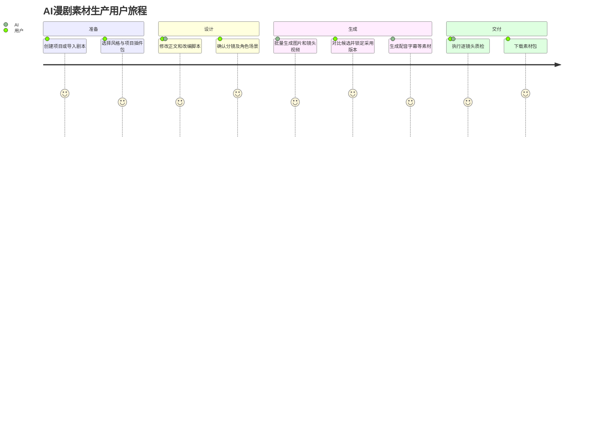
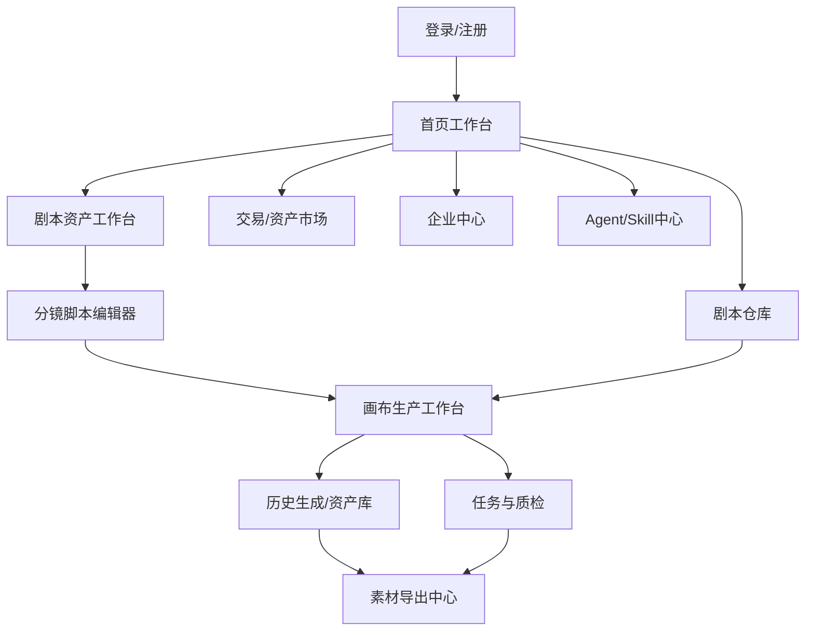
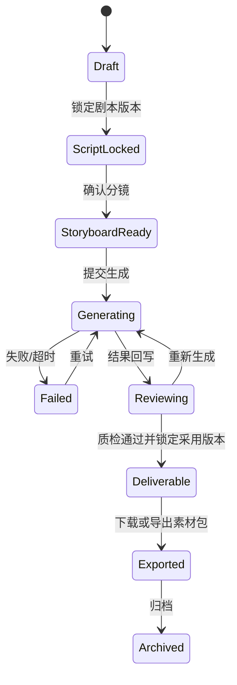
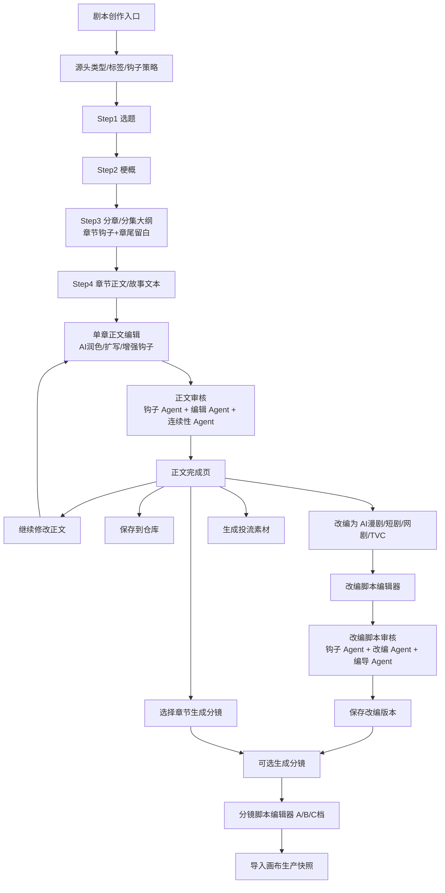
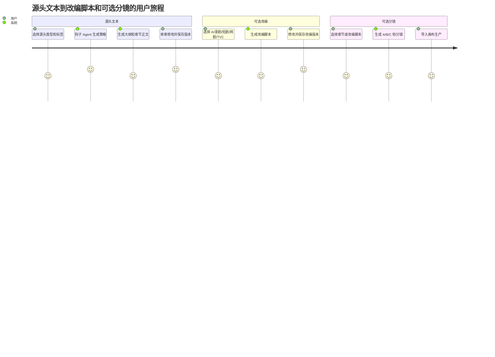
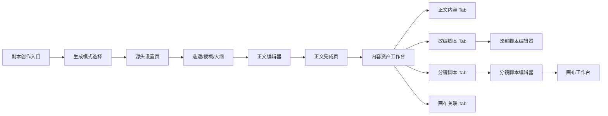
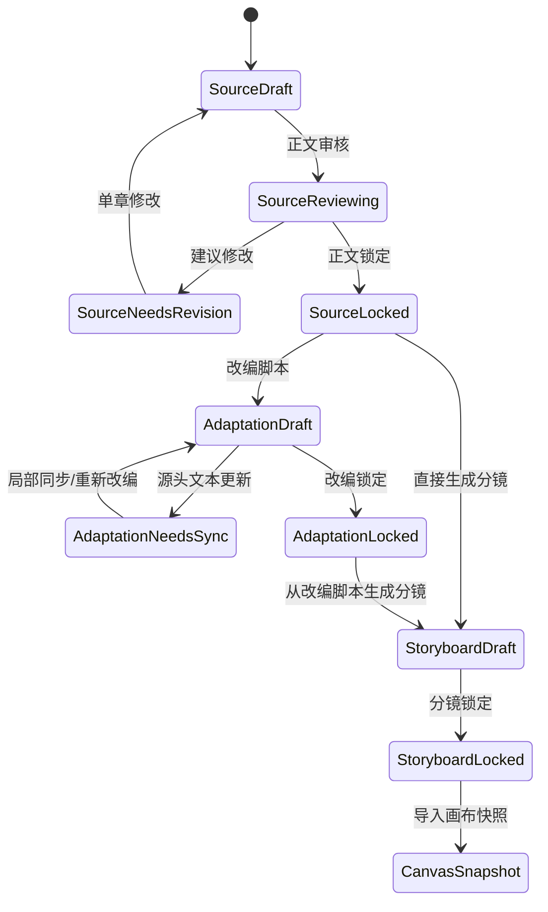

# AI漫剧与视频内容工业化生产工作台 · 用户端产品功能设计

> 基于《AI漫剧中转平台三周期规划》第一周期「AI漫剧创作与剧本交易平台」与《AI漫剧与视频内容工业化生产工作台 PRD V1.5》细化设计  
> 覆盖版本：V1.0 → V1.1 → V1.2 → V1.3 → V1.5  
> 🆕 V1.5修订：产品定位升级为 AI 漫剧与视频内容工业化生产工作台，核心从“画布功能增强”升级为“项目、画布、节点、分镜、资产、批量生成、素材交付、工作流、Agent/Skill”的完整生产系统。平台不提供视频合成、视频剪辑或多轨时间轴编辑。
> 文档性质：用户端功能规格说明书（User-facing Feature Spec）

---

## 基于 superpowers 的更新记录（2026-07-04）V1.6 → V1.7

本文档基于 `docs/superpowers/` 下的最新设计文档进行了增量更新。主要变更：

| 更新项 | 说明 | 依据 superpowers |
|---|---|---|
| 模块 2 更新 | 脚本创作：自适应工作流、三种模式、`content_projects` 根对象、版本化 | `script-creation-v7-prd.md` |
| 新增模块 13 | 创作圣经：五大子系统页面、人工确认交互、上下文快照 | `script-creation-creative-bible-design.md` |
| 新增模块 14 | Agent 会话：三栏布局、计划审批卡片、SSE 实时更新 | `agent-session-completion-design.md` |
| 新增模块 15 | 脚本交易市场：市场发现/挂牌管理/订单支付/企业采购审批 | `script-trading-market-completion-design.md` |
| 模块 5/6/9 更新 | 资产市场完整功能；画布浮动编辑器+首页+画布中心；工作编辑器中心 | `ai-asset-market-completion-design.md`、`canvas-node-floating-editor-design.md`、`platform-home-canvas-center-design.md`、`work-editor-evolution-design.md` |
| 模块 4/5 更新 | 分镜：三栏专业编辑器（13维/A/B/C层级/XLSX）；仓库/启动台分离 | `storyboard-professional-editor-redesign.md`、`script-creation-warehouse-flow-design.md` |
| 全局导航更新 | 新路由结构：`/` 首页、`/script-gen` 启动台、`/warehouse` 仓库、`/canvas-projects` 画布中心 | `platform-home-canvas-center-design.md`、`script-creation-warehouse-flow-design.md` |
| 新增模块 16 | 资产生成工作台：个人/企业双视图、项目树、资产分类、发送画布、签名下载 URL | `2026-07-04-asset-generation-history-workbench-design.md` |
| 新增模块 17 | 统一任务事件中心：用户任务中心+运营控制台、SSE 实时推送、cursor-based 重连 | `2026-07-04-unified-task-event-center-design.md` |
| 新增模块 18 | 企业工作台（完整版）：角色化概览、组织管理、采购预算看板、统一审批列表、跨域审计日志 | `2026-07-04-enterprise-workbench-completion-design.md` |
| 新增模块 19 | Agent 配置中心：4 角色分组、双编辑模式、版本生命周期、试跑、Prompt 三层架构展示 | `2026-07-04-user-configurable-agent-center-design.md` |
| 新增模块 20 | 独立空白画布：创建对话框、purpose=experiment 默认、可选关联内容项目、按需绑定 | `2026-07-04-standalone-blank-canvas-design.md` |
| 模块 2 补强 | 三层解耦完整流程、自适应引导流程替代固定 10 步向导、三种创作模式并行入口 | `2026-06-29-script-creation-v7-prd.md` |
| 模块 6 补强 | 浮动编辑器交互（碰撞感知定位）、六种节点类型专属标签页、右侧属性栏/底部生成栏已废弃标记 | `2026-06-28-canvas-node-floating-editor-design.md` |
| 模块 12 补强 | 双界面（项目 SOP 控制台+画布质检侧栏）、6 个生产 Gate、返工工单界面、修复策略 | `2026-07-04-production-sop-completion-design.md` |
| 全局导航补强 | `/agent-center`、`/asset-workbench`、`/task-center`；侧栏智能生产分组增加任务中心；画布工作台增加独立空白画布创建入口 | `2026-07-04-enterprise-workbench-completion-design.md`、`2026-07-04-standalone-blank-canvas-design.md` |

> **注意**：本文档中标注 `[superpowers 更新]` 的段落为 V1.6 新增或修改内容。标注 `[superpowers 更新 V1.7]` 为 2026-07-04 新增内容。

---

## 目录

1. [产品概述与定位](#1-产品概述与定位)
2. [用户画像与角色](#2-用户画像与角色)
3. [核心用户旅程](#3-核心用户旅程)
4. [功能模块总览](#4-功能模块总览)
5. [模块一：首页与工作台](#5-模块一首页与工作台)
6. [模块二：剧本创作与分镜生成](#6-模块二剧本创作与分镜生成)
7. [模块三：剧本仓库](#7-模块三剧本仓库)
8. [模块四：剧本交易市场](#8-模块四剧本交易市场)
9. [模块五：AI资产与风格模型市场](#9-模块五ai资产与风格模型市场)
10. [模块六：画布视频工作台](#10-模块六画布视频工作台)
    - [10.13 无限画布节点系统 (LibTV)](#1013-无限画布节点系统f-06-11-对标-libtv-无限画布)
    - [10.14 Slash快捷命令](#1014-slash快捷命令f-06-12)
    - [10.15 导演台·3D构图](#1015-导演台3d构图f-06-13)
    - [10.17 20+运镜预设](#1017-20运镜预设f-06-15)
    - [10.18 多模态参考生视频](#1018-多模态参考生视频f-06-16-对标-seedance-20)
    - [🆕 10.19 多副本并行生成 V1.3](#1019-多副本并行生成-v13)
    - [🆕 10.20 资产双向联动 V1.3](#1020-资产双向联动-v13)
    - [🆕 10.21 工作流模板化 V1.3](#1021-工作流模板化-v13)
11. [🆕 模块七：Agent协作体系](#11-模块七agent协作体系) — 含V1.3 Agent画布联动
12. [🆕 模块八：Agent记忆与Skill配置](#12-模块八agent记忆与skill配置)
13. [🆕 模块九：可编程供应商系统](#13-模块九可编程供应商系统)
14. [🆕 模块十：章节事件图谱](#14-模块十章事件图谱)
15. [模块十一：账户体系与个人中心](#15-模块十一账户体系与个人中心)
16. [模块十二：工业化生产SOP与团队协作](#16-模块十二工业化生产sop与团队协作)
17. [🔥 模块十三：创作圣经](#模块十三创作圣经)
18. [🔥 模块十四：Agent 会话](#模块十四agent-会话)
19. [🔥 模块十五：脚本交易市场](#模块十五脚本交易市场)
20. [🔥 模块十六：资产生成工作台](#模块十六资产生成工作台)
21. [🔥 模块十七：统一任务事件中心](#模块十七统一任务事件中心)
22. [🔥 模块十八：企业工作台（完整版）](#模块十八企业工作台完整版)
23. [🔥 模块十九：Agent 配置中心](#模块十九agent-配置中心)
24. [🔥 模块二十：独立空白画布](#模块二十独立空白画布)
25. [版本迭代计划](#17-版本迭代计划)
26. [全局交互规范](#18-全局交互规范)
27. [指标追踪体系](#19-指标追踪体系)

---

## 1. 产品概述与定位

### 1.1 产品一句话定义

**AI漫剧与视频内容工业化生产工作台**是一个融合 **「无限画布 + 节点工作流 + 分镜生产 + 资产库 + 批量生成 + 素材交付 + 工作流模板 + Agent/Skill 自动执行」** 的一站式内容生产平台。

> 产品理念：参考 LibTV 的无限画布与节点连线工作流、NeoWOW / NeoTV 的 AI 漫剧生产与全能参考能力、Nody 的 Agent 自动搭建工作流方向，将传统“单次生成工具”升级为可持续生产、复用和自动执行的工业化工作台。

### 1.1.1 V1.5 能力分层

```text
第一层：项目层
├── 项目创建 / 项目管理 / 多集管理 / 权限管理 / 导出管理

第二层：画布层
├── 无限画布 / 节点拖拽 / 节点连线 / 节点打组 / 自动保存 / 小地图

第三层：节点层
├── 文本 / 脚本 / 分镜 / 图片 / 视频 / 音频 / 角色 / 场景 / 道具节点

第四层：生成层
├── 文生图 / 图生图 / 文生视频 / 图生视频 / 首尾帧视频 / 全能参考视频 / 多副本并行生成 / TTS / BGM / 音效

第五层：资产层
├── 图片资产 / 视频资产 / 音频资产 / 角色库 / 场景库 / 道具库 / 历史生成 / 团队资产

第六层：交付层
├── 分镜顺序预览 / 采用版本清单 / 单素材下载 / 项目素材包导出

第七层：自动化层
├── AI导演 / Skill市场 / 工作流模板 / Agent执行计划 / OpenAPI / 第三方Adapter

第八层：内容结构与审核层
├── 钩子 Agent / 编导 Agent / 导演 Agent / 每集联合审核 / TVC 分秒节奏审核
```

### 1.1.2 V1.5 创作生产闭环

```text
创建项目
→ 导入剧本 / 小说 / 创意
→ 选择内容大类（剧本 / TVC）+ 标签矩阵 + 钩子策略
→ AI 拆分场次、镜头、台词、旁白
→ 钩子 Agent 生成全剧大钩子、每集 S1-S6 曲线、集间承接
→ 编导 Agent + 导演 Agent 对单集进行联合审核
→ AI 提取角色、场景、道具
→ 创建角色库 / 场景库 / 道具库
→ 批量生成分镜图
→ 图片生成视频
→ 首尾帧 / 全能参考 / 多副本抽卡
→ 生成配音、BGM、音效
→ 逐镜头质检与采用版本锁定
→ 单素材下载 / 项目素材包导出
→ 资产沉淀
→ 保存工作流模板
```

平台交付边界止于可追溯的镜头与配套素材包。视频剪辑、片段拼接、转场、特效叠加、混音、多轨时间轴和整片渲染由外部后期工具承担。

### 1.1.3 V1.5 页面与节点交付口径

用户端功能设计必须能直接拆给前端、后端、产品和测试使用。所有画布节点模块按以下四层描述，不允许只写“支持生成”或“支持编辑”。

| 层级 | 必须说明 | 示例 |
|---|---|---|
| 页面布局 | 节点在左侧栏、画布卡片、右侧属性面板、底部生成器、资产栏中分别如何呈现 | 图片节点在画布显示预览，右侧显示 Prompt/模型/成本，底部显示生图参数 |
| 用户交互 | 用户点击什么、拖拽什么、右键选择什么、端口如何连接 | 从图片节点右侧端口拖出，松手到空白处弹出“视频节点/图片编辑/参考图”菜单 |
| 任务与扣费 | 是否调用积分预估、用户何时确认、创建什么任务、失败是否退还 | 点击“图生视频”先预估积分，确认后创建 `video` 任务，失败退还冻结积分 |
| 结果归属 | 任务结果显示在哪里、是否入资产库、是否回写分镜或导出清单 | 生成视频显示在视频节点播放器，同时写入资产库，可加入项目采用版本清单 |

节点模块验收以“前端状态 + 接口响应 + 数据落库 + 资产可复用 + 计费可追踪”为准。产品验收不能只看页面是否有按钮，测试也不能只看接口是否返回 200。

### 1.2 对标产品分析

| 维度 | LiblibAI (哩布哩布) | 即梦AI (火山引擎) | **本平台（V1.5）** |
|------|-------------------|-------------------|-------------------|
| **核心能力** | AI模型市场 + 在线生图/视频 + 画布编辑 | 分镜模式 + 关键帧控制 + 视频生成 | **工业化生产工作台：项目、画布、节点、分镜、资产、素材交付、自动化** |
| **画布** | 无限画布：inpaint/outpaint/扩图 | 分镜画布：多镜头编排+时间轴 | **无限画布 + 节点连线 + 分镜生产 + 采用版本管理** |
| **模型/资产** | Checkpoint/LoRA/VAE 模型市场 | 预设风格模型 | **角色库 + 场景库 + 道具库 + 历史生成 + 团队资产** |
| **视频生成** | 图生视频/文生视频（单镜头） | 多镜头分镜→连续视频生成 | **批量分镜生图 + 批量图生视频 + 首尾帧 + 全能参考 + 多副本** |
| **工作流** | ComfyUI在线编排 | 分镜模式（Shot-by-shot） | **可保存、复用、发布的节点工作流模板 + Agent/Skill自动执行** |
| **🆕 V1.5增强** | — | — | **P0覆盖双击建节点、拖入素材、脚本全屏、批量生图/视频、图片拉出视频、资产历史、素材包导出、Agent会话** |
| **社区** | 模型/作品分享社区 | — | **剧本交易 + 资产交易** |

### 1.3 第一周期核心价值主张

| 维度 | 描述 |
|------|------|
| **核心价值** | 让创作者和团队在一个工作台中完成「剧本→分镜→资产→批量生成→逐镜头质检→素材包导出→模板复用」完整生产闭环 |
| **画布核心理念** | 画布不是展示层，而是生产编排层：节点承载任务，连线表达依赖，资产沉淀结果，工作流固化SOP，Agent自动执行专家流程 |
| **目标用户** | 短剧编剧、AI漫剧团队、MCN机构、矩阵号团队、内容创业者 |
| **解决的痛点** | AI工具分散、单次生成不可控、资产无法沉淀、分镜到可交付素材链路断裂、团队生产不可追溯 |
| **差异化** | 从“输入 Prompt 生成视频”升级为可追溯、可复用、可规模化的 AI 视频工业化生产系统 |

### 1.4 第一周期边界

- ✅ **做**：AI辅助剧本生成、剧本在线交易、**画布式分镜编排**、AI角色/场景资产生成、**关键帧视频生成**、**风格模型市场（种子期）**、素材包导出、**Agent/Skill画布联动**、**多副本并行生成**、**全能参考视频引擎**、**工作流模板化**
- ❌ **不做**：平台内视频合成、视频剪辑、多轨时间轴、转场/特效/混音、承制方入驻与撮合（第二周期）、数字资产授权市场（第三周期）、复杂收益分账（第三周期）、ComfyUI在线工作流（第二周期）、LoRA训练服务（第二周期）

---

## 2. 用户画像与角色

### 2.1 核心用户画像

#### 画像A：短剧编剧（个体创作者）

| 属性 | 描述 |
|------|------|
| **典型身份** | 自由职业编剧、网文作者转型、影视专业学生 |
| **核心需求** | 快速将灵感转化为可售卖的标准格式剧本 |
| **使用场景** | 打开平台 → 输入一句话创意 → AI生成剧本资产初稿 → 编辑打磨 → 锁稿后上架售卖或送入画布 |
| **关键行为** | 高频使用剧本生成、剧本编辑、剧本上架 |
| **付费意愿** | 中等（愿意为高质量生成付费，也希望通过卖剧本赚钱） |
| **痛点** | 灵感枯竭时需要选题辅助、不懂分镜格式、缺乏售卖渠道 |

#### 画像B：AI漫剧团队/工作室

| 属性 | 描述 |
|------|------|
| **典型身份** | 2-5人小团队，分工负责剧本、美术、剪辑 |
| **核心需求** | 批量生产漫剧内容，保持角色/场景一致性，高效导出发布 |
| **使用场景** | 购买/自创剧本 → 批量生成角色和场景 → 生成镜头视频、配音和字幕 → 批量导出素材包 → 外部后期与分发 |
| **关键行为** | 剧本购买、批量漫剧生成、角色一致性管理 |
| **付费意愿** | 高（关注产出效率和质量，愿意为批量生成和高质量导出付费） |
| **痛点** | 角色跨集不一致、批量生成流程繁琐、多平台尺寸适配 |

#### 画像C：MCN机构 / 矩阵号团队

| 属性 | 描述 |
|------|------|
| **典型身份** | 运营10+个短视频账号的内容团队 |
| **核心需求** | 低成本、大批量获取漫剧内容填充矩阵号 |
| **使用场景** | 浏览剧本市场 → 批量购买剧本 → 快速生成漫剧 → 投放测试 → 爆款追加生成 |
| **关键行为** | 剧本浏览与筛选、批量购买、投流素材生成 |
| **付费意愿** | 高（内容采购预算，看ROI） |
| **痛点** | 选题同质化、内容生产成本高、爆款率不稳定 |

#### 画像D：抖音/快手/视频号创业者（个人）

| 属性 | 描述 |
|------|------|
| **典型身份** | 个人内容创业者，兼职或全职运营1-3个账号 |
| **核心需求** | 零门槛制作漫剧、低成本试错、快速验证选题 |
| **使用场景** | 找到一个爽点创意 → 生成1集样片 → 发布测试数据 → 效果好则继续生成完整剧集 |
| **关键行为** | 样片生成、单集测试、数据反馈后追加生成 |
| **付费意愿** | 低到中等（先免费试用，效果好再付费） |
| **痛点** | 完全零基础（不会写剧本/画图/剪辑）、预算有限、需要投流素材 |

#### 画像E：企业/B2B客户

| 属性 | 描述 |
|------|------|
| **典型身份** | 品牌方市场部、短剧发行公司、IP版权方、广告代理商、企业内容营销部门 |
| **核心需求** | 批量采购剧本/IP、定制品牌漫剧、统一管理多团队产出、API对接内部系统 |
| **使用场景** | 企业管理员开通组织账号 → 邀请团队成员入驻 → 分配角色权限 → 统一采购剧本资产 → 多团队并行创作 → 管理员审核导出 → API对接分发系统 |
| **关键行为** | 组织管理、成员权限管控、批量采购、资产统一管理、API调用 |
| **付费意愿** | 高（年度预算制，看重ROI和服务保障） |
| **痛点** | 多团队协作混乱、资产不统一、采购流程不透明、无法与企业现有系统对接、缺乏管理员审核机制 |

### 2.2 用户角色权限体系

| 角色 | 权限范围 |
|------|---------|
| **游客（未登录）** | 浏览交易市场剧本列表、试读剧本前1集、查看平台样例 |
| **注册用户（免费）** | 每日3次免费剧本生成、保存5部剧本到仓库、浏览市场、试读剧本、镜头视频预览带水印 |
| **创作者会员（付费）** | 无限剧本生成、无限仓库容量、剧本上架交易、无水印导出、批量生成、角色一致性管理 |
| **企业管理员（B2B）** | 创作者会员全部权限 + 🆕 组织架构管理 + 🆕 成员角色分配 + 🆕 企业资产库统一管控 + 🆕 采购审批流程 + 🆕 多团队工作区 + API接入管理 |
| **企业成员（B2B）** | 由管理员分配权限（可细粒度控制：可生成/可采购/可导出/可管理资产/可审核） |
| **平台运营/审核员** | 剧本审核、资产审核、内容安全巡检、用户投诉处理 |
| **企业版（付费）** | 创作者会员全部权限 + 团队协作、API接入、优先客服 |

> **V1.6 企业工作台架构更新**：企业功能已重构为 Workspace 模式。
> - 企业工作台入口：`/enterprise` → 概览/审批/组织/预算/审计
> - Workspace 切换器位于顶部栏，支持个人空间 ↔ 企业空间一键切换
> - 权限码从旧 `can_*`/`ent_admin`/`dept_head` 迁移至新体系（`org.member.manage`、`trade.purchase.approve` 等），附带 WORKSPACE/DEPARTMENT/SELF 三级数据范围
> - 组织管理（部门/成员/角色）通过 8080 BFF 代理到 3001 账户中心
> - 统一审批中心覆盖采购、资产发布、项目导出三类审批
> - 采购预算独立于钱包余额，审批通过后需显式付款
> - 企业资产入口复用 Workspace 资产库，不建设第二套资产数据
> - 设计文档：`docs/superpowers/specs/2026-07-04-enterprise-workbench-completion-design.md`

---

### 2.3 全局流程图集

#### 2.3.1 总流程图


#### 2.3.2 用户旅程图



#### 2.3.3 页面跳转图



#### 2.3.4 状态流转图



---

## 3. 核心用户旅程

### 3.1 主旅程：从创意到素材交付（画布驱动闭环）

```
[输入创意] → [AI选题建议] → [生成故事梗概] → [生成分集大纲]
    → [逐集生成剧本] → [保存到仓库]
        → 🎨 [进入画布视频工作台]
            ├── [剧本自动解析为分镜卡片]
            ├── [在画布上拖拽编排分镜顺序]
            ├── [为每个镜头生成/选择角色和场景]
            ├── [在画布内编辑关键帧——首帧/尾帧]
            ├── [画布内 Inpaint 微调角色表情/场景细节]
            ├── [按镜头生成配音/字幕/音效素材]
            ├── [逐镜头预览、质检并锁定采用版本]
            └── [下载单素材或导出项目素材包]
```

### 3.2 画布工作流（对应即梦AI分镜模式 + LiblibAI画布编辑）

```
┌─────────────────────────────────────────────────────┐
│                   🎨 画布视频工作台                    │
│                                                      │
│  ┌──────────────────────┐  ┌────────────────────┐   │
│  │    分镜卡片面板       │  │   画布编辑区（主）   │   │
│  │  ┌────┐ ┌────┐ ┌───┐ │  │                    │   │
│  │  │镜头│ │镜头│ │镜 │ │  │  ┌──────────────┐  │   │
│  │  │ 1  │ │ 2  │ │头3│ │  │  │              │  │   │
│  │  └────┘ └────┘ └───┘ │  │  │  所选镜头的   │  │   │
│  │  ┌────┐ ┌────┐      │  │  │  画布编辑区   │  │   │
│  │  │镜头│ │镜头│ ...  │  │  │  (可缩放/平移) │  │   │
│  │  │ 4  │ │ 5  │      │  │  │              │  │   │
│  │  └────┘ └────┘      │  │  └──────────────┘  │   │
│  │  [+ 添加镜头]       │  │                    │   │
│  └──────────────────────┘  └────────────────────┘   │
│                                                      │
│  ┌──────────────────────────────────────────────┐   │
│  │  📋 镜头采用版本清单（只读顺序）               │   │
│  │  镜头1✓  镜头2待选  镜头3✓  镜头4待质检       │   │
│  │  配套：配音✓ 字幕✓ BGM待选 音效✓              │   │
│  │  [逐镜头预览] [批量下载] [导出素材包]          │   │
│  └──────────────────────────────────────────────┘   │
│                                                      │
│  ┌──────────────────────────────────────────────┐   │
│  │  资产面板 (Assets Panel)                       │   │
│  │  👤 角色  🏞️ 场景  🎵 音效  🎬 风格模型       │   │
│  │  [拖拽资产到画布或绑定到镜头]                  │   │
│  └──────────────────────────────────────────────┘   │
└─────────────────────────────────────────────────────┘
```

### 3.3 交易旅程：卖剧本

```
[从仓库选择剧本] → [设置授权类型] → [定价] → [填写剧本简介]
    → [提交审核] → [审核通过] → [上架展示] → [买家购买] → [收益到账]
```

### 3.4 交易旅程：买剧本并生成漫剧

```
[浏览市场] → [试读前1-3集] → [选择授权类型] → [支付]
    → [剧本进入我的仓库] → [进入画布工作台生成镜头素材] → [导出项目素材包]
```

### 3.5 🆕 B2B企业旅程

```
[企业注册+认证] → [开通组织] → [邀请团队成员] → [分配角色权限]
    → [设定企业资产库] → [设定采购预算与审批规则]
        → 成员创作/采购 → 负责人审批 → 管理员审核 → 导出素材包
            → [企业API对接分发系统]
```

### 3.6 🆕 注册与账户激活旅程

```
[选择注册方式] → [验证手机/邮箱] → [选择账户类型：个人/企业]
    → 个人：完善创作者资料 → 新手引导 → 进入工作台
    → 企业：填写企业信息 → 提交认证 → 审核中(可预览) → 认证通过 → 开通组织 → 进入企业工作台
```

---

## 4. 功能模块总览

```
用户端
├── 🆕 账户体系（平台基石）
│   ├── 注册/登录（手机/邮箱/微信/企业SSO）
│   ├── 安全认证（密码+MFA+会话管理）
│   ├── 个人创作者认证
│   └── 企业认证（营业执照/品牌授权）
├── 首页与工作台
│   ├── 个人工作台（快捷入口/最近项目/灵感推荐）
│   ├── 🆕 企业工作台（企业概览/待处理/团队动态）
│   └── 数据概览
├── 剧本创作 ← 🆕 双路径工作流 + 4轴标签体系（52+标签）
│   ├── ⚡ 快速模式（4轴标签全量选择 + 8种智能组合卡片 + 平台/人群/集数参数 + 一键生成）
│   ├── 🎬 AI开书向导（灵感→3套整本方案+书名候选 → 确认后自动填充AI写作）
│   ├── 🤖 AI写作（7步向导：框架→选题→梗概→大纲→剧本→分镜→投流）
│   ├── 🧩 内容大类入口（剧本 / TVC），按不同创作目标切换钩子策略
│   ├── 👥 角色阵容工作台（AI提取角色→结构化卡片：名称/外貌/性格/成长弧/台词）
│   ├── ✍️ 写法资产面板（8种预设风格模板 + 自定义保存/编辑/复用，localStorage持久化）
│   ├── 📂 上传小说（上传→AI分析→修订→分镜脚本）
│   ├── 📋 A/B/C三档分镜体系（编导速看/导演确认/生产交付）
│   ├── 🪝 钩子Agent（全剧大钩子+每集S1-S6曲线+连续性审查）
│   └── ✅ 每集联合审核（钩子Agent + 编导Agent + 导演Agent）
├── 剧本仓库
│   ├── 剧本列表与管理
│   ├── 剧本编辑器
│   ├── 分类与标签
│   ├── 版本管理
│   ├── 剧本评分
│   └── 状态管理
├── 剧本交易市场
│   ├── 市场浏览与搜索
│   ├── 剧本试读
│   ├── 购买与支付
│   ├── 授权选择
│   ├── 我的售卖
│   └── 已购剧本
├── AI资产与风格模型市场 ← 🆕 对标 LiblibAI 模型市场
│   ├── 风格模型市场（Checkpoint/LoRA/Style）
│   ├── 角色资产库（可复用角色模板）
│   ├── 场景资产库（可复用场景模板）
│   ├── 提示词市场（Prompt Marketplace）
│   ├── 配音音色库
│   ├── 音效/BGM素材库
│   └── 我的资产管理
├── 画布视频工作台 ← 🆕 对标 即梦AI分镜画布 + LiblibAI画布编辑
│   ├── 分镜画布（Storyboard Canvas）
│   ├── 关键帧编辑器（Keyframe Editor）
│   ├── 角色/场景画布编辑（Inpaint/Outpaint）
│   ├── 配音/字幕/BGM/音效素材生成
│   ├── 单镜头预览与候选对比
│   ├── 镜头采用版本清单
│   └── 单素材下载/项目素材包导出
├── 账户体系与个人中心 ← 🆕 平台基石
│   ├── 注册/登录（手机/邮箱/微信/企业SSO）
│   ├── 安全认证（MFA+会话管理）
│   ├── 个人中心（账户/会员/消费/统计/API Key）
│   ├── 企业中心（组织管理/权限/资产库/采购审批）
│   └── 会员权益（免费/创作者/企业版三级）
├── 🆕 企业中心（B2B）
│   ├── 组织架构管理（部门/团队/成员邀请）
│   ├── 细粒度权限管控（11项权限）
│   ├── 企业资产库（共享角色/场景/风格/音色）
│   ├── 采购审批流程（预算管控+多级审批）
    ├── 素材包审核机制
    ├── 企业API管理
    └── 企业数据报表
├── 工业化生产SOP与团队协作 ← 🆕 对标 V7.6 工业通用SOP
│   ├── 岗位角色与权限矩阵
│   ├── 生产准入规则（13项检查）
│   ├── 审计返工体系（P0-P3 + S-D级）
│   ├── AI失败恢复体系
│   ├── 版本管理与锁定规则
│   └── 产能与复杂度估算
├── 🔥 资产生成工作台 `[superpowers 更新 V1.7]`
│   ├── 左侧项目树 + 中间业务分类标签页（角色/场景/道具/分镜/语音/音乐/其他）
│   ├── 个人视图与企业视图切换
│   ├── 核心操作：发送到画布、重新生成、移动/归档、发布到市场、删除（30天回收站）
│   ├── media_type 与 asset_type 分离
│   ├── "未归档"特殊集合 + 批量归档
│   └── 签名下载 URL（实时生成，不存储）
├── 🔥 统一任务事件中心 `[superpowers 更新 V1.7]`
│   ├── 用户任务中心（/task-center）：当前 Workspace 内所有生成+交易任务统一入口
│   ├── 任务概览：分状态计数、最近任务、待处理项
│   ├── 任务详情：阶段时间线、执行尝试链、错误诊断、费用构成、allowed_actions
│   ├── SSE 实时推送（替换旧 10 秒轮询），cursor-based 断线重连
│   ├── 命令：取消/重试/继续付款/取消订单/提交退款/补充证据
│   └── 运营控制台（/ops/task-center）：全局态势、异常队列、对账差异、告警、工单
├── 🔥 企业工作台（完整版）`[superpowers 更新 V1.7]`
│   ├── 角色化概览：管理员/部门负责人/普通成员不同视图
│   ├── 组织管理：部门树、成员列表、邀请（手机/邮箱）、角色/权限分配；最后管理员保护
│   ├── 采购预算看板：workspace/部门/成员月度预算、单次采购上限、reserved/consumed/available 投影
│   ├── 统一审批列表：采购/资产发布/项目导出三类共用一个收件箱
│   ├── 跨域审计日志：按 domain/action/operator/日期统一查询
│   └── Workspace 切换器：始终可见，个人+多个企业，成员资格失败回退个人
├── 🔥 Agent 配置中心 `[superpowers 更新 V1.7]`
│   ├── Agent 列表（按 4 角色分组：Hook/编剧/分镜/导演）
│   ├── 新建/复制/编辑/试跑/发布/回滚
│   ├── 双编辑模式：结构化参数表单 + 高级 Prompt 编辑器
│   ├── 版本历史：草稿→发布→归档 生命周期
│   ├── 配置解析优先级：临时参数 > 项目绑定 > 用户默认 > 系统默认
│   ├── 项目绑定：项目管理员设置项目默认 Agent 版本
│   ├── 试跑功能：输入测试→输出预览+tokens/费用数据
│   └── Prompt 三层架构展示（锁定层+可编辑层+运行时层），前端不提交最终 System Prompt
├── 🔥 独立空白画布 `[superpowers 更新 V1.7]`
│   ├── 创建对话框：仅名称必填，"关联内容项目"开关默认关闭="稍后关联"
│   ├── purpose=experiment 默认
│   ├── 开关打开时：显示现有上游选择器+准入检查
│   └── 创建后：自由编辑/测试，但正式生图/生视频/导出前需完成上游绑定
```

### 4.1 模块关系与数据流

```
┌─────────────────────────────────────────────────────────┐
│  阶段一：剧本资产创作（Module 2: Step 1-4）              │
│  创意/上传 → 内容大类/标签/钩子策略 → 选题 → 梗概 → 大纲钩子曲线 │
│  → 章节正文 → 每集联合审核 → 故事设定 → 保存到仓库             │
└──────────────────────┬──────────────────────────────────┘
                       │ 锁稿剧本资产
                       ▼
┌─────────────────────────────────────────────────────────┐
│  项目配置（Module 3: 项目插件包）                         │
│  人物资产卡 + 声音资产卡 + 场景资产卡 + 风格参数          │
│  + 世界观规则 + 伏笔表 + 禁止偏移规则 + 连续性状态        │
└──────────────────────┬──────────────────────────────────┘
                       │ 剧本 + 插件包
                       ▼
┌─────────────────────────────────────────────────────────┐
│  阶段二：分镜生产（Module 2: Step 5 — V7.6工业分镜SOP）  │
│  A档编导速看 → B档导演确认 → C档生产三表                  │
│  继承每集审核报告中的钩子、编导、导演建议                  │
│  （AI抽卡表 + AI视频表 + 配音字幕表）                     │
└──────────────────────┬──────────────────────────────────┘
                       │ C档生产三表
                       ▼
┌─────────────────────────────────────────────────────────┐
│  阶段三：画布生产（Module 6: 画布视频工作台）— LibTV增强  │
│  🆕 无限画布节点编排 → 🆕 脚本流水线(剧本→分镜→视频)     │
│  → 角色/场景生成 → 关键帧+20运镜 → 逐镜头质检 → 素材导出  │
│         ↑                          ↑                    │
│    Module 5: AI资产市场          Module 8: 生产SOP      │
│    (风格模型/角色/音色)         (准入→审计→锁定→验收)   │
│    🆕 导演台3D构图              🆕 Slash快捷命令        │
│    🆕 多模态参考引擎             🆕 节点连线工作流       │
└─────────────────────────────────────────────────────────┘
                       │
                       ▼
                  素材包交付
```

### 4.2 画布工作台核心理念

不同于传统的「表单填写 → 点击生成 → 等待结果」线性流程，画布工作台提供：

| 传统方式 | 画布方式 |
|---------|---------|
| 分镜表 → 逐行填写 → 分别生成图片 | **分镜卡片拖拽编排**，所见即所得 |
| 角色图单独生成 → 手动关联 | **画布内 Inpaint**，选中角色拖入镜头 |
| 各步骤独立操作 → 反复跳转页面 | **单一画布界面**，完成全部创作 |
| 生成结果不满意 → 返回重填参数 | **画布内局部重绘**，精准微调 |
| 各镜头独立 → 一致性靠人工保证 | **全局角色/场景锁定**，跨镜头自动一致 |

---

## 5. 模块一：首页与工作台

### 5.1 页面结构

```
┌──────────────────────────────────────────────────────┐
│  Logo    [创作中心] [剧本市场] [我的仓库] [画布] [资产] [任务]  [🔔] [👤] [Workspace ▼] │  ← 顶部导航 `[superpowers 更新 V1.7]`
├──────────────────────────────────────────────────────┤
│                                                      │
│  ┌─────────────────────┐  ┌──────────────────────┐   │
│  │  👋 欢迎回来，XXX    │  │  本周数据            │   │
│  │  已生成 12 部剧本    │  │  📝 生成 5 次        │   │
│  │  已导出 3 个素材包   │  │  🛒 购买 2 部        │   │
│  │                     │  │  💰 收入 ¥128        │   │
│  └─────────────────────┘  └──────────────────────┘   │
│                                                      │
│  ┌──────────┐ ┌──────────┐ ┌──────────┐ ┌────────┐  │
│  │ ✍️       │ │ 📖       │ │ 🎬       │ │ 🛒     │  │
│  │ 开始创作 │ │ 剧本市场 │ │ 我的仓库 │ │ 最新   │  │
│  │ 从创意到 │ │ 发现优质 │ │ 管理剧本 │ │ 交易   │  │
│  │ 剧本生成 │ │ 剧本资源 │ │ 与生成   │ │ 动态   │  │
│  └──────────┘ └──────────┘ └──────────┘ └────────┘  │
│                                                      │
│  📌 最近项目                                          │
│  ┌──────────────────────────────────────────────┐    │
│  │ 《霸道总裁的替身新娘》  第5集  2小时前       │    │
│  │       [继续编辑] [生成漫剧] [查看详情]       │    │
│  ├──────────────────────────────────────────────┤    │
│  │ 《重生之商业帝国》      第1集  昨天          │    │
│  │       [继续编辑] [生成漫剧] [查看详情]       │    │
│  └──────────────────────────────────────────────┘    │
│                                                      │
│  💡 创作灵感 / 热门选题                                │
│  ┌─────────┐ ┌─────────┐ ┌─────────┐ ┌─────────┐   │
│  │重生逆袭 │ │豪门恩怨 │ │甜宠言情 │ │悬疑惊悚 │   │
│  │🔥 热榜#1│ │🔥 热榜#2│ │📈 上升  │ │🆕 新趋势│   │
│  └─────────┘ └─────────┘ └─────────┘ └─────────┘   │
│                                                      │
└──────────────────────────────────────────────────────┘
```

### 5.2 功能点详情

#### 5.2.1 快捷入口（F-01-01）

| 属性 | 说明 |
|------|------|
| **入口** | 首页首屏，主要操作卡片 |
| **卡片项** | 开始创作（剧本生成）、🎨 画布工作台、📖 剧本市场、🗄️ 我的仓库、🛒 资产市场、⚙️ Agent 配置中心 `[superpowers 更新 V1.7]`、📋 任务中心 `[superpowers 更新 V1.7]` |
| **画布入口** | 突出设计：可从首页直接进入空白画布、或从最近项目快速恢复上次画布编辑状态；新增「新建空白画布」独立入口 `[superpowers 更新 V1.7]` |

#### 5.2.2 最近项目（F-01-02）

| 属性 | 说明 |
|------|------|
| **数据来源** | 用户最近编辑/生成/购买的剧本，按最后操作时间倒序 |
| **展示数量** | 默认展示最近5个项目，可展开查看更多 |
| **快捷操作** | 继续编辑（回到上次编辑位置）、生成漫剧（跳转生成模块）、查看详情 |
| **状态标签** | 显示剧本当前状态（草稿/已上架/已售出/生成中/已完成） |

#### 5.2.3 数据概览（F-01-03）

| 属性 | 说明 |
|------|------|
| **展示指标** | 本周生成次数、本周导出素材包数、消费金额、收入金额（如有上架售卖） |
| **周期** | 默认本周，可切换本月/累计 |
| **可见角色** | 收入相关指标仅对已上架剧本的用户展示 |

#### 5.2.4 创作灵感推荐（F-01-04）

| 属性 | 说明 |
|------|------|
| **内容来源** | 平台热榜题材 + AI基于近期趋势生成的推荐选题 |
| **展示形式** | 卡片式，包含题材名称、热度标签、一键「以此为灵感创作」 |
| **更新频率** | 每日更新 |

---

## 6. 模块二：剧本创作与分镜生成 `[superpowers 更新 V1.7]`

> **核心定位**：覆盖从「一句话创意」到「源头小说/故事文本」、再到「AI漫剧/短剧/网剧/TVC改编脚本」和「可选分镜生产」的完整链路。
> **三层资产架构**：**源头文本**（小说/故事文本/产品故事/品牌叙事）→ **改编脚本**（AI漫剧/短剧/网剧/TVC）→ **分镜生产资产**（A/B/C档分镜与画布快照）。
> **分镜不是必选步骤**：用户可以只完成小说/故事文本创作并保存入库；只有用户主动选择章节或改编脚本时才生成分镜。
> **钩子前置**：钩子 Agent 必须介入选题、大纲、章节正文、章尾留白、AI编辑和正文审核，而不是只在分镜前做质检。
>
> **`[superpowers 更新 V1.7]` 三层解耦与自适应引导**：
> - **三层解耦完整流程**：源正文编辑 → 改编脚本生成 → 可选分镜制作。每层独立保存、独立版本化，层间通过「送入下一层」操作显式流转，不再强制捆绑。
> - **自适应引导流程**：替代原有固定 10 步向导。系统根据用户当前进度和选择，动态展示下一步推荐（如：已有正文→推荐改编；已有改编→推荐分镜；无任何内容→推荐选题），用户可跳过或自选路径。
> - **`content_projects` 为统一根对象**：所有创作内容（源正文、改编脚本、分镜、投流素材）均挂载到 `content_projects` 下，通过 `content_type` + `status` 区分阶段，替代旧的多表散落结构。
> - **三种创作模式并行入口**：短剧（单集/多集连续）、长篇世界观（分卷/章节体系）、TVC（品牌/产品/电商转化/招商/公益）三种模式在创作入口并列展示，各自带有专属模板和参数预设。
> - **引用**：`docs/superpowers/specs/2026-06-29-script-creation-v7-prd.md`

### 6.1 整体交互流程



**使用模式**：

```
[选择生成模式]
    ├── 快速模式：一句话创意 → 源头文本资产初稿（可选同时改编/生成A档分镜）
    └── 精细模式：分步引导，每步可人工调整（适合精品创作）
        ├── 阶段一：源头文本创作，Step 0-4，可反复迭代
        ├── 阶段二：改编脚本，可选生成 AI漫剧/短剧/网剧/TVC
        ├── 阶段三：分镜生产，可选生成 A/B/C 档分镜
        └── 阶段四：投流素材，可从源头文本/改编脚本/分镜提取
```

### 6.1.1 用户旅程图



### 6.1.2 页面跳转图



### 6.1.3 状态流转图



### 6.2 生成模式选择页（F-02-00）

| 属性 | 说明 |
|------|------|
| **快速模式** | 用户只需输入一句话创意，默认生成源头文本资产；可高级勾选同时生成改编脚本或A档分镜 |
| **精细模式** | 分步引导：源头文本 → 正文完成页 → 可选改编脚本 → 可选分镜 → 可选投流 |
| **默认模式** | 新用户默认快速模式，老用户记忆上次选择 |
| **模式切换** | 生成过程中允许从快速模式切换到精细模式 |

### 6.2.1 内容大类与钩子策略配置（F-02-00A）

| 属性 | 说明 |
|------|------|
| **入口位置** | 生成模式选择页下方，进入 Step 1 前 |
| **源头类型** | 小说 / 故事文本 / 产品故事 / 品牌叙事 |
| **改编目标** | 可选：AI漫剧 / 短剧 / 网剧 / TVC |
| **TVC小类** | 品牌TVC / 产品TVC / 电商转化TVC / 招商TVC / 公益TVC |
| **受众/频向** | 剧本：男频 / 女频 / 双频；TVC：目标人群标签 |
| **标签矩阵** | 题材、情节、情绪/基调、时空背景、平台、长度 |
| **钩子风格** | 默认 / 强投流 / 高反转 / 情绪拉扯 / 爽点打脸 / 品牌记忆 / 产品转化 / 自定义 |

用户选择后，系统生成一张“源头钩子策略卡”，作为后续选题、大纲、章节正文、改编脚本、分镜和投流素材的硬约束。AI漫剧、短剧/网剧、TVC 默认从源头小说/故事文本演变，不再作为完全孤立的起点。

### 6.3 Step 1：爆款选题生成（F-02-01）

#### 6.3.1 功能描述

帮助用户从一个模糊的想法，生成一个有爆款潜力的、具体可执行的选题方案。

#### 6.3.2 输入区域

用户可通过两种方式输入创作意图：**自由文本** 或 **结构化标签**（两者可结合使用）。

| 输入项 | 类型 | 必填 | 说明 |
|--------|------|------|------|
| 创意描述 | 文本输入 | 是 | 一句话或多句话描述想法；placeholder：「比如：一个外卖小哥其实是隐藏的豪门继承人…」 |
| 🆕 标签化参数 | 标签选择 | 否 | 通过4轴标签体系精确描述创作意图（详见下方「标签化创作参数」） |
| 目标平台 | 多选 | 否 | 抖音 / 快手 / 视频号 / TikTok / B站；影响选题的节奏和爽点密度 |
| 目标人群 | 单选 | 否 | 男频 / 女频 / 全年龄；影响题材和情感线设定 |
| 参考作品 | 文本输入 | 否 | 可输入参考的剧名或风格描述，AI会借鉴风格但不抄袭 |

**🆕 标签化创作参数（4轴标签体系）：**

当用户选择「标签化参数」时，展开标签选择面板：

```
┌──────────────────────────────────────────────────────┐
│  标签化创作参数                                      │
│                                                      │
│  题材 (选1个)                                        │
│  [言情] [现实情感] [悬疑] [惊悚] [科幻] [武侠]       │
│  [脑洞] [太空歌剧] [赛博朋克] [游戏] [仙侠] [历史]   │
│                                                      │
│  情节 (最多3个)                                      │
│  [权谋] [重生] [穿越] [系统] [规则怪谈] [团宠]       │
│  [囤物资] [先婚后爱] [追妻火葬场] [破镜重圆]         │
│  [校园] [职场] [娱乐圈] [宫斗宅斗] [犯罪] [探险]     │
│  [丧尸] [克苏鲁] [争霸] [听心声] [读心术]           │
│  [倒计时文学] [日久生情] [一见钟情] [强取豪夺]       │
│  [欢喜冤家] [出轨] [婚姻] [家庭] [无系统]           │
│                                                      │
│  情绪/基调 (最多3个)                                  │
│  [甜宠] [虐恋] [爽文] [沙雕] [暗恋] [纯爱]          │
│  [复仇] [反转] [逆袭] [打脸] [多视角反转] [励志]    │
│  [热血] [烧脑] [治愈] [求生] [迪化] [HE] [BE]       │
│  [先虐后甜]                                          │
│                                                      │
│  时空背景 (选1个)                                     │
│  [古代] [现代] [未来] [架空] [民国]                   │
│  [五零年代] [六零年代] [七零年代] [八零年代] [兽世]   │
│                                                      │
│  [清空标签]  [以此生成选题 →]                        │
└──────────────────────────────────────────────────────┘
```

| 标签轴 | 可选数 | 作用 |
|--------|--------|------|
| **题材** | 1/12 | 决定故事的核心类型框架 |
| **情节** | ≤3/29 | 决定故事的情节走向和核心冲突模式 |
| **情绪/基调** | ≤3/20 | 决定故事的情感色彩和目标读者体验 |
| **时空背景** | 1/10 | 决定故事发生的时代和世界观基础 |

> **设计参考**：标签选择器UI原型见 `小说` HTML文件 — 提供了完整的标签编辑页面交互参考，包含左侧主题/设定面板与右侧标签选择网格。

#### 6.3.3 AI生成输出（标签模式增强）

当用户使用标签参数时，AI输出额外包含：

| 输出项 | 说明 | 示例 |
|--------|------|------|
| **标签匹配分析** | AI解读标签组合的市场潜力 | 「重生+甜宠+古代」= 高热度女频组合 |
| **标签差异化建议** | 在选定标签基础上建议添加差异化标签 | 「建议叠加『打脸』标签增强爽感」 |
| **推荐题材** | 3-5个可选题材方向 | 「重生逆袭」「豪门身份反转」「都市异能」 |
| **核心爽点** | 每个题材下列出3-5个爽点 | 「隐藏身份揭晓瞬间」「打脸反派」「美女倒追」 |
| **反转设计** | 每集可安排的反转节点 | 「第3集身份首次暗示」「第8集首次小揭露」 |
| **目标人群匹配度** | AI评估该选题与目标人群的匹配分数 | 重生逆袭 — 男频 95% 匹配 |
| **平台适配建议** | 针对不同平台的节奏建议 | 「抖音：前3集需每15秒一个钩子」「快手：标题党风格封面」 |

#### 6.3.4 用户操作

- 选择一个题材方向
- 可编辑AI生成的爽点和反转
- 可手动添加/删除爽点
- 点击「下一步：生成故事梗概」

### 6.4 Step 2：故事梗概生成（F-02-02）

#### 6.4.1 功能描述

基于选定的选题，生成包含世界观、主线剧情、核心冲突、人物关系的完整故事梗概。

#### 6.4.2 AI生成输出

| 输出项 | 说明 |
|--------|------|
| **世界观** | 故事发生的时代背景、世界规则、特殊设定 |
| **故事梗概** | 300-500字的完整故事概要 |
| **主线剧情** | 按起承转合结构，分4个阶段描述剧情走向 |
| **核心冲突** | 主角面临的主要矛盾（内在冲突+外在冲突） |
| **人物关系图** | 主角、配角、反派之间的关系图谱（文字版，后续可转可视化） |
| **故事亮点** | AI提炼的3-5个卖点标签 |

#### 6.4.3 用户操作

- 全文可编辑（富文本）
- 「重新生成」按钮 — 保留原选题，重新生成梗概
- 「微调」按钮 — 对特定段落提出修改意见（如「让反派更有层次感」）
- 点击「下一步：生成分集大纲」

### 6.5 Step 3：分集大纲生成（F-02-03）

#### 6.5.1 功能描述

将故事梗概展开为分集大纲，支持20集/40集/80集三种规格。分集大纲必须同时生成全剧大钩子、阶段钩子、每集 S1-S6 钩子曲线和集间承接关系。

#### 6.5.2 集数选择

| 选项 | 适用场景 | AI生成策略 |
|------|---------|-----------|
| **20集** | 短剧标准规格，适合抖音/快手付费短剧 | 每集1-2个核心事件，节奏紧凑 |
| **40集** | 中型剧集，适合有支线剧情的故事 | 主支线交替，每集保留钩子 |
| **80集** | 长篇连载，适合持续更新的矩阵号 | 分季设计，每20集一个小高潮 |

#### 6.5.3 输出格式

```
第1集：[标题]
  - 核心事件：xxx
  - 全剧大钩子引用：身份秘密 / 关系误会 / 反派阴谋...
  - 上集承接：xxx（第1集可为空）
  - 开场钩子：xxx
  - 中段升级点：xxx
  - S1-S6钩子曲线：强钩 / 人物 / 冲突 / 冲突升级 / 爽点 / 高潮留白
  - 结尾悬念：xxx
  - 下一集承诺：xxx
  - 钩子强度：★★★★☆
  - 关键人物出场：xxx

第2集：[标题]
  - 核心事件：xxx
  - 承接上集：xxx
  - 本集兑现：xxx
  - 结尾悬念：xxx
  - 下一集承诺：xxx

...（展示为可折叠列表）
```

#### 6.5.4 用户操作

- 单集大纲可编辑（点击展开编辑）
- 拖拽调整剧集顺序
- 插入/删除某一集
- 「自动优化钩子」— 钩子 Agent 检查全剧大钩子、每集开场、结尾、S1-S6强度和集间承接，并建议优化
- 支持锁定关键钩子，后续剧本生成和一键优化不得覆盖
- 点击「下一步：生成单集剧本」

### 6.6 Step 4：单集剧本生成（F-02-04）

#### 6.6.1 功能描述

将分集大纲逐集展开为标准格式剧本，包含场景、对白、旁白、动作、时长预估。

#### 6.6.2 剧本格式标准

| 元素 | 格式说明 |
|------|---------|
| **场景头** | `[场景N：场景名称] 时间 · 地点 · 人物` |
| **动作描述** | 以「△」开头，描述画面动作 |
| **角色对白** | `角色名：对白内容` |
| **旁白** | `【旁白】：旁白内容` |
| **心理活动** | `（心理）：内心独白内容` |
| **时长预估** | 自动估算每段对白/动作的时长 |

#### 6.6.3 生成与编辑

| 功能 | 说明 |
|------|------|
| **逐集生成** | 默认先生成第1集，用户确认后继续生成后续集 |
| **批量生成** | 高级选项：一次性生成全部集数（V1.2支持） |
| **剧本编辑器** | 专用剧本编辑器，支持场景/对白/旁白的结构化编辑 |
| **智能补全** | 在编辑器中按 Tab 键触发AI续写 |
| **格式校验** | 自动检查剧本格式是否正确，标记异常 |
| **时长统计** | 实时显示当前集预估时长 |
| **联合审核本集** | 调用钩子 Agent + 编导 Agent + 导演 Agent，输出总分、问题和修改建议 |

#### 6.6.4 附加功能

- **角色台词统计**：统计每个角色的台词占比
- **情绪曲线**：可视化展示本集的情绪起伏
- **敏感词检测**：自动标记可能违规的内容
- **钩子 Agent**：审核前3-5秒开场、结尾悬念、上集承接、下一集承诺，识别假钩子
- **编导 Agent**：审核核心事件、人物动机、人设一致性、冲突升级、情绪节奏和台词
- **导演 Agent**：审核场景数量、画面可表达性、镜头节奏、AI生成难度和生产成本
- 剧本创作完成后 → 保存到仓库 → 进入**阶段二：分镜生产**

#### 6.6.5 每集联合审核面板（F-02-04A）

| 展示项 | 说明 |
|---|---|
| 总体状态 | 可进入分镜 / 建议优化 / 高风险 |
| 总分 | 三个 Agent 加权得分，默认钩子40%、编导35%、导演25% |
| 钩子 Agent | 开场钩子、结尾悬念、承接关系、下一集点击理由 |
| 编导 Agent | 人物动机、冲突升级、情绪节奏、台词和逻辑 |
| 导演 Agent | 画面表达、场景成本、分镜可拆性、AI生产风险 |
| 操作 | 重新审核 / 只优化钩子 / 只优化台词 / 压缩场景 / 通过并进入分镜 |

每集进入 Step 5 前建议完成联合审核。用户可强行通过，但系统需要保留风险标记，并在分镜和画布生产阶段继续提示。

> **阶段转换说明**：Step 1-4 完成的是「剧本资产创作」，输出的章节正文、故事圣经、大纲和标签保存到仓库。Step 5 是分镜脚本Master生成阶段，基于锁稿剧本版本 + 项目插件包（人物/场景/声音/风格资产）生成可进入画布的分镜脚本。两者可独立执行：用户可导入外部剧本进入 Step 5，也可将 Step 1-4 修订后的剧本送入 Step 5。

### 6.7 Step 5：分镜脚本生成（F-02-05）— V7.6 工业通用分镜SOP

> **适用场景**：小说/剧本创作完成后，进入工业化分镜生产  
> **对标系统**：Oscar分镜脚本生成器 V7.6 + 项目插件包模板  
> **核心文件**：`Oscar分镜脚本生成器_Skill说明_工业通用落地SOP版V7.6.md` + `项目插件包模板_适配V7.6.md`  
> **核心理念**：分镜不仅是「画面描述表」，而是编导/导演/AI抽卡师/AI视频师/配音/剪辑/制片的**统一协作语言**。主Skill负责通用方法论（分场Beat拆解/镜头设计/导演意图/连续性控制/团队SOP），项目插件包负责项目专属内容（人物设定/声音/世界观/场景资产/伏笔/风格/禁止偏移规则）。

#### 6.7.1 三档输出体系

| 档位 | 适用场景 | 输出内容 | 目标用户 |
|------|---------|---------|---------|
| **A档：快速创作档** | 先看结构、节奏、分场 | 编导速看版、场景目标卡、Beat表、轻量主分镜 | 编导/编剧 |
| **B档：导演确认档** | 审核镜头导演表达 | 导演意图、人物关系调度、声画关系、剪辑节奏 | 导演/编导 |
| **C档：生产交付档** | AI抽卡/视频/配音/剪辑执行 | 资产ID、AI抽卡表、AI视频表、配音字幕表、产能表 | AI抽卡师/AI视频师/配音/剪辑 |

**默认规则**：用户未指定档位时默认输出A档；长章节先A档不直接C档；关键场景可局部展开B档。

#### 6.7.2 场景戏剧目标卡 + Beat表（A档核心）

在生成分镜表之前，AI先为每个场景输出戏剧目标卡和Beat拆解：

```
┌──────────────────────────────────────────────────────┐
│  🎬 场景戏剧目标卡 — 第1集 场景2                      │
│                                                      │
│  场次：EP01_SC02                                     │
│  本场剧情任务：林默第一次对苏小晚产生好奇               │
│  本场人物目标：林默—试探苏小晚身份；苏小晚—隐藏真实身份 │
│  本场核心冲突：权力不对等信息博弈                       │
│  本场信息增量：苏小晚不经意漏出一句行业黑话             │
│  本场人物关系变化：林默从「无视」→「主动追问」         │
│  本场情绪起点：平淡日常 ──→ 本场情绪终点：悬疑暗涌     │
│  本场转折点：林默注意到苏小晚左手腕的伤疤               │
│  观众应获得感受：这个女的不简单，有故事                 │
│  不能提前暴露：苏小晚的真实身份                         │
│                                                      │
│  📊 Beat拆解：                                       │
│  | Beat | 剧情内容 | 人物状态 | 信息变化 | 镜头策略 |  │
│  |------|---------|---------|---------|---------|     │
│  | B1 进入 | 苏小晚端咖啡进办公室 | 紧张掩饰 | — | 跟拍 | │
│  | B2 试探 | 林默随口问行业问题 | 观察+隐藏 | 苏小晚暴露知识 | 正反打 | │
│  | B3 升级 | 林默注意到伤疤 | 警觉→追问 | 林默起疑 | 特写+反应 | │
│  | B4 反转 | 苏小晚巧妙回避 | 镇定自若 | 观众知道她在撒谎 | 关系镜 | │
│  | B5 钩子 | 林默看着关上的门若有所思 | — | 留下悬念 | 固定留白 | │
│                                                      │
│  🎥 镜头预算：总时长~75s，建议15-20镜                 │
└──────────────────────────────────────────────────────┘
```

#### 6.7.3 镜头数与时长预算

| 内容类型 | 3分钟建议镜头数 | 5分钟建议镜头数 | 节奏特征 |
|----------|:---:|:---:|------|
| AI漫剧/短剧 | 45-70 | 75-110 | 快节奏，反应镜多 |
| 爱情/甜宠 | 30-50 | 50-80 | 情绪镜可稍长 |
| 动作/战斗 | 70-130 | 110-220 | 动作链拆分多 |
| 悬疑/权谋 | 45-80 | 75-130 | 线索镜、反应镜多 |

#### 6.7.4 A档：轻量主分镜表

```markdown
| 镜号 | 时长 | 景别/运镜 | 画面内容 | 动作/表演 | 对白/旁白 | 镜头功能 | 备注 |
|------|:---:|----------|---------|----------|----------|---------|------|
| EP01_SC02_SH001 | 3s | MS 跟拍 | 苏小晚端咖啡从走廊进入办公室 | 步伐克制，视线下垂 | — | 进入 | — |
| EP01_SC02_SH002 | 5s | MCU 固定 | 林默坐在办公桌后，抬头看了一眼 | 翻文件的手停顿 | 林默：你之前在哪儿工作？ | 试探 | — |
| EP01_SC02_SH003 | 4s | CU 特写 | 苏小晚的手握紧咖啡杯柄 | 指尖泛白 | 苏小晚：一家小公司 | 信息隐藏 | 关键反应镜 |
```

#### 6.7.5 B档：导演确认层

B档在A档基础上为每个镜头追加导演维度的信息：

```markdown
| 镜号 | 导演意图 | 人物行动动机 | 人物关系调度 | 信息差控制 | 声画关系 | 剪辑点 |
|------|---------|------------|------------|----------|---------|-------|
| EP01_SC02_SH002 | 压迫：让观众感觉林默在审讯 | 林默在测试对方反应 | 林默主导，苏小晚被观察 | 观众和林默一样不知道苏小晚是谁 | 环境声压低，突出林默翻文件的细微声 | 接苏小晚手指收紧 |
| EP01_SC02_SH003 | 暴露：泄露苏小晚在撒谎 | 苏小晚用握杯动作控制紧张 | 空间距离=心理压迫 | 观众比林默多看到「她紧张了」 | 心跳声微入 | 接林默注意到伤疤 |
```

**导演意图词库**：压迫 / 隐瞒 / 暴露 / 误导 / 反讽 / 延迟 / 释放 / 对照 / 权力变化 / 关系靠近 / 关系疏离 / 观众站队 / 情绪蓄力 / 情绪爆破 / 信息遮挡 / 信息揭示

#### 6.7.6 C档：生产交付层

C档将分镜拆解为团队可执行的生产表格：

**① AI抽卡表（给AI生图师/关键帧师）：**

| Shot_ID | 画幅 | Character_ID/Face_ID | Costume_ID | Location_ID | 首帧描述 | 构图 | 光影 | img_prompt 核心 | 复杂度 | 失败重试 |
|---------|------|---------------------|-----------|-------------|---------|------|------|----------------|:---:|------|
| EP01_SC02_SH002 | 16:9 | CH_LIN/FACE_LIN_V01 | CST_LIN_SUIT_V01 | LOC_OFFICE_V01 | 林默坐办公桌后，翻文件手停顿 | MCU，人物居中偏右 | 窗光从左入，冷色 | man in suit at desk, looking up, paused hand, cold office light | B | 强化Face_ID |
| EP01_SC02_SH003 | 16:9 | CH_SU/FACE_SU_V01 | CST_SU_UNIFORM_V01 | LOC_OFFICE_V01 | 手握紧咖啡杯，指尖泛白 | CU特写，杯子居中 | 暖色侧光 | close-up of hand gripping white coffee cup, trembling fingers, warm side light | A | 可批量 |

**② AI视频表（给AI视频师）：**

| Shot_ID | 首帧 | 尾帧 | 动作链 | 运镜 | Camera Lock | 可切点 | vid_prompt | failure |
|---------|------|------|--------|------|-------------|-------|-----------|---------|
| EP01_SC02_SH002 | 林默低头看文件 | 林默抬头视线看镜头外 | 低头→手停顿→抬头→视线固定 | 固定 | ✅ 固定景别/机位/高度 | 抬头瞬间 | man looks up from documents, subtle head raise, fixed camera | 动作失败→拆镜 |
| EP01_SC02_SH004 | 林默视线在苏小晚手腕 | 林默收回视线继续翻文件 | 视线下移→停顿→收回→继续翻文件 | 缓慢推近→停 | ✅ | 视线收回后 | slow push-in on man's eyes, then cut | 运镜不稳→改固定 |

**③ 配音字幕交付表（给配音/剪辑）：**

| 镜号 | 角色 | 台词 | 类型 | Voice_ID | 情绪 | 语速 | 配音文件名 | 字幕文本 | 口型同步 |
|------|------|------|------|---------|------|------|-----------|---------|:---:|
| EP01_SC02_SH002 | 林默 | 你之前在哪儿工作？ | Dialogue | VOICE_LIN_V01 | 2/5 平淡 | 正常 | PROJ_EP01_SC02_SH002_CH_LIN_VOICE_LIN_V01_L01_v01.wav | 你之前在哪儿工作？ | 是 |
| EP01_SC02_SH005 | 旁白 | 没有人注意到，苏小晚左手腕的伤疤——那道疤的来历，将改变一切。 | Narration | VOICE_NARRATOR_V01 | 3/5 悬念 | 慢 | …_NARRATOR_L01.wav | … | 否 |

#### 6.7.7 最小输入标准

进入分镜生成前必须满足（对标 V7.6 最小输入标准）：

| 输入项 | 必需 | 说明 |
|--------|:---:|------|
| 剧本/章节正文 | ✅ | 剧情锁定的唯一依据 |
| 目标输出档位 | 建议 | A/B/C档；未指定默认A档 |
| 目标成片时长 | 建议 | 决定镜头预算；未提供按文本长度估算 |
| 画幅比例 | 建议 | 16:9 / 9:16 / 1:1 |
| 是否有角色资产 | 建议 | 决定使用临时锚点还是Face_ID |
| 是否有声音资产 | 建议 | 决定使用临时锚点还是Voice_ID |
| 上一章状态表 | 长篇建议 | 保证多章节连续性 |

**输入不足时的默认策略**：
- 默认先输出A档 → 只做必要镜头化补充 → 不进入C档生产 → 未知资产使用临时ID → 标注「需项目方确认」

#### 6.7.8 交互设计

| 视图 | 说明 |
|------|------|
| **档位切换** | 顶部Tab切换 A档/B档/C档，内容随档位展开/收起 |
| **场景导航** | 左侧场景列表，点击切换当前编辑场景 |
| **表格视图** | A档轻量表 / B档导演表 / C档生产表 — 分Tab展示 |
| **卡片视图** | 每个镜头一张卡片，缩略图+关键参数 |
| **时间轴视图** | 横向时间轴，展示镜头时长、节奏曲线、情绪曲线 |
| **一键升档** | A→B：AI自动补充导演维度；B→C：AI自动生成生产三表 |

#### 6.7.9 AI辅助功能

| 功能 | 说明 |
|------|------|
| **场景目标自动提取** | AI从剧本中提取每个场景的戏剧目标、人物目标、冲突、情绪变化 |
| **Beat自动拆解** | AI按「进入→试探→冲突升级→信息反转→情绪爆点→余波/钩子」拆Beat |
| **镜头预算建议** | 基于内容类型+目标时长+情绪强度自动计算建议镜头数 |
| **导演意图推荐** | AI分析剧情后为每个镜头推荐导演意图标签 |
| **信息差检测** | AI对比「观众知道/角色A知道/角色B知道」标记信息差冲突 |
| **连续性检查** | 跨镜头检查人物位置/姿态/道具/情绪是否连续跳变 |
| **升档生成** | A→B自动补充导演维度；B→C自动生成AI抽卡/AI视频/配音字幕三表 |

#### 6.7.10 用户操作

- 编辑任意分镜字段；插入/删除/移动镜头
- 切换A/B/C档位视图
- 「从项目插件包创建」— 加载预配置的角色/场景/风格资产
- 「检查连续性」— AI跨镜头连续性审计
- 导出分镜表为：A档PDF / B档PDF+Excel / C档Excel三表（抽卡+视频+配音字幕）
- 「送入画布工作台」— 将C档生产表直接导入画布视频工作台

### 6.8 Step 6：投流素材生成（F-02-06）

#### 6.8.1 功能描述

基于剧本内容，自动生成用于信息流投放的标题、封面文案、钩子话术和短视频切片脚本。

#### 6.8.2 生成内容

| 素材类型 | 数量 | 说明 |
|----------|------|------|
| **爆款标题** | 5个备选 | 不同风格的标题（悬念式/反转型/痛点式/数字型/对比型） |
| **封面文案** | 3套 | 每套包含主标题+副标题+CTA文字 |
| **3秒钩子** | 5个 | 视频前3秒的高吸引力开场话术 |
| **短视频切片脚本** | 2-3个 | 从完整剧集中剪辑出的1-3分钟精华片段脚本 |
| **评论区引导** | 3条 | 引导用户互动的评论话术 |

#### 6.8.3 平台适配

- 根据目标平台（抖音/快手/视频号）自动调整文案风格和字数
- 抖音偏短平快，快手偏接地气，视频号偏温和

---

## 7. 模块三：剧本仓库

剧本仓库是用户的个人内容管理中心，所有生成/购买/上传的剧本在此统一管理。

### 7.1 剧本列表页（F-03-01）

#### 7.1.1 页面结构

```
┌──────────────────────────────────────────────────────┐
│  我的剧本仓库                        [+ 新建剧本]    │
│                                                      │
│  [🔍 搜索剧本...]  [全部 ▼] [全部题材 ▼] [排序 ▼]  │
│                                                      │
│  ┌──────────────────────────────────────────────┐    │
│  │ 📖 霸道总裁的替身新娘                        │    │
│  │ 状态：草稿  |  40集  |  都市言情  |  2小时前 │    │
│  │ ├─ 第1集 ✅  ├─ 第2集 ✅  ├─ 第3集 🔄 生成中│    │
│  │ [编辑] [生成漫剧] [上架交易] [···更多]      │    │
│  └──────────────────────────────────────────────┘    │
│                                                      │
│  ┌──────────────────────────────────────────────┐    │
│  │ 📖 重生之商业帝国                            │    │
│  │ 状态：已上架  |  80集  |  重生逆袭  |  3天前  │    │
│  │ 💰 售价 ¥29.9  |  已售 12 份  |  收入 ¥358.8 │    │
│  │ [编辑] [查看售卖] [生成漫剧] [下架]         │    │
│  └──────────────────────────────────────────────┘    │
│                                                      │
│  ┌──────────────────────────────────────────────┐    │
│  │ 📖 神秘老公惹不起（已购）                    │    │
│  │ 状态：已购  |  20集  |  甜宠言情  |  1周前    │    │
│  │ 授权：普通授权  |  来源：@编剧小王           │    │
│  │ [查看] [生成漫剧] [下载剧本]                │    │
│  └──────────────────────────────────────────────┘    │
│                                                      │
│                              [加载更多] 共 15 部剧本  │
└──────────────────────────────────────────────────────┘
```

#### 7.1.2 列表功能

| 功能 | 说明 |
|------|------|
| **搜索** | 按剧本名称/标签/题材关键词搜索 |
| **筛选** | 按状态（草稿/待审核/已上架/已售出/已下架/已购）、题材、来源（自创/购买） |
| **排序** | 按最近修改/创建时间/集数/售价/销量 |
| **批量操作** | 多选后批量删除/批量导出/批量修改标签 |
| **视图切换** | 列表视图（默认）/ 网格视图（封面卡片） |

### 7.2 剧本标签化分类体系（F-03-02）

> **设计参考**：标签编辑页UI原型见 `小说` HTML文件 — 提供完整的标签选择器交互实现（左侧主题/设定面板 + 右侧4轴标签网格 + 选择限制逻辑）。

#### 7.2.1 4轴标签分类法

每个剧本使用4个维度的标签进行精确分类，用于仓库管理、市场筛选和AI生成参数。

| 标签轴 | 英文 | 标签数量 | 必选上限 | 说明 |
|--------|------|---------|---------|------|
| **题材** | Genre | 12 | 1 | 故事核心类型（言情/悬疑/科幻/武侠/仙侠/历史…） |
| **情节** | Plot | 29 | 3 | 情节走向与冲突模式（重生/穿越/系统/先婚后爱…） |
| **情绪/基调** | Tone | 20 | 3 | 情感色彩与读者体验（甜宠/虐恋/爽文/沙雕/复仇…） |
| **时空背景** | Setting | 10 | 1 | 世界观时代背景（古代/现代/未来/架空/民国…） |

#### 7.2.2 完整标签表

**题材（Genre）— 单选：**

`言情` `现实情感` `悬疑` `惊悚` `科幻` `武侠` `脑洞` `太空歌剧` `赛博朋克` `游戏` `仙侠` `历史`

**情节（Plot）— 最多3选：**

`权谋` `出轨` `婚姻` `家庭` `校园` `职场` `娱乐圈` `重生` `穿越` `犯罪` `丧尸` `探险` `宫斗宅斗` `克苏鲁` `系统` `规则怪谈` `团宠` `囤物资` `先婚后爱` `追妻火葬场` `破镜重圆` `争霸` `听心声` `读心术` `倒计时文学` `日久生情` `一见钟情` `强取豪夺` `欢喜冤家` `无系统`

**情绪/基调（Tone）— 最多3选：**

`纯爱` `HE` `BE` `甜宠` `虐恋` `暗恋` `先虐后甜` `沙雕` `爽文` `复仇` `反转` `逆袭` `励志` `烧脑` `热血` `求生` `打脸` `多视角反转` `治愈` `迪化`

**时空背景（Setting）— 单选：**

`古代` `现代` `未来` `架空` `民国` `五零年代` `六零年代` `七零年代` `八零年代` `兽世`

#### 7.2.3 标签编辑器UI

```
┌──────────────────────────────────────────────────────┐
│  📖 《霸道总裁的替身新娘》                            │
│  📋 剧本  |  已保存到云端  |  总字数：58,000          │
├────────────────────┬─────────────────────────────────┤
│                    │                                 │
│  左侧面板（设定）   │     右侧标签选择网格             │
│                    │                                 │
│  ┌──────────────┐  │  📌 题材（0/1）                  │
│  │ 📑 作品信息  │  │  [言情] [现实情感] [悬疑] ...    │
│  │  ├─ 标签 ●  │  │                                 │
│  │  ├─ 简介    │  │  📌 情节（0/3）                  │
│  │  └─ 总纲    │  │  [重生] [穿越] [先婚后爱] ...    │
│  └──────────────┘  │                                 │
│                    │  📌 情绪（0/3）                  │
│  ┌──────────────┐  │  [甜宠] [爽文] [打脸] ...       │
│  │ ⚙️ 设定     │  │                                 │
│  │  ├─ 角色 +  │  │  📌 时空（0/1）                  │
│  │  ├─ 背景 +  │  │  [现代] [古代] [架空] ...        │
│  │  ├─ 势力 +  │  │                                 │
│  │  ├─ 地点 +  │  │  [清空标签]  [💾 保存标签]       │
│  │  └─ 物品 +  │  │                                 │
│  └──────────────┘  │                                 │
│                    │                                 │
├────────────────────┴─────────────────────────────────┤
│  ← 返回仓库        [保存] [AI续写] [版本历史]         │
└──────────────────────────────────────────────────────┘
```

#### 7.2.4 标签交互逻辑

| 规则 | 说明 |
|------|------|
| **上限限制** | 题材1个、情节3个、情绪3个、时空1个；达到上限后其他标签置灰不可选 |
| **选中/取消** | 点击切换选中状态；已选中标签再次点击取消 |
| **实时计数** | 每个标签轴标题旁显示 `已选数/上限`（如 `2 / 3`） |
| **跨模块同步** | 标签变更后自动同步到：仓库筛选条件、市场上架信息、AI生成参数 |
| **默认继承** | 从剧本生成模块带入的标签自动填充；用户可修改 |

#### 7.2.5 标签在仓库中的应用

| 应用场景 | 说明 |
|----------|------|
| **列表筛选** | 仓库列表页支持按 题材/情节/情绪/时空 4轴交叉筛选 |
| **智能分类** | 基于标签自动归类（如「重生+甜宠+古代」→ 自动归入「古言重生甜宠」分类夹） |
| **批量修改标签** | 多选剧本 → 批量追加/替换标签 |
| **标签统计** | 个人标签使用分布图（最常用的题材/情节/情绪组合） |

### 7.3 剧本编辑器（F-03-03）

#### 7.2.1 编辑器布局

```
┌──────────────────────────────────────────────────────┐
│  ← 返回仓库    剧本名称：[霸道总裁的替身新娘  ✏️]    │
├────────────────────┬─────────────────────────────────┤
│                    │                                 │
│   剧集导航面板      │     剧本正文编辑区               │
│                    │                                 │
│   📋 分集列表       │  [场景1：总裁办公室]             │
│   ├─ 第1集 ✅      │  时间：上午 · 地点：办公室       │
│   ├─ 第2集 ✅      │                                 │
│   ├─ 第3集 📝      │  △ 林默推门而入，手里拿着...    │
│   ├─ 第4集 ⏳      │                                 │
│   ├─ ...           │  秘书：林总，张总在会客室...     │
│   └─ 第40集 ⏳     │                                 │
│                    │  林默：（冷笑）让他等着。        │
│   [+ 添加集]       │                                 │
│                    │  【旁白】：没有人知道，这位...   │
│   📊 统计          │                                 │
│   总集数：40        │                                 │
│   已完成：2         │                                 │
│   总字数：12,500    │                                 │
│                    │                                 │
├────────────────────┴─────────────────────────────────┤
│  [保存] [AI 续写] [格式检查] [版本历史] [导出 ▼]    │
└──────────────────────────────────────────────────────┘
```

#### 7.2.2 编辑器功能

| 功能 | 说明 |
|------|------|
| **结构化编辑** | 支持场景头/动作/对白/旁白的语法高亮和自动补全 |
| **AI续写** | 光标位置按Tab触发，AI基于上下文续写 |
| **智能提示** | 编辑时自动提示角色名补全、场景名复用 |
| **格式检查** | 一键检查剧本格式规范性 |
| **字数/时长统计** | 实时计算当前集字数和预估时长 |
| **角色管理** | 侧边栏可查看和管理本剧所有角色 |
| **查找替换** | 支持正则表达式 |
| **快捷键** | Ctrl+S 保存、Ctrl+Z 撤销、Tab AI续写 |

### 7.4 版本管理（F-03-04）

| 功能 | 说明 |
|------|------|
| **自动保存** | 每次编辑自动创建版本快照 |
| **手动保存** | 用户可手动保存并命名版本（如「v2.0-增加反转」） |
| **版本列表** | 查看所有历史版本及变更说明 |
| **版本对比** | 选择任意两个版本，高亮显示差异 |
| **版本还原** | 一键恢复到任意历史版本 |
| **版本数量** | 免费用户保留最近10个版本，付费用户无限 |

### 7.5 剧本状态管理（F-03-05）

状态流转：

```
草稿 ──→ 待审核 ──→ 已上架 ──→ 已售出
  │                  │           │
  │                  ↓           ↓
  │               已下架      已下架
  │                  │           │
  └──────────────────┴───────────┘
              （可重新编辑为草稿）
```

| 状态 | 说明 | 可执行操作 |
|------|------|-----------|
| **草稿** | 新建或编辑中，仅自己可见 | 编辑、删除、提交审核、生成漫剧 |
| **待审核** | 已提交上架申请，等待平台审核 | 撤回、查看审核进度 |
| **已上架** | 审核通过，在交易市场公开展示 | 编辑（重大修改需重新审核）、下架、查看销售数据 |
| **已售出** | 至少有一笔成交 | 同已上架 |
| **已下架** | 主动下架或平台下架 | 重新编辑为草稿、删除 |

### 7.6 进入画布工作台（F-03-06）

| 属性 | 说明 |
|------|------|
| **入口** | 剧本列表每项的快捷按钮「🎨 进入画布」、剧本详情页顶部 |
| **行为** | 点击后跳转至「画布视频工作台」，自动导入当前剧本并解析为分镜卡片 |
| **前置条件** | 剧本至少完成1集内容 |
| **智能推荐** | 根据剧本题材自动推荐风格模型、角色/场景资产 |

### 7.7 项目插件包与统一ID体系（F-03-07）

> **对标系统**：V7.6 项目插件包模板（`项目插件包模板_适配V7.6.md`）  
> **定位**：项目插件包是每个剧本/项目的专属配置层。主分镜Skill负责通用方法论，项目插件包负责**项目专属内容**（人物设定/声音/世界观/场景资产/道具/伏笔/风格/禁止偏移规则）  
> **与Step 5关系**：项目插件包 + 锁稿剧本版本 = 可送入 Step 5 生成分镜脚本Master。插件包一旦进入批量生产，核心资产必须锁定版本。

#### 7.7.1 资产成熟度等级（L0-L4）

| 等级 | 状态 | 使用方式 | 典型场景 |
|------|------|---------|---------|
| **L0** | 无资产 | 使用文字临时锚点 | 创意初期，只有角色名字和一句话描述 |
| **L1** | 有文字描述 | 生成临时 Character_ID / Location_ID | 剧本完成后，AI自动提取角色/场景描述 |
| **L2** | 有参考图/参考音频 | 建立候选 Face_ID / Voice_ID | 用户上传参考图或AI首次生成 |
| **L3** | 已审核资产 | 可进入批量生产 | 用户确认角色形象/场景图/音色 |
| **L4** | 锁定资产 | 不允许随意修改，修改需触发连续性审计 | 进入画布批量生产后 |

**升降级规则**：
- L0→L1：AI从剧本自动提取角色/场景描述后自动升级
- L1→L2：首次生成角色图/场景图/配音后自动升级
- L2→L3：用户手动确认审核通过
- L3→L4：用户手动锁定（锁定后修改需复核）
- L4→L3：仅对应负责人可解锁降级

#### 7.7.2 统一ID命名规则

```
Project_ID：PROJ_{项目简称}
Episode_ID：EP{集号}
Scene_ID：EP01_SC{场号}
Shot_ID：EP01_SC01_SH{镜号}

Character_ID：CH_{角色简称}
Face_ID：FACE_{角色简称}_V{版本号}
Costume_ID：CST_{角色简称}_{状态}_V{版本号}
Voice_ID：VOICE_{角色简称}_V{版本号}

Location_ID：LOC_{场景简称}_V{版本号}
Prop_ID：PROP_{道具简称}_V{版本号}
Music_ID：MUS_{主题}_V{版本号}
Style_ID：STYLE_{风格简称}_V{版本号}

Prompt_ID：PROMPT_{Shot_ID}_V{版本号}
```

#### 7.7.3 资产绑定总表

每个项目的资产统一管理：

| 资产类型 | ID | 名称 | 成熟度 | 参考文件 | 负责人 | 锁定 | 禁用版本 |
|----------|----|------|:---:|------|------|:---:|------|
| 角色 | CH_LIN | 林默 | L3 | FACE_LIN_V01 / CST_LIN_SUIT_V01 | @导演 | 🔒 | — |
| 角色 | CH_SU | 苏小晚 | L2 | FACE_SU_V01 | @AI抽卡师 | — | FACE_SU_V00 |
| 场景 | LOC_OFFICE | 总裁办公室 | L4 | loc_office_ref_v01.png | @导演 | 🔒 | — |
| 声音 | VOICE_LIN_V01 | 林默-低沉男声 | L3 | voice_lin_ref.wav | @配音 | 🔒 | — |
| 风格 | STYLE_KMANGA | 韩漫风格 | L4 | style_kmanga_v01.json | @视觉导演 | 🔒 | — |

#### 7.7.4 章节连续性状态追踪

长篇/多章节项目的跨章节状态继承：

| 类型 | 对象 | 上一章结束状态 | 本章开始状态 | 必须继承 | 本章结束状态 | 风险 |
|------|------|-------------|------------|:---:|------------|------|
| 人物 | 林默 | 对苏小晚起疑 | 对苏小晚起疑 | ✅ | 决定调查苏小晚 | — |
| 关系 | 林默↔苏小晚 | 上级→试探 | 上级→试探 | ✅ | →主动接触 | — |
| 道具 | 咖啡杯 | 苏小晚手中 | 苏小晚手中 | — | 清洗放回 | — |
| 伏笔 | FSH_001 | 已埋设 | 已埋设 | ✅ | 已强化 | 注意不要提前回收 |
| 声音 | VOICE_LIN_V01 | 正常版本 | 正常版本 | ✅ | 正常版本 | — |
| 场景 | LOC_OFFICE | — | — | — | — | — |

> **连续性规则**：人物伤势、关系变化、道具位置、伏笔状态、Voice_ID状态必须跨章节继承。没有上一章状态时标注「缺少上一章状态」。

---

## 8. 模块四：剧本交易市场

### 8.1 市场首页（F-04-01）

#### 8.1.1 页面结构

```
┌──────────────────────────────────────────────────────┐
│  剧本交易市场                                        │
│                                                      │
│  [🔍 搜索剧本、作者、题材...]                        │
│                                                      │
│  题材分类：                                          │
│  [全部] [重生逆袭] [豪门总裁] [甜宠言情] [古装仙侠] │
│  [悬疑惊悚] [都市生活] [系统流] [穿越] [更多▼]      │
│                                                      │
│  集数：[全部] [20集] [40集] [80集]                   │
│  授权：[全部] [普通授权] [独家授权] [买断授权]       │
│  排序：[热门推荐] [最新上架] [销量最高] [评分最高]   │
│  价格：[全部] [免费] [¥0-10] [¥10-30] [¥30-100]     │
│                                                      │
│  ┌──────────┐ ┌──────────┐ ┌──────────┐ ┌──────────┐ │
│  │ 📖       │ │ 📖       │ │ 📖       │ │ 📖       │ │
│  │ 剧名     │ │ 剧名     │ │ 剧名     │ │ 剧名     │ │
│  │ 作者     │ │ 作者     │ │ 作者     │ │ 作者     │ │
│  │ ⭐4.8    │ │ ⭐4.5    │ │ ⭐4.2    │ │ ⭐4.0    │ │
│  │ ¥29.9    │ │ ¥19.9    │ │ ¥49.9    │ │ 免费     │ │
│  │ 已售128  │ │ 已售56   │ │ 已售23   │ │ 已售301  │ │
│  │ 普通授权 │ │ 独家授权 │ │ 普通授权 │ │ 普通授权 │ │
│  │ 40集     │ │ 20集     │ │ 80集     │ │ 20集     │ │
│  └──────────┘ └──────────┘ └──────────┘ └──────────┘ │
│                                                      │
│                        [1] [2] [3] ... [10] [下一页] │
└──────────────────────────────────────────────────────┘
```

#### 8.1.2 市场功能

| 功能 | 说明 |
|------|------|
| **🆕 4轴标签筛选** | 题材×情节×情绪×时空 交叉筛选，支持多标签组合过滤 |
| **搜索** | 支持剧本名、作者名、标签关键词模糊搜索 |
| **多维筛选** | 标签四轴 × 集数 × 授权类型 × 价格区间 × 评分 |
| **排序** | 热门推荐（算法）、最新、销量、评分、价格 |
| **推荐算法** | 基于用户浏览/购买/标签偏好的个性化推荐 |
| **热门榜单** | 周榜/月榜/总榜 — 按销量排名；支持按标签轴分类查看 |
| **新人专区** | 新上架剧本的曝光位 |

#### 8.1.3 标签筛选交互

| 规则 | 说明 |
|------|------|
| **多轴组合** | 4个标签轴可独立选择，选中的标签以 AND 逻辑组合过滤 |
| **轴内多选** | 情节/情绪支持轴内多选，选中的标签以 OR 逻辑组合 |
| **快速清除** | 每个标签轴旁设 ✕ 清除按钮；顶部「清除全部筛选」 |
| **URL同步** | 筛选条件同步到URL参数，支持分享筛选结果链接 |
| **筛选历史** | 记录用户最近使用的筛选组合 |

### 8.2 剧本详情页（F-04-02）

#### 8.2.1 页面结构

```
┌──────────────────────────────────────────────────────┐
│  ← 返回市场                                          │
│                                                      │
│  ┌──────────────────────────────────────────────┐    │
│  │                 剧本封面图                     │    │
│  └──────────────────────────────────────────────┘    │
│                                                      │
│  📖 霸道总裁的替身新娘                               │
│  作者：@编剧小王  |  ⭐ 4.8 (128评)  |  已售 128份   │
│                                                      │
│  🏷️ 标签分类：                                        │
│  题材：言情  |  情节：重生 · 先婚后爱 · 打脸          │
│  情绪：甜宠 · 爽文  |  时空：现代                     │
│  集数：40集  |  单集时长：约2-3分钟                   │
│  总字数：约58,000字                                   │
│                                                      │
│  💰 授权与价格                                        │
│  ┌──────────────────────────────────────────────┐    │
│  │ ○ 普通授权  ¥29.9                            │    │
│  │   可生成漫剧发布 ≤5个账号，不可转售            │    │
│  │                                              │    │
│  │ ○ 独家授权  ¥199.9                           │    │
│  │   可生成漫剧发布 ≤20个账号，唯一购买方         │    │
│  │                                              │    │
│  │ ● 买断授权  ¥999.9                           │    │
│  │   买断全部版权，无账号限制，可商用改编          │    │
│  └──────────────────────────────────────────────┘    │
│                                                      │
│  📖 故事梗概                                          │
│  她是被家族抛弃的私生女，他是权势滔天的商业帝王...    │
│  [展开阅读完整梗概]                                   │
│                                                      │
│  👥 主要人物                                          │
│  - 林默（男主）：28岁，林氏集团总裁，冷面霸道...      │
│  - 苏小晚（女主）：22岁，单纯坚韧的咖啡店店员...     │
│  - 张明远（反派）：30岁，林氏集团副总裁...            │
│                                                      │
│  📋 分集大纲预览（前3集）                             │
│  ├─ 第1集：命运的相遇 — 苏小晚送外卖时撞上...   [试读]│
│  ├─ 第2集：总裁的秘书 — 林默指定苏小晚做私人... [试读]│
│  └─ 第3集：第一次交锋 — 董事会上的意外来客...  [试读]│
│  [登录后可试读前3集完整剧本]                          │
│                                                      │
│  ⭐ 用户评价 (128条)                                  │
│  ┌──────────────────────────────────────────────┐    │
│  │ ⭐⭐⭐⭐⭐  剧情紧凑，爽点密集！               │    │
│  │ @漫剧达人  ·  3天前                           │    │
│  ├──────────────────────────────────────────────┤    │
│  │ ⭐⭐⭐⭐   不错，但后面节奏有点拖              │    │
│  │ @内容创业者  ·  1周前                         │    │
│  └──────────────────────────────────────────────┘    │
│  [查看全部评价]                                       │
│                                                      │
│  [🛒 立即购买]  [❤️ 收藏]  [📤 分享]                │
└──────────────────────────────────────────────────────┘
```

### 8.3 剧本试读（F-04-03）

| 属性 | 说明 |
|------|------|
| **试读范围** | 免费试读前1-3集完整剧本（由卖家设定，默认3集） |
| **试读条件** | V1.1：需登录；后续可考虑不登录也能试读前1集 |
| **试读形式** | 网页端剧本阅读器，标准剧本格式展示 |
| **防复制** | 试读页禁止选中和右键（基础防护） |
| **试读引导** | 试读到关键悬念处展示「购买后继续阅读」引导 |

### 8.4 购买与支付（F-04-04）

#### 8.4.1 购买流程

```
选择授权类型 → 确认订单 → 支付 → 剧本自动入库 → 可生成漫剧
```

#### 8.4.2 订单确认页

| 展示信息 | 说明 |
|----------|------|
| 剧本名称、作者、集数 | 基本信息确认 |
| 授权类型与价格 | 用户选择的授权方案 |
| 授权协议摘要 | 关键条款高亮展示（使用范围、限制、期限） |
| 合计金额 | 含可能的优惠券/折扣 |
| 支付方式 | 微信支付 / 支付宝 |

#### 8.4.3 支付后流程

| 步骤 | 说明 |
|------|------|
| 1. 支付成功 | 显示支付成功页 |
| 2. 剧本入库 | 剧本自动添加到买家「我的仓库」 |
| 3. 引导生成 | 页面引导「立即用此剧本生成漫剧」 |
| 4. 订单记录 | 在个人中心-消费记录中可查 |

### 8.5 授权体系（F-04-05）

| 授权类型 | 价格区间 | 使用范围 | 二次转售 | 账号限制 | 改编权 |
|----------|---------|---------|---------|---------|--------|
| **普通授权** | ¥9.9-49.9 | 生成漫剧发布 | ❌ | ≤5个账号 | ❌ |
| **独家授权** | ¥99.9-499.9 | 生成漫剧发布 | ❌ | ≤20个账号 | 有限改编 |
| **买断授权** | ¥499.9-2999.9 | 全部商业用途 | ✅ | 不限 | ✅ |

### 8.6 我的售卖（F-04-06）

卖家视角的销售管理面板。

| 功能 | 说明 |
|------|------|
| **销售概览** | 总收入、总销量、在售剧本数、平均评分 |
| **在售管理** | 查看/编辑在售剧本信息、修改价格、下架 |
| **销售记录** | 每笔订单的详情（买家匿名、授权类型、金额、时间） |
| **收入明细** | 可提现余额、已提现金额、提现记录 |
| **评价管理** | 查看和回复买家评价 |

### 8.7 剧本上架流程（F-04-07）

```
选择仓库中的剧本
    → 填写上架信息：
        ├── 剧本简介（吸引买家的描述）
        ├── 封面图（上传或AI生成）
        ├── 🆕 标签分类（从仓库标签自动带入，可修改：题材1/情节≤3/情绪≤3/时空1）
        ├── 试读集数设置（1-3集）
        ├── 授权类型与价格
        └── 授权协议确认
    → 提交审核
    → 平台审核（内容合规+质量检查 + 标签准确性抽检）
    → 审核通过 → 自动上架
    → 审核驳回 → 查看驳回原因 → 修改后重新提交
```

> **标签自动带入**：上架时自动继承剧本在仓库中已设置的4轴标签，卖家可调整以优化市场曝光。标签是买家筛选发现剧本的核心路径。

---

## 9. 模块五：AI资产与风格模型市场

> **对标产品**：LiblibAI（哩布哩布）的模型市场 + 素材资产库  
> **定位**：为用户提供可复用的风格模型、角色/场景资产、配音音色等创作素材，降低重复创作成本，保证跨作品一致性

### 9.1 市场首页（F-05-01）

#### 9.1.1 页面结构

```
┌──────────────────────────────────────────────────────┐
│  AI资产市场                    [🔍 搜索资产...]       │
│                                                      │
│  资产分类：                                          │
│  [全部] [🎨 风格模型] [👤 角色资产] [🏞️ 场景资产]   │
│  [🎵 配音音色] [🔔 音效BGM] [💬 提示词]            │
│                                                      │
│  风格筛选：[全部] [写实] [二次元] [韩漫] [国漫] ...  │
│  排序：[热门] [最新] [免费优先] [评分最高]           │
│                                                      │
│  ┌──────────┐ ┌──────────┐ ┌──────────┐ ┌──────────┐ │
│  │ 🎨       │ │ 🎨       │ │ 🎨       │ │ 🎨       │ │
│  │ 韩漫风格 │ │ 写实风格 │ │ 二次元   │ │ 水墨风格 │ │
│  │ 作者:XX  │ │ 作者:XX  │ │ 作者:XX  │ │ 作者:XX  │ │
│  │ ⭐4.9    │ │ ⭐4.7    │ │ ⭐4.8    │ │ ⭐4.5    │ │
│  │ ¥9.9    │ │ 免费     │ │ ¥19.9   │ │ 免费     │ │
│  │ 2.3k使用│ │ 5.1k使用│ │ 1.8k使用│ │ 890使用  │ │
│  └──────────┘ └──────────┘ └──────────┘ └──────────┘ │
│                                                      │
│  [1] [2] [3] ... [10] [下一页]                       │
└──────────────────────────────────────────────────────┘
```

### 9.2 风格模型市场（F-05-02）— 对标 LiblibAI 模型市场

#### 9.2.1 模型类型

| 模型类型 | 说明 | 对标 LiblibAI | 应用场景 |
|----------|------|--------------|---------|
| **Checkpoint（底模）** | 整体画风大模型 | SD Checkpoint | 决定漫剧整体美术风格（写实/二次元/韩漫等） |
| **LoRA（风格插件）** | 轻量风格微调模型 | LoRA | 在底模基础上叠加特定风格（水墨/赛博朋克/古风） |
| **角色LoRA** | 角色固定形象模型 | Character LoRA | 确保角色跨镜头/跨集外观一致 |
| **场景LoRA** | 场景固定风格模型 | Style LoRA | 确保场景在不同角度下保持一致性 |
| **预设风格包（Style Pack）** | 角色+场景+调色 组合套餐 | 平台原创 | 一键应用完整视觉风格（如「韩漫霸总套餐」） |

#### 9.2.2 模型详情页

| 展示内容 | 说明 |
|----------|------|
| **封面图/示例图** | 模型生成效果展示（至少6张示例） |
| **模型信息** | 名称、类型、底模要求、触发词（Trigger Words） |
| **推荐参数** | CFG Scale、采样器、步数、最佳分辨率 |
| **适用题材** | 都市/古装/奇幻/悬疑等标签 |
| **使用统计** | 下载量、使用次数、评分 |
| **作者信息** | 作者主页、其他模型 |
| **使用方式** | 一键应用到画布工作台 / 下载模型文件 |

#### 9.2.3 模型应用到画布工作台

```
在资产市场选择风格模型
    → 点击「应用到当前项目」
        → 模型自动加载到画布工作台的风格配置中
            → 后续所有角色/场景/视频生成自动使用该风格
```

### 9.3 角色资产库（F-05-03）— 对标 LiblibAI 资产复用

#### 9.3.1 角色资产标准化

每个角色资产包含完整的可复用包：

| 资产文件 | 说明 | 复用场景 |
|----------|------|---------|
| **角色头像** | 1:1 标准头像 | 对白展示、缩略图 |
| **全身图** | 9:16 全身立绘 | 全景镜头、角色出场 |
| **半身图** | 16:9 半身形象 | 对话场景 |
| **表情包** | 喜怒哀乐惊羞等 8-12 种表情变体 | 不同情绪镜头 |
| **动作包** | 站立/行走/奔跑/坐/躺/打斗等动作参考 | 动作镜头 |
| **一致性提示词** | 该角色的核心外观描述 Prompt | 所有包含该角色的生成 |
| **种子值（Seed）** | 固定随机种子 | 保证生成结果稳定 |
| **角色LoRA** | （V1.2）训练好的角色LoRA | 极致一致性 |

#### 9.3.2 角色资产管理

| 功能 | 说明 |
|------|------|
| **角色库** | 用户保存的所有角色资产，支持搜索/分类/标签 |
| **从社区导入** | 浏览资产市场，一键导入他人分享的角色模板 |
| **分享到市场** | 将自己的角色资产上架到资产市场（可选免费/付费） |
| **跨项目复用** | 同一角色可在不同剧本/项目中复用 |
| **版本管理** | 角色更新后保留历史版本，可回滚 |

### 9.4 场景资产库（F-05-04）

| 功能 | 说明 |
|------|------|
| **场景库** | 用户保存的所有场景资产，按剧本/类型分类 |
| **场景多角度** | 同一场景保存全景/中景/特写多角度图 |
| **场景一致性提示词** | 确保同场景在不同镜头中空间结构和光影一致 |
| **场景道具** | 场景中关键道具的独立素材 |
| **跨项目复用** | 相同类型的场景（如「总裁办公室」）可跨剧本复用 |

### 9.5 提示词市场（F-05-05）— LiblibAI 风格

| 功能 | 说明 |
|------|------|
| **提示词分享** | 用户分享优质 Prompt（含正/负向提示词+参数） |
| **一键套用** | 看到的 Prompt 一键填入画布工作台 |
| **效果预览** | 每条 Prompt 附带生成效果图 |
| **分类检索** | 按题材、风格、镜头类型（特写/全景/打斗/情感）分类 |
| **提示词合集** | 用户可将多条提示词打包为「合集」分享 |

### 9.6 配音音色库与音效市场（F-05-06）

| 子模块 | 说明 |
|--------|------|
| **音色市场** | 用户可分享/发现优质TTS音色配置（音色+情绪+语速预设） |
| **角色音色包** | 为某个角色预配的音色组合（霸道总裁音/甜美女主音） |
| **BGM库** | 免版权背景音乐，按情绪/节奏/风格分类 |
| **音效库** | 环境音/动作音/转场音/情绪音，按类别检索 |
| **音色试听** | 点击试听，一键绑定到角色或镜头配音配置 |

### 9.7 我的资产管理（F-05-07）

| 功能 | 说明 |
|------|------|
| **资产总览** | 我的模型/角色/场景/音色/Prompt 数量和使用统计 |
| **资产上传** | 上传自己的模型、角色图、场景图、Prompt |
| **资产编辑** | 编辑资产名称、描述、标签、可见性 |
| **上架管理** | 选择资产上架到市场、定价、查看下载/使用数据 |
| **收藏夹** | 收藏的市场资产列表 |
| **使用历史** | 最近使用的资产，方便快速复用 |

---

## 10. 模块六：画布视频工作台 `[superpowers 更新 V1.7]`

> **对标产品**：即梦AI（火山引擎）的分镜模式 + 关键帧控制 × LiblibAI 的在线画布编辑能力  
> **定位**：平台核心创作引擎，以画布为主要交互界面，完成「分镜编排 → 角色/场景编辑 → 关键帧调整 → 单镜头视频生成 → 配音字幕素材 → 质检与素材导出」
>
> **`[superpowers 更新 V1.7]` 浮动编辑器交互**：
> - **浮动编辑器**：单击节点 → 在画布上弹出浮动编辑器面板（碰撞感知定位：优先右侧 → 左侧 → 下方 → 上方），点击其他节点 → 编辑器内容切换至该节点，点击画布空白区域 → 关闭编辑器。替代旧右侧固定属性栏。
> - **六种节点类型专属标签页**：
>   - **Text 节点**：内容编辑 + AI 助手（续写/润色/翻译/摘要）
>   - **Image 节点**：生成参数（模型/比例/画质）+ 工具（高清/去背景/扩图）+ 任务历史
>   - **Video 节点**：生成参数（模型/比例/时长/运镜）+ 工具（截帧/变速）+ 任务历史
>   - **Audio 节点**：生成参数（音色/语速/情绪）+ 工具（裁剪/格式转换）+ 任务历史
>   - **Script 节点**：剧本摘要 +「打开专业编辑器」按钮（跳转分镜编辑器）
>   - **Director 节点**：导演意图摘要 +「打开导演台」按钮（跳转导演台 3D 构图）
> - **删除标记**：右侧属性栏标记为 `[已废弃]`，底部生成栏标记为 `[已废弃]`——功能由浮动编辑器+节点内嵌工具条替代。
> - **引用**：`docs/superpowers/specs/2026-06-28-canvas-node-floating-editor-design.md`

### 10.1 画布工作台整体布局（F-06-00）

```
┌──────────────────────────────────────────────────────────────┐
│  🎬 画布工作台：《霸道总裁的替身新娘》  [保存] [导出 ▼] [🔙] │  ← 顶部工具栏
├────────────┬──────────────────────────┬──────────────────────┤
│            │                          │                      │
│  分镜面板   │      🎨 主画布编辑区      │   右侧属性面板        │
│ (Shot List)│     (Canvas Editor)      │   (Properties)       │
│            │                          │                      │
│ ┌────────┐ │  ┌──────────────────┐   │  当前镜头：镜头3       │
│ │🎬镜头1 │ │  │                  │   │                      │
│ │总裁办  │ │  │                  │   │  📐 景别：[中景 ▼]   │
│ │ 2.3s  │ │  │  所选镜头的       │   │  🎥 运镜：[推 ▼]     │
│ │ ✅     │ │  │  画布预览 +       │   │  ⏱  时长：[3.0s]    │
│ └────────┘ │  │  编辑区域         │   │                      │
│ ┌────────┐ │  │                  │   │  ── 关键帧 ──        │
│ │🎬镜头2 │ │  │  支持：          │   │  🖼️ 首帧：[编辑]    │
│ │咖啡店  │ │  │  · 拖拽角色入画  │   │  🖼️ 尾帧：[编辑]    │
│ │ 4.1s  │ │  │  · 画笔 Inpaint  │   │  🔄 运动幅度：●●○   │
│ │ ✅     │ │  │  · 框选重新生成  │   │                      │
│ └────────┘ │  │  · 缩放/平移画布 │   │  ── 角色/场景 ──    │
│ ┌────────┐ │  │                  │   │  👤 林默（男主）     │
│ │🎬镜头3 │ │  │                  │   │  👤 苏小晚（女主）   │
│ │办公室  │ │  │                  │   │  🏞️ 总裁办公室      │
│ │ 5.0s  │◄│  │                  │   │  🏞️ 街景             │
│ │ 🔄 编辑│ │  │                  │   │                      │
│ └────────┘ │  │                  │   │  ── AI生成 ──        │
│ ┌────────┐ │  └──────────────────┘   │  [🎨 生成当前镜头]   │
│ │🎬镜头4 │ │                         │  [🖌️ 画布内重绘]    │
│ │ 2.8s  │ │  ┌──────────────────┐   │  [📋 从资产库导入]   │
│ │ ⏳     │ │  │ 资产拖放区       │   │                      │
│ └────────┘ │  │ 👤👤🏞️🎵🔔    │   │                      │
│ [+ 添加]  │  │ (从下方资产面板   │   │                      │
│            │  │  拖入画布)       │   │                      │
│            │  └──────────────────┘   │                      │
├────────────┴──────────────────────────┴──────────────────────┤
│  📋 镜头采用版本清单（只读）                                  │
│  镜头1✓  镜头2待选  镜头3✓  镜头4待质检  [批量下载] [导出包] │
├──────────────────────────────────────────────────────────────┤
│  资产面板 (Assets)                                           │
│  👤 角色 │ 🏞️ 场景 │ 🎨 风格 │ 🎵 音色 │ 🔔 音效 │ 💬 提示词│
│  [从资产市场导入] [从本项目提取] [拖拽到画布或绑定镜头]       │
└──────────────────────────────────────────────────────────────┘
```

### 10.2 核心设计理念

| 设计原则 | 说明 |
|----------|------|
| **单一画布界面** | 所有创作操作在同一个画布中完成，不跳转页面 |
| **所见即所得** | 画布中的分镜卡片/角色/场景直接对应最终视频效果 |
| **拖拽式操作** | 分镜卡片可拖拽排序，角色/场景可拖入画布指定位置 |
| **非破坏性编辑** | 所有编辑可撤销，保留历史版本 |
| **剧本驱动** | 从仓库导入剧本后自动解析为分镜卡片，减少手动输入 |
| **即时反馈** | 修改参数后画布即时渲染预览（低分辨率），确认后高清生成 |

### 10.3 画布工作区（F-06-01）— 对标 LiblibAI 画布编辑 + 即梦AI画布

#### 10.3.1 画布功能对标

| 功能 | LiblibAI 对标 | 即梦AI 对标 | 本平台实现 |
|------|-------------|-----------|-----------|
| **画布缩放/平移** | ✅ 无限画布 | ✅ 画布导航 | ✅ 无限画布 + 手势支持 |
| **Inpaint（局部重绘）** | ✅ 画笔涂抹重绘 | ✅ 区域重绘 | ✅ 画笔/框选/套索三种模式 |
| **Outpaint（扩图）** | ✅ 向外扩展 | ✅ 扩图 | ✅ 拖拽画布边缘扩图 |
| **角色拖入画布** | — | — | ✅ 从资产面板拖入指定位置生成 |
| **参考图模式** | ✅ 图生图 | ✅ 首帧/尾帧 | ✅ 首帧参考 + 尾帧参考 |
| **图层概念** | — | — | ✅ 背景层/角色层/前景层分离 |
| **画布内文字** | — | — | ✅ 对白气泡叠加预览 |

#### 10.3.2 画布编辑工具条

```
┌────────────────────────────────────────────┐
│  🔍 缩放  ✋ 平移  ↩️ 撤销  ↪️ 重做       │
│  ─────────────────────────────────────     │
│  🖌️ 画笔(Inpaint)  ⬜ 框选  🪢 套索      │
│  🎨 重绘强度：●●○○○                       │
│  📐 裁剪  ↔️ 扩图  👁️ 显示/隐藏图层      │
│  [🔄 重新生成] [💾 保存到资产库]           │
└────────────────────────────────────────────┘
```

### 10.4 分镜画布面板（F-06-02）— 对标即梦AI分镜模式

#### 10.4.1 剧本自动解析为分镜卡片

| 功能 | 说明 |
|------|------|
| **导入剧本** | 从仓库选择剧本 → AI自动解析为分镜卡片（复用剧本生成阶段的分镜数据） |
| **智能拆分** | 按场景/对白/动作自动拆分为独立镜头卡片 |
| **卡片信息** | 每张卡片显示：镜号、景别、场景描述、角色列表、预估时长、缩略图 |
| **手动调整** | 卡片可编辑、拆分、合并、删除 |

#### 10.4.2 分镜卡片拖拽编排

| 操作 | 说明 |
|------|------|
| **拖拽排序** | 拖动卡片调整镜头顺序 |
| **插入卡片** | 在两镜头之间插入新镜头（+号按钮或拖入） |
| **卡片预览** | 点击卡片 → 主画布切换到该镜头的编辑视图 |
| **批量选择** | Shift/Ctrl多选 → 批量设置参数/批量生成 |
| **复制卡片** | Ctrl+D 复制当前卡片（用于相似镜头快速复用） |

#### 10.4.3 分镜卡片状态

| 状态 | 图标 | 说明 |
|------|------|------|
| **待编辑** | ⏳ | 刚解析生成，尚未处理 |
| **编辑中** | 🔄 | 正在画布中编辑 |
| **生成中** | ⏳💫 | AI正在生成该镜头画面 |
| **已完成** | ✅ | 画面已确认 |
| **需重做** | ⚠️ | 生成结果不满意，标记需重做 |

### 10.5 关键帧编辑器（F-06-03）— 对标即梦AI关键帧控制

#### 10.5.1 关键帧概念

```
每个镜头 = 首帧(起始画面) + 运动描述 + 尾帧(结束画面)

┌─────────────────────────────────────────────┐
│  关键帧控制面板（右侧属性面板）              │
│                                             │
│  🖼️ 首帧（Keyframe Start）                  │
│  ┌─────────────────────────────────┐        │
│  │                                 │        │
│  │     首帧画面预览                 │        │
│  │                                 │        │
│  └─────────────────────────────────┘        │
│  [📋 从角色/场景导入] [🎨 AI生成] [✏️ 编辑] │
│                                             │
│  🎥 运镜方式                                │
│  [固定] [推] [拉] [摇] [移] [跟] [升] [降] │
│                                             │
│  🔄 运动幅度：●●●○○ (中等)                  │
│                                             │
│  🖼️ 尾帧（Keyframe End）— 可选              │
│  ┌─────────────────────────────────┐        │
│  │     尾帧画面预览（如设置）        │        │
│  └─────────────────────────────────┘        │
│  [📋 导入] [🎨 AI生成] [留空=AI自动推演]    │
│                                             │
│  ⚡ 运动曲线：[线性] [缓入] [缓出] [缓入缓出]│
└─────────────────────────────────────────────┘
```

#### 10.5.2 关键帧生成策略

| 模式 | 首帧 | 尾帧 | 运动 | 适用场景 |
|------|------|------|------|---------|
| **首帧+运镜** | ✅ 设置 | ❌ AI自动 | ✅ 设置 | 简单镜头（推拉摇移） |
| **首帧+尾帧** | ✅ 设置 | ✅ 设置 | 🤖 AI自动插值 | 有明确起始和结束状态的镜头 |
| **仅首帧** | ✅ 设置 | ❌ | 🤖 AI自动 | 人物对话、静态场景 |
| **全AI** | ❌ | ❌ | 🤖 AI全自动 | 快速尝试、灵感探索 |

### 10.6 画布内角色/场景编辑（F-06-04）— 融合 LiblibAI 画布编辑能力

#### 10.6.1 画布内角色操作

| 操作 | 说明 |
|------|------|
| **拖入角色** | 从资产面板拖拽角色到画布指定位置 → AI在该位置生成该角色 |
| **角色替换** | 选中画布中角色 → 从资产面板拖入新角色替换 |
| **Inpaint角色** | 使用画笔涂抹角色局部（面部/服装/姿势）→ AI重绘该区域 |
| **角色姿势调整** | 选择姿势模板（站立/坐/行走/转身）→ AI按姿势重新生成 |
| **表情微调** | 选中角色面部 → 选择目标表情（喜/怒/哀/乐/惊）→ AI局部重绘面部 |
| **角色一致性锁定** | 🔒 锁定后，该角色在画布所有镜头中保持一致外观 |

#### 10.6.2 画布内场景操作

| 操作 | 说明 |
|------|------|
| **场景导入** | 从资产面板或场景库拖入场景到画布背景层 |
| **场景角度调整** | 同一场景切换全景/中景/近景 → AI生成对应视角 |
| **Inpaint场景** | 涂抹场景局部（如墙面/窗户/道具）→ AI重绘 |
| **Outpaint扩图** | 拖拽画布边缘 → AI扩展场景边界（用于运镜范围） |
| **光影统一** | 全局调整场景光照方向和色调，确保跨镜头一致 |

#### 10.6.3 图层概念

```
┌─────────────┐
│  前景层      │ ← 字幕/特效/前景道具
├─────────────┤
│  角色层      │ ← 角色A / 角色B / 路人...
├─────────────┤
│  背景层      │ ← 场景图
├─────────────┤
│  运镜层      │ ← 虚拟摄像机运动范围（虚线框）
└─────────────┘
```

- 图层独立编辑，互不干扰
- 可显示/隐藏任意图层
- 运镜层定义镜头运动范围（超出画布边界的背景通过Outpaint自动生成）

### 10.8 配音与字幕（画布内集成）（F-06-06）

> 配音与字幕按镜头生成并作为独立资产绑定，不进入多轨时间轴。

#### 10.8.1 配音功能（镜头绑定）

| 功能 | 说明 |
|------|------|
| **角色音色绑定** | 在角色资产中预设音色，拖入镜头时自动绑定配音配置 |
| **台词自动提取** | AI从剧本/分镜中提取每个镜头的台词并写入镜头配音字段 |
| **逐镜头配音** | 在分镜卡片或视频节点中点击「生成此镜头配音」 |
| **批量配音** | 选中多个镜头 → 一键批量生成配音 |
| **波形预览** | 音频节点显示波形和播放器，不提供拖动对齐 |
| **情绪标记** | 在配音配置中标记情绪（愤怒/平静/紧张） |

#### 10.8.2 字幕功能（文件资产）

| 功能 | 说明 |
|------|------|
| **AI字幕生成** | 基于配音音频生成带时间码的 SRT/VTT 字幕文件 |
| **字幕校对** | 在表格中编辑文本和时间码，不提供视频画面叠加预览 |
| **文件导出** | 字幕文件随项目素材包导出，可在外部后期工具中使用 |

### 10.9 音乐音效（画布内集成）（F-06-07）

| 功能 | 说明 |
|------|------|
| **智能BGM推荐** | AI分析剧本情绪曲线并推荐匹配的 BGM 资产 |
| **BGM生成/选择** | 生成或选择完整音频文件，不提供裁剪、混音或音量曲线 |
| **音效建议** | AI按镜头动作生成音效建议及推荐素材 |
| **音效绑定** | 将音效资产绑定到镜头并写入素材清单 |

### 10.10 画布实时预览（F-06-08）

| 功能 | 说明 |
|------|------|
| **单镜头预览** | 在画布编辑区直接播放当前镜头（低分辨率快速预览） |
| **顺序查看** | 按分镜卡片顺序切换镜头，不自动连续播放或拼接 |
| **候选对比** | 同一镜头的多个生成结果可并排预览并选择采用版本 |
| **预览质量** | 直接播放模型返回的视频文件，不进行二次渲染 |

### 10.11 视频生成（F-06-09）

#### 10.11.1 生成模式

| 模式 | 说明 | 对标产品 | 效果 |
|------|------|---------|------|
| **文生视频** | 文本提示词直接生成单镜头视频 | 通用视频模型 | 适合概念探索和无首帧镜头 |
| **图生视频** | 首帧图 → AI视频模型生成连续动态 | 即梦AI图生视频 | 角色有微表情/微动作 |
| **首尾帧视频** | 首帧+尾帧 → AI插值生成过渡视频 | 即梦AI关键帧模式 | 明显的镜头运动（推门/转身/走路） |
| **全能参考视频** | 文本+图片+参考视频+音频指导单镜头生成 | Seedance 等多模态模型 | 保持人物、场景、节奏或运镜参考 |

#### 10.11.2 生成策略

| 策略 | 说明 |
|------|------|
| **按需生成** | 仅生成当前编辑的镜头 |
| **批量生成** | 选中多个镜头 → 后台排队生成 |
| **增量生成** | 仅重新生成修改过的镜头，不变镜头保留缓存 |
| **质量等级** | 草稿(480p)/标准(720p)/高清(1080p) |

### 10.12 素材下载与项目素材包导出（F-06-10）

| 功能 | 说明 |
|------|------|
| **单素材下载** | 图片、视频、音频和字幕资产按原始格式直接下载 |
| **项目素材包** | 按集打包采用版本素材、字幕、配音、BGM/音效和 `manifest.json` |
| **视频格式** | 保留模型返回的 MP4/WebM 等原始格式，不重新编码 |
| **水印** | 生成阶段按会员规则决定结果是否带水印，导出阶段不重新渲染 |
| **批量导出** | 多集素材按目录打包为 ZIP |
| **导出通知** | ZIP 打包完成后发送站内+浏览器通知 |
| **下载历史** | 保留30天 |

### 10.13 🆕 无限画布节点系统（F-06-11）— 对标 LibTV 无限画布

> **设计参考**：LibTV 是 LiblibAI 推出的专业 AI 视频创作产品，核心理念为「无限画布 + 节点连线工作流」。本节融合 LibTV 的节点式创作范式，将传统线性分镜编辑升级为可视化工作流编排。

#### 10.13.1 五大基础节点

画布支持5种基础节点，双击空白处或右键菜单创建：

| 节点类型 | 图标 | 功能 | 输入来源 |
|---------|:---:|------|---------|
| **文本节点** | 📝 | 承载、展示文本信息 | 用户手动输入 / LLM大模型生成 |
| **图片节点** | 🖼️ | 承载、展示单张图片 | 用户上传 / 图像模型生成(Seedream/Qwen Image/Z Image) |
| **视频节点** | 🎥 | 承载、展示单个视频 | 用户上传 / 视频模型生成(Seedance/Kling/HappyHorse/Wan) |
| **音频节点** | 🎵 | 承载、展示单个音频 | 用户上传 / TTS生成(Minimax 2.8) / AI音乐生成 |
| **脚本节点** | 🎬 | 剧本→分镜脚本→批量生图→批量生视频 | 粘贴剧本 / 上传角色图+剧情描述 / 上传参考视频 |

#### 10.13.2 节点操作

| 操作 | 说明 |
|------|------|
| **新建节点** | 画布空白处双击 / 右键菜单 / 左侧栏「添加」面板 |
| **拖拽移动** | 选中节点可自由拖放定位 |
| **连线** | 从节点右侧端口拖拽到另一节点左侧端口，建立工作流连接 |
| **复制** | Ctrl/Cmd+C → Ctrl/Cmd+V，不保留连线信息 |
| **副本** | 右键→副本，保留节点已有的连线信息 |
| **删除** | Delete键删除，支持 Ctrl+Z 撤销 |
| **创建资产** | 右键→创建资产，命名+分类后保存到「我的资产」库 |
| **打组** | Ctrl/Cmd+G 将选中节点打组，可整体拖动 |
| **创建工作流** | 已打组的工作流可保存为模板，在左侧「工作流」面板中复用 |
| **整组执行** | 对已打组的工作流一键重新执行全部节点 |

#### 10.13.2A LibTV式节点卡片与底部生成器规范

> 本节依据 LibTV 文本、图片、视频、脚本生成器节点截图整理，用作前端 UI、产品验收和测试断言的共同标准。视觉上参考其暗色无限画布与节点生成器结构，但业务字段、积分规则和接口仍以本平台 V1.5 为准。

**画布与节点卡片通用样式**

| 区域 | 样式要求 | 交互要求 |
|---|---|---|
| 画布背景 | 深色背景，叠加低对比度点阵网格；缩放和平移时网格跟随世界坐标变化 | 不遮挡节点、连线和选区，截图/导出时不进入生成素材 |
| 节点标题 | 标题在卡片外上方，左侧为节点类型图标，文案为“文本节点 2 / 图片节点 3 / 视频节点 5 / 脚本生成器”等 | 双击标题可重命名；节点编号由前端按同类型节点序号展示，后端只保存 label |
| 节点卡片 | 深灰底、细描边、8px以内圆角；选中态描边变亮，卡片内显示类型占位图标和“尝试”动作 | 单击选中，双击进入主编辑态；拖拽卡片移动节点，松手后保存坐标 |
| 端口 | 左右中点各一个圆形加号端口；悬停时显示可连接类型 | 从右侧加号拖出到空白处弹出下游菜单；拖到目标节点左侧端口则直接连线 |
| 尝试动作 | 卡片内以图标+文字纵向排列，作为空态推荐动作 | 点击后切换底部生成器模式并预填任务类型，不直接扣积分 |
| 底部生成器 | 固定在画布底部，深灰容器，大圆角；选中节点后显示，未选中时收起 | 右上角展开按钮进入半屏/全屏参数面板；右下角提交按钮创建任务 |
| 参数工具条 | 底部左侧为模型选择，中间为模式、比例、清晰度、时长、素材引用、张数等参数，右侧为翻译/优化、积分预估、提交 | 参数变化后重新调用积分预估；提交前显示预计积分和结果位置 |

**节点类型样式与生成器布局**

| 节点 | 卡片空态 | 底部生成器布局 | 点击提交后的任务与结果 |
|---|---|---|---|
| 文本节点 | 顶部外置标题“文本节点 N”；卡片内居中文本图标；尝试动作：自己编写内容、文生视频、图片反推提示词、文字生音乐 | 大文本输入框占主区，placeholder 为“写下你想讲的故事、场景或角色设定”；底部左侧模型为 `GVLM 3.1` 或同类 LLM；右侧有翻译/优化、闪电积分、提交箭头 | 点击尝试动作先进入富文本编辑态或创建预设组；真正执行时再创建 `text_generation`、`text_to_video`、`image_to_prompt`、`text_to_music` 等任务并回写目标节点 |
| 图片节点 | 标题“图片节点 N”；卡片内居中图片占位图标；尝试动作：图生图、图片高清 | 顶部工具块含“风格”“标记”；Prompt 区提示“可直接文字生图，或上传图片输入文字指令对图片进行编辑”；底部参数含 `Lib Image` 模型、比例/画质/分辨率、摄像机、全景、翻译、张数、积分、提交 | 创建 `image`、`image_upscale`、`image_edit` 任务；结果进入当前图片节点主图和候选版本，同时写入资产库 |
| 视频节点 | 标题“视频节点 N”；卡片内居中播放图标；尝试动作：首尾帧生成视频、首帧生成视频 | 顶部模式 Tabs：文生视频、全能参考、图生视频、首尾帧、图片参考；工具块：标记、质量评估、角色库；Prompt 区支持 `@引用素材`；底部参数含视频模型、比例、清晰度、时长、音频/声音、运镜、翻译、候选数、积分、提交 | 创建 `video`、`image_to_video`、`start_end_frame_video`、`video_reference` 任务；结果显示在视频播放器和候选版本，可设为镜头采用版本 |
| 脚本生成器 | 标题“脚本生成器”；卡片内居中文本图标；尝试动作：剧本生成分镜脚本、角色生成分镜脚本 | 大文本输入框提示“描述剧情片段、故事，为你生成分镜脚本”；底部模型为 `GVLM 3.1` 或脚本 LLM；右侧含翻译/优化、积分、提交 | 创建 `storyboard_parse` 或 `character_storyboard_parse` 任务；结果打开脚本节点全屏分镜表，并生成可批量生图的分镜行 |

**文本节点四个尝试动作展开态**

| 点击动作 | 页面展示 | 自动创建内容 | 扣费与执行 |
|---|---|---|---|
| 自己编写内容 | 当前文本节点进入富文本编辑态：顶部浮出深色工具条，包含清除/样式、H1/H2/H3、段落、加粗、斜体、无序列表、有序列表、分割线、复制/副本、全屏；节点卡片变为可输入文本框，placeholder 为“输入内容...”，右下角有拖拽缩放手柄 | 不创建新节点，不创建组；当前节点 `card_variant` 从 `text_empty` 切换为 `text_editor` | 不扣积分；输入内容自动保存到当前文本节点，可作为后续下游节点输入 |
| 文生视频 | 画布自动出现“预设 - 文生视频”组；组内左侧为文本节点，右侧为视频节点，文本输出端口连到视频输入端口；组被选中时顶部浮出组工具条 | 复用当前文本节点或创建文本副本；创建一个视频节点；创建一条 `text.prompt -> video.prompt` 连线；创建预设组 | 点击“整组执行”或视频节点提交时才预估积分并执行文生视频任务；仅建组不扣积分 |
| 图片反推提示词 | 画布自动出现“预设 - 图片反推提示词”组；组内左侧为图片节点，右侧为文本节点，图片输出端口连到文本输入端口 | 创建图片节点作为输入源；创建文本节点作为反推结果承载；创建 `image.asset -> text.prompt` 连线；创建预设组 | 上传/引用图片不扣 AI 积分；执行反推提示词时按视觉模型/LLM 预估积分，结果回写右侧文本节点 |
| 文字生音乐 | 画布自动出现“预设 - 文字生音乐”组；组内左侧为文本节点，右侧为音频节点，文本输出端口连到音频输入端口 | 复用当前文本节点或创建文本副本；创建音频节点；创建 `text.prompt -> audio.prompt` 连线；创建预设组 | 点击“整组执行”或音频节点提交时预估积分并执行音乐生成；结果显示在音频节点波形/播放器并入资产库 |

> 文案统一：截图中为“文字生音乐”，用户口语中可能写作“文本生音乐”，前端统一显示“文字生音乐”，接口统一使用 `text_to_music`。

**自动预设组样式与工具条**

| 区域 | 样式和交互 |
|---|---|
| 组标题 | 位于组框左上方，格式为“预设 - 文生视频 / 预设 - 图片反推提示词 / 预设 - 文字生音乐” |
| 组框 | 深色半透明背景、细描边、8px以内圆角，选中时显示四角拖拽控制点；组内保持点阵网格背景 |
| 组工具条 | 选中组时悬浮在组上方，包含组色圆点、布局图标、整组执行、添加到工具箱、转分镜组、解组、批量下载 |
| 整组执行 | 对组内可执行节点做拓扑排序，先展示总积分预估；确认后按连线顺序执行 |
| 添加到工具箱 | 将当前组保存为工作流模板，保留节点、连线、默认参数和变量占位 |
| 转分镜组 | 当前三类预设组默认置灰；只有当组内存在分镜表或多镜头结构时才可用 |
| 解组 | 删除组框但保留组内节点、连线和结果；节点坐标保持不变 |
| 批量下载 | 仅当组内存在图片/视频/音频输出资产时可用，打包下载组内结果 |

**测试验收点**

| 验收项 | 通过标准 |
|---|---|
| 空态显示 | 新建四类节点后，标题、占位图标、尝试动作、左右加号端口均可见 |
| 生成器切换 | 选中文本/图片/视频/脚本节点时，底部生成器内容随类型切换，不串用参数 |
| 文本编辑态 | 点击“自己编写内容”后出现富文本工具条，文本输入、格式、全屏、节点缩放可用 |
| 自动成组 | 点击“文生视频”“图片反推提示词”“文字生音乐”后自动创建对应预设组、节点和连线 |
| 参数持久化 | 修改模型、比例、清晰度、时长、张数、Prompt 后刷新页面，已保存参数可恢复 |
| 积分预估 | 参数变化后预估积分同步变化，余额不足时提交按钮不可直接执行 |
| 结果回写 | 任务成功后当前节点从空态变为结果态，并在资产库/历史生成中可检索 |

#### 10.13.2B 前端画布引擎技术实现规范

P0 默认采用 **Vue 3 DOM 节点 + SVG 连线 + CSS transform 无限画布**。复杂表单、富文本、播放器、脚本表格和底部生成器必须继续用 DOM 组件承载；Canvas/Konva/Pixi 只作为性能层逐步引入；WebGL/Three.js 只用于导演台、全景预览和 3D 构图。

**渲染分层**

| 层级 | 推荐技术 | 数据来源 | 职责边界 |
|---|---|---|---|
| 画布容器层 | CSS transform | `canvas_viewport`、本地 pan/zoom | 平移、缩放、世界坐标到屏幕坐标换算 |
| 网格背景层 | CSS background 或 Canvas | viewport、zoom | 点阵网格、缩放刻度，不参与导出素材 |
| 节点层 | Vue DOM 组件 | `canvas_nodes` | 节点卡片、编辑器、播放器、状态徽标、端口 |
| 连线层 | SVG path | `canvas_edges`、节点端口坐标 | 贝塞尔连线、连线选中态、拖线预览 |
| 叠加层 | DOM/SVG | selection、contextMenu、dragging | 框选、拖拽控制点、右键菜单、工具条 |
| 小地图/缩略层 | Canvas/Konva/Pixi 可选 | 节点包围盒、资产缩略图 | 大量节点预览、视口定位、性能优化 |
| 导演台层 | WebGL/Three.js | `director_desk` | 3D 元素、相机、姿势、FOV、截图回写 |

**坐标与同步规则**

| 规则 | 说明 |
|---|---|
| 坐标系统 | 后端只保存世界坐标 `x/y/width/height/z_index`；前端根据 viewport 计算屏幕坐标 |
| 换算公式 | `screenX = worldX * zoom + viewportX`；`worldX = (screenX - viewportX) / zoom`，Y 轴同理 |
| 缩放中心 | 鼠标滚轮缩放时以鼠标所在世界点为中心，缩放后该点屏幕位置不跳动 |
| 拖拽保存 | 拖拽中只更新本地状态；`requestAnimationFrame` 渲染；松手立即保存，拖拽过程 300ms 防抖同步 |
| 自动保存 | 最后一次有效操作 10 秒后保存快照；切换项目、Tab 隐藏、关闭页面前触发补偿保存 |
| 撤销重做 | 节点创建、移动、删除、连线、分组、参数修改都写入操作栈；生成任务结果不允许被前端本地撤销，只能切换版本 |

**状态归属**

| 状态类型 | 示例 | 是否落库 | 说明 |
|---|---|:---:|---|
| 持久状态 | 节点位置、尺寸、连线、分组、输入参数、输出资产、任务状态、版本 | 是 | 刷新、换设备、协作时必须恢复 |
| 半持久状态 | 右侧面板字段折叠、底部生成器最近模式、节点卡片样式 | 视情况 | 与用户偏好有关，可存在本地或用户配置 |
| 瞬时状态 | hover、selected、dragging、connecting、contextMenu、输入法编辑中 | 否 | 仅前端本地状态，不写入业务表 |
| 执行状态 | estimating、queued、generating、failed、success、cancelled | 是 | 由任务接口和事件回写驱动，不由渲染层直接修改 |

**渲染适配器最低接口**

```ts
type CanvasRendererAdapter = {
  mount(container: HTMLElement): void
  setViewport(viewport: { x: number; y: number; zoom: number }): void
  renderNodes(nodes: CanvasNode[]): void
  renderEdges(edges: CanvasEdge[]): void
  toWorld(point: { x: number; y: number }): { x: number; y: number }
  toScreen(point: { x: number; y: number }): { x: number; y: number }
  hitTestPort(point: { x: number; y: number }): PortHit | null
  fitView(nodeIds?: string[]): void
}
```

P0 可先用自研 DOM/SVG 适配器或 Vue Flow 实现；如选择 X6，必须封装在适配器后面，不能让后端数据模型绑定 X6 的私有字段。React Flow 仅作为交互参考，不作为当前 Vue 3 项目的主实现。

#### 10.13.2C 节点状态机与交互事件表

节点状态分为“前端瞬时态”和“后端持久态”。前端可以进入编辑、拖拽、预估等瞬时态，但生成类最终状态必须由 `generation_tasks` 回写。

**节点状态机**

| 状态 | 后端 `status` | UI 表现 | 可操作动作 | 进入条件 | 退出条件 |
|---|---|---|---|---|---|
| 空态 | `unconfigured` | 空卡片、尝试动作、左右端口 | 编辑、上传、选择尝试动作、接入上游 | 新建节点且缺少必要输入 | 输入满足必填项 |
| 编辑态 | `ready` 或前端态 | 富文本/表单/播放器/脚本表格可编辑 | 保存、全屏、连接下游、预估 | 用户双击或点击“自己编写内容” | 失焦、保存、切换节点 |
| 可生成 | `ready` | 主按钮可用，展示预计结果位置 | 积分预估、提交、整组执行 | 必填参数完整且余额可查询 | 参数缺失、开始预估或执行 |
| 预估中 | 前端态 | 积分位置显示 loading | 取消预估、继续编辑 | 参数变化后防抖调用预估 | 返回 `can_execute` 或错误 |
| 待执行 | `queued` | 节点显示排队、任务 ID | 取消、查看日志 | 用户确认扣费并创建任务 | Worker 开始执行 |
| 生成中 | `generating` | 进度条、耗时、模型名、冻结积分 | 取消、查看日志 | 任务进入执行 | 成功、失败、取消 |
| 成功 | `success` | 主体区展示结果，候选栏/资产入口可见 | 创建资产、发送下游、重新生成、切换版本 | 任务成功并完成结果回写 | 上游变化、重新生成 |
| 失败 | `failed` | 红色错误、失败原因、退费/扣费说明 | 重试、复制参数、换模型 | 任务失败或超时 | 重试成功、用户取消 |
| 已取消 | `cancelled` | 灰色取消标记 | 重试、删除 | 用户取消或系统取消 | 重试或删除 |
| 上游已变更 | `success` + `is_stale=true` | 黄色提示“上游已变更” | 重新生成、忽略变更、查看差异 | 上游节点输入或输出版本变化 | 重新生成或确认忽略 |
| 锁定 | `locked` | 锁图标、不可编辑 | 查看、复制、创建副本 | 权限、协作锁、审核锁定 | 解锁或复制副本 |

**关键交互事件**

| 用户动作 | 前端行为 | API/后端行为 | 扣费与结果 |
|---|---|---|---|
| 双击空白画布 | 计算鼠标世界坐标，弹出节点菜单 | `POST /canvas/projects/{projectId}/nodes` | 不扣费，创建空态节点 |
| 点击“自己编写内容” | 当前文本节点切换富文本编辑态，显示顶部工具条 | `POST /nodes/{nodeId}/preset-actions`，`action_key=manual_write` | 不扣费，保存编辑器配置 |
| 点击“文生视频/图片反推/文字生音乐” | 自动出现预设组、节点、连线并选中组 | `POST /nodes/{nodeId}/preset-actions` | 建组不扣费，执行时才扣费 |
| 修改生成器参数 | 本地更新参数，满足必填项后防抖预估 | `POST /credits/estimate` | 只预估不冻结；余额不足时提交禁用 |
| 点击提交 | 弹出积分确认，展示输入来源和结果位置 | 创建 `generation_tasks`，冻结积分 | 节点进入 `queued/generating` |
| 整组执行 | 拓扑排序，展示每个节点和总积分 | 批量创建任务，按依赖顺序执行 | 上游失败时下游阻塞并提示 |
| 任务成功 | 刷新节点主体、候选栏和右侧日志 | 回写 `canvas_nodes.output_data`、`assets`、`history` | 成功结算积分，结果可复用 |
| 任务失败 | 节点显示错误、重试和复制参数 | 写入 `error_code/error_message`，释放或部分结算 | 展示退费/扣费说明 |
| 上游节点变更 | 下游节点出现“上游已变更”标记 | 写入下游 `is_stale` 或运行时提示 | 不自动扣费，用户确认后重新生成 |
| 删除节点/连线 | 本地乐观删除，支持撤销 | 删除节点并清理关联连线，记录操作日志 | 不删除历史资产，除非用户单独删除资产 |

#### 10.13.2D 节点交互测试矩阵

测试必须覆盖“页面显示、交互动作、接口调用、积分变化、结果回写、刷新恢复、异常处理”七类断言。

| 模块 | 核心用例 | 测试断言 |
|---|---|---|
| 画布引擎 | 缩放、平移、框选、拖拽 100/500/1000 节点 | 坐标不漂移，连线跟随，拖拽后刷新位置一致 |
| 节点创建 | 双击、左侧栏、本地拖入、端口拖出创建节点 | 节点类型、默认尺寸、默认空态动作和右侧面板正确 |
| 文本节点 | 四个尝试动作逐一点击 | 手写不扣费；三类预设组自动成组、自动连线、默认工具条正确 |
| 底部生成器 | 切换文本/图片/视频/音频/脚本节点 | 生成器模式、参数字段、积分预估不串用 |
| 积分任务 | 参数变化、余额不足、确认执行、取消、失败重试 | 预估、冻结、结算、退还流水与任务记录一致 |
| 结果回写 | 图片/视频/音频/文本任务成功 | 当前节点结果态正确，资产库和历史记录可检索 |
| 脚本节点 | 三步门禁、shot 编辑、资产 `@` 引用、创建生成器组 | 未完成门禁不可批量生成；最终 Prompt 和资产连线不丢 |
| 分组工作流 | 打组、解组、整组执行、添加工具箱、批量下载 | 解组保留节点连线；整组执行按拓扑顺序；模板复用成功 |
| 异常状态 | 网络断开、任务超时、供应商失败、刷新页面 | 节点状态可恢复，错误可读，重试不重复扣费 |
| WebGL 导演台 | 创建导演台、调整相机、截图回写 | WebGL 不支持时有降级提示；截图生成图片节点和资产 |

#### 10.13.3 脚本节点·批量流水线

脚本节点是整个画布的核心流水线引擎：

```
[上传剧本/角色图/参考视频]
        ↓
   [AI生成分镜脚本]  ← 支持表格/卡片双视图，全屏编辑
        ↓
   [批量生成分镜图]  ← 可选风格模型、画幅比、分辨率
        ↓
   [批量生成视频]    ← 可选视频模型、时长
        ↓
   [连接音频节点]    ← TTS配音 + BGM + 音效
```

- **分镜内容修改（全屏视图）**：双击表格修改内容，上传/替换角色图和风格参考，自定义字段可见性和筛选
- **批量操作**：支持单条或批量勾选生成

#### 10.13.4 LibTV PDF 功能融合增强

本节从《LibTV使用指南.pdf》抽取可落地能力，补齐画布工作台的生产级功能。所有能力必须满足“页面可操作、参数可保存、任务可追踪、结果可回写、测试可复现”。

**脚本节点增强**

| 能力 | 前端交互 | 验收标准 |
|---|---|---|
| 三步门禁 | 脚本全屏顶部显示“确认镜头信息 / 整理资产 / 合成最终提示词”三步状态 | 任一步未完成时，批量生图/视频按钮置灰并说明原因 |
| shot 单元格编辑 | 表格中角色动作、景别、人物状态、画面氛围、对白/旁白、提示词可直接编辑 | 修改后可保存，刷新后不丢失 |
| 整行操作 | 支持调整顺序、新增 shot、删除 shot、颜色标记 | 顺序变更影响批量生成顺序；删除需二次确认 |
| 资产卡片抽屉 | 角色/场景/道具资产点击后打开右侧抽屉，可生成、上传、从画布选择、编辑默认提示词 | 资产可被 `@` 唤起，自动识别并连线到脚本或生成器组 |
| 合成最终提示词 | 综合当前 shot、关联角色/场景/道具、整体风格生成最终图像/视频提示词 | 生成器组使用最终提示词；生成器内修改不反向覆盖脚本 |
| 生成器组 | 勾选 shot 后点击“确认并创建生成器组”，在画布生成带参数的分镜图/视频生成器组 | 组内带入资产连线、提示词、模型、比例、分辨率；解组不丢参数 |

**画布左侧栏与历史记录**

| 模块 | 功能要求 |
|---|---|
| 添加 | 新建文本/图片/视频/音频/脚本节点；上传本地图片/视频/音频，支持多选上传 |
| 我的工具箱 | 保存过的工作流模板可查看、搜索、发送到当前画布 |
| 我的资产 | 支持查看、删除、使用资产；主体库以文件夹方式管理多视角图片/视频/音频 |
| 历史记录 | 展示平台内生成的图片、视频、音频；支持查看、发送到画布、批量下载、批量删除、批量使用；批量使用上限 10 个 |
| 教程 | 展示当前画布能力教程，支持按节点类型筛选 |

**`[superpowers 更新 V1.7]` 全局侧栏重组**

| 分组 | 入口 | 路由 | 说明 |
|---|---|---|---|
| **智能生产** | 脚本创作 | `/script-gen` | 启动台 + 仓库 |
| | 画布工作台 | `/canvas-projects` | 画布中心 + 最近项目 |
| | **任务中心** `[新增]` | `/task-center` | 当前 Workspace 所有任务统一入口 |
| | Agent 配置 | `/agent-center` | Agent 配置中心 |
| **资产管理** | 资产工作台 | `/asset-workbench` | 资产生成历史与工作台 |
| | 资产市场 | `/market/assets` | AI 资产与风格模型市场 |
| **交易市场** | 剧本市场 | `/market/scripts` | 剧本交易市场 |
| **企业管理** | 企业工作台 | `/enterprise` | 企业概览/审批/组织/预算/审计 |
| **画布工作台** | 新建空白画布 `[新增]` | 弹出创建对话框 | 独立空白画布创建入口，不关联内容项目 |

**分镜组**

| 能力 | 前端交互 | 验收标准 |
|---|---|---|
| 创建入口 | 多选图片节点后“合并分镜组”；普通组转分镜组；宫格切分后创建分镜组 | 只允许图片节点或图片结果进入分镜组 |
| 布局 | 支持 2x2、3x3、4x4、5x5 和自定义行列 | 减少宫格时，超出图片自动解组并排列到分镜组右侧 |
| 比例 | 支持 21:9、16:9、9:16、3:4、4:3、1:1 | 切换比例后组内图片等比例重排 |
| 拼接 | 将组内图片拼接为 2K 或 4K 大图 | 输出成为新的图片节点和资产 |
| 序号 | 为每个宫格添加数字序号 | 拼接结果可选择显示序号 |
| 清空/转普通组/解组 | 清空删除组内节点和连线，需二次确认；转普通组保留排序；解组恢复独立节点 | 操作可撤销 |

**图像工具**

| 工具 | 功能 | 结果 |
|---|---|---|
| 全景 720 | 文本或参考图生成 720 全景；支持进入全景预览、自由旋转、4 视角/12 视角截图、重置视角、构图参考线 | 全景图和截图均可创建图片节点 |
| 多角度 | 基于当前图像生成不同拍摄视角；支持 8 个水平环绕、4 个垂直俯仰、3 个景别缩放、坐标球或滑块调节 | 生成多张候选图，可一键创建分镜组 |
| 打光 | 调节打光角度、光源颜色、亮度、轮廓光 | 结果作为图片节点新版本 |
| 焦点编辑 | 从画布任意一张或多张图中提取元素组合使用，进入沉浸模式，Esc 退出 | 识别元素以标签进入生成器 |
| 镜头聚焦 | 在单张图上框选细节，生成特写分镜，支持提示词优化 | 创建特写图片节点 |
| 摄像机控制 | 写实图像生成时设置相机、镜头、焦距、光圈 | 参数保存到 `input_data.generator.camera_control` |

**视频生成后处理与音频工具**

| 工具 | 功能 | 验收标准 |
|---|---|---|
| 视频高清 | 视频放大 2/4/6 倍，帧率提升 30/60/90fps，慢动作强度控制 | 输出为视频节点新版本 |
| 视频解析 | 将视频拆解为分镜表，字段含画面内容、景别、图像提示词、运镜提示词、起始时间、时长、音乐节奏、人声 | 可全屏查看和发送到脚本节点 |
| 人声/背景声分离 | 从视频分离人声或背景声 | 自动创建音频节点或静音视频版本 |
| 音频截取/变速 | 音频片段裁剪、速度调整 | 输出为音频节点新版本 |
| 音色克隆 | 上传或录制样本创建音色，试听相似度、清晰度、稳定性、自然度、情绪表达 | 可绑定到角色/主体并用于配音 |

**导演台与主体库**

| 能力 | 前端交互 | 验收标准 |
|---|---|---|
| 导演台节点 | 新建导演台节点，打开 WebGL 3D 空间 | 浏览器不支持图形加速时提示用户开启 |
| 3D 元素 | 支持人体素模、基础几何、群众阵列、本地上传 | 左侧树支持删除、重命名、打组/解组、隐藏/显示 |
| 操作模式 | 移动 V、旋转 R、缩放 S、网格吸附 X；俯视 T、正面 Y、重置 Q | 快捷键在 WebGL 编辑器内生效 |
| 摄像机 | 支持机位视角、导演视角、截图、比例、FOV、注视目标绑定角色 | 截图可发送到画布创建图片节点 |
| 姿势与全景 | 人体素模支持姿势控制；全景可本地上传、历史选择、普通图转全景 | 场景截图可作为图像/视频参考 |
| 主体库 | 图片/视频创建角色、商品、宠物、人物主体；智能补全 2-3 张其他视角；支持音色绑定和主体描述生成 | 主体描述参与 Prompt，视频节点可调用主体 |
| 真人合规 | 真人素材需活体授权和同人校验；通过后显示合规标记 | 未通过素材不得用于真人视频生成 |

**视频生成器增强**

| 能力 | 规则 |
|---|---|
| 全能参考 | 支持文本、图片、视频、音频混合输入；使用 `@素材名` 标注用途，例如首帧、尾帧、镜头语言、配乐 |
| 参考限制 | 单次最多参考数量由模型能力决定；Seedance 类模型参考上限按 12 个文件设计，图片/视频/音频分别设置上限 |
| 场景互斥 | 首帧、首尾帧、多模态参考为互斥入口；如需严格首尾一致，优先首尾帧 |
| Prompt 优化 | 支持面向指定模型的提示词优化，优化结果需用户确认后填回输入框 |
| 运镜 | 支持 20+ 官方运镜预设、收藏、自定义运镜；当运镜与景别/主体动作冲突时提示调整 |

### 10.14 🆕 Slash快捷命令（F-06-12）

画布底部 Slash 工具栏提供一键专业创作功能：

| 命令 | 功能 | 说明 |
|------|------|------|
| `/九宫格` | 多机位九宫格 | 生成同一画面的9个角度分镜 |
| `/四宫格` | 剧情推演四宫格 | 4格连续剧情推演 |
| `/25宫格` | 25宫格连贯分镜 | 高密度连续分镜序列 |
| `/角色三视图` | 角色三视图生成 | 正面/侧面/背面标准三视图 |
| `/光影矫正` | 电影级光影矫正 | 黄金时刻/蓝调时刻/电影布光 |
| `/导演台` | 打开导演台 | 3D构图空间 |
| `/拆分` | 拆分九宫格 | 将多宫格图拆分为独立分镜切片 |
| `/拼接2K` | 拼接为2K大图 | 分镜组合并为2K或4K大图 |
| `/全景720°` | 全景720°生成 | 文本生成720°全景图 |
| `/推演+3s` | 画面推演·3秒后 | AI推演当前画面3秒后的样子 |
| `/推演-5s` | 画面推演·5秒前 | AI推演当前画面5秒前的状态 |

### 10.15 🆕 导演台·3D构图（F-06-13）

| 属性 | 说明 |
|------|------|
| **功能** | 轻量级3D构图节点，用摆积木方式搭建故事空间 |
| **入口** | 双击画布空白处，新建「导演台」节点，点击「打开导演台」 |
| **操作** | 放置基础模型（人物/建筑/道具），调整位置/角度/大小 |
| **输出** | 多视角截图 → 自动连接图片节点 → 作为AI图像/视频模型参考 |
| **优势** | 精确的构图参考 → AI模型理解准确度大幅提升 |

### 10.17 🆕 20+运镜预设（F-06-15）

| 类别 | 运镜方式 |
|------|---------|
| **基础运动** | 推(Dolly In)、拉(Dolly Out)、固定(Fixed)、摇(Pan)、移(Truck) |
| **专业运镜** | 跟拍(Tracking)、升降(Pedestal)、弧线(Arc)、旋转(Roll) |
| **视角控制** | 仰拍(Low Angle)、俯拍(High Angle)、航拍(Aerial) |
| **风格运镜** | 手持(Handheld)、快速变焦(Crash Zoom)、慢摇(Slow Pan) |
| **组合运镜** | 推拉组合(Push-Pull)、环绕(Orbit)、希区柯克变焦(Dolly Zoom) |

- **自定义运镜提示词**：支持输入自然语言运镜描述
- **Camera Lock**：锁定摄像机参数（景别/机位/高度/主体位置），确保AI视频生成稳定
- **运镜冲突检测**：智能检测画面描述与运镜方式的冲突

### 10.18 🆕 多模态参考生视频（F-06-16）— 对标 Seedance 2.0

| 能力 | 说明 |
|------|------|
| **混合输入** | 文本+图像+视频+音频混合输入，单次最多12个参考文件 |
| **@素材名语法** | 通过 `@图片1 作为首帧，@视频1 参考镜头语言，@音频1 用于配乐` 指定素材用途 |
| **智能分镜** | AI自动调度画面，完成景别规划、视角切换与镜头运动设计 |
| **影视级运镜** | 同步匹配音效与音乐，直出专业级视听效果 |
| **音画同步** | 台词交锋、环境音效等音频环节前置到生成阶段 |

### 10.19 🆕 多副本并行生成（F-06-17）V1.3

> **设计目标**：解决AI视频生成中"一镜定生死"的痛点——同一分镜同时生成多个候选版本，由AI质量评分 + 人工筛选最优版本，显著提升成片率。

| 能力 | 说明 |
|------|------|
| **副本数量配置** | 每镜头支持同时生成2-8个候选副本，默认3个 |
| **差异化策略** | 各副本采用不同随机种子 + 微调Prompt确保多样性（景别微调/运镜微调/光照微调） |
| **AI质量评分** | QualityAgent对每个副本自动评分（画质/一致性/运镜流畅度/审美），排序展示 |
| **人工筛选** | 缩略图网格对比视图，支持1-4分帧并排对比，双击放大全屏预览 |
| **优胜劣汰** | 支持"保留最佳"一键删除其余副本，或手动勾选多个保留 |
| **批量副本生成** | 多镜头同时触发副本生成队列，后台并行执行，进度条聚合展示 |
| **成本控制** | 可设置单镜头副本上限和项目总副本预算，超出时自动降级 |
| **版本标记** | 被采纳的副本标为"已选用"，未选用副本保留至项目结束供回溯 |

### 10.20 🆕 资产双向联动（F-06-18）V1.3

> **设计目标**：打破画布内资产与资产库的信息孤岛——画布内对角色/场景的编辑可反向同步到资产库，资产库的更新自动推送到所有引用该资产的画布项目。

| 能力 | 说明 |
|------|------|
| **画布→资产库同步** | 画布内修改角色外观/场景细节后，一键"更新到资产库"，覆盖原资产或另存为新版本 |
| **资产库→画布推送** | 资产库中角色/场景更新后，自动提示所有引用项目"是否应用最新版本"，支持逐项目预览差异后确认 |
| **版本追溯** | 资产每次更新保留历史版本，画布内可回退到任意历史版本 |
| **引用关系图谱** | 可视化展示资产被哪些项目/镜头引用，修改前评估影响范围 |
| **冲突处理** | 画布本地修改与资产库更新冲突时，提供三方合并视图（画布版/资产库版/合并预览） |
| **批量同步** | 支持勾选多个项目一键应用资产最新版本 |
| **锁定保护** | 已导出/已交付项目的资产可锁定，禁止被资产库更新覆盖 |

### 10.21 🆕 工作流模板化（F-06-19）V1.3

> **设计目标**：将已验证的高效创作流程沉淀为可复用模板，降低重复配置成本，实现"一次调优，批量复用"。

| 能力 | 说明 |
|------|------|
| **模板创建** | 将画布上已打组的工作流一键保存为模板（包含节点类型/连线/模型参数/提示词模板/运镜设置） |
| **模板市场** | 平台内置模板库（热门/官方推荐/最新），支持按风格/类型/复杂度筛选，一键应用到新项目 |
| **模板发布** | 用户可将自创模板发布到市场（免费或付费），平台审核后上架 |
| **参数占位符** | 模板支持 `{{角色名}}` `{{场景名}}` `{{剧本集数}}` 等变量占位符，应用时自动填充项目实际参数 |
| **模板实例化** | 应用模板时自动创建画布节点组，预填默认参数，用户仅需微调即可开始生成 |
| **模板版本** | 模板支持版本迭代，已应用旧版模板的项目提示"有新版本可用"，可选择升级 |
| **模板兼容检测** | 应用模板前自动检测当前项目角色/场景/模型是否匹配模板要求，给出适配建议 |
| **批量应用** | 支持多集项目批量为每集应用同一模板，集间参数自动差异化 |

---

## 11. 🆕 模块七：Agent协作体系 — 对标 ToonFlow 三层Agent + V1.3增强

> **设计参考**：ToonFlow 的三层 Agent 协作体系（决策层 ScriptAgent + 执行层 ProductionAgent + 监督层 QualityAgent），通过消息总线协同工作，覆盖任务拆解、内容生成、质量审阅与修订反馈。
> 🆕 **V1.3增强**：Agent通过Tool调用画布API实现画布节点自动编排，批量生成结果直接落盘为画布节点，Skill配置变更实时同步到画布工作流。
> 🆕 **剧本创作内嵌 Agent**：在 ScriptAgent 内部新增钩子 Agent、编导 Agent、导演 Agent 三个子角色，用于 Step 3-5 的钩子策略、每集审核和分镜生产前把关。

### 11.1 三层Agent架构

```
┌─────────────────────────────────────────────────────────────┐
│                    🧠 Agent 协作体系                         │
│                                                              │
│  ┌─────────────────┐                                        │
│  │  📋 决策层       │  ScriptAgent                          │
│  │  任务拆解        │  · 接收创作意图                        │
│  │  策略制定        │  · 拆解为可执行任务                     │
│  │  剧本生成        │  · 生成故事骨架+改编策略+结构化剧本      │
│  │  每集审校        │  · 钩子Agent/编导Agent/导演Agent联合把关 │
│  └────────┬────────┘  · 发送任务到执行层                     │
│           │ 任务消息                                          │
│           ▼                                                  │
│  ┌─────────────────┐                                        │
│  │  🎬 执行层       │  ProductionAgent                      │
│  │  节点组织        │  · 接收分镜任务                         │
│  │  模型调度        │  · 在画布上组织节点                     │
│  │  批量生成        │  · 调度图像/视频/TTS模型批量生成         │
│  └────────┬────────┘  · 生成结果提交监督层                    │
│           │ 生成结果                                          │
│           ▼                                                  │
│  ┌─────────────────┐                                        │
│  │  ✅ 监督层       │  QualityAgent                         │
│  │  质量审阅        │  · 自动对比质量标准                     │
│  │  问题标记        │  · 标记角色不一致/场景跳跃/Prompt超限    │
│  │  修订反馈        │  · 生成修订建议→反馈给执行层             │
│  └─────────────────┘  · 低于阈值自动触发重生成                │
│                                                              │
│  💬 消息总线 (Agent Bus)：事件驱动 + 状态同步 + 人工介入       │
└─────────────────────────────────────────────────────────────┘
```

### 11.2 Agent配置

| 配置项 | 说明 | 默认值 |
|------|------|:---:|
| **决策层模型** | ScriptAgent使用的LLM | Claude/GPT-4 |
| **执行层并发数** | ProductionAgent最大并发任务 | 5 |
| **监督层阈值** | 低于此置信度自动触发复核 | 0.7 |
| **人工介入模式** | 自动/半自动/手动 | 半自动 |
| **消息总线** | Agent间通信协议 | 事件驱动+WebSocket |

### 11.3 Agent协作流程

```
用户输入创意
    → ScriptAgent 拆解任务 → 生成故事骨架+改编策略+剧本
        → ProductionAgent 接收分镜任务 → 组织画布节点
            → 批量生成图像/视频/TTS
                → QualityAgent 自动审阅
                    ├── 通过(≥阈值) → 标记完成 → 通知用户
                    └── 未通过(<阈值) → 生成修订建议 → 反馈ProductionAgent重生成
```

### 11.4 🆕 Agent画布联动（V1.3增强）

> **设计目标**：将Agent的推理决策能力与画布的可视化创作能力深度打通——Agent可编程地操控画布API创建/编排/执行节点，生成结果自动落盘为可编辑的画布节点。

| 联动能力 | 说明 |
|---------|------|
| **Tool调用画布API** | Agent通过Function Calling调用画布API：`create_node` / `connect_nodes` / `execute_node` / `update_node_params` / `group_nodes`，实现自动化节点编排 |
| **执行结果落盘节点** | Agent调用模型生成的内容（图像/视频/音频/文本）自动创建为对应类型节点，放置到当前画布工作区指定位置 |
| **ScriptAgent→画布** | 决策层输出分镜脚本后，自动调用画布API创建脚本节点 + 对应图片节点占位，用户确认后触发批量生成 |
| **ProductionAgent→画布** | 执行层批量生成的结果实时落盘：图片→图片节点、视频→视频节点、音频→音频节点，保持分镜组织关系 |
| **QualityAgent→画布** | 监督层的评分和修订建议以标注形式附加到画布节点上，问题节点高亮标记（红框/黄框），点击查看审阅详情 |
| **Skill→画布配置同步** | 修改Skill文件（如分镜风格/画幅偏好）后，画布中对应参数自动同步更新，下次生成使用新配置 |
| **画布操作→Agent触发** | 用户在画布上手动调整节点参数后，可右键→「让Agent重新生成此节点」，Agent读取上下文后按新参数生成 |
| **多副本→画布展示** | Agent触发的多副本生成结果在画布上以"节点堆叠"形式展示，点击展开副本选择视图 |

### 11.5 🆕 剧本创作内嵌三 Agent 审核

剧本创作阶段的 Agent 不等同于画布自动执行 Agent。它们是 ScriptAgent 内部的专业审校子角色，主要服务于 Step 3 分集大纲、Step 4 单集剧本和 Step 5 分镜生产。

| Agent | 入口 | 目标 | 输出 |
|---|---|---|---|
| 钩子 Agent | Step 0/Step 3/Step 4 | 让用户继续看、继续点下一集 | 全剧大钩子、每集S1-S6曲线、钩子评分、假钩子问题 |
| 编导 Agent | Step 4 | 让故事成立且好看 | 人物动机、冲突升级、情绪节奏、台词问题与修改建议 |
| 导演 Agent | Step 4/Step 5 | 让画面可拆、可拍、可AI生产 | 场景压缩建议、强视觉点、镜头风险、分镜重点 |

联合审核原则：

- Agent 先给审核报告，不直接覆盖正文。
- 用户选择采纳、忽略、重新生成或局部应用。
- 关键钩子、核心台词、人设设定支持锁定。
- 审核报告随剧本版本保存，进入分镜和画布时继续作为生产约束。

---

## 12. 🆕 模块八：Agent记忆与Skill配置

### 12.1 持久化Agent记忆系统

| 记忆类型 | 存储内容 | 检索方式 | 生命周期 |
|---------|---------|---------|:---:|
| **短期记忆** | 当前会话角色设定/对白风格/场景描述 | 实时缓存 | 会话期间 |
| **长期摘要** | 关键决策/角色弧/情节转折/风格偏好 | 语义检索(ONNX向量) | 跨会话持久化 |
| **项目记忆** | 角色设定卡/世界观规则/伏笔表/禁止偏移 | 项目ID索引 | 项目生命周期 |
| **全局记忆** | 用户偏好/常用风格/历史决策模式 | 用户ID索引 | 账户生命周期 |

**记忆管理功能**：
- 记忆可视化面板：分类树展示所有记忆条目
- 手动编辑/删除/优先级调整
- 新项目可继承已有项目的角色/世界观记忆
- 记忆冲突检测：同一角色设定不一致时提醒

### 12.2 Skill文件化配置

ScriptAgent和ProductionAgent的核心提示词外化为Markdown Skill文件：

| Skill文件 | 用途 | 可配置内容 |
|---------|------|---------|
| `script-agent.skill.md` | 剧本生成Agent行为 | 创作风格/节奏控制/对白偏好/反转密度 |
| `production-agent.skill.md` | 生产Agent行为 | 画幅偏好/质量等级/生成策略/错误处理 |
| `character-design.skill.md` | 角色设计规范 | 外观描述模板/一致性规则/表情集配置 |
| `storyboard.skill.md` | 分镜生成规范 | 景别偏好/运镜风格/时长分布/Beat结构 |

**Skill编辑器功能**：
- 在线Markdown编辑 + 实时预览
- 变量注入：`{{character_name}}` `{{genre}}` `{{episode_count}}`
- 版本历史 + 回滚
- 内置Skill模板库
- 修改后即时生效

---

## 13. 🆕 模块九：可编程供应商系统

### 13.1 供应商管理面板

| 功能 | 说明 |
|------|------|
| **供应商列表** | 展示所有已配置的模型供应商（名称/类型/状态/延迟） |
| **在线编辑** | TypeScript编辑器，编写供应商接入逻辑，即时生效 |
| **连接测试** | 发送测试请求→展示响应+耗时+Token消耗 |
| **健康检查** | 定时Ping检测，不可用自动降级到备用供应商 |
| **热切换** | 文本/图像/视频模型可分别绑定不同供应商 |

### 13.2 内置供应商模板

| 供应商 | 支持模型 | 类型 |
|------|---------|:---:|
| OpenAI | GPT-4o/GPT-4/DALL-E 3 | 文本+图像 |
| Anthropic | Claude 4/Claude 3.5 | 文本 |
| DeepSeek | DeepSeek-V3/R1 | 文本 |
| Google | Gemini 2.5/Gemini 2.0 | 文本+图像 |
| 智谱AI | GLM-4/CogView | 文本+图像 |
| 通义千问 | Qwen-Max/Qwen-Image | 文本+图像 |
| MiniMax | Speech 2.8/Video | TTS+视频 |
| 火山引擎 | 豆包/即梦 | 文本+图像+视频 |

### 13.3 供应商TypeScript接口

```typescript
interface ModelProvider {
  name: string;
  type: 'text' | 'image' | 'video' | 'tts';
  endpoint: string;
  apiKey: string;
  models: string[];
  request: (params: GenerateParams) => Promise<GenerateResult>;
  healthCheck: () => Promise<boolean>;
}
```

---

## 14. 🆕 模块十：章节事件图谱

### 14.1 事件图谱概念

自动提取原著章节的关键事件并构建结构化图谱，剧本改编时按事件精准调用上下文：

```
第1章 ──→ 第2章 ──→ 第3章 ──→ ...
  │          │          │
  ├─ 事件A   ├─ 事件C   ├─ 事件E
  │  (登场)  │  (冲突)  │  (转折)
  └─ 事件B   └─ 事件D   └─ 事件F
     (关系)     (悬念)     (高潮)
```

### 14.2 事件提取规则

| 事件类型 | 识别特征 | 示例 |
|---------|---------|------|
| **人物登场** | 首次出现+外貌/身份描述 | "一个身着黑色西装的男子推门而入" |
| **冲突爆发** | 对立意图+情绪升级 | "林默冷冷地盯着对方，手中的文件啪地摔在桌上" |
| **关系变化** | 情感状态转变 | "苏小晚第一次感到心中有什么东西在融化" |
| **情节转折** | 信息揭露/意外事件 | "当她翻开文件的最后一页，瞳孔骤然收缩" |
| **悬念设置** | 未解问题/暗示 | "那道疤的来历，远比她想象的要复杂得多" |

### 14.3 事件图谱可视化

- 节点=事件（类型图标+标题+摘要）
- 连线=关系（因果→ / 时序→ / 关联- -）
- 支持拖动/缩放/筛选
- 导出PNG/SVG

---

## 15. 模块十一：账户体系与个人中心

> **平台化基石**：作为多租户平台，需要完整的注册/登录/认证体系 + 个人用户与企业用户双轨管理

### 11.1 用户注册与认证（F-07-01）

#### 11.1.1 注册方式

| 注册方式 | 说明 | 适用场景 |
|----------|------|---------|
| **手机号注册** | 短信验证码，绑定手机号 | 主要注册方式，国内用户 |
| **邮箱注册** | 邮箱验证码，设置密码 | 海外用户、企业用户 |
| **微信扫码** | 微信OAuth授权登录 | 快捷登录，个人创作者 |
| **企业SSO** | 🆕 企业单点登录对接（OIDC/SAML） | B2B企业客户 |

#### 11.1.2 注册流程

```
选择注册方式 → 填写基本信息 → 验证码验证 → 设置密码
    → 选择账户类型：
        ├── 个人创作者 → 完善创作者资料 → 进入新手引导
        └── 🆕 企业账户 → 填写企业信息 → 提交企业认证 → 等待审核 → 开通组织
    → 进入首页工作台
```

#### 11.1.3 安全认证

| 功能 | 说明 |
|------|------|
| **密码策略** | 8-20位，含字母+数字+特殊字符；支持密码强度检测 |
| **多因素认证(MFA)** | 短信验证码二次验证；企业管理员强制开启 |
| **登录保护** | 异地登录检测、异常设备提醒、失败次数限制(5次锁定15分钟) |
| **会话管理** | 支持查看/踢出活跃会话、登录历史记录 |
| **账号注销** | 软删除（30天冷静期）+ 硬删除（数据清除） |

#### 11.1.4 双端账号共用与功能隔离

| 维度 | `8080` 用户端 | `3001` new-api 管理端 |
|---|---|---|
| 账号身份 | 统一平台账号 | 复用同一平台账号，不二次注册 |
| 主要用户 | 个人创作者、企业成员、企业管理员 | 平台超级管理员、模型运营、运维人员 |
| 功能范围 | 漫剧生产、画布、资产、交易、企业协作 | 渠道、模型、上游密钥、令牌、额度、计费、监控 |
| 权限判断 | 会员、企业角色、项目权限 | `platform_admin` / `operator` 管理角色 |
| 数据边界 | 项目、剧本、画布、资产和订单 | 模型供应商、调用令牌、配额和底层账单 |

用户从任一入口登录时均由 `user-svc` 完成身份认证。普通用户即使拥有 new-api 影子用户记录，也不得直接进入 `3001`；影子记录仅用于模型调用、配额和账单归属。管理员从 `8080` 跳转 `3001` 时应使用短时单点登录票据完成无感登录。

验收标准：同一管理员账号可在两个端口识别为同一 `platform_user_id`；两个端口展示不同功能菜单；普通创作者访问 `3001` 返回无权限；禁用平台账号后两个端口会话均失效。

### 11.2 个人中心（F-07-02）

| 子模块 | 功能点 |
|--------|--------|
| **账户信息** | 头像、昵称、简介、绑定手机/微信/邮箱、实名认证 |
| **会员与订阅** | 当前会员等级、权益对比、续费/升级、消费记录、发票申请 |
| **消费与收益** | 消费记录、收入明细、余额、提现、发票申请 |
| **使用统计** | 生成次数、导出次数、剧本数量、存储空间使用量 |
| **安全设置** | 修改密码、MFA设置、登录设备管理、操作日志 |
| **消息通知** | 审核结果、交易通知、系统公告、导出完成；通知偏好设置 |
| **我的收藏** | 收藏的剧本/资产列表 |
| **API Key管理** | 🆕 生成/管理 API Key（企业版/创作者会员），调用次数监控 |

### 11.3 企业中心（F-07-03）🆕 B2B专属

> 企业用户登录后，「个人中心」切换为「企业中心」，展示组织管理功能。

#### 11.3.1 企业认证

| 认证方式 | 说明 | 审核周期 |
|----------|------|:---:|
| **企业营业执照** | 上传营业执照 + 管理员身份认证 | 1-3个工作日 |
| **个人企业主** | 个体工商户执照或身份证+业务说明 | 1-3个工作日 |
| **品牌方认证** | 品牌授权书/商标证书 + 企业信息 | 2-5个工作日 |

#### 11.3.2 组织架构管理

```
企业管理员
    ├── 创建部门/团队（如：内容一部、投放组、外包团队）
    │   ├── 添加成员（手机号/邮箱邀请）
    │   ├── 分配角色：部门负责人 / 编剧 / 美术 / 剪辑 / 审核员
    │   └── 设定权限范围
    ├── 企业资产库
    │   ├── 企业共享角色库（Face_ID统一管控）
    │   ├── 企业共享场景库
    │   ├── 企业风格模型库
    │   ├── 企业配音音色库
    │   └── 资产使用审批
    ├── 采购管理
    │   ├── 采购预算设定
    │   ├── 成员采购权限（可设单笔上限/月上限）
    │   ├── 采购审批流程（成员申请→部门负责人→管理员）
    │   └── 采购记录与报表
    └── 内容审核
        ├── 项目素材包导出前审核（管理员/审核员确认）
        ├── 品牌合规检查
        └── 审核记录
```

#### 11.3.3 企业权限细粒度控制

| 权限项 | 说明 | 可分配给 |
|--------|------|---------|
| `can_generate_script` | 使用剧本生成 | 编剧成员 |
| `can_purchase_script` | 购买剧本（受预算限制） | 编剧/采购 |
| `can_purchase_asset` | 购买资产 | 美术/采购 |
| `can_generate_video` | 使用画布生成漫剧 | 美术/剪辑 |
| `can_export_no_watermark` | 无水印导出 | 剪辑/审核员 |
| `can_manage_assets` | 管理企业资产库 | 部门负责人 |
| `can_approve_purchase` | 审批采购申请 | 管理员/部门负责人 |
| `can_approve_export` | 审批项目素材包导出 | 管理员/审核员 |
| `can_manage_members` | 管理组织成员 | 管理员 |
| `can_access_api` | API接入权限 | 技术对接人 |
| `can_view_analytics` | 查看企业使用数据 | 管理员/部门负责人 |

#### 11.3.4 企业工作台

企业成员登录后看到的是企业专属工作台（区别于个人用户首页）：

```
┌──────────────────────────────────────────────────────┐
│  🏢 企业工作台 — XX文化传媒有限公司                    │
├──────────────────────────────────────────────────────┤
│                                                      │
│  📊 企业概览（本月）                                  │
│  ┌─────────┐ ┌─────────┐ ┌─────────┐ ┌─────────┐   │
│  │ 团队成员 │ │ 剧本生成│ │ 素材包导出│ │ 资产总数│ │
│  │   12人   │ │  45次   │ │  28条   │ │  86个   │   │
│  └─────────┘ └─────────┘ └─────────┘ └─────────┘   │
│  ┌─────────┐ ┌─────────┐ ┌─────────┐ ┌─────────┐   │
│  │ 本月支出 │ │ 采购订单│ │ 待审核  │ │ API调用 │   │
│  │ ¥3,280  │ │  15单   │ │   3项   │ │ 1,280次 │   │
│  └─────────┘ └─────────┘ └─────────┘ └─────────┘   │
│                                                      │
│  ⚡ 快捷入口                                          │
│  [开始创作] [画布工作台] [资产库] [采购市场] [审核]   │
│                                                      │
│  📋 待处理                                            │
│  ├── 🔔 成员@张三 申请采购剧本《XXX》¥29.9 [审批]    │
│  ├── 🔔 成员@李四 提交素材包待审核 [查看]            │
│  └── 🔔 企业认证审核通过 ✅                           │
│                                                      │
│  📈 团队动态                                          │
│  ├── @王五 导出了《重生之XXX》第3集                    │
│  ├── @赵六 上传了新角色资产「冷艳女总裁」             │
│  └── @编剧组 完成了《XXX》分镜C档                     │
└──────────────────────────────────────────────────────┘
```

### 11.4 会员权益体系（F-07-04）

| 权益 | 免费用户 | 创作者会员 | 企业版（B2B） |
|------|---------|-----------|--------------|
| 每日剧本生成次数 | 3次 | 不限 | 不限（含企业共享额度） |
| 仓库容量 | 5部 | 不限 | 不限（含企业资产库） |
| 剧本上架交易 | ❌ | ✅ | ✅ |
| 无水印导出 | ❌ | ✅ | ✅ |
| 批量生成（多集） | ❌ | ✅ | ✅ |
| 角色/场景一致性管理 | 基础 | 高级 | 高级（含企业共享锁定） |
| 导出分辨率 | 720p | 1080p | 2K |
| 导出队列优先级 | 低 | 中 | 高 |
| 🆕 团队成员数 | — | — | 5人起（可扩容） |
| 🆕 角色权限管控 | — | — | ✅ 细粒度11项权限 |
| 🆕 企业资产库 | — | — | ✅ 共享角色/场景/风格/音色 |
| 🆕 采购审批流程 | — | — | ✅ 预算管控+多级审批 |
| 🆕 素材包审核机制 | — | — | ✅ 管理员审核后导出 |
| 🆕 企业工作台 | — | — | ✅ 专属仪表盘 |
| 🆕 企业SSO | — | — | ✅ OIDC/SAML |
| API接入 | ❌ | ❌ | ✅（含调用额度） |
| 优先客服 | ❌ | 基础 | ✅ 企业专属 |
| **建议定价** | 免费 | ¥29.9/月 或 ¥199/年 | ¥999/年起（按成员数阶梯定价） |

> **企业版阶梯定价**：5人版 ¥999/年 → 10人版 ¥1,899/年 → 20人版 ¥3,499/年 → 50人+定制报价

---

## 16. 模块十二：工业化生产SOP与团队协作 `[superpowers 更新 V1.7]`

> **来源**：V7.6 主Skill（通用方法论层）+ 项目插件包（项目专属配置层）  
> **定位**：承接 Step 5 分镜C档输出后的**生产执行层** — 让编导、导演、AI抽卡师、AI视频师、配音、剪辑、制片在平台上**稳定协作、批量生产、审计返工**  
> **与 Step 5 关系**：Step 5 输出 C档生产三表 → 进入画布工作台 → Module 8 提供生产准入检查/审计返工/失败恢复/版本锁定/产能估算
>
> **`[superpowers 更新 V1.7]` 双界面与生产 Gate**：
> - **双界面**：项目 SOP 控制台（独立页面，面向 PM/制片，全局规则配置与进度总览）+ 画布质检侧栏（嵌入画布工作台，面向执行角色，逐镜头检查与即时反馈）。两者共享同一规则引擎，规则变更实时同步。
> - **6 个生产 Gate**：
>   | Gate | 触发时机 | 说明 |
>   |---|---|---|
>   | `PRODUCTION_ADMISSION` | 进入批量生产前 | 替代旧 13 项准入检查，可配置规则集 |
>   | `BEFORE_IMAGE_GENERATE` | 单镜生图前 | Prompt 合规、资产引用完整性、成本预估 |
>   | `BEFORE_VIDEO_GENERATE` | 单镜生视频前 | 首尾帧完整性、运镜参数、动作链复杂度 |
>   | `BEFORE_ADOPT` | 采用版本锁定前 | 质量阈值、S-D 级评级、必填字段完整性 |
>   | `BEFORE_EXPORT` | 素材导出前 | 采用版本清单完整性、命名规范、授权检查 |
>   | `BEFORE_ASSET_UNLOCK` | 资产解锁前 | 引用计数检查、依赖项目通知 |
> - **返工工单界面**：状态流转 OPEN → ASSIGNED → FIXING → PENDING_REVIEW → PASSED，每个工单关联到具体镜号、Gate 和责任人，支持评论和附件。
> - **修复策略**：
>   | 策略 | 说明 |
>   |---|---|
>   | `AUTO_SAFE` | 系统自动修复（如一键优化 Prompt），不阻断流程 |
>   | `CONFIRM_REQUIRED` | 系统建议修复方案，需人工确认后执行 |
>   | `MANUAL_ONLY` | 必须由责任人手动修复，生成工单并通知 |
> - **引用**：`docs/superpowers/specs/2026-07-04-production-sop-completion-design.md`

### 12.1 岗位角色与权限矩阵（F-08-01）

| 岗位 | 主要关注 | 平台核心操作 | 可修改内容 | 需复核 |
|------|---------|------------|----------|:---:|
| **编剧/编导** | 剧情、场景、Beat、对白、节奏 | 剧本生成、分镜A档、对白锁定 | 剧情事实、场景目标、关键对白 | ✅ |
| **导演** | 镜头意图、人物调度、表演、构图 | 分镜B档审核、导演意图标注 | 导演意图、关系调度、声画关系 | ✅ |
| **AI抽卡师** | 角色/场景一致性、静态图、关键帧 | 画布内角色/场景生成、AI抽卡表填写 | Face_ID、Costume_ID、Prompt | D/E级 ✅ |
| **AI视频师** | 动作链、首尾帧、运镜、连续性 | 画布内视频生成、AI视频表填写 | 运镜参数、动作链、首尾帧 | D/E级 ✅ |
| **配音/声音** | Voice_ID、台词、口型、字幕 | 配音生成、音色管理 | Voice_ID、语速、情绪参数 | ✅ |
| **后期交付** | 镜号、时长、字幕和素材完整性 | 采用版本确认、素材包导出 | 素材清单与交付备注 | 影响交付 ✅ |
| **制片/PM** | 产能、风险、返工、进度 | 产能表、审计表、版本管理 | 任务分配、风险标记 | — |

### 12.2 生产准入规则（F-08-02）

进入画布批量AI生产前，必须通过以下检查（对标 V7.6 13项准入规则）：

| # | 检查项 | 说明 |
|----|--------|------|
| 1 | 剧情事实无偏移 | 分镜未改变原文剧情事实 |
| 2 | 场景目标明确 | 每个场景的戏剧目标已标注 |
| 3 | Beat完整 | 场景Beat表无缺失 |
| 4 | 人物关系变化明确 | 关系变化已标记 |
| 5 | 关键对白已锁定 | 必保留对白已标注 |
| 6 | 资产ID或临时ID完整 | Character_ID / Location_ID / Voice_ID 已分配 |
| 7 | 高风险镜头已标记 | D/E级镜头已标注 |
| 8 | AI提示词不过长 | img_prompt / vid_prompt 已优化 |
| 9 | D/E级镜头已拆分 | 复杂镜头已有拆分策略 |
| 10 | AI抽卡表与AI视频表已区分 | C档生产表完整 |
| 11 | Voice_ID或临时声音锚点明确 | 出声角色声音已配置 |
| 12 | 配音字幕表已准备 | 台词+类型+文件命名已就绪 |
| 13 | 上一章状态已继承 | 连续性状态表已读取 |

> ⚠️ **准入结果**：全部通过 → 绿灯进入批量生产；1-2项未通过 → 黄灯（可进入但标记风险）；3项以上 → 红灯，不得进入生产。

### 12.3 审计返工体系（F-08-03）

#### 12.3.1 严重等级

| 等级 | 定义 | 处理方式 | 示例 |
|------|------|---------|------|
| **P0** | 剧情/连续性/人物/场景硬断裂 | 不得进入生产，必须重写 | 上一镜在室内，下一镜无解释在街道 |
| **P1** | 影响生产质量的重要问题 | 生产前必须修正 | 声音状态未继承上一镜哭后气息 |
| **P2** | 可优化问题 | 可进入生产但需记录 | 光影微调、非关键道具缺失 |
| **P3** | 轻微表达问题 | 可后置处理 | 格式、字幕措辞微调 |

#### 12.3.2 审计返工表

| 检查项 | 镜号 | 问题类型 | 等级 | 修复建议 | 责任岗位 | 修复状态 |
|---------|------|---------|:---:|------|---------|:---:|
| 场景连续性 | SH008→SH009 | 空间跳变 | P0 | 增加转场镜头或标注时间变化 | 导演 | 未修 |
| 声音状态 | SH003 | Voice_ID未继承 | P1 | 使用上一镜受伤版本声音 | 配音 | 已修 |
| 道具一致性 | SH005 | 咖啡杯颜色变化 | P2 | 锁定Prop_ID | AI抽卡师 | 复核中 |

#### 12.3.3 验收质量等级

| 等级 | 标准 | 处理 |
|------|------|------|
| **S** | 剧情无偏移、Beat完整、资产ID完整、首尾帧清晰 | ✅ 直接进入生产 |
| **A** | 小修后即可生产 | ⚡ 小修后绿灯 |
| **B** | 需导演复核 | 🔍 导演确认后进入生产 |
| **C** | 不建议生产 | ⛔ 重新设计 |
| **D** | 需要重写 | 🔄 打回重写 |

### 12.4 AI失败恢复体系（F-08-04）

#### 12.4.1 常见问题→解决映射

| 问题现象 | 优先处理方式 |
|----------|------------|
| 人物脸漂移 | 强化Face_ID/参考图，减少动作复杂度 |
| 服装漂移 | 单独锁Costume_ID，增加服装参考图 |
| 场景漂移 | 引用Location_ID，减少背景描述变化 |
| 道具丢失 | 强化Prop_ID，增加「必须出现」约束 |
| 手部错误 | 改构图/减少手部动作/局部重绘 |
| 动作失败 | 拆成更短动作链，降低单镜动作数量 |
| 镜头乱动 | 增加Camera Lock，改为固定镜头 |
| 光影不一致 | 引用场景光源卡，减少临时光影描述 |
| 声音不一致 | 检查Voice_ID，重用参考音频 |
| 口型不匹配 | 缩短台词，拆分配音句，切反应镜 |

#### 12.4.2 失败阈值策略

```
连续失败 2 次 → 优先优化 Prompt
连续失败 3 次 → 检查资产与参考图
连续失败 4 次 → 反推分镜是否过载（动作过多？人物过多？首尾帧不清？）
连续失败 5 次 → 拆镜或更换生产策略
```

#### 12.4.3 分镜失败反推检查清单

AI多次失败时，先检查分镜设计本身：

1. 是否单镜动作过多；
2. 是否人物过多；
3. 是否首尾帧不清楚；
4. 是否提示词冲突；
5. 是否场景资产未锁定；
6. 是否角色资产未锁定；
7. 是否镜头意图不明确；
8. 是否对白太长导致口型困难；
9. 是否运镜过于复杂；
10. 是否应该拆分成多个镜头。

### 12.5 版本管理与锁定规则（F-08-05）

#### 12.5.1 分镜版本

| 版本号 | 含义 | 用途 |
|--------|------|------|
| V0.1 | 结构预览版 | AI首次生成，编导快速确认结构 |
| V0.5 | 编导确认版 | 编导审核通过，Beat和镜头分配锁定 |
| V0.8 | 导演确认版 | 导演审核通过，镜头意图和调度锁定 |
| V1.0 | 生产交付版 | 进入画布批量生产 |
| V1.1 | 返工修订版 | 基于审计结果修订 |
| VFinal | 终版 | 素材交付后归档 |

#### 12.5.2 锁定规则

| 锁定对象 | 锁定时机 | 解锁条件 |
|----------|---------|---------|
| L4资产 | 用户手动锁定 | 仅对应负责人可解锁 |
| 关键对白 | 编导标注「必保留」后 | 编剧/编导复核 |
| Face_ID / Voice_ID | 进入C档生产后 | 触发全场审计 |
| Location_ID | 进入批量生产后 | 视觉导演复核 |
| C档生产表 | V1.0发布后 | 导演+制片联合复核 |

### 12.6 产能与复杂度估算（F-08-06）

| 复杂度 | 特征 | 预计抽卡次数 | 处理方式 |
|:---:|------|:---:|------|
| **A** | 单人静态、简单对白、固定镜头 | 1-2次 | 可批量处理 |
| **B** | 单人动作、轻微运镜、简单道具 | 2-4次 | 标准生成 |
| **C** | 双人互动、明显运镜、复杂光影 | 需参考图+筛选 | 人工筛选 |
| **D** | 多人调度、动作链、特效 | 需导演复核 | 可能需拆镜 |
| **E** | 群像、战斗、大场景、高一致性 | 专项制作 | 不建议AI一镜完成 |

---

## 🔥 模块十三：创作圣经 `[superpowers 更新] V1.6`

> 详见：`docs/superpowers/specs/2026-07-02-script-creation-creative-bible-design.md`

### 13.1 页面入口与布局

**入口**：内容项目详情 →「创作圣经」Tab → 子系统卡片网格

**布局**：左侧子系统导航（生态规则/实体设定/写作指南/连续性快照）→ 右侧内容区（列表+详情面板）

### 13.2 五大子系统

| 子系统 | 说明 | 交互要点 |
|---|---|---|
| 生态系统规则 | 9 类规则 CRUD（时代/世界类型、世界规则、社会结构、制度/禁忌、势力、资源、能力、地点、关键历史） | 卡片列表 + 分类筛选 + AI 提取 → 人工逐字段确认（合并/保留/采用） |
| 实体设定 | 五类设定（角色/背景/势力/地点/物品）统一管理 | 与工作编辑器设定面板互通，设定变更自动标记圣经草稿需更新 |
| 关系网络 | 实体间关系可视化图谱（P1） | 可编辑图谱 + 时间线回放 |
| 三层写作指南 | L1（项目基线）→ L2（角色声音）→ L3（单集覆盖） | 层级树 + 继承预览 + `resolve` API 预览合并结果 |
| 连续性快照 | 每章状态快照（P1） | 快照列表 + 差异对比 |

### 13.3 关键交互规则

- **人工确认门禁**：AI 提取的候选（规则/实体/关系/指南）必须经过人工逐字段决策（合并/保留/采用），确认后事务写入
- **版本不可变**：确认后的圣经版本生成 `snapshotJson`，所有 AI 生成引用此快照（非实时数据）
- **版本派生**：`createDraft(sourceVersionId)` 复制已有规则 → 新草稿版本
- **变更联动**：实体设定变更 → 调用 `ensureDraftForChange()` → 自动创建/更新圣经草稿（不自动确认）

---

## 🔥 模块十四：Agent 会话 `[superpowers 更新] V1.6`

> 详见：`docs/superpowers/specs/2026-07-02-agent-session-completion-design.md`

### 14.1 三栏布局

```
┌──────────────┬──────────────────────────┬──────────────────┐
│ 会话列表      │ 消息流                    │ 上下文面板        │
│ (左 280px)   │ (中间自适应)              │ (右 320px)       │
├──────────────┼──────────────────────────┼──────────────────┤
│ + 新会话      │ [计划审批卡片]             │ 📋 项目上下文     │
│ ───────────  │ ┌──────────────────────┐ │ • 创作圣经 v3     │
│ 📝 第3集大纲  │ │ 📋 计划: 生成第3集大纲   │ │ • 角色列表(12)   │
│ 🎬 分镜修改   │ │ 步骤1: 读取上下文 (READ)│ │ • 当前内容版本    │
│ 🖼️ 风格迁移   │ │ 步骤2: 生成大纲 (BILL)  │ │                  │
│              │ │ 预估: ¥2.50            │ │ ⏱️ 执行时间线     │
│              │ │ [批准] [拒绝] [修改]    │ │ ✓ 步骤1 完成     │
│              │ └──────────────────────┘ │ │ ● 步骤2 进行中   │
│              │                          │ │ ○ 步骤3 等待     │
│              │ 用户: 请帮我为第3集...    │ │                  │
│              │                          │ │ 💰 费用          │
│              │ Agent: 我来分析当前...    │ │ 预估: ¥2.50     │
│              │                          │ │ 已用: ¥0.00     │
└──────────────┴──────────────────────────┴──────────────────┘
```

### 14.2 关键交互

- **创建会话**：自动绑定 `project_id` + `workspace_id`，初始上下文范围从当前创作圣经版本加载
- **发送消息**：支持文本输入 + 快捷操作（"帮我写大纲"/"检查连续性"/"优化分镜"等预设）
- **计划审批**：AI 返回计划后显示审批卡片→用户可批准/拒绝/修改→批准后进入 QUEUED→RUNNING
- **SSE 实时更新**：执行进度实时推送，支持断线重连（`Last-Event-ID`）
- **Patch 预览**：写作修改先显示 diff（绿色新增/红色删除）→ 用户确认 → 乐观锁应用

---

## 🔥 模块十五：脚本交易市场 `[superpowers 更新] V1.6`

> 详见：`docs/superpowers/specs/2026-07-02-script-trading-market-completion-design.md`

### 15.1 市场发现页

**布局**：顶部搜索栏（关键词/标签/价格区间）→ 筛选栏（许可证类型/排序）→ 挂牌卡片网格 → 右侧购物车

**挂牌卡片**：封面图 + 标题 + 作者工作区 + 许可证标签（FREE/NORMAL/EXCLUSIVE/BUYOUT）+ 价格 + 评分

### 15.2 购买流程

**个人购买**：预览 → 选择许可证 → 确认订单（显示冻结价格/条款快照）→ 余额支付 → 交付副本到「已购」库

**企业购买**：成员提交采购申请（含理由/预算）→ 审批人审核（预算/余额/条款/历史授权）→ 审批通过后确认支付 → 企业工作区钱包扣款

### 15.3 挂牌管理

**卖家**：创建挂牌（选择脚本版本+许可证+定价）→ 提交审核 → 挂牌中 → 可主动下架

**许可证规则**：独家/买断受数据库条件更新保护（`WHERE exclusive_status = 'AVAILABLE'`），防止超卖

---

## 🔥 模块十六：资产生成工作台 `[superpowers 更新 V1.7]`

> 详见：`docs/superpowers/specs/2026-07-04-asset-generation-history-workbench-design.md`

### 16.1 整体布局

**三栏结构**：左侧项目树（当前 Workspace 下所有项目可展开）→ 中间资产列表区（按业务分类标签页切换）→ 右侧详情抽屉（只读属性+操作按钮）

**业务分类标签页**（UI 使用 `asset_type`，非 `media_type`）：

| 标签页 | asset_type | 说明 |
|---|---|---|
| 角色 | `CHARACTER` | 角色设定图、表情集、多角度视图 |
| 场景 | `SCENE` | 场景背景、多角度场景图 |
| 道具 | `PROP` | 关键道具设计图 |
| 分镜 | `STORYBOARD` | 分镜帧图、关键帧 |
| 语音 | `VOICE` | TTS 音频、配音片段 |
| 音乐 | `MUSIC` | BGM、音效 |
| 其他 | `OTHER` | 未分类资产 |

> **关键区分**：`media_type`（image/video/audio/data/other，存储层分类）≠ `asset_type`（CHARACTER/SCENE/PROP/STORYBOARD/VOICE/MUSIC/OTHER，业务分类）。UI 标签页由 `asset_type` 决定，`media_type` 用于文件预览和下载行为。

### 16.2 个人/企业双视图

| 视图 | 数据范围 | 切换方式 |
|---|---|---|
| **个人视图** | 当前用户在个人 Workspace 下的所有生成资产 | 顶部 Workspace 切换器切换到个人 |
| **企业视图** | 当前企业 Workspace 下所有成员的共享资产（受权限控制） | 顶部 Workspace 切换器切换到企业 |

### 16.3 核心操作

| 操作 | 说明 |
|---|---|
| **发送到画布** | 选择目标画布项目 → 指定放置位置或节点 → 资产引用写入目标节点 |
| **重新生成** | 保留原始生成参数（Prompt/模型/种子等），重新发起生成任务 |
| **移动/归档** | 将资产移至指定项目/文件夹；支持「未归档」特殊集合 |
| **发布到市场** | 提交资产到资产市场审核（需填写名称/描述/标签/定价） |
| **删除** | 软删除进入 30 天回收站，期间可恢复；到期自动清理 |

### 16.4 特殊集合与批量操作

- **「未归档」集合**：新建资产默认归入「未归档」，在资产列表中高亮提示。支持批量选择后一键归档到指定项目。
- **批量归档**：多选资产 →「归档到」→ 选择目标项目 → 确认后批量移动。
- **签名下载 URL**：每次请求时实时生成带签名的临时下载 URL（有效期 5-30 分钟），不存储公开 URL，避免盗链。

---

## 🔥 模块十七：统一任务事件中心 `[superpowers 更新 V1.7]`

> 详见：`docs/superpowers/specs/2026-07-04-unified-task-event-center-design.md`

### 17.1 用户任务中心（/task-center）

**定位**：当前 Workspace 内所有生成任务 + 交易任务的统一入口，替代旧各模块分散的任务列表。

**任务概览**：
- 分状态计数卡片（排队中/执行中/已完成/失败/已取消/待付款）
- 最近任务列表（按更新时间倒序，显示任务类型图标+标题+状态+时间）
- 待处理项（需用户操作的：待付款/待补充信息/待确认结果）

### 17.2 任务详情

| 区域 | 说明 |
|---|---|
| **阶段时间线** | 任务从创建→排队→分配→执行→完成/失败 的完整时间轴，每阶段标注耗时 |
| **执行尝试链** | 失败重试时展示每次尝试的参数差异、失败原因、尝试结果 |
| **错误诊断** | 结构化错误信息（错误码+描述+建议操作），非纯文本堆栈 |
| **费用构成** | 基础积分+加速费用+额外服务费，逐项列出 |
| **`allowed_actions`** | 后端返回当前可执行操作列表，前端按列表渲染按钮 |

### 17.3 SSE 实时推送

- **替换旧轮询**：使用 SSE（Server-Sent Events）替代旧 10 秒轮询
- **事件类型**：`task.status_changed`、`task.progress`、`task.log`、`task.completed`
- **cursor-based 重连**：断线重连时携带最后收到的事件 cursor，服务端从该位置推送增量事件，不重复、不丢失

### 17.4 用户命令

| 命令 | 适用状态 | 说明 |
|---|---|---|
| 取消 | 排队中/执行中 | 终止任务，已消耗积分不退 |
| 重试 | 失败/已取消 | 使用相同参数重新创建任务 |
| 继续付款 | 待付款 | 跳转支付页面 |
| 取消订单 | 待付款 | 取消交易订单 |
| 提交退款 | 已完成 | 提交退款申请（含理由+证据） |
| 补充证据 | 待补充信息 | 上传补充材料 |

### 17.5 运营控制台（/ops/task-center）

**仅管理员可访问**：

| 功能 | 说明 |
|---|---|
| **全局态势** | 所有 Workspace 任务概览，实时总量/成功率/平均耗时 |
| **异常队列** | 连续失败、超时、费用异常的任务聚合视图 |
| **对账差异** | 供应商回调与内部计费记录差异列表 |
| **告警** | 可配置阈值告警（如：失败率>X%、排队积压>N） |
| **工单** | 用户申诉/退款工单处理界面 |

---

## 🔥 模块十八：企业工作台（完整版）`[superpowers 更新 V1.7]`

> 详见：`docs/superpowers/specs/2026-07-04-enterprise-workbench-completion-design.md`

### 18.1 角色化概览

| 角色 | 视图内容 |
|---|---|
| **管理员** | 全组织指标（成员数/活跃度/消费总额/预算使用率）、所有部门概览卡片、待审批项、近期异常 |
| **部门负责人** | 本部门范围指标（成员任务量/预算消耗/产出统计）、本部门待审批项 |
| **普通成员** | 自己的任务统计、剩余限额、待处理项、团队动态 |

### 18.2 组织管理

- **部门树**：可展开/收起的部门层级树，支持拖拽调整结构
- **成员列表**：按部门筛选，显示姓名/角色/状态/加入时间
- **邀请**：手机号或邮箱邀请，支持批量导入
- **角色/权限分配**：预设角色（管理员/部门负责人/成员）+ 自定义角色
- **最后管理员保护**：不允许移除或降级组织中最后一位管理员

### 18.3 采购预算看板

| 维度 | 说明 |
|---|---|
| **Workspace 级** | 企业整体月度预算池、已预留/已消费/可用余额 |
| **部门级** | 各部门月度预算分配、使用率、剩余 |
| **成员级** | 个人月度预算、单次采购上限 |
| **投影字段** | `reserved`（已预留但未支付）、`consumed`（已支付）、`available`（可用余额） |

### 18.4 统一审批列表

三类审批共用一个收件箱，按类型标签+状态筛选：

| 审批类型 | 枚举值 | 说明 |
|---|---|---|
| 采购审批 | `PURCHASE` | 脚本/资产/素材采购申请 |
| 资产发布审批 | `ASSET_PUBLISH` | 成员提交资产到企业资产市场 |
| 项目导出审批 | `PROJECT_EXPORT` | 项目素材包导出申请 |

### 18.5 跨域审计日志

统一查询界面，支持按 `domain`（采购/资产/导出/组织/权限）、`action`（创建/审批/驳回/修改/删除）、`operator`、日期范围组合筛选。所有日志只读，不可删除或修改。

### 18.6 Workspace 切换器

- **位置**：顶部导航栏始终可见
- **选项**：个人 Workspace + 已加入的所有企业 Workspace
- **切换行为**：切换后全局数据（项目列表/资产/任务中心）重新加载为新 Workspace 范围
- **失败回退**：企业成员资格失效（被移除/企业解散）时自动回退到个人 Workspace，并显示提示

---

## 🔥 模块十九：Agent 配置中心 `[superpowers 更新 V1.7]`

> 详见：`docs/superpowers/specs/2026-07-04-user-configurable-agent-center-design.md`

### 19.1 Agent 列表

按 4 角色分组展示，每组可展开/收起：

| 角色 | 职责 | 默认 Agent |
|---|---|---|
| **Hook（钩子）** | 选题钩子策略、章尾留白、投流钩子 | 系统默认 Hook Agent |
| **编剧** | 选题/梗概/大纲/正文生成与润色 | 系统默认编剧 Agent |
| **分镜** | A/B/C 档分镜生成、镜头拆解 | 系统默认分镜 Agent |
| **导演** | 导演意图标注、运镜推荐、3D 构图 | 系统默认导演 Agent |

### 19.2 Agent 生命周期操作

| 操作 | 说明 |
|---|---|
| **新建** | 基于空白模板或复制现有 Agent 创建 |
| **复制** | 深拷贝 Agent 配置（含 Prompt + 参数），生成新草稿 |
| **编辑** | 修改 Agent 配置（结构化参数或 Prompt） |
| **试跑** | 输入测试数据 → 调用 Agent → 展示输出预览 + tokens/费用数据 |
| **发布** | 草稿→发布，生成新版本号，已绑定项目可选择是否升级 |
| **回滚** | 恢复到历史发布版本 |
| **归档** | 停用 Agent，已绑定的项目继续使用当前版本 |

### 19.3 双编辑模式

| 模式 | 适用场景 | 说明 |
|---|---|---|
| **结构化参数表单** | 常规配置 | 参数分类（生成策略/质量阈值/风格偏好），每项提供选择器/滑块/开关/选项 |
| **高级 Prompt 编辑器** | 深度定制 | 全屏代码编辑器，语法高亮，支持变量插入（`{{character}}`、`{{scene}}` 等），实时预览合并后的 System Prompt |

### 19.4 版本历史

生命周期：**草稿** → **发布**（生成版本号 v1/v2/...）→ **归档**（停用但保留历史）

版本列表展示：版本号、发布日期、变更摘要、发布人、当前绑定项目数

### 19.5 配置解析优先级

```
临时参数（单次调用传入） > 项目绑定 Agent 版本 > 用户默认 Agent > 系统默认 Agent
```

### 19.6 项目绑定

项目管理员可在「项目设置 → Agent 绑定」中为每个角色指定默认 Agent 版本。未绑定则使用用户默认 → 系统默认。

### 19.7 Prompt 三层架构展示

| 层 | 说明 | 编辑权限 |
|---|---|---|
| **锁定层** | 系统级不可变规则（安全策略、输出格式约束） | 仅平台运营 |
| **可编辑层** | 用户自定义指令、风格偏好、示例 | Agent 编辑者 |
| **运行时层** | 动态注入（当前项目上下文、角色/场景引用、历史对话） | 系统自动生成 |

> **安全约束**：前端仅展示三层架构的合并预览，不提交最终 System Prompt。后端在运行时合并三层内容后注入请求。

---

## 🔥 模块二十：独立空白画布 `[superpowers 更新 V1.7]`

> 详见：`docs/superpowers/specs/2026-07-04-standalone-blank-canvas-design.md`

### 20.1 创建对话框

| 字段 | 必填 | 说明 |
|---|---|---|
| **名称** | 是 | 画布项目名称，默认 "未命名画布" + 时间戳 |
| **关联内容项目** | 否 | 开关控件，默认关闭（="稍后关联"） |

**`purpose` 默认值**：`experiment`（实验/自由探索），区别于关联内容项目的 `production` 画布。

### 20.2 上游关联（可选）

开关打开时：
- 显示现有内容项目选择器（仅显示当前 Workspace 下已完成锁定稿的项目）
- 选择项目后执行准入检查（剧本版本/分镜锁定状态/资产完整性）
- 准入通过 → 创建关联画布；准入不通过 → 显示具体未通过项，仍可强制创建但标注「上游未就绪」

### 20.3 创建后行为

- **自由编辑/测试**：可自由拖拽节点、测试 Prompt、搭建工作流，不受上游限制
- **按需绑定**：正式执行以下操作前需完成上游绑定（如未绑定则弹窗引导）：
  - 批量生图（从分镜脚本驱动）
  - 批量生视频（从分镜脚本驱动）
  - 项目素材包导出

---

## 17. 版本迭代计划（V1.0 → V1.1 → V1.2 → V1.3）

### 13.1 V1.0 — 画布MVP（最小可用产品）

**定位**：跑通「创意 → 剧本 → 画布分镜编排 → 单镜头素材生成 → 项目素材包」核心链路

| 模块 | 范围 |
|------|------|
| **剧本创作与分镜生成** | 快速模式；精细模式「阶段一·创作(Step1-4)」+「阶段二·分镜(Step5 V7.6 A档)」 |
| **画布视频工作台** | 🆕 **核心交付**：基础分镜画布（卡片式分镜编排）、画布内角色/场景生成、首帧编辑、单镜头视频生成、采用版本清单与素材包导出 |
| **关键帧** | 首帧设置+运镜选择（推拉摇移），不含尾帧 |
| **角色生成** | AI自动提取角色+生成头像和全身图（2种风格：写实/二次元） |
| **场景生成** | AI识别场景+生成场景图（1种风格） |
| **画布编辑** | 基础 Inpaint（画笔涂抹重绘）、角色拖入画布指定位置 |
| **配音生成** | 10个预设音色，基础语速调节，按镜头绑定音频资产 |
| **字幕生成** | 自动生成并校对 SRT/VTT 字幕文件 |
| **素材导出** | 单素材直接下载；多集图片、视频、音频、字幕和清单按目录打包 ZIP |
| **剧本仓库** | 保存、列表、基础编辑、状态管理 |
| **🆕 账户体系** | 手机号/邮箱/微信注册登录、密码+MFA安全认证、个人创作者+企业账户双轨 |
| **用户系统** | 基础个人中心：账户信息、会员订阅、消费记录、使用统计 |
| **首页** | 工作台首页、5个快捷入口（含画布入口） |
| **🆕 分镜系统** | A档编导速看版（场景目标卡+Beat表+轻量主分镜）；资产临时ID体系 |
| **🆕 生产SOP** | 基础生产准入检查（P0/P1拦截）、资产L0-L2成熟度 |

**不包含**：剧本交易市场、AI资产市场、B/C档分镜、企业中心、批量生成、角色LoRA、尾帧关键帧、图生视频模式、团队权限体系

### 13.2 V1.1 — 交易+资产市场上线

**定位**：开放剧本买卖 + AI资产市场，跑通交易闭环 + 资产复用

| 新增模块 | 范围 |
|----------|------|
| **剧本交易市场** | 市场首页、多维筛选、搜索、剧本详情页 |
| **剧本试读** | 前1-3集试读（需登录） |
| **购买支付** | 微信/支付宝支付 |
| **授权体系** | 普通/独家/买断三种授权 |
| **我的售卖** | 卖家销售管理面板 |
| **剧本上架** | 上架信息填写、审核流程 |
| **购买后进入画布** | 已购剧本一键导入画布工作台 |
| **🆕 AI资产市场** | 风格模型（Checkpoint/LoRA）浏览与使用、角色资产库、场景资产库、提示词市场 |
| **🆕 资产导入画布** | 从资产市场一键应用风格模型/角色/场景到画布 |
| **会员系统** | 免费/创作者会员/企业版 三级；企业认证（营业执照） |
| **🆕 企业中心** | 企业管理员控制台、组织架构管理、成员邀请与角色分配、企业资产库（共享角色/场景/风格）、采购审批流程、素材包导出审核 |
| **🆕 分镜系统升级** | B档导演确认层（导演意图+人物调度+声画关系+信息差控制） |
| **🆕 生产SOP** | 生产准入13项检查、P0-P3审计返工、基础版本管理 |

**不包含**：批量生成、角色LoRA训练、尾帧关键帧、图生视频模式、C档生产表、产能估算、企业SSO

### 13.3 V1.2 — 画布完整体验 + 批量生产

**定位**：画布工作台完整体验——首尾帧关键帧、图生视频、批量多集、角色LoRA

| 新增/优化 | 范围 |
|-----------|------|
| **🆕 首尾帧关键帧** | 完整关键帧编辑器：首帧+尾帧+运动曲线+AI插值 |
| **🆕 图生视频模式** | 新增「图生视频」「首尾帧视频」和全能参考等单镜头生成模式 |
| **多集连续生成** | 画布支持多集Tab切换、3集→5集批量生成队列 |
| **角色LoRA** | 角色LoRA市场（使用预训练LoRA模型，在线训练功能第二周期） |
| **角色一致性** | 角色种子锁定、一致性提示词、角色库跨项目复用 |
| **场景一致性** | 场景种子锁定、多角度生成、场景库跨项目复用 |
| **画布高级编辑** | Outpaint扩图、图层独立编辑、姿势模板库 |
| **批量配音** | 多集批量配音、跨集音色一致 |
| **批量字幕** | 多集批量生成字幕 |
| **批量导出** | 多集排队导出、后台渲染 |
| **美术风格** | 拓展至4-6种风格（写实/二次元/韩漫/国漫/美漫/水墨） |
| **双语字幕** | 中英双语字幕支持 |
| **投流素材** | 完整投流素材生成功能 |
| **🆕 分镜系统完整体** | C档生产交付层（AI抽卡表+AI视频表+配音字幕表）、Camera Lock、动作链表 |
| **🆕 企业完整体** | 企业SSO单点登录、细粒度11项权限管控、企业API(含调用额度管理)、企业数据报表、多团队工作区隔离 |
| **🆕 生产SOP完整体** | 团队权限矩阵、产能复杂度估算、L3/L4资产锁定、AI失败恢复体系、连续性状态追踪 |

### 13.4 V1.3 — 画布节点引擎全面升级 + Agent画布深度联动

**定位**：画布底层引擎扩展多类生产节点，多副本并行生成提升可用镜头率，资产双向联动打通画布-资产库壁垒，Agent/Skill与画布API深度集成。

| 新增/优化 | 范围 |
|-----------|------|
| **🆕 节点引擎升级** | 5种→11种节点类型：新增角色节点、场景节点、3D节点、字幕节点、参数调节节点、连线节点，支持自定义节点类型扩展 |
| **🆕 脚本节点流水线增强** | 分镜内容全屏编辑器升级、角色图+风格参考上传替换、表格/卡片双视图切换、自定义字段可见性与筛选、单条/批量可选生成 |
| **🆕 图片节点增强** | 扩图(Outpaint)、高清放大(2x/4x/Super Resolution)、局部重绘(Inpaint)、背景替换、图层叠加模式 |
| **🆕 视频节点增强** | 视频裁剪(入点/出点)、调速(0.25x-4x)、倒放、画幅裁剪(9:16/16:9/1:1)、视频拼接、定格帧提取 |
| **🆕 全能参考视频引擎** | 参考视频→AI解析（角色/场景/风格/节奏/灯光）→多维度应用到单个生成管线，支持AI音画匹配 |
| **🆕 多副本并行生成** | 每镜头2-8个候选副本、AI质量评分排序、缩略图网格对比视图、保留最佳/手动筛选、副本预算控制 |
| **🆕 资产双向联动** | 画布→资产库同步、资产库→画布推送、版本追溯、引用关系图谱、冲突三方合并、锁定保护 |
| **🆕 工作流模板化** | 工作流保存为模板、模板市场(官方+用户)、参数占位符、模板实例化、模板版本管理、模板兼容检测、批量应用 |
| **🆕 Agent画布联动** | Tool调用画布API自动编排节点、生成结果落盘为画布节点、Skill配置→画布参数同步、多副本→画布节点堆叠展示 |
| **🆕 节点连线类型扩展** | 数据流连线、控制流连线、条件分支连线、循环连线，支持可视化工作流逻辑编排 |

---

## 18. 全局交互规范

### 14.1 设计原则

| 原则 | 说明 |
|------|------|
| **画布优先** | 视频创作以画布为核心交互界面，减少页面跳转和弹窗 |
| **渐进式复杂度** | 默认展示最简选项，高级功能通过「更多设置」展开 |
| **所见即所得** | 画布内修改即时预览（低分辨率），确认后高清渲染 |
| **容错与恢复** | 关键操作前自动保存；支持撤销/重做；网络异常时本地缓存；画布状态实时持久化 |
| **引导式新手体验** | 首次使用画布时展示交互引导；提供示例项目供参考 |
| **一致性** | 全平台统一的按钮样式、颜色系统、文案风格、操作习惯；画布内外风格一致 |

### 14.2 全局组件

| 组件 | 说明 |
|------|------|
| **AI生成状态指示器** | 统一的「生成中」动画（脉冲+进度条），显示当前步骤和预估剩余时间 |
| **生成历史面板** | 侧边栏展示当前会话的生成历史，可回溯调整参数重新生成 |
| **画布加载状态** | 画布打开/切换项目时显示骨架屏+进度条 |
| **收藏/喜欢** | 剧本市场、资产市场均支持收藏 |
| **分享** | 支持生成分享链接/海报，分享剧本或镜头素材样例 |
| **反馈** | 每个AI生成结果旁设「👍/👎」快速反馈，用于模型优化 |
| **帮助中心** | 右下角悬浮帮助按钮，点击展开当前页面的功能说明；画布内设快捷键提示面板 |

### 14.3 画布专属交互规范

| 交互 | 说明 |
|------|------|
| **画布导航** | 鼠标滚轮缩放、按住空格+拖拽平移、Ctrl+0 适应窗口 |
| **撤销重做** | Ctrl+Z / Ctrl+Shift+Z，支持50步撤销历史 |
| **快捷键** | Ctrl+S 保存画布、Delete 删除选中元素、Ctrl+D 复制、Tab 切换镜头 |
| **右键菜单** | 画布内右键弹出上下文菜单（生成/编辑/删除/复制/锁定） |
| **拖拽操作** | 从资产面板拖入画布、分镜卡片拖拽排序、节点间端口连线 |
| **触控板支持** | 双指缩放/平移画布、双指旋转（未来） |

### 14.4 通知体系

| 通知类型 | 触发场景 | 渠道 |
|----------|---------|------|
| **生成完成** | 剧本/角色/场景/配音/镜头/视频生成完成 | 站内通知 + 浏览器通知 |
| **批量生成进度** | 多镜头/多集批量生成完成百分比 | 站内通知 + 画布内进度条 |
| **审核结果** | 剧本审核通过/驳回 | 站内通知 + 短信 |
| **交易通知** | 购买成功/售出/收入到账 | 站内通知 |
| **资产上架审核** | 资产审核通过/驳回 | 站内通知 |
| **系统公告** | 平台更新、活动通知 | 站内通知 |
| **导出完成** | 视频导出完成 | 站内通知 + 浏览器通知 |

### 14.5 内容安全

| 层面 | 措施 |
|------|------|
| **输入过滤** | 用户输入敏感词检测与拦截 |
| **生成审核** | AI生成内容自动安全扫描（违规题材、色情、暴力、政治敏感） |
| **画布内审核** | 画布内生成的图像/视频实时安全扫描 |
| **上架审核** | 剧本上架前人工+机审双重审核；资产上架前机审+抽检 |
| **生成留痕** | 所有AI生成操作记录留存 |
| **投诉举报** | 剧本详情页、资产详情页和素材样例页设举报入口 |

---

## 19. 指标追踪体系

对应第一周期指标，在各模块埋点追踪：

| 指标 | 目标值 | 埋点位置 |
|------|--------|---------|
| 注册用户数 | 500-1000人 | 注册流程 |
| 剧本生成次数 | 3000次以上 | 剧本生成模块（每次成功生成+1） |
| 平台剧本数 | 100-300部 | 剧本仓库（状态为已完成的剧本） |
| 剧本成交订单数 | 100单以上 | 交易模块（支付成功+1） |
| 镜头视频生成次数 | 300-1000次 | 画布工作台（每次单镜头视频生成成功+1） |
| 成功导出素材包数 | 100-300个 | 导出模块（每次 ZIP 打包完成+1） |
| 付费用户数 | 50-100人 | 会员模块+交易模块 |
| 月收入 | 1万-5万元 | 支付系统汇总 |
| 素材满意度 | 70%以上 | 镜头采用或导出后反馈（1-5星） |
| 用户复购率 | 20%以上 | 交易模块（重复购买用户/总购买用户） |

### 画布工作台专项指标

| 指标 | 用途 |
|------|------|
| 画布会话时长（中位数） | 衡量画布粘性与创作深度 |
| 画布操作频次（Inpaint/拖拽/关键帧调整） | 衡量画布交互活跃度 |
| 分镜卡片平均数量 | 衡量项目复杂度 |
| 镜头平均重生成次数 | 衡量生成质量（越低越好） |
| 画布→导出转化率 | 衡量画布创作有效率 |
| 资产从市场→画布应用次数 | 衡量资产市场→画布的联动效率 |
| 角色/场景跨镜头复用率 | 衡量资产管理有效性 |

### 辅助追踪指标

| 指标 | 用途 |
|------|------|
| 剧本生成→完稿转化率 | 衡量生成质量 |
| 仓库→上架转化率 | 衡量剧本可售卖率 |
| 试读→购买转化率 | 衡量剧本吸引力 |
| 购买→进入画布转化率 | 衡量画布引导效果 |
| 资产浏览→使用转化率 | 衡量资产市场价值 |
| 单用户平均生成次数 | 衡量用户粘性 |
| 单用户平均消费金额（ARPU） | 衡量商业价值 |
| 各步骤耗时中位数 | 发现效率瓶颈 |
| 各步骤重做率 | 发现质量瓶颈 |

---

## 附录A：种子内容准备清单

| 内容类型 | 数量 | 用途 |
|----------|------|------|
| 种子剧本 | 100部 | 填充交易市场、示范剧本质量 |
| 角色模板 | 20个 | 新手一键选择角色形象、资产市场冷启动 |
| 场景模板 | 20个 | 新手一键选择场景背景、资产市场冷启动 |
| 风格模型（Checkpoint） | 5个 | 资产市场种子：写实/二次元/韩漫/国漫/水墨 |
| 风格LoRA | 10个 | 资产市场种子：各风格下的细分变体 |
| 漫剧风格套餐（Style Pack） | 10套 | 角色+场景+字幕+BGM+风格的组合套餐 |
| 提示词合集 | 20套 | 提示词市场种子内容 |
| 配音音色预设 | 15个 | 音色库种子（含角色音色包） |
| BGM曲库 | 50首 | 免版权BGM，按情绪分类 |
| 音效库 | 100个 | 免版权音效，按类别分类 |
| 素材生产样例 | 10个 | 市场首页展示、帮助中心案例 |

---

## 附录A-1：剧本创作模块修订落地方案

### 1. 产品定位

剧本创作模块定位为**剧本资产工作台**，不是一次性生成工具。页面现有的“AI写作 / 上传剧本 / 快速模式 / 精细模式 / 选题 / 梗概 / 大纲 / 单集剧本 / 分镜 / 投流 / 保存仓库 / 送入画布”需要统一到同一条资产链路中：

```text
AI样章或上传导入
→ 章节手动修订
→ 故事圣经（世界观/世界地图/人物/任务/规则）
→ 分卷大纲与剧情大纲
→ 章节正文定稿
→ 分镜脚本Master
→ 锁稿版本
→ 剧本仓库 / 交易上架 / 送入画布
```

### 2. 现有页面改造

| 现有功能 | 修订后职责 | 开发要求 |
|---|---|---|
| AI写作/快速模式 | 生成可编辑的剧本资产初稿 | 不再承诺“一键最终稿”；生成结果必须包含章节、分镜初稿、投流素材 |
| 上传剧本 | 导入外部剧本文本并结构化 | 上传后必须轮询解析任务状态，不允许假进度直接完成 |
| 精细模式 | 分步沉淀选题、梗概、大纲、章节、分镜、投流 | 每一步必须带入用户已修改的上一阶段内容 |
| 单集剧本编辑器 | 章节正文修订主入口 | 支持章节列表、正文编辑、保存版本、变更摘要 |
| 分镜编辑器 | 分镜脚本Master维护入口 | 分镜Master属于剧本资产；进入画布时生成画布快照 |
| 保存仓库 | 保存完整资产包 | 必须保存章节、故事圣经、大纲、分镜、投流素材、标签、版本 |
| 送入画布 | 创建/绑定画布项目 | 必须传入script_id、source_version、coupling_mode、shots |
| 交易上架 | 剧本资产售卖 | 支持基础剧本包、创作包、生产包、工业包 |

### 3. 工作台信息架构

| Tab | 内容 | 优先级 |
|---|---|:---:|
| 概览 | 标题、梗概、标签、进度、当前版本、出售状态、画布关联 | P0 |
| 章节正文 | 分集列表、正文编辑、AI续写、敏感词、保存版本 | P0 |
| 故事设定 | 世界观、世界地图、人物设定、任务设定、规则体系 | P0 |
| 大纲 | 分卷大纲、剧情大纲、分集大纲 | P0 |
| 分镜脚本 | 分镜Master、A/B/C档、锁稿、导入画布 | P0 |
| 投流素材 | 标题、封面文案、钩子、短视频脚本 | P1 |
| 交易设置 | 售卖包类型、授权范围、价格、预览内容 | P1 |
| 画布关联 | 关联画布项目、耦合模式、同步记录 | P0 |
| 版本记录 | 自动版本、手动版本、恢复、差异说明 | P0 |

### 4. 耦合策略

| 模式 | 默认 | 行为 |
|---|---|---|
| 弱耦合 | 否 | 剧本只作为文本/创作资产存在，可上架出售，不生成画布 |
| 半耦合 | 是 | 锁定剧本版本后送入画布，画布生成独立生产快照 |
| 强耦合 | 否 | 剧本分镜Master与画布镜头保持关联，同步需用户确认 |

### 5. P0/P1问题融合

| 问题 | 修复方案 | 优先级 |
|---|---|:---:|
| 生成任务写入表与查询表不一致 | 统一使用`gen_tasks.output_data`，任务状态必须可轮询 | P0 |
| 精细模式上下文断裂 | 下一步请求必须携带用户已修订内容，而不是仅用AI原始结果 | P0 |
| 保存仓库丢失章节/分镜/投流 | 保存接口必须接收完整资产包并生成初始版本 | P0 |
| 上传假完成 | 上传后创建解析任务，前端轮询真实状态 | P0 |
| 送入画布只是跳转 | 调用画布导入接口并创建/绑定项目、写入分镜卡片 | P0 |
| 分镜脚本与画布分镜重复 | 剧本侧为Master，画布侧为生产快照 | P0 |
| A/B/C分镜档位空壳 | 先落A档结构化分镜，B/C作为升级任务逐步开放 | P1 |
| 剧本出售内容不完整 | 上架时选择售卖包，按包类型暴露资产范围 | P1 |

## 附录B：关键页面列表

| 序号 | 页面 | 所属模块 | 优先级 | 版本 |
|------|------|---------|--------|------|
| 1 | 首页工作台 | 首页 | P0 | V1.0 |
| 2 | 生成模式选择（剧本资产工作台入口） | 剧本创作与分镜 | P0 | V1.0 |
| 3 | 选题生成页（含标签化参数面板） | 剧本生成 | P0 | V1.0 |
| 4 | 故事梗概页 | 剧本生成 | P0 | V1.0 |
| 5 | 分集大纲页 | 剧本生成 | P0 | V1.0 |
| 6 | 单集剧本编辑器（章节修订） | 剧本生成/仓库 | P0 | V1.0 |
| 7 | 分镜编辑器（分镜脚本Master，A/B/C三档视图） | 剧本创作与分镜 | P0 | V1.0 |
| 8 | 投流素材页 | 剧本生成 | P1 | V1.2 |
| 9 | 剧本仓库列表（含4轴标签筛选） | 剧本仓库 | P0 | V1.0 |
| 10 | 🆕 剧本标签编辑器（4轴标签选择） | 剧本仓库 | P0 | V1.0 |
| 11 | 剧本资产工作台（故事圣经/大纲/章节/分镜/交易/画布关联） | 剧本仓库 | P0 | V1.0 |
| 12 | 版本历史页 | 剧本仓库 | P1 | V1.0 |
| 13 | 交易市场首页（含4轴标签筛选） | 交易市场 | P1 | V1.1 |
| 14 | 剧本详情页（含标签展示） | 交易市场 | P1 | V1.1 |
| 15 | 订单确认页 | 交易市场 | P1 | V1.1 |
| 16 | 剧本上架页（含标签带入） | 交易市场 | P1 | V1.1 |
| 17 | 我的售卖面板 | 交易市场 | P1 | V1.1 |
| 18 | 🆕 AI资产市场首页 | 资产市场 | P1 | V1.1 |
| 19 | 🆕 风格模型详情页 | 资产市场 | P1 | V1.1 |
| 20 | 🆕 角色/场景资产详情页 | 资产市场 | P1 | V1.1 |
| 21 | 🆕 我的资产管理 | 资产市场 | P1 | V1.1 |
| 22 | 🆕 画布视频工作台（主界面） | 画布工作台 | P0 | V1.0 |
| 23 | 🆕 关键帧编辑器（面板） | 画布工作台 | P0 | V1.0 |
| 24 | 🆕 画布Inpaint/Outpaint编辑 | 画布工作台 | P1 | V1.0/V1.2 |
| 26 | 🆕 画布内配音/字幕面板 | 画布工作台 | P0 | V1.0 |
| 27 | 🆕 导出设置页 | 画布工作台 | P0 | V1.0 |
| 28 | 🆕 注册/登录页 | 账户体系 | P0 | V1.0 |
| 29 | 🆕 企业认证页 | 账户体系 | P1 | V1.1 |
| 30 | 🆕 企业工作台（管理员） | 企业中心 | P1 | V1.1 |
| 31 | 🆕 组织成员管理 | 企业中心 | P1 | V1.1 |
| 32 | 🆕 企业资产库管理 | 企业中心 | P1 | V1.1 |
| 33 | 🆕 采购审批面板 | 企业中心 | P2 | V1.1 |
| 34 | 个人中心 | 账户体系 | P0 | V1.0 |
| 35 | 会员订阅页 | 账户体系 | P1 | V1.1 |
| 36 | 🆕 生产准入检查面板 | 生产SOP | P1 | V1.1 |
| 37 | 🆕 审计返工表 | 生产SOP | P1 | V1.2 |
| 38 | 🆕 产能估算看板 | 生产SOP | P2 | V1.2 |
| 39 | 🔥 资产生成工作台 | 资产工作台 | P0 | V1.7 |
| 40 | 🔥 用户任务中心 | 统一任务中心 | P0 | V1.7 |
| 41 | 🔥 任务详情页（阶段时间线+执行尝试链） | 统一任务中心 | P0 | V1.7 |
| 42 | 🔥 运营控制台（/ops/task-center） | 统一任务中心 | P1 | V1.7 |
| 43 | 🔥 企业工作台·概览（角色化） | 企业工作台 | P0 | V1.7 |
| 44 | 🔥 采购预算看板 | 企业工作台 | P0 | V1.7 |
| 45 | 🔥 统一审批列表 | 企业工作台 | P0 | V1.7 |
| 46 | 🔥 跨域审计日志 | 企业工作台 | P1 | V1.7 |
| 47 | 🔥 Agent 配置中心（列表+编辑+试跑） | Agent 配置 | P0 | V1.7 |
| 48 | 🔥 独立空白画布创建对话框 | 空白画布 | P1 | V1.7 |

> **页面总数**：V1.0 = 19页 | V1.1 = +14页 | V1.2 = +5页 | V1.7 = +10页 = **共48页**

---

> **文档状态**：v0.8 — superpowers V1.7 补强版  
> **编写日期**：2026-06-08  
> **最后更新**：2026-07-04（superpowers V1.7 补强）  
> **核心变更**：  
> - v0.2：画布范式重构（LiblibAI × 即梦AI融合）  
> - v0.3：4轴标签体系集成  
> - v0.4：V7.6工业通用分镜SOP集成  
> - v0.5：平台化+B2B企业版  
> - v0.6：**V7.6分镜体系定位修订** — Module 2 重构为「剧本创作与分镜生成」，明确两阶段架构：「阶段一·剧本创作（Step 1-4）」→「阶段二·分镜生产（Step 5 — V7.6工业分镜SOP）」。项目插件包（Module 3 §7.7）作为分镜生产的专属配置层。生产SOP（Module 8）作为C档后的生产执行层。数据流：剧本+插件包→V7.6分镜→画布→SOP→导出  
> - v0.7：**剧本资产工作台修订** — 明确AI生成不是最终稿，用户需在剧本侧完成章节修订、故事圣经、分卷/剧情大纲、分镜脚本Master与锁稿；分镜脚本作为剧本进入画布的桥，画布保存生产快照；支持弱/半/强耦合与剧本资产包出售。  
> - v0.8：**superpowers V1.7 补强** — 新增模块 16-20（资产生成工作台、统一任务事件中心、企业工作台完整版、Agent 配置中心、独立空白画布）；模块 2 补强三层解耦与自适应引导流程；模块 6 补强浮动编辑器交互；模块 12 补强双界面与 6 个生产 Gate；全局导航补强新路由与侧栏重组。
> **后续步骤**：UI原型设计、PRD详细规格、技术架构设计、测试用例
