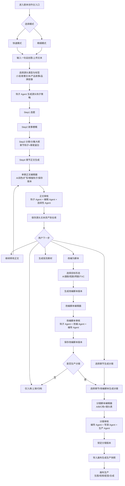
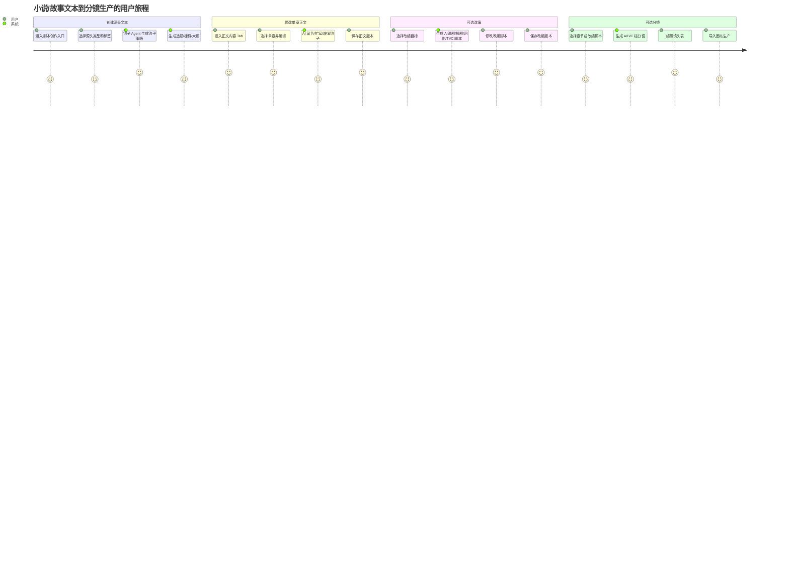
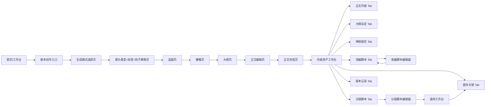
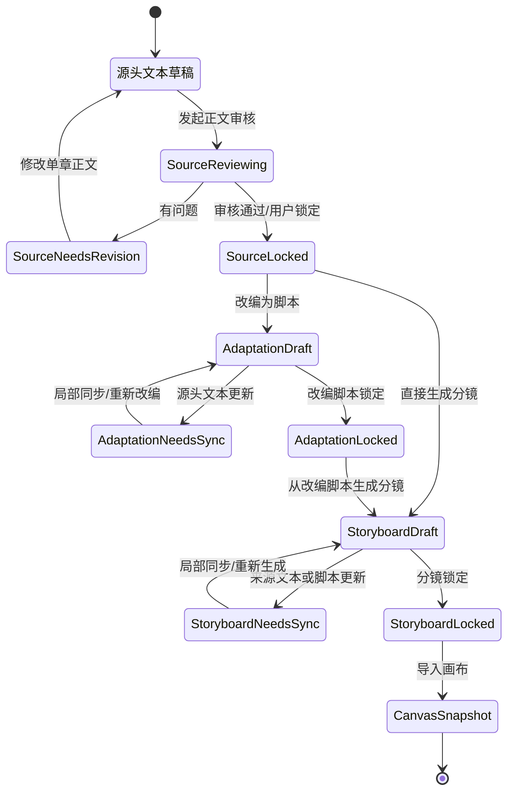

# 小说正文与分镜脚本解耦改造方案

> 状态：方案评审稿  
> 目标读者：产品经理、前端、后端、AI/Agent、测试  
> 适用范围：剧本创作、小说创作、分镜脚本、剧本仓库、画布导入、钩子/编导/导演 Agent  
> 核心原则：小说/故事文本是源头资产，AI漫剧剧本、短剧/网剧剧本、TVC 脚本都是从源头文本演变或改编出来的派生文本；分镜脚本是可选生产资产。正文可以独立完成、独立修改、独立入库；分镜必须由用户主动选择章节后生成，并独立编辑、独立版本化。

> **[superpowers 更新 V1.8]（2026-07-05）**：Canvas 域已按 `canvas-production-kernel-completion-design.md` 进行生产内核重构（6 节点类型、双模式、类型化端口、Three.js 导演台）。画布侧生产快照使用 `GenerationRequestSnapshot`（不可变）。本文件非 Canvas 域核心文档，涉及画布导入/分镜脚本与节点联动的交互以该设计为准。
>
> **[superpowers 更新]（2026-07-04）**：
> - 本方案第 11 节「需要修订的核心文档」所列行动项已大部分通过 superpowers specs 解决（创作圣经、Agent 会话、专业分镜、仓库流、交易市场均已产出正式设计文档）
> - **创作圣经**作为「正文创作阶段」的核心工具：生态系统规则、实体设定、三层写作指南在正文创作阶段建立，通过 `generation_context_snapshots` 注入后续 AI 生成
> - **不可变快照**（`[superpowers 更新 V1.7]`）：四层版本独立化（源正文→改编脚本→分镜→画布生产快照）均采用不可变快照机制。上游变更产生 diff，用户主动选择是否创建新快照，绝不自动覆盖下游
> - **workspace_assets 迁移**（`[superpowers 更新 V1.7]`）：正文/分镜/画布关联的资产引用统一迁移到 `workspace_assets + asset_versions` 模型；旧 `platform_assets` 停止扩展。详见 `docs/superpowers/specs/2026-07-04-asset-generation-history-workbench-design.md`
> - **8 项待确认问题**：尚未在 superpowers 中正式决策的开放问题仍标注为「待确认」，需后续专项讨论
> - 仍待处理：第 14 节 8 个开放问题（命名约定、共享vs独立表、快速模式行为等）

---

## 1. 背景与当前问题

现有平台文档已经提出“剧本资产工作台”“章节正文”“分镜脚本 Master”“画布生产快照”等概念，但在用户流程和数据表达上仍存在混合：

- 剧本创作 Step 4 生成单集正文后，流程默认引导进入 Step 5 分镜脚本。
- 快速模式输出结构中包含 `episodes` 和 `storyboard_shots`，容易让用户误以为小说/剧本正文与分镜脚本是同一个必选产物。
- “保存仓库必须保存章节、故事圣经、大纲、分镜、投流素材”的口径过重，对只写小说、只做文本资产的用户不合理。
- 用户完成小说正文后，缺少明确的单章修改入口、单章版本管理、AI润色/扩写/压缩等正文工具。
- 分镜脚本目前被描述为剧本资产中的 Master，但单章分镜脚本如何修改、如何与正文版本同步、如何处理正文变更后分镜失效，并不清楚。
- 导演 Agent 被放入每集联合审核，但小说正文阶段不一定需要导演生产视角。导演 Agent 应在“准备生成分镜”或“分镜审核”阶段重点介入。
- AI漫剧剧本、短剧/网剧剧本、TVC 脚本本质上都需要从小说或故事文本演变而来，但现有流程没有明确“源头小说/故事文本 → 改编脚本 → 分镜生产”的层级关系。
- 钩子 Agent 不能只在剧本或分镜阶段出现，必须从小说创作的大纲、章节、章尾留白阶段就介入，否则后续改编会缺少追读和转化基础。

这会造成四个产品风险：

| 风险 | 表现 | 后果 |
|---|---|---|
| 创作路径被视频化绑死 | 写小说的用户被迫看到分镜、画布、生产表 | 使用门槛变高，纯文本用户流失 |
| 正文与分镜互相覆盖 | 改正文后不知道是否影响分镜；改分镜后不知道是否回写正文 | 版本混乱，难以审计 |
| Agent 职责不清 | 钩子/编导/导演全部压在单集正文审核 | 审核建议不精准，正文阶段出现过多生产化建议 |
| 源头文本缺失 | 直接生成漫剧/TVC脚本，没有沉淀可修改的小说或故事文本 | 后续改编、复用、交易、续写都缺少稳定母本 |

---

## 2. 改造目标

### 2.1 产品目标

- 支持“只写小说/剧本，不做分镜”的完整闭环。
- 支持“从小说/故事文本演变为 AI漫剧剧本、短剧/网剧剧本、TVC 脚本”的改编路径。
- 支持“从已完成小说/剧本中选择章节生成分镜”的可选生产路径。
- 支持用户对单章小说正文进行持续修改、版本保存、AI辅助改写。
- 支持 AI 生成或 AI 编辑完成后，用户继续对小说等文本单章进行人工修改。
- 支持用户对单章分镜脚本进行独立修改、升档、版本保存、导入画布。
- 支持正文变更后提示分镜可能过期，但不自动覆盖分镜。
- 支持分镜变更后保留生产侧修改，但不自动改写正文。
- 支持钩子 Agent 融入小说创作阶段，而不是只在剧本/分镜阶段检查钩子。

### 2.2 开发目标

- 数据上拆清：源头正文版本、改编脚本版本、分镜版本、画布生产快照四者独立。
- API 上拆清：正文 CRUD、正文版本、改编脚本、分镜生成、分镜编辑、分镜版本、画布导入独立。
- 前端上拆清：源头正文、改编脚本、分镜脚本分 Tab 或分二级页面。
- Agent 上拆清：正文审核 Agent、改编 Agent 与分镜生产 Agent 分阶段调用。

---

## 3. 核心产品原则

### 3.1 主资产与派生资产

```text
小说/故事文本 = 源头资产
AI漫剧剧本 / 短剧剧本 / 网剧剧本 / TVC脚本 = 从源头文本改编出来的派生文本
分镜脚本 = 从正文或改编脚本派生的生产资产
画布项目 = 从分镜脚本派生的生产快照
```

源头小说/故事文本可以独立存在，可以被多次改编为不同脚本形态。正文可以没有分镜。分镜必须有来源正文或来源文本。画布项目必须有来源分镜或来源脚本节点。

### 3.2 钩子必须前置到小说创作

钩子不是视频生产阶段才需要的包装，而是内容结构的一部分。小说创作阶段就需要处理：

| 位置 | 钩子目标 |
|---|---|
| 书名/一句话设定 | 让用户愿意点开 |
| 第一章开头 | 让用户在前几段继续读 |
| 单章中段 | 保持冲突、反转或情绪推进 |
| 单章结尾 | 制造下一章期待 |
| 多章结构 | 管理阶段性大钩子和伏笔兑现 |

因此，钩子 Agent 在小说大纲、章节正文、AI续写、AI润色和章节审核中都要出现；后续 AI漫剧/短剧/网剧/TVC 改编时，应继承源头文本中的钩子结构。

### 3.3 不自动覆盖

| 场景 | 系统行为 |
|---|---|
| 修改正文 | 不自动覆盖已有分镜，只标记相关分镜为“来源正文已变更” |
| 修改分镜 | 不自动回写正文，只记录分镜版本变更 |
| 分镜导入画布 | 画布生成生产快照，不自动同步回分镜 Master |
| 画布中改镜头 | 默认只影响画布生产快照；如需同步回分镜 Master，必须用户确认 |
| 修改源头小说 | 不自动覆盖已改编脚本，只标记相关改编版本为“源头文本已变更” |

### 3.4 用户主动选择进入改编和分镜

小说/故事正文完成后，默认给用户四类动作：

```text
继续修改正文
保存到仓库
改编为 AI漫剧/短剧/网剧/TVC 脚本
选择章节生成分镜
```

不再默认把“下一步”写成“生成分镜”。如果用户的目标是 AI漫剧、短剧/网剧或 TVC，应先经过“源头文本 → 改编脚本”的步骤，再进入分镜生产。

---

## 4. 推荐信息架构

### 4.1 剧本/小说资产工作台

建议统一为“内容资产工作台”，内部按资产类型展示不同 Tab。

| Tab | 说明 | 必需性 |
|---|---|:---:|
| 概览 | 标题、类型、标签、进度、当前正文版本、分镜状态 | P0 |
| 正文内容 | 章节列表、正文编辑、AI润色/扩写/压缩、版本管理 | P0 |
| 大纲设定 | 故事梗概、分集/分章大纲、人物、世界观、钩子策略 | P0 |
| 审核报告 | 钩子 Agent、编辑/编导 Agent 的正文审核结果 | P0 |
| 改编脚本 | 从小说/故事文本改编出的 AI漫剧、短剧/网剧、TVC 脚本版本 | P0 |
| 分镜脚本 | 用户主动生成后才出现内容；支持章节级分镜版本 | P0 |
| 画布关联 | 分镜导入画布后的项目、快照、同步记录 | P0 |
| 投流素材 | 标题、封面文案、短视频切片脚本 | P1 |
| 版本记录 | 正文版本、分镜版本、画布快照版本 | P0 |

### 4.2 资产类型

平台需要在创建时区分“源头资产”和“目标形态”。AI漫剧剧本、短剧/网剧剧本、TVC 不是孤立起点，默认从小说或故事文本演变而来。

| 资产/目标类型 | 主要产物 | 与小说/故事文本关系 | 分镜是否必需 | 说明 |
|---|---|---|:---:|---|
| 小说/故事文本 | 章节正文、故事母本 | 源头资产 | 否 | 可纯文本创作、连载、出售、后续改编 |
| AI漫剧剧本 | 单集剧本正文 | 从小说/故事文本改编 | 否，但推荐 | 可进入分镜和画布生产 |
| 短剧/网剧剧本 | 剧本正文 | 从小说/故事文本改编 | 否，但推荐 | 支持专业分镜 |
| TVC | 分秒脚本/广告脚本 | 从故事文本、产品故事或品牌叙事改编 | 通常需要 | 但也应允许只保存脚本文案 |

### 4.3 与现有平台功能的结合方式

当前平台已有“剧本创作与分镜生成”主模块、快速模式、精细模式、Step1-6、剧本仓库、分镜脚本 Master、画布导入、钩子/编导/导演 Agent 等能力。改造不是推翻原模块，而是把原来线性的 Step 链路拆成三层资产，并复用现有入口。

| 现有功能 | 保留方式 | 需要优化 |
|---|---|---|
| 剧本创作主入口 | 保留入口名称，内部增加“源头文本 / 改编脚本 / 分镜生产”三段式流程 | 首屏让用户选择创作目标，但底层先沉淀小说/故事文本母本 |
| 快速模式 | 保留“一句话创意快速生成” | 默认生成源头文本资产；高级勾选才同时生成改编脚本或 A 档分镜 |
| 精细模式 Step1 选题 | 保留 | 选题输出要包含“源头故事钩子”和目标改编建议 |
| Step2 故事梗概 | 保留 | 梗概要服务源头小说/故事文本，不直接跳到分镜生产 |
| Step3 分集/分章大纲 | 保留 | 增加全书钩子、章节钩子、章尾留白、改编适配点 |
| Step4 单集剧本 | 改为“章节/单集正文编辑” | AI 生成后必须可单章修改、保存版本、重新审核 |
| 每集联合审核 | 拆分复用 | 正文阶段为钩子/编辑/连续性审核；改编脚本阶段为钩子/改编/编导审核；分镜阶段为编导/导演/生产审核 |
| Step5 分镜脚本 | 保留为可选生产阶段 | 不再是正文完成后的默认下一步；可从源头正文或改编脚本生成 |
| Step6 投流素材 | 保留为可选阶段 | 可从源头小说、改编脚本或分镜提取投流素材 |
| 剧本仓库 | 升级为内容资产工作台 | 增加正文内容、改编脚本、分镜脚本、画布关联、版本记录 Tab |
| 画布导入 | 保留生产快照机制 | 只能从锁定分镜版本导入；画布修改不自动回写 |

### 4.4 平台模块边界

| 模块 | 新职责 | 不应承担 |
|---|---|---|
| 剧本创作模块 | 生成源头文本、改编脚本、可选分镜 | 不强制所有用户进入分镜 |
| 剧本仓库 | 管理正文、改编脚本、分镜、版本、审核报告 | 不只保存标题/梗概/单一正文 |
| 分镜编辑器 | 管理 A/B/C 档分镜和镜头表 | 不直接修改源头小说正文 |
| 画布工作台 | 基于分镜快照进行 AI 图片/视频生产 | 不作为正文或分镜 Master 的唯一编辑入口 |
| Agent 系统 | 分阶段审校和辅助生成 | 不用同一套三 Agent 审所有内容 |

---

## 5. 用户流程改造

### 5.1 小说/故事源头文本创作流程

```text
创建内容资产
→ 选择源头类型：小说 / 故事文本 / 产品故事 / 品牌叙事
→ 选择标签：题材、情节、情绪/基调、时空背景、受众、长度
→ 钩子 Agent 生成全书/全故事钩子策略
→ 生成或导入大纲
→ 生成章节/单章正文
→ 单章正文编辑
→ 正文审核：钩子 Agent + 编辑 Agent + 连续性 Agent
→ 保存正文版本
→ 完成源头文本资产
```

正文完成后的动作：

```text
[继续修改正文] [保存到仓库] [改编为脚本] [选择章节生成分镜] [生成投流素材]
```

### 5.2 源头文本改编为脚本流程

```text
选择源头小说/故事文本
→ 选择改编目标：AI漫剧 / 短剧 / 网剧 / TVC
→ 选择章节范围或故事段落
→ 继承源头文本钩子策略
→ 生成改编脚本
   ├─ AI漫剧：单集剧本、对白、旁白、画面动作
   ├─ 短剧/网剧：场次、人物调度、对白、时长
   └─ TVC：分秒结构、卖点、品牌记忆点、转化钩子
→ 用户可对改编脚本单章/单集/分段修改
→ 保存改编脚本版本
→ 可选：生成分镜
```

改编脚本不是直接覆盖源头小说，而是形成独立版本，并保留 `source_chapter_version_id` 或 `source_text_version_id`。

### 5.3 单章小说正文编辑流程

```text
进入资产工作台
→ 打开“正文内容”Tab
→ 左侧选择章节
→ 右侧编辑正文
→ 可执行 AI 辅助
   ├─ 润色
   ├─ 扩写
   ├─ 压缩
   ├─ 增强钩子
   ├─ 优化对白
   └─ 检查连续性
→ 保存草稿 / 保存新版本 / 锁定本章
```

正文编辑器 P0 功能：

| 功能 | 说明 |
|---|---|
| 章节列表 | 支持新增、删除、重排、搜索章节 |
| 正文编辑 | 普通文本/富文本/结构化剧本格式按内容类型切换 |
| 自动保存 | 本地草稿 + 服务端草稿，避免丢稿 |
| 保存版本 | 用户手动创建版本，填写变更说明 |
| AI辅助 | 润色、扩写、压缩、续写、改口吻、增强钩子 |
| 审核 | 钩子、人物、逻辑、节奏、敏感词、连续性 |
| 变更提示 | 如果本章已有分镜，保存正文后提示“分镜可能需要同步更新” |

AI 生成或 AI 编辑完成后，正文不能被视为锁死结果。用户必须可以继续对单章小说、故事文本、改编脚本进行人工修改，并保存为新版本。

### 5.4 选择章节生成分镜流程

```text
正文资产工作台
→ 点击“生成分镜”
→ 选择章节范围
   ├─ 当前章
   ├─ 多选章节
   └─ 全部章节
→ 选择分镜档位：A / B / C
→ 选择目标时长、画幅、平台、项目插件包
→ 生成分镜脚本版本
→ 进入分镜脚本编辑器
```

注意：生成分镜是显式动作，不是正文保存后的默认下一步。

### 5.5 单章分镜脚本编辑流程

```text
进入“分镜脚本”Tab
→ 选择章节
→ 选择分镜版本
→ 编辑镜头表
   ├─ 新增镜头
   ├─ 删除镜头
   ├─ 移动镜头
   ├─ 修改画面描述
   ├─ 修改对白/旁白
   ├─ 修改景别/运镜/时长
   └─ 修改 AI 生图/视频 Prompt
→ 连续性检查 / 导演审核
→ 保存分镜版本
→ 可选：导入画布
```

分镜编辑器 P0 功能：

| 功能 | 说明 |
|---|---|
| 章节分镜列表 | 每章可有 0 个、1 个或多个分镜版本 |
| A/B/C 档视图 | A档轻量主分镜，B档导演确认，C档生产三表 |
| 镜头表编辑 | 每个镜头字段可编辑 |
| 分镜版本 | 支持从正文版本派生，保存版本差异 |
| 同步状态 | 显示来源正文版本是否已变更 |
| 导演审核 | 画面可表达性、镜头节奏、AI生产风险 |
| 导入画布 | 从当前分镜版本生成画布生产快照 |

### 5.6 总流程图



### 5.7 用户旅程图



### 5.8 页面跳转图



### 5.9 状态流转图



### 5.10 关键用户旅程拆解

#### 旅程 A：只写小说，不做分镜

| 阶段 | 用户动作 | 平台动作 | 关键检查 |
|---|---|---|---|
| 创建 | 输入创意，选择小说/故事文本 | 生成标签、钩子策略 | 不展示强制分镜入口 |
| 生成 | 生成选题、梗概、大纲、章节正文 | 产出源头文本版本 | 钩子进入章节结构 |
| 修改 | 单章编辑、AI润色、增强钩子 | 保存章节版本 | 支持历史恢复 |
| 完成 | 保存仓库或上架 | 文本资产入库 | 分镜可为空 |

#### 旅程 B：小说改编 AI 漫剧并生成分镜

| 阶段 | 用户动作 | 平台动作 | 关键检查 |
|---|---|---|---|
| 源头 | 完成小说/故事文本 | 锁定正文版本 | 有源头版本 ID |
| 改编 | 选择 AI 漫剧目标 | 生成单集剧本 | 继承章节钩子 |
| 修改 | 修改单集脚本 | 保存改编版本 | 不覆盖源头小说 |
| 分镜 | 选择改编版本生成 A 档分镜 | 生成镜头表 | 来源为改编版本 |
| 生产 | 锁定分镜并导入画布 | 创建生产快照 | 画布不回写正文 |

#### 旅程 C：产品故事改编 TVC

| 阶段 | 用户动作 | 平台动作 | 关键检查 |
|---|---|---|---|
| 源头 | 输入产品故事/品牌叙事 | 生成卖点和转化钩子 | 不是直接跳分镜 |
| 改编 | 选择 TVC 目标时长 | 生成分秒脚本 | 有 3s/5s/15s/30s 节奏 |
| 修改 | 修改脚本文案和卖点表达 | 保存 TVC 脚本版本 | 不覆盖源头故事 |
| 分镜 | 可选生成分镜 | 生成镜头/画面/字幕 | 适配画幅和平台 |

---

## 6. 源头文本、改编脚本与分镜的状态关系

### 6.1 源头正文状态

| 状态 | 说明 |
|---|---|
| draft | 草稿 |
| reviewing | 审核中 |
| needs_revision | 建议修改 |
| locked | 正文锁定 |
| archived | 已归档 |

### 6.2 改编脚本状态

| 状态 | 说明 |
|---|---|
| not_created | 尚未从源头文本生成改编脚本 |
| draft | 改编脚本草稿 |
| needs_sync | 源头文本已变更，建议检查改编脚本 |
| reviewing | 改编脚本审核中 |
| locked | 改编脚本锁定 |

### 6.3 分镜状态

| 状态 | 说明 |
|---|---|
| not_created | 未生成分镜 |
| draft | 分镜草稿 |
| needs_sync | 来源正文已变更，建议重新同步 |
| reviewing | 分镜审核中 |
| locked | 分镜锁定 |
| imported_to_canvas | 已导入画布 |

### 6.4 状态提示规则

| 条件 | 前端提示 | 用户动作 |
|---|---|---|
| 正文无分镜 | “当前章节尚未生成分镜” | 生成分镜 |
| 源头文本版本 > 改编脚本来源版本 | “源头文本已更新，当前改编脚本可能不是最新” | 重新改编 / 局部同步 / 忽略 |
| 正文版本 > 分镜来源版本 | “正文已更新，当前分镜可能不是最新” | 重新生成 / 局部同步 / 忽略 |
| 分镜已导入画布 | “画布使用的是生产快照” | 查看画布 / 重新导入 / 手动同步 |
| 正文未锁定但要生成 C 档 | “建议先锁定正文再进入生产交付档” | 锁定正文 / 继续生成 |

---

## 7. Agent 职责调整

### 7.1 正文阶段 Agent

| Agent | 介入阶段 | 目标 | 输出 |
|---|---|---|---|
| 钩子 Agent | 大纲、章节正文 | 追读、留白、集间承接 | 开场钩子、结尾悬念、下一章承诺、假钩子问题 |
| 编辑 Agent | 小说正文 | 文学表达、节奏、可读性 | 润色建议、重复段落、信息密度、语言问题 |
| 编导 Agent | 剧本/漫剧正文 | 人物动机、冲突升级、场次逻辑 | 人物逻辑、剧情推进、对白问题 |
| 连续性 Agent | 长篇/多章节 | 前后设定一致 | 人物状态、道具、伏笔、时间线问题 |

钩子 Agent 在小说阶段是 P0 能力，不是后置增强。它需要参与选题、大纲、章节正文、AI续写、AI润色、章节审核和章尾留白，保证源头文本本身就具备追读结构。

### 7.2 改编阶段 Agent

| Agent | 介入阶段 | 目标 | 输出 |
|---|---|---|---|
| 改编 Agent | 小说/故事文本 → 脚本 | 将源头文本转成目标媒介结构 | AI漫剧/短剧/网剧/TVC 脚本 |
| 钩子 Agent | 改编脚本 | 继承并重构源头钩子 | 单集开场、结尾悬念、TVC分秒钩子 |
| 编导 Agent | 改编脚本 | 保证戏剧动作和人物动机成立 | 场次、对白、冲突升级、节奏建议 |

### 7.3 分镜阶段 Agent

| Agent | 介入阶段 | 目标 | 输出 |
|---|---|---|---|
| 编导 Agent | A档/B档分镜 | 保证分镜不偏离正文剧情 | Beat、信息增量、场景目标 |
| 导演 Agent | B档/C档分镜 | 保证镜头可拍、可看、可生产 | 景别、运镜、调度、强视觉点 |
| 生产 Agent | C档/画布前 | 降低 AI 生产失败率 | 复杂度、拆镜建议、资产绑定检查 |

### 7.4 三 Agent 方案的修订口径

原“钩子 Agent + 编导 Agent + 导演 Agent 每集联合审核”建议拆成两个审核场景：

| 审核场景 | Agent 组合 | 说明 |
|---|---|---|
| 正文审核 | 钩子 Agent + 编辑/编导 Agent + 连续性 Agent | 用于正文质量，不强推生产视角 |
| 改编脚本审核 | 钩子 Agent + 改编 Agent + 编导 Agent | 用于检查源头文本是否被正确转成 AI漫剧/短剧/网剧/TVC 脚本 |
| 分镜审核 | 编导 Agent + 导演 Agent + 生产 Agent | 用于分镜质量和 AI 生产可行性 |

导演 Agent 不应在纯小说正文阶段强制出现。只有当用户选择生成分镜、审核分镜、导入画布时，导演 Agent 才成为核心角色。

---

## 8. 数据模型建议

### 8.1 当前模型问题

当前 `script_episodes` 同时承载“章节正文”和部分钩子缓存，`script_versions.content` 又保存完整资产快照，`storyboard_master` 放在版本 JSON 中。这个结构 P0 可以跑通，但不利于单章独立编辑和分镜独立版本。

### 8.2 建议模型

```text
content_projects / scripts
  ├── chapters
  │     ├── chapter_versions
  │     └── chapter_review_reports
  ├── adaptation_versions
  ├── storyboard_versions
  │     └── storyboard_shots
  ├── canvas_snapshots / script_canvas_links
  └── project_versions
```

### 8.3 表结构建议

#### `chapters`

| 字段 | 说明 |
|---|---|
| `id` | 章节 ID |
| `script_id` | 所属内容资产 |
| `chapter_no` | 章节序号 |
| `title` | 章节标题 |
| `current_version_id` | 当前正文版本 |
| `word_count` | 字数 |
| `status` | 草稿/审核/锁定 |
| `latest_storyboard_status` | 未生成/需同步/已锁定/已导入画布 |

#### `chapter_versions`

| 字段 | 说明 |
|---|---|
| `id` | 正文版本 ID |
| `chapter_id` | 所属章节 |
| `version_no` | 版本号 |
| `content` | 正文内容 |
| `content_format` | novel / screenplay / tvc |
| `change_summary` | 变更说明 |
| `source` | ai_generated / manual_edit / imported |
| `created_by` | 创建人 |
| `created_at` | 创建时间 |

#### `adaptation_versions`

| 字段 | 说明 |
|---|---|
| `id` | 改编脚本版本 ID |
| `script_id` | 所属内容资产 |
| `source_chapter_version_id` | 来源章节正文版本，可为空 |
| `source_project_version_id` | 来源整本/整体故事版本，可为空 |
| `target_type` | ai_comic / short_drama / web_drama / tvc |
| `version_no` | 改编版本号 |
| `content` | 改编脚本文本或结构化 JSON |
| `hook_strategy_json` | 继承和重构后的钩子策略 |
| `status` | draft / needs_sync / reviewing / locked |
| `created_by` | 创建人 |
| `created_at` | 创建时间 |

#### `storyboard_versions`

| 字段 | 说明 |
|---|---|
| `id` | 分镜版本 ID |
| `script_id` | 所属内容资产 |
| `chapter_id` | 来源章节 |
| `source_chapter_version_id` | 来源正文版本 |
| `source_adaptation_version_id` | 来源改编脚本版本，可为空 |
| `tier` | A / B / C |
| `version_no` | 分镜版本号 |
| `status` | draft / needs_sync / locked / imported_to_canvas |
| `target_duration_seconds` | 目标时长 |
| `aspect_ratio` | 画幅 |
| `created_by` | 创建人 |
| `created_at` | 创建时间 |

#### `storyboard_shots`

| 字段 | 说明 |
|---|---|
| `id` | 镜头 ID |
| `storyboard_version_id` | 所属分镜版本 |
| `shot_no` | 镜头号 |
| `scene_no` | 场次号 |
| `duration` | 时长 |
| `shot_size` | 景别 |
| `camera_motion` | 运镜 |
| `visual_description` | 画面内容 |
| `action_description` | 动作/表演 |
| `dialogue` | 对白 |
| `narration` | 旁白 |
| `image_prompt` | 生图提示词 |
| `video_prompt` | 视频提示词 |
| `complexity_level` | AI生产复杂度 |

### 8.4 P0 落地策略

如果短期不拆表，可以先采用兼容方案：

| P0兼容做法 | 后续演进 |
|---|---|
| 继续使用 `script_episodes` 保存当前正文 | 后续迁移到 `chapters` |
| 新增 `chapter_versions` 保存单章版本 | 替代 `script_versions.content` 中的大 JSON |
| 新增 `adaptation_versions` 保存 AI漫剧/短剧/网剧/TVC 改编脚本 | 支持同一小说母本多形态改编 |
| 新增 `storyboard_versions` 和 `storyboard_shots` | 替代单一 `storyboard_master` |
| `script_versions` 保留项目级快照 | 用于回滚整个资产包 |

---

## 9. API 建议

### 9.1 正文内容 API

```text
GET    /api/v1/script/repo/scripts/{scriptId}/chapters
POST   /api/v1/script/repo/scripts/{scriptId}/chapters
GET    /api/v1/script/repo/chapters/{chapterId}
PATCH  /api/v1/script/repo/chapters/{chapterId}
DELETE /api/v1/script/repo/chapters/{chapterId}
```

### 9.2 正文版本 API

```text
GET  /api/v1/script/repo/chapters/{chapterId}/versions
POST /api/v1/script/repo/chapters/{chapterId}/versions
POST /api/v1/script/repo/chapters/{chapterId}/versions/{versionId}/restore
POST /api/v1/script/repo/chapters/{chapterId}/lock
```

### 9.3 正文 AI 辅助 API

```text
POST /api/v1/script/gen/chapters/{chapterId}/rewrite
POST /api/v1/script/gen/chapters/{chapterId}/polish
POST /api/v1/script/gen/chapters/{chapterId}/expand
POST /api/v1/script/gen/chapters/{chapterId}/compress
POST /api/v1/script/gen/chapters/{chapterId}/enhance-hook
POST /api/v1/script/review/chapters/{chapterId}
```

### 9.4 改编脚本 API

```text
POST  /api/v1/script/adaptations/generate
GET   /api/v1/script/adaptations?script_id=&chapter_id=&target_type=
GET   /api/v1/script/adaptations/{adaptationVersionId}
PATCH /api/v1/script/adaptations/{adaptationVersionId}
POST  /api/v1/script/adaptations/{adaptationVersionId}/review
POST  /api/v1/script/adaptations/{adaptationVersionId}/lock
POST  /api/v1/script/adaptations/{adaptationVersionId}/sync-from-source
```

生成请求必须明确：

| 字段 | 说明 |
|---|---|
| `source_type` | chapter / full_story / imported_text |
| `source_version_id` | 来源小说/故事文本版本 |
| `target_type` | ai_comic / short_drama / web_drama / tvc |
| `inherit_hook_strategy` | 是否继承源头文本钩子策略，默认 true |
| `target_duration_seconds` | TVC 或视频脚本建议传入 |

### 9.5 分镜生成与编辑 API

```text
POST  /api/v1/script/storyboards/generate
GET   /api/v1/script/storyboards?script_id=&chapter_id=
GET   /api/v1/script/storyboards/{storyboardVersionId}
PATCH /api/v1/script/storyboards/{storyboardVersionId}
POST  /api/v1/script/storyboards/{storyboardVersionId}/lock
POST  /api/v1/script/storyboards/{storyboardVersionId}/upgrade
POST  /api/v1/script/storyboards/{storyboardVersionId}/review
```

分镜生成可从源头章节正文生成，也可从改编脚本生成；如果存在 `adaptation_version_id`，优先以改编脚本为准。

### 9.6 分镜镜头 API

```text
POST   /api/v1/script/storyboards/{storyboardVersionId}/shots
PATCH  /api/v1/script/storyboard-shots/{shotId}
DELETE /api/v1/script/storyboard-shots/{shotId}
POST   /api/v1/script/storyboards/{storyboardVersionId}/shots/reorder
```

### 9.7 正文变更后的同步 API

```text
GET  /api/v1/script/chapters/{chapterId}/adaptation-sync-status
GET  /api/v1/script/chapters/{chapterId}/storyboard-sync-status
POST /api/v1/script/adaptations/{adaptationVersionId}/sync-from-chapter
POST /api/v1/script/adaptations/{adaptationVersionId}/mark-sync-ignored
POST /api/v1/script/storyboards/{storyboardVersionId}/sync-from-chapter
POST /api/v1/script/storyboards/{storyboardVersionId}/mark-sync-ignored
```

同步策略不建议默认全量重生成，应提供三种动作：

| 动作 | 说明 |
|---|---|
| 全量重生成 | 用最新正文重新生成分镜，产生新分镜版本 |
| 局部同步 | AI 比对正文差异，只建议修改受影响镜头 |
| 忽略变更 | 用户确认当前分镜仍可用，清除提醒 |

---

## 10. 页面改造建议

### 10.1 生成流程页

当前：

```text
Step 1 选题
→ Step 2 梗概
→ Step 3 大纲
→ Step 4 单集剧本
→ Step 5 分镜
→ Step 6 投流
```

建议改为：

```text
阶段一：源头文本创作
Step 0 源头类型/标签/钩子策略
→ Step 1 选题
→ Step 2 梗概
→ Step 3 分章/分集大纲
→ Step 4 章节正文/故事文本
→ 正文完成页
   ├─ 继续修改正文
   ├─ 保存到仓库
   ├─ 改编为 AI漫剧/短剧/网剧/TVC 脚本
   ├─ 选择章节生成分镜
   └─ 生成投流素材

阶段二：脚本改编（可选）
Step 5 选择目标形态并生成改编脚本
→ 改编脚本编辑器

阶段三：分镜生产（可选）
Step 6 选择章节或改编脚本生成分镜
→ 分镜编辑器
→ 导入画布
```

### 10.2 工作台页面

建议剧本仓库详情页升级为“内容资产工作台”：

```text
左侧：章节导航
顶部：概览 / 正文内容 / 大纲设定 / 审核报告 / 改编脚本 / 分镜脚本 / 画布关联 / 版本记录
右侧：根据 Tab 展示正文编辑器、改编脚本、分镜表或版本记录
```

### 10.3 正文完成页

正文完成后不要直接显示“下一步生成分镜”，而是显示决策卡：

| 卡片 | 说明 |
|---|---|
| 继续打磨正文 | 返回正文编辑器 |
| 保存到仓库 | 只保存文本资产 |
| 改编为脚本 | 选择 AI漫剧、短剧、网剧或 TVC 目标形态 |
| 生成分镜脚本 | 选择章节和档位后进入分镜 |
| 生成投流素材 | 用正文生成标题、封面、投流钩子 |

### 10.4 分镜脚本 Tab 空状态

当某章没有分镜时：

```text
当前章节尚未生成分镜脚本。

[为本章生成 A 档分镜] [批量选择章节生成分镜]
```

当正文已更新导致分镜可能过期时：

```text
当前分镜来源于正文 v1.2，正文已更新到 v1.4。

[查看差异] [局部同步分镜] [重新生成新版本] [忽略本次变更]
```

---

## 11. 对现有文档的修订建议

### 11.1 用户端产品功能设计

需要修订：

- 模块二标题从“剧本创作与分镜生成”调整为“内容正文创作与可选分镜生产”或保留标题但明确“分镜可选”。
- 6.1 整体交互流程中，Step 4 后增加“正文完成页”，再增加“改编脚本可选阶段”和“分镜可选阶段”。
- 6.6 Step 4 中增加单章正文编辑、正文版本、正文完成后的多去向选择。
- 6.7 Step 5 中明确 AI漫剧、短剧/网剧、TVC 应从小说/故事文本改编生成。
- 分镜章节中明确分镜由用户选择章节或改编脚本主动生成，不是默认必经步骤。
- 附录A-1 中“生成结果必须包含章节、分镜初稿、投流素材”需要改为“生成结果必须包含章节正文；分镜和投流素材按用户选择生成”。
- “保存仓库必须保存章节、故事圣经、大纲、分镜、投流素材”需要改为“保存仓库必须保存已产生的资产；分镜、投流允许为空”。
- 钩子策略不能只写在分镜或每集审核，需要明确进入小说大纲、章节正文、章尾留白和 AI 编辑流程。

### 11.2 用户端 PRD

建议新增或修订功能：

| 功能编号建议 | 功能 | 优先级 |
|---|---|:---:|
| F-15B | 单章正文编辑与版本管理 | M |
| F-15C | 正文完成后的去向选择 | M |
| F-15D | 源头文本改编为 AI漫剧/短剧/网剧/TVC 脚本 | M |
| F-16A | 按章节生成分镜脚本 | M |
| F-16B | 单章分镜脚本编辑与版本管理 | M |
| F-16C | 正文变更后的分镜同步提示 | M |

### 11.3 后端产品功能设计

需要修订：

- `script-gen-svc` 职责从“故事圣经/章节/分镜Master生成”改为“源头文本生成 + 改编脚本生成 + 可选分镜生成”。
- P0 约束中“完整保存”改为保存已产生资产，不能要求纯小说资产必须有分镜。
- 增加 `chapter_versions`、`adaptation_versions`、`storyboard_versions`、`storyboard_shots` 或至少补充 P0 JSON 兼容方案。
- 增加正文版本和分镜版本之间的来源关系。
- 增加源头文本版本和改编脚本版本之间的来源关系。
- 增加 `needs_sync` 状态。

### 11.4 API 文档

需要补充：

- 单章正文 CRUD。
- 单章正文版本。
- 正文 AI 辅助。
- 源头文本改编脚本生成与编辑。
- 按章节生成分镜。
- 分镜版本编辑。
- 分镜镜头 CRUD。
- 正文变更后的改编脚本/分镜同步状态。

### 11.5 钩子 Agent 方案

需要修订：

- 小说创作阶段必须融入钩子 Agent：选题、大纲、章节正文、AI编辑、章尾留白都要检查钩子。
- 正文阶段保留钩子 Agent，但导演 Agent 不作为纯小说正文强制审核角色。
- 每集联合审核拆成“正文审核”“改编脚本审核”和“分镜审核”三类。
- 分镜审核报告进入画布生产阶段，正文审核报告进入正文版本。

---

## 12. 验收标准

### 12.1 小说正文独立闭环

| AC | 标准 |
|---|---|
| AC01 | 用户创建小说资产后，可以完成大纲、章节正文、保存仓库，不生成任何分镜 |
| AC02 | 用户可以在资产工作台选择任意章节进行正文修改 |
| AC03 | 用户保存正文时，可以保存草稿或创建新正文版本 |
| AC04 | 用户修改正文后，历史正文版本可查看和恢复 |
| AC05 | 用户修改正文不会自动覆盖已有分镜 |
| AC06 | 钩子 Agent 必须参与小说选题、大纲、章节正文、章尾留白和正文审核 |

### 12.2 改编脚本独立闭环

| AC | 标准 |
|---|---|
| AC07 | 用户可以从小说/故事文本主动改编为 AI漫剧、短剧、网剧或 TVC 脚本 |
| AC08 | 改编脚本必须保留来源正文版本 |
| AC09 | 用户可以对 AI 生成或 AI 编辑后的改编脚本进行单章/单集/分段修改 |
| AC10 | 修改源头小说后，不自动覆盖改编脚本，只提示“源头文本已变更” |

### 12.3 分镜脚本独立闭环

| AC | 标准 |
|---|---|
| AC11 | 用户必须主动点击“生成分镜”才创建分镜脚本 |
| AC12 | 用户可以选择单章、多章、全部章节或某个改编脚本版本生成分镜 |
| AC13 | 每章可存在多个分镜版本 |
| AC14 | 用户可以编辑单个镜头字段并保存分镜版本 |
| AC15 | 分镜导入画布后生成生产快照，不自动回写正文 |

### 12.4 同步与风险提示

| AC | 标准 |
|---|---|
| AC16 | 正文版本更新后，关联改编脚本和分镜显示“需同步” |
| AC17 | 用户可选择重新改编/重新生成、局部同步或忽略变更 |
| AC18 | C档分镜生成前，如果正文或改编脚本未锁定，系统给出风险提示 |
| AC19 | 画布修改分镜后，如需同步回分镜 Master，必须用户确认 |

---

## 13. 建议实施阶段

### 阶段一：产品口径修订

- 明确“小说/故事文本是源头资产，AI漫剧/短剧/网剧/TVC 是改编脚本，分镜是可选生产资产”。
- 修改核心文档中的强绑定描述。
- 增加正文完成页、正文 Tab、改编脚本 Tab、分镜 Tab 的产品说明。
- 明确钩子 Agent 前置到小说创作阶段。

### 阶段二：P0 功能落地

- 单章正文编辑。
- 单章正文版本。
- 改编脚本生成和编辑。
- 分镜按章节生成。
- 分镜版本和镜头编辑。
- 正文变更后的改编脚本/分镜需同步提示。

### 阶段三：Agent 分阶段审核

- 正文审核：钩子 Agent + 编辑/编导 Agent + 连续性 Agent。
- 改编脚本审核：钩子 Agent + 改编 Agent + 编导 Agent。
- 分镜审核：编导 Agent + 导演 Agent + 生产 Agent。
- 审核报告分别绑定正文版本、改编脚本版本和分镜版本。

### 阶段四：画布同步增强

- 分镜 Master 导入画布生成快照。
- 画布变更可选择同步回分镜 Master。
- 支持同步差异对比和人工确认。

---

## 14. 待确认问题

| 问题 | 推荐口径 | 需要确认 |
|---|---|---|
| 产品命名用“剧本”还是“内容资产” | 对外可用“剧本/小说”，底层用 content/script 兼容 | 是否要改一级菜单名称 |
| 小说和剧本是否共用 `scripts` 表 | P0 共用，字段增加 `content_type` | 是否接受后续再拆表 |
| 快速模式是否直接生成脚本和分镜 | 默认只生成源头正文资产；提供勾选项“同时改编脚本/同时生成A档分镜” | 是否保留原一键全流程 |
| AI漫剧/短剧/网剧/TVC 是否必须有源头文本 | 推荐必须有，至少生成一份故事文本母本 | 是否允许跳过源头文本直接写脚本 |
| 钩子 Agent 是否作为小说创作 P0 | 推荐是 P0，贯穿选题、大纲、章节正文和章尾留白 | 是否作为第一期必做 |
| 导演 Agent 是否参与正文审核 | 纯小说不参与；剧本/漫剧可作为可选建议 | 是否按内容类型动态显示 |
| 保存仓库是否要求分镜存在 | 不要求；保存已产生资产即可 | 是否修改所有文档口径 |
| 正文变更后改编脚本/分镜是否自动重生成 | 不自动；只提示并提供动作 | 是否允许用户配置自动同步 |

---

## 15. 一句话结论

平台需要把“小说/故事文本创作 → 改编脚本 → 分镜生产”拆成三层：小说/故事文本是源头资产，AI漫剧/短剧/网剧/TVC 是改编脚本，分镜是可选生产资产；钩子 Agent 必须从小说创作阶段介入，用户在 AI 编辑后仍可对单章文本继续修改和版本化。
