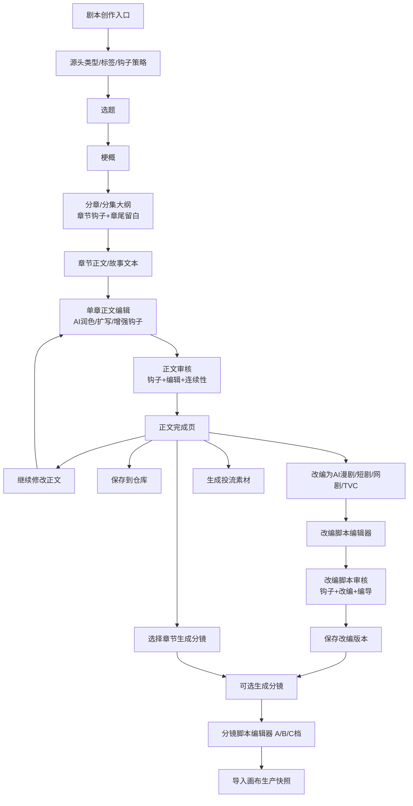
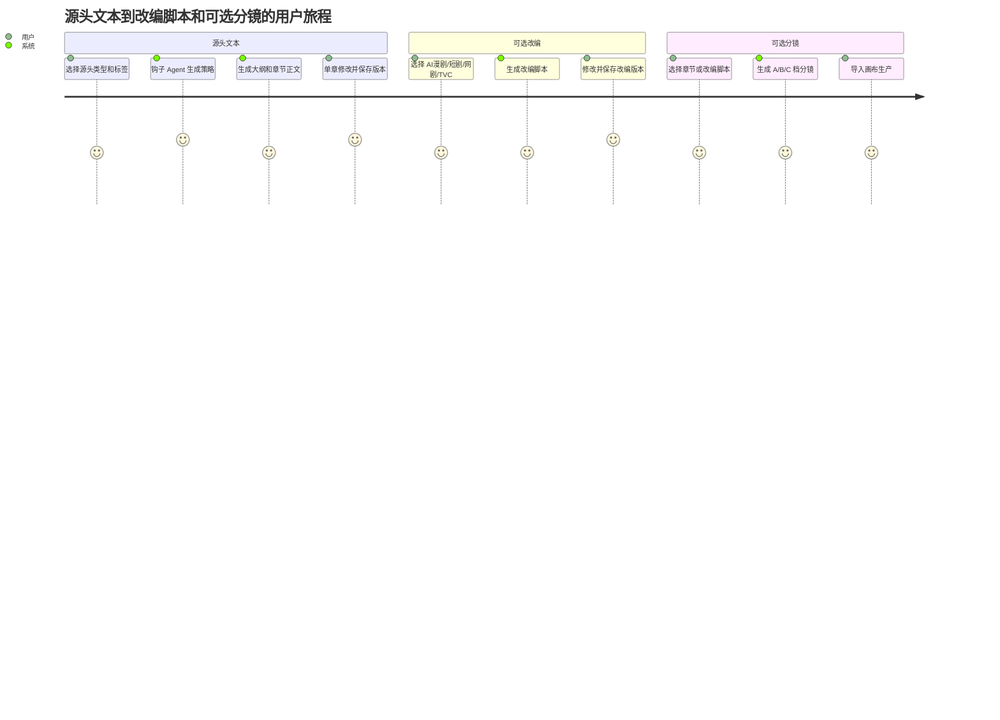
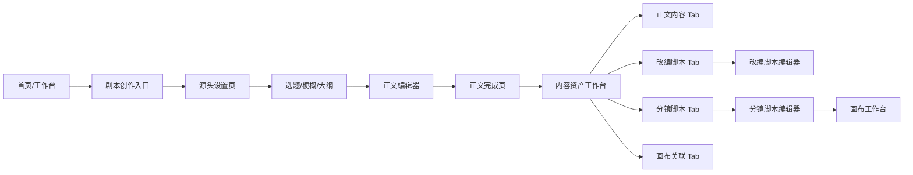
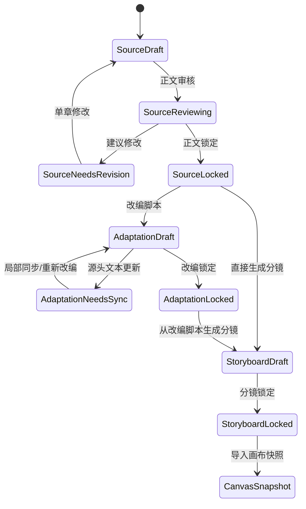
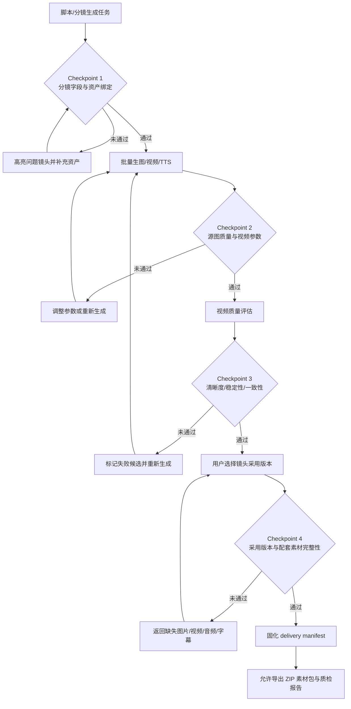
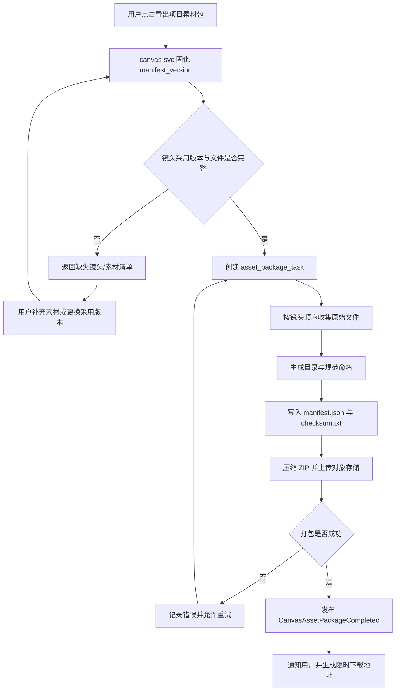

# AI漫剧与视频内容工业化生产工作台 · 流程图文档

> 基于《用户端产品功能设计.md》v0.7+《后端产品功能设计_V1.5.md》+《AI漫剧与视频内容工业化生产工作台 PRD V1.5》绘制  
> V1.3新增：画布多节点类型增强、下游菜单、多副本并行生成、Omni-Reference视频引擎、Agent画布联动、SOP质检流程  
> V1.5修订：产品定位升级为 AI 视频工业化生产工作台，主流程从静态画布展示升级为“项目 -> 剧本/想法 -> 分镜拆解 -> 资产沉淀 -> 批量生图/视频 -> 质检与采用版本 -> 素材包导出 -> 工作流复用”的可生产闭环。平台不提供视频剪辑、视频合成或多轨时间轴。
> 剧本创作修订：剧本模块改为“源头小说/故事文本 → 改编脚本 → 可选分镜生产”三层资产架构；AI生成或AI编辑后，用户仍可对单章正文继续修改和版本化。
> 文档类型：流程图合集（用户流程图 + 用户旅程图 + 页面跳转图 + 状态流转图 + 产品流程图 + 后端流程图）
> 图表格式：Mermaid + ASCII 流程图

---

## 目录

### 一、用户流程图 (User Flow)

0. [新版剧本创作四图](#0-新版剧本创作四图)
1. [用户注册与登录流程](#1-用户注册与登录流程)
2. [剧本创作流程（剧本资产工作台）](#2-剧本创作流程剧本资产工作台)
3. [分镜生产流程（阶段二：Step 5 V7.6）](#3-分镜生产流程阶段二step-5-v76)
4. [画布视频制作流程（阶段三）](#4-画布视频制作流程阶段三)
   - 🆕 [4.1.1 画布节点增强工作流 V1.3](#411--画布节点增强工作流-v13)
   - 🆕 [4.1.2 LibTV式节点卡片与底部生成器交互流程](#412-libtv式节点卡片与底部生成器交互流程)
   - 🆕 [4.1.3 LibTV新版脚本节点生产链路](#413-libtv新版脚本节点生产链路)
   - 🆕 [4.1.4 节点状态机与前端画布事件流](#414-节点状态机与前端画布事件流)
   - 🆕 [4.4 Agent画布联动流程 V1.3](#44--agent画布联动流程-v13)
5. [剧本交易流程（买家）](#5-剧本交易流程买家)
6. [剧本售卖流程（卖家）](#6-剧本售卖流程卖家)
7. [企业B2B管理流程](#7-企业b2b管理流程)
8. [AI资产市场使用流程](#8-ai资产市场使用流程)

### 二、产品流程图 (Product Flow)

0. [V1.5工业化生产闭环](#0-v15工业化生产闭环)
0.1. [V1.5节点生成任务与积分闭环](#01-v15节点生成任务与积分闭环)
9. [全平台端到端主流程](#9-全平台端到端主流程)
10. [三阶段创作生产线](#10-三阶段创作生产线)
11. [V7.6分镜三档升降级流程](#11-v76分镜三档升降级流程)
12. [4轴标签数据流](#12-4轴标签数据流)
13. [资产成熟度L0-L4升级流程](#13-资产成熟度l0-l4升级流程)
14. [企业采购审批流程](#14-企业采购审批流程)
15. [生产准入与审计返工流程](#15-生产准入与审计返工流程)
16. [AI失败恢复决策流程](#16-ai失败恢复决策流程)
17. 🆕 [SOP画布质检流程 V1.3](#17--sop画布质检流程-v13)

### 三、后端流程图 (Backend Flow)

17. [后端微服务全景图](#17-后端微服务全景图)
18. [API请求处理流程](#18-api请求处理流程)
19. [AI生成任务编排流程](#19-ai生成任务编排流程)
20. [素材包导出流程](#20-素材包导出流程)
21. [支付与订单处理流程](#21-支付与订单处理流程)
22. [事件驱动异步通信流程](#22-事件驱动异步通信流程)
23. [画布状态同步流程](#23-画布状态同步流程)
24. [模型推理路由流程](#24-模型推理路由流程)
25. 🆕 [画布多模型Adapter路由流程 V1.3](#25--画布多模型adapter路由流程-v13)
26. 🆕 [多副本并行生成流程 V1.3](#26--多副本并行生成流程-v13)

---

## 一、用户流程图

### 0. 新版剧本创作四图

#### 0.1 总流程图



#### 0.2 用户旅程图



#### 0.3 页面跳转图



#### 0.4 状态流转图



### 1. 用户注册与登录流程

```
                          ┌─────────────┐
                          │  访问平台    │
                          └──────┬──────┘
                                 │
                    ┌────────────┴────────────┐
                    ▼                         ▼
             ┌──────────┐              ┌──────────┐
             │ 已有账号  │              │ 新用户注册 │
             └────┬─────┘              └────┬─────┘
                  │                         │
     ┌────────────┼────────────┐            │
     ▼            ▼            ▼            ▼
┌──────┐   ┌──────────┐  ┌──────────┐  ┌──────────────┐
│手机号│   │邮箱密码   │  │微信扫码   │  │选择账户类型   │
│验证码│   │  登录     │  │  登录     │  │              │
└──┬───┘   └─────┬─────┘  └─────┬─────┘  └──┬───────┬───┘
     │            │              │            │       │
     └────────────┴──────────────┘            ▼       ▼
                  │                    ┌────────┐ ┌────────┐
                  ▼                    │个人创作者│ │企业账户 │
          ┌──────────────┐            └───┬────┘ └───┬────┘
          │  JWT Token   │                │          │
          │  签发+缓存    │                ▼          ▼
          └──────┬───────┘          ┌────────┐ ┌────────────┐
                 │                  │完善资料 │ │填写企业信息 │
                 ▼                  │新手引导 │ │上传营业执照 │
    ┌────────────────────┐         └───┬────┘ └──────┬─────┘
    │ 账户类型判断        │             │             │
    │ personal/enterprise │             ▼             ▼
    └────────┬───────────┘       ┌──────────┐  ┌──────────┐
             │                   │ 个人工作台 │  │ 提交认证  │
    ┌────────┴────────┐         └──────────┘  │ 等待审核  │
    ▼                 ▼                        └────┬─────┘
┌────────┐      ┌──────────┐                       │
│个人首页│      │企业工作台 │                 ┌─────┴─────┐
│工作台  │      │(认证通过) │                 │ 审核中预览 │
└────────┘      └──────────┘                 │ (功能受限) │
                                             └───────────┘
```

---

### 2. 剧本创作流程（剧本资产工作台）

```
                         ┌──────────────────┐
                         │  用户输入创意     │
                         │  (自由文本+标签)   │
                         └────────┬─────────┘
                                  │
                    ┌─────────────┴─────────────┐
                    ▼                           ▼
           ┌──────────────┐            ┌──────────────┐
           │  快速模式     │            │  精细模式     │
           │ 一句话→初稿    │            │  分步引导     │
           └──────┬───────┘            └──────┬───────┘
                  │                           │
                  │         ┌─────────────────┘
                  │         ▼
                  │  ┌─────────────────────────────┐
                  │  │ Step 1: 爆款选题生成         │
                  │  │ · 4轴标签选择(可选)          │
                  │  │ · AI生成3-5选题方案          │
                  │  │ · 用户选择+编辑 → 确认       │
                  │  └────────────┬────────────────┘
                  │               ▼
                  │  ┌─────────────────────────────┐
                  │  │ Step 2: 故事梗概生成         │
                  │  │ · 世界观+主线+冲突+人物关系  │
                  │  │ · 可全文编辑 / 微调 / 重生成 │
                  │  └────────────┬────────────────┘
                  │               ▼
                  │  ┌─────────────────────────────┐
                  │  │ Step 3: 分集大纲生成         │
                  │  │ · 选择集数: 20/40/80集       │
                  │  │ · 逐集大纲+钩子检查          │
                  │  │ · 可拖拽排序/插入/删除       │
                  │  └────────────┬────────────────┘
                  │               ▼
                  │  ┌─────────────────────────────┐
                  │  │ Step 4: 单集剧本生成/编辑     │
                  │  │ · 场景头+对白+旁白+动作      │
                  │  │ · AI续写(Tab键触发)          │
                  │  │ · 情绪曲线+敏感词检测        │
                  │  └────────────┬────────────────┘
                  │               │
                  └───────────────┘
                                  │
                                  ▼
                    ┌─────────────────────────┐
                    │  剧本资产保存到仓库       │
                    │  · 4轴标签自动分类        │
                    │  · 故事圣经/大纲/分镜初稿  │
                    │  · 版本 V0.1 自动保存     │
                    │  · 状态: 草稿             │
                    └────────────┬────────────┘
                                 │
                    ┌────────────┴────────────┐
                    ▼                         ▼
             ┌────────────┐           ┌──────────────┐
             │ 继续编辑打磨 │           │ 进入阶段二    │
             │ (回到Step1-4)│           │ 分镜生产      │
             └────────────┘           │ (Step 5 V7.6) │
                                      └──────────────┘
```

---

### 3. 分镜生产流程（阶段二：Step 5 V7.6）

```
                         ┌──────────────────────┐
                         │  仓库中的锁稿剧本版本  │
                         │  + 项目插件包加载      │
                         │  (人物/场景/声音资产)  │
                         └──────────┬───────────┘
                                    │
                                    ▼
                    ┌───────────────────────────────┐
                    │  最小输入检查                   │
                    │  · 剧本正文 ✅                  │
                    │  · 目标档位? → 默认A档          │
                    │  · 目标时长? → 按文本估算       │
                    │  · 资产ID? → 缺失用临时锚点     │
                    └───────────────┬───────────────┘
                                    │
                                    ▼
                    ┌───────────────────────────────┐
                    │  A档：快速创作档（默认）        │
                    │  ┌─────────────────────────┐  │
                    │  │ 场景戏剧目标卡            │  │
                    │  │ ↓                        │  │
                    │  │ 场景Beat表拆解            │  │
                    │  │ ↓                        │  │
                    │  │ 镜头数与时长预算          │  │
                    │  │ ↓                        │  │
                    │  │ 轻量主分镜表              │  │
                    │  └─────────────────────────┘  │
                    └───────────────┬───────────────┘
                                    │
                         ┌──────────┴──────────┐
                         │ 编导确认：结构+节奏   │
                         │ 是否通过？            │
                         └──────────┬──────────┘
                              │           │
                         通过 ✅      需调整 ❌
                              │           │
                              ▼           ▼
                    ┌──────────────┐  ┌──────────────┐
                    │ 关键场景需要  │  │ 回到A档修改   │
                    │ 导演确认?     │  │ 或重新生成    │
                    └──┬───────┬───┘  └──────────────┘
                       │       │
                  需要 ✅  不需要
                       │       │
                       ▼       │
        ┌──────────────────────┐│
        │ B档：导演确认档       ││
        │ ┌──────────────────┐ ││
        │ │ 导演意图标注      │ ││
        │ │ 人物行动动机      │ ││
        │ │ 人物关系调度      │ ││
        │ │ 信息差控制表      │ ││
        │ │ 声画关系设计      │ ││
        │ │ 剪辑节奏曲线      │ ││
        │ └──────────────────┘ ││
        └──────────┬───────────┘│
                   │            │
            ┌──────┴──────┐     │
            │导演确认通过? │     │
            └──────┬──────┘     │
              通过 ✅│ 需调整 ❌  │
                   │     │      │
                   ▼     ▼      │
              ┌────────┐ ┌─────────┐
              │ 进入C档│ │回到B档  │
              └───┬────┘ │修改     │
                  │      └─────────┘
                  │
                  ▼
    ┌─────────────────────────────────────┐
    │ C档：生产交付档                      │
    │ ┌─────────────────────────────────┐ │
    │ │ ① AI抽卡表                      │ │
    │ │   Shot_ID + Face_ID + Prompt    │ │
    │ │   首帧描述 + 复杂度 + 重试策略   │ │
    │ ├─────────────────────────────────┤ │
    │ │ ② AI视频表                      │ │
    │ │   首帧+尾帧 + 动作链 + 运镜     │ │
    │ │   Camera Lock + 可切点          │ │
    │ ├─────────────────────────────────┤ │
    │ │ ③ 配音字幕表                    │ │
    │ │   Voice_ID + 台词类型 + 文件名   │ │
    │ └─────────────────────────────────┘ │
    └─────────────────┬───────────────────┘
                      │
                      ▼
    ┌─────────────────────────────────────┐
    │  输出到画布视频工作台                 │
    │  (Module 6: Canvas Video Workbench)  │
    └─────────────────────────────────────┘
```

---

### 4. 画布视频制作流程（阶段三）

```
                         ┌──────────────────────┐
                         │  从仓库/分镜导入       │
                         │  C档生产三表带入       │
                         └──────────┬───────────┘
                                    │
                                    ▼
                    ┌───────────────────────────────┐
                    │  画布工作台主界面               │
                    │  ┌─────────────────────────┐  │
                    │  │ 左侧: 分镜卡片面板       │  │
                    │  │ 中间: 画布编辑区         │  │
                    │  │ 右侧: 属性+关键帧面板    │  │
                    │  │ 底部: 镜头序列+资产面板  │  │
                    │  └─────────────────────────┘  │
                    └───────────────┬───────────────┘
                                    │
          ┌─────────────┬───────────┼───────────┬─────────────┐
          ▼             ▼           ▼           ▼             ▼
   ┌──────────┐  ┌──────────┐ ┌──────────┐ ┌──────────┐ ┌──────────┐
   │分镜编排   │  │角色生成   │ │场景生成   │ │配音生成   │ │字幕生成   │
   │          │  │          │ │          │ │          │ │          │
   │·拖拽排序 │  │·画布内   │ │·画布内   │ │·逐镜头   │ │·逐镜头   │
   │·卡片编辑 │  │ Inpaint  │ │ Outpaint │ │ 生成配音 │ │ 生成字幕 │
   │·批量设置 │  │·表情微调 │ │·多角度   │ │·波形预览 │ │·样式模板 │
   │·状态追踪 │  │·一致性锁 │ │·光影统一 │ │·逐句编辑 │ │·逐句校对 │
   └────┬─────┘  └────┬─────┘ └────┬─────┘ └────┬─────┘ └────┬─────┘
        │             │           │           │             │
        └─────────────┴───────────┴───────────┴─────────────┘
                                    │
                                    ▼
                    ┌───────────────────────────────┐
                    │  镜头采用版本与素材检查         │
                    │  · 按镜头顺序只读查看          │
                    │  · 选择图片/视频采用版本       │
                    │  · 关联配音与字幕文件          │
                    │  · 关联项目 BGM 与音效素材     │
                    │  · 检查缺失与质检状态          │
                    └───────────────┬───────────────┘
                                    │
                                    ▼
                    ┌───────────────────────────────┐
                    │  关键帧设置（每镜头）           │
                    │  · 首帧: 生成/导入/编辑        │
                    │  · 尾帧: 可选设置              │
                    │  · 运镜: 固定/推/拉/摇/移      │
                    │  · 运动曲线: 线性/缓入/缓出    │
                    └───────────────┬───────────────┘
                                    │
                         ┌──────────┴──────────┐
                         │ 选择视频生成模式      │
                         └──────────┬──────────┘
                    ┌───────────────┼───────────────┐
                    ▼               ▼               ▼
             ┌────────────┐ ┌────────────┐ ┌────────────┐
             │ 文生视频    │ │ 图生视频    │ │ 首尾帧视频  │
             │ (文本驱动)  │ │ (AI动态)   │ │ (AI插值)   │
             └──────┬─────┘ └──────┬─────┘ └──────┬─────┘
                    └───────────────┼───────────────┘
                                    │
                                    ▼
                    ┌───────────────────────────────┐
                    │  画布实时预览                  │
                    │  · 单镜头低分辨率预览          │
                    │  · 候选版本对比                │
                    │  · 只读镜头序列检查            │
                    └───────────────┬───────────────┘
                                    │
                         ┌──────────┴──────────┐
                         │ 预览满意?             │
                         └──────────┬──────────┘
                              满意 ✅│ 需调整 ❌
                                    │     │
                                    ▼     ▼
                    ┌──────────────────┐ ┌──────────────┐
                    │ 确认素材并导出     │ │ 回到画布修改  │
                    └────────┬─────────┘ └──────────────┘
                             │
                             ▼
                    ┌───────────────────────────────┐
                    │  素材包设置                    │
                    │  · 镜头采用图片/视频原文件     │
                    │  · 配音/字幕/BGM/音效          │
                    │  · Prompt 与 manifest.json    │
                    │  · 格式: ZIP                   │
                    └───────────────┬───────────────┘
                                    │
                                    ▼
                    ┌───────────────────────────────┐
                    │  后台打包队列 → 完成通知 → 下载 │
                    └───────────────────────────────┘
```

---

### 4.1 🆕 画布节点工作流（阶段三增强 — LibTV 模式）`V1.2-V1.3`

> **V1.3增强**：新增角色节点、场景节点、道具节点、工作流节点、Agent节点；支持下游菜单（img2img/img2video/创建角色场景道具）；多副本并行生成；Omni-Reference视频引擎（多图+视频+音频+文本 → 视频）。不包含视频剪辑、视频合成与多轨编辑。

```
                         ┌──────────────────────────┐
                         │  进入无限画布工作台        │
                         │  (网格背景 + 小地图导航)   │
                         └──────────┬───────────────┘
                                    │
                         ┌──────────┴──────────┐
                         │ 双击/右键创建节点     │
                         └──────────┬──────────┘
                                    │
          ┌─────────────┬───────────┼───────────┬─────────────┐
          ▼             ▼           ▼           ▼             ▼
   ┌──────────┐  ┌──────────┐ ┌──────────┐ ┌──────────┐ ┌──────────┐
   │📝文本节点│  │🖼️图片节点│ │🎥视频节点│ │🎵音频节点│ │🎬脚本节点│
   │          │  │          │ │          │ │          │ │          │
   │·手动输入│  │·上传图片 │ │·上传视频│ │·上传音频│ │·粘贴剧本│
   │·LLM生成 │  │·模型生图│ │·模型生视频│ │·TTS生成│ │·角色图→│
   │          │  │·画布编辑│ │·版本对比│ │·AI音乐 │ │ 分镜脚本│
   └────┬─────┘  └────┬─────┘ └────┬─────┘ └────┬─────┘ └────┬─────┘
        │             │           │           │             │
        └─────────────┴───────────┴───────────┴─────────────┘
                                    │
                                    ▼
                    ┌───────────────────────────────┐
                    │  节点连线搭建工作流             │
                    │  · 从输出端口拖拽到输入端口     │
                    │  · SVG可视化连线               │
                    │  · 支持打组(Ctrl+G)            │
                    │  · 保存为工作流模板             │
                    └───────────────┬───────────────┘
                                    │
                         ┌──────────┴──────────┐
                         ▼                     ▼
              ┌──────────────────┐  ┌──────────────────┐
              │ 脚本节点流水线    │  │ 风格参考工作流    │
              │                  │  │                  │
              │ 剧本/角色图      │  │ 风格参考图       │
              │     ↓           │  │     ↓            │
              │ AI分镜脚本      │  │ 图片节点         │
              │     ↓           │  │     ↓            │
              │ 批量生成分镜图  │  │ 视频节点         │
              │     ↓           │  │     ↓            │
              │ 批量生成视频    │  │ 音频节点         │
              │     ↓           │  │                  │
              │ TTS配音+BGM    │  │ 整组执行 → 导出  │
              └────────┬─────────┘  └────────┬─────────┘
                       └──────────┬──────────┘
                                  │
                                  ▼
                    ┌───────────────────────────────┐
                    │  只读镜头序列与素材清单         │
                    │  🎥 视频: 选择镜头采用版本     │
                    │  🔊 配音: 关联镜头音频文件     │
                    │  📝 字幕: 生成 SRT/VTT 文件   │
                    │  🎵 BGM: 关联项目素材          │
                    │  🔔 音效: 关联镜头素材         │
                    └───────────────┬───────────────┘
                                    │
                         ┌──────────┴──────────┐
                         ▼                     ▼
              ┌──────────────────┐  ┌──────────────────┐
              │ Slash快捷命令     │  │ 导演台3D构图      │
              │                  │  │                  │
              │ /九宫格          │  │ 3D场景搭建       │
              │ /25宫格连贯分镜  │  │ 多视角截图       │
              │ /角色三视图      │  │ →AI参考图        │
              │ /光影矫正        │  │ →精确构图        │
              │ /全景720°       │  │                  │
              │ /推演+3s/-5s    │  │                  │
              └────────┬─────────┘  └────────┬─────────┘
                       └──────────┬──────────┘
                                  │
                                  ▼
                    ┌───────────────────────────────┐
                    │  多模态参考生视频               │
                    │  · @图片1 作为首帧             │
                    │  · @视频1 参考镜头语言          │
                    │  · @音频1 用于配乐             │
                    │  · Seedance 2.0 全能参考模式   │
                    └───────────────┬───────────────┘
                                    │
                                    ▼
                    ┌───────────────────────────────┐
                    │  质检 + 素材交付               │
                    │  · 单镜头预览与质量检查        │
                    │  · 选择采用版本                │
                    │  · 单项文件下载                │
                    │  · ZIP 项目素材包              │
                    └───────────────────────────────┘
```

---

### 4.1.1 🆕 画布节点增强工作流 V1.3

```
                    ┌──────────────────────────────────────────────┐
                    │          🎬 脚本节点（V1.3增强）               │
                    │  · 粘贴剧本 → AI解析 → 创建角色/场景/道具      │
                    │  · 角色图 → 自动拆分 → 多角色独立节点          │
                    └──────────┬───────────────────────────────────┘
                               │
          ┌────────────────────┼────────────────────┐
          ▼                    ▼                    ▼
┌──────────────────┐  ┌──────────────────┐  ┌──────────────────┐
│  批量图像生成     │  │  批量视频生成     │  │  TTS + BGM生成   │
│  · 每句一行Prompt │  │  · 每句一段Video  │  │  · 每句一段音频   │
│  · 并行调用多模型 │  │  · 并行调用多模型 │  │  · 多音色可选     │
│  · 生成N张/句     │  │  · 生成N段/句     │  │  · 关联镜头素材   │
└────────┬─────────┘  └────────┬─────────┘  └────────┬─────────┘
         │                     │                     │
         └─────────────────────┼─────────────────────┘
                               │
                               ▼
                    ┌──────────────────────────────────────────────┐
                    │          ✅ 镜头采用版本清单                    │
                    │  · 图片+视频+配音+字幕按镜头关联               │
                    │  · 质检状态与缺失素材检查                      │
                    └──────────┬───────────────────────────────────┘
                               │
                               ▼
                    ┌──────────────────────────────────────────────┐
                    │          📦 素材包导出（Export）               │
                    │  · 格式: ZIP + manifest.json                 │
                    │  · 内容: 图片/视频/音频/字幕/Prompt           │
                    └──────────────────────────────────────────────┘


          ═══════════════  🖼️ 图像节点 → 下游菜单 ═══════════════

                    ┌──────────────────────────────────────────────┐
                    │  选中图像节点 → 右键/侧边栏下游菜单            │
                    └──────────┬───────────────────────────────────┘
                               │
          ┌────────────────────┼────────────────────┬────────────────────┐
          ▼                    ▼                    ▼                    ▼
┌──────────────────┐  ┌──────────────────┐  ┌──────────────────┐  ┌──────────────────┐
│  img2img          │  │  img2video       │  │  创建角色         │  │  创建场景         │
│  · 以该图为基础   │  │  · 图生视频      │  │  · 提取人物特征   │  │  · 提取背景特征   │
│  · 修改风格/姿态  │  │  · Seedance引擎  │  │  · 生成角色节点   │  │  · 生成场景节点   │
│  · 光影矫正       │  │  · 首帧引导      │  │  · FaceID绑定     │  │  · 场景库保存     │
└──────────────────┘  └──────────────────┘  └──────────────────┘  └──────────────────┘
          │
          ▼
┌──────────────────┐  ┌──────────────────┐  ┌──────────────────┐
│  创建道具         │  │  风格迁移         │  │  高清放大         │
│  · 提取物体特征   │  │  · 保持结构       │  │  · 2x/4x超分     │
│  · 生成道具节点   │  │  · 更换风格       │  │  · 细节增强       │
│  · 道具库保存     │  │  · 多风格预览     │  │  · 面部修复       │
└──────────────────┘  └──────────────────┘  └──────────────────┘


          ═══════════════  🔀 多副本并行生成流程 ═══════════════

                    ┌──────────────────────────────────────────────┐
                    │  用户设置 副本数 N (1-10)                      │
                    └──────────┬───────────────────────────────────┘
                               │
                               ▼
                    ┌──────────────────────────────────────────────┐
                    │  系统创建 N 个并行任务                         │
                    │  · 每副本使用不同Seed/随机扰动                 │
                    │  · 分配到不同模型Provider（负载均衡）          │
                    └──────────┬───────────────────────────────────┘
                               │
          ┌────────────────────┼────────────────────┐
          ▼                    ▼                    ▼
┌──────────────────┐  ┌──────────────────┐  ┌──────────────────┐
│  副本 #1          │  │  副本 #2          │  │  副本 #N          │
│  Provider: SD     │  │  Provider: MJ     │  │  Provider: FLUX  │
│  Seed: 42         │  │  Seed: 123        │  │  Seed: 789       │
└────────┬─────────┘  └────────┬─────────┘  └────────┬─────────┘
         │                     │                     │
         └─────────────────────┼─────────────────────┘
                               │
                               ▼
                    ┌──────────────────────────────────────────────┐
                    │  N个结果全部完成 → 展示缩略图网格              │
                    │  · 用户选择最佳结果 → 替换到画布              │
                    │  · 或 AI自动评分 → 选最高分                   │
                    │  · 其余结果可查看/丢弃                        │
                    └──────────────────────────────────────────────┘


          ═══════════════  🎯 Omni-Reference 视频流程 ═══════════════

                    ┌──────────────────────────────────────────────┐
                    │  Omni-Reference 输入面板                       │
                    │  ┌──────────┬──────────┬──────────┬────────┐ │
                    │  │ @参考图1  │ @参考图2  │ @参考视频 │ @音频  │ │
                    │  │ (首帧)    │ (构图)    │ (镜头语言)│ (节奏) │ │
                    │  ├──────────┼──────────┼──────────┼────────┤ │
                    │  │ @文本描述 │ @角色参考 │ @场景参考 │ @道具  │ │
                    │  └──────────┴──────────┴──────────┴────────┘ │
                    └──────────┬───────────────────────────────────┘
                               │
                               ▼
                    ┌──────────────────────────────────────────────┐
                    │  Seedance 2.0 多模态融合引擎                  │
                    │  · 图像编码 → 首帧约束 + 构图引导              │
                    │  · 视频编码 → 运动模式 + 镜头语言迁移          │
                    │  · 音频编码 → 节奏对齐 + 情感映射              │
                    │  · 文本编码 → 语义理解 + 内容生成              │
                    └──────────┬───────────────────────────────────┘
                               │
                               ▼
                    ┌──────────────────────────────────────────────┐
                    │  🎥 生成视频                                   │
                    │  · 多模态特征融合 → 扩散模型生成                │
                    │  · 输出: 高质量视频片段                        │
                    │  · 支持: 逐帧预览 / 参数微调 / 重新生成        │
                    └──────────────────────────────────────────────┘
```

---

### 4.1.2 LibTV式节点卡片与底部生成器交互流程

```
┌─────────────────────────────────────────────────────────────────────┐
│              LibTV式节点 UI → 任务执行 → 结果回写流程                 │
├─────────────────────────────────────────────────────────────────────┤
│                                                                     │
│  用户新建或选中节点                                                   │
│    │                                                                │
│    ▼                                                                │
│  画布显示节点卡片                                                     │
│  · 外置标题：文本节点N / 图片节点N / 视频节点N / 脚本生成器             │
│  · 深色卡片：占位图标 + 尝试动作 + 左右加号端口                        │
│    │                                                                │
│    ├──────── 点击卡片尝试动作 ────────┐                              │
│    │                                  ▼                              │
│    │                          切换底部生成器模式                      │
│    │                          · 不扣积分                              │
│    │                          · 预填任务类型                          │
│    │                                                                │
│    ├──────── 从右侧加号拖出 ─────────▶ 弹出下游节点菜单                │
│    │                                  · 文本→图片/视频/音频             │
│    │                                  · 图片→视频/高清/图生图           │
│    │                                  · 视频→采用版本/音频分离/解析     │
│    │                                                                │
│    ▼                                                                │
│  用户在底部生成器填写 Prompt 与参数                                    │
│  · 文本：模型 + 故事/角色/场景输入                                     │
│  · 图片：风格/标记 + 模型 + 比例/画质/分辨率 + 张数                    │
│  · 视频：模式Tab + 标记/特效/角色库 + 比例/清晰度/时长/运镜/候选数      │
│  · 脚本：剧情片段 + 分镜脚本生成模式                                   │
│    │                                                                │
│    ▼                                                                │
│  参数变化后调用积分预估                                                │
│    │                                                                │
│    ├──────── 余额不足 ───────────────▶ 禁用提交并展示充值/升级入口       │
│    │                                                                │
│    ▼                                                                │
│  用户点击右下角提交箭头                                                │
│    │                                                                │
│    ▼                                                                │
│  创建 generation_tasks 并冻结积分                                      │
│    │                                                                │
│    ▼                                                                │
│  AI Router -> new-api 执行任务                                         │
│    │                                                                │
│    ▼                                                                │
│  成功回写当前节点 output_data                                          │
│  · 空态变为结果态                                                      │
│  · 候选进入版本列表                                                    │
│  · 资产进入历史生成/资产库                                              │
│                                                                     │
└─────────────────────────────────────────────────────────────────────┘
```

**文本节点四个尝试动作分支**

```
┌─────────────────────────────────────────────────────────────────────┐
│                    文本节点尝试动作展开流程                           │
├─────────────────────────────────────────────────────────────────────┤
│                                                                     │
│  文本节点空态                                                        │
│  · 自己编写内容                                                       │
│  · 文生视频                                                          │
│  · 图片反推提示词                                                     │
│  · 文字生音乐                                                        │
│    │                                                                │
│    ├─ 点击“自己编写内容”                                             │
│    │      ▼                                                         │
│    │   当前文本节点进入富文本编辑态                                   │
│    │   · 顶部工具条：H1/H2/H3/段落/加粗/斜体/列表/分割线/复制/全屏       │
│    │   · 主体输入框：placeholder “输入内容...”                         │
│    │   · 不创建任务，不扣积分，不成组                                  │
│    │                                                                │
│    ├─ 点击“文生视频”                                                  │
│    │      ▼                                                         │
│    │   创建预设组 “预设 - 文生视频”                                    │
│    │   文本节点 ───────────────▶ 视频节点                              │
│    │      │                                                         │
│    │      ▼                                                         │
│    │   组工具条：整组执行 / 添加到工具箱 / 解组 / 批量下载               │
│    │   执行时预估积分并创建 video 任务                                 │
│    │                                                                │
│    ├─ 点击“图片反推提示词”                                            │
│    │      ▼                                                         │
│    │   创建预设组 “预设 - 图片反推提示词”                               │
│    │   图片节点 ───────────────▶ 文本节点                              │
│    │      │                                                         │
│    │      ▼                                                         │
│    │   上传/引用图片后执行反推任务，结果回写右侧文本节点                 │
│    │                                                                │
│    └─ 点击“文字生音乐”                                                │
│           ▼                                                         │
│        创建预设组 “预设 - 文字生音乐”                                  │
│        文本节点 ───────────────▶ 音频节点                              │
│           │                                                         │
│           ▼                                                         │
│        执行时预估积分并创建 audio/music 任务，结果回写音频节点           │
│                                                                     │
└─────────────────────────────────────────────────────────────────────┘
```

---

### 4.1.3 LibTV新版脚本节点生产链路

```
┌─────────────────────────────────────────────────────────────────────┐
│                    新版脚本节点 → 生成器组 → 素材交付链路             │
├─────────────────────────────────────────────────────────────────────┤
│                                                                     │
│  添加脚本节点                                                        │
│  · 双击画布 / 左侧添加 / 文本节点拉线选择脚本                         │
│    │                                                                │
│    ▼                                                                │
│  输入剧本 + 可选参考图                                                │
│  · 角色图 / 场景图 / 道具图 / 风格参考                                │
│    │                                                                │
│    ▼                                                                │
│  AI 拆解分镜故事板                                                    │
│  · shot 表                                                           │
│  · 角色 / 场景 / 道具资产草稿                                         │
│  · 基础图像/视频提示词                                                │
│    │                                                                │
│    ▼                                                                │
│  三步门禁                                                            │
│  1. 确认镜头信息：编辑单元格、排序、新增、删除、颜色标记                │
│  2. 整理资产：资产卡片抽屉、一键生成、上传、从画布选择、@唤起并连线      │
│  3. 合成最终提示词：综合 shot + 资产 + 整体风格                        │
│    │                                                                │
│    ├──────── 未完成 ─────────▶ 批量生图/视频按钮置灰并提示原因          │
│    │                                                                │
│    ▼                                                                │
│  勾选 shot 并确认创建生成器组                                          │
│  · 带入资产连线                                                       │
│  · 带入最终提示词                                                     │
│  · 带入模型、比例、分辨率、时长                                        │
│  · 解组不丢生成器信息                                                 │
│    │                                                                │
│    ├──────── 批量生图 ─────────▶ 图片节点 / 分镜组 / 资产库             │
│    │                                                                │
│    └──────── 批量生视频 ───────▶ 视频节点 / 采用候选 / 资产库           │
│                                                                     │
│  镜头采用版本 + 配套素材                                                │
│    │                                                                │
│    ▼                                                                │
│  只读镜头序列 + 项目素材清单                                            │
│  · 质检 / 单镜头预览 / 单项下载 / ZIP 素材包                           │
│                                                                     │
└─────────────────────────────────────────────────────────────────────┘
```

---

### 4.1.4 节点状态机与前端画布事件流

```
┌─────────────────────────────────────────────────────────────────────┐
│                    节点交互 → 积分 → 任务 → 回写状态机               │
├─────────────────────────────────────────────────────────────────────┤
│                                                                     │
│  用户操作画布                                                        │
│  · 双击新建 / 拖入素材 / 点击尝试动作 / 拖出端口 / 修改参数            │
│    │                                                                │
│    ▼                                                                │
│  前端本地状态                                                        │
│  · pan / zoom / selected / dragging / connecting / generator          │
│  · DOM 节点 + SVG 连线 + transform 即时渲染                           │
│    │                                                                │
│    ├──────── 普通编辑 ───────▶ PATCH 节点/连线/分组                   │
│    │                         · 保存世界坐标、参数、样式               │
│    │                         · 记录 canvas_operations                 │
│    │                                                                │
│    └──────── 生成动作 ───────▶ 参数完整性校验                         │
│                              · 模型、比例、时长、张数、引用素材        │
│                                  │                                  │
│                                  ▼                                  │
│                         POST /credits/estimate                      │
│                         · estimated_cost                            │
│                         · balance                                   │
│                         · can_execute                               │
│                         · result_location                           │
│                                  │                                  │
│            ┌─────────────────────┴─────────────────────┐            │
│            ▼                                           ▼            │
│     余额不足 / 参数错误                         用户确认消耗积分      │
│     · 提交按钮禁用                              · 携带 estimate_id    │
│     · 显示 blocking_reason                      · 创建 generation_task │
│                                                        │            │
│                                                        ▼            │
│                                             节点 status=queued       │
│                                             · 冻结积分               │
│                                             · 写入 last_task_id       │
│                                                        │            │
│                                                        ▼            │
│                                             Worker / AI Router        │
│                                             · 调 new-api / 工具队列   │
│                                             · 进度事件 task.progress  │
│                                                        │            │
│                         ┌──────────────────────────────┴─────────┐  │
│                         ▼                                        ▼  │
│                  任务成功 task.completed                  任务失败 task.failed │
│                  · status=success                         · status=failed     │
│                  · 回写 output_data                       · error_code/message│
│                  · 写入 assets/history                    · 退费或部分结算    │
│                  · 积分结算                               · 重试入口          │
│                         │                                        │  │
│                         ▼                                        ▼  │
│                  前端刷新节点结果                         前端显示失败态      │
│                  · 图片/视频/音频预览                      · 复制参数          │
│                  · 候选版本                                · 换模型建议        │
│                  · 发送下游/设为采用版本                   · retry/cancel      │
│                                                                     │
│  上游节点输入或输出变化                                               │
│    │                                                                │
│    ▼                                                                │
│  下游节点标记 ui_flags.is_stale=true                                  │
│  · 黄色提示“上游已变更”                                               │
│  · 不自动重新扣费                                                     │
│  · 用户确认后重新预估并执行                                            │
│                                                                     │
└─────────────────────────────────────────────────────────────────────┘
```

---

### 4.2 🆕 Agent三层协作流程 `V1.2` — 对标 ToonFlow

```
                    ┌──────────────────────────┐
                    │  用户输入创作意图          │
                    └──────────┬───────────────┘
                               │
                               ▼
                    ┌──────────────────────────┐
                    │  📋 ScriptAgent (决策层)  │
                    │  · 理解意图              │
                    │  · 拆解任务              │
                    │  · 召回相关记忆           │
                    │  · 读取Skill配置          │
                    │  · 生成故事骨架+改编策略   │
                    │  · 生成结构化剧本         │
                    └──────────┬───────────────┘
                               │ 任务消息 → 消息总线
                               ▼
                    ┌──────────────────────────┐
                    │  🎬 ProductionAgent(执行层)│
                    │  · 接收分镜任务            │
                    │  · 画布上组织节点          │
                    │  · 调用供应商模型           │
                    │  · 批量生成图像/视频/TTS    │
                    └──────────┬───────────────┘
                               │ 生成结果 → 消息总线
                               ▼
                    ┌──────────────────────────┐
                    │  ✅ QualityAgent (监督层)  │
                    │  · 自动审阅生成结果        │
                    │  · 对比质量基准            │
                    │  · 标记问题(P0-P3)        │
                    └──────────┬───────────────┘
                               │
                    ┌──────────┴──────────┐
                    │ 审阅结果?             │
                    └──────────┬──────────┘
                    通过 ✅       未通过 ❌
                         │           │
                         ▼           ▼
              ┌──────────────┐ ┌──────────────┐
              │ 标记完成      │ │ 生成修订建议  │
              │ 通知用户      │ │ 反馈执行层    │
              │ 存储记忆      │ │ 自动重生成    │
              └──────────────┘ └──────┬───────┘
                                      │
                                      ▼
                              ┌──────────────┐
                              │ 人工介入?     │
                              └──────┬───────┘
                                 是 ✅│ 否(超限)
                                     │     │
                                     ▼     ▼
                              ┌─────────┐ ┌──────────┐
                              │手动修改  │ │标记人工   │
                              │后重新提交│ │处理+通知  │
                              └─────────┘ └──────────┘
```

### 4.3 🆕 事件图谱驱动改编流程 `V1.2`

```
                    ┌──────────────────────────┐
                    │  导入原著(小说/文本)       │
                    └──────────┬───────────────┘
                               │
                               ▼
                    ┌──────────────────────────┐
                    │  AI 事件提取              │
                    │  · 人物登场识别           │
                    │  · 冲突爆发检测           │
                    │  · 关系变化分析           │
                    │  · 情节转折标记           │
                    │  · 悬念设置提取           │
                    └──────────┬───────────────┘
                               │
                               ▼
                    ┌──────────────────────────┐
                    │  构建事件图谱             │
                    │  · 事件节点(类型+级别)    │
                    │  · 关系边(因果/时序/关联) │
                    │  · 重要性评分             │
                    └──────────┬───────────────┘
                               │
                               ▼
                    ┌──────────────────────────┐
                    │  剧本改编                 │
                    │  · 当前场景 → 图谱检索    │
                    │  · 注入相关事件上下文     │
                    │  · 精准Prompt增强         │
                    │  · 减少长文本信息丢失     │
                    └──────────┬───────────────┘
                               │
                               ▼
                    ┌──────────────────────────┐
                    │  可视化图谱导出           │
                    │  · PNG/SVG格式           │
                    │  · 交互式浏览(缩放/筛选)  │
                    └──────────────────────────┘
```

---

### 4.4 🆕 Agent画布联动流程 V1.3

```
                    ┌──────────────────────────────────────────────┐
                    │  👤 用户输入自然语言指令                         │
                    │  "把第3幕改成夜晚场景，增加一个雨中奔跑的镜头"     │
                    └──────────┬───────────────────────────────────┘
                               │
                               ▼
                    ┌──────────────────────────────────────────────┐
                    │  🧠 AI Director (LLM Agent)                   │
                    │  · 解析用户意图 → 识别操作类型                  │
                    │  · 拆解为画布操作序列（Plan）                  │
                    │  · 调用 Skill 配置确定执行参数                  │
                    └──────────┬───────────────────────────────────┘
                               │
                               ▼
                    ┌──────────────────────────────────────────────┐
                    │  🔧 Tool Router (工具路由器)                   │
                    │  · create_node(type, params) → 创建画布节点   │
                    │  · update_node(id, props)  → 更新节点属性     │
                    │  · connect_nodes(from, to) → 创建连线         │
                    │  · run_workflow(node_id)  → 触发生成任务      │
                    │  · set_style(style_id)    → 设置风格参考      │
                    └──────────┬───────────────────────────────────┘
                               │
          ┌────────────────────┼────────────────────┐
          ▼                    ▼                    ▼
┌──────────────────┐  ┌──────────────────┐  ┌──────────────────┐
│  画布操作         │  │  生成操作         │  │  查询操作         │
│                  │  │                  │  │                  │
│ · 创建场景节点   │  │ · 批量图生视频   │  │ · 获取节点状态   │
│   (夜晚)         │  │   (雨中奔跑)     │  │ · 查询生成进度   │
│ · 修改角色属性   │  │ · 调用Seedance   │  │ · 获取结果预览   │
│ · 调整时间轴     │  │ · 等待生成完成   │  │                  │
└────────┬─────────┘  └────────┬─────────┘  └────────┬─────────┘
         │                     │                     │
         └─────────────────────┼─────────────────────┘
                               │
                               ▼
                    ┌──────────────────────────────────────────────┐
                    │  🌐 canvas-svc API Gateway                    │
                    │  POST /api/v1/canvas/nodes                   │
                    │  PUT  /api/v1/canvas/nodes/{id}              │
                    │  POST /api/v1/canvas/edges                   │
                    │  POST /api/v1/canvas/workflows/{id}/run      │
                    │  GET  /api/v1/canvas/jobs/{id}/status        │
                    └──────────┬───────────────────────────────────┘
                               │
                               ▼
                    ┌──────────────────────────────────────────────┐
                    │  画布实时更新                                  │
                    │  · WebSocket 推送节点变化                      │
                    │  · 前端画布即时刷新                            │
                    │  · 生成结果自动写回对应节点                    │
                    └──────────┬───────────────────────────────────┘
                               │
                               ▼
                    ┌──────────────────────────────────────────────┐
                    │  ✅ AI Director 反馈给用户                     │
                    │  "已完成：场景已改为夜晚，新增雨中奔跑镜头      │
                    │   生成中...预计30秒完成"                       │
                    └──────────────────────────────────────────────┘


          ═══════════════  Skill → Tool 映射表 ═══════════════

 ┌─────────────────────────────────────────────────────────────────────┐
 │  Skill名称              │  调用的 Tool              │  canvas-svc API  │
 ├─────────────────────────────────────────────────────────────────────┤
 │  /九宫格                │  create_grid_nodes()       │  POST /nodes    │
 │  /角色三视图            │  create_multi_view_node()  │  POST /nodes    │
 │  /光影矫正              │  img2img() + set_style()   │  POST /jobs     │
 │  /推演+3s              │  extend_video()             │  POST /jobs     │
 │  /25宫格连贯分镜        │  create_sequence_nodes()   │  POST /nodes    │
 │  /全景720°             │  create_panorama_task()     │  POST /jobs     │
 └─────────────────────────────────────────────────────────────────────┘
```

---

### 5. 剧本交易流程（买家）

```
                    ┌────────────────────┐
                    │  进入剧本交易市场    │
                    └──────────┬─────────┘
                               │
                               ▼
                    ┌──────────────────────────┐
                    │  浏览+筛选                │
                    │  · 4轴标签交叉筛选        │
                    │  · 集数/授权/价格/评分    │
                    │  · 关键词搜索             │
                    │  · 排序: 热门/最新/销量   │
                    └──────────┬───────────────┘
                               │
                               ▼
                    ┌──────────────────────────┐
                    │  点击剧本 → 详情页         │
                    │  · 故事梗概               │
                    │  · 人物介绍               │
                    │  · 4轴标签展示            │
                    │  · 用户评价               │
                    └──────────┬───────────────┘
                               │
                               ▼
                    ┌──────────────────────────┐
                    │  试读前1-3集              │
                    │  · 标准剧本格式展示       │
                    │  · 防复制保护             │
                    │  · 关键悬念处引导购买     │
                    └──────────┬───────────────┘
                               │
                    ┌──────────┴──────────┐
                    │ 是否登录?             │
                    └──────────┬──────────┘
                    未登录 ❌   │   已登录 ✅
                         │     │
                         ▼     ▼
                  ┌──────────┐ ┌──────────────────────┐
                  │ 引导登录  │ │ 选择授权类型           │
                  └──────────┘ │ · 普通授权 ¥9.9-49.9  │
                               │ · 独家授权 ¥99-499    │
                               │ · 买断授权 ¥499-2999  │
                               └──────────┬───────────┘
                                          │
                                          ▼
                               ┌──────────────────────┐
                               │  确认订单              │
                               │  · 剧本名/作者/集数   │
                               │  · 授权类型+价格      │
                               │  · 授权协议摘要       │
                               │  · 支付方式选择       │
                               └──────────┬───────────┘
                                          │
                              ┌───────────┴───────────┐
                              │ 个人用户    │ 企业用户  │
                              └──────┬─────┘─────┬─────┘
                                     │           │
                                     ▼           ▼
                              ┌──────────┐ ┌──────────────┐
                              │ 直接支付  │ │ 提交采购申请  │
                              │ 微信/阿里 │ │ → 审批 → 支付 │
                              └────┬─────┘ └──────┬───────┘
                                   └───────┬───────┘
                                           │
                                           ▼
                               ┌──────────────────────┐
                               │  支付成功              │
                               │  · 剧本自动入库       │
                               │  · 引导「进入画布」   │
                               │  · 订单记录可查       │
                               └──────────────────────┘
```

---

### 6. 剧本售卖流程（卖家）

```
                    ┌────────────────────┐
                    │  仓库中选择剧本      │
                    │  (状态: 草稿)        │
                    └──────────┬─────────┘
                               │
                               ▼
                    ┌──────────────────────────┐
                    │  填写上架信息              │
                    │  · 剧本简介               │
                    │  · 封面图(上传/AI生成)    │
                    │  · 4轴标签(仓库自动带入)  │
                    │  · 试读集数设置(1-3集)    │
                    │  · 授权类型+定价          │
                    │  · 授权协议确认           │
                    └──────────┬───────────────┘
                               │
                               ▼
                    ┌──────────────────────────┐
                    │  提交审核                  │
                    │  状态: 草稿 → 待审核       │
                    └──────────┬───────────────┘
                               │
                               ▼
                    ┌──────────────────────────┐
                    │  平台审核                  │
                    │  · 内容合规检查            │
                    │  · 质量检查                │
                    │  · 标签准确性抽检          │
                    └──────────┬───────────────┘
                               │
                    ┌──────────┴──────────┐
                    │ 审核结果?             │
                    └──────────┬──────────┘
                    审核通过 ✅  │  审核驳回 ❌
                         │     │
                         ▼     ▼
                  ┌──────────┐ ┌──────────────────┐
                  │ 自动上架  │ │ 查看驳回原因      │
                  │状态→已上架│ │ 修改后重新提交    │
                  └────┬─────┘ └──────────────────┘
                       │
                       ▼
              ┌────────────────────────┐
              │  在市场公开展示          │
              │  · 被买家发现/试读/购买 │
              └────────────┬───────────┘
                           │
                           ▼
              ┌────────────────────────┐
              │  买家购买 → 订单生成    │
              │  状态: 已上架 → 已售出  │
              └────────────┬───────────┘
                           │
                           ▼
              ┌────────────────────────┐
              │  收益到账                │
              │  · 平台扣除手续费       │
              │  · 余额可提现           │
              │  · 销售数据更新         │
              └────────────────────────┘
```

---

### 7. 企业B2B管理流程

```
                    ┌──────────────────────┐
                    │  企业注册+提交认证     │
                    │  · 营业执照上传       │
                    │  · 管理员实名认证     │
                    └──────────┬───────────┘
                               │
                    ┌──────────┴──────────┐
                    │ 平台审核(1-3工作日)  │
                    └──────────┬──────────┘
                    认证通过 ✅  │  驳回 ❌
                         │     │
                         ▼     ▼
              ┌──────────────┐ ┌──────────────┐
              │ 开通企业组织  │ │ 修改后重新提交│
              └──────┬───────┘ └──────────────┘
                     │
        ┌────────────┼────────────┐
        ▼            ▼            ▼
┌──────────┐  ┌──────────┐  ┌──────────┐
│创建部门   │  │邀请成员   │  │设定预算   │
│内容一部  │  │手机/邮箱  │  │月预算上限 │
│投放组    │  │批量导入   │  │单笔上限   │
│外包团队  │  │          │  │          │
└────┬─────┘  └────┬─────┘  └────┬─────┘
     │             │             │
     └─────────────┼─────────────┘
                   │
                   ▼
     ┌─────────────────────────────┐
     │  分配成员角色+权限            │
     │  · 部门负责人: 管理+审批     │
     │  · 编剧: can_generate_script │
     │  · 美术: can_generate_video  │
     │  · 剪辑: can_export          │
     │  · 审核员: can_approve       │
     │  (11项细粒度权限可选)         │
     └─────────────┬───────────────┘
                   │
                   ▼
     ┌─────────────────────────────┐
     │  企业资产库建设               │
     │  · 上传/创建企业共享角色     │
     │  · 上传/创建企业共享场景     │
     │  · 配置企业风格模型          │
     │  · 配置企业配音音色          │
     │  · 设定资产使用权限          │
     └─────────────┬───────────────┘
                   │
     ┌─────────────┼─────────────┐
     ▼             ▼             ▼
┌──────────┐ ┌──────────┐ ┌──────────┐
│成员创作   │ │成员采购   │ │成员导出   │
│使用企业   │ │选择剧本   │ │完成素材包 │
│共享资产   │ │提交申请   │ │提交审核   │
└────┬─────┘ └────┬─────┘ └────┬─────┘
     │            │            │
     └────────────┼────────────┘
                  │
                  ▼
     ┌─────────────────────────────┐
     │  审批流程                     │
     │  · 部门负责人一审            │
     │  · 管理员二审(大额)          │
     │  · 审批通过 → 执行           │
     │  · 审批驳回 → 通知原因       │
     └─────────────┬───────────────┘
                   │
                   ▼
     ┌─────────────────────────────┐
     │  企业数据看板                 │
     │  · 成员用量统计              │
     │  · 采购支出报表              │
     │  · 素材包产出统计            │
     │  · API调用监控               │
     └─────────────────────────────┘
```

---

### 8. AI资产市场使用流程

```
                    ┌────────────────────┐
                    │  进入AI资产市场      │
                    └──────────┬─────────┘
                               │
            ┌──────────────────┼──────────────────┐
            ▼                  ▼                  ▼
    ┌────────────┐    ┌────────────┐    ┌────────────┐
    │ 浏览发现    │    │ 搜索筛选    │    │ 分类导航    │
    │·热门模型   │    │·关键词     │    │·风格模型   │
    │·最新上架   │    │·资产类型   │    │·角色资产   │
    │·编辑推荐   │    │·风格标签   │    │·场景资产   │
    │·免费优先   │    │·评分排序   │    │·提示词     │
    └──────┬─────┘    └──────┬─────┘    │·音色/BGM  │
           └─────────────────┼───────────┘
                             │
                             ▼
                  ┌──────────────────────┐
                  │  资产详情页            │
                  │  · 预览图/试听        │
                  │  · 使用说明+参数推荐  │
                  │  · 作者信息           │
                  │  · 评分+使用量        │
                  └──────────┬───────────┘
                             │
                ┌────────────┴────────────┐
                ▼                         ▼
        ┌──────────────┐          ┌──────────────┐
        │ 免费资产       │          │ 付费资产       │
        │ · 一键应用到   │          │ · 购买/订阅    │
        │   画布工作台   │          │ · 支付         │
        └──────┬───────┘          │ · 下载         │
               │                  └──────┬───────┘
               └────────────┬────────────┘
                            │
                            ▼
                 ┌───────────────────────┐
                 │  资产进入「我的资产库」 │
                 │  · 画布中可选用        │
                 │  · 跨项目复用          │
                 │  · 版本更新通知        │
                 └───────────────────────┘
```

---

## 二、产品流程图

### 0. V1.5工业化生产闭环

> V1.5 不再把画布定义为静态展示页，而是把画布作为生产调度中心。所有节点、资产、分镜、生成任务、镜头采用版本和素材包结果都必须可追踪、可复用、可计费。

```
┌─────────────────────────────────────────────────────────────────────┐
│                 V1.5 AI视频工业化生产闭环                             │
├─────────────────────────────────────────────────────────────────────┤
│                                                                     │
│  项目创建                                                           │
│    │                                                                │
│    ▼                                                                │
│  剧本 / 小说 / 创意输入                                              │
│    │                                                                │
│    ▼                                                                │
│  AI拆解场景 / 镜头 / 台词 / 旁白                                      │
│    │                                                                │
│    ▼                                                                │
│  提取角色 / 场景 / 道具 / 风格资产                                    │
│    │                                                                │
│    ▼                                                                │
│  资产库沉淀 + 画布节点化                                              │
│    │                                                                │
│    ▼                                                                │
│  批量分镜生图                                                        │
│    │                                                                │
│    ▼                                                                │
│  图生视频 / 首尾帧视频 / 全能参考视频 / 多副本生成                     │
│    │                                                                │
│    ▼                                                                │
│  配音 / BGM / 音效 / 字幕                                             │
│    │                                                                │
│    ▼                                                                │
│  单镜头预览 + 质检 + 采用版本确认                                     │
│    │                                                                │
│    ▼                                                                │
│  单项素材下载 + ZIP 项目素材包                                        │
│    │                                                                │
│    ▼                                                                │
│  资产复用 + 工作流模板 + Agent/Skill自动执行                          │
│                                                                     │
└─────────────────────────────────────────────────────────────────────┘
```

---

### 0.1 V1.5节点生成任务与积分闭环

> 该流程用于前端、后端、产品和测试统一理解每个节点按钮的执行逻辑。凡是会触发 AI 生成、素材打包导出、Agent/Skill 执行的动作，都必须走同一条链路。

```
┌─────────────────────────────────────────────────────────────────────┐
│                 节点生成任务与积分闭环                                │
├─────────────────────────────────────────────────────────────────────┤
│                                                                     │
│  用户点击节点按钮                                                     │
│  例如：AI拆分分镜 / 生成图片 / 图生视频 / 首尾帧 / 导出素材包             │
│    │                                                                │
│    ▼                                                                │
│  前端校验参数                                                        │
│  · 必填 Prompt / 参考图 / 时长 / 模型 / 分辨率                         │
│  · 校验上游节点结果是否存在                                           │
│    │                                                                │
│    ▼                                                                │
│  调用积分预估接口                                                     │
│  POST /api/v1/credits/estimate                                       │
│    │                                                                │
│    ├─────────────── 余额不足 ───────────────▶ 展示充值/升级会员入口     │
│    │                                                                │
│    ▼                                                                │
│  用户确认消耗积分                                                     │
│    │                                                                │
│    ▼                                                                │
│  后端创建 generation_tasks                                           │
│  · 绑定 project_id / node_id / shot_id                               │
│  · 写入 type / sub_type / provider / model_id / credit_cost           │
│  · 状态 pending                                                      │
│    │                                                                │
│    ▼                                                                │
│  GenerationExecutor 异步执行                                         │
│    │                                                                │
│    ▼                                                                │
│  AI Router -> new-api -> 模型供应商                                   │
│    │                                                                │
│    ├─────────────── 失败 ───────────────▶ failed + error_message       │
│    │                                      │                           │
│    │                                      ▼                           │
│    │                              释放/退还冻结积分                    │
│    │                                      │                           │
│    │                                      ▼                           │
│    │                              前端显示重试/查看日志                │
│    │                                                                │
│    ▼                                                                │
│  成功返回图片/视频/音频/文本/导出文件                                  │
│    │                                                                │
│    ▼                                                                │
│  回写业务结果                                                        │
│  · canvas_nodes.output_data                                          │
│  · storyboard_shots image/video status                               │
│  · assets 历史生成与资产库                                            │
│  · timeline / export 结果                                             │
│    │                                                                │
│    ▼                                                                │
│  积分结算 + 任务日志 + 前端刷新                                        │
│                                                                     │
└─────────────────────────────────────────────────────────────────────┘
```

测试必须覆盖四条分支：成功、余额不足、模型失败、刷新恢复。产品验收必须确认每个节点按钮都能说清楚“扣多少、做什么、结果在哪里、失败怎么办”。

---

### 9. 全平台端到端主流程

```
┌──────────────────────────────────────────────────────────────────────────────┐
│                  AI漫剧与视频内容工业化生产工作台 · 端到端主流程                 │
├──────────────────────────────────────────────────────────────────────────────┤
│                                                                              │
│  ┌─────────┐    ┌─────────────────┐    ┌──────────────────────────────┐     │
│  │ 用户注册 │───▶│ 选择账户类型     │───▶│ 进入工作台                    │     │
│  │ /登录   │    │ 个人 / 企业      │    │ 个人首页 / 企业工作台         │     │
│  └─────────┘    └─────────────────┘    └──────────────┬───────────────┘     │
│                                                       │                     │
│              ┌────────────────────────────────────────┼──────────────┐      │
│              ▼                                        ▼              ▼      │
│  ┌──────────────────┐                    ┌──────────────────┐  ┌─────────┐ │
│  │ 剧本创作与分镜生成 │                    │ 剧本交易市场       │  │AI资产   │ │
│  │ (Module 2)        │                    │ (Module 4)        │  │市场     │ │
│  │                   │                    │                   │  │(Module5)│ │
│  │ 阶段一: 创作剧本  │                    │ 浏览→试读→购买    │  │         │ │
│  │ 阶段二: V7.6分镜  │                    │ 上架→审核→售卖    │  │浏览→应用│ │
│  └────────┬─────────┘                    └────────┬─────────┘  └────┬────┘ │
│           │                                       │                 │      │
│           │ 剧本                     已购剧本 ←───┘                 │      │
│           ▼                                       │                 │      │
│  ┌──────────────────┐                             │                 │      │
│  │ 剧本仓库          │◄────────────────────────────┘                 │      │
│  │ (Module 3)        │                                               │      │
│  │ · 4轴标签分类     │                                               │      │
│  │ · 版本管理        │                                               │      │
│  │ · 项目插件包      │                                               │      │
│  │ · 资产L0-L4       │                                               │      │
│  └────────┬─────────┘                                               │      │
│           │ 锁稿剧本版本 + 分镜脚本Master + 项目插件包                 │      │
│           ▼                                                          │      │
│  ┌──────────────────────────────────────────────────────────────────┘      │
│  │                                                                         │
│  ▼                                                                         │
│  ┌──────────────────┐                                                      │
│  │ 画布视频工作台    │◄──── 风格模型/角色/场景资产 ────┘                    │
│  │ (Module 6)        │                                                      │
│  │ · 节点/连线/打组   │                                                      │
│  │ · 分镜批量生图     │                                                      │
│  │ · 图生视频/首尾帧  │                                                      │
│  │ · 全能参考/多副本  │                                                      │
│  │ · 采用版本+素材导出 │                                                      │
│  └────────┬─────────┘                                                      │
│           │                                                                 │
│           ▼                                                                 │
│  ┌──────────────────┐    ┌──────────────────┐                              │
│  │ 生产SOP审查       │───▶│ 素材包导出        │                              │
│  │ (Module 8)        │    │ · 镜头原始视频    │                              │
│  │ · 准入检查        │    │ · 图片/音频/字幕  │                              │
│  │ · 审计返工        │    │ · manifest.json   │                              │
│  │ · 版本锁定        │    │ · ZIP下载         │                              │
│  └──────────────────┘    └──────────────────┘                              │
│                                                                              │
└──────────────────────────────────────────────────────────────────────────────┘
```

---

### 10. 三阶段创作生产线

```
┌─────────────────────────────────────────────────────────────────────┐
│                    三阶段创作生产线 (Production Pipeline)             │
├─────────────────────────────────────────────────────────────────────┤
│                                                                     │
│  输入                  处理                      输出               │
│                                                                     │
│  ┌──────────┐    ┌──────────────────┐    ┌──────────────────┐      │
│  │ 创意灵感  │    │                  │    │                  │      │
│  │ 4轴标签  │───▶│ 阶段一: 剧本创作  │───▶│ 剧本资产          │      │
│  │ 平台选择  │    │ (Module 2: S1-4) │    │ + 4轴标签        │      │
│  │ 参考作品  │    │                  │    │ + 故事圣经/大纲  │      │
│  └──────────┘    └──────────────────┘    └────────┬─────────┘      │
│                                                   │                │
│                                          ┌────────┴────────┐       │
│                                          │ 项目插件包加载   │       │
│                                          │ · 人物资产卡     │       │
│                                          │ · 场景资产卡     │       │
│                                          │ · 声音资产卡     │       │
│                                          │ · 世界观规则     │       │
│                                          │ · 伏笔表         │       │
│                                          └────────┬────────┘       │
│                                                   │                │
│  ┌──────────┐    ┌──────────────────┐            │                │
│  │ 锁稿版本  │    │                  │◄───────────┘                │
│  │+插件包   │───▶│ 阶段二: 分镜生产  │                             │
│  │          │    │ (Module 2: S5)    │───▶ A档分镜(结构确认)       │
│  └──────────┘    │ V7.6工业分镜SOP  │───▶ B档分镜(导演确认)       │
│                  │                  │───▶ 分镜脚本Master/生产快照 │
│                  └──────────────────┘    ┌──────────────────┐      │
│                                          │ AI抽卡表          │      │
│                                          │ AI视频表          │      │
│                                          │ 配音字幕表        │      │
│                                          └────────┬─────────┘      │
│                                                   │                │
│  ┌──────────┐    ┌──────────────────┐            │                │
│  │ 分镜快照  │    │                  │◄───────────┘                │
│  │+风格模型  │───▶│ 阶段三: 画布生产  │───▶ 分镜图/视频资产         │
│  │+角色资产  │    │ (Module 6)       │───▶ 镜头采用版本清单        │
│  │+场景资产  │    │ + Module 8 SOP   │───▶ ZIP素材包+模板沉淀      │
│  └──────────┘    └──────────────────┘    └──────────────────┘      │
│                                                                     │
└─────────────────────────────────────────────────────────────────────┘
```

---

### 11. V7.6分镜三档升降级流程

```
                         ┌──────────┐
                         │ 锁稿剧本  │
                         └────┬─────┘
                              │
                              ▼
                    ┌─────────────────────┐
                    │ 默认: A档快速创作档   │
                    │ 状态: V0.1 结构预览  │
                    └──────────┬──────────┘
                               │
                    ┌──────────┴──────────┐
                    │ 编导审核: 结构+节奏?  │
                    └──────────┬──────────┘
                         通过 ✅│  需调整 ❌
                               │      │
                               ▼      ▼
                    ┌──────────────┐ ┌──────────────┐
                    │ 编导确认锁定  │ │ AI重新生成/   │
                    │ 状态→V0.5    │ │ 人工修改      │
                    └──────┬───────┘ └──────────────┘
                           │
              ┌────────────┴────────────┐
              │ 是否需要导演深度确认?     │
              └────────────┬────────────┘
                     需要 ✅│  不需要
                           │      │
                           ▼      │
                    ┌──────────────┐ │
                    │ 升档: B档     │ │
                    │ AI自动补充:   │ │
                    │ · 导演意图   │ │
                    │ · 人物调度   │ │
                    │ · 信息差     │ │
                    │ · 声画关系   │ │
                    │ 状态→V0.8    │ │
                    └──────┬───────┘ │
                           │         │
                    ┌──────┴──────┐  │
                    │导演审核通过? │  │
                    └──────┬──────┘  │
                     通过 ✅│ 需调整 │
                           │    │   │
                           ▼    ▼   │
                    ┌──────────┐ ┌──┴───────────┐
                    │ 导演确认  │ │ B档修改/重新  │
                    │ 锁定      │ │ 生成         │
                    └────┬─────┘ └──────────────┘
                         │
                         ▼
                    ┌──────────────────────────┐
                    │ 升档: C档 生产交付        │
                    │ AI自动生成:               │
                    │ · AI抽卡表               │
                    │ · AI视频表               │
                    │ · 配音字幕表             │
                    │ 状态→V1.0 生产交付版      │
                    └────────────┬─────────────┘
                                 │
                    ┌────────────┴────────────┐
                    │ 生产准入13项检查          │
                    └────────────┬────────────┘
                          全部通过 │  有未通过项
                               │      │
                               ▼      ▼
                    ┌──────────────┐ ┌──────────────┐
                    │ 绿灯: 进入   │ │ 红灯/黄灯:    │
                    │ 画布批量生产  │ │ 标记+修复    │
                    └──────────────┘ └──────────────┘
```

---

### 12. 4轴标签数据流

```
┌─────────────────────────────────────────────────────────────────────┐
│                      4轴标签数据流 (Tag Data Flow)                    │
├─────────────────────────────────────────────────────────────────────┤
│                                                                     │
│  ┌─────────────────────┐                                            │
│  │ 剧本生成·Step 1      │  用户选择标签作为创作参数                   │
│  │ (标签化创作参数)      │  题材(1/12) + 情节(≤3/29)                 │
│  │                     │  + 情绪(≤3/20) + 时空(1/10)                │
│  └──────────┬──────────┘                                            │
│             │ AI根据标签组合生成选题                                  │
│             ▼                                                       │
│  ┌─────────────────────┐                                            │
│  │ 剧本仓库·标签编辑器  │  剧本完成时自动继承                          │
│  │ (Module 3 §7.2)     │  用户可随时编辑调整                          │
│  │                     │  标签变更 → 触发同步                        │
│  └──────────┬──────────┘                                            │
│             │                                                       │
│  ┌──────────┼──────────────────────────┐                            │
│  │          ▼                          ▼                            │
│  │ ┌──────────────────┐    ┌──────────────────┐                    │
│  │ │ 仓库筛选          │    │ 标签统计分析      │                    │
│  │ │ 按4轴交叉过滤     │    │ 用户标签使用分布  │                    │
│  │ │ 智能分类夹        │    │ 热门组合排行     │                    │
│  │ └──────────────────┘    └──────────────────┘                    │
│  │                                                                 │
│  │ 剧本上架时                             买家浏览时                 │
│  │ 标签自动带入                           标签交叉筛选               │
│  │             ▼                                      ▼             │
│  │ ┌──────────────────┐                   ┌──────────────────┐     │
│  │ │ 交易市场上架信息  │                   │ 交易市场筛选面板  │     │
│  │ │ 标签作为搜索关键词│                   │ AND/OR组合过滤   │     │
│  │ │ 不可修改核心标签  │                   │ URL参数同步      │     │
│  │ └──────────────────┘                   └──────────────────┘     │
│  │                                                                 │
│  └─────────────────────────────────────────────────────────────────┘
```

---

### 13. 资产成熟度L0-L4升级流程

```
┌─────────────────────────────────────────────────────────────────┐
│                   资产成熟度升级路径 (L0 → L4)                    │
├─────────────────────────────────────────────────────────────────┤
│                                                                 │
│  L0: 无资产                                                      │
│  │    · 只有角色名字+一句话描述                                   │
│  │    · 使用文字临时锚点                                          │
│  │    ↓ AI从剧本自动提取角色/场景描述                              │
│  │                                                              │
│  L1: 有文字描述                                                   │
│  │    · 生成临时 Character_ID / Location_ID                      │
│  │    · 长锚点+短锚点文本                                         │
│  │    ↓ 用户/AI首次生成参考图/音频                                │
│  │                                                              │
│  L2: 有参考图/参考音频                                            │
│  │    · 建立候选 Face_ID / Voice_ID                              │
│  │    · 可进入画布测试生成                                        │
│  │    ↓ 用户确认审核通过                                          │
│  │                                                              │
│  L3: 已审核资产 ──────────────────────────┐                      │
│  │    · 可进入批量生产                     │                      │
│  │    · 可上架到AI资产市场                 │                      │
│  │    ↓ 用户手动锁定                       │                      │
│  │                                         │                     │
│  L4: 锁定资产 ◄── 修改需触发连续性审计 ────┘                      │
│       · 仅对应负责人可解锁                                        │
│       · 解锁后降为L3，修改后需重新审核                             │
│       · 批量生产中强制保持L4                                       │
│                                                                 │
└─────────────────────────────────────────────────────────────────┘
```

---

### 14. 企业采购审批流程

```
                    ┌──────────────────────┐
                    │  企业成员发起采购申请  │
                    │  · 选择剧本/资产      │
                    │  · 选择授权类型       │
                    │  · 填写采购理由       │
                    └──────────┬───────────┘
                               │
                               ▼
                    ┌──────────────────────────┐
                    │  系统自动检查              │
                    │  · 是否超出个人单笔上限?  │
                    │  · 是否超出部门预算余额?  │
                    └──────────┬───────────────┘
                               │
                    ┌──────────┴──────────┐
                    │ 预算检查通过?         │
                    └──────────┬──────────┘
                    通过 ✅     │  超出 ❌
                         │     │
                         ▼     ▼
              ┌──────────────┐ ┌──────────────────┐
              │ 提交部门负责人│ │ 自动驳回+超额提示  │
              │ 一审         │ │ 建议调整或申请    │
              └──────┬───────┘ │ 追加预算          │
                     │         └──────────────────┘
                     ▼
              ┌──────────────────────────┐
              │  部门负责人审批            │
              │  · 查看采购内容           │
              │  · 查看预算剩余           │
              │  · 批准 / 驳回(附原因)    │
              └──────────┬───────────────┘
                         │
                ┌────────┴────────┐
                │ 金额 > 审批阈值?  │
                └────────┬────────┘
                   是    │    否
                   │     │     │
                   ▼     │     ▼
          ┌──────────────┐│ ┌──────────────┐
          │ 管理员二审    ││ │ 审批通过      │
          │ 批准/驳回    ││ │ 自动生成订单  │
          └──────┬───────┘│ └──────────────┘
                 │        │
            ┌────┴────┐   │
            │通过│驳回 │   │
            └────┼────┘   │
                 │        │
                 ▼        ▼
          ┌──────────────────────────┐
          │  通知申请人                │
          │  · 审批通过 → 订单已生成  │
          │  · 审批驳回 → 驳回原因    │
          └──────────────────────────┘
```

---

### 15. 生产准入与审计返工流程

```
                    ┌──────────────────────┐
                    │  C档分镜完成          │
                    │  准备进入画布批量生产  │
                    └──────────┬───────────┘
                               │
                               ▼
                    ┌──────────────────────────────┐
                    │  自动执行13项生产准入检查       │
                    │  ┌────────────────────────┐   │
                    │  │ 1.剧情事实无偏移       │   │
                    │  │ 2.场景目标明确         │   │
                    │  │ 3.Beat完整             │   │
                    │  │ 4.人物关系变化明确     │   │
                    │  │ 5.关键对白已锁定       │   │
                    │  │ 6.资产ID完整           │   │
                    │  │ 7.高风险镜头已标记     │   │
                    │  │ 8.AI提示词不过长       │   │
                    │  │ 9.D/E级镜头已拆分      │   │
                    │  │ 10.抽卡表/视频表已区分 │   │
                    │  │ 11.Voice_ID明确        │   │
                    │  │ 12.配音字幕表就绪      │   │
                    │  │ 13.上一章状态已继承    │   │
                    │  └────────────────────────┘   │
                    └──────────────┬───────────────┘
                                   │
                    ┌──────────────┴──────────────┐
                    │        检查结果              │
                    └──────────────┬──────────────┘
                           │       │       │
                    全部通过   1-2项    ≥3项
                           │   未通过   未通过
                           ▼       ▼       ▼
                    ┌────────┐ ┌────────┐ ┌────────┐
                    │ 🟢 绿灯 │ │ 🟡 黄灯 │ │ 🔴 红灯 │
                    │进入生产 │ │可进入但 │ │不得进入 │
                    │        │ │标记风险 │ │必须修复 │
                    └───┬────┘ └───┬────┘ └───┬────┘
                        │          │          │
                        ▼          ▼          ▼
                 ┌──────────┐ ┌──────────┐ ┌──────────────┐
                 │画布批量   │ │记录风险项│ │创建审计工单   │
                 │生产      │ │追踪修复  │ │分配责任岗位   │
                 └──────────┘ └──────────┘ └──────┬───────┘
                                                  │
                                                  ▼
                                         ┌──────────────────┐
                                         │ 审计返工处理       │
                                         │ P0: 不得进入生产  │
                                         │ P1: 生产前必须修  │
                                         │ P2: 可进入+记录   │
                                         │ P3: 后期优化      │
                                         └────────┬─────────┘
                                                  │
                                         ┌────────┴────────┐
                                         │ 修复 → 复核       │
                                         │ 通过 → 解除拦截   │
                                         │ 未通过 → 继续迭代 │
                                         └─────────────────┘
```

---

### 16. AI失败恢复决策流程

```
                    ┌──────────────────────┐
                    │  AI生成任务失败        │
                    │  (图像/视频/TTS/素材包)│
                    └──────────┬───────────┘
                               │
                               ▼
                    ┌──────────────────────────┐
                    │  记录失败日志              │
                    │  · 失败原因分类           │
                    │  · 当前重试次数+1         │
                    │  · 使用的Prompt和参数     │
                    └──────────┬───────────────┘
                               │
                               ▼
                    ┌──────────────────────────┐
                    │  判断失败次数              │
                    └──────────┬───────────────┘
                               │
          ┌────────────────────┼────────────────────┐
          ▼                    ▼                    ▼
    ┌──────────┐        ┌──────────┐        ┌──────────┐
    │ 第1-2次  │        │ 第3次    │        │ 第4次    │
    │ 失败     │        │ 失败     │        │ 失败     │
    └────┬─────┘        └────┬─────┘        └────┬─────┘
         │                   │                   │
         ▼                   ▼                   ▼
    ┌──────────┐        ┌──────────┐        ┌──────────┐
    │ 优化Prompt│        │ 检查资产  │        │ 反推分镜  │
    │ · 简化描述│        │ · 强化    │        │ 是否过载  │
    │ · 增加约束│        │   Face_ID │        │ · 动作过多│
    │ · 移除冲突│        │ · 增加    │        │ · 人物过多│
    │          │        │   参考图  │        │ · 首尾帧  │
    │ → 自动重试│        │ → 自动重试│        │   不清    │
    └──────────┘        └──────────┘        └────┬─────┘
                                                  │
                                                  ▼
                                         ┌──────────────────┐
                                         │ 第5次失败          │
                                         │ · 标记不可自动恢复 │
                                         │ · 通知责任岗位     │
                                         │ · 建议:            │
                                         │   → 拆镜          │
                                         │   → 更换策略       │
                                         │   → 人工制作       │
                                         └──────────────────┘
```

---

### 17. 🆕 SOP画布质检流程 V1.3



四个检查点均输出结构化问题清单和审计记录；不执行视频拼接、混音、字幕烧录或整片渲染。

---
### 17. 后端微服务全景图

```
┌─────────────────────────────────────────────────────────────────────────────┐
│                          后端微服务全景图                                      │
├─────────────────────────────────────────────────────────────────────────────┤
│                                                                             │
│                              ┌─────────────┐                                │
│                              │  CDN / WAF  │                                │
│                              └──────┬──────┘                                │
│                                     │                                       │
│                              ┌──────┴──────┐                                │
│                              │ API Gateway │                                │
│                              │ (Kong/APISIX)│                               │
│                              └──────┬──────┘                                │
│                                     │                                       │
│                    ┌────────────────┼────────────────┐                      │
│                    ▼                ▼                ▼                      │
│            ┌─────────────┐  ┌─────────────┐  ┌─────────────┐               │
│            │ Web BFF     │  │ Admin BFF   │  │ Open API    │               │
│            │ (聚合前端数据)│  │ (运营后台)   │  │ BFF (企业)   │               │
│            └──────┬──────┘  └──────┬──────┘  └──────┬──────┘               │
│                   └────────────────┼────────────────┘                       │
│                                    │                                        │
│         ┌──────────────────────────┼──────────────────────────┐             │
│         │                          │                          │             │
│         ▼                          ▼                          ▼             │
│  ┌────────────┐            ┌────────────┐            ┌────────────┐        │
│  │ user-svc   │◄───────────│ Gateway    │───────────▶│ notify-svc │        │
│  │ 用户账户    │            │ 统一认证    │            │ 通知消息    │        │
│  └─────┬──────┘            └────────────┘            └────────────┘        │
│        │                                                                    │
│  ┌─────┴──────────────────────────────────────────────────────┐            │
│  │                      核心业务服务层                          │            │
│  │                                                             │            │
│  │  ┌──────────────┐  ┌──────────────┐  ┌──────────────┐      │            │
│  │  │script-gen-svc│  │script-repo-  │  │canvas-svc    │      │            │
│  │  │ 剧本生成      │  │  svc         │  │ 画布工作台    │      │            │
│  │  │ ·6步向导     │  │ 剧本仓库      │  │ ·分镜/关键帧 │      │            │
│  │  │ ·A/B/C三档   │  │ ·标签/版本   │  │ ·时间轴      │      │            │
│  │  │ ·AI编排      │  │ ·资产L0-L4   │  │ ·素材包导出  │      │            │
│  │  └──────────────┘  └──────────────┘  └──────────────┘      │            │
│  │                                                             │            │
│  │  ┌──────────────┐  ┌──────────────┐  ┌──────────────┐      │            │
│  │  │trade-svc     │  │asset-market- │  │sop-svc       │      │            │
│  │  │ 交易支付      │  │  svc         │  │ 生产SOP       │      │            │
│  │  │ ·订单/支付   │  │ AI资产市场    │  │ ·准入/审计   │      │            │
│  │  │ ·授权管理    │  │ ·模型/资产   │  │ ·返工/锁定   │      │            │
│  │  │ ·ES搜索      │  │ ·音色/BGM    │  │ ·失败恢复    │      │            │
│  │  └──────────────┘  └──────────────┘  └──────────────┘      │            │
│  │                                                             │            │
│  └─────────────────────────────────────────────────────────────┘            │
│                                    │                                        │
│  ┌─────────────────────────────────┼──────────────────────────────┐         │
│  │                         中间件层 │                               │         │
│  │                                 │                               │         │
│  │  ┌────────┐ ┌────────┐ ┌───────┴──────┐ ┌────────┐ ┌───────┐ │         │
│  │  │ MySQL  │ │ Redis  │ │ RocketMQ/Kafka│ │   ES   │ │  OSS  │ │         │
│  │  │ 主库   │ │ 集群   │ │   消息队列    │ │ 搜索引擎│ │对象存储│ │         │
│  │  └────────┘ └────────┘ └──────────────┘ └────────┘ └───────┘ │         │
│  └────────────────────────────────────────────────────────────────┘         │
│                                    │                                        │
│  ┌─────────────────────────────────┼──────────────────────────────┐         │
│  │                          AI推理层│                               │         │
│  │                                 │                               │         │
│  │  ┌──────────┐ ┌──────────┐ ┌───┴──────┐ ┌──────────┐          │         │
│  │  │ LLM Pool │ │Image Pool│ │Video Pool│ │ TTS Pool │          │         │
│  │  │GPT/DS/   │ │SD/Flux/  │ │Kling/    │ │火山/阿里 │          │         │
│  │  │Claude    │ │MJ        │ │Seedance  │ │          │          │         │
│  │  └──────────┘ └──────────┘ └──────────┘ └──────────┘          │         │
│  └────────────────────────────────────────────────────────────────┘         │
│                                                                             │
└─────────────────────────────────────────────────────────────────────────────┘
```

---

### 18. API请求处理流程

```
┌─────────────────────────────────────────────────────────────────────┐
│                     API请求处理流程 (Request Lifecycle)               │
├─────────────────────────────────────────────────────────────────────┤
│                                                                     │
│  客户端                                                               │
│    │                                                                │
│    │  HTTPS + Bearer Token / API Key                                │
│    ▼                                                                │
│  ┌──────────────────────────────────────────────────────────────┐  │
│  │  API Gateway (Kong/APISIX)                                    │  │
│  │  ┌────────────────────────────────────────────────────────┐  │  │
│  │  │ 1. TLS Termination                                      │  │  │
│  │  │ 2. WAF规则检查 (SQL注入/XSS/CC攻击)                     │  │  │
│  │  │ 3. Rate Limiting (按用户/API/全局)                      │  │  │
│  │  │ 4. 提取Token → 调用 user-svc 验证                      │  │  │
│  │  │ 5. 解析用户ID+角色+权限 → 注入Header                    │  │  │
│  │  │    X-User-ID / X-User-Role / X-Permissions             │  │  │
│  │  │ 6. 路由匹配 → 转发到目标BFF/Service                     │  │  │
│  │  └────────────────────────────────────────────────────────┘  │  │
│  └──────────────────────────┬───────────────────────────────────┘  │
│                             │                                       │
│                             ▼                                       │
│  ┌──────────────────────────────────────────────────────────────┐  │
│  │  BFF Layer (Backend For Frontend)                             │  │
│  │  ┌────────────────────────────────────────────────────────┐  │  │
│  │  │ 1. 请求参数校验 (Joi/Zod Schema)                        │  │  │
│  │  │ 2. 业务聚合: 调用1-N个微服务组装数据                     │  │  │
│  │  │ 3. 权限二次校验 (细粒度)                                 │  │  │
│  │  │ 4. 返回统一格式响应                                      │  │  │
│  │  │    { code, message, data, request_id, timestamp }       │  │  │
│  │  └────────────────────────────────────────────────────────┘  │  │
│  └──────────────────────────┬───────────────────────────────────┘  │
│                             │                                       │
│                             ▼                                       │
│  ┌──────────────────────────────────────────────────────────────┐  │
│  │  Microservice Layer                                          │  │
│  │  ┌────────────────────────────────────────────────────────┐  │  │
│  │  │ 1. 业务逻辑处理                                         │  │  │
│  │  │ 2. 数据库操作 (通过ORM/DAO)                             │  │  │
│  │  │ 3. 缓存查询 (Redis优先 → MySQL兜底)                     │  │  │
│  │  │ 4. 异步任务投递 (MQ)                                    │  │  │
│  │  │ 5. 事件发布 (Event Bus)                                 │  │  │
│  │  │ 6. 返回结果给BFF                                        │  │  │
│  │  └────────────────────────────────────────────────────────┘  │  │
│  └──────────────────────────────────────────────────────────────┘  │
│                                                                     │
└─────────────────────────────────────────────────────────────────────┘
```

---

### 19. AI生成任务编排流程

> V1.5 统一生成任务模型：剧本拆解、分镜生图、图生视频、首尾帧视频、全能参考、多副本、TTS、BGM 与素材包导出都进入统一任务体系，并回写节点状态、资产库与算力流水。

```
┌─────────────────────────────────────────────────────────────────────┐
│                    AI生成任务编排流程 (AI Orchestration)               │
├─────────────────────────────────────────────────────────────────────┤
│                                                                     │
│  用户请求                                                             │
│    │                                                                │
│    ▼                                                                │
│  ┌──────────────────────────────┐                                   │
│  │ 业务服务                      │                                   │
│  │ script/storyboard/canvas/agent│                                   │
│  │ · 参数校验                    │                                   │
│  │ · 算力预估                    │                                   │
│  │ · 创建 generation_tasks       │                                   │
│  │ · status: pending             │                                   │
│  └──────────┬───────────────────┘                                   │
│             │                                                       │
│             ▼                                                       │
│  ┌──────────────────────┐     ┌──────────────────────┐             │
│  │ 推入MQ               │────▶│ RocketMQ Topic:       │             │
│  │ Topic: ai-gen-task   │     │ ai-gen-task           │             │
│  └──────────────────────┘     └──────────┬───────────┘             │
│                                          │                          │
│                                          ▼                          │
│  ┌──────────────────────────────────────────────────────────────┐  │
│  │  AI Worker 消费任务                                           │  │
│  │  ┌────────────────────────────────────────────────────────┐  │  │
│  │  │ 1. 更新任务 status: processing                          │  │  │
│  │  │ 2. 加载Prompt模板 + 节点输入 + 资产引用                   │  │  │
│  │  │ 3. 调用AI Router -> new-api                               │  │  │
│  │  │    ┌──────────────────────────────────────────────┐    │  │  │
│  │  │    │ AI Router: 根据 task_type + model 选择Pool    │    │  │  │
│  │  │    │                                              │    │  │  │
│  │  │    │ LLM Pool   Image Pool   Video Pool   Audio   │    │  │  │
│  │  │    │ ·分镜拆解   ·分镜生图     ·图生视频     ·TTS    │    │  │  │
│  │  │    │ ·Prompt    ·角色/场景    ·首尾帧      ·BGM    │    │  │  │
│  │  │    │ ·Agent计划 ·多副本       ·全能参考     ·音效    │    │  │  │
│  │  │    └──────────────────────────────────────────────┘    │  │  │
│  │  │ 4. 收到AI响应 → 解析+格式化                             │  │  │
│  │  │ 5. 内容安全扫描 (敏感词/违规内容)                       │  │  │
│  │  │ 6. 输出资产入库 assets                                  │  │  │
│  │  │ 7. 回写 canvas_nodes / storyboard_shots 状态             │  │  │
│  │  │ 8. 记录模型、参数、Token/时长、credit_cost               │  │  │
│  │  │ 9. 发布 TaskCompleted / AssetCreated 事件                │  │  │
│  │  └────────────────────────────────────────────────────────┘  │  │
│  └──────────────────────────────────────────────────────────────┘  │
│                                                                     │
│  失败处理:                                                            │
│  ┌──────────────────────────────────────────────────────────────┐  │
│  │  AI调用失败 → 重试(最多3次) → 降级模型 → 仍失败 → 标记failed │  │
│  │  → 记录 ai_failure_logs → 触发AI失败恢复流程                 │  │
│  └──────────────────────────────────────────────────────────────┘  │
│                                                                     │
└─────────────────────────────────────────────────────────────────────┘
```

---

### 20. 素材包导出流程



素材包仅执行文件收集、命名、校验和压缩，不执行视频裁剪、拼接、转场、混音、字幕烧录或重新编码。

---
### 21. 支付与订单处理流程

```
┌─────────────────────────────────────────────────────────────────────┐
│                    支付与订单处理流程 (Payment Flow)                   │
├─────────────────────────────────────────────────────────────────────┤
│                                                                     │
│  用户提交订单                                                          │
│    │                                                                │
│    ▼                                                                │
│  ┌──────────────────────┐                                           │
│  │ trade-svc             │                                           │
│  │ 创建订单               │                                           │
│  │ status: pending        │                                           │
│  │ 15分钟未支付自动取消   │                                           │
│  └──────────┬───────────┘                                           │
│             │                                                       │
│             ▼                                                       │
│  ┌──────────────────────────────────────────────────────────────┐  │
│  │  调用支付渠道统一下单                                          │  │
│  │  ┌────────────────────────────────────────────────────────┐  │  │
│  │  │ 微信支付                        支付宝                   │  │  │
│  │  │ POST /pay/unifiedorder          POST /alipay/trade      │  │  │
│  │  │  · out_trade_no: 订单号         · 同左                  │  │  │
│  │  │  · total_fee: 金额(分)          · 同左                  │  │  │
│  │  │  · notify_url: 回调地址          · 同左                  │  │  │
│  │  │  → 返回 prepay_id / trade_no                             │  │  │
│  │  │  → 返回给客户端拉起支付                                   │  │  │
│  │  └────────────────────────────────────────────────────────┘  │  │
│  └──────────────────────────┬───────────────────────────────────┘  │
│                             │                                       │
│                             ▼                                       │
│  ┌──────────────────────────────────────────────────────────────┐  │
│  │  用户完成支付 (微信/支付宝客户端)                               │  │
│  └──────────────────────────┬───────────────────────────────────┘  │
│                             │                                       │
│                             ▼                                       │
│  ┌──────────────────────────────────────────────────────────────┐  │
│  │  支付回调 (Webhook)                                            │  │
│  │  POST /api/v1/trade/callback/wechat                           │  │
│  │  ┌────────────────────────────────────────────────────────┐  │  │
│  │  │ 1. 验签 (RSA/SM2)                                       │  │  │
│  │  │ 2. 查询支付渠道确认订单状态 (双查, 防伪回调)              │  │  │
│  │  │ 3. 更新订单 status: paid, 记录 paid_at                  │  │  │
│  │  │ 4. 计算分账: platform_fee / seller_income               │  │  │
│  │  │ 5. 调用 script-repo-svc: 转移剧本所有权                  │  │  │
│  │  │ 6. 发布 OrderPaid 事件                                   │  │  │
│  │  │    → notify-svc: 通知买卖双方                            │  │  │
│  │  │    → script-repo-svc: 剧本状态 已上架→已售出              │  │  │
│  │  │ 7. 返回给支付渠道: 收到确认                               │  │  │
│  │  │                                                          │  │  │
│  │  │ 异常处理:                                                 │  │  │
│  │  │  · 回调超时 → 定时任务主动查询 (每5分钟, 24h内)          │  │  │
│  │  │  · 验签失败 → 告警+拒绝                                   │  │  │
│  │  │  · 金额不一致 → 告警+人工处理                             │  │  │
│  │  │  · 重复回调 → 幂等处理(按order_no去重)                    │  │  │
│  │  └────────────────────────────────────────────────────────┘  │  │
│  └──────────────────────────────────────────────────────────────┘  │
│                                                                     │
└─────────────────────────────────────────────────────────────────────┘
```

---

### 22. 事件驱动异步通信流程

```
┌─────────────────────────────────────────────────────────────────────┐
│                 事件驱动异步通信 (Event-Driven Architecture)           │
├─────────────────────────────────────────────────────────────────────┤
│                                                                     │
│  ┌──────────────────────────────────────────────────────────────┐  │
│  │                    RocketMQ / Kafka Cluster                   │  │
│  │                                                              │  │
│  │  Topic: ai-gen-task          Topic: video-render             │  │
│  │  ┌─────────────────┐         ┌─────────────────┐             │  │
│  │  │ P: script-gen   │         │ P: canvas-svc   │             │  │
│  │  │ C: ai-worker ×3 │         │ C: render-wk ×2 │             │  │
│  │  └─────────────────┘         └─────────────────┘             │  │
│  │                                                              │  │
│  │  Topic: business-events       Topic: notify-send             │  │
│  │  ┌─────────────────┐         ┌─────────────────┐             │  │
│  │  │ P: all services  │         │ P: all services  │             │  │
│  │  │ C: multi-consumer│         │ C: notify-wk ×2 │             │  │
│  │  └─────────────────┘         └─────────────────┘             │  │
│  │                                                              │  │
│  │  Topic: data-sync             Topic: export-task             │  │
│  │  ┌─────────────────┐         ┌─────────────────┐             │  │
│  │  │ P: script-repo   │         │ P: canvas-svc   │             │  │
│  │  │ C: index-sync    │         │ C: export-wk ×2 │             │  │
│  │  └─────────────────┘         └─────────────────┘             │  │
│  └──────────────────────────────────────────────────────────────┘  │
│                                                                     │
│  事件流转示例:                                                        │
│  ┌──────────────────────────────────────────────────────────────┐  │
│  │                                                              │  │
│  │  用户完成AI剧本生成                                             │  │
│  │    │                                                         │  │
│  │    ▼                                                         │  │
│  │  script-gen-svc 发布 ScriptGenerated 事件                     │  │
│  │    │                                                         │  │
│  │    ├──▶ script-repo-svc 消费: 剧本自动入库                     │  │
│  │    │                                                         │  │
│  │    ├──▶ notify-svc 消费: 发送站内通知「剧本生成完成」          │  │
│  │    │                                                         │  │
│  │    └──▶ data-sync 消费: ES索引同步 (如果上架)                  │  │
│  │                                                              │  │
│  │  ...                                                         │  │
│  │                                                              │  │
│  │  用户支付完成                                                   │  │
│  │    │                                                         │  │
│  │    ▼                                                         │  │
│  │  trade-svc 发布 OrderPaid 事件                                │  │
│  │    │                                                         │  │
│  │    ├──▶ script-repo-svc 消费: 转移剧本所有权                   │  │
│  │    │                                                         │  │
│  │    ├──▶ notify-svc 消费: 通知买卖双方                         │  │
│  │    │                                                         │  │
│  │    └──▶ user-svc 消费: 更新卖家收入余额                        │  │
│  │                                                              │  │
│  └──────────────────────────────────────────────────────────────┘  │
│                                                                     │
└─────────────────────────────────────────────────────────────────────┘
```

---

### 23. 画布状态同步流程

> V1.5 画布不再只保存一个 `canvas_state` JSON 快照，P0 要求节点、连线、分组、素材来源、节点运行状态分别持久化，才能支撑生产追溯、Agent 操作与多人协作。

```
┌─────────────────────────────────────────────────────────────────────┐
│                  画布状态同步 (Canvas State Sync)                      │
├─────────────────────────────────────────────────────────────────────┤
│                                                                     │
│  用户在画布中进行操作                                                   │
│    │                                                                │
│    ▼                                                                │
│  ┌──────────────────────┐                                           │
│  │ 前端 (Web)            │                                           │
│  │ · 本地状态立即更新    │                                           │
│  │ · 乐观更新(Optimistic)│                                           │
│  │ · 防抖300ms后同步     │                                           │
│  └──────────┬───────────┘                                           │
│             │                                                       │
│             │ PATCH /api/v1/canvas/projects/:id/nodes/:nodeId        │
│             │ POST  /api/v1/canvas/projects/:id/nodes/connect        │
│             ▼                                                       │
│  ┌──────────────────────┐                                           │
│  │ canvas-svc            │                                           │
│  │ · 接收节点/连线变更    │                                           │
│  │ · 校验项目权限        │                                           │
│  │ · 记录操作来源        │                                           │
│  └──────────┬───────────┘                                           │
│             │                                                       │
│             ▼                                                       │
│  ┌──────────────────────────────────────────────────────────────┐  │
│  │  状态持久化策略                                                │  │
│  │  ┌────────────────────────────────────────────────────────┐  │  │
│  │  │ 热路径 (高频操作):                                       │  │  │
│  │  │  · 节点坐标/选中态 → Redis                              │  │  │
│  │  │  · 分镜排序 → Redis (ZSET)                              │  │  │
│  │  │  · 当前编辑镜头 → Redis (Hash)                          │  │  │
│  │  │  · 时间轴参数 → Redis (Hash)                            │  │  │
│  │  │                                                        │  │  │
│  │  │ 温路径 (定时同步):                                       │  │  │
│  │  │  · canvas_nodes / canvas_edges → MySQL                  │  │  │
│  │  │  · storyboard_shots / timeline_tracks → MySQL           │  │  │
│  │  │  · assets.source_node_id → MySQL                        │  │  │
│  │  │                                                        │  │  │
│  │  │ 自动保存触发条件:                                        │  │  │
│  │  │  · 最后一次操作后10秒无新操作                            │  │  │
│  │  │  · 用户切换镜头                                          │  │  │
│  │  │  · 用户手动Ctrl+S                                       │  │  │
│  │  │  · 浏览器Tab隐藏/关闭                                   │  │  │
│  │  └────────────────────────────────────────────────────────┘  │  │
│  └──────────────────────────────────────────────────────────────┘  │
│                                                                     │
│  多端同步 (未来V1.2+):                                                │
│  ┌──────────────────────────────────────────────────────────────┐  │
│  │  · WebSocket 推送: 同项目其他协作者的操作                     │  │
│  │  · CRDT数据结构: 自动解决冲突                                 │  │
│  │  · 操作锁: 同一镜头同一时间仅一人编辑                         │  │
│  └──────────────────────────────────────────────────────────────┘  │
│                                                                     │
└─────────────────────────────────────────────────────────────────────┘
```

---

### 24. 模型推理路由流程

```
┌─────────────────────────────────────────────────────────────────────┐
│                   AI模型推理路由 (AI Model Router)                     │
├─────────────────────────────────────────────────────────────────────┤
│                                                                     │
│  业务服务发起推理请求                                                    │
│    │  { model_type: "llm", task: "storyboard_gen",                 │
│    │    priority: "quality", max_tokens: 8000 }                    │
│    ▼                                                                │
│  ┌──────────────────────────────────────────────────────────────┐  │
│  │  AI Router (推理路由网关)                                      │  │
│  │  ┌────────────────────────────────────────────────────────┐  │  │
│  │  │ Step 1: 解析请求 → 确定模型类型+任务标签                 │  │  │
│  │  │                                                        │  │  │
│  │  │ Step 2: 匹配可用模型池                                   │  │  │
│  │  │  ┌──────────────────────────────────────────────────┐  │  │
│  │  │  │ LLM任务:                  分镜任务特殊路由:        │  │  │
│  │  │  │ · 快速/低价 → DeepSeek    · A档分镜 → DeepSeek   │  │  │
│  │  │  │ · 高质量    → GPT-4       · B档分镜 → Claude     │  │  │
│  │  │  │ · 分镜专用  → Claude      · C档分镜 → Claude     │  │  │
│  │  │  │ · 中文优化  → 文心/通义   · 投流素材 → DeepSeek  │  │  │
│  │  │  └──────────────────────────────────────────────────┘  │  │
│  │  │                                                        │  │
│  │  │ Step 3: 健康检查+负载均衡                                 │  │
│  │  │  · 检查各Provider健康状态                                 │  │
│  │  │  · 排除不可用Provider                                    │  │
│  │  │  · 并发槽位检查 (超过限制→排队)                           │  │
│  │  │  · 加权轮询选择实例                                       │  │
│  │  │                                                        │  │
│  │  │ Step 4: 调用+超时控制                                     │  │
│  │  │  · 设置超时 (LLM:120s/Img:60s/Vid:300s/TTS:30s)         │  │
│  │  │  · 发送推理请求                                           │  │
│  │  │  · 收到响应 → 返回给业务服务                              │  │
│  │  │                                                        │  │
│  │  │ Step 5: 失败降级                                          │  │
│  │  │  · 主模型不可用 → 自动切换备用模型                         │  │
│  │  │  · 降级链: GPT-4 → DeepSeek → 通义                       │  │
│  │  │  · 降级时标注 quality_tier: "degraded"                   │  │
│  │  │  · 记录降级事件到监控                                      │  │
│  │  │                                                        │  │
│  │  │ Step 6: 计费记录                                          │  │
│  │  │  · 记录实际使用的模型+Token消耗                            │  │
│  │  │  · 计算费用 (按Provider定价)                              │  │
│  │  │  · 更新用户Token预算余额                                   │  │
│  │  └────────────────────────────────────────────────────────┘  │  │
│  └──────────────────────────────────────────────────────────────┘  │
│                                                                     │
│  Provider Pool 状态管理:                                               │
│  ┌──────────────────────────────────────────────────────────────┐  │
│  │  ┌──────────┬──────────┬──────────┬──────────┬──────────┐   │  │
│  │  │ Provider │ 健康状态  │ 并发/上限 │ 当前负载 │ 降级顺序 │   │  │
│  │  ├──────────┼──────────┼──────────┼──────────┼──────────┤   │  │
│  │  │ DeepSeek │ 🟢 Online│  18/50   │   36%   │ 备用     │   │  │
│  │  │ GPT-4    │ 🟢 Online│   8/20   │   40%   │ 主(高质) │   │  │
│  │  │ Claude   │ 🟡 限流  │  10/10   │  100%   │ 主(分镜) │   │  │
│  │  │ 通义     │ 🟢 Online│   2/20   │   10%   │ 最备用   │   │  │
│  │  │ SD(自建)  │ 🟢 Online│  45/100 │   45%   │ 主力     │   │  │
│  │  │ MJ       │ 🟢 Online│   5/10   │   50%   │ 高品质   │   │  │
│  │  │ Kling    │ 🟢 Online│   8/20   │   40%   │ 主力     │   │  │
│  │  └──────────┴──────────┴──────────┴──────────┴──────────┘   │  │
│  └──────────────────────────────────────────────────────────────┘  │
│                                                                     │
└─────────────────────────────────────────────────────────────────────┘
```

---

### 25. 🆕 画布多模型Adapter路由流程 V1.3

```
╔═══════════════════════════════════════════════════════════════════════════╗
║              画布多模型 Adapter 路由 (Canvas Multi-Model Router)            ║
╚═══════════════════════════════════════════════════════════════════════════╝

  画布节点发起生成请求
    │  { node_type: "image", task: "text2img",
    │    priority: "quality", dimensions: "1080x1920",
    │    style_ref: "cyberpunk", budget: 500 }
    ▼
┌─────────────────────────────────────────────────────────────────────────┐
│  🎛️ Adapter Selector (适配器选择器)                                        │
│  ┌─────────────────────────────────────────────────────────────────┐   │
│  │ Step 1: 解析请求 → 确定生成类型 + 任务标签                         │   │
│  │   · text2img / img2img / img2video / tts / asset_package        │   │
│  │   · 优先级: speed / quality / cost / balanced                    │   │
│  └─────────────────────────────────────────────────────────────────┘   │
│  ┌─────────────────────────────────────────────────────────────────┐   │
│  │ Step 2: 费用预估 (Cost Estimation)                                │   │
│  │   ┌──────────┬──────────┬──────────┬──────────┐                 │   │
│  │   │ Provider │ 单价     │ 预估Token│ 预估费用 │                 │   │
│  │   ├──────────┼──────────┼──────────┼──────────┤                 │   │
│  │   │ SD(自建)  │ ¥0.01/img│  —       │ ¥0.01    │                 │   │
│  │   │ MJ       │ ¥0.05/img│  —       │ ¥0.05    │                 │   │
│  │   │ FLUX     │ ¥0.03/img│  —       │ ¥0.03    │                 │   │
│  │   │ DALL·E   │ ¥0.08/img│  —       │ ¥0.08    │                 │   │
│  │   │ Kling    │ ¥0.50/vid│  —       │ ¥0.50    │                 │   │
│  │   │ Seedance │ ¥0.60/vid│  —       │ ¥0.60    │                 │   │
│  │   └──────────┴──────────┴──────────┴──────────┘                 │   │
│  │   · 费用是否在用户预算内？ ✅/❌                                   │   │
│  │   · 超出预算 → 推荐降级方案                                       │   │
│  └─────────────────────────────────────────────────────────────────┘   │
│  ┌─────────────────────────────────────────────────────────────────┐   │
│  │ Step 3: 画布节点 → Adapter 映射规则                               │   │
│  │   ┌─────────────────┬────────────────────┬──────────────────┐   │   │
│  │   │ 节点类型         │ 首选 Adapter        │ 备选 Adapter     │   │   │
│  │   ├─────────────────┼────────────────────┼──────────────────┤   │   │
│  │   │ 图像节点(品质)   │ MJ Adapter         │ FLUX Adapter     │   │   │
│  │   │ 图像节点(快速)   │ SD Adapter(自建)    │ FLUX Adapter     │   │   │
│  │   │ img2img         │ SD Adapter         │ FLUX Adapter     │   │   │
│  │   │ 视频节点(品质)   │ Seedance Adapter   │ Kling Adapter    │   │   │
│  │   │ 视频节点(快速)   │ Kling Adapter      │ Seedance Adapter │   │   │
│  │   │ TTS             │ FishTTS Adapter    │ EdgeTTS Adapter  │   │   │
│  │   │ 素材包导出       │ AssetPack Worker   │ —                │   │   │
│  │   │ Omni-Reference  │ Seedance 2.0       │ Kling Omni       │   │   │
│  │   └─────────────────┴────────────────────┴──────────────────┘   │   │
│  └─────────────────────────────────────────────────────────────────┘   │
│  ┌─────────────────────────────────────────────────────────────────┐   │
│  │ Step 4: 健康检查 + 负载均衡                                       │   │
│  │   · 检查首选 Adapter 健康状态 (health check endpoint)            │   │
│  │   · 并发槽位: 已用/上限 → 超限则排队或降级                        │   │
│  │   · 加权轮询: 多实例间负载分配                                    │   │
│  └─────────────────────────────────────────────────────────────────┘   │
│  ┌─────────────────────────────────────────────────────────────────┐   │
│  │ Step 5: 执行 + 结果回写                                           │   │
│  │   · 调用选定 Adapter 的 generate() 方法                           │   │
│  │   · 超时控制 (Img:60s / Vid:300s / TTS:30s)                     │   │
│  │   · 结果写回画布节点 (CDN URL + metadata)                        │   │
│  │   · 记录 Adapter 使用统计 (调用次数/耗时/成功率)                  │   │
│  └─────────────────────────────────────────────────────────────────┘   │
│  ┌─────────────────────────────────────────────────────────────────┐   │
│  │ Step 6: 失败降级链                                                │   │
│  │   · Adapter 不可用 → 自动切换备选 Adapter                         │   │
│  │   · 全部不可用 → 降级到自建 SD Adapter (最终兜底)                  │   │
│  │   · 降级时标注 quality_tier: "degraded"                          │   │
│  │   · 触发告警: Adapter 健康度 < 90%                                │   │
│  └─────────────────────────────────────────────────────────────────┘   │
└─────────────────────────────────────────────────────────────────────────┘

  Adapter 池状态面板:
  ┌──────────┬──────────┬──────────┬──────────┬──────────┬──────────┐
  │ Adapter  │ 类型     │ 健康     │ 并发/上限 │ 平均延迟 │ 成功率   │
  ├──────────┼──────────┼──────────┼──────────┼──────────┼──────────┤
  │ SD       │ 图像     │ 🟢 99%   │  45/100  │  2.3s    │  98.5%   │
  │ MJ       │ 图像     │ 🟢 95%   │   5/10   │  8.7s    │  99.2%   │
  │ FLUX     │ 图像     │ 🟢 97%   │  12/30   │  4.1s    │  97.8%   │
  │ Kling    │ 视频     │ 🟢 92%   │   8/20   │ 45.2s    │  95.1%   │
  │ Seedance │ 视频     │ 🟡 88%   │  15/20   │ 52.8s    │  94.3%   │
  │ FishTTS  │ 音频     │ 🟢 98%   │  30/50   │  1.5s    │  99.5%   │
  └──────────┴──────────┴──────────┴──────────┴──────────┴──────────┘
```

---

### 26. 🆕 多副本并行生成流程 V1.3

```
                    ┌──────────────────────────────────────────────┐
                    │  用户/Agent 发起生成请求                         │
                    │  · node_type: "image"                         │
                    │  · prompt: "赛博朋克雨夜街景"                    │
                    │  · duplicates: 6  (请求生成6个副本)              │
                    │  · strategy: "auto_select"  (AI自动选择)       │
                    └──────────┬───────────────────────────────────┘
                               │
                               ▼
                    ┌──────────────────────────────────────────────┐
                    │  Duplicate Manager (副本管理器)                 │
                    │  · 接收 duplicate_count = N                   │
                    │  · 创建 N 个子任务 (job_001 ~ job_00N)         │
                    │  · 每个子任务分配不同 Seed + 随机扰动            │
                    │  · 子任务写入任务队列                           │
                    └──────────┬───────────────────────────────────┘
                               │
                               ▼
         ╔═════════════════════════════════════════════════╗
         ║          N 路并行执行 (Parallel Fan-Out)          ║
         ╚═════════════════════════════════════════════════╝
                               │
          ┌────────────────────┼────────────────────┬─────────────────────┐
          ▼                    ▼                    ▼                     ▼
┌──────────────────┐  ┌──────────────────┐  ┌──────────────────┐  ┌──────────────────┐
│  Worker Pool #1  │  │  Worker Pool #2  │  │  Worker Pool #3  │  │  Worker Pool #N  │
│                  │  │                  │  │                  │  │                  │
│  Adapter: SD     │  │  Adapter: MJ     │  │  Adapter: FLUX   │  │  Adapter: SD #2  │
│  Seed: 42        │  │  Seed: 123       │  │  Seed: 789       │  │  Seed: 555       │
│  Perturb: 0.1    │  │  Perturb: 0.15   │  │  Perturb: 0.08   │  │  Perturb: 0.12   │
│                  │  │                  │  │                  │  │                  │
│  ┌────────────┐  │  │  ┌────────────┐  │  │  ┌────────────┐  │  │  ┌────────────┐  │
│  │ 生成中...  │  │  │  │ 生成中...  │  │  │  │ 生成中...  │  │  │  │ 生成中...  │  │
│  │ 进度: 45%  │  │  │  │ 进度: 72%  │  │  │  │ 进度: 30%  │  │  │  │ 进度: 58%  │  │
│  └────────────┘  │  │  └────────────┘  │  │  └────────────┘  │  │  └────────────┘  │
└────────┬─────────┘  └────────┬─────────┘  └────────┬─────────┘  └────────┬─────────┘
         │                     │                     │                     │
         └─────────────────────┼─────────────────────┴─────────────────────┘
                               │
                               ▼
                    ┌──────────────────────────────────────────────┐
                    │  Result Collector (结果收集器)                  │
                    │  · 等待所有 N 个副本完成 (或超时)               │
                    │  · 收集结果: {job_id, image_url, metadata}    │
                    │  · 统计: 成功M/N, 失败K, 超时T                 │
                    └──────────┬───────────────────────────────────┘
                               │
                               ▼
                    ┌──────────────────────────────────────────────┐
                    │  Selector (选择策略)                           │
                    │                                              │
          ┌─────────┴──────────┬───────────────┬──────────────┐    │
          ▼                    ▼               ▼              ▼    │
┌──────────────────┐  ┌──────────────┐  ┌──────────┐  ┌──────────┐ │
│ 🤖 AI自动评分     │  │ 👤 手动选择   │  │ 🎯 混合   │  │ ⚡ 全保留 │ │
│                  │  │              │  │          │  │          │ │
│ · 美学评分模型   │  │ · 展示N张    │  │ · AI先筛 │  │ · 全部结  │ │
│ · 内容一致性     │  │   缩略图网格  │  │   选Top3 │  │   果保留  │ │
│ · 技术质量       │  │ · 用户点击   │  │ · 用户从 │  │ · 标记为  │ │
│ · 参考匹配度     │  │   选择最佳   │  │   Top3选 │  │   候选集  │ │
│ · 选择最高分     │  │ · 其余丢弃   │  │ · 其余   │  │ · 后续可  │ │
│                  │  │              │  │   丢弃   │  │   回顾    │ │
└────────┬─────────┘  └──────┬───────┘  └────┬─────┘  └────┬─────┘ │
         │                   │               │             │       │
         └───────────────────┴───────────────┴─────────────┘       │
                               │                                    │
                               ▼                                    │
                    ┌──────────────────────────────────────────────┐
                    │  Post-Action (选择后处理)                      │
                    │  · 选中结果 → 写回画布节点 (替换/新增)         │
                    │  · 未选中结果 → 标记临时文件 (24h后清理)       │
                    │  · 记录副本生成统计:                           │
                    │    - 各Adapter表现 (耗时/质量/成功率)          │
                    │    - 用户偏好模型训练数据                      │
                    │    - 费用统计 (N个副本总花费)                   │
                    └──────────────────────────────────────────────┘


          ═══════════════  多副本并行 对比单次生成 ═══════════════

 ┌─────────────────────────────────────────────────────────────────────┐
 │  维度          │  单次生成           │  多副本并行 (N=6)              │
 ├─────────────────────────────────────────────────────────────────────┤
 │  耗时          │  1x (如 4s)        │  1x + 收集开销 (如 5s)         │
 │  费用          │  1x 单价           │  N x 单价 (6x)                 │
 │  选择空间      │  0 (只能接受)       │  N选1 (6选1)                   │
 │  质量保障      │  运气依赖           │  系统性优化                    │
 │  适用场景      │  快速预览/草稿      │  最终成品/关键镜头              │
 │  用户操作      │  无                │  选择/确认 一步                 │
 └─────────────────────────────────────────────────────────────────────┘
```

---

> **文档状态**：V1.3  
> **编写日期**：2026-06-15（更新）  
> **基于**：2026-06-08 v1.0 初版  
> **文档类型**：流程图合集（用户流程图 + 产品流程图 + 后端流程图）  
> **图例说明**：  
> - `┌─┐` 流程节点 · `→` 流程方向 · `✅/❌` 判断分支 · `🆕` 新增模块 · `🟢/🟡/🔴` 状态标记  
> - 所有流程图使用 ASCII Box-Drawing 字符，兼容所有 Markdown 渲染器  
> **后续**：可根据需要将核心流程图转换为 Mermaid/PlantUML 格式用于嵌入 Wiki/Confluence
