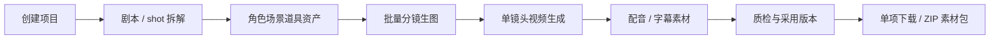
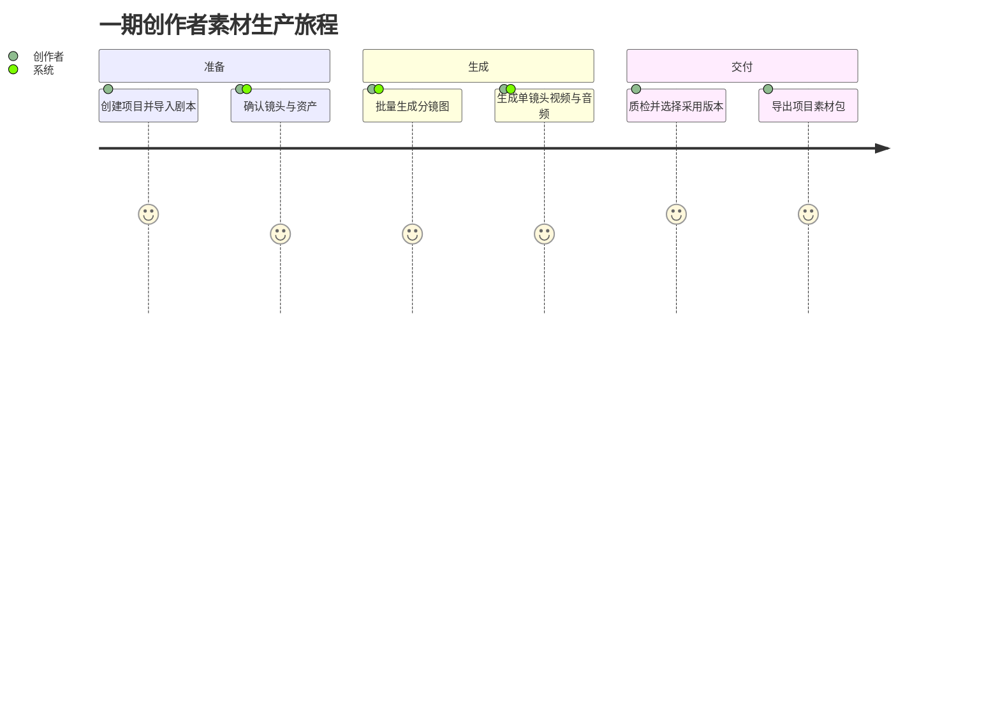
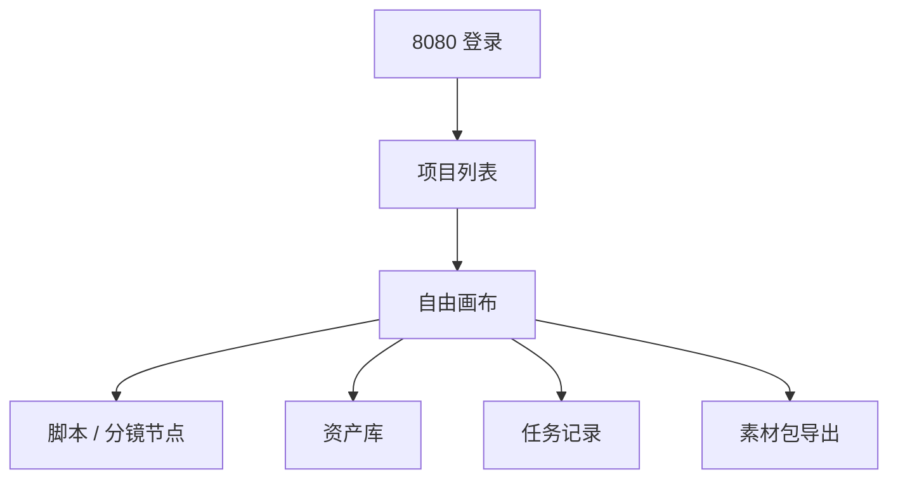
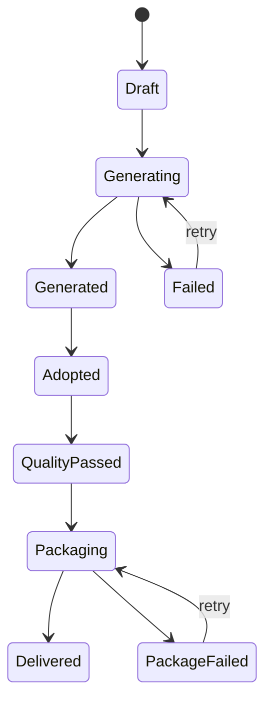

# 漫剧自由画布一期 MVP PRD

> **[superpowers 更新 V1.7]（2026-07-04）**：
> - **浮动编辑器改造**：画布交互模型已升级——右侧属性面板和底部生成栏已由浮动编辑器替代。本文档中涉及"右侧属性面板"、"底部生成栏"、"属性抽屉"的交互描述标注为 `[已废弃-superpowers V1.6]`。新交互模型详见 `docs/superpowers/specs/2026-06-28-canvas-node-floating-editor-design.md`
> - **Agent 会话统一**：各节点独立 Agent 面板（如"文本节点 Agent"、"分镜 Agent panel"）已由统一 AgentSessionService facade 替代。Agent 交互通过 `/api/v1/agent/sessions` 统一入口。详见 `docs/superpowers/specs/2026-07-02-agent-session-completion-design.md`
> - **分镜系统统一**：旧双轨分镜（`storyboard_shots` + `cp_storyboard_*`）已由统一专业分镜编辑器替代（13 维镜头字段 + A/B/C 层级版本 + XLSX 导入导出）。详见 `docs/superpowers/specs/2026-06-30-storyboard-professional-editor-redesign.md`
> - **API 前缀统一**：所有 API 端点统一使用 `/api/v1/` 前缀。文档中旧 `/api/` 前缀的引用以新前缀为准。
> - **Workspace 隔离**：所有私有资源需 `X-Workspace-Id` header。详见 `docs/superpowers/specs/2026-06-28-unified-account-model-billing-design.md`

## 1. 文档信息

| 项目 | 内容 |
| --- | --- |
| 产品名称 | 漫剧自由画布 |
| 阶段 | 一期 MVP |
| 文档类型 | PRD |
| 目标版本 | V1.0 |
| 最后修订 | 2026-07-02（基于 superpowers 更新） |

> **[superpowers 更新] V1.0→V1.6 关键变更**：
> - 脚本节点：旧 `scripts` 表 → `content_projects` 引用；三种创作模式入口
> - 画布项目：增加内容项目归属字段（`content_project_id`、`production_unit_type`、`source_content_version_id` 等）
> - 画布交互：右侧面板/底部生成栏 → 已由浮动编辑器改造取代（详见 `docs/superpowers/specs/2026-06-28-canvas-node-floating-editor-design.md`）
> - API 前缀：`/api/` → `/api/v1/`
> - 画布 Agent：文本节点 Agent → 统一 Agent 会话 facade（详见 `docs/superpowers/specs/2026-07-02-agent-session-completion-design.md`）
| 核心目标 | 搭建可用的自由画布创作闭环，完成剧本到分镜图、单镜头视频和素材包交付的最小生产链路 |

## 2. 一期定位

一期聚焦“能创作、能组织、能生成、能复用”的核心闭环。

用户需要在一个自由画布中完成剧本输入、基础节点组织、脚本拆解、角色/场景/道具资产管理、分镜图批量生成、单镜头视频生成、采用版本确认与素材包交付。

一期不提供视频剪辑、视频拼接、转场特效、音视频混合、多轨时间轴、3D 导演台和多人协同，优先保证从分镜到可交付素材的主链路跑通。

## 3. 一期目标

1. 提供 HTML + Canvas 混合实现的无限画布基础能力。
2. 支持文本、图片、视频、音频、脚本五类基础节点。
3. 支持节点拖拽、缩放、连线、右键菜单、复制、删除、副本。
4. 支持剧本拆解为结构化 shot 表。
5. 支持角色、场景、道具资产管理与复用。
6. 支持批量生成分镜图。
7. 支持基于分镜图生成视频片段。
8. 支持逐镜头选择采用版本并导出项目素材包。
9. 支持历史记录、自动保存、生成任务状态反馈。
10. 支持文本节点点击后进入节点级 Agent 交互，通过自然语言修改当前文本内容，并从平台 AI API 获取可用文本模型。 `[已废弃-superpowers V1.6：已由统一 AgentSessionService facade 替代]`

## 4. 目标用户

| 用户类型 | 需求 |
| --- | --- |
| 漫剧创作者 | 快速将剧本拆成分镜，并批量生成画面素材 |
| 短剧创作者 | 管理角色、场景、镜头提示词，提升单集素材生产效率 |
| AI 视频创作者 | 通过节点和连线组织图像、视频、音频生成流程 |
| 内容团队运营 | 批量生成可用于测试、投放、提案的分镜图和视频片段 |

## 5. 核心业务流程

```text
创建项目
→ 进入自由画布
→ 输入或上传剧本
→ 生成脚本节点
→ 拆解 shot
→ 提取角色/场景/道具
→ 人工编辑 shot 与资产
→ 合成图像提示词
→ 批量生成分镜图
→ 选择分镜图生成视频片段
→ 逐镜头质检并选择采用版本
→ 下载单项素材或导出 ZIP 项目素材包
```

### 5.1 总流程图



### 5.2 用户旅程图



### 5.3 页面跳转图



### 5.4 状态流转图



## 6. 一期功能范围

### 6.1 项目与画布入口

用户可以创建新项目，进入自由画布。一个项目对应一个画布。

功能要求：

| 功能 | 说明 |
| --- | --- |
| 创建项目 | 新建空白自由画布 |
| 项目列表 | 展示当前用户创建过的项目 |
| 进入项目 | 点击项目进入对应画布 |
| 重命名项目 | 双击或菜单修改项目名称 |
| 删除项目 | 删除前需要二次确认 |
| 自动保存 | 节点、连线、位置、缩放、资产引用自动保存 |

### 6.2 自由画布基础能力

画布采用 HTML + Canvas 混合架构。

| 层级 | 技术实现 | 用途 |
| --- | --- | --- |
| 背景层 | Canvas / CSS background | 网格背景、坐标背景 |
| 连线层 | SVG 优先，后续可切 Canvas | 节点连线、箭头、高亮 |
| 节点层 | HTML / React DOM | 文本、图片、视频、音频、脚本节点 |
| 交互层 | HTML overlay | 框选、多选、拖拽反馈 |
| 菜单层 | HTML floating layer | 右键菜单、工具栏、弹窗 |
| 小地图层 | Canvas | 简化展示节点分布 |

画布交互要求：

| 功能 | 说明 |
| --- | --- |
| 平移画布 | 按住空格或鼠标中键拖动画布 |
| 缩放画布 | 鼠标滚轮或触控板缩放，显示缩放比例 |
| 双击新建节点 | 双击空白处弹出节点类型选择 |
| 拖入文件 | 图片、视频、音频拖入后自动生成对应节点 |
| 框选节点 | 鼠标框选多个节点 |
| 多选节点 | Shift/Command/Ctrl 辅助多选 |
| 小地图 | 展示节点全局分布，支持拖动定位 |
| 撤销/重做 | 支持节点位置、创建、删除、连线等操作撤销和重做 |

### 6.3 基础节点

一期支持五类节点：文本节点、图片节点、视频节点、音频节点、脚本节点。

#### 6.3.1 文本节点

功能要求：

| 功能 | 说明 |
| --- | --- |
| 手动输入 | 支持输入和粘贴文本 |
| 基础编辑 | 支持标题、正文、复制、删除 |
| AI 生成文本 | 输入需求后生成文本内容 |
| 作为提示词输入 | 可连接到图片、视频、脚本节点 |
| 自动保存 | 编辑内容自动保存 |

文本节点需要包含两种交互形态：

| 形态 | 触发方式 | 展示与行为 |
| --- | --- | --- |
| 空态尝试动作 | 新建文本节点后默认展示 | 节点卡片中展示“自己编写内容”“文生视频”“图片反推提示词”“文字生音乐”四个入口 |
| 节点级 Agent `[已废弃-superpowers V1.6：已由统一 AgentSessionService facade 替代]` | 点击文本节点或点击空态中的文本输入区域 | 在画布底部/节点附近弹出大输入框，支持自然语言描述要写入或修改的内容，模型下拉展示平台 AI API 返回的文本模型 |

文本节点四个尝试动作：

| 动作 | 交互说明 | 是否自动成组 | 是否立即扣费 |
| --- | --- | --- | --- |
| 自己编写内容 | 点击后文本节点切换为富文本编辑态，顶部出现 H1/H2/H3、段落、加粗、斜体、列表、复制、全屏等工具 | 否 | 否 |
| 文生视频 | 点击后创建“预设 - 文生视频”组，组内包含文本节点和视频节点，并自动建立文本到视频的连线 | 是 | 否，只有执行视频生成时才扣费 |
| 图片反推提示词 | 点击后创建“预设 - 图片反推提示词”组，组内包含图片节点和文本节点，并自动建立图片到文本的连线 | 是 | 否，只有执行反推任务时才扣费 |
| 文字生音乐 | 点击后创建“预设 - 文字生音乐”组，组内包含文本节点和音频节点，并自动建立文本到音频的连线 | 是 | 否，只有执行音频生成时才扣费 |

节点级 Agent 本期只作用于文本节点，入口仅来自画布中的文本节点点击。 `[已废弃-superpowers V1.6：已由统一 AgentSessionService facade 替代]`

节点级 Agent 交互要求：

| 功能 | 说明 |
| --- | --- |
| 启动入口 | 用户点击文本节点后，在画布下方或节点附近显示 Agent 输入框；再次点击其他节点时切换上下文 |
| 输入框占位 | 默认展示“写下你想讲的故事、场景或角色设定。例如：一个来自未来的机器人，在城市屋顶看星星。” |
| 模型下拉 | 数据来自 `GET /api/v1/ai/models?node_type=text&agent_type=text_agent`，只展示支持文本能力且状态可用的模型 |
| 模型信息 | 下拉项展示模型名称、模型描述、预计耗时；不可用模型置灰不可选 |
| 默认模型 | 默认选中第一个 `status=available` 的模型；无可用模型时发送按钮置灰 |
| 发送按钮 | 点击后调用文本节点 Agent 规划接口，生成“原内容/修改后”对比结果 |
| 快捷发送 | 支持 Command/Ctrl + Enter 提交 |
| 结果确认 | 用户确认后点击“应用到文本节点”，系统将修改后内容写回当前文本节点 |
| 重新生成 | 用户可基于同一指令重新生成修改结果 |
| 取消 | 取消当前结果，不改变原文本节点内容 |
| 收起 | 点击收起按钮关闭 Agent 输入框，不清空节点原内容 |
| 本地可操作模式 | 后端不可用时允许本地预览文本修改逻辑，模型展示“本地文本代理”，不产生真实扣费 |

文本节点 Agent 计费要求： `[已废弃-superpowers V1.6：已由统一 AgentSessionService facade 替代]`

| 场景 | 计费规则 |
| --- | --- |
| 加载模型列表 | 不扣费 |
| 输入指令但未发送 | 不扣费 |
| 发送生成修改方案 | 按模型输入 Token 与输出 Token 预估消耗 |
| 应用修改结果 | 不重复扣费，仅保存内容 |
| 本地可操作模式 | 不扣费，`billing_mode=local` |

#### 6.3.2 图片节点

功能要求：

| 功能 | 说明 |
| --- | --- |
| 本地上传 | 支持拖入或选择本地图片 |
| 图片预览 | 节点内展示缩略图，点击可放大 |
| AI 生成图片 | 输入提示词、选择模型、比例、数量后生成 |
| 连接输入 | 可接收文本、角色、场景、道具、参考图 |
| 创建资产 | 可保存为角色、场景、道具、风格或普通图片资产 |
| 发送下游 | 可连接视频节点作为图生视频参考 |

一期图片节点只实现生成、上传、预览、创建资产，不实现高级图像编辑。

#### 6.3.3 视频节点

功能要求：

| 功能 | 说明 |
| --- | --- |
| 本地上传 | 支持拖入或选择本地视频 |
| 视频预览 | 支持播放、暂停、进度条 |
| AI 生成视频 | 支持文本生成视频、图片生成视频 |
| 连接输入 | 可接收文本提示词、图片参考 |
| 创建资产 | 可保存为视频资产或主体参考资产 |
| 设为采用版本 | 将当前结果设为该镜头交付版本 |

一期视频节点只实现基础生成、候选对比、预览、采用和下载，不实现剪辑、合成、解析、高清或人声分离。

#### 6.3.4 音频节点

功能要求：

| 功能 | 说明 |
| --- | --- |
| 本地上传 | 支持拖入或选择本地音频 |
| 音频预览 | 支持播放、暂停、进度条 |
| 文字转语音 | 输入文本后生成语音 |
| 创建资产 | 可保存为音频资产 |
| 关联镜头/项目 | 配音与音效关联镜头，BGM 关联项目素材清单 |

一期音频节点只实现上传、播放、文字转语音。

#### 6.3.5 脚本节点

脚本节点是一期核心。

功能要求：

| 功能 | 说明 |
| --- | --- |
| 剧本输入 | 支持手动输入剧本，或从文本节点接入 |
| 参考图输入 | 支持接入角色图、场景图、风格图 |
| 脚本拆解 | 将剧本拆为结构化 shot |
| 资产提取 | 自动提取角色、场景、道具 |
| shot 表格 | 展示镜头序号、场景、角色、动作、景别、对白、旁白、提示词 |
| 单元格编辑 | 每个字段可编辑 |
| 新增 shot | 手动新增分镜 |
| 删除 shot | 删除无效分镜 |
| 调整顺序 | 拖拽或按钮调整 shot 顺序 |
| 颜色标记 | 给 shot 添加颜色标签 |
| @资产引用 | 在字段中引用角色、场景、道具资产 |
| 提示词合成 | 根据 shot、资产、风格生成图像提示词 |
| 批量生图 | 选择单个、部分或全部 shot 生成分镜图 |

### 6.4 节点连线

节点连线用于表达数据流和引用关系。

| 连线类型 | 示例 | 作用 |
| --- | --- | --- |
| 文本到图片 | 文本节点 → 图片节点 | 文本作为图片提示词 |
| 图片到视频 | 图片节点 → 视频节点 | 图片作为视频首帧或参考图 |
| 文本到脚本 | 文本节点 → 脚本节点 | 文本作为剧本输入 |
| 资产到脚本 | 角色资产 → 脚本节点 | 资产作为角色参考 |
| 视频到镜头 | 视频节点 → 分镜 | 设为该镜头采用视频 |
| 音频到镜头/项目 | 音频节点 → 分镜或项目 | 关联配音、音效或 BGM 素材 |

连线交互：

| 功能 | 说明 |
| --- | --- |
| 拉线连接 | 从节点连接点拖拽到目标节点连接点 |
| 类型校验 | 数据类型不匹配时禁止连接或提示错误 |
| 选中连线 | 点击连线可选中 |
| 删除连线 | 选中后 Delete 删除 |
| 高亮上下游 | 选中节点时高亮关联连线 |

### 6.5 资产管理

一期资产类型：

| 资产类型 | 说明 |
| --- | --- |
| 角色资产 | 人物、主角、配角、NPC |
| 场景资产 | 室内、街道、学校、办公室等 |
| 道具资产 | 武器、手机、信件、车辆等 |
| 风格资产 | 画风参考、色调参考、风格图 |
| 图片资产 | 普通图片素材 |
| 视频资产 | 普通视频素材 |
| 音频资产 | 配音、BGM、音效 |
| 工作流资产 | 保存后的节点组 |

资产功能：

| 功能 | 说明 |
| --- | --- |
| 创建资产 | 从节点保存为资产 |
| 资产命名 | 创建时填写名称 |
| 资产分类 | 选择角色、场景、道具等类型 |
| 资产预览 | 查看图片、视频、音频 |
| 资产使用 | 发送到画布或在脚本中 @ 引用 |
| 删除资产 | 删除前二次确认 |
| 搜索资产 | 按名称搜索 |

### 6.6 批量生成分镜图

用户在脚本节点中确认 shot 和资产后，可批量生成分镜图。

功能要求：

| 功能 | 说明 |
| --- | --- |
| 选择范围 | 支持单个、多个、全部 shot |
| 模型选择 | 支持选择图像模型 |
| 比例设置 | 支持常用画幅比例 |
| 数量设置 | 支持每个 shot 生成 1-4 张 |
| 参数确认 | 生成前展示模型、比例、提示词 |
| 创建生成器组 | 在画布上自动创建一组图片生成节点 |
| 自动连线 | 自动将角色、场景、道具参考连入生成节点 |
| 任务状态 | 展示排队中、生成中、成功、失败 |
| 失败重试 | 单个 shot 失败可重试 |

### 6.7 基础视频生成

用户可从图片节点生成视频节点。

功能要求：

| 功能 | 说明 |
| --- | --- |
| 图生视频 | 图片节点连接视频节点后生成视频 |
| 文生视频 | 文本提示词直接生成视频 |
| 模型选择 | 支持选择视频模型 |
| 时长设置 | 支持基础时长选择 |
| 比例设置 | 继承图片比例或手动选择 |
| 数量设置 | 支持生成多个结果 |
| 任务状态 | 展示生成状态 |
| 失败重试 | 失败任务可重试 |

### 6.8 基础素材交付

一期以镜头采用版本和原始素材包为交付边界，不生成整片。

| 功能 | 说明 |
|---|---|
| 设置采用版本 | 每个镜头选择一张采用图和一个采用视频，可关联配音、字幕与音效 |
| 素材完整性检查 | 标出缺少视频、配音、字幕或文件不可用的镜头 |
| 单项下载 | 直接下载当前图片、视频、音频或字幕原文件 |
| 项目素材包 | 按镜头编号整理图片、视频、音频、字幕、Prompt 与 manifest.json 并导出 ZIP |

素材包任务不转码、不拼接、不混音、不烧录字幕。
### 6.9 历史记录

历史记录展示用户在系统内生成的图片、视频、音频。

功能要求：

| 功能 | 说明 |
| --- | --- |
| 生成历史 | 记录图片、视频、音频生成结果 |
| 查看历史 | 按类型查看历史 |
| 使用历史 | 将历史素材发送到当前画布 |
| 删除历史 | 删除指定历史记录 |
| 批量使用 | 一次最多使用 10 个历史资源 |

## 7. 任务状态

| 状态 | 说明 |
| --- | --- |
| 待提交 | 参数已配置，尚未提交任务 |
| 排队中 | 任务已提交，等待执行 |
| 执行中 | AI 模型正在生成 |
| 成功 | 生成完成并返回结果 |
| 失败 | 任务失败，展示失败原因 |
| 已取消 | 用户取消任务 |
| 可重试 | 失败后可重新提交 |

## 8. 数据结构

### 8.1 节点数据

```json
{
  "id": "node_001",
  "type": "image",
  "position": { "x": 100, "y": 200 },
  "size": { "width": 320, "height": 240 },
  "data": {
    "title": "女主角色图",
    "assetUrl": "https://cdn.example.com/image.png",
    "prompt": "古风少女，正面半身像",
    "model": "image_model",
    "status": "completed"
  }
}
```

### 8.2 连线数据

```json
{
  "id": "edge_001",
  "source": "text_001",
  "target": "image_001",
  "sourceHandle": "output",
  "targetHandle": "prompt",
  "mapping": {
    "text": "prompt"
  }
}
```

### 8.3 shot 数据

```json
{
  "shotId": "shot_001",
  "scene": "夜晚街道",
  "characters": ["女主", "黑衣人"],
  "camera": "中景",
  "action": "女主回头发现有人跟踪",
  "dialogue": "",
  "voiceover": "她意识到危险正在靠近",
  "imagePrompt": "夜晚街道，中景，女主回头",
  "videoPrompt": "镜头缓慢推进，女主紧张回头",
  "linkedAssets": ["asset_role_001", "asset_scene_001"]
}
```

## 9. 非功能需求

### 9.1 性能要求

| 指标 | 要求 |
| --- | --- |
| 节点规模 | 至少支持 500 个节点 |
| 拖拽体验 | 普通项目中拖拽无明显卡顿 |
| 图片加载 | 图片节点懒加载 |
| 视频加载 | 视频节点默认展示封面，点击后加载播放器 |
| 连线渲染 | 一期可用 SVG，后续节点量大时切 Canvas |
| 自动保存 | 操作后 1-3 秒内保存 |

### 9.2 稳定性要求

| 项目 | 要求 |
| --- | --- |
| 自动保存 | 节点、连线、资产引用、脚本表自动保存 |
| 失败重试 | AI 生成失败支持重试 |
| 刷新恢复 | 页面刷新后恢复画布状态 |
| 撤销重做 | 支持核心画布操作撤销重做 |
| 删除确认 | 删除项目、清空数据等危险操作二次确认 |

### 9.3 安全要求

| 项目 | 要求 |
| --- | --- |
| 用户隔离 | 用户只能访问自己的项目和资产 |
| 文件校验 | 校验文件类型、大小和格式 |
| 内容合规 | AI 生成任务预留合规检测 |
| 权限控制 | 项目访问需登录鉴权 |

## 10. 一期验收标准

1. 用户能创建项目并进入自由画布。
2. 用户能创建五类基础节点。
3. 用户能在画布中拖拽、缩放、平移、连线、删除节点。
4. 用户能输入剧本并生成结构化 shot 表。
5. 用户能编辑 shot，并提取角色、场景、道具资产。
6. 用户能批量生成分镜图。
7. 用户能基于图片生成视频片段。
8. 用户能为多个镜头选择采用版本并导出一个项目素材包。
9. 用户刷新页面后画布内容不丢失。
10. 生成失败时能看到失败状态并重试。

## 11. 一期不包含

1. 高级图像编辑。
2. 视频解析。
3. 任何视频剪辑、视频合成或多轨时间轴能力。
4. 人声/背景音分离。
5. 音视频分离。
6. 音色克隆。
7. 3D 导演台。
8. 多人协同。
9. 复杂工作流自动编排。
10. 版本管理。

## 12. 开发级详细需求补充

本章节用于补齐开发落地所需的字段、按钮、数据来源、业务流转、异常状态和验收口径。开发实现时，以本章节作为一期功能拆分和接口设计依据。

### 12.1 全局交互约定

| 控件/状态 | 交互说明 |
| --- | --- |
| 文本输入框 | 支持手动输入、复制粘贴；必填字段为空时，在输入框下方展示错误提示；失焦时触发基础校验 |
| 多行文本框 | 用于剧本、提示词、描述类内容；支持换行；输入内容自动保存时需展示“已保存/保存中/保存失败”状态 |
| 单选框 | 用于模型、比例、类型、状态等单一选项；默认展示“请选择”；数据来源可能为平台内置清单或接口返回 |
| 多选框 | 用于批量选择 shot、资产、历史资源；支持全选、取消全选、反选 |
| 数字输入框 | 用于生成数量、时长、分辨率等；需要设置最小值、最大值、步长和默认值 |
| 开关 | 用于是否继承上游比例、是否保存为资产、是否使用参考图等二元设置 |
| 查询按钮 | 点击后按照当前筛选字段查询列表；单一条件也可查询；查询结果在列表或表格中展示 |
| 重置按钮 | 点击后清空筛选条件，恢复默认状态，并重新加载默认列表 |
| 生成按钮 | 点击后进行参数校验；校验通过后创建异步任务；按钮进入 loading 状态，防止重复提交 |
| 取消按钮 | 对弹窗表示关闭弹窗；对生成任务表示取消排队中任务，执行中任务是否可取消由模型服务决定 |
| 重试按钮 | 仅在任务失败后展示；点击后复用上一次参数重新提交任务 |
| 删除按钮 | 删除项目、节点、资产、历史记录前需要二次确认 |
| 空状态 | 列表无数据时展示空状态文案和快捷操作入口 |
| 错误状态 | 接口失败时展示错误原因；支持重新加载 |
| 权限不足 | 用户无权限时隐藏操作按钮或按钮置灰，并展示无权限提示 |

### 12.2 项目列表页

#### 12.2.1 筛选区

| 字段/按钮 | 类型 | 数据来源 | 交互说明 |
| --- | --- | --- | --- |
| 项目名称 | 输入框 | 用户手动输入 | 支持按项目名称模糊查询 |
| 项目状态 | 单选框 | 平台内置状态清单：全部、正常、已删除草稿 | 默认“全部”，该选项为单一选项 |
| 创建时间 | 日期范围选择器 | 用户手动选择 | 支持选择开始日期和结束日期；结束日期不得早于开始日期 |
| 排序方式 | 单选框 | 平台内置清单：最近编辑、最近创建、名称升序、名称降序 | 默认“最近编辑” |
| 查询 | 按钮 | 无 | 点击后根据项目名称、项目状态、创建时间、排序方式查询；单一条件也可查询；结果在项目列表中展示 |
| 重置 | 按钮 | 无 | 点击后清空所有筛选字段，恢复默认状态，并重新查询 |
| 新建项目 | 主按钮 | 无 | 点击后弹出新建项目弹窗 |

#### 12.2.2 项目列表

| 字段/操作 | 说明 |
| --- | --- |
| 项目封面 | 默认取画布首个图片节点或系统默认封面 |
| 项目名称 | 展示用户创建的项目名称 |
| 更新时间 | 展示最近一次自动保存或手动保存时间 |
| 节点数量 | 展示当前项目节点总数 |
| 生成任务数 | 展示项目内生成任务总数 |
| 进入项目 | 点击卡片或“进入”按钮进入自由画布 |
| 重命名 | 点击后进入名称编辑状态；为空不可保存 |
| 删除 | 点击后弹出确认弹窗；确认后删除项目 |

#### 12.2.3 新建项目弹窗

| 字段/按钮 | 类型 | 交互说明 |
| --- | --- | --- |
| 项目名称 | 输入框 | 必填，默认值为“未命名项目”；长度建议 1-50 字 |
| 项目类型 | 单选框 | 平台内置清单：漫剧、短剧、动画短片、其他；默认“漫剧” |
| 画布比例偏好 | 单选框 | 平台内置清单：16:9、9:16、1:1、3:4、4:3；用于后续生成器默认比例 |
| 确认创建 | 按钮 | 校验通过后创建项目并进入画布 |
| 取消 | 按钮 | 关闭弹窗，不保存 |

### 12.3 自由画布主界面

#### 12.3.1 页面布局

```text
顶部栏：项目名称、保存状态、撤销、重做、快捷键入口、用户信息
左侧栏：添加节点、资产库、历史记录、工作流入口
画布区：无限画布、节点、连线、框选层、右键菜单
底部/浮动区：缩放比例、小地图、任务队列状态
右侧抽屉：节点详情、资产详情、生成参数、任务详情
```

#### 12.3.2 顶部栏

| 控件 | 类型 | 交互说明 |
| --- | --- | --- |
| 项目名称 | 文本/输入框 | 双击后可编辑；回车保存；Esc 取消 |
| 保存状态 | 状态文本 | 展示“保存中”“已保存”“保存失败”；保存失败时可点击重试 |
| 撤销 | 图标按钮 | 点击后撤销最近一次画布操作；无可撤销操作时置灰 |
| 重做 | 图标按钮 | 点击后恢复最近一次撤销操作；无可重做操作时置灰 |
| 快捷键 | 图标按钮 | 点击后打开快捷键弹窗 |
| 导出项目 | 按钮 | 一期可预留入口；点击提示“当前版本暂未开放” |

#### 12.3.3 左侧栏

| 菜单 | 交互说明 |
| --- | --- |
| 添加节点 | 点击后展开节点类型：文本、图片、视频、音频、脚本；点击类型后在当前视口中心创建节点 |
| 上传资源 | 点击后打开文件选择器；支持图片、视频、音频；多选上传后在画布中批量创建节点 |
| 资产库 | 点击后打开资产抽屉；默认展示全部资产 |
| 历史记录 | 点击后打开历史记录抽屉；默认展示最近生成资源 |
| 工作流 | 一期展示已保存工作流；可将工作流发送到画布 |

#### 12.3.4 画布基础交互

| 交互 | 触发方式 | 处理逻辑 |
| --- | --- | --- |
| 新建节点 | 双击画布空白处 | 弹出节点类型选择菜单；选择后在点击位置创建节点 |
| 拖动画布 | 按住空格拖动/鼠标中键拖动 | 更新视口 transform，不改变节点坐标 |
| 缩放画布 | 滚轮/触控板 | 以鼠标位置为中心缩放；缩放比例需要限制最小值和最大值 |
| 拖拽节点 | 鼠标按住节点头部或空白区拖动 | 更新节点 position；拖动过程中连线实时跟随 |
| 框选节点 | 在画布空白处拖拽 | 框内节点进入选中状态 |
| 多选节点 | Shift/Cmd/Ctrl 点击节点 | 增加或取消选中节点 |
| 删除节点 | 选中节点后 Delete | 弹出确认；确认后删除节点和相关连线 |
| 复制节点 | Ctrl/Cmd+C | 将选中节点写入剪贴板；默认不复制连线 |
| 粘贴节点 | Ctrl/Cmd+V | 在当前视口中心粘贴节点副本 |
| 创建副本 | Alt 拖动节点 | 创建副本并保留原节点连线 |
| 拉线连接 | 从节点连接点拖到目标连接点 | 校验源节点输出类型和目标节点输入类型 |
| 删除连线 | 选中连线后 Delete | 删除当前连线 |
| 右键菜单 | 节点或画布右键 | 展示对应菜单；节点菜单和画布菜单不同 |

### 12.4 节点通用能力

#### 12.4.1 节点头部

| 字段/按钮 | 类型 | 交互说明 |
| --- | --- | --- |
| 节点标题 | 输入框 | 默认按节点类型命名；支持重命名 |
| 节点状态 | 状态标签 | 未配置、可生成、生成中、成功、失败、已锁定 |
| 折叠/展开 | 图标按钮 | 折叠后只展示头部和主要结果缩略信息 |
| 更多 | 图标按钮 | 展示复制、副本、创建资产、删除等操作 |

#### 12.4.2 节点右键菜单

| 菜单项 | 交互说明 |
| --- | --- |
| 复制 | 复制当前节点，不保留连线 |
| 创建副本 | 创建当前节点副本，保留连线 |
| 创建资产 | 打开创建资产弹窗 |
| 查看详情 | 打开右侧节点详情抽屉 |
| 删除 | 二次确认后删除节点和相关连线 |

#### 12.4.3 创建资产弹窗

| 字段/按钮 | 类型 | 数据来源 | 交互说明 |
| --- | --- | --- | --- |
| 资产名称 | 输入框 | 用户手动输入 | 必填，默认取节点标题 |
| 资产类型 | 单选框 | 平台内置清单：角色、场景、道具、风格、图片、视频、音频 | 该选项为单一选项 |
| 资产标签 | 多选输入 | 用户输入或历史标签 | 支持输入多个标签 |
| 资产描述 | 多行文本框 | 用户手动输入 | 可选 |
| 确认保存 | 按钮 | 无 | 校验通过后创建资产 |
| 取消 | 按钮 | 无 | 关闭弹窗 |

### 12.5 文本节点详细交互

| 字段/按钮 | 类型 | 数据来源 | 交互说明 |
| --- | --- | --- | --- |
| 标题 | 输入框 | 用户输入 | 默认“文本节点”；支持修改 |
| 文本内容 | 多行文本框 | 用户输入或 AI 生成 | 支持粘贴剧本、提示词、角色设定 |
| 文本模型 | 单选框 | `GET /api/v1/ai/models?node_type=text&agent_type=text_agent` | 该选项为单一选项；展示模型名称、说明、预计耗时；默认选择第一个可用模型 |
| Agent 指令 | 多行文本框 | 用户输入 | 用户描述希望如何新增、改写、扩写、精简或优化当前文本 |
| 发送 | 按钮 | 无 | 点击后校验模型和 Agent 指令，调用文本节点 Agent 规划接口 |
| 结果对比 | 双栏文本区 | Agent 返回 | 左侧展示原内容，右侧展示修改后内容 |
| 重新生成 | 按钮 | 当前指令和模型 | 重新调用规划接口，不覆盖当前节点内容 |
| 应用到文本节点 | 按钮 | Agent 修改结果 | 将修改后文本写入当前文本节点，并保存 `source=text_node_agent`、`agent_type=text_agent`、`model_id` |
| 连接输出点 | 连接点 | 当前文本内容 | 可连接图片、视频、脚本节点 |

#### 12.5.1 文本节点空态与编辑态

| 状态 | 展示 | 触发条件 | 后续动作 |
| --- | --- | --- | --- |
| 空态 | 节点卡片展示图标占位、“尝试：自己编写内容 / 文生视频 / 图片反推提示词 / 文字生音乐” | 新建文本节点且没有正文内容 | 等待用户选择尝试动作或点击节点启动 Agent |
| 富文本编辑态 | 节点卡片变为文本编辑框，上方展示格式工具条 | 点击“自己编写内容” | 用户直接输入或粘贴内容，失焦后自动保存 |
| Agent 输入态 | 画布底部或节点附近展示大输入框和模型下拉 | 点击文本节点或文本节点空态输入区 | 用户输入自然语言指令，发送后生成修改方案 |
| 结果确认态 | Agent 面板展示原内容和修改后内容 | 规划接口返回成功 | 用户可应用、取消或重新生成 |

富文本工具条要求：

| 工具 | 说明 |
| --- | --- |
| 清除样式 | 清除当前选中文本格式 |
| H1/H2/H3 | 将当前段落设置为标题级别 |
| 段落 | 恢复普通段落 |
| 加粗/斜体 | 对选中文本生效 |
| 无序列表/有序列表 | 对当前段落或选中段落生效 |
| 分割线 | 插入段落分割 |
| 复制 | 复制当前节点内容 |
| 全屏 | 打开大文本编辑弹层 |

#### 12.5.2 文本节点 Agent 业务流 `[已废弃-superpowers V1.6：已由统一 AgentSessionService facade 替代]`

```text
用户点击文本节点
→ 系统读取当前文本节点内容
→ 前端请求文本模型列表
→ 用户选择模型或使用默认模型
→ 用户输入自然语言修改指令
→ 点击发送或使用 Command/Ctrl + Enter
→ 后端基于当前内容、指令、模型生成修改方案
→ 前端展示原内容/修改后对比
→ 用户点击“应用到文本节点”
→ 后端更新节点内容、模型、来源和状态
→ 前端关闭结果态并刷新节点展示
```

#### 12.5.3 文本节点 Agent 字段与接口 `[已废弃-superpowers V1.6：已由统一 AgentSessionService facade 替代]`

| 字段 | 类型 | 来源 | 说明 |
| --- | --- | --- | --- |
| `node_id` | string | 当前选中文本节点 | 必填，用于确定修改目标 |
| `model_id` | string | 模型下拉 | 必填，来自平台 AI API 返回的 `model_id` |
| `instruction` | string | 用户输入 | 必填，描述新增、改写、扩写、精简、优化等要求 |
| `current_content` | string | 当前文本节点 | 可为空；为空时以用户指令作为初始文本 |
| `billing_mode` | string | 前端固定 | 文本节点 Agent 默认为 `token`；本地模式为 `local` |
| `usage_estimate` | object | 后端返回 | 展示输入 Token、输出 Token、预计积分 |
| `revised_content` | string | 后端返回 | 用户确认后写回节点 |

接口要求：

| 场景 | 方法与路径 | 说明 |
| --- | --- | --- |
| 获取模型 | `GET /api/v1/ai/models?node_type=text&agent_type=text_agent` | 返回文本节点 Agent 可用模型 |
| 生成修改方案 | `POST /api/v1/canvas/projects/{projectId}/text-node-agent/plan` | 返回原内容、修改后内容、模型、Token 预估 |
| 应用修改结果 | `POST /api/v1/canvas/projects/{projectId}/text-node-agent/apply` | 将修改后内容保存到文本节点 |

异常处理：

| 场景 | 处理 |
| --- | --- |
| Agent 指令为空 | 提示“请输入你想如何修改当前文本” |
| 模型不可用 | 提示“当前模型不可用，请切换模型” |
| 模型列表加载失败 | 后端不可用时进入本地可操作模式；正常联网失败时提示“模型列表加载失败，请稍后重试” |
| 文本节点不存在 | 提示“画布节点不存在”，不关闭原面板 |
| 规划失败 | 提示“文本修改失败，请稍后重试”，保留用户输入 |
| 应用失败 | 提示“应用失败，请稍后重试”，保留结果对比 |
| 内容过长 | 提示超出长度限制，并阻止提交 |

### 12.6 图片节点详细交互

#### 12.6.1 图片生成器

| 字段/按钮 | 类型 | 数据来源 | 交互说明 |
| --- | --- | --- | --- |
| 提示词 | 多行文本框 | 用户输入、上游文本节点、脚本 shot | 必填；接入上游文本后自动填充，可手动修改 |
| 参考图 | 图片列表 | 上游图片节点、用户上传、资产库 | 支持添加、删除、预览；一期限制数量由模型配置决定 |
| 图像模型 | 单选框 | 调用“模型配置-图像模型”中已启用模型 | 该选项为单一选项 |
| 画幅比例 | 单选框 | 平台内置清单：16:9、9:16、1:1、3:4、4:3、21:9 | 默认继承项目比例偏好 |
| 生成数量 | 数字输入框 | 用户输入 | 默认 1，范围 1-4 |
| 生成图片 | 按钮 | 无 | 参数校验通过后创建图片生成任务 |
| 取消生成 | 按钮 | 当前任务 | 排队中可取消；执行中根据模型能力处理 |
| 重试 | 按钮 | 上次失败任务参数 | 失败后展示 |
| 保存为资产 | 按钮 | 当前图片结果 | 打开创建资产弹窗 |
| 发送到视频 | 按钮 | 当前图片结果 | 自动创建视频节点并连接 |

#### 12.6.2 图片结果区

| 状态 | 展示说明 |
| --- | --- |
| 未生成 | 展示空状态和生成入口 |
| 生成中 | 展示进度、排队位置或 loading |
| 成功 | 展示图片缩略图，点击放大预览 |
| 失败 | 展示失败原因和重试按钮 |

### 12.7 视频节点详细交互

| 字段/按钮 | 类型 | 数据来源 | 交互说明 |
| --- | --- | --- | --- |
| 视频提示词 | 多行文本框 | 用户输入、上游文本节点、脚本 shot | 描述画面动态、人物动作和运镜 |
| 首帧图片 | 图片引用 | 上游图片节点或用户上传 | 图生视频时必填 |
| 视频模型 | 单选框 | 调用“模型配置-视频模型”中已启用模型 | 该选项为单一选项 |
| 视频时长 | 单选框 | 模型配置返回支持时长 | 该选项为单一选项 |
| 画幅比例 | 单选框 | 平台内置比例或继承首帧图片 | 默认继承上游图片 |
| 生成数量 | 数字输入框 | 用户输入 | 默认 1 |
| 生成视频 | 按钮 | 无 | 创建视频生成任务 |
| 播放/暂停 | 按钮 | 当前视频结果 | 控制视频预览 |
| 下载 | 按钮 | 当前视频结果 | 下载视频文件 |
| 设为采用版本 | 按钮 | 当前视频结果 | 写入镜头 adopted_video_asset_id |

异常处理：

| 场景 | 处理 |
| --- | --- |
| 图生视频缺少首帧 | 提示“请上传或连接首帧图片” |
| 模型不支持当前比例 | 提示并要求切换比例 |
| 视频生成失败 | 展示失败原因和重试按钮 |

### 12.8 音频节点详细交互

| 字段/按钮 | 类型 | 数据来源 | 交互说明 |
| --- | --- | --- | --- |
| 音频文本 | 多行文本框 | 用户输入或上游文本节点 | 用于文字转语音 |
| 音频模型 | 单选框 | 调用“模型配置-音频模型”中已启用模型 | 该选项为单一选项 |
| 音色 | 单选框 | 调用“音色库”中系统音色和用户音色 | 该选项为单一选项 |
| 语速 | 数字输入/滑块 | 模型配置 | 默认 1.0 |
| 生成语音 | 按钮 | 无 | 创建文字转语音任务 |
| 播放/暂停 | 按钮 | 当前音频结果 | 控制音频预览 |
| 关联镜头/项目 | 按钮 | 当前音频结果 | 写入镜头或项目素材清单 |

### 12.9 脚本节点详细交互

#### 12.9.1 输入区

| 字段/按钮 | 类型 | 数据来源 | 交互说明 |
| --- | --- | --- | --- |
| 剧本文本 | 多行文本框 | 用户输入或上游文本节点 | 必填；支持长文本 |
| 参考图 | 图片列表 | 上游图片节点、上传、资产库 | 可选，用于角色、场景、风格参考 |
| 拆解模型 | 单选框 | 调用“模型配置-语言模型/多模态模型” | 该选项为单一选项 |
| 拆解粒度 | 单选框 | 平台内置清单：粗略、标准、精细 | 默认“标准” |
| 生成脚本 | 按钮 | 无 | 校验剧本文本后创建脚本拆解任务 |

#### 12.9.2 shot 表字段

| 字段 | 类型 | 是否必填 | 说明 |
| --- | --- | --- | --- |
| shot 序号 | 数字/文本 | 是 | 系统自动生成，可随顺序调整 |
| 场景 | 输入框 | 是 | 当前镜头所在场景 |
| 角色 | 多选/@资产 | 否 | 可引用角色资产 |
| 道具 | 多选/@资产 | 否 | 可引用道具资产 |
| 景别 | 单选框 | 否 | 内置清单：远景、全景、中景、近景、特写等 |
| 角色动作 | 输入框 | 否 | 描述角色动作 |
| 画面氛围 | 输入框 | 否 | 描述情绪、光影、色调 |
| 对白 | 多行文本 | 否 | 角色对白 |
| 旁白 | 多行文本 | 否 | 旁白内容 |
| 图像提示词 | 多行文本 | 是 | 用于分镜图生成 |
| 视频提示词 | 多行文本 | 否 | 用于视频片段生成 |
| 颜色标记 | 单选框 | 否 | 内置颜色清单，用于管理 |

#### 12.9.3 shot 表按钮

| 按钮 | 交互说明 |
| --- | --- |
| 新增 shot | 在当前行下方新增一行空 shot |
| 删除 shot | 删除当前 shot；如已生成结果，提示是否同步删除生成节点 |
| 上移 | 将当前 shot 上移一位 |
| 下移 | 将当前 shot 下移一位 |
| 复制 shot | 复制当前 shot 内容并插入下一行 |
| 合成提示词 | 根据 shot 字段和引用资产生成图像/视频提示词 |
| 批量生成分镜图 | 打开批量生成配置弹窗 |
| 批量生成视频 | 一期可展示入口；若依赖分镜图，则提示先生成分镜图 |

#### 12.9.4 资产提取区

| 功能 | 交互说明 |
| --- | --- |
| 自动提取角色 | 脚本拆解完成后生成角色资产草稿 |
| 自动提取场景 | 脚本拆解完成后生成场景资产草稿 |
| 自动提取道具 | 脚本拆解完成后生成道具资产草稿 |
| 确认资产 | 用户确认后资产正式进入项目资产库 |
| 编辑资产 | 可修改名称、描述、参考图 |
| 删除资产 | 若资产被 shot 引用，删除前提示影响范围 |

### 12.10 批量生成分镜图业务流

```text
用户点击“批量生成分镜图”
→ 系统打开批量生成弹窗
→ 用户选择 shot 范围
→ 用户选择图像模型、比例、数量
→ 系统计算预计任务数和预计消耗
→ 用户确认
→ 系统在画布中创建图片生成器组
→ 系统为每个 shot 创建图片节点
→ 系统自动连接相关角色/场景/道具资产
→ 系统提交异步生成任务
→ 任务结果回写对应图片节点
→ 失败任务展示重试入口
```

批量生成弹窗：

| 字段/按钮 | 类型 | 数据来源 | 交互说明 |
| --- | --- | --- | --- |
| 生成范围 | 多选 | 当前脚本节点 shot 列表 | 支持单个、多个、全部 |
| 图像模型 | 单选框 | 模型配置-图像模型 | 该选项为单一选项 |
| 画幅比例 | 单选框 | 平台内置比例 | 默认继承项目比例 |
| 每条数量 | 数字输入框 | 用户输入 | 默认 1，范围 1-4 |
| 是否创建分镜组 | 开关 | 用户选择 | 开启后生成完成自动加入分镜组 |
| 预计任务数 | 只读文本 | 系统计算 | shot 数量 x 每条数量 |
| 预计消耗 | 只读文本 | 模型价格配置 | 一期可预留展示 |
| 确认并创建 | 按钮 | 无 | 创建生成器组并提交任务 |
| 取消 | 按钮 | 无 | 关闭弹窗 |

### 12.11 素材交付业务流

```text
各镜头完成图片/视频/配音/字幕生成
→ 用户逐镜头选择采用版本
→ 系统生成 delivery manifest
→ 完整性检查
→ 用户选择单项下载或导出项目素材包
→ 后台收集原文件、规范命名并生成 checksum
→ ZIP 上传对象存储
→ 用户下载并交给外部后期工具
```

| 组件 | 类型 | 输入 | 输出 |
|---|---|---|---|
| 镜头序列 | 只读列表 | 分镜顺序、采用版本 | 素材完整性状态 |
| 设为采用 | 按钮 | 候选资产 ID | 更新镜头采用版本 |
| 导出素材包 | 按钮 | manifest_version、包含项 | asset_package_task |
| 下载 | 按钮 | 完成的打包任务 | ZIP 限时地址 |
### 12.12 资产库详细交互

筛选区：

| 字段/按钮 | 类型 | 数据来源 | 交互说明 |
| --- | --- | --- | --- |
| 资产名称 | 输入框 | 用户输入 | 支持模糊查询 |
| 资产类型 | 单选框 | 平台内置资产类型 | 该选项为单一选项 |
| 标签 | 多选框 | 当前用户历史标签 | 支持多选 |
| 创建来源 | 单选框 | 平台内置清单：节点创建、历史生成、上传 | 该选项为单一选项 |
| 查询 | 按钮 | 无 | 根据筛选条件查询；单一条件也可以查询 |
| 重置 | 按钮 | 无 | 清空筛选条件，恢复默认列表 |

资产卡片操作：

| 操作 | 交互说明 |
| --- | --- |
| 查看 | 打开资产详情抽屉 |
| 使用 | 将资产发送到当前画布中心 |
| 引用 | 在脚本节点 @ 面板中插入资产 |
| 删除 | 二次确认；若被引用，提示引用范围 |

### 12.13 历史记录详细交互

筛选区：

| 字段/按钮 | 类型 | 数据来源 | 交互说明 |
| --- | --- | --- | --- |
| 资源类型 | 单选框 | 图片、视频、音频、全部 | 默认全部 |
| 生成状态 | 单选框 | 成功、失败、生成中、全部 | 默认全部 |
| 模型 | 单选框 | 模型配置中已启用模型 | 可选 |
| 创建时间 | 日期范围 | 用户选择 | 可选 |
| 查询 | 按钮 | 无 | 根据条件查询 |
| 重置 | 按钮 | 无 | 恢复默认状态 |

列表操作：

| 操作 | 交互说明 |
| --- | --- |
| 查看 | 打开预览 |
| 使用 | 发送到当前画布 |
| 批量使用 | 最多选择 10 个资源发送到画布 |
| 下载 | 下载资源文件 |
| 删除 | 删除历史记录 |

### 12.14 后端接口建议

> `[已更新：统一使用 /api/v1/ 前缀]` 以下旧 `/api/` 前缀接口已统一迁移至 `/api/v1/` 前缀。

| 模块 | 接口 | 说明 |
| --- | --- | --- |
| 项目 | `POST /api/projects` `[已更新：统一使用 /api/v1/ 前缀]` | 创建项目 |
| 项目 | `GET /api/projects` `[已更新：统一使用 /api/v1/ 前缀]` | 查询项目列表 |
| 项目 | `GET /api/projects/{id}` `[已更新：统一使用 /api/v1/ 前缀]` | 获取项目详情 |
| 项目 | `PUT /api/projects/{id}` `[已更新：统一使用 /api/v1/ 前缀]` | 更新项目名称、配置 |
| 项目 | `DELETE /api/projects/{id}` `[已更新：统一使用 /api/v1/ 前缀]` | 删除项目 |
| 画布 | `GET /api/projects/{id}/canvas` `[已更新：统一使用 /api/v1/ 前缀]` | 获取画布快照 |
| 画布 | `PUT /api/projects/{id}/canvas` `[已更新：统一使用 /api/v1/ 前缀]` | 保存画布快照 |
| 节点 | `POST /api/projects/{id}/nodes` `[已更新：统一使用 /api/v1/ 前缀]` | 创建节点 |
| 节点 | `PUT /api/nodes/{id}` `[已更新：统一使用 /api/v1/ 前缀]` | 更新节点 |
| 节点 | `DELETE /api/nodes/{id}` `[已更新：统一使用 /api/v1/ 前缀]` | 删除节点 |
| 连线 | `POST /api/projects/{id}/edges` `[已更新：统一使用 /api/v1/ 前缀]` | 创建连线 |
| 连线 | `DELETE /api/edges/{id}` `[已更新：统一使用 /api/v1/ 前缀]` | 删除连线 |
| 资产 | `POST /api/assets` `[已更新：统一使用 /api/v1/ 前缀]` | 创建资产 |
| 资产 | `GET /api/assets` `[已更新：统一使用 /api/v1/ 前缀]` | 查询资产 |
| 历史 | `GET /api/generation-records` `[已更新：统一使用 /api/v1/ 前缀]` | 查询生成历史 |
| 任务 | `POST /api/generation-tasks` `[已更新：统一使用 /api/v1/ 前缀]` | 创建生成任务 |
| 任务 | `GET /api/generation-tasks/{id}` `[已更新：统一使用 /api/v1/ 前缀]` | 查询任务状态 |
| 任务 | `POST /api/generation-tasks/{id}/retry` `[已更新：统一使用 /api/v1/ 前缀]` | 重试任务 |
| 文件 | `POST /api/files/upload` `[已更新：统一使用 /api/v1/ 前缀]` | 上传文件 |
| AI 模型 | `GET /api/v1/ai/models?node_type=text&agent_type=text_agent` | 获取文本节点 Agent 模型下拉数据 |
| 文本节点 Agent | `POST /api/v1/canvas/projects/{projectId}/text-node-agent/plan` | 生成文本修改方案，返回 Token 预估和结果对比 |
| 文本节点 Agent | `POST /api/v1/canvas/projects/{projectId}/text-node-agent/apply` | 应用修改结果到当前文本节点 |

### 12.15 一期关键验收用例

| 用例 | 前置条件 | 操作 | 预期结果 |
| --- | --- | --- | --- |
| 创建项目 | 用户已登录 | 输入项目名称并确认 | 创建成功并进入空白画布 |
| 新建文本节点 | 已进入画布 | 双击画布选择文本节点 | 指定位置出现文本节点 |
| 文本节点 Agent 打开 `[已废弃-superpowers V1.6：已由统一 AgentSessionService facade 替代]` | 已有文本节点 | 点击文本节点 | 出现与节点关联的 Agent 输入框和模型下拉 |
| 文本模型下拉 | 后端正常 | 打开文本节点 Agent | 下拉数据来自 `/api/v1/ai/models?node_type=text&agent_type=text_agent`，展示模型名、描述、预计耗时 |
| 文本 Agent 修改 | 文本节点有内容 | 输入修改指令并发送 | 展示原内容/修改后对比和预计 Token/积分 |
| 应用文本 Agent 结果 | 已生成修改方案 | 点击“应用到文本节点” | 当前文本节点内容被更新，刷新后内容不丢失 |
| 文本节点自己编写 | 文本节点空态 | 点击“自己编写内容” | 节点切换为富文本编辑态，不创建生成任务 |
| 文本节点文生视频预设 | 文本节点空态 | 点击“文生视频” | 画布创建预设组，包含文本节点、视频节点和自动连线 |
| 文本连接图片 | 画布有文本和图片节点 | 从文本节点拉线到图片节点 | 图片节点提示词自动接收文本内容 |
| 剧本拆解 | 脚本节点有剧本文本 | 点击生成脚本 | 生成 shot 表和资产草稿 |
| 编辑 shot | 已生成 shot 表 | 修改场景、角色、提示词 | 修改内容自动保存 |
| 批量生图 | shot 表已确认 | 选择 3 条 shot 生成 | 画布创建 3 个图片节点并执行任务 |
| 图生视频 | 已有图片节点 | 发送到视频并生成 | 视频节点生成结果 |
| 素材交付 | 已为多个镜头选择采用版本 | 导出项目素材包 | 生成包含清单和原文件的可下载 ZIP |
| 刷新恢复 | 画布已有节点 | 刷新页面 | 节点、连线、位置恢复 |
