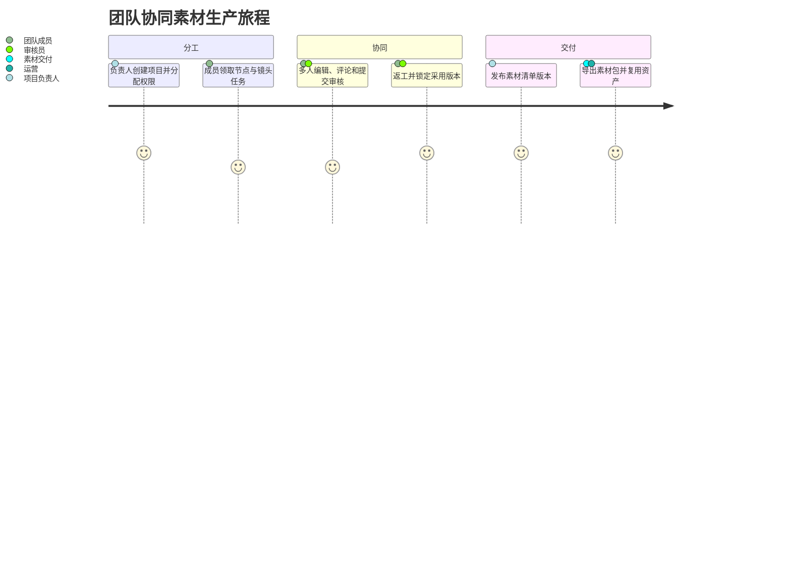
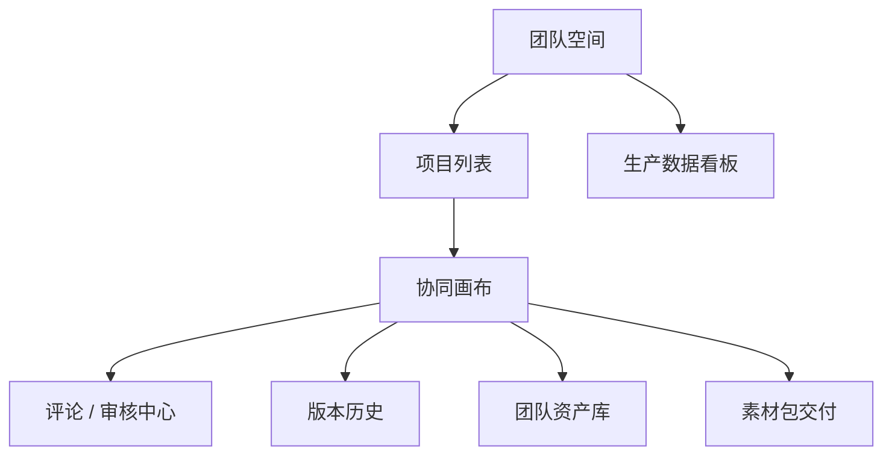
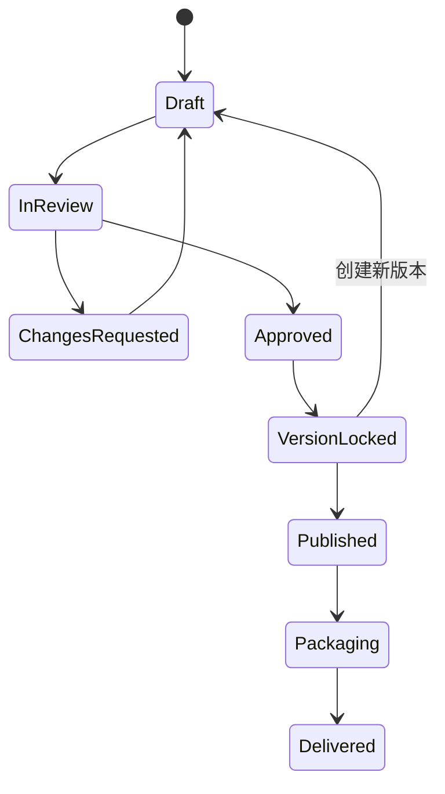

# 漫剧自由画布三期协同智能 PRD

> **[superpowers 更新 V1.8]（2026-07-05）**：
> - **Canvas 生产内核重构**：节点类型从 11 种收敛为 6 种标准类型（text/image/video/audio/script/director）。本文档中涉及 11 种节点类型的描述以 6 种标准类型为准。角色/场景/道具不再作为节点类型。详见 `docs/superpowers/specs/2026-07-05-canvas-production-kernel-completion-design.md`
> - **交付模型更新**：素材包交付已升级为 DeliveryManifest + ZIP/EDL/FCPXML。详见 completion-design Section 6
>
> **[superpowers 更新 V1.7]（2026-07-04）**：
> - **浮动编辑器改造**：画布交互模型已升级——右侧属性面板和底部生成栏已由浮动编辑器替代。本文档中涉及"右侧属性面板"、"底部生成栏"、"属性抽屉"的交互描述标注为 `[已废弃-superpowers V1.6]`。新交互模型详见 `docs/superpowers/specs/2026-06-28-canvas-node-floating-editor-design.md`
> - **Agent 会话统一**：各节点独立 Agent 面板（如"文本节点 Agent"、"分镜 Agent panel"）已由统一 AgentSessionService facade 替代。Agent 交互通过 `/api/v1/agent/sessions` 统一入口。详见 `docs/superpowers/specs/2026-07-02-agent-session-completion-design.md`
> - **分镜系统统一**：旧双轨分镜（`storyboard_shots` + `cp_storyboard_*`）已由统一专业分镜编辑器替代（13 维镜头字段 + A/B/C 层级版本 + XLSX 导入导出）。详见 `docs/superpowers/specs/2026-06-30-storyboard-professional-editor-redesign.md`
> - **API 前缀统一**：所有 API 端点统一使用 `/api/v1/` 前缀。文档中旧 `/api/` 前缀的引用以新前缀为准。
> - **Workspace 隔离**：所有私有资源需 `X-Workspace-Id` header。详见 `docs/superpowers/specs/2026-06-28-unified-account-model-billing-design.md`

## 1. 文档信息

| 项目 | 内容 |
| --- | --- |
| 产品名称 | 漫剧自由画布 |
| 阶段 | 三期协同智能 |
| 文档类型 | PRD |
| 目标版本 | V3.0 |
| 最后修订 | 2026-07-02（基于 superpowers 更新） |

> **[superpowers 更新] V3.0 关键变更**：
> - Agent 审计追踪：引用 Agent 会话系统的完整审计模型（`agent_plans`、`agent_plan_steps`、信用预留/结算），详见 `agent-session-completion-design.md`
> - 协作架构：反映 3001 工作区权限模型（通过 `WorkspaceContextFilter`），详见 `unified-account-model-billing-design.md`
> - 工作流模板：兼容创作圣经的上下文快照注入，详见 `script-creation-creative-bible-design.md`
| 核心目标 | 在专业创作能力基础上，增加多人协同、版本管理、智能工作流、资产智能检索、权限与商业化能力 |

## 2. 三期定位

三期从“个人专业工具”升级为“团队级 AI 漫剧生产平台”。

一期解决素材生产闭环，二期补齐专业生成控制与质量能力，三期重点面向团队协作、规模化生产、项目管理、资产沉淀和智能自动化。

三期需要让编剧、分镜师、美术、视频生成、素材交付、运营、审核、项目负责人可以围绕同一个画布协作，并让系统能够基于已有资产和工作流自动推荐、自动补全、自动执行部分生产任务。视频剪辑与合成继续由外部后期工具处理。

## 3. 三期目标

1. 支持多人实时协同编辑画布。
2. 支持项目权限、角色分工、分享、评论和审核。
3. 支持画布版本管理、历史回滚、版本对比。
4. 支持智能工作流自动规划和批量执行。
5. 支持资产智能检索、相似资产推荐、跨项目复用。
6. 支持团队资产库、项目资产库、个人资产库。
7. 支持模型能力统一调度、成本估算、积分消耗记录。
8. 支持生产数据看板，帮助团队评估效率、成本和质量。

### 3.1 总流程图


### 3.2 用户旅程图



### 3.3 页面跳转图



### 3.4 状态流转图



## 4. 团队与权限 `[superpowers 更新 V1.7：协作权限由 3001 Workspace 成员资格+8080 项目 RBAC 共同决定。详见 docs/superpowers/specs/2026-06-28-unified-account-model-billing-design.md]`

### 4.1 团队空间

功能说明：支持创建团队空间，团队内统一管理项目、资产、成员和权限。

功能要求：

| 功能 | 说明 |
| --- | --- |
| 创建团队 | 用户可创建团队空间 |
| 邀请成员 | 通过链接、手机号、邮箱或账号邀请 |
| 成员列表 | 查看团队成员 |
| 移除成员 | 管理员可移除成员 |
| 团队资产库 | 团队共享资产统一管理 |
| 团队项目 | 团队内项目统一展示 |
| 团队设置 | 修改名称、头像、介绍 |

### 4.2 成员角色

默认角色：

| 角色 | 权限说明 |
| --- | --- |
| 所有者 | 拥有团队全部权限，可转让团队 |
| 管理员 | 管理成员、项目、资产和权限 |
| 项目负责人 | 管理指定项目和项目成员 |
| 创作者 | 创建和编辑画布内容 |
| 审核员 | 查看内容、评论、审核发布 |
| 访客 | 只读查看 |

### 4.3 项目权限

权限粒度：

| 权限 | 说明 |
| --- | --- |
| 查看 | 可查看项目和画布 |
| 评论 | 可添加评论和批注 |
| 编辑 | 可编辑节点、脚本、资产 |
| 生成 | 可调用 AI 模型生成内容 |
| 管理 | 可修改项目设置和成员 |
| 删除 | 可删除项目或关键资产 |
| 发布 | 可发布审核通过的素材版本或导出素材包 |

### 4.4 分享与发布

功能要求：

| 功能 | 说明 |
| --- | --- |
| 私密分享 | 仅指定成员可访问 |
| 链接分享 | 生成访问链接 |
| 权限设置 | 链接可设置只读、评论、编辑 |
| 有效期 | 分享链接可设置过期时间 |
| 密码访问 | 可选访问密码 |
| 发布审核 | 发布前进入审核流程 |
| 发布记录 | 记录发布时间、发布人、版本 |

## 5. 多人实时协同

### 5.1 实时编辑

功能说明：多个用户可同时进入同一画布并实时编辑。

技术建议：

| 模块 | 推荐方案 |
| --- | --- |
| 协同协议 | Yjs / Automerge |
| 通信 | WebSocket |
| 冲突处理 | CRDT |
| 在线状态 | Presence |
| 光标同步 | Awareness |

功能要求：

| 功能 | 说明 |
| --- | --- |
| 多人进入 | 多个成员可同时打开同一项目 |
| 在线头像 | 显示当前在线成员 |
| 光标位置 | 显示其他成员光标 |
| 选中状态 | 显示其他成员选中的节点 |
| 实时节点变更 | 节点创建、移动、删除实时同步 |
| 实时连线变更 | 连线创建、删除实时同步 |
| 脚本表协同 | 多人编辑不同 shot 字段 |
| 资产变更同步 | 资产创建、引用、删除实时同步 |

### 5.2 编辑冲突处理

规则：

| 场景 | 处理方式 |
| --- | --- |
| 同时移动同一节点 | 最后写入或 CRDT 合并，以服务端顺序为准 |
| 同时编辑同一文本 | 使用协同文本模型合并 |
| 同时删除和编辑节点 | 删除优先，编辑进入操作历史 |
| 同时编辑同一 shot 字段 | 字段级协同，冲突时保留操作历史 |
| 同时生成同一节点 | 锁定生成按钮，避免重复提交 |

### 5.3 节点锁定

功能要求：

| 功能 | 说明 |
| --- | --- |
| 手动锁定 | 用户可锁定节点防止他人修改 |
| 自动锁定 | 生成中节点自动锁定关键参数 |
| 锁定提示 | 其他用户看到锁定人和锁定原因 |
| 解锁 | 锁定人或管理员可解锁 |

## 6. 评论、批注与审核

### 6.1 画布评论

功能要求：

| 功能 | 说明 |
| --- | --- |
| 节点评论 | 对单个节点添加评论 |
| 区域评论 | 对画布区域添加评论 |
| shot 评论 | 对脚本表某一行添加评论 |
| @成员 | 评论中提醒成员 |
| 回复评论 | 支持评论线程 |
| 解决评论 | 标记评论已解决 |
| 评论筛选 | 按未解决、我的、全部筛选 |

### 6.2 审核流程

审核对象：

| 对象 | 说明 |
| --- | --- |
| 分镜脚本 | shot 内容、角色、场景、提示词 |
| 分镜图 | 图片生成结果 |
| 视频片段 | 单条视频结果 |
| 项目素材包 | 镜头采用版本及配套图片、视频、音频、字幕清单 |
| 资产 | 角色、场景、道具、主体、音色 |

审核状态：

| 状态 | 说明 |
| --- | --- |
| 待提交 | 尚未提交审核 |
| 待审核 | 已提交，等待审核 |
| 通过 | 审核通过 |
| 驳回 | 审核不通过，需修改 |
| 已修改 | 驳回后完成修改 |
| 已发布 | 已用于正式发布或导出 |

### 6.3 审核记录

功能要求：

| 功能 | 说明 |
| --- | --- |
| 审核人 | 记录审核操作人 |
| 审核时间 | 记录审核时间 |
| 审核意见 | 支持填写通过或驳回意见 |
| 关联版本 | 审核记录绑定项目版本 |
| 操作日志 | 记录状态流转 |

## 7. 版本管理 `[superpowers 更新 V1.7：画布版本采用不可变快照机制。上游变更生成 diff，用户主动选择是否创建新快照，绝不自动覆盖]`

### 7.1 自动版本

功能说明：系统按关键操作生成自动版本。

触发条件：

| 条件 | 说明 |
| --- | --- |
| 首次创建 | 项目初始化版本 |
| 脚本生成完成 | 生成脚本版本 |
| 批量分镜图完成 | 生成分镜图版本 |
| 批量视频完成 | 生成视频片段版本 |
| 素材清单锁定 | 生成项目交付版本 |
| 发布前 | 生成发布候选版本 |

### 7.2 手动版本

功能要求：

| 功能 | 说明 |
| --- | --- |
| 创建版本 | 用户手动保存当前画布为版本 |
| 版本命名 | 填写版本名称 |
| 版本说明 | 填写修改说明 |
| 版本标签 | 支持草稿、候选、审核、发布等标签 |
| 版本列表 | 查看所有版本 |

### 7.3 版本回滚

功能要求：

| 功能 | 说明 |
| --- | --- |
| 预览版本 | 回滚前预览版本内容 |
| 回滚确认 | 二次确认 |
| 创建回滚版本 | 回滚不会覆盖历史，而是创建新版本 |
| 回滚范围 | 支持全项目回滚，后续可支持局部节点回滚 |

### 7.4 版本对比

对比维度：

| 维度 | 说明 |
| --- | --- |
| 节点变化 | 新增、删除、移动、修改 |
| 连线变化 | 新增、删除 |
| 脚本变化 | shot 新增、删除、字段修改 |
| 资产变化 | 资产新增、删除、替换 |
| 生成结果变化 | 图片、视频、音频结果变化 |

## 8. 智能工作流 `[superpowers 更新 V1.7：工作流模板兼容创作圣经上下文快照注入（generation_context_snapshots）]`

### 8.1 工作流模板库

功能说明：沉淀常用漫剧生产流程。

模板类型：

| 模板 | 说明 |
| --- | --- |
| 剧本到分镜图 | 剧本拆解后批量生成分镜图 |
| 分镜图到视频 | 分镜图批量生成视频片段 |
| 角色设定生成 | 角色文本生成三视图和资产卡 |
| 场景设定生成 | 场景描述生成全景和多角度图 |
| 短剧单集生产 | 剧本、角色、场景、分镜图、视频一体流程 |
| 参考视频复刻 | 解析参考视频后生成新分镜和运镜提示 |

功能要求：

| 功能 | 说明 |
| --- | --- |
| 模板浏览 | 查看官方和团队模板 |
| 模板搜索 | 按关键词搜索 |
| 模板预览 | 查看模板节点结构 |
| 发送到画布 | 将模板生成到当前画布 |
| 保存为模板 | 将当前工作流保存为模板 |
| 模板权限 | 支持个人、团队、公开范围 |

### 8.2 智能工作流规划

功能说明：用户输入目标，系统自动推荐节点和流程。

示例：

```text
用户输入：我要把这个 3 分钟剧本做成 20 个漫剧分镜，并生成视频片段。

系统规划：
1. 创建脚本节点
2. 拆解为 20 个 shot
3. 提取角色、场景、道具
4. 创建资产卡
5. 批量创建图片生成器组
6. 批量创建视频生成器组
7. 质检并设置各镜头采用版本
8. 生成项目素材清单
```

功能要求：

| 功能 | 说明 |
| --- | --- |
| 目标输入 | 用户用自然语言描述目标 |
| 流程规划 | 系统生成推荐工作流 |
| 参数预填 | 自动预填模型、比例、数量、提示词 |
| 用户确认 | 用户确认后创建节点 |
| 局部修改 | 用户可修改任一步骤 |
| 执行计划 | 展示执行顺序和预计消耗 |

### 8.3 工作流批量执行

功能要求：

| 功能 | 说明 |
| --- | --- |
| 拓扑排序 | 根据节点依赖关系确定执行顺序 |
| 并发控制 | 同层节点可并行执行 |
| 失败策略 | 支持失败停止、跳过失败、失败重试 |
| 进度展示 | 展示整体进度和节点进度 |
| 成本预估 | 执行前预估积分或费用 |
| 中止执行 | 用户可中止整个工作流 |
| 执行报告 | 执行后生成成功、失败、耗时、消耗统计 |

## 9. 资产智能检索与推荐 `[superpowers 更新 V1.7：资产搜索统一使用 workspace_assets 模型，详见 docs/superpowers/specs/2026-07-04-asset-generation-history-workbench-design.md]`

### 9.1 资产库分层

资产库类型：

| 类型 | 说明 |
| --- | --- |
| 个人资产库 | 用户个人创建和收藏的资产 |
| 项目资产库 | 当前项目使用的资产 |
| 团队资产库 | 团队共享资产 |
| 历史生成库 | AI 生成的历史图片、视频、音频 |

### 9.2 智能检索

技术建议：

| 能力 | 推荐方案 |
| --- | --- |
| 文本检索 | PostgreSQL full text / Elasticsearch |
| 向量检索 | pgvector / Milvus |
| 图像理解 | 多模态模型生成标签和描述 |
| 相似图片 | 图像 embedding |
| 相似视频 | 关键帧 embedding + 文本摘要 |

功能要求：

| 功能 | 说明 |
| --- | --- |
| 关键词搜索 | 按名称、标签、描述搜索 |
| 语义搜索 | 输入自然语言搜索资产 |
| 以图搜图 | 上传或选择图片查找相似资产 |
| 角色搜索 | 按角色名、特征、服装、身份搜索 |
| 场景搜索 | 按场景类型、氛围、时代、地点搜索 |
| 道具搜索 | 按名称和用途搜索 |
| 筛选排序 | 按类型、项目、创建时间、使用频次筛选 |

### 9.3 智能推荐

推荐场景：

| 场景 | 推荐内容 |
| --- | --- |
| 编辑 shot | 推荐相关角色、场景、道具 |
| 生成分镜图 | 推荐风格参考和构图参考 |
| 视频生成 | 推荐主体、运镜、音效 |
| 素材交付 | 推荐缺失的 BGM、配音、音效与字幕素材 |
| 创建新项目 | 推荐相似项目模板和工作流 |

## 10. 模型调度与成本管理

### 10.1 模型能力中心

功能要求：

| 功能 | 说明 |
| --- | --- |
| 模型列表 | 展示文本、图像、视频、音频模型 |
| 能力标签 | 标记文生图、图生图、首尾帧、音画同步等 |
| 成本信息 | 展示单次生成积分或费用 |
| 速度信息 | 展示预计耗时 |
| 推荐模型 | 根据任务自动推荐模型 |
| 模型切换 | 生成器支持切换模型 |

### 10.2 成本预估

功能要求：

| 功能 | 说明 |
| --- | --- |
| 单任务预估 | 生成前展示预计消耗 |
| 批量任务预估 | 批量生成前展示总消耗 |
| 工作流预估 | 执行前展示整体消耗 |
| 余额校验 | 余额不足时提示充值或减少任务 |
| 成本拆分 | 展示图片、视频、音频各自消耗 |

### 10.3 消耗记录

功能要求：

| 功能 | 说明 |
| --- | --- |
| 消耗明细 | 记录每次模型调用消耗 |
| 项目维度 | 按项目统计消耗 |
| 成员维度 | 团队中按成员统计消耗 |
| 模型维度 | 按模型统计消耗 |
| 导出记录 | 支持导出消耗明细 |

### 10.4 节点 Agent 成本归因与审计 `[superpowers 更新 V1.7：Agent 审计追踪统一引用 Agent 会话系统（agent_execution_snapshots）。详见 docs/superpowers/specs/2026-07-02-agent-session-completion-design.md]`

三期需要把节点级 Agent 纳入团队成本、权限和审计体系。文本节点 Agent、图片节点 Agent、视频节点 Agent、音频节点 Agent 等所有自然语言辅助修改能力，都必须记录节点上下文和模型消耗，便于项目负责人核算成本、复盘质量和追踪责任。

功能要求：

| 功能 | 说明 |
| --- | --- |
| 节点归因 | 每次 Agent 调用必须记录 `project_id`、`node_id`、`node_type`、`agent_type` |
| 成员归因 | 记录发起用户、团队、项目角色和操作时间 |
| 模型归因 | 记录 `model_id`、供应商、输入 Token、输出 Token、实际积分消耗 |
| 操作前后对比 | 保存 Agent 修改前内容、修改后内容和用户确认动作 |
| 权限校验 | 用户必须具备项目编辑权限和生成权限，才能调用会产生费用的 Agent |
| 团队账单 | 团队看板可按节点类型、Agent 类型、模型、成员维度统计消耗 |
| 审计追踪 | 审核员可查看 Agent 对节点内容的修改记录，但不能看到用户无权访问的项目数据 |

节点 Agent 审计字段：

| 字段 | 说明 |
| --- | --- |
| `agent_execution_id` | Agent 执行记录 ID |
| `project_id` | 所属项目 |
| `node_id` | 被修改或执行的节点 |
| `node_type` | text / image / video / audio / director 等 |
| `agent_type` | text_agent / image_agent / video_agent / audio_agent / director_agent |
| `model_id` | 实际调用模型 |
| `instruction` | 用户自然语言指令摘要 |
| `before_snapshot` | 修改前节点关键数据 |
| `after_snapshot` | 修改后节点关键数据 |
| `token_usage` | 输入、输出和总 Token |
| `credit_cost` | 实际扣除积分 |
| `confirmed_by_user` | 是否经用户确认应用 |
| `created_at` | 执行时间 |

## 11. 数据看板

### 11.1 项目看板

指标：

| 指标 | 说明 |
| --- | --- |
| 剧本数量 | 项目内脚本数量 |
| shot 数量 | 分镜数量 |
| 图片生成数 | 生成图片数量 |
| 视频生成数 | 生成视频数量 |
| 音频生成数 | 生成音频数量 |
| 素材包数量 | 已完成的项目素材包数量 |
| 任务成功率 | 生成任务成功比例 |
| 平均耗时 | 各类任务平均耗时 |
| 总消耗 | 项目累计积分或费用 |

### 11.2 团队看板

指标：

| 指标 | 说明 |
| --- | --- |
| 活跃项目 | 当前活跃项目数 |
| 活跃成员 | 近期有操作的成员 |
| 资产增长 | 新增资产数量 |
| 生成任务量 | 团队生成任务总量 |
| 成本排行 | 按项目或成员统计消耗 |
| 审核效率 | 平均审核时长和通过率 |

## 12. 操作日志与审计

日志记录范围：

| 类型 | 说明 |
| --- | --- |
| 项目操作 | 创建、重命名、删除、分享 |
| 画布操作 | 节点创建、删除、移动、连线 |
| 资产操作 | 创建、删除、修改、引用 |
| 生成操作 | 模型、参数、结果、消耗 |
| 协同操作 | 成员进入、编辑、锁定 |
| 权限操作 | 成员邀请、权限修改 |
| 审核操作 | 提交、通过、驳回、发布 |

## 13. 技术架构增强

### 13.1 协同架构

```text
Client A
  ↕ WebSocket
Collaboration Gateway
  ↕ CRDT Update
Collaboration Service
  ↕
Redis Pub/Sub + PostgreSQL Snapshot
  ↕
Client B / Client C
```

要求：

| 能力 | 说明 |
| --- | --- |
| 增量同步 | 只同步操作增量 |
| 快照保存 | 定期保存画布快照 |
| 离线恢复 | 用户断线后重新同步 |
| 冲突合并 | 使用 CRDT 或操作队列处理冲突 |
| 访问控制 | 同步前校验项目权限 |

### 13.2 智能工作流架构

```text
用户目标
→ 任务理解
→ 工作流规划
→ 节点图生成
→ 参数填充
→ 用户确认
→ 任务队列
→ 模型调度
→ 结果回写画布
```

### 13.3 资产智能检索架构

```text
资产上传/生成
→ 多模态解析
→ 生成标签、描述、embedding
→ 写入资产库
→ 写入向量库
→ 用户搜索/推荐
→ 返回相关资产
```

## 14. 非功能需求

### 14.1 性能

| 指标 | 要求 |
| --- | --- |
| 协同延迟 | 普通操作 500ms 内同步到其他在线用户 |
| 项目规模 | 支持 2000 个节点级别项目可打开 |
| 搜索响应 | 资产搜索 1 秒内返回首屏 |
| 版本加载 | 历史版本预览 3 秒内打开 |
| 看板统计 | 普通项目看板 5 秒内加载 |

### 14.2 稳定性

| 项目 | 要求 |
| --- | --- |
| 协同断线重连 | 断线后自动重连并同步差异 |
| 版本安全 | 回滚不覆盖历史版本 |
| 任务恢复 | 工作流中断后可继续执行 |
| 审计完整 | 关键操作必须记录日志 |

### 14.3 安全

| 项目 | 要求 |
| --- | --- |
| 权限校验 | 所有项目和资产接口校验权限 |
| 分享安全 | 分享链接支持有效期和密码 |
| 敏感操作 | 删除、发布、权限修改需二次确认 |
| 数据隔离 | 团队、项目、个人资产隔离 |
| 审计追踪 | 可追踪关键内容来源和修改人 |

## 15. 三期验收标准

1. 多名用户能同时进入同一画布并实时看到彼此操作。
2. 用户能对节点、区域、shot 添加评论并 @ 成员。
3. 项目支持角色权限控制，访客无法编辑。
4. 用户能创建手动版本，并从历史版本回滚。
5. 系统能对两个版本进行基础差异对比。
6. 用户能从工作流模板库发送模板到画布。
7. 用户输入自然语言目标后，系统能推荐工作流结构。
8. 工作流支持批量执行、失败重试、成本预估和执行报告。
9. 资产支持语义搜索和相似资产推荐。
10. 团队看板能展示项目、成员、消耗、任务数据。
11. 模型调用能展示成本预估和消耗明细。
12. 关键操作可在操作日志中追踪。

## 16. 三期后续可扩展方向

1. 移动端轻量查看和审核。
2. 插件市场，允许第三方接入模型和工作流。
3. 模板市场，允许创作者出售工作流模板、风格模板、角色资产。
4. 自动分镜导演 Agent，根据剧本自动提出镜头语言优化建议。
5. 自动质检 Agent，检查角色一致性、画面连续性、提示词冲突。
6. 多语言配音和字幕自动生成。
7. 对接发行、投流、数据反馈闭环。

## 17. 开发级详细需求补充

三期面向团队级生产平台，需要让开发明确权限、协同、审核、版本、智能工作流、资产检索、成本统计等业务流转。本章节作为三期详细开发依据。

### 17.1 团队空间详细交互

#### 17.1.1 团队列表页

筛选区：

| 字段/按钮 | 类型 | 数据来源 | 交互说明 |
| --- | --- | --- | --- |
| 团队名称 | 输入框 | 用户输入 | 支持模糊查询 |
| 我的角色 | 单选框 | 平台内置清单：全部、所有者、管理员、项目负责人、创作者、审核员、访客 | 单一选项 |
| 查询 | 按钮 | 无 | 根据团队名称、我的角色查询 |
| 重置 | 按钮 | 无 | 清空筛选条件 |
| 创建团队 | 主按钮 | 无 | 点击后打开创建团队弹窗 |

创建团队弹窗：

| 字段/按钮 | 类型 | 交互说明 |
| --- | --- | --- |
| 团队名称 | 输入框 | 必填，1-50 字 |
| 团队头像 | 图片上传 | 可选 |
| 团队介绍 | 多行文本框 | 可选 |
| 确认创建 | 按钮 | 创建团队，并将当前用户设为所有者 |
| 取消 | 按钮 | 关闭弹窗 |

#### 17.1.2 成员管理

成员筛选：

| 字段/按钮 | 类型 | 数据来源 | 交互说明 |
| --- | --- | --- | --- |
| 成员名称 | 输入框 | 用户输入 | 支持昵称、账号模糊查询 |
| 成员角色 | 单选框 | 团队角色清单 | 单一选项 |
| 成员状态 | 单选框 | 正常、待加入、已移除 | 单一选项 |
| 查询 | 按钮 | 无 | 查询成员列表 |
| 重置 | 按钮 | 无 | 恢复默认状态 |
| 邀请成员 | 按钮 | 无 | 打开邀请弹窗 |

邀请成员弹窗：

| 字段/按钮 | 类型 | 数据来源 | 交互说明 |
| --- | --- | --- | --- |
| 邀请方式 | 单选框 | 链接邀请、账号邀请、手机号邀请、邮箱邀请 | 单一选项 |
| 邀请账号 | 输入框 | 用户输入 | 账号/手机号/邮箱邀请时必填 |
| 默认角色 | 单选框 | 创作者、审核员、访客 | 单一选项，默认创作者 |
| 有效期 | 单选框 | 1 天、7 天、30 天、永久 | 链接邀请时展示 |
| 生成链接 | 按钮 | 无 | 生成邀请链接 |
| 发送邀请 | 按钮 | 无 | 账号类邀请时发送邀请 |

成员列表操作：

| 操作 | 权限要求 | 交互说明 |
| --- | --- | --- |
| 修改角色 | 所有者/管理员 | 不能将自己降级为无管理员状态 |
| 移除成员 | 所有者/管理员 | 二次确认后移除 |
| 查看项目 | 项目负责人及以上 | 查看该成员参与项目 |

### 17.2 项目权限详细规则

权限矩阵：

| 操作 | 所有者 | 管理员 | 项目负责人 | 创作者 | 审核员 | 访客 |
| --- | --- | --- | --- | --- | --- | --- |
| 查看项目 | 是 | 是 | 是 | 是 | 是 | 是 |
| 编辑画布 | 是 | 是 | 是 | 是 | 否 | 否 |
| 调用生成 | 是 | 是 | 是 | 是 | 否 | 否 |
| 添加评论 | 是 | 是 | 是 | 是 | 是 | 可配置 |
| 提交审核 | 是 | 是 | 是 | 是 | 否 | 否 |
| 审核内容 | 是 | 是 | 可配置 | 否 | 是 | 否 |
| 管理成员 | 是 | 是 | 可管理本项目 | 否 | 否 | 否 |
| 删除项目 | 是 | 可配置 | 否 | 否 | 否 | 否 |
| 发布素材版本 | 是 | 是 | 是 | 否 | 可配置 | 否 |

权限不足交互：

1. 用户无查看权限时，进入项目页展示“无访问权限”。
2. 用户无编辑权限时，画布进入只读模式，隐藏或置灰编辑按钮。
3. 用户无生成权限时，生成按钮置灰，悬浮提示“无生成权限”。
4. 用户无删除权限时，不展示删除入口。

### 17.3 多人协同详细业务流

#### 17.3.1 进入协同画布

```text
用户打开项目
→ 前端请求项目权限
→ 权限通过后加载画布快照
→ 建立 WebSocket 连接
→ 加入项目协同房间
→ 拉取当前在线成员
→ 开始同步本地操作和远端操作
```

#### 17.3.2 协同事件类型

| 事件 | 说明 |
| --- | --- |
| member_join | 成员进入画布 |
| member_leave | 成员离开画布 |
| cursor_move | 光标移动 |
| viewport_change | 视口变化，可选同步 |
| node_create | 创建节点 |
| node_update | 更新节点位置、尺寸、内容 |
| node_delete | 删除节点 |
| edge_create | 创建连线 |
| edge_delete | 删除连线 |
| shot_update | 更新脚本 shot 字段 |
| asset_update | 更新资产 |
| comment_create | 创建评论 |
| lock_create | 创建锁定 |
| lock_release | 释放锁定 |

#### 17.3.3 在线成员展示

| 控件 | 交互说明 |
| --- | --- |
| 在线头像 | 顶部栏展示当前在线成员头像 |
| 成员颜色 | 每个成员分配唯一协同颜色 |
| 光标标签 | 画布中显示成员名称和光标位置 |
| 节点选中框 | 他人选中节点时，用成员颜色描边 |
| 正在编辑提示 | 脚本表字段被他人编辑时展示成员名称 |

#### 17.3.4 节点锁定

锁定触发：

| 触发方式 | 说明 |
| --- | --- |
| 手动锁定 | 用户右键节点选择锁定 |
| 生成中锁定 | 节点提交生成任务后自动锁定关键参数 |
| 审核中锁定 | 提交审核的内容自动锁定 |

锁定交互：

| 操作 | 交互说明 |
| --- | --- |
| 锁定节点 | 节点展示锁图标和锁定人 |
| 尝试编辑 | 无权限编辑时提示“该节点已被某某锁定” |
| 解除锁定 | 锁定人、项目负责人、管理员可解锁 |
| 自动释放 | 用户离线超过配置时间后，可由系统释放手动锁 |

### 17.4 评论与批注详细交互

评论入口：

| 入口 | 交互说明 |
| --- | --- |
| 节点右键“添加评论” | 对当前节点添加评论 |
| 画布框选区域后“添加批注” | 对区域添加批注 |
| shot 行评论图标 | 对脚本某一行添加评论 |
| 视频时间轴评论 | 对某一时间点添加评论 |

评论字段：

| 字段/按钮 | 类型 | 交互说明 |
| --- | --- | --- |
| 评论内容 | 多行文本框 | 必填，支持 @ 成员 |
| 附件 | 文件上传 | 可选，支持图片 |
| 提交 | 按钮 | 创建评论 |
| 取消 | 按钮 | 关闭输入框 |

评论列表筛选：

| 字段/按钮 | 类型 | 数据来源 | 交互说明 |
| --- | --- | --- | --- |
| 评论状态 | 单选框 | 全部、未解决、已解决 | 单一选项 |
| 评论范围 | 单选框 | 全部、我的、@我的 | 单一选项 |
| 评论对象 | 单选框 | 节点、区域、shot、视频时间点 | 单一选项 |
| 查询 | 按钮 | 无 | 查询评论 |
| 重置 | 按钮 | 无 | 恢复默认状态 |

评论操作：

| 操作 | 交互说明 |
| --- | --- |
| 回复 | 在评论线程中追加回复 |
| 解决 | 将评论状态改为已解决 |
| 重新打开 | 已解决评论可重新打开 |
| 定位 | 点击后画布定位到评论对象 |
| 删除 | 仅评论创建人或管理员可删除 |

### 17.5 审核流程详细业务流

#### 17.5.1 提交审核

```text
创作者选择审核对象
→ 点击“提交审核”
→ 填写审核说明
→ 选择审核人或审核组
→ 系统创建审核单
→ 审核对象进入“待审核”状态
→ 相关内容锁定
→ 通知审核人
```

提交审核弹窗：

| 字段/按钮 | 类型 | 数据来源 | 交互说明 |
| --- | --- | --- | --- |
| 审核对象 | 只读 | 当前选中内容 | 展示对象类型和名称 |
| 审核类型 | 单选框 | 脚本审核、分镜图审核、视频片段审核、素材包审核、资产审核 | 单一选项 |
| 审核说明 | 多行文本框 | 用户输入 | 可选 |
| 审核人 | 单选/多选 | 项目成员中具备审核权限的成员 | 根据流程配置决定单选或多选 |
| 提交 | 按钮 | 无 | 创建审核单 |
| 取消 | 按钮 | 无 | 关闭弹窗 |

#### 17.5.2 审核处理

审核处理字段：

| 字段/按钮 | 类型 | 交互说明 |
| --- | --- | --- |
| 审核结论 | 单选框 | 通过、驳回 |
| 审核意见 | 多行文本框 | 驳回时必填 |
| 通过 | 按钮 | 审核通过，对象解锁或进入下一状态 |
| 驳回 | 按钮 | 审核驳回，通知提交人 |

审核状态流：

```text
待提交
→ 待审核
→ 通过
→ 已发布

待审核
→ 驳回
→ 已修改
→ 待审核
```

### 17.6 版本管理详细交互

#### 17.6.1 版本列表

筛选区：

| 字段/按钮 | 类型 | 数据来源 | 交互说明 |
| --- | --- | --- | --- |
| 版本名称 | 输入框 | 用户输入 | 模糊查询 |
| 版本类型 | 单选框 | 自动版本、手动版本、发布版本 | 单一选项 |
| 创建人 | 单选框 | 项目成员列表 | 单一选项 |
| 创建时间 | 日期范围 | 用户选择 | 可选 |
| 查询 | 按钮 | 无 | 查询版本列表 |
| 重置 | 按钮 | 无 | 清空筛选 |
| 创建版本 | 按钮 | 无 | 手动保存当前画布版本 |

版本卡片字段：

| 字段/按钮 | 说明 |
| --- | --- |
| 版本名称 | 自动或手动命名 |
| 版本说明 | 展示手动填写说明 |
| 创建人 | 展示创建人 |
| 创建时间 | 展示时间 |
| 版本标签 | 草稿、候选、审核、发布 |
| 预览 | 打开只读版本画布 |
| 对比 | 选择另一个版本进行对比 |
| 回滚 | 二次确认后回滚为新版本 |

#### 17.6.2 创建版本弹窗

| 字段/按钮 | 类型 | 交互说明 |
| --- | --- | --- |
| 版本名称 | 输入框 | 必填 |
| 版本说明 | 多行文本框 | 可选 |
| 版本标签 | 单选框 | 草稿、候选、审核、发布 |
| 确认保存 | 按钮 | 创建手动版本 |
| 取消 | 按钮 | 关闭弹窗 |

#### 17.6.3 版本对比

对比展示：

| 类型 | 展示方式 |
| --- | --- |
| 新增节点 | 绿色标记 |
| 删除节点 | 红色标记 |
| 修改节点 | 黄色标记 |
| 移动节点 | 展示位置变化 |
| 新增连线 | 绿色连线 |
| 删除连线 | 红色连线 |
| shot 修改 | 字段级差异对比 |
| 资产替换 | 展示替换前后资产 |

### 17.7 智能工作流详细交互

#### 17.7.1 工作流模板库

筛选区：

| 字段/按钮 | 类型 | 数据来源 | 交互说明 |
| --- | --- | --- | --- |
| 模板名称 | 输入框 | 用户输入 | 支持模糊查询 |
| 模板分类 | 单选框 | 剧本到分镜图、分镜图到视频、角色设定、场景设定、短剧单集、参考视频复刻 | 单一选项 |
| 模板来源 | 单选框 | 官方、团队、个人 | 单一选项 |
| 查询 | 按钮 | 无 | 查询模板 |
| 重置 | 按钮 | 无 | 恢复默认状态 |

模板卡片：

| 操作 | 交互说明 |
| --- | --- |
| 预览 | 展示节点结构缩略图 |
| 使用 | 发送到当前画布 |
| 收藏 | 收藏模板 |
| 编辑 | 仅个人或有权限的团队模板可编辑 |
| 删除 | 仅创建人或管理员可删除 |

#### 17.7.2 自然语言规划工作流

规划面板字段：

| 字段/按钮 | 类型 | 交互说明 |
| --- | --- | --- |
| 目标描述 | 多行文本框 | 用户输入目标，例如“把剧本做成 20 个分镜并生成视频” |
| 项目素材范围 | 单选框 | 当前画布、当前项目、团队资产库 |
| 质量优先级 | 单选框 | 速度优先、质量优先、成本优先 |
| 规划 | 按钮 | 调用规划模型生成工作流 |
| 取消 | 按钮 | 关闭面板 |

规划结果展示：

| 区块 | 说明 |
| --- | --- |
| 推荐步骤 | 展示系统规划的步骤列表 |
| 节点预览 | 展示将要创建的节点类型和数量 |
| 参数预填 | 展示模型、比例、数量、提示词等 |
| 预计消耗 | 展示预计积分或费用 |
| 预计耗时 | 展示预计执行时间 |
| 创建到画布 | 用户确认后创建节点和连线 |
| 重新规划 | 修改目标后重新生成方案 |

#### 17.7.3 工作流执行中心

字段和按钮：

| 字段/按钮 | 类型 | 交互说明 |
| --- | --- | --- |
| 执行策略 | 单选框 | 失败停止、跳过失败、自动重试 |
| 并发数量 | 数字输入框 | 控制同时执行任务数 |
| 预计任务数 | 只读 | 系统计算 |
| 预计消耗 | 只读 | 系统计算 |
| 开始执行 | 按钮 | 提交工作流执行 |
| 暂停 | 按钮 | 暂停后续未开始任务 |
| 继续 | 按钮 | 继续执行 |
| 中止 | 按钮 | 停止后续任务 |
| 导出报告 | 按钮 | 执行结束后可导出 |

执行状态：

| 状态 | 说明 |
| --- | --- |
| 未开始 | 尚未执行 |
| 等待上游 | 依赖节点未完成 |
| 排队中 | 已满足依赖，等待队列 |
| 执行中 | 正在执行 |
| 成功 | 已完成 |
| 失败 | 执行失败 |
| 跳过 | 因策略或依赖失败跳过 |

### 17.8 资产智能检索详细交互

资产搜索页筛选：

| 字段/按钮 | 类型 | 数据来源 | 交互说明 |
| --- | --- | --- | --- |
| 搜索词 | 输入框 | 用户输入 | 支持关键词和自然语言 |
| 搜索方式 | 单选框 | 关键词搜索、语义搜索、以图搜图 | 单一选项 |
| 资产类型 | 单选框 | 角色、场景、道具、风格、图片、视频、音频、主体 | 单一选项 |
| 资产库范围 | 单选框 | 个人资产库、项目资产库、团队资产库、全部 | 单一选项 |
| 标签 | 多选框 | 资产标签库 | 支持多选 |
| 创建时间 | 日期范围 | 用户选择 | 可选 |
| 查询 | 按钮 | 无 | 执行搜索 |
| 重置 | 按钮 | 无 | 清空条件 |

以图搜图：

| 字段/按钮 | 类型 | 交互说明 |
| --- | --- | --- |
| 查询图片 | 图片上传/画布选择 | 必填 |
| 相似度阈值 | 滑块 | 默认系统推荐值 |
| 查询 | 按钮 | 搜索相似图片或相关资产 |

推荐入口：

| 场景 | 推荐逻辑 |
| --- | --- |
| 编辑 shot | 根据场景、角色、道具字段推荐资产 |
| 图片生成 | 根据提示词推荐风格、参考图 |
| 视频生成 | 根据主体和动作推荐运镜 |
| 素材交付 | 根据情绪和镜头信息推荐 BGM、配音、音效与字幕素材 |

### 17.9 模型成本与消耗详细交互

#### 17.9.1 模型选择器

| 字段 | 说明 |
| --- | --- |
| 模型名称 | 展示模型名称 |
| 能力标签 | 文生图、图生图、首尾帧、多模态、音画同步等 |
| 预计速度 | 快、中、慢或预计秒数 |
| 单次消耗 | 展示积分或金额 |
| 推荐标识 | 系统推荐模型展示推荐标签 |
| 不可用原因 | 模型不可用时展示维护、余额不足、权限不足等原因 |

#### 17.9.2 成本预估弹窗

| 字段/按钮 | 类型 | 说明 |
| --- | --- | --- |
| 任务类型 | 只读 | 图片、视频、音频、工作流 |
| 任务数量 | 只读 | 系统计算 |
| 模型明细 | 表格 | 展示每个模型调用次数 |
| 预计消耗 | 只读 | 系统计算 |
| 当前余额 | 只读 | 用户或团队余额 |
| 确认生成 | 按钮 | 余额充足时可点击 |
| 去充值 | 按钮 | 余额不足时展示 |

#### 17.9.3 消耗记录

筛选区：

| 字段/按钮 | 类型 | 数据来源 | 交互说明 |
| --- | --- | --- | --- |
| 项目 | 单选框 | 当前用户可访问项目 | 单一选项 |
| 成员 | 单选框 | 团队成员 | 单一选项 |
| 模型类型 | 单选框 | 文本、图像、视频、音频 | 单一选项 |
| 时间范围 | 日期范围 | 用户选择 | 必填默认最近 30 天 |
| 查询 | 按钮 | 无 | 查询消耗 |
| 重置 | 按钮 | 无 | 恢复默认状态 |
| 导出 | 按钮 | 无 | 导出当前筛选结果 |

### 17.10 数据看板详细需求

项目看板筛选：

| 字段/按钮 | 类型 | 数据来源 | 交互说明 |
| --- | --- | --- | --- |
| 项目 | 单选框 | 用户可访问项目 | 单一选项 |
| 时间范围 | 日期范围 | 用户选择 | 默认最近 7 天 |
| 成员 | 单选框 | 项目成员 | 可选 |
| 查询 | 按钮 | 无 | 按条件刷新看板 |
| 重置 | 按钮 | 无 | 恢复默认 |

看板卡片：

| 指标 | 说明 |
| --- | --- |
| shot 数量 | 当前项目累计 shot 数 |
| 图片生成数 | 当前周期图片任务数 |
| 视频生成数 | 当前周期视频任务数 |
| 音频生成数 | 当前周期音频任务数 |
| 任务成功率 | 成功任务 / 总任务 |
| 平均耗时 | 各类任务平均执行时长 |
| 总消耗 | 当前周期积分或费用 |
| 审核通过率 | 通过审核数 / 提交审核数 |

### 17.11 操作日志详细需求

日志筛选：

| 字段/按钮 | 类型 | 数据来源 | 交互说明 |
| --- | --- | --- | --- |
| 操作人 | 单选框 | 项目成员 | 单一选项 |
| 操作类型 | 单选框 | 项目、画布、节点、资产、生成、权限、审核、版本 | 单一选项 |
| 操作时间 | 日期范围 | 用户选择 | 默认最近 7 天 |
| 关键词 | 输入框 | 用户输入 | 支持按对象名称搜索 |
| 查询 | 按钮 | 无 | 查询日志 |
| 重置 | 按钮 | 无 | 清空条件 |

日志字段：

| 字段 | 说明 |
| --- | --- |
| 操作时间 | 记录发生时间 |
| 操作人 | 用户名称和 ID |
| 操作类型 | 节点创建、资产删除、提交审核等 |
| 操作对象 | 对象类型和名称 |
| 操作前 | 关键字段变更前值 |
| 操作后 | 关键字段变更后值 |
| IP/设备 | 安全审计字段 |

### 17.12 三期关键验收用例

| 用例 | 操作 | 预期结果 |
| --- | --- | --- |
| 邀请成员 | 管理员生成邀请链接 | 新成员通过链接加入团队 |
| 权限控制 | 访客进入项目 | 只能查看，无法编辑和生成 |
| 实时协同 | 两个用户同时移动不同节点 | 双方画布实时同步 |
| 节点锁定 | 用户 A 锁定节点，用户 B 编辑 | 用户 B 收到锁定提示 |
| 评论定位 | 对节点添加评论后点击定位 | 画布聚焦到对应节点 |
| 提交审核 | 创作者提交分镜图审核 | 审核人收到待审核记录 |
| 版本回滚 | 选择历史版本回滚 | 系统创建新的回滚版本，不覆盖历史 |
| 智能规划 | 输入自然语言目标 | 系统生成工作流步骤和节点预览 |
| 语义搜索 | 输入“夜晚校园门口女主场景” | 返回相关场景和角色资产 |
| 成本预估 | 批量执行工作流前 | 展示任务数量、模型明细和预计消耗 |
| 操作日志 | 删除资产后查询日志 | 能看到删除人、时间、对象 |
