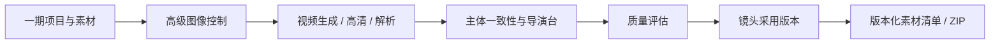
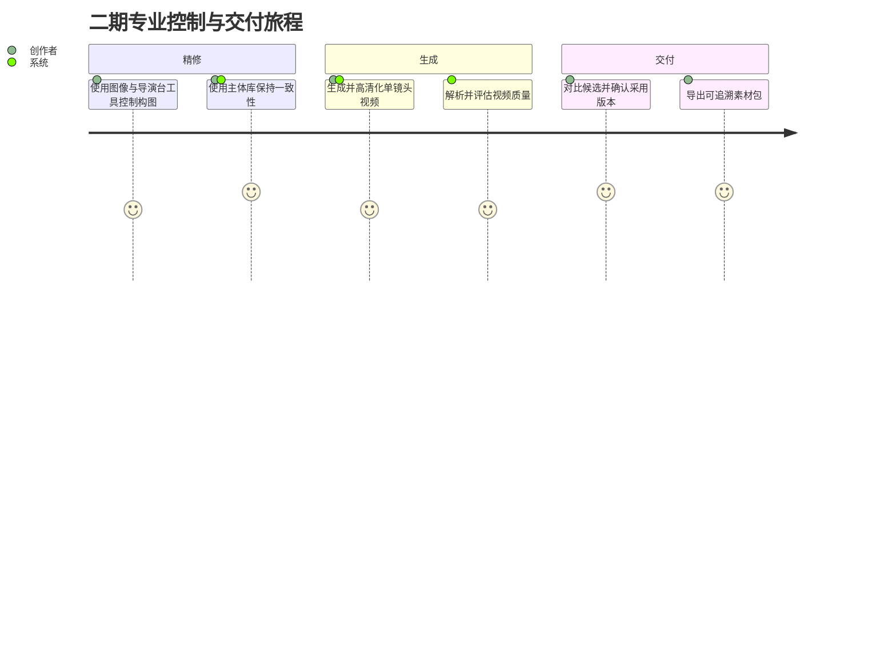
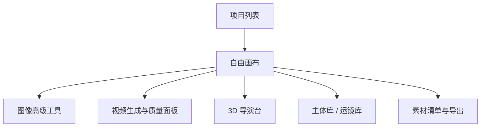
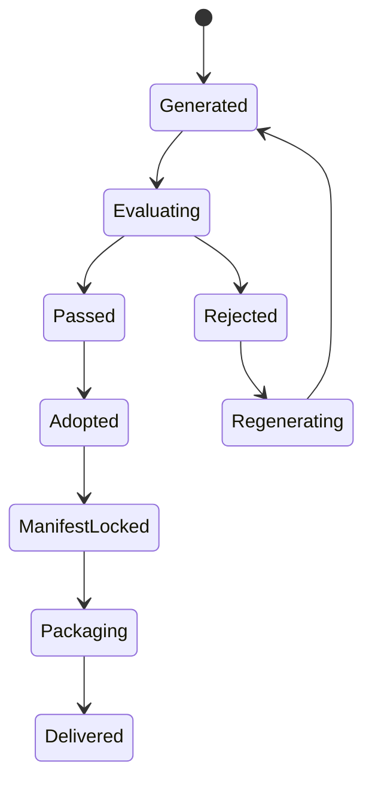

# 漫剧自由画布二期增强 PRD

> **[superpowers 更新 V1.7]（2026-07-04）**：
> - **浮动编辑器改造**：画布交互模型已升级——右侧属性面板和底部生成栏已由浮动编辑器替代。本文档中涉及"右侧属性面板"、"底部生成栏"、"属性抽屉"的交互描述标注为 `[已废弃-superpowers V1.6]`。新交互模型详见 `docs/superpowers/specs/2026-06-28-canvas-node-floating-editor-design.md`
> - **Agent 会话统一**：各节点独立 Agent 面板（如"文本节点 Agent"、"分镜 Agent panel"）已由统一 AgentSessionService facade 替代。Agent 交互通过 `/api/v1/agent/sessions` 统一入口。详见 `docs/superpowers/specs/2026-07-02-agent-session-completion-design.md`
> - **分镜系统统一**：旧双轨分镜（`storyboard_shots` + `cp_storyboard_*`）已由统一专业分镜编辑器替代（13 维镜头字段 + A/B/C 层级版本 + XLSX 导入导出）。详见 `docs/superpowers/specs/2026-06-30-storyboard-professional-editor-redesign.md`
> - **API 前缀统一**：所有 API 端点统一使用 `/api/v1/` 前缀。文档中旧 `/api/` 前缀的引用以新前缀为准。
> - **Workspace 隔离**：所有私有资源需 `X-Workspace-Id` header。详见 `docs/superpowers/specs/2026-06-28-unified-account-model-billing-design.md`

## 1. 文档信息

| 项目 | 内容 |
| --- | --- |
| 产品名称 | 漫剧自由画布 |
| 阶段 | 二期增强 |
| 文档类型 | PRD |
| 目标版本 | V2.0 |
| 最后修订 | 2026-07-02（基于 superpowers 更新） |

> **[superpowers 更新] V2.0 关键变更**：
> - 节点 Agent 扩展：引用 Agent 会话系统统一 facade（`agent-session-completion-design.md`）而非独立 Agent panel
> - 分镜组功能：对齐 A/B/C 三层分镜系统（`storyboard-professional-editor-redesign.md`）
> - 资产市场互通：素材库 ↔ 资产市场的认领资产互通（`ai-asset-market-completion-design.md`）
| 核心目标 | 在一期创作闭环基础上，补齐图像高级工具、视频工具、音频工具、主体库、运镜库和 3D 导演台 |

## 2. 二期定位

二期从“基础可用”升级为“专业可控”。

一期解决剧本到分镜图、单镜头视频和素材包交付的主链路。二期重点提升画面控制、角色一致性、镜头表现、视频质量分析、音频素材处理和构图能力，让漫剧生产从可生成走向可控、可调度、可复用。视频剪辑与合成仍由外部后期工具完成。

## 3. 二期目标

1. 提供完整图像工具链，支持全景、多角度、打光、编辑、标注、分镜组。
2. 提供视频工具链，支持视频高清、解析、音频分离、质量评估、镜头采用版本与素材交付增强。
3. 提供音频工具链，支持音频截取、变速、音色克隆。
4. 提供视频主体库，提高角色、商品、宠物、人物跨次生成一致性。
5. 提供运镜预设和自定义运镜能力。
6. 提供 3D 导演台，用于站位、构图、机位截图。
7. 提升画布性能，将部分连线和小地图改为 Canvas 高性能渲染。

### 3.1 总流程图



### 3.2 用户旅程图



### 3.3 页面跳转图



### 3.4 状态流转图



## 4. 二期功能范围

### 4.1 图像高级工具

二期在图片节点顶部工具栏增加高级图像处理能力。

#### 4.1.1 风格模板

功能说明：提供风格模板库，用户选择风格后，生成作品自动应用该风格。

功能要求：

| 功能 | 说明 |
| --- | --- |
| 风格库入口 | 图片生成器中点击风格图标进入 |
| 分类浏览 | 支持摄影写真、电商营销、动漫游戏、风格插画等分类 |
| 关键词搜索 | 支持按风格名称搜索 |
| 选择风格 | 点击风格后将风格标签加载到生成器 |
| 风格生成 | 结合用户提示词生成对应风格图片 |
| 风格取消 | 支持移除已选择风格 |

#### 4.1.2 自定义风格模板

功能说明：支持用户上传 5-20 张同风格图片，生成或训练个人风格模板。

功能要求：

| 功能 | 说明 |
| --- | --- |
| 上传样本 | 支持上传 5-20 张同风格图片 |
| 样本校验 | 检查图片数量、格式、大小 |
| 风格命名 | 用户填写风格名称 |
| 风格描述 | 用户填写风格说明 |
| 创建模板 | 提交后生成自定义风格模板 |
| 模板调用 | 自定义模板可在风格库中搜索和调用 |
| 模板管理 | 支持查看、删除、重命名 |

#### 4.1.3 焦点编辑

功能说明：从当前画布中的一张或多张图片提取元素，组合到新的生成任务中。

功能要求：

| 功能 | 说明 |
| --- | --- |
| 进入沉浸模式 | 点击焦点编辑后画布进入选择模式 |
| 选择元素 | 点击其他图片中的元素 |
| 自动识别 | 系统识别被点击元素并生成白框 |
| 元素标签 | 识别出的元素名称加载到生成器 |
| 多元素组合 | 支持从多张图提取多个元素 |
| 退出模式 | Esc 退出沉浸模式 |
| 生成图片 | 用户补充提示词后生成 |

#### 4.1.4 镜头聚焦

功能说明：用户在单张图片上框选局部，系统生成该局部的细节特写分镜。

功能要求：

| 功能 | 说明 |
| --- | --- |
| 框选区域 | 在图片上拖拽框选局部 |
| 特写推理 | 系统根据框选区域推理特写意图 |
| 直接生成 | 确认后可直接生成特写 |
| 提示词优化 | 支持输入表情、动作、角度等补充提示 |
| 结果回写 | 生成结果创建为新图片节点 |

#### 4.1.5 摄像机控制

功能说明：生成写实风格图片时，支持控制相机型号、镜头、焦距、光圈。

功能要求：

| 功能 | 说明 |
| --- | --- |
| 开启开关 | 图片生成器中开启摄像机控制 |
| 相机型号 | 支持选择或输入相机型号 |
| 镜头类型 | 支持选择镜头类型 |
| 焦距 | 支持设置焦距 |
| 光圈 | 支持设置光圈 |
| 参数应用 | 点击使用后参数参与生成 |
| 参数展示 | 生成记录中保存摄像机参数 |

#### 4.1.6 全景 720

功能说明：支持文本或参考图生成 720 度全景图，并实时预览、截图。

功能要求：

| 功能 | 说明 |
| --- | --- |
| 文生全景 | 输入场景描述生成全景图 |
| 图生全景 | 上传场景参考图生成全景图 |
| 顶部工具入口 | 图片节点顶部点击全景 |
| 右键预览入口 | 标准全景图右键进入全景预览 |
| 自由旋转 | 进入预览后可拖拽旋转视角 |
| 当前视角截图 | 基于当前视角生成截图 |
| 4 视角截图 | 自动截取前、后、左、右 |
| 12 视角截图 | 每 30 度自动截图 |
| 重置视角 | 回到初始角度 |
| 构图参考线 | 预览中展示构图辅助线 |

限制说明：

| 限制 | 说明 |
| --- | --- |
| 空旷场景 | 草原、沙漠、大海等无明确空间结构场景，全景特征可能不明显 |
| 接缝问题 | 接缝无法完全无痕闭合 |
| 空间扭曲 | 可能出现轻微空间扭曲 |
| 风格一致性 | 高度个性化风格无法保证 100% 一致 |

#### 4.1.7 多角度

功能说明：基于当前图片生成多个不同拍摄视角图片。

功能要求：

| 功能 | 说明 |
| --- | --- |
| 水平环绕 | 支持 8 个水平环绕点位 |
| 垂直俯仰 | 支持 4 个垂直俯仰点位 |
| 景别缩放 | 支持 3 个景别缩放点位 |
| 三维坐标球 | 拖动相机图标调整视角 |
| 数值滑块 | 通过滑块调整角度 |
| 额外提示词 | 支持中文/英文补充提示词 |
| 视角预设 | 提供 6 项视角预设 |
| 结果创建 | 生成结果以图片节点形式加入画布 |

#### 4.1.8 打光

功能说明：支持调节图片光源角度、颜色、亮度、轮廓光，并提供智能打光。

功能要求：

| 功能 | 说明 |
| --- | --- |
| 主光点位 | 支持 26 个主光点位 |
| 轮廓光点位 | 支持 9 个轮廓光点位 |
| 亮度调节 | 支持 5 档亮度，默认 50% |
| 光源颜色 | 支持调色板选择 |
| 智能模式 | 支持提示词描述光影氛围 |
| 参考图打光 | 上传一张打光参考图生成光影效果 |
| 官方预设 | 提供 6 种官方打光预设 |
| 结果生成 | 将打光结果生成新图片节点 |

#### 4.1.9 图像基础编辑

功能要求：

| 功能 | 说明 |
| --- | --- |
| 高清放大 | 支持 2/4/6 倍高清放大 |
| 高清模式 | 支持通用、低分辨率、3D 动画、高保真、文本优化 |
| 扩图 | 基于当前图片向外扩展 |
| 扩图比例 | 支持 6 种画幅比 |
| 扩图分辨率 | 支持 1K/2K/6K |
| 扩图数量 | 支持 1-4 张 |
| 重绘 | 涂抹或框选区域后用提示词修改 |
| 擦除 | 通过画笔框选擦除特定区域 |
| 抠图 | 自动去除背景，保留主体 |
| 裁剪 | 支持自由裁剪和固定比例裁剪 |

#### 4.1.10 宫格切分

功能说明：拆分 9 宫格、25 宫格等多宫格图像。

功能要求：

| 功能 | 说明 |
| --- | --- |
| 宫格数量选择 | 支持选择宫格规格 |
| 沉浸选择 | 进入沉浸模式选择切片 |
| 发送生成器 | 将选中切片发送到生成器 |
| 自动创建节点 | 系统将切片创建为图片节点 |
| 自动打组 | 多个切片自动打组 |
| 后续处理 | 支持对切片重新渲染或高清 |

#### 4.1.11 标注

功能说明：支持在图片区域上涂鸦、框选和添加文字，作为后续生成约束。

功能要求：

| 功能 | 说明 |
| --- | --- |
| 涂鸦笔 | 在图片上标记区域 |
| 框选工具 | 框选特定区域 |
| 文字标注 | 在区域内添加文字说明 |
| 保存标注 | 标注信息保存到节点 |
| 参与生成 | 后续生成时使用标注信息 |
| 去标注提示 | 删除/修改画面时建议提示不要留下标注痕迹 |

#### 4.1.12 旋转与镜像

功能要求：

| 功能 | 说明 |
| --- | --- |
| 固定旋转 | 每次顺时针旋转 90 度 |
| 自定义角度 | 输入 0-360 整数角度 |
| 手动旋转 | 拖动控件任意旋转 |
| 水平镜像 | 左右翻转 |
| 垂直镜像 | 上下翻转 |

#### 4.1.13 分镜组 `[superpowers 更新 V1.7：分镜系统已由统一专业分镜编辑器替代（A/B/C 三级版本）。详见 docs/superpowers/specs/2026-06-30-storyboard-professional-editor-redesign.md]`

功能说明：将多张图片整合为宫格故事板，统一查看、排序和管理。

创建入口：

| 入口 | 说明 |
| --- | --- |
| 多选图片创建 | 框选多张图片后选择合并分镜组 |
| 普通组转换 | 只包含图片节点的普通组可转分镜组 |
| 宫格切分创建 | 宫格切分完成后创建分镜组 |

功能要求：

| 功能 | 说明 |
| --- | --- |
| 比例切换 | 支持 21:9、16:9、9:16、3:4、4:3、1:1 |
| 宫格数量 | 支持 2x2、3x3、4x4、5x5 和自定义 |
| 自动解组 | 减少宫格时，超出图片自动解组到右侧 |
| 拼接 | 将组内图片合并为 2K 或 4K 大图 |
| 序号 | 为每个宫格添加数字序号 |
| 清空 | 删除组内所有图像和连线，需二次确认 |
| 转普通组 | 转换为普通组并按顺序排列 |
| 解组 | 彻底解散分镜组 |
| 副本 | 保留内部连线创建副本 |

## 5. 视频工具增强

### 5.1 视频高清

功能要求：

| 功能 | 说明 |
| --- | --- |
| 高清倍率 | 支持 2/4/6 倍高清放大 |
| 帧率提升 | 支持 30/60/90fps |
| 慢动作强度 | 数值越高，动作越慢 |
| 单视频处理 | 对当前画布单个视频生效 |
| 结果回写 | 生成新视频节点 |

### 5.2 视频解析

功能说明：对单个视频进行分镜拆解分析，以表格呈现。 `[superpowers 更新 V1.7：分镜系统已由统一专业分镜编辑器替代（A/B/C 三级版本）。详见 docs/superpowers/specs/2026-06-30-storyboard-professional-editor-redesign.md]`

解析字段：

| 字段 | 说明 |
| --- | --- |
| 画面内容 | 当前片段画面描述 |
| 景别 | 远景、中景、近景、特写等 |
| 图像提示词 | 可用于生图的提示词 |
| 运镜提示词 | 可用于视频生成的运镜描述 |
| 起始时间 | 片段开始时间 |
| 时长 | 片段持续时长 |
| 音乐节奏 | BGM 或节奏信息 |
| 人声 | 是否有人声及内容摘要 |

功能要求：

| 功能 | 说明 |
| --- | --- |
| 一键解析 | 选中视频后点击解析 |
| 解析表展示 | 节点内展示简化表格 |
| 全屏查看 | 点击全屏查看完整解析结果 |
| 转脚本 | 解析结果可转为脚本 shot |
| 生成提示词 | 解析结果可作为图片/视频生成提示词 |

### 5.3 视频质量评估

| 功能 | 说明 |
|---|---|
| 清晰度检查 | 检测分辨率、压缩损伤与模糊 |
| 运动稳定性 | 检测抖动、形变、闪烁和动作异常 |
| 一致性检查 | 对比角色、场景、服装与镜头 Prompt |
| 质量评分 | 输出通过/需复核/失败及问题原因 |
| 重新生成 | 继承原参数创建新候选，不覆盖旧版本 |

### 5.4 镜头采用版本与素材包增强

| 功能 | 说明 |
|---|---|
| 候选版本比较 | 同屏比较单镜头多个生成版本 |
| 设为采用版本 | 将通过质检的图片、视频、配音、字幕写入镜头清单 |
| 缺失检查 | 标记缺少文件、质检未通过或链接失效的素材 |
| 素材包配置 | 选择图片、视频、配音、BGM、音效、字幕、Prompt 等包含项 |
| 清单版本 | 每次导出固化 manifest_version，可追溯采用版本 |
| ZIP 导出 | 收集原文件、规范命名、生成 checksum 并异步打包 |

平台不对素材执行裁剪、拼接、转场、特效叠加、混音、字幕烧录或重新编码。
### 5.5 人声/背景音分离

功能要求：

| 功能 | 说明 |
| --- | --- |
| 分离人声 | 从视频中提取干净人声 |
| 分离背景声 | 从视频中提取背景声 |
| 入口 | 选中视频后点击顶部工具栏 |
| 结果 | 创建新的音频节点 |

### 5.6 分离音视频

功能要求：

| 功能 | 说明 |
| --- | --- |
| 分离画面 | 保留无声视频 |
| 分离音频 | 提取原视频音频 |
| 入口 | 选中视频后点击分离音视频 |
| 结果 | 生成视频节点和音频节点 |

## 6. 音频工具增强

### 6.1 音频截取

功能要求：

| 功能 | 说明 |
| --- | --- |
| 波形展示 | 展示音频波形 |
| 选择片段 | 拖拽选择起止点 |
| 精准裁剪 | 截取选中音频片段 |
| 结果节点 | 生成新的音频节点 |

### 6.2 音频变速

功能要求：

| 功能 | 说明 |
| --- | --- |
| 速度调节 | 支持加速和减速 |
| 预览 | 变速前可试听 |
| 保留音高 | 可选是否保持原音高 |
| 结果节点 | 生成新的音频节点 |

### 6.3 音色克隆

功能说明：录制声音样本创建专属音色，后续输入文本可用该音色生成配音。

流程要求：

| 步骤 | 说明 |
| --- | --- |
| 选择模型 | 音频节点选择语音模型 |
| 进入音色库 | 切换到我的音色 |
| 克隆新音色 | 点击克隆新音色 |
| 朗读音频 | 建议安静环境，清晰、语速适中，尽量 115 秒以上 |
| 生成试听 | 生成后先用短文本试听 |
| 检查质量 | 检查相似度、清晰度、稳定性、自然度、情绪表达 |
| 填写信息 | 填写音色名称、描述等信息 |
| 保存音色 | 保存到个人音色库 |
| 使用音色 | 选择该音色输入文本生成语音 |

提醒：如果接入第三方模型存在音色有效期限制，需要在产品内提示用户及时使用或保存。

## 7. 视频主体库

功能说明：创建可复用主体身份，提升角色、商品、宠物、人物跨次生成一致性。

### 7.1 图片创建模式

适用对象：角色、商品、宠物、人物。

功能要求：

| 功能 | 说明 |
| --- | --- |
| 创建入口 | 右键图片或视频节点选择创建主体 |
| 多视角补全 | 支持智能补全 2-3 张其他视角图 |
| 主体名称 | 用户填写主体名称 |
| 主体描述 | 支持一键智能生成描述 |
| 描述参与生成 | 描述作为模型提示词增强，不只是备注 |
| 添加音色 | 可为主体添加音色 |
| 音色来源 | 支持本地上传或历史生成 5-30s 音频/视频 |
| 创建主体 | 保存到主体库 |

### 7.2 视频创建模式

适用对象：角色、人物。

功能要求：

| 功能 | 说明 |
| --- | --- |
| 创建入口 | 右键节点选择创建主体 |
| 参考视频 | 支持添加 3-60s 单一连续镜头视频 |
| 多视角图 | 支持添加 2-3 张其他视角图 |
| 主体名称 | 用户填写主体名称 |
| 主体描述 | 支持一键智能生成描述 |
| 添加音色 | 支持添加音色 |
| 创建主体 | 保存到主体库 |

### 7.3 主体调用

功能要求：

| 功能 | 说明 |
| --- | --- |
| 生成器入口 | 视频节点中提供主体选择 |
| 搜索主体 | 按名称搜索主体 |
| 插入主体 | 将主体加入当前视频生成任务 |
| 一致性提示 | 明确提示主体用于一致性控制 |
| 引用记录 | 记录哪些视频节点使用了主体 |

## 8. 运镜库

功能说明：提供 20+ 运镜预设和自定义运镜能力。

### 8.1 预设运镜

功能要求：

| 功能 | 说明 |
| --- | --- |
| 运镜预设库 | 展示官方预设 |
| 分类浏览 | 按推进、拉远、环绕、航拍、摇镜等分类 |
| 预设插入 | 点击后插入视频提示词 |
| 预设收藏 | 悬浮点击星标收藏 |
| 取消收藏 | 再次点击取消 |
| 我的收藏 | 收藏预设保存到我的收藏 |

### 8.2 自定义运镜

功能要求：

| 功能 | 说明 |
| --- | --- |
| 输入运镜提示词 | 用户自定义描述镜头运动 |
| 保存预设 | 可保存为个人运镜预设 |
| 复用预设 | 后续视频生成可快速调用 |
| 提示优化 | 系统可提示用户补充主体、环境、动作关系 |

### 8.3 运镜使用提示

产品需要提示：

1. 不同模型对同一运镜预设响应不同，属于正常现象。
2. 高空航拍等运镜与近距离、特写描述可能冲突。
3. 主体多、画面复杂、主体动作大时，运镜容易受到干扰。
4. 建议补充镜头与主体、环境的关系。
5. 多动作或多运镜时，建议用“首先、然后、最后”描述顺序。

## 9. 3D 导演台

导演台是二期重点模块，用于漫剧分镜前的站位、构图和机位设计。

### 9.1 基础能力

功能要求：

| 功能 | 说明 |
| --- | --- |
| 新建导演台节点 | 双击画布或添加菜单创建 |
| 打开 3D 空间 | 点击打开导演台进入 3D 编辑器 |
| 添加人体素模 | 支持添加人物占位模型 |
| 添加基础几何体 | 支持方块、球体、平面等基础元素 |
| 添加群众阵列 | 快速创建群演或人群站位 |
| 本地上传 | 支持上传本地 3D 模型 |
| 元素清单 | 左侧展示 3D 空间所有元素 |
| 属性面板 | 右侧展示选中对象属性 |

### 9.2 元素管理

功能要求：

| 功能 | 说明 |
| --- | --- |
| 删除 | 删除选中元素 |
| 重命名 | 修改元素名称 |
| 打组 | 多个元素打组 |
| 解组 | 已打组元素解组 |
| 隐藏 | 临时隐藏元素 |
| 显示 | 恢复显示元素 |
| 调色 | 调整模型颜色 |

### 9.3 元素操作

功能要求：

| 功能 | 快捷键 | 说明 |
| --- | --- | --- |
| 移动 | V | 移动元素位置 |
| 旋转 | R | 旋转元素 |
| 缩放 | S | 缩放元素体积 |
| 等比缩放 | Shift | 按住 Shift 等比缩放 |
| 网格吸附 | X | 开启或关闭网格吸附 |

### 9.4 角色姿势

功能要求：

| 功能 | 说明 |
| --- | --- |
| 选择角色 | 选中人体素模 |
| 姿势面板 | 右侧展示姿势控制 |
| 调整姿势 | 调整人物动作姿态 |
| 姿势预设 | 提供站立、坐下、奔跑、回头等基础预设 |
| 保存姿势 | 可保存常用姿势 |

### 9.5 相机与截图

功能要求：

| 功能 | 说明 |
| --- | --- |
| 导演视角 | 自由调整视角 |
| 机位视角 | 查看摄像机画面 |
| 创建机位 | 在导演视角一键创建当前机位 |
| FOV 调整 | 调整摄像机焦距视野 |
| 注视目标 | 将焦点绑定到某个角色 |
| 自动跟随 | 镜头跟随注视目标 |
| 多比例截图 | 支持常用画幅比例截图 |
| 截图列表 | 在摄像机面板查看所有截图 |
| 发送到画布 | 截图生成图片节点 |
| 删除截图 | 删除不需要的截图 |

### 9.6 全景背景

功能要求：

| 上传方式 | 说明 |
| --- | --- |
| 本地上传 | 上传本地全景图 |
| 历史选择 | 从生成历史选择全景图 |
| 普通图转全景 | 将普通场景图一键转全景背景 |

### 9.7 当前落地状态（2026-06-24） `[superpowers 更新 V1.7：导演台乐观锁+版本快照详见 docs/02-derived/导演台功能开发PRD.md 顶部更新记录]`

导演台 MVP 已在画布页面落地，详细开发 PRD 见 `docs/02-derived/导演台功能开发PRD.md`。当前验收入口为 `http://localhost:8080/canvas`，Vite `5173` 仅作为前端开发调试入口；`3001` 专用于 new-api 管理端。

| 模块 | 当前实现 | 后续增强 |
| --- | --- | --- |
| 编辑器布局 | 顶部栏、左侧场景树、中央视口、右侧属性面板、底部工具栏已完成 | 继续优化交互细节和视觉一致性 |
| 3D 视口 | CSS/DOM 轻量 3D 占位，支持对象选择、拖动、取景框和网格 | 接入 Three.js、OrbitControls、TransformControls |
| 模型添加 | 素体、几何体、群众阵列、本地上传入口已完成 | 接入真实 GLB/GLTF 上传、解析和预览 |
| 机位与截图 | 机位预设、FOV、比例、截图列表、发送到画布已完成 | 接入真实 WebGL 截图和多机位批量截图 |
| AI 识图导入 | 弹窗和后端 mock 导入流程已完成 | 接入真实图片识别、全景生成和任务通知 |
| 状态保存 | 导演台状态写回画布节点数据，刷新后可恢复 | 增加 revision 冲突、版本快照和大数据校验 |
| 后端接口 | 已补齐创建、获取、更新、模型上传、截图、发送画布、AI导入接口 | 对接资产服务/CDN、权限审计和异步任务体系 |

## 10. 技术实现增强

### 10.1 连线性能优化

一期可使用 SVG 连线，二期需要支持 Canvas 连线渲染模式。

要求：

| 功能 | 说明 |
| --- | --- |
| SVG 模式 | 适合小规模节点，便于交互 |
| Canvas 模式 | 节点和连线规模较大时启用 |
| 命中检测 | Canvas 连线需实现点击命中检测 |
| 高亮绘制 | 支持选中、高亮上下游 |
| 混合模式 | 可 SVG 处理选中线，Canvas 绘制普通线 |

### 10.2 小地图优化

要求：

| 功能 | 说明 |
| --- | --- |
| Canvas 绘制 | 使用 Canvas 绘制节点缩略信息 |
| 可视窗口 | 显示当前视口范围 |
| 拖动定位 | 拖动视口框定位画布 |
| 节点简化 | 只绘制类型色块，不绘制完整节点 |

### 10.3 大文件处理

要求：

| 功能 | 说明 |
| --- | --- |
| 分片上传 | 视频、音频大文件支持分片上传 |
| 断点续传 | 网络中断后可继续上传 |
| 转码任务 | 上传后异步转码生成预览 |
| 封面提取 | 视频自动提取封面 |
| 媒体元信息 | 记录时长、分辨率、格式、大小 |

### 10.4 节点级 Agent 扩展 `[superpowers 更新 V1.7：Agent 交互已由统一 AgentSessionService facade 替代，不再使用独立节点 Agent 面板。详见 docs/superpowers/specs/2026-07-02-agent-session-completion-design.md]`

一期仅实现文本节点 Agent。二期在图片、视频、音频等专业节点中延续同一交互原则：用户点击具体节点后，在节点上下文内弹出 Agent 面板，Agent 只能修改当前节点或当前节点自动创建的下游预设组。

通用规则：

| 规则 | 说明 |
| --- | --- |
| 入口位置 | 点击节点或节点工具栏中的 Agent 图标触发，入口跟随节点上下文 |
| 模型来源 | 统一调用 `GET /api/v1/ai/models`，根据 `node_type` 和 `agent_type` 自动过滤模型 |
| 模型切换 | 模型下拉展示模型名称、能力说明、预计耗时、成本信息，不支持当前节点能力的模型不展示或置灰 |
| 执行边界 | Agent 必须先返回修改方案或执行计划，用户确认后才应用到节点或创建下游节点 |
| 计费规则 | 规划类 LLM 调用按 Token 计费；图片、视频、音频生成按对应模型规则计费；应用节点配置不重复扣费 |
| 结果回写 | 所有修改必须写回当前节点 `input_data` / `output_data`、任务记录和资产库，不只展示聊天文本 |

二期节点 Agent 范围：

| 节点 | Agent 类型 | 典型能力 | 结果 |
| --- | --- | --- | --- |
| 图片节点 | `image_agent` | 优化图片提示词、生成局部编辑建议、推荐打光/多角度/全景参数 | 更新图片节点生成器参数或创建图像工具任务 |
| 视频节点 | `video_agent` | 优化视频提示词、补充运镜、判断首尾帧/全能参考适用模式 | 更新视频节点参数或创建视频生成任务 |
| 音频节点 | `audio_agent` | 根据情绪生成 BGM/音效/配音建议、调整时长和节奏 | 更新音频节点参数或创建音频任务 |
| 导演台节点 | `director_agent` | 根据镜头意图推荐站位、机位、焦距、截图比例 | 更新导演台场景草案，用户确认后应用 |

二期验收时，只要求节点级 Agent 的交互和接口口径一致；各节点 Agent 的智能质量可按模型接入进度逐步增强。

## 11. 二期验收标准

1. 用户能在图片节点中使用全景、多角度、打光、基础编辑、标注、旋转镜像。
2. 用户能创建和管理分镜组。
3. 用户能对视频进行高清、解析、质量评估、采用版本确认与素材包导出。
4. 用户能从视频中分离人声、背景声和音视频轨道。
5. 用户能截取音频、变速音频、克隆音色。
6. 用户能创建视频主体，并在视频生成器中调用。
7. 用户能收藏和自定义运镜预设。
8. 用户能打开 3D 导演台，添加模型，调整站位，创建机位截图并发送到画布。
9. 画布在大量节点和连线下仍能保持可用性能。
10. 大文件上传支持进度展示和失败重试。

## 12. 二期不包含

1. 多人实时协同。
2. 项目版本管理。
3. 复杂权限体系。
4. 智能工作流自动规划。
5. 跨项目资产智能推荐。
6. 运营级商业化计费体系。

## 13. 开发级详细需求补充

二期重点是“专业增强工具”。开发实现时，需要将每个工具都做成独立任务面板，保持统一的参数输入、任务提交、结果回写、失败重试逻辑。

### 13.1 二期通用工具交互约定

| 控件/状态 | 交互说明 |
| --- | --- |
| 工具入口 | 图片、视频、音频节点选中后，在节点顶部工具栏展示对应工具入口 |
| 工具面板 | 点击工具后打开右侧抽屉或居中弹窗；复杂编辑类工具可进入沉浸模式 |
| 原始素材 | 工具面板顶部展示当前处理素材；不可为空 |
| 生成参数 | 根据工具展示模型、比例、数量、强度、模式等参数 |
| 预览区 | 支持展示处理前和处理后结果 |
| 应用结果 | 处理成功后，可选择覆盖当前节点或创建新节点；默认创建新节点，避免破坏原始素材 |
| 任务状态 | 所有 AI 工具统一展示排队中、执行中、成功、失败、可重试 |
| 参数记忆 | 同一工具保留用户最近一次使用参数 |
| 结果溯源 | 新节点需要记录来源节点、工具类型、参数、任务 ID |

### 13.2 图像工具开发细化

#### 13.2.1 风格模板库

筛选区：

| 字段/按钮 | 类型 | 数据来源 | 交互说明 |
| --- | --- | --- | --- |
| 风格分类 | 单选框 | 平台内置风格分类：全部、摄影写真、电商营销、动漫游戏、风格插画、电影感、国风、写实 | 默认“全部”，该选项为单一选项 |
| 关键词 | 输入框 | 用户输入 | 支持按风格名称、标签搜索 |
| 适用模型 | 单选框 | 调用“模型配置-图像模型”中支持风格的模型 | 可选，单一选项 |
| 查询 | 按钮 | 无 | 根据分类、关键词、适用模型查询风格列表；单一条件也可以查询 |
| 重置 | 按钮 | 无 | 清空筛选条件，恢复默认状态 |

风格卡片：

| 字段/按钮 | 交互说明 |
| --- | --- |
| 风格预览图 | 点击后放大预览 |
| 风格名称 | 展示风格名称 |
| 适用模型 | 展示当前风格支持的模型 |
| 使用 | 点击后将风格标签加载到图片生成器 |
| 收藏 | 点击收藏到个人风格收藏 |
| 取消收藏 | 已收藏状态再次点击取消 |

使用流程：

```text
用户打开图片生成器
→ 点击“风格”
→ 选择或搜索风格
→ 点击“使用”
→ 风格标签写入生成器
→ 用户补充提示词
→ 点击生成
→ 新图片节点记录所用风格 ID
```

#### 13.2.2 自定义风格模板

表单字段：

| 字段/按钮 | 类型 | 数据来源 | 交互说明 |
| --- | --- | --- | --- |
| 风格名称 | 输入框 | 用户输入 | 必填，1-30 字 |
| 风格描述 | 多行文本框 | 用户输入 | 可选，用于说明风格特征 |
| 样本图片 | 图片上传 | 用户本地上传或资产库选择 | 必填，5-20 张；数量不足不可提交 |
| 可见范围 | 单选框 | 平台内置清单：仅自己、当前团队 | 默认“仅自己” |
| 创建模板 | 按钮 | 无 | 校验通过后提交风格模板任务 |
| 取消 | 按钮 | 无 | 关闭弹窗 |

异常处理：

| 场景 | 处理 |
| --- | --- |
| 图片少于 5 张 | 提示“至少需要 5 张同风格图片” |
| 图片多于 20 张 | 禁止继续上传，并提示数量上限 |
| 图片格式不支持 | 提示支持格式 |
| 模板审核失败 | 展示失败原因，支持重新提交 |

#### 13.2.3 焦点编辑

交互流程：

```text
用户选中图片节点
→ 点击“焦点编辑”
→ 画布进入沉浸选择模式
→ 用户点击其他图片中的目标元素
→ 系统识别元素边界和名称
→ 元素标签进入生成器
→ 用户继续选择其他元素或点击完成
→ 用户补充提示词
→ 点击生成
→ 结果生成新图片节点
```

控件说明：

| 控件 | 类型 | 交互说明 |
| --- | --- | --- |
| 已选元素列表 | 标签列表 | 展示元素名称、来源图片、缩略图 |
| 删除元素 | 图标按钮 | 从已选元素列表中移除 |
| 重新选择 | 按钮 | 清空已选元素并回到选择模式 |
| 补充提示词 | 多行文本框 | 描述组合方式和画面要求 |
| 生成 | 按钮 | 提交焦点编辑任务 |
| 退出 | 按钮/Esc | 退出沉浸模式，不提交任务 |

#### 13.2.4 镜头聚焦

字段与交互：

| 字段/按钮 | 类型 | 数据来源 | 交互说明 |
| --- | --- | --- | --- |
| 聚焦区域 | 框选区域 | 用户在图片上拖拽 | 必填，支持调整大小和位置 |
| 特写类型 | 单选框 | 平台内置清单：自动、人物表情、手部细节、道具细节、环境细节 | 默认“自动” |
| 补充提示词 | 多行文本框 | 用户输入 | 可选 |
| 提示词优化 | 开关 | 用户选择 | 开启后系统优化特写提示词 |
| 生成特写 | 按钮 | 无 | 提交任务 |

业务规则：

1. 未框选区域时，生成按钮置灰。
2. 框选区域太小时，提示用户扩大选择范围。
3. 生成结果默认创建在原图右侧。

#### 13.2.5 摄像机控制

字段说明：

| 字段/按钮 | 类型 | 数据来源 | 交互说明 |
| --- | --- | --- | --- |
| 启用摄像机控制 | 开关 | 用户选择 | 开启后展开参数面板 |
| 相机型号 | 单选框 | 平台内置相机清单，也支持自定义输入 | 单一选项 |
| 镜头类型 | 单选框 | 平台内置镜头清单 | 单一选项 |
| 焦距 | 数字输入框 | 用户输入 | 单位 mm，需设置范围 |
| 光圈 | 单选框/输入框 | 平台内置清单：f/1.4、f/2.8、f/4、f/5.6、f/8、f/11 等 | 单一选项 |
| 应用 | 按钮 | 无 | 将参数写入生成器 |
| 清空 | 按钮 | 无 | 清空摄像机参数 |

#### 13.2.6 全景 720

入口说明：

| 入口 | 交互说明 |
| --- | --- |
| 图片节点顶部“全景” | 基于当前图片创建全景图 |
| 图片生成器“全景模式” | 通过文本或参考图生成全景图 |
| 图片节点右键“进入全景预览” | 标准全景图进入预览器 |

全景模式字段：

| 字段/按钮 | 类型 | 数据来源 | 交互说明 |
| --- | --- | --- | --- |
| 生成方式 | 单选框 | 平台内置清单：文本生成、参考图生成 | 默认文本生成 |
| 场景描述 | 多行文本框 | 用户输入 | 文本生成时必填 |
| 场景参考图 | 图片上传/资产选择 | 用户上传、资产库、当前节点 | 参考图生成时必填 |
| 全景模型 | 单选框 | 模型配置中支持全景的图像模型 | 单一选项 |
| 生成全景 | 按钮 | 无 | 提交全景生成任务 |

全景预览器：

| 功能 | 交互说明 |
| --- | --- |
| 鼠标拖拽 | 改变视角 |
| 滚轮 | 放大/缩小视角 |
| 当前视角截图 | 截取当前视角并创建图片节点 |
| 4 视角截图 | 自动生成前后左右 4 张图片节点 |
| 12 视角截图 | 自动生成 12 张图片节点，并可自动创建分镜组 |
| 重置视角 | 回到初始视角 |
| 构图参考线 | 开关控制显示 |

#### 13.2.7 多角度

字段说明：

| 字段/按钮 | 类型 | 数据来源 | 交互说明 |
| --- | --- | --- | --- |
| 水平角度 | 坐标球/滑块 | 用户操作 | 支持 8 个环绕点位 |
| 垂直角度 | 坐标球/滑块 | 用户操作 | 支持 4 个俯仰点位 |
| 景别 | 单选框 | 平台内置清单：远、中、近 | 单一选项 |
| 视角预设 | 单选卡片 | 平台内置 6 个预设 | 点击后加载参数 |
| 额外提示词 | 多行文本框 | 用户输入 | 可选 |
| 生成 | 按钮 | 无 | 生成指定视角图片 |

#### 13.2.8 打光

字段说明：

| 字段/按钮 | 类型 | 数据来源 | 交互说明 |
| --- | --- | --- | --- |
| 主光位置 | 三维坐标球 | 用户操作 | 支持 26 个主光点位 |
| 轮廓光 | 开关 | 用户选择 | 开启后可选 9 个轮廓光点位 |
| 轮廓光位置 | 三维坐标球 | 用户操作 | 仅轮廓光开启时可用 |
| 亮度 | 滑块 | 用户操作 | 5 档，默认 50% |
| 光源颜色 | 调色板 | 用户选择 | 默认无色值 |
| 智能模式 | 开关 | 用户选择 | 开启后可输入提示词或上传参考图 |
| 打光提示词 | 多行文本框 | 用户输入 | 智能模式下可用 |
| 打光参考图 | 图片上传 | 用户上传或资产选择 | 智能模式下可选 |
| 官方预设 | 单选卡片 | 平台内置 6 个预设 | 点击后加载参数 |
| 生成 | 按钮 | 无 | 提交打光任务 |

业务规则：

1. 主光默认前方但不生效，用户点击或拖动后才生效。
2. 轮廓光开启后，主光不可设置在轮廓光支持的背光范围内。
3. 智能模式下，如果同时输入提示词和参考图，两者都参与生成。

### 13.3 视频工具开发细化

#### 13.3.1 视频高清

字段说明：

| 字段/按钮 | 类型 | 数据来源 | 交互说明 |
| --- | --- | --- | --- |
| 放大倍率 | 单选框 | 平台内置清单：2 倍、4 倍、6 倍 | 默认 2 倍，单一选项 |
| 目标帧率 | 单选框 | 平台内置清单：不提升、30fps、60fps、90fps | 单一选项 |
| 慢动作强度 | 滑块 | 用户操作 | 数值越高动作越慢 |
| 处理模式 | 单选框 | 平台内置清单：清晰优先、速度优先 | 默认清晰优先 |
| 开始处理 | 按钮 | 无 | 提交视频高清任务 |

#### 13.3.2 视频解析

解析弹窗字段：

| 字段/按钮 | 类型 | 数据来源 | 交互说明 |
| --- | --- | --- | --- |
| 解析模型 | 单选框 | 模型配置-视频理解模型 | 单一选项 |
| 解析粒度 | 单选框 | 平台内置清单：粗略、标准、精细 | 默认标准 |
| 是否识别人声 | 开关 | 用户选择 | 开启后输出人声摘要 |
| 是否生成提示词 | 开关 | 用户选择 | 开启后输出图像/运镜提示词 |
| 开始解析 | 按钮 | 无 | 提交视频解析任务 |

解析结果表：

| 字段 | 说明 |
| --- | --- |
| 序号 | 分镜序号 |
| 起始时间 | 当前片段开始时间 |
| 结束时间 | 当前片段结束时间 |
| 时长 | 当前片段持续时长 |
| 画面内容 | 画面描述 |
| 景别 | 镜头景别 |
| 运镜 | 镜头运动 |
| 图像提示词 | 可用于生图 |
| 视频提示词 | 可用于生视频 |
| 音乐节奏 | 背景音乐节奏 |
| 人声 | 人声内容摘要 |

操作：

| 按钮 | 交互说明 |
| --- | --- |
| 全屏查看 | 打开完整解析表 |
| 转脚本节点 | 将解析结果创建为脚本节点 |
| 批量生成图片 | 将图像提示词批量创建图片节点 |
| 导出表格 | 导出解析结果 |

#### 13.3.3 视频质量评估

交互要求：

1. 用户在视频节点点击“质量评估”，系统创建异步评估任务。
2. 面板展示清晰度、运动稳定性、主体一致性、画幅与文件可用性。
3. 未通过时展示可执行建议，用户可按原参数重新生成候选版本。
4. 评估不会修改原视频文件。

#### 13.3.4 镜头采用版本与素材包

| 操作 | 行为 |
|---|---|
| 版本对比 | 同屏预览当前镜头候选视频并展示任务参数与评分 |
| 设为采用 | 更新该镜头 adopted asset IDs，保留变更记录 |
| 查看清单 | 按镜头顺序展示图片、视频、配音、字幕与音效完整性 |
| 导出素材包 | 固化清单版本并创建 asset_package_task |
| 下载 | 任务成功后返回 ZIP 限时地址和 checksum |

素材包目录必须包含 `manifest.json`；打包服务只处理源文件复制、命名、校验与压缩。
### 13.4 音频工具开发细化

#### 13.4.1 音频截取

| 控件 | 交互说明 |
| --- | --- |
| 波形图 | 展示完整音频波形 |
| 入点 | 拖动设置开始位置 |
| 出点 | 拖动设置结束位置 |
| 试听 | 播放选区 |
| 生成片段 | 生成新音频节点 |

#### 13.4.2 音频变速

| 字段/按钮 | 类型 | 数据来源 | 交互说明 |
| --- | --- | --- | --- |
| 速度倍率 | 滑块/数字输入 | 用户输入 | 例如 0.5x-2x，具体范围由模型或处理服务配置 |
| 保持音高 | 开关 | 用户选择 | 默认开启 |
| 试听 | 按钮 | 当前参数 | 生成临时预览 |
| 应用 | 按钮 | 无 | 创建变速任务 |

#### 13.4.3 音色克隆

音色库筛选：

| 字段/按钮 | 类型 | 数据来源 | 交互说明 |
| --- | --- | --- | --- |
| 音色名称 | 输入框 | 用户输入 | 支持模糊查询 |
| 音色来源 | 单选框 | 系统音色、我的音色、团队音色 | 单一选项 |
| 性别 | 单选框 | 不限、男声、女声、童声 | 单一选项 |
| 查询 | 按钮 | 无 | 根据条件查询 |
| 重置 | 按钮 | 无 | 恢复默认状态 |

克隆表单：

| 字段/按钮 | 类型 | 数据来源 | 交互说明 |
| --- | --- | --- | --- |
| 音色名称 | 输入框 | 用户输入 | 必填 |
| 声音样本 | 音频上传/录制 | 用户上传或录制 | 必填，建议 115 秒以上 |
| 情绪标签 | 多选框 | 平台内置清单：开心、温柔、严肃、激动、平静等 | 可选 |
| 生成音色 | 按钮 | 无 | 提交克隆任务 |
| 试听文本 | 多行文本框 | 用户输入 | 音色生成后用于试听 |
| 试听 | 按钮 | 当前音色 | 生成试听语音 |
| 保存 | 按钮 | 当前音色 | 保存到我的音色库 |

### 13.5 主体库开发细化

主体列表筛选：

| 字段/按钮 | 类型 | 数据来源 | 交互说明 |
| --- | --- | --- | --- |
| 主体名称 | 输入框 | 用户输入 | 支持模糊查询 |
| 主体类型 | 单选框 | 平台内置清单：角色、人物、商品、宠物 | 单一选项 |
| 创建方式 | 单选框 | 图片创建、视频创建 | 单一选项 |
| 查询 | 按钮 | 无 | 根据条件查询 |
| 重置 | 按钮 | 无 | 清空条件 |

主体创建表单：

| 字段/按钮 | 类型 | 数据来源 | 交互说明 |
| --- | --- | --- | --- |
| 主体类型 | 单选框 | 角色、人物、商品、宠物 | 单一选项 |
| 主体名称 | 输入框 | 用户输入 | 必填 |
| 主体描述 | 多行文本框 | 用户输入或智能生成 | 会参与生成 prompt |
| 智能生成描述 | 按钮 | 当前参考素材 | 点击后调用多模态模型生成描述 |
| 参考图片 | 图片列表 | 本地上传、历史记录、画布节点 | 图片创建模式必填 |
| 参考视频 | 视频上传 | 本地上传、历史记录、画布节点 | 视频创建模式可用 |
| 音色 | 单选框 | 音色库 | 可选 |
| 创建主体 | 按钮 | 无 | 提交主体创建任务 |

调用规则：

1. 视频生成器中提供“主体”选择入口。
2. 一个视频生成任务可引用的主体数量由模型配置决定。
3. 主体描述需要自动拼接到视频生成提示词中，但界面要向用户展示“已引用主体”。

### 13.6 运镜库开发细化

筛选区：

| 字段/按钮 | 类型 | 数据来源 | 交互说明 |
| --- | --- | --- | --- |
| 运镜分类 | 单选框 | 平台内置清单：全部、推进、拉远、环绕、摇镜、航拍、跟拍、固定镜头 | 单一选项 |
| 关键词 | 输入框 | 用户输入 | 支持搜索运镜名称 |
| 来源 | 单选框 | 官方预设、我的预设、我的收藏 | 单一选项 |
| 查询 | 按钮 | 无 | 查询运镜列表 |
| 重置 | 按钮 | 无 | 恢复默认状态 |

运镜卡片：

| 操作 | 交互说明 |
| --- | --- |
| 使用 | 将运镜提示词插入视频生成器 |
| 收藏 | 收藏到我的收藏 |
| 取消收藏 | 从我的收藏移除 |
| 编辑 | 仅个人预设可编辑 |
| 删除 | 仅个人预设可删除 |

自定义运镜表单：

| 字段/按钮 | 类型 | 交互说明 |
| --- | --- | --- |
| 运镜名称 | 输入框 | 必填 |
| 运镜分类 | 单选框 | 选择一个分类 |
| 运镜提示词 | 多行文本框 | 必填 |
| 使用建议 | 多行文本框 | 可选 |
| 保存 | 按钮 | 保存为个人预设 |

### 13.7 3D 导演台开发细化

#### 13.7.1 导演台布局

```text
顶部栏：视角切换、移动/旋转/缩放、截图、发送画布、保存
左侧栏：元素清单、模型添加入口
中间区：WebGL 3D 场景
右侧栏：场景属性、角色属性、元素属性、摄像机属性
底部区：截图缩略列表、机位列表
```

#### 13.7.2 添加模型

| 字段/按钮 | 类型 | 数据来源 | 交互说明 |
| --- | --- | --- | --- |
| 模型类型 | 单选框 | 人体素模、基础几何体、群众阵列、本地上传 | 单一选项 |
| 人体类型 | 单选框 | 男、女、儿童、通用 | 选择人体素模时展示 |
| 几何体类型 | 单选框 | 方块、球体、圆柱、平面 | 选择基础几何体时展示 |
| 群众数量 | 数字输入框 | 用户输入 | 选择群众阵列时展示 |
| 本地文件 | 文件上传 | 用户上传 | 选择本地上传时展示 |
| 添加到场景 | 按钮 | 无 | 在场景中心添加模型 |

#### 13.7.3 元素属性

| 字段 | 类型 | 说明 |
| --- | --- | --- |
| 名称 | 输入框 | 元素名称 |
| 位置 X/Y/Z | 数字输入框 | 调整空间位置 |
| 旋转 X/Y/Z | 数字输入框 | 调整角度 |
| 缩放 X/Y/Z | 数字输入框 | 调整体积 |
| 颜色 | 调色板 | 调整元素颜色 |
| 显示/隐藏 | 开关 | 控制元素是否显示 |
| 锁定 | 开关 | 锁定后不可拖动 |

#### 13.7.4 相机属性

| 字段/按钮 | 类型 | 交互说明 |
| --- | --- | --- |
| 相机名称 | 输入框 | 支持重命名机位 |
| FOV | 数字输入框/滑块 | 调整视野 |
| 注视目标 | 单选框 | 选择场景中的角色或元素 |
| 自动跟随 | 开关 | 开启后相机跟随注视目标 |
| 画幅比例 | 单选框 | 16:9、9:16、1:1、3:4、4:3、21:9 |
| 创建截图 | 按钮 | 按当前机位生成截图 |
| 发送到画布 | 按钮 | 将截图创建为图片节点 |

### 13.8 二期验收补充用例

| 用例 | 操作 | 预期结果 |
| --- | --- | --- |
| 使用风格模板 | 选择风格并生成图片 | 生成节点记录风格 ID |
| 创建自定义风格 | 上传 5 张图片并提交 | 创建风格模板任务 |
| 全景截图 | 进入全景预览后点击 4 视角截图 | 生成 4 个图片节点 |
| 视频解析转脚本 | 解析视频后点击转脚本 | 生成脚本节点和 shot 表 |
| 视频质量与交付 | 完成质量评估并选择采用版本 | 素材清单正确且可导出 ZIP |
| 音色克隆 | 上传样本并保存音色 | 音色出现在我的音色库 |
| 主体调用 | 视频生成器选择主体并生成 | 任务记录主体引用 |
| 导演台截图 | 创建机位并发送到画布 | 画布出现截图图片节点 |
