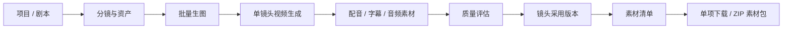
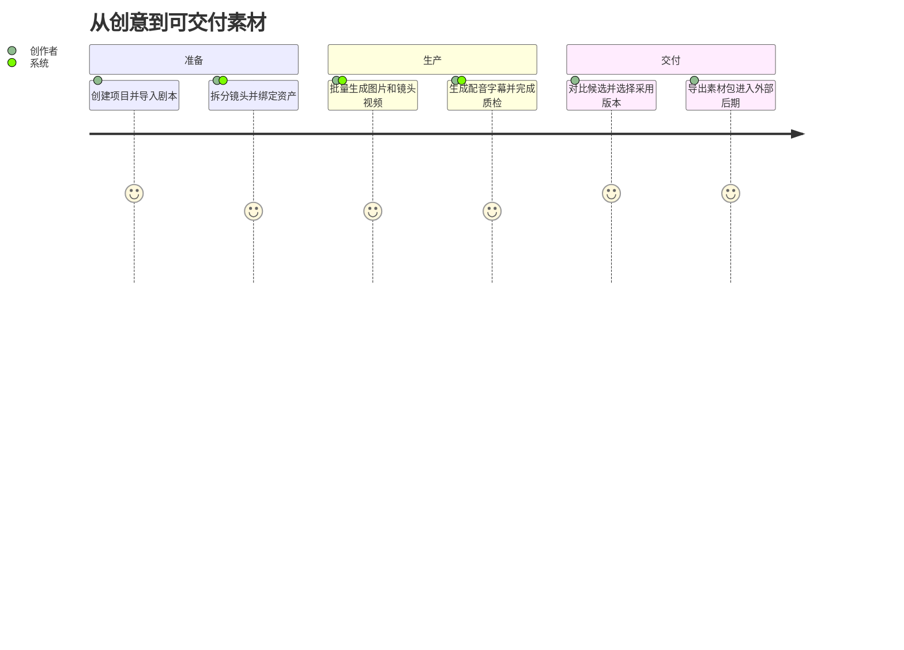
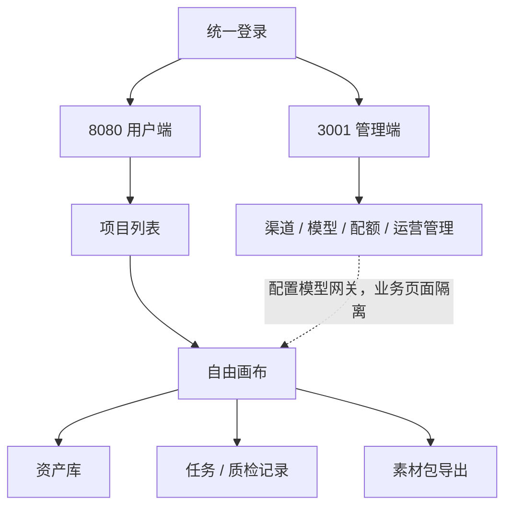
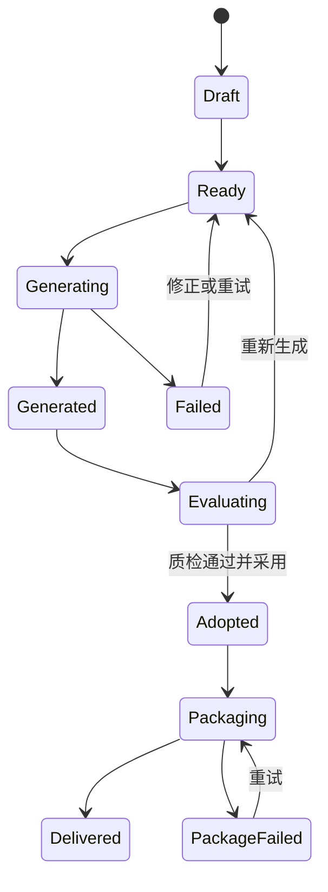

# AI漫剧与视频内容工业化生产工作台商业化落地路线

目标：根据核心 PRD，将现有演示页升级为可承载 AI 漫剧、短剧、广告片和短视频素材生产的商业化平台。核心能力是无限画布、节点编排、批量生成、资产复用、质量评估、镜头采用版本、素材包交付和 Agent/Skill 自动执行。

> 产品边界（2026-06-27）：平台不提供视频剪辑、视频拼接、转场/特效叠加、音视频混合、多轨时间轴或整片渲染。单镜头视频、配音、字幕、BGM、音效及项目素材包交给外部后期工具完成最终制作。

---

## 基于 superpowers 的更新记录（2026-07-04）

| 更新项 | 说明 |
|---|---|
| P0 扩展 | 增加「创作圣经基础版本」（生态系统规则+三层写作指南+生成上下文快照）、「Agent 会话 P0」（会话持久化+计划审批+SSE）、「脚本交易市场 P0」（挂牌/购买/快照交付） |
| P1 扩展 | 增加「企业采购审批流」、「资产市场完整功能（发布审批+项目应用）」、「Agent 会话 P1（写作/画布集成）」 |
| P2 扩展 | 增加「创作圣经 P1（关系网络+连续性快照）」、「Agent 会话 P2（重启恢复+信用预留）」、「专业分镜编辑器」 |
| 架构更新 | 3001 为账户中心唯一数据源；8080→3001 通过版本化 API + 幂等键通信；交易采用 Outbox + 最终一致性 |

### 2026-07-04 新增 `[superpowers 更新 V1.7]`

| 更新项 | 说明 | 依据 superpowers |
|--------|------|-----------------|
| **新增 P0：Agent 配置中心** | 4 系统蓝图(钩子/编剧/分镜/导演)；结构化+高级双编辑；版本生命周期；项目绑定 | `2026-07-04-user-configurable-agent-center-design.md` |
| **新增 P0：统一任务事件中心** | 跨服务任务案例(生成+交易)；用户/运营双视图；SSE 事件流；SLA 告警；对账补偿 | `2026-07-04-unified-task-event-center-design.md` |
| **新增 P0：资产工作台** | 合并生成历史+任务监控；workspace_assets 唯一模型；三栏布局；批量整理/回收站 | `2026-07-04-asset-generation-history-workbench-design.md` |
| **新增 P0：企业工作台完成** | 角色化概览；采购预算；统一审批；跨域审计；3001 BFF 代理 | `2026-07-04-enterprise-workbench-completion-design.md` |
| **新增 P0：生产 SOP 完成** | 双界面；6 生产 Gate；规则引擎；返工闭环 | `2026-07-04-production-sop-completion-design.md` |
| **新增 P1：独立空白画布** | 无内容项目绑定创建；purpose=experiment | `2026-07-04-standalone-blank-canvas-design.md` |
| **跨域规范补强** | 幂等键强制(Idempotency-Key)；乐观锁(ETag/If-Match)；故障关闭(503+Retry-After)；不可变快照；Outbox 模式 | 全部 07-04 superpowers |

> **注意**：本文档中标注 `[superpowers 更新 V1.7]` 的段落为 2026-07-04 新增。标注 `[superpowers 更新]` 的段落为 07-02 之前的更新。

---

## 文档使用与角色分工

| 角色 | 主要职责 |
|---|---|
| 产品 | 维护范围、优先级、验收口径和商业化规则 |
| 前端 | 画布、节点、资产、任务、质检和交付界面 |
| 后端 | 项目状态、生成任务、资产版本、素材清单和打包任务 |
| AI/new-api | 模型渠道、路由、配额、成本和生成结果 |
| 测试 | 核心链路、状态机、计费、失败恢复和跨端边界验证 |

## V1.5 产品闭环

```text
项目创建
→ 剧本/想法导入
→ 分镜拆解与资产绑定
→ 批量生成图片
→ 单镜头视频生成
→ 配音/字幕/BGM/音效素材
→ 单镜头预览与质量评估
→ 选择镜头采用版本
→ 单项下载或 ZIP 项目素材包
→ 工作流、资产和 Agent/Skill 复用
```

## 全局流程图集

### 总流程图



### 用户旅程图



### 页面跳转图



### 状态流转图



## P0：生产闭环底座

1. 项目、画布和节点

   - 支持文本、脚本/分镜、图片、视频、音频、角色、场景、道具、工作流和 Agent 节点。
   - 支持双击/右键创建、拖拽、缩放、框选、连线、打组、复制、撤销/重做和自动保存。
   - 不设置合成节点；节点下游只创建生成、分析、资产或交付关系。

2. 脚本与分镜

   - 导入剧本，拆分场次、镜头、台词、旁白、角色、场景和道具。
   - 三步门禁：确认镜头、整理资产、合成最终图像/视频 Prompt。
   - 支持 shot 编辑、排序、颜色标记、批量生图和批量生视频。

3. 生成任务

   - 所有消耗积分的动作执行“预估—确认—冻结—运行—结算/退还”。
   - 任务状态统一为 pending、running、succeeded、failed、canceled。
   - 成功结果回写节点、分镜、资产库和历史记录；失败显示错误码与重试入口。

4. 视频与音频素材

   - 视频支持文生视频、图生视频、首尾帧、全能参考、多副本、高清和解析。
   - 视频节点支持候选比较、质量评估、设为采用版本和原文件下载。
   - 音频支持 TTS、BGM、音效、音色克隆和音频分离；输出作为独立素材关联镜头或项目。
   - 字幕生成 SRT/VTT 文件，不烧录到视频。

5. 素材交付

   - 只读镜头序列展示镜头顺序、采用版本和素材完整性。
   - 每次导出固化 `manifest_version`，记录采用图片、视频、配音、字幕、BGM 和音效。
   - 后台只执行源文件复制、规范命名、checksum、ZIP 压缩和上传。
   - 支持单项素材直接下载和项目素材包下载。

## P0.5：前端画布引擎技术路线

采用“DOM 节点 + SVG 连线 + Canvas/WebGL 辅助层”的混合方案：

| 层 | 技术 | 职责 |
|---|---|---|
| 背景层 | CSS/Canvas | 网格、选区、性能降级 |
| 连线层 | SVG | 贝塞尔曲线、命中、选中态 |
| 节点层 | React/Vue DOM | 节点卡片、输入、播放器、工具栏 |
| 导航层 | Canvas | 小地图和大规模节点概览 |
| 状态层 | Zustand/Pinia + 服务端快照 | 节点、连线、视口、任务、采用版本 |

工程拆分：

- `canvas-core`：坐标系、视口、选择、快捷键。
- `node-registry`：节点类型、端口和兼容规则。
- `edge-engine`：连线路由与交互。
- `task-client`：积分预估、任务状态和事件订阅。
- `asset-client`：资产搜索、拖入、历史版本。
- `delivery-panel`：只读镜头序列、素材完整性和导出任务。

## P0.6：页面与节点交互

1. 自由画布

   - 顶部：项目名、撤销/重做、自动排版、分享、素材包导出、积分余额。
   - 左侧：节点创建与资产入口。
   - 中央：无限画布。
   - 右侧：节点参数、任务日志、版本与质量结果。
   - 底部：可折叠的只读镜头序列和素材清单，不提供轨道编辑。

2. 视频节点

   - 顶部工具：高清、解析、质量评估、人声/背景声分离、生成字幕、生成配音。
   - 主体：播放器、生成参数、候选版本、任务状态和质量评分。
   - 关键按钮：重新生成、生成多副本、设为采用版本、保存为资产、下载原文件。
   - 任何按钮都不得出现裁剪、拼接、转场或混合语义。

3. 音频与字幕节点

   - 音频结果显示波形、类型、语言/音色、来源、时长和文件状态。
   - 配音/音效可关联镜头，BGM 可关联项目；不提供音轨和混音控制。
   - 字幕支持文本校对、语言版本和 SRT/VTT 导出，不提供视频烧录。

4. 素材交付面板

   - 镜头行展示编号、缩略图、采用视频、配音、字幕、音效和质检状态。
   - 缺失项使用明确告警，不自动替用户选择候选版本。
   - “导出素材包”先展示包含项与估算文件大小，再创建异步打包任务。
   - 完成后展示文件名、大小、文件数、checksum、有效期和下载地址。

## P0.7：按钮反馈与积分规则

| 动作 | 是否计费 | 反馈 |
|---|---:|---|
| 创建/移动/连线/打组节点 | 否 | 即时更新并后台保存 |
| AI 拆分分镜、生成 Prompt | 是 | 先预估，运行中显示进度 |
| 生图、生视频、多副本、高清、TTS | 是 | 任务状态、成本和结果版本可追踪 |
| 设为采用版本 | 否 | 更新镜头清单并记录操作日志 |
| 单项原文件下载 | 否/按存储策略 | 返回限时 URL |
| ZIP 素材包导出 | 否/按存储策略 | 显示打包进度与失败重试 |
| Agent/Skill 执行 | 是 | 执行前展示计划和总成本预估 |

## P1：商业化能力

- 会员等级、算力包、企业配额、任务优先级。
- 团队空间、角色权限、审批、评论、版本和审计。
- 模板、Skill、风格、角色/场景/道具资产市场。
- 素材包存储周期、扩容、批量下载和企业交付记录。
- new-api 渠道成本、模型毛利和异常消耗预警。

## P2：专业体验

- 3D 导演台、全景、多角度、焦点编辑和镜头聚焦。
- 角色/场景一致性分析、视频运动稳定性评分、自动返工建议。
- 大规模画布性能、协同光标、离线恢复和跨项目资产检索。
- 外部后期工具对接：仅提供素材包、manifest 或受控导出接口，不在平台内实现编辑器。

## V1.5 MVP 开发阶段

### 第一阶段：基础画布与节点

- 项目 CRUD、画布快照、节点/连线/分组、资产拖入。
- 文本、脚本、图片、视频、音频节点基础形态。
- 本地 mock provider 跑通任务状态。

### 第二阶段：剧本到分镜

- 剧本拆分、shot 表、资产卡片、Prompt 门禁。
- 批量生图、候选版本、资产入库和历史记录。

### 第三阶段：图片到单镜头视频

- 图生视频、首尾帧、全能参考、多副本、高清和解析。
- 视频质量评估、失败恢复和采用版本。

### 第四阶段：素材交付

- 配音、字幕、BGM、音效的独立素材生成与关联。
- 只读镜头序列、delivery manifest、单项下载和 ZIP 打包。
- 明确删除全部剪辑、合成和多轨接口、按钮、任务与队列。

### 第五阶段：自动化与商业化

- Agent 会话、Skill、工作流模板和成本预估。
- 企业权限、配额、审计、模板/资产市场和数据看板。

## 验收基线

1. 8080 用户端与 3001 管理端账号身份可映射，业务功能隔离。
2. 从剧本到分镜图、单镜头视频、配音/字幕素材、采用版本和 ZIP 素材包的 E2E 可跑通。
3. 任一生成任务可查询成本、状态、错误和输出资产。
4. 素材包内镜头编号、原始文件、manifest 和 checksum 一致。
5. UI、API、数据库、队列和测试中不存在视频剪辑、视频合成或多轨时间轴入口。
