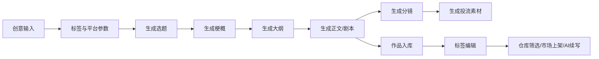

# 蛙蛙写作流程与标签设置整理

> 资料状态：公开网页中未找到稳定、可核验的「蛙蛙写作」官方流程文档。本整理基于当前调研结论、对话整理内容，以及项目内已有 PRD/原型中的小说/剧本创作流程与 4 轴标签体系，用作竞品参考和产品设计沉淀。

## 1. 核心写作流程

### 1.1 输入创意

用户先输入一句话或一段创意，用于确定故事的初始方向。

示例：

- 外卖小哥其实是隐藏豪门继承人
- 被家族抛弃的私生女，意外成为商业帝王唯一在意的女人
- 规则怪谈降临校园，只有女主能听见系统提示

### 1.2 设置创作参数

在生成前补充结构化参数，帮助 AI 控制题材、节奏、受众和平台适配。

| 参数 | 类型 | 作用 |
| --- | --- | --- |
| 创意描述 | 文本输入 | 描述核心脑洞、人物关系或冲突 |
| 标签化参数 | 标签选择 | 通过题材、情节、情绪、时空 4 轴精确控制创作方向 |
| 目标平台 | 多选/单选 | 抖音、快手、视频号、TikTok、B站等，影响节奏和爽点密度 |
| 目标人群 | 单选 | 男频、女频、全年龄，影响题材和情感线 |
| 集数/篇幅 | 选择器 | 控制短剧集数、小说章节数或整体体量 |
| 参考作品 | 文本输入 | 借鉴风格、节奏或题材类型，但不直接复刻 |

### 1.3 生成选题

AI 基于创意和标签生成多个可选题材方向。每个方向通常包含：

- 题材名称
- 一句话卖点
- 目标人群匹配度
- 平台适配建议
- 核心爽点
- 潜在反转节点
- 标签匹配分析

### 1.4 生成梗概

用户选择一个选题后，系统生成故事梗概，通常包括：

- 世界观背景
- 主角设定
- 核心矛盾
- 主要人物关系
- 主线目标
- 情绪走向
- 结局方向

### 1.5 生成大纲

将梗概拆成分集、分章或剧情段落。

大纲需要明确：

- 每集/每章标题
- 本集目标
- 主要冲突
- 情绪推进
- 关键爽点
- 反转或钩子
- 下一集悬念

### 1.6 生成正文或剧本

根据大纲生成完整内容。

小说方向重点关注：

- 章节正文
- 叙事视角
- 人物心理
- 对话节奏
- 情绪铺垫

短剧/剧本方向重点关注：

- 场景
- 人物出场
- 动作说明
- 台词
- 镜头节奏
- 每集结尾钩子

### 1.7 生成分镜和投流素材

剧本完成后，可继续生成制作和宣发材料：

- 分镜表
- 镜头描述
- 场景目标
- Beat 表
- 封面卖点
- 标题方案
- 投流文案
- 高光片段拆解

### 1.8 入库管理

生成完成的作品进入仓库，支持后续编辑和管理：

- 标签编辑
- 简介编辑
- 总纲编辑
- 角色设定
- 背景设定
- 势力设定
- 地点设定
- 物品设定
- 版本历史
- AI 续写
- 市场上架

## 2. 创作模式

### 2.1 快速模式

适合快速验证脑洞。

流程：

```text
一句话创意
→ 选择标签
→ 选择平台/人群/集数
→ 一键生成完整故事或剧本
→ 保存到仓库
```

典型输入：

- 创意描述：一个外卖小哥其实是隐藏豪门继承人
- 目标平台：抖音
- 目标人群：女频
- 集数：40 集
- 标签：言情、重生、先婚后爱、甜宠、打脸、现代

### 2.2 精细模式

适合对内容质量、结构和生产链路要求更高的场景。

流程：

```text
Step 1 选题
→ Step 2 梗概
→ Step 3 大纲
→ Step 4 正文/剧本
→ Step 5 分镜
→ Step 6 投流
```

每一步都允许用户确认、编辑、重生成或回退。

## 3. 4 轴标签体系

每个作品使用 4 个维度的标签进行精确分类，既用于 AI 生成参数，也用于仓库管理、市场筛选和内容推荐。

| 标签轴 | 英文 | 选择规则 | 作用 |
| --- | --- | --- | --- |
| 题材 | Genre | 单选 1 个 | 决定故事核心类型 |
| 情节 | Plot | 最多 3 个 | 决定剧情走向和核心冲突模式 |
| 情绪/基调 | Tone | 最多 3 个 | 决定读者/观众的情绪体验 |
| 时空背景 | Setting | 单选 1 个 | 决定故事时代、世界观和场景基础 |

## 4. 完整标签清单

### 4.1 题材 Genre

单选 1 个。

`言情` `现实情感` `悬疑` `惊悚` `科幻` `武侠` `脑洞` `太空歌剧` `赛博朋克` `游戏` `仙侠` `历史`

### 4.2 情节 Plot

最多选择 3 个。

`权谋` `重生` `穿越` `系统` `规则怪谈` `团宠` `囤物资` `先婚后爱` `追妻火葬场` `破镜重圆` `校园` `职场` `娱乐圈` `宫斗宅斗` `犯罪` `探险` `丧尸` `克苏鲁` `争霸` `听心声` `读心术` `倒计时文学` `日久生情` `一见钟情` `强取豪夺` `欢喜冤家` `出轨` `婚姻` `家庭` `无系统`

> 注意：项目资料中的标签说明曾写「情节 29 个」，但实际清单包含 `无系统` 后为 30 个。产品实现时建议以实际清单为准，或在需求中统一数量口径。

### 4.3 情绪/基调 Tone

最多选择 3 个。

`甜宠` `虐恋` `爽文` `沙雕` `暗恋` `纯爱` `复仇` `反转` `逆袭` `打脸` `多视角反转` `励志` `热血` `烧脑` `治愈` `求生` `迪化` `HE` `BE` `先虐后甜`

### 4.4 时空背景 Setting

单选 1 个。

`古代` `现代` `未来` `架空` `民国` `五零年代` `六零年代` `七零年代` `八零年代` `兽世`

## 5. 标签交互规则

| 规则 | 说明 |
| --- | --- |
| 单选限制 | 题材和时空背景只能各选 1 个 |
| 多选限制 | 情节最多选 3 个，情绪/基调最多选 3 个 |
| 置灰规则 | 达到选择上限后，未选标签置灰不可选 |
| 取消选择 | 点击已选标签可取消 |
| 实时计数 | 每个标签轴标题旁显示已选数量，例如 `2 / 3` |
| 默认继承 | 从生成流程带入的标签，自动填充到作品标签页 |
| 跨模块同步 | 标签变更后同步到仓库筛选、市场上架信息和 AI 生成参数 |
| 清空标签 | 支持一键清空，建议弹出二次确认 |
| 批量修改 | 仓库中可多选作品后批量追加或替换标签 |

## 6. 标签在产品中的应用

### 6.1 AI 生成参数

标签会作为结构化参数注入 Prompt，帮助模型理解用户想要的故事类型。

示例：

```text
题材：言情
情节：重生、先婚后爱、追妻火葬场
情绪：甜宠、打脸、爽文
时空：现代
```

模型应理解为：

- 女频倾向较强
- 主线可围绕身份、婚恋和情感拉扯
- 节奏需要强爽点和高频反转
- 适合现代都市短剧或网文

### 6.2 仓库筛选

仓库列表支持按 4 轴标签交叉筛选。

示例：

- 题材 = 言情
- 情节包含 = 重生
- 情绪包含 = 甜宠
- 时空 = 古代

可筛出类似「古言重生甜宠」的作品集合。

### 6.3 智能分类

系统可根据标签组合自动归类。

示例：

| 标签组合 | 自动分类建议 |
| --- | --- |
| 重生 + 甜宠 + 古代 | 古言重生甜宠 |
| 系统 + 逆袭 + 现代 | 都市系统逆袭 |
| 犯罪 + 烧脑 + 现代 | 现代悬疑犯罪 |
| 丧尸 + 囤物资 + 求生 | 末日囤货求生 |

### 6.4 市场上架

标签可用于市场筛选、推荐和详情页展示。

可展示内容：

- 题材徽章
- 热门情节标签
- 情绪标签
- 时空标签
- 标签匹配用户偏好
- 同标签热门榜单

### 6.5 投流和内容分析

标签可辅助生成投流素材。

示例：

| 标签 | 投流侧重点 |
| --- | --- |
| 打脸 | 强冲突标题、反派羞辱、身份揭露 |
| 甜宠 | 高糖片段、暧昧互动、CP 感 |
| 追妻火葬场 | 前期伤害、后期悔恨、情绪反差 |
| 规则怪谈 | 悬念标题、规则压迫感、反常识设定 |
| 囤物资 | 末日危机、资源爽点、生存焦虑 |

## 7. 典型标签组合

| 内容方向 | 标签组合 | 说明 |
| --- | --- | --- |
| 女频甜宠短剧 | 言情 + 先婚后爱/追妻火葬场/重生 + 甜宠/打脸/爽文 + 现代 | 适合短剧平台，高频情绪反馈 |
| 男频逆袭爽文 | 脑洞 + 系统/穿越/争霸 + 爽文/逆袭/热血 + 架空 | 适合升级流、强目标驱动故事 |
| 悬疑反转 | 悬疑 + 犯罪/规则怪谈/倒计时文学 + 烧脑/反转/多视角反转 + 现代 | 适合强悬念和章节钩子 |
| 末日求生 | 科幻 + 丧尸/囤物资/探险 + 求生/爽文/反转 + 未来 | 适合资源争夺和生存压力 |
| 古言虐恋 | 言情 + 宫斗宅斗/权谋/破镜重圆 + 虐恋/先虐后甜/HE + 古代 | 适合情感拉扯和权谋冲突 |
| 现实婚姻 | 现实情感 + 出轨/婚姻/家庭 + 虐恋/反转/治愈 + 现代 | 适合现实向女性受众 |
| 校园暗恋 | 言情 + 校园/日久生情/一见钟情 + 暗恋/纯爱/HE + 现代 | 适合轻体量甜宠内容 |
| 仙侠权谋 | 仙侠 + 权谋/争霸/强取豪夺 + 热血/反转/虐恋 + 架空 | 适合长篇世界观和势力博弈 |

## 8. 推荐产品页面结构

### 8.1 创作入口页

核心模块：

- 创意输入框
- 4 轴标签快速选择
- 目标平台选择
- 目标人群选择
- 集数/篇幅选择
- 一键生成按钮
- 生成进度条

### 8.2 精细模式引导页

核心模块：

- 步骤条
- 当前步骤结果
- 多方案卡片
- 方案匹配度
- 编辑/重生成
- 下一步按钮

### 8.3 标签编辑页

左侧导航：

- 作品信息
  - 标签
  - 简介
  - 总纲
- 设定
  - 角色
  - 背景
  - 势力
  - 地点
  - 物品

右侧内容：

- 题材标签网格
- 情节标签网格
- 情绪标签网格
- 时空标签网格
- 已选数量
- 清空标签
- 保存标签

## 9. 可复用生成链路



## 10. 设计注意事项

- 标签不是单纯分类字段，应同时服务于生成、筛选、推荐、上架和投流。
- 快速模式需要降低输入门槛，标签可以默认折叠或以热门标签快速选择呈现。
- 精细模式需要允许用户逐步确认，否则生成链路过长时容易失控。
- 标签组合需要支持市场分析，例如判断「重生 + 甜宠 + 古代」是否为高热度组合。
- 标签数量和上限必须在 PRD、接口、前端原型和后端枚举中保持一致。
- AI 输出应解释标签如何影响创作结果，避免用户不知道标签选择的实际作用。
