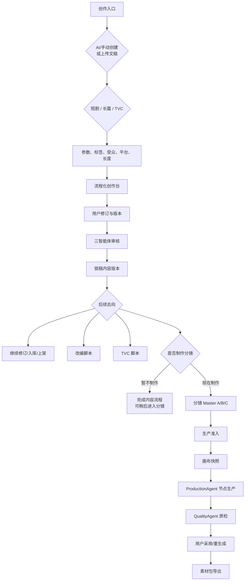
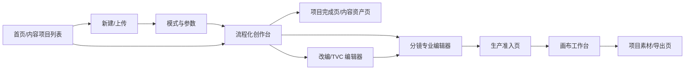
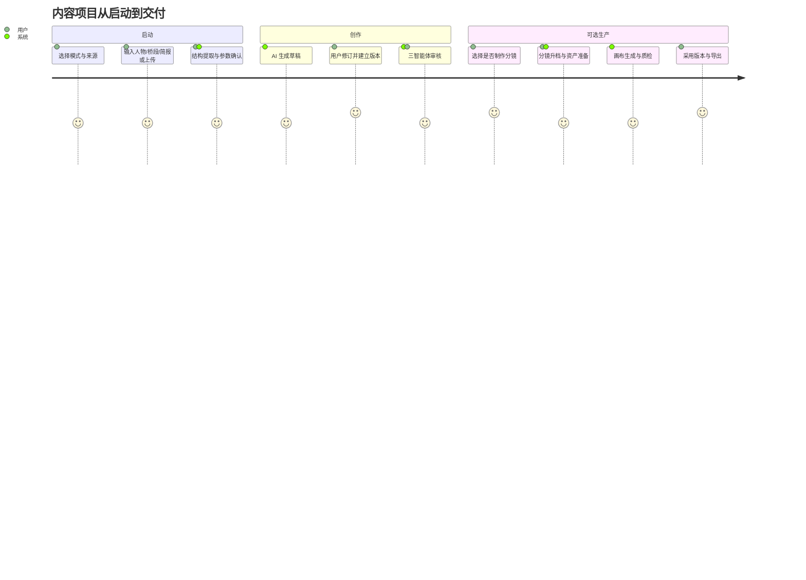
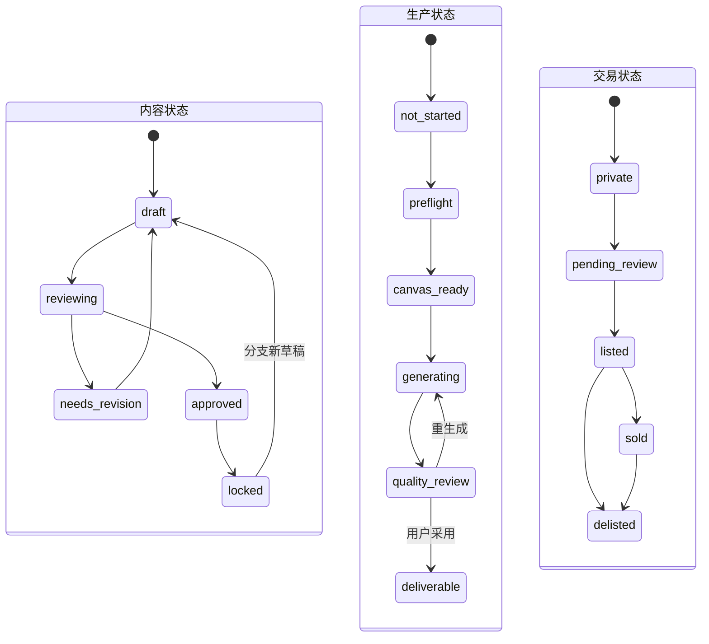

# 剧本与 TVC 创作模块 PRD V7.1

> 文档状态：待产品评审
> 版本：V7.1
> 日期：2026-06-29
> 适用范围：用户端剧本创作、长篇创作、TVC 创作、用户文稿导入、改编、分镜、画布生产关联
> 主要读者：产品、交互、前端、后端、AI/Agent、测试、运维、内容审核

## 0. 文档目的与唯一口径

本文档合并并替代下列文档中与“剧本创作模块”相关的产品口径：

- `docs/01-core/用户端产品功能设计.md` 模块二及附录 A-1。
- `docs/02-derived/小说正文与分镜脚本解耦改造方案.md`。
- `docs/02-derived/剧本与TVC钩子Agent设计说明.md`。
- `docs/02-derived/流程图文档.md` 中剧本创作、分镜和画布部分。

冲突时以本 V7 为准。历史文档保留作为设计溯源，不再作为开发验收依据。

### 0.1 变更记录

| 版本 | 日期 | 变更 |
|---|---|---|
| V7.0 | 2026-06-29 | 形成内容项目、三模式、版本、Agent、分镜与画布开发基线 |
| V7.1 | 2026-06-29 | 确认自适应引导流程；分镜改为用户可选；补充最短路径和易用性规则 |
| V7.2 | 2026-06-30 | 代码审查修复：Entity @TableName 与 DDL 对齐、5 个 Controller 接入 ProjectAccessService、幂等键改为确定性键、StoryboardService 竞态条件修复、新建 AiResponseParser 消除 200 行重复代码、parseJson 增加错误日志、next_promise 钩子补全、getNextSort 实现真实 DB 查询、compareSnapshots 扩展为 4 维度对比、数据字典补充 M1–M4 新增表 |

### 0.2 已确定的产品决策

1. 产品根对象统一命名为“内容项目”。过渡期物理表可继续使用 `scripts`，但新 API、页面和埋点使用 `content_project`。
2. 创建时由用户明确选择“短剧快速创作”、“长篇世界观创作”或“TVC 创作”。
3. 人物设定与剧情桥段至少提供一项；AI 可补全另一项，用户确认后才成为项目事实。
4. 世界地图不作为长篇创作的起始门槛。地点按 L0 地点提取、L1 区域关系、L2 可视化地图渐进构建。
5. TVC 是独立创作模式，同时允许从已有内容版本改编。两条路径统一产出 `tvc_script_version`。
6. 用户界面使用自适应引导流程：保留阶段轨道，但根据来源、目标和已有资产自动完成或收起无关阶段，不要求所有用户走同一条固定向导。
7. 每一阶段的 AI 生成必须使用用户已修订版本，不得继续只使用初始 idea。
8. 钩子 Agent、编导 Agent、导演 Agent 保留为 ScriptAgent 内部三个专业审校角色。
9. 源正文、改编脚本、分镜 Master、画布快照和生成资产各自独立版本化，不自动覆盖上下游。
10. 默认画布耦合模式为半耦合：分镜锁定后创建画布快照，后续差异需用户确认。
11. 分镜不是内容创作完成条件。用户可选择“暂不制作”或“现在制作”；只有进入画布概念验证或生产时，才要求生成并确认对应档位的分镜。

## 1. 背景、问题与产品判断

### 1.1 当前问题

现有实现已具备 AI 写作、上传、标签、选题、梗概、大纲、单集正文、联合审核、改编、分镜、投流、仓库和画布入口，但存在以下根本问题：

- 页面近似链式生成，后端实际不使用用户修订后的上一阶段内容。
- 多集共用一个前端 `scriptText`，缺少真正的逐集/逐章内容对象。
- 生成结果结构化不完整，解析失败时会回退到固定示例数据。
- “可编辑”主要是页面内存状态，未形成可恢复、可版本化、可追溯的资产。
- 剧本仓库只是列表，点击“编辑”无法恢复到原创作阶段。
- 人物提取在流程后端，未成为前续创作的稳定上下文。
- 分镜 A/B/C 实现不完整，缺少项目插件包、资产成熟度和生产准入。
- 画布导入前端实际只发送 `script_id`，未形成可追溯的画布快照。
- 内容状态、生产状态和交易状态口径混用。
- 大量功能被放入同一 P0，无法形成可验收的垂直切片。

### 1.2 产品判断

本次不继续向现有 10 步页面叠加字段，而是将它重编为：

```text
内容项目底座
+ 短剧 / 长篇 / TVC 三条流程
+ 用户上传入口
+ 可编辑与版本化
+ 三智能体审校
+ 改编脚本与 A/B/C 分镜 Master
+ 画布快照与 Agent 生产闭环
```

## 2. 产品目标、非目标与成功指标

### 2.1 产品目标

1. 用户能从人物、剧情桥段、TVC 简报或已有文稿启动项目。
2. 所有 AI 结果均可修订、可保存、可建版本，后续生成使用用户修订稿。
3. 短剧用户快速得到可审核的单集正文；长篇用户能逐步扩展人物、剧情任务、分卷和世界设定；TVC 用户能从简报到分秒脚本。
4. 每个派生资产能追溯源版本，上游变更时不静默覆盖下游。
5. 分镜 Master 能通过明确的生产准入进入画布，画布结果可追溯、可质检、可采用和导出。

### 2.2 非目标

- V7 不将画布工作台改造为专业非线性剪辑器。
- M0–M2 不实现多人实时共编，使用乐观锁和冲突对比。
- M0–M2 不实现 L2 可视化世界地图。
- M0–M4 不实现分镜 Master 与画布的自动双向覆盖。
- 不承诺 AI 一次生成终稿，所有生成结果默认为草稿。

### 2.3 核心指标

| 指标 | 定义 | 首期目标 |
|---|---|---:|
| 首个可用版本转化率 | 创建项目后 7 天内产生至少一个 approved 内容版本的项目占比 | 基线建立后持续提升 |
| 流程完成率 | 进入某流程后完成至少一个锁稿单元的占比 | 基线建立后持续提升 |
| 修订稿使用正确率 | 下一阶段输入快照中所选上游版本与页面显示一致 | 100% |
| 项目恢复成功率 | 刷新/重新进入后恢复正确阶段、单元和草稿 | ≥99.5% |
| 画布导入完整率 | 导入后 Master Shot 与 Canvas Shot 映射完整且无孤儿节点 | 100% |
| 首个采用资产率 | 导入画布后产生至少一个 adopted asset 的项目占比 | 基线建立后持续提升 |
| AI 失败透明度 | AI 失败被错误标记而非回退为伪成功的比例 | 100% |

## 3. 用户、JTBD 与项目权限

### 3.1 核心用户

| 用户 | 核心任务 | 主要模式 |
|---|---|---|
| 独立编剧/小说作者 | 将人物或桥段扩展为可持续修订的作品 | 短剧、长篇 |
| 漫剧内容团队 | 将文本转为可生产的改编和分镜 | 短剧、改编、分镜 |
| TVC/营销团队 | 将品牌与产品简报转为可投放的分秒脚本 | TVC |
| 导演/制片 | 审核画面可表达性、资产成熟度和生产成本 | 分镜、画布 |
| 企业内容负责人 | 管理成员、版本、审核、预算和发布 | 全部 |

### 3.2 项目角色权限

| 动作 | Owner | Editor | Reviewer | Producer | Viewer |
|---|:---:|:---:|:---:|:---:|:---:|
| 查看项目 | ✅ | ✅ | ✅ | ✅ | ✅ |
| 编辑设定/大纲/正文 | ✅ | ✅ | — | — | — |
| 运行 AI 生成 | ✅ | ✅ | — | ✅（生产任务） | — |
| 提交审核 | ✅ | ✅ | — | — | — |
| 批准/驳回/风险放行 | ✅ | — | ✅ | — | — |
| 锁定/解锁内容 | ✅ | — | ✅（被授权） | — | — |
| 管理项目插件包/L0–L4 | ✅ | — | — | ✅ | — |
| 导入画布/批量生产 | ✅ | — | — | ✅ | — |
| 同步画布差异 | ✅ | — | ✅（内容） | ✅（生产） | — |
| 上架/下架/删除项目 | ✅ | — | — | — | — |

企业组织可覆盖默认权限，但不得扩大超过 Owner 的能力。所有审核、锁定、解锁、风险放行和市场操作写入审计日志。

## 4. 术语与资产边界

| 术语 | 定义 | 是否事实源 |
|---|---|:---:|
| 内容项目 | 聚合模式、参数、设定、正文、改编、分镜、画布和交易关联的根对象 | ✅（元数据） |
| 源头内容版本 | 短剧单集、长篇单章、产品故事或品牌叙事的版本 | ✅ |
| 改编脚本版本 | 从源头内容派生的 AI 漫剧/短剧/网剧脚本 | ✅（改编层） |
| TVC 脚本版本 | 从简报或内容版本产出的分秒脚本 | ✅（TVC 层） |
| 分镜 Master 版本 | 可编辑、可升档、可锁定的 A/B/C 分镜资产 | ✅（分镜层） |
| 画布快照 | 分镜 Master、插件包、风险和参数在某次导入时的不可变快照 | ✅（生产起点） |
| 生成资产版本 | 某节点生成的图片、视频、音频或字幕候选 | ✅（生产结果） |
| 采用版本 | 用户从候选中标记为 adopted 的版本 | ✅（交付结果） |

任一层变更只创建本层新版本，不直接覆盖其他层。

## 5. 总体信息架构与主流程

### 5.1 总流程



### 5.2 页面跳转



### 5.3 用户旅程



## 6. 项目入口、参数与上传

### 6.1 新建项目 `F-02-00`

首屏只要求 `creation_mode`、`source_mode`、起始内容和内容目标。下表“必填”表示进入相关生成阶段前必须确认，不要求用户在创建项目时一次填完；题材、受众、平台和长度可由模板或 AI 推荐，用户确认后写入参数版本。

| 字段 | 短剧 | 长篇 | TVC | 校验 |
|---|---|---|---|---|
| `creation_mode` | `short_drama` | `long_form` | `tvc` | 必填，创建后可发起模式转换，不直接改原项目 |
| `source_mode` | `ai_manual` / `uploaded` | 同左 | 同左 | 必填 |
| 起始内容 | 人物或桥段 | 人物或桥段 | 简报、产品/品牌资料、桥段或内容版本 | 手动模式至少一项 |
| 题材/品类 | 剧本题材 | 长篇题材 | 行业品类 | 必填 |
| 情节/创意角度 | 最多 3 | 最多 3 | 创意角度 | 可选 |
| 情绪/基调 | 最多 3 | 最多 3 | 最多 3 | 可选 |
| 时空/场景 | 时空背景 | 时代/世界层级 | 使用场景 | 可选 |
| 受众/频向 | 男频/女频/双频/全年龄 | 同左+读者画像 | 人口、地域、职业、消费阶段 | 必填 |
| 主/次平台 | 抖音/快手/视频号/B站/TikTok/其他 | 阅读载体+视频平台 | 信息流/电商/社交平台 | 主平台必填 |
| 长度 | 1–100 集，每集时长 | 1–20 卷，不超过 500 章，总/章字数 | 5–180 秒，可选多个改版 | 必填 |
| 内容目标 | 追更/完播/情绪/反转 | 连载/成长/改编 | 认知/种草/转化/招商/形象 | 必填 |

参数修改创建 `project_parameter_version`。已运行生成任务永久保留当时参数快照。

平台适配规则由 `platform_rule_versions` 管理，至少包含平台、内容类型、画幅、时长、字幕安全区、敏感规则、钩子建议、CTA 限制、生效时间和规则版本。生成任务与导出 Manifest 必须记录实际使用的规则版本，规则升级不得改变历史结果。

#### 6.1.1 模式转换

模式创建后不可原地修改。用户发起模式转换时，系统创建新的派生内容项目，写入 `converted_from_project_id`，由用户选择复制人物、剧情任务、正文、标签和平台参数；源项目和源版本保持不变。转换预览必须说明不兼容字段、将复制的版本和预计费用，确认后才能执行。

### 6.2 标签 `F-02-00A`

短剧/长篇保留现有 4 轴标签：题材 1 个、情节最多 3 个、情绪/基调最多 3 个、时空 1 个。TVC 使用独立的品类、目标人群、核心诉求、情绪基调、使用场景和时长标签。

标签定义由 `tag_definitions` 管理，不得写死在前端。标签有 `active_from` / `active_to` / `version`，保证历史任务可追溯。

### 6.3 上传文稿 `F-02-00B`

#### 6.3.1 支持范围

- M1–M2：TXT、DOCX，单文件最大 20 MB，解析后文本最大 200 万字符。
- M3 后：PDF、Markdown。
- 上传前用户必须确认拥有使用和改编权。

#### 6.3.2 流程

```text
上传 → 安全扫描 → 异步解析 → 原文预览
→ 用户拆分/合并/重排章节或集数
→ AI 提取人物/关系/地点/任务/时间线/伏笔候选
→ 用户确认 → 创建初始内容版本 → 系统计算已满足阶段 → 进入第一个未完成的必需任务
```

上传与解析是任务，前端必须查询真实状态，不得用假进度直接标记完成。

## 7. 流程化创作台

### 7.0 内容项目列表 `F-02-09`

- 项目卡片显示名称、模式、来源、内容状态、生产状态、分镜意向、当前阶段、整体进度、最近编辑时间、当前主版本及画布状态。
- 支持按模式、来源、成员、状态、平台、更新时间筛选，并支持名称搜索和最近访问排序。
- 点击“继续创作”恢复最后阶段、任务和内容单元；点击版本号进入只读版本历史；无权限项目不展示编辑入口。
- 删除进入 30 天回收站；复制项目创建新项目并保留 `copied_from_project_id`，不得共用可变资产。
- 列表进度由阶段完成状态计算，不得由前端模拟；后台任务仍在运行时显示真实任务状态。
- 整体进度只计算推荐路径中的必需阶段；可选任务和已选择“暂不制作”的分镜不得降低完成度。

### 7.1 统一页面布局 `F-02-10`

- 顶部：项目名、模式、参数摘要、自动保存状态、当前版本。
- 顶部阶段轨道：已完成、当前、待完成、可选、已跳过、未解锁、有风险。
- 左侧：当前阶段任务、必填与可选标识。
- 中间：当前唯一主编辑区。
- 右侧：本步 AI 使用的上下文、所选版本、被锁定事实和风险。
- 底部：上一项、稍后处理（可选任务）、保存草稿、AI 重新生成、确认并继续。每屏只能有一个视觉主按钮。

### 7.2 阶段合同

后端向前端返回阶段定义，前端不硬编码解锁规则：

```json
{
  "stage_key": "episode_outline",
  "entry_condition": ["synopsis_version.approved=true", "characters.confirmed>=1"],
  "required_tasks": ["outline_generated", "episode_hooks_confirmed"],
  "optional_tasks": ["location_candidates_confirmed"],
  "exit_condition": ["outline_version.saved=true"],
  "override_permission": ["owner", "reviewer"],
  "next_stage": "episode_content"
}
```

| 行为 | 规则 |
|---|---|
| 返回已完成阶段 | 允许；修改并建新版本后计算下游受影响资产 |
| 跳过可选任务 | 允许；不影响阶段完成 |
| 绕过必填任务 | 仅 Owner/Reviewer 可风险放行，必须填写原因 |
| 跳到未解锁阶段 | 不允许；页面显示缺失条件 |
| 刷新/重新进入 | 恢复 `last_stage_key` + `last_task_key` + `last_content_unit_id` |

### 7.3 自动保存与冲突

- 文本停止输入 2 秒后保存草稿；切换单元、离开页面和 Ctrl/Cmd+S 立即保存。
- 保存请求必须携带 `revision`。服务端发现旧 revision 时返回 `409 EDIT_CONFLICT`。
- 冲突时保留“服务端版本”和“本地草稿”，提供对比后手动选择或合并。
- M0–M2 不支持同一内容单元多人实时合并。

### 7.4 自适应引导与易用性 `F-02-11`

系统根据 `creation_mode`、`source_mode`、创作目标和已确认资产计算推荐路径。完整阶段始终可查看，但页面只突出当前必须完成的一项任务；已满足阶段自动标记完成，可选任务默认收起并可随时展开。

| 规则 | 产品要求 |
|---|---|
| 最短可行路径 | 手动创作、上传文稿、TVC 简报和已有版本派生分别定义最少必需步骤，不共用一条固定路径 |
| 渐进展示 | 专业参数、世界设定、Agent 明细、版本依赖和生产配置默认收起 |
| 单屏单目标 | 一个页面只突出一个主要任务和一个主按钮 |
| 智能默认值 | 平台、画幅、时长和 Agent 权重使用模板推荐值，并说明来源、允许修改 |
| 非阻塞任务 | 长时间生成进入后台；离开页面不取消，完成后通知并提供结果差异 |
| 草稿与版本分离 | 自动保存只增加草稿 revision；提交审核、批准、锁定或用户手动命名时才创建用户可见版本 |
| 建议分级 | Agent 结果先汇总为阻塞项、建议项和可忽略项，再允许展开各 Agent 报告 |
| 结果可解释 | AI 操作前后显示使用了什么、保持了什么、会影响什么 |
| 错误可恢复 | 错误提示必须回答发生什么、保留了什么、下一步做什么和是否产生费用 |
| 去向聚焦 | 锁稿后根据项目目标推荐后续动作；其他能力收进“更多去向” |

推荐路径示例：

- 人物/桥段启动：确认输入 → AI 补全候选 → 梗概 → 大纲 → 目标内容单元。
- 上传文稿：解析确认 → 人物/结构校对 → 直接进入分章、改编或分镜；已满足阶段自动完成。
- TVC 简报：事实与 claims → 创意方向 → 概念脚本 → 分秒脚本。
- 已有版本派生：选择源版本和目标 → 预览复制/不兼容范围 → 创建派生项目。

## 8. 三种创作流程

### 8.1 短剧快速创作 `F-02-20`

| 阶段 | 必填任务 | 可选任务 | 退出条件 |
|---|---|---|---|
| 故事种子 | 确认创意、模式、参数和源头钩子策略 | 参考作品风格描述 | 故事种子版本已保存 |
| 人物设定 | 至少确认 1 个主要人物的身份、动机、目标 | 关系、成长弧、台词风格 | 主要人物不存在未解决冲突 |
| 梗概与任务 | 故事梗概、核心冲突、主线任务 | 支线任务、地点候选 | 梗概版本已保存 |
| 分集大纲 | 选择全季或滚动规划范围，确认当前范围内每集核心事件与钩子 | 未来集占位、拖拽排序、插入/删除集 | 当前规划范围存在大纲且必填钩子已确认；不要求先完成全项目大纲 |
| 逐集正文 | 每次生成/编辑一集，保存内容版本 | 批量生成（M2） | 至少一集存在 approved 版本 |
| 审核锁稿 | 钩子/编导/导演报告，用户批准或风险放行 | 局部采纳建议 | 选中内容版本已 locked |
| 去向 | 选择完成内容流程、继续修订、入库、改编、TVC 或投流 | 分镜、上架交易 | 分镜可跳过；选择结果已保存 |

### 8.2 长篇世界观创作 `F-02-30`

| 阶段 | 必填任务 | 可选任务 | 退出条件 |
|---|---|---|---|
| 故事种子 | 确认人物或桥段、读者、长度与基调 | 参考风格 | 故事种子版本已保存 |
| 人物与关系 | 主要人物的动机、长期目标、知识边界、核心关系 | 外貌、台词风格、人物详历 | 核心人物已确认 |
| 剧情任务 | 主线任务、阶段目标、阻碍和代价 | 支线、角色任务、伏笔 | 至少一条主线已确认 |
| 总纲 | 核心主线、阶段发展、全书大钩子 | 世界事实、势力和历史 | 总纲版本已 approved |
| 分卷 | 每卷目标、转折、卷末钩子和主要人物变化 | 地点 L0/L1、时间线 | 目标卷存在大纲版本 |
| 逐章正文 | 章大纲、章正文、章末留白、连续性快照 | AI 润色/扩写/压缩/对白优化 | 单章版本已保存 |
| 阶段审核 | 钩子、编导/编辑、连续性报告 | 导演可视化建议 | 选中范围已 approved/locked |
| 去向 | 选择继续写作、入库、改编或完成本次流程 | 分镜、TVC、上架交易 | 分镜可跳过；选择结果已保存 |

#### 8.2.1 地点与地图

- L0：AI 从人物、桥段、大纲和正文提取地点卡；用户确认后作为空间事实。
- L1：区域层级、距离、交通、归属、势力范围和可达性。
- L2：可视化世界/区域地图，仅 M5 后实现，不阻塞前期创作。

### 8.3 TVC 创作 `F-02-40`

TVC 的 `source_type` 可为 `brief` 或 `content_version`，两者共用后续阶段。

| 阶段 | 必填任务 | 可选任务 | 退出条件 |
|---|---|---|---|
| 需求简报 | 品牌/产品、目标、受众、平台、时长、核心卖点、CTA | 参考素材、竞品风格 | 简报版本已保存 |
| 品牌/产品事实 | 必须表达、禁止表达、claims 与证据 | 品牌音调、资产素材 | 所有 claims 有证据状态 |
| 创意策略 | 3–5 个创意角度、开场钩子、价值主张、品牌记忆点 | 多平台差异方案 | 至少确认一个创意方向 |
| 概念脚本 | 问题/情境、产品介入、利益证明、CTA | 角色、情绪和故事化表达 | 概念脚本已 approved |
| 分秒脚本 | 时码、画面、动作、旁白/台词、字幕、音乐/音效、产品/品牌露出、CTA | 多时长改版 | 分秒脚本版本已保存 |
| 审核锁稿 | TVC 钩子、创意/转化编导、导演/生产报告，合规规则 | 风险放行 | 选定 TVC 版本 locked |
| 去向 | 选择完成脚本、多时长/多平台改版或投放素材 | 分镜、入库、上架 | 分镜可跳过；选择结果已保存 |

## 9. 专业编辑、钩子与连续性

### 9.1 内容单元编辑器 `F-02-50`

| 功能 | M1 | M2+ | 验收要求 |
|---|:---:|:---:|---|
| 单集/单章导航 | ✅ | ✅ | 切换后显示对应独立草稿 |
| 新增/删除/拖拽重排 | — | ✅ | 稳定 ID 不随排序变化 |
| 结构化剧本格式 | ✅ | ✅ | 场景头、动作、对白、旁白、心理活动 |
| AI 续写/润色/扩写/压缩 | 续写 | 全部 | 将结果插入草稿前可预览 diff |
| 格式校验 | ✅ | ✅ | 异常定位到行/段落 |
| 字数/时长 | ✅ | ✅ | 实时统计 |
| 台词占比/情绪曲线/敏感词 | 台词 | 全部 | 报告不自动改文 |
| 查找替换/快捷键 | ✅ | ✅ | Ctrl/Cmd+S、Ctrl/Cmd+Z、Tab AI 续写 |
| 版本对比/恢复 | ✅ | ✅ | 恢复操作创建新版本，不删除历史 |

### 9.2 逐集/逐章钩子 `F-02-51`

每个内容单元包含：

- `previous_promise`：上一单元留下的承诺。
- `promise_payoff`：本单元如何兑现。
- `opening_hook`：开场 3–5 秒/前几段的冲突、危机、信息差或视觉点。
- `mid_escalation`：中段冲突升级或情绪变化。
- `payoff_or_reversal`：爽点、反转或利益证明。
- `closing_hook`：结尾留白。
- `next_promise`：下一单元的点击/追读理由。
- `hook_score`、`hook_reason`、`locked_fields`。

全局同时有全剧/全书大钩子、阶段/分卷钩子和伏笔表。被锁定钩子不得被批量优化覆盖。

### 9.3 连续性快照 `F-02-52`

完成每集/章时生成 `continuity_snapshot`，包含：人物所在地、伤势/状态、关系变化、道具位置、伏笔状态、Voice_ID/服装/场景资产状态。下一单元默认引用上一个 locked 快照。

## 10. Agent 编排与 AI 输出合同

### 10.1 创作三智能体 `F-02-60`

| Agent | 主要输入 | 审核重点 | 默认权重（短剧正文） |
|---|---|---|:---:|
| 钩子 Agent | 参数、大/阶段/单集钩子、正文 | 开场、承接、中段、结尾、下集承诺、假钩子 | 40% |
| 编导 Agent | 大纲、人物、任务、正文 | 核心事件、动机、冲突升级、关系变化、台词、节奏 | 35% |
| 导演 Agent | 正文、场景、资产和生产参数 | 画面可表达性、场景数、强视觉点、AI 生产难度与成本 | 25% |

长篇正文中导演 Agent 默认只给可视化建议，不参与是否锁定的强制权重；连续性规则纳入编导 Agent 报告。TVC 中三智能体分别路由为 TVC 钩子、创意/转化编导、导演/生产，另加 claims 合规规则。

Agent 先输出报告，不直接覆盖内容。用户可对建议执行“采纳、忽略、局部应用、生成新版本”。

### 10.2 Context Assembler `F-02-61`

前端创建生成任务时只传任务类型、目标对象、所选版本 ID 和用户附加指令。后端统一组装：

1. 项目参数版本和平台规则版本。
2. 已确认/已锁定的人物、任务、世界事实、地点和禁止偏移。
3. 所选上游版本，包括用户修订内容。
4. 前文摘要、上一连续性快照、本单元大纲和钩子。
5. 项目记忆快照和 Skill/Prompt 版本。

任务保存完整 input snapshot，用于审计和重试。

### 10.3 结构化输出 `F-02-62`

`topic` / `synopsis` / `outline` / `content_unit` / `adaptation` / `tvc_script` / `storyboard_a` / `storyboard_b` / `storyboard_c` / `promotion` 分别使用版本化 JSON Schema。

解析流程：模型输出 → Schema 校验 → 修复试调用一次 → 仍失败则任务进入 `failed`。生产环境禁止用 mock 数据标记任务成功。

## 11. 改编、TVC 派生和投流

### 11.1 改编脚本 `F-02-70`

- 输入必须绑定 `source_content_version_ids` 和内容范围。
- 改编目标：AI 漫剧、短剧、网剧。TVC 进入 TVC 统一流程。
- 改编脚本可逐集/分段编辑、版本化、审核与锁定。
- 源版本变更时进入 `needs_sync`，用户选择保留、局部同步或重新生成。

### 11.2 投流素材 `F-02-71`

投流任务必须绑定源正文、改编脚本、TVC 脚本或分镜版本中的一种，并保存平台规则版本。输出标题、封面主/副标题、3 秒钩子、切片脚本、评论引导和 CTA。每条素材可编辑、采用、弃用和建版本。

## 12. 分镜 Master 与项目插件包

### 12.0 分镜选择 `F-02-79`

内容版本锁定后，页面向有编辑权限的用户提供两个并列选项：

- `暂不制作分镜`：将 `storyboard_intent_status` 记为 `skipped`，内容流程正常完成；项目概览保留“制作分镜”入口，用户以后可重新选择。
- `现在制作分镜`：将状态记为 `requested`，用户选择源版本和范围后进入 A 档分镜；生成前展示预计镜头数、耗时和费用。

初始状态为 `not_decided`，产生首个分镜版本后为 `in_progress`，选定分镜版本锁定后为 `completed`。选择“暂不制作”不得创建空分镜、不得影响内容状态、入库、投流或普通文本导出。

进入画布概念验证时至少需要一个已确认的 A/B 档分镜；进入批量生产时需要 locked C 档。如果用户从内容完成页直接选择画布，系统先解释原因并提供“一键生成 A 档分镜”，不得静默替用户创建或计费。

### 12.1 A/B/C 分镜 `F-02-80`

| 档位 | 输出 | 用途 | 画布准入 |
|---|---|---|---|
| A 档 | 场景戏剧目标卡、Beat、轻量主分镜、镜头/时长预算 | 编剧/编导确认结构 | 可导入概念验证，禁止批量生产 |
| B 档 | A 档+导演意图、行动动机、关系调度、信息差、声画关系、剪辑点 | 导演确认 | 可导入单镜头验证 |
| C 档 | AI 抽卡表、AI 视频表、配音字幕表、失败策略 | 生产交付 | locked 后可批量生产 |

分镜编辑器支持场景导航、表格/卡片/时间轴视图、镜头增删改排、连续性检查、A→B→C 升档、PDF/Excel 导出和版本锁定。

### 12.2 统一 ID `F-02-81`

```text
Project_ID: PROJ_{short}
ContentUnit_ID: CU_{short}
ContentUnit_Display_Code: EP{display_no} | VOL{display_no}_CH{display_no} | TVC{display_no}
Scene_ID: SC_{short}
Shot_ID: SH_{short}
Character_ID: CH_{short}
Face_ID: FACE_{short}_V{n}
Costume_ID: CST_{short}_{state}_V{n}
Voice_ID: VOICE_{short}_V{n}
Location_ID: LOC_{short}_V{n}
Prop_ID: PROP_{short}_V{n}
Style_ID: STYLE_{short}_V{n}
Prompt_ID: PROMPT_{Shot_ID}_V{n}
```

ID 创建后不随排序或名称修改。

### 12.3 项目插件包和成熟度 `F-02-82`

项目插件包包含人物、Face/Costume、Voice、世界观、场景、道具、伏笔、视觉风格、禁止偏移、平台/画幅和 Skill/Prompt 版本。

| 等级 | 定义 | 可用范围 |
|---|---|---|
| L0 | 无资产，只有名称/临时文字锚点 | 创意和 A 档 |
| L1 | 已确认文字设定和临时 ID | A/B 档 |
| L2 | 有图片/音频候选 | 单镜头概念验证 |
| L3 | 用户审核通过 | C 档生产准入 |
| L4 | 进入批量生产后锁定 | 批量生产 |

L4 降级只有 Owner/Producer 可执行，必须填写原因并触发连续性审计。

## 13. 画布生产闭环

### 13.1 事实源链

```text
源头内容 Master
→ 改编/TVC Master（可选）
→ 分镜 Master
→ 画布导入快照
→ Canvas Shot/Node
→ 生成资产候选版本
→ 采用版本
→ 导出 Manifest
```

该链路只在用户选择制作分镜或进入画布时启动；内容创作、审核、入库、投流和文本导出不依赖分镜存在。

### 13.2 生产准入 `F-02-90`

| 检查项 | 概念验证 | 批量生产 |
|---|---|---|
| 源内容 | approved 或 Owner/Reviewer 风险放行 | locked |
| 分镜 | A/B 可导入 | C 档 locked |
| 插件包 | 可包含临时锚点 | 必须绑定版本 |
| 核心资产 | L1/L2 | 至少 L3，执行前锁为 L4 |
| 平台/画幅/时长 | 可接受默认 | 必须确认 |
| 审核风险 | 随快照带入 | 高风险必须人工确认 |
| 费用 | 单镜头估算 | 完整范围估算并二次确认 |

### 13.3 Canvas Import Manifest `F-02-91`

```json
{
  "content_project_id": 123,
  "source_artifact": { "type": "adaptation", "id": 88, "version_id": 901 },
  "storyboard": { "id": 55, "version_id": 777, "tier": "C", "locked": true },
  "plugin_pack": { "id": 9, "version_id": 31 },
  "coupling_mode": "semi",
  "import_mode": "create",
  "target": { "platform": "douyin", "aspect_ratio": "9:16", "duration_sec": 90 },
  "asset_bindings": [{ "asset_id": "CH_LIN", "version_id": "FACE_LIN_V01" }],
  "continuity_snapshot_id": 602,
  "review_risk_snapshot_id": 710,
  "shots": [],
  "idempotency_key": "project-storyboardVersion-canvasProject"
}
```

导入返回 `canvas_project_id`、`canvas_snapshot_id`、`script_node_id`、Master Shot 与 Canvas Shot 映射、节点数、缺失资产任务和风险。导入在一个事务中完成；必需映射失败时全部回滚。同一 `idempotency_key` 重复请求返回原结果。

### 13.4 Agent 生产 `F-02-92`

```text
ScriptAgent 输出分镜与编排任务
→ ProductionAgent 调用画布 API 创建/连接/执行节点
→ 图片/视频/音频/字幕候选版本落盘
→ QualityAgent 将质量问题绑定到节点和资产版本
→ 用户采用或重生成
```

QualityAgent 不得在无人工确认时将候选版本标记为 adopted。

### 13.5 耦合与差异 `F-02-93`

| 模式 | 源版本变更 | 画布修改 |
|---|---|---|
| 弱耦合 | 不通知画布 | 不回写 |
| 半耦合（默认） | 标记新版本，用户查看 Shot diff 后选择更新 | 留在画布 |
| 强耦合 | 自动计算 diff，应用仍需确认 | 可提议回写，确认后创建新分镜版本 |

同一 Shot 上下游均修改时显示“保留画布、使用新 Master、复制为新镜头”，不自动覆盖。

## 14. 状态、依赖与事件

### 14.1 三条状态轴



### 14.2 依赖和过期

分镜意向不是第四条业务状态轴，仅用于控制可选路径：

```text
not_decided → skipped
not_decided → requested → in_progress → completed
skipped → requested
requested/in_progress → skipped（已生成分镜保留，不删除）
```

从 `in_progress` 改为 `skipped` 时只退出当前推荐路径，已有分镜版本仍可从项目资产中访问。

项目卡片的 `content_status` 按当前交付范围中的必需内容单元派生，不由前端写入：

1. 任一必需单元为 `needs_revision`，项目为 `needs_revision`。
2. 否则任一必需单元为 `reviewing`，项目为 `reviewing`。
3. 否则任一必需单元尚无 approved/locked 版本，项目为 `draft`。
4. 否则全部必需单元为 locked，项目为 `locked`。
5. 其余全部已 approved/locked 的组合，项目为 `approved`。

可选任务、已跳过的分镜和交付范围之外的草稿不参与项目内容状态聚合。状态由内容版本事件触发重算，定时校验任务负责修复事件遗漏。

`artifact_dependency` 记录 `source_version_id`、`target_version_id`、`dependency_type`、`source_hash`、`created_at`。上游创建新版本时，相关下游标记 `needs_sync`，但不改变旧版本内容。

### 14.3 核心事件

| 事件 | 生产者 | 消费者 |
|---|---|---|
| `content_project.created` | 内容项目服务 | 埋点、通知、任务编排 |
| `generation_job.completed/failed` | 生成服务 | 创作台、任务中心、通知 |
| `artifact_version.created` | 版本服务 | 依赖计算、审核 |
| `artifact.locked/unlocked` | 审核服务 | 分镜、生产准入、审计 |
| `storyboard.intent_updated` | 内容项目服务 | 创作台、项目概览、分镜服务 |
| `dependency.stale` | 依赖服务 | 页面提示、同步中心 |
| `canvas_snapshot.created` | 画布服务 | 生产服务、项目概览 |
| `generation_asset.created` | 生产服务 | QualityAgent、画布 |
| `generation_asset.adopted` | 画布服务 | 导出、资产历史 |
| `export_manifest.created` | 导出服务 | 项目概览、通知 |

业务事件与源数据在同一事务写入 Outbox，采用 at-least-once 投递。事件以 `project_id` 作为顺序键，包含 `event_id`、`aggregate_revision` 和 `occurred_at`；消费者必须按 `event_id` 幂等，失败进入有限重试和死信队列，不允许以“可能重复”为理由重复创建版本、任务或资产。

## 15. 数据模型

### 15.1 核心实体

```text
content_projects
├─ project_parameter_versions
├─ platform_rule_versions
├─ project_members
├─ source_files / import_jobs / import_units
├─ story_seed_versions
├─ characters / character_versions / character_relations
├─ plot_tasks
├─ world_facts / factions
├─ locations / location_relations / map_versions
├─ timelines / foreshadowings / continuity_snapshots
├─ outline_nodes / outline_versions
├─ content_units / content_versions
├─ unit_hooks
├─ tvc_briefs / brand_facts / creative_strategies / tvc_scripts
├─ adaptation_versions
├─ cp_storyboard_masters / cp_storyboard_scenes / cp_storyboard_shots
├─ project_plugin_packs / plugin_pack_versions / asset_bindings
├─ review_reports / review_items
├─ artifact_dependencies
├─ canvas_snapshots / canvas_shot_mappings / sync_conflicts
├─ generation_jobs / generation_assets / quality_reports
└─ export_manifests / audit_logs
```

### 15.2 关键字段规则

- 所有资产版本必须包含 `id`、`project_id`、`version_no`、`status`、`content_hash`、`created_by`、`created_at`、`source`。
- 任何更新必须携带 `revision` 或 `If-Match`。
- 所有 AI 结果保存 `generation_job_id`、`model`、`prompt_version`、`skill_versions`、`input_snapshot_hash`。
- `content_projects` 保存 `creation_mode`、`source_mode`、`storyboard_intent_status`、`converted_from_project_id`、`copied_from_project_id`；两个来源字段只读且可空。
- 参数、平台规则、Prompt、Skill 和模型配置均使用不可变版本引用，不保存无法追溯的“当前值”。
- 物理删除由数据保留任务执行，业务 API 使用软删除。
- 跨租户关联和空 `project_id` 不允许。

### 15.3 最小数据字典

| 实体 | 必需字段 | 约束/索引 |
|---|---|---|
| `content_projects` | `id, tenant_id, owner_id, name, creation_mode, source_mode, storyboard_intent_status, content_status, production_status, market_status, last_stage_key, last_task_key, last_content_unit_id, revision, created_at, updated_at, deleted_at` | `tenant_id+updated_at`、`owner_id+updated_at`；三条状态轴分列 |
| `project_parameter_versions` | `id, project_id, version_no, payload_json, platform_rule_version_ids, content_hash, created_by, created_at` | `project_id+version_no` 唯一；不可原地更新 |
| `content_units` | `id, project_id, unit_type, stable_key, display_no, title, status, current_version_id, revision` | `project_id+stable_key` 唯一；排序只修改 `display_no` |
| `content_versions` | `id, project_id, content_unit_id, version_no, status, content_json, plain_text, source, generation_job_id, content_hash, created_by, created_at` | `content_unit_id+version_no` 唯一；locked 版本不可更新 |
| `unit_hooks` | `id, project_id, content_unit_id, content_version_id, hook_json, locked_fields, score, revision` | 必须绑定内容版本；锁定字段批量更新时跳过 |
| `artifact_dependencies` | `id, project_id, source_type, source_version_id, target_type, target_version_id, dependency_type, source_hash, sync_status` | `source_version_id+target_version_id+dependency_type` 唯一 |
| `generation_jobs` | `id, project_id, job_type, target_type, target_id, status, input_snapshot_json, input_snapshot_hash, schema_version, model, prompt_version, skill_versions, estimated_credits, actual_credits, error_code, retry_of_job_id, idempotency_key, created_by, created_at, finished_at` | `project_id+idempotency_key` 唯一；input snapshot 不可修改 |
| `cp_storyboard_masters` | `id, uuid, project_id, content_unit_id, tier, status, total_shots, estimated_duration_sec, source_version_id, locked_by, locked_at, revision, is_deleted, created_at, updated_at` | tier 区分 A/B/C 档；lock 后不可修改 |
| `cp_storyboard_scenes` | `id, master_id, scene_no, dramatic_goal, beat_description, location_id, character_ids, duration_sec, sort_order` | `master_id+scene_no` 唯一 |
| `cp_storyboard_shots` | `id, uuid, scene_id, master_id, shot_no, shot_type, duration_sec, description, camera_action, dialogue_ref, visual_ref_url, status, sort_order` | `master_id+shot_no` 唯一；导入画布后关联 canvas_node_id |
| `content_upload_files` | `id, uuid, user_id, original_name, file_type, file_size, parsed_text, parse_status, error_message, created_at, updated_at` | 支持 TXT/DOCX 上传解析 |
| `content_unit_hooks` | `id, content_unit_id, content_version_id, previous_promise, promise_payoff, opening_hook, mid_escalation, payoff_or_reversal, closing_hook, next_promise, hook_score, locked_fields, created_at, updated_at` | `content_unit_id` 唯一；7 类钩子 + 评分 |
| `continuity_snapshots` | `id, project_id, content_unit_id, snapshot_json, content_hash, created_at` | `content_unit_id` 唯一；AI 对比相邻单元检测矛盾 |
| `character_profiles` | `id, project_id, name, role, archetype, appearance, personality, motivation, long_term_goal, knowledge_boundary, dialogue_style, backstory, relationships_json, status, created_at, updated_at` | M3 长篇角色建模 |
| `volume_outlines` | `id, project_id, volume_no, title, goal, turns, volume_end_hook, character_changes, chapter_count, status, sort_order, created_at, updated_at` | `project_id+volume_no` 唯一 |
| `world_locations` | `id, project_id, name, tier, description, parent_location_id, area_type, distance_from_origin, transportation, faction_territory, visual_reference, created_at, updated_at` | L0/L1 地点体系 |
| `story_timeline` | `id, project_id, event_name, description, relative_time, involved_characters, location_id, foreshadowing_ids, sort_order, created_at` | M3 事件时间线 |
| `foreshadowing_items` | `id, project_id, description, planted_in_unit_id, payoff_in_unit_id, status, category, character_ids, created_at, updated_at` | 伏笔埋设/回收状态追踪 |
| `canvas_snapshots` | `id, project_id, canvas_project_id, storyboard_version_id, plugin_pack_version_id, manifest_json, manifest_hash, coupling_mode, created_by, created_at` | `canvas_project_id+manifest_hash` 唯一；快照不可修改 |
| `canvas_shot_mappings` | `id, canvas_snapshot_id, master_shot_id, canvas_shot_id, canvas_node_id, mapping_status` | `canvas_snapshot_id+master_shot_id` 唯一 |

枚举只允许服务端定义值；数据库使用字符串枚举并在应用层校验，避免后续增加状态时强依赖 DDL。JSON 字段必须有对应 JSON Schema 与版本号，不允许无约束自由 JSON。

## 16. API 合同

### 16.0 通用协议

- 基础路径为 `/api/v1`，JSON 使用 `snake_case`；时间统一为 ISO-8601 UTC，页面按用户时区展示。
- 鉴权沿用现有登录态；服务端从身份上下文获得 `tenant_id/user_id`，禁止客户端指定并信任这两个字段。
- 创建类接口必须支持 `Idempotency-Key`；更新类接口必须传 `If-Match: {revision}`。
- 列表统一使用游标分页：`?cursor=&limit=20`，响应 `items, next_cursor, has_more`；`limit` 最大 100。
- 成功响应为 `{ "data": ..., "request_id": "..." }`；失败响应为 `{ "error": { "code": "...", "message": "...", "details": {}, "request_id": "..." } }`。
- API 和事件必须带 `contract_version`；破坏性变更创建新主版本，不在原字段上改变语义。

### 16.1 主要 API

| 领域 | API |
|---|---|
| 项目 | `POST /api/v1/content-projects` / `GET|PATCH /api/v1/content-projects/{id}` / `POST /{id}/convert` / `POST /{id}/copy` |
| 成员 | `GET|POST /content-projects/{id}/members` / `PATCH|DELETE /members/{memberId}` |
| 参数 | `GET|POST /content-projects/{id}/parameter-versions` |
| 上传 | `POST /content-projects/{id}/imports` / `GET /imports/{jobId}` / `POST /imports/{jobId}/confirm` |
| 阶段 | `GET /content-projects/{id}/workflow` / `POST /workflow/{stageKey}/complete` / `POST /workflow/{stageKey}/override` |
| 设定 | `/characters` / `/plot-tasks` / `/world-facts` / `/locations` / `/timelines` |
| 大纲 | `/outline-nodes` / `/outline-versions` |
| 内容 | `/content-units` / `/content-units/{id}/versions` / `/content-units/{id}/draft` |
| 钩子 | `/hook-strategies` / `/content-units/{id}/hooks` |
| 生成 | `POST /generation-jobs` / `GET /generation-jobs/{id}` / `POST /retry` / `POST /cancel` |
| 审核 | `POST /reviews` / `GET /reviews/{artifactType}/{versionId}` / `POST /approve|reject|override` |
| 改编/TVC | `/adaptations` / `/tvc-briefs` / `/tvc-scripts` |
| 分镜 | `PUT /content-projects/{id}/storyboard-intent` / `/storyboards` / `/storyboard-versions` / `/shots` / `/upgrade-tier` / `/lock` |
| 插件包 | `/plugin-packs` / `/plugin-pack-versions` / `/asset-bindings` |
| 画布 | `POST /canvas/projects/{id}/imports` / `GET /canvas-snapshots/{id}` / `GET|POST /sync-diffs` |
| 导出 | `POST /exports` / `GET /exports/{id}` / `GET /export-manifests/{id}` |

### 16.2 统一错误码

| 代码 | HTTP | 含义 | 前端行为 |
|---|---:|---|---|
| `PROJECT_NOT_FOUND` | 404 | 项目不存在或已删除 | 回项目列表 |
| `PROJECT_ACCESS_DENIED` | 403 | 无项目权限 | 提示联系 Owner |
| `WORKFLOW_STAGE_LOCKED` | 409 | 阶段未解锁 | 展示缺失条件 |
| `EDIT_CONFLICT` | 409 | revision 冲突 | 打开 diff 对比 |
| `ARTIFACT_LOCKED` | 409 | 已锁定版本不允许修改 | 提示分支新草稿 |
| `DEPENDENCY_STALE` | 409 | 所选下游依赖过期 | 展示同步选项 |
| `GENERATION_SCHEMA_INVALID` | 422 | AI 输出经修复后仍无效 | 显示重试/换模型 |
| `GENERATION_BUDGET_EXCEEDED` | 402 | 费用超额 | 缩小范围/充值/请求预算 |
| `PRODUCTION_PREFLIGHT_FAILED` | 422 | 生产准入不通过 | 展示检查项和修复入口 |
| `CANVAS_IMPORT_CONFLICT` | 409 | 画布和 Master 均有修改 | 打开 Shot diff |
| `IDEMPOTENCY_CONFLICT` | 409 | 同幂等键参数不同 | 禁止重复创建 |

### 16.3 核心请求示例

更新分镜意向：

```json
PUT /api/v1/content-projects/123/storyboard-intent
If-Match: 18

{
  "intent": "skipped",
  "source_version_id": 9003
}
```

`intent` 只接受 `skipped` 或 `requested`。选择 `requested` 只更新意向并返回下一步路由，不自动创建分镜生成任务；创建任务仍需用户确认范围、费用和幂等键。

创建生成任务：

```json
POST /api/v1/generation-jobs
Idempotency-Key: 8f43c8d0-episode-12-v3

{
  "project_id": 123,
  "job_type": "content_unit_generate",
  "target": { "type": "episode", "id": 12012 },
  "selected_version_ids": {
    "parameter": 31,
    "synopsis": 82,
    "outline": 105,
    "previous_content": 9002,
    "continuity_snapshot": 602
  },
  "user_instruction": "强化中段冲突，不改已锁定结尾钩子",
  "locked_fields": ["closing_hook"],
  "model_policy": "project_default"
}
```

服务端必须先校验版本均属于当前项目且调用者可读，再由 Context Assembler 生成并冻结 `input_snapshot_json`。响应 `202`，返回 `job_id, status, estimated_credits, estimated_duration_sec, poll_after_ms`。完成后结果只写入新草稿版本，不自动批准或锁定。

保存单元草稿：

```json
PUT /api/v1/content-units/12012/draft
If-Match: 17

{
  "content_json": { "format": "screenplay_v1", "blocks": [] },
  "plain_text": "……",
  "based_on_version_id": 9003
}
```

成功后返回新 `revision` 和草稿 ID；冲突返回 `EDIT_CONFLICT`，`details` 至少包含 `server_revision, server_draft_id, local_base_revision`。

## 17. 任务、通知与异常恢复

### 17.1 生成任务状态

`pending → processing → completed | failed | cancelled`。另有 `partial_completed` 用于批量任务。

任务必须包含幂等键、范围、估算费用、实际费用、开始/完成时间、模型、输入快照、错误码和可重试标识。

### 17.2 用户通知

- 页面内：当前任务进度和可取消操作。
- 任务中心：所有项目的生成/导入/导出任务。
- 站内通知：长任务成功、失败、需要人工决策、导出完成。
- 浏览器通知：仅在用户授权后发送。

### 17.3 失败恢复

- 单任务失败不得回滚已保存的用户草稿。
- 批量任务允许对失败子项重试，不重跑已成功项。
- 画布导入是事务操作，不允许部分导入。
- 导出失败保留已采用资产，只重试打包。

## 18. 安全、合规、授权与成本

### 18.1 内容与数据合规

- 上传前必须确认内容授权；记录同意时间和条款版本。
- 上传文件进行类型、大小、恶意内容和敏感数据检查。
- 企业项目可禁止将原文发送到指定范围外的模型渠道。
- TVC claims 必须包含 `claim_text`、`evidence`、`evidence_status`、`review_status`。无证据 claims 不得锁稿。
- 生成、审核、锁定、风险放行、导入、同步、导出和市场操作记录审计日志。

### 18.2 数据保留

- 项目软删除后进入 30 天回收站；到期后物理删除原文件和项目私有资产。
- 审计日志默认保留 180 天；企业策略可延长。
- 导出临时下载链接默认 7 天过期，不影响项目内资产。

### 18.3 交易授权

已购资产根据授权包存储 `can_edit`、`can_adapt`、`can_produce`、`can_export`、`can_resell`、`territory`、`expires_at`。进入创作、分镜、画布和导出前均校验授权。

### 18.4 费用与预算

- 任务创建前返回 `estimated_credits`、`estimated_duration`、`scope_count`。
- 批量生成、三 Agent 重复审核、B→C 升档和画布批量生产必须二次确认。
- 支持项目预算上限、企业月预算和单任务上限。
- 失败任务按实际模型调用和平台计费规则结算，页面显示费用明细。
- 系统可在同一模型与同一价格策略内自动重试；切换到不同模型或更高费用策略前必须展示质量、时延和费用变化并由用户确认。

## 19. 非功能要求

| 类别 | 要求 |
|---|---|
| 可用性 | 试点期月可用性 SLO ≥99.5%，不包括第三方模型不可用时间 |
| 性能 | 非 AI API P95 ≤800 ms；自动保存确认 P95 ≤1.5 s；任务创建 P95 ≤2 s |
| 恢复 | 不超过 500 内容单元的项目恢复首屏 P95 ≤3 s；大项目分页加载 |
| 可观测 | 任务成功率、耗时、Schema 修复率、重试率、费用、导入回滚率、同步冲突率 |
| 安全 | 所有资产查询必须带 tenant/project 授权；禁止仅依赖前端隐藏操作 |
| 可访问性 | 正文和辅助文字达到 WCAG AA 对比度；正文、字段标签和关键说明禁止使用低对比浅灰色；主流程可键盘操作；状态不只依赖颜色 |
| 兼容 | 支持当前主流 Chrome/Edge/Safari 的最近两个大版本 |
| 响应式 | M0–M5 桌面端支持完整编辑；移动端只支持查看、审核和任务状态 |

## 20. 数据埋点

| 埋点 | 关键属性 |
|---|---|
| `project_create_started/completed` | mode、source_mode、platform、audience、length |
| `workflow_stage_entered/completed/overridden` | project_id、stage_key、duration、override_reason |
| `draft_autosave_succeeded/failed` | unit_id、revision、latency、error_code |
| `generation_job_created/completed/failed/cancelled` | type、model、credits、duration、retry_count |
| `agent_review_completed` | artifact_type、scores、overall_status |
| `suggestion_adopted/ignored` | agent_type、suggestion_type、scope |
| `artifact_locked/unlocked` | artifact_type、version_id、actor_role |
| `storyboard_tier_upgraded` | from、to、shot_count、credits |
| `canvas_preflight_passed/failed` | failure_reasons、mode |
| `canvas_snapshot_created` | storyboard_version、coupling_mode、shot_count |
| `canvas_sync_conflict_resolved` | resolution、shot_count |
| `generation_asset_adopted` | asset_type、model、attempt_count |
| `export_completed/failed` | asset_count、size、duration |

## 21. 历史数据迁移与兼容

### 21.1 原则

- 不直接重命名或删除 `scripts`、`script_episodes`、`chapter_versions`、`adaptation_versions`、`canvas_projects`。
- 新建表并增加兼容外键；过渡期新服务双读旧数据，所有新写入只走新模型。
- 旧 API 保留一个发布周期，内部适配到新服务并写入 deprecation 日志。

### 21.2 Backfill

1. 每条 `scripts` 创建对应 `content_project`，保留 legacy_script_id。
2. `source=uploaded` 映射 `source_mode=uploaded`，其余为 `ai_manual`。
3. 已有分集项目默认 `creation_mode=short_drama`；无法判断的项目标记 `legacy_unclassified`，首次打开由用户选择模式。
4. `script_episodes` 生成 content_unit；当前 content 生成 v0.1 content_version。
5. `chapter_versions` 按创建时间排序并保留 version_no。
6. `adaptation_versions` 保留；无 source version 的记录标记 `source_unknown=true`。
7. 现有画布项目建立 legacy association，不伪造 canvas_snapshot。

### 21.3 发布与回滚

- 使用功能开关按内部账号→试点用户→全量分阶段开启。
- 每阶段先运行数据校验：项目数、内容单元数、版本数、孤儿外键、hash 一致性。
- 兼容期旧 API 通过适配层读取：历史项目优先读旧表，新建 V7 项目从新模型投影为旧界面可展示的只读结构；旧 API 不直接维护第二份可变数据。
- 回滚只关闭新界面和新写入口，不关闭兼容读取适配层。回滚后 V7 新项目仍可在旧项目列表查看和导出；旧界面不支持的分镜/画布能力显示只读提示。
- 恢复新版本后继续使用新模型原数据，不从只读投影反向覆盖。兼容适配层至少保留至旧 API 下线后的一个稳定发布周期。

## 22. 里程碑与交付顺序

| 里程碑 | 范围 | 出口标准 |
|---|---|---|
| M0 底座 | 内容项目、成员权限、参数/版本/依赖、生成任务、Context Assembler、结构化输出、迁移 | 旧数据可读；新项目可创建、保存和恢复；无越权 |
| M1 短剧纵向切片 | 自适应路径：故事种子→人物→梗概→分集→第 1 集→三 Agent；另实现可选 A 档→概念画布 | “跳过分镜完成内容”和“选择分镜进入画布”两条 E2E 通过；刷新不丢稿 |
| M2 短剧完整 | 多集、钩子、批量、连续性、上传、投流、项目列表恢复 | 20/40/60/80 集关键用例通过；批量任务可恢复 |
| M3 长篇 | 人物关系、任务、总纲/分卷/章节、地点 L0/L1、时间线、伏笔、长上下文 | 100 章项目可分页恢复；连续性检查可定位冲突 |
| M4 TVC | 简报、品牌/产品、创意、分秒脚本、claims、多时长/多平台 | 简报和内容改编两入口均产出统一 TVC 版本 |
| M5 生产级画布 | B/C、插件包、L0–L4、准入、Production/Quality Agent、diff、导出 Manifest | C 档批量生产、质检、采用、同步和导出 E2E 通过 |

## 23. 验收用例

### 23.1 全里程碑必测

| ID | 用例 | 期望 |
|---|---|---|
| AC-001 | 修改梗概后生成大纲 | 任务 input snapshot 引用修订后梗概版本 |
| AC-002 | 切换第 1/2 集反复编辑并刷新 | 内容不串稿，恢复正确集和草稿 |
| AC-003 | 修改已锁定版本 | 禁止原地修改，可分支新草稿 |
| AC-004 | AI 输出无法通过 Schema | 修复一次后失败，页面显示失败，不显示 mock 结果 |
| AC-005 | Viewer 通过 ID 直接请求更新内容 | 返回 403，数据不变 |
| AC-006 | revision 过期时保存 | 返回 409，保留本地草稿并打开 diff |
| AC-007 | 源版本新建后查看改编/分镜 | 下游标记 needs_sync，内容不被覆盖 |
| AC-008 | 同幂等键重复导入画布 | 返回原快照，不重复创建镜头/节点 |
| AC-009 | 画布导入中一个必需 Shot 映射失败 | 整个导入回滚，无孤儿数据 |
| AC-010 | Master 和 Canvas 修改同一 Shot | 生成冲突，不自动覆盖 |
| AC-011 | 用户确认将 Canvas 改动回写 | 创建新分镜版本，旧版本不变 |
| AC-012 | 删除项目后 30 天内恢复 | 项目、版本和关联恢复 |
| AC-013 | 将短剧项目转换为 TVC | 创建派生项目并记录来源；原项目和原版本不变 |
| AC-014 | 平台规则升级后打开历史任务 | 仍显示并引用任务运行时的平台规则版本 |
| AC-015 | 锁稿后选择“暂不制作分镜” | 内容流程完成，不创建空分镜；仍可入库、投流和文本导出 |
| AC-016 | 已跳过分镜的项目再次选择“制作分镜” | 从选定源版本进入 A 档，原内容状态和版本不变 |
| AC-017 | 无分镜时直接选择进入画布 | 解释画布依赖并要求确认生成 A 档；未确认不创建任务或扣费 |
| AC-018 | 上传文稿已包含明确人物和章节结构 | 自动完成已满足阶段，进入第一个未完成的必需任务 |
| AC-019 | 长生成任务运行中切换内容单元或离开页面 | 任务后台继续，完成后通知；当前草稿不丢失 |
| AC-020 | 三 Agent 同时返回大量建议 | 首屏按阻塞/建议/可忽略汇总，不要求逐份报告才能继续 |

### 23.2 模式必测

- 短剧：20/40/60/80 集参数、单集钩子、三 Agent；分别验证跳过分镜与选择 A 档分镜。
- 长篇：无可视化地图时仍能完成人物→任务→总纲→分卷→章节；地点 L0/L1 可作为空间约束。
- TVC：简报直达和内容版本改编均产生统一分秒脚本；无证据 claims 无法锁稿。
- 上传：用户可拆分/合并/重排，解析失败显示具体段落并可重试。
- 画布：A 档导入标记概念验证；C 档批量前校验插件包、L3/L4、风险和预算。

## 24. 开发同步与 RACI

### 24.1 开工前必需附件

1. V7.1 PRD（本文档）。
2. ERD 与数据字典。
3. OpenAPI 与 JSON Schema 文件。
4. 事件目录和任务状态机。
5. 三种模式高保真互动原型。
6. 迁移、回滚和历史数据校验脚本。
7. 测试用例和埋点表。

### 24.2 RACI

| 交付物 | R 执行 | A 最终负责 | C 协作 | I 知会 |
|---|---|---|---|---|
| PRD/术语/验收 | 产品 | 产品负责人 | 设计/技术/测试 | 运营 |
| 交互原型 | 交互设计 | 设计负责人 | 产品/前端 | 测试 |
| ERD/API/事件 | 后端/AI | 技术负责人 | 前端/产品/测试 | 运维 |
| Context/Prompt/Schema | AI 工程 | AI 负责人 | 产品/后端/内容审校 | 测试 |
| 迁移/回滚 | 后端/DBA | 技术负责人 | 测试/运维 | 产品 |
| E2E/上线准入 | 测试 | 测试负责人 | 产品/开发/运维 | 业务方 |

### 24.3 现有实现改造定位

| 当前文件/模块 | V7 改造要求 |
|---|---|
| `aicp-frontend/src/views/ScriptGen.vue` | 保留为路由壳，拆为项目入口、流程轨道、任务区、主编辑区、上下文区；不得继续维护单一 `scriptText` |
| `aicp-frontend/src/views/script-gen/steps/*` | 按阶段合同读取状态，编辑对象改为稳定 `content_unit_id + draft/version`，删除固定示例回退 |
| `aicp-frontend/src/views/Warehouse.vue` | 改为内容项目列表；“继续创作”必须携带 project ID 并恢复服务端记录的位置 |
| `aicp-frontend/src/api/script.js` | 新增 V1 项目、参数、工作流、单元版本、任务、审核 API；旧接口只作兼容层 |
| `aicp-backend/.../script/controller/ScriptGenController.java` | 逐步收口为 V1 资源接口；生成采用异步任务，不以长请求返回正文 |
| `aicp-backend/.../script/service/ScriptGenService.java` | 拆出 Context Assembler、GenerationJob、Schema Validator 和版本服务；生成输入不得再优先读取初始 idea |
| `aicp-backend/.../script/service/UploadService.java` | 接入真实任务状态、安全扫描、拆分确认和导入版本；禁止前端假进度 |
| `aicp-frontend/src/api/canvas.js` | 画布导入提交完整 Manifest，不再只发送 `script_id` |
| `aicp-backend/.../canvas/service/CanvasService.java` | 在事务中创建 canvas snapshot、Shot 映射和节点；实现幂等、准入与失败回滚 |

Java 异步任务必须由独立 Spring Bean 或事件/队列消费者执行，避免同类内部调用导致 `@Async` 代理失效。旧表和旧接口的去除只能在迁移校验完成且兼容周期结束后进行。

## 25. 开发准入清单

任一里程碑开工前必须同时满足：

- 范围、非目标、依赖和出口标准已评审。
- 相关页面、空状态、错误状态和权限状态有原型。
- 数据表、API、JSON Schema、事件和错误码已冻结版本。
- 历史数据迁移和回滚已在拷贝数据上演练。
- 必测用例已进入测试计划。
- 埋点、日志、告警和任务看板已定义。
- 安全、合规、授权和费用策略已评审。
