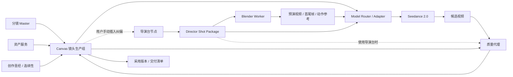

# Canvas 六类节点 × 导演台 × Blender × Seedance 2.0 完整设计方案

> 日期：2026-07-05  
> 状态：待产品评审  
> 适用范围：8080 用户端画布工作台、六类节点、模型路由、Blender 预演服务、Seedance 视频生成链路
> 设计单位：单个分镜镜头（shot）

## 1. 执行摘要

本方案将现有 8080 画布从“通用节点演示画布”升级为“真实影视方法驱动的 AI 单镜头生产控制台”。

默认核心链路为：

```text
分镜镜头 + 角色/场景/道具/音频资产
→ Canvas 绑定生产上下文
→ 模型路由与适配器编译 Seedance 多模态输入
→ Seedance 2.0 生成候选视频
→ 质量代理对比创作输入与候选视频并定位偏差区间
→ 用户在 Canvas 选择采用版本或调整输入后重新生成
```

当用户认为普通参考生成不完善、穿帮过多，或需要精确控制站位、动作、构图和运镜时，手动插入可选纠偏链路：

```text
原视频节点的分镜与参考上下文
→ 导演台完成场面调度、表演节拍、摄影机设计和连续性约束
→ Blender Worker 生成确定性预演、首尾帧和参考素材
→ 模型适配器编译 Seedance 多模态输入
→ 原视频节点产生新的候选版本
```

导演台不是独立视频编辑器，也不是 Blender 的网页替代品。它是 Canvas 内的可选单镜头纠偏节点。Seedance 不是创作状态的所有者，而是读取不可变请求快照的候选视频生成引擎。

## 2. 已确认的产品决策

1. 采用混合架构：Web 端 Three.js 实时编排，Blender 后台按需预演渲染。
2. 镜头时长从分镜自动带入，并允许用户修改；修改形成新的分镜 revision。
3. 时间线支持角色/物体的位置、旋转、缩放及摄影机参数变化。
4. 角色动画首期采用动作片段和姿势预设，不开放骨骼关节级编辑。
5. 制作过程只在浏览器实时预览；用户提交后才运行 Blender。
6. Blender 输出用于约束 AI 生图/生视频，不作为最终低模成片交付。
7. 导演台是用户手动增加的可选纠偏辅助节点，不是每个 shot 的必经 Gate；一个导演台节点只负责一个 shot。
8. 不在导演台硬编码 Seedance 的输入槽位，使用独立模型适配器。
9. 不在 Canvas 提供多轨剪辑、转场、特效叠加、混音和最终成片合成。
10. 仅完善文本、图片、视频、音频、脚本、导演台六类节点，不新增模型专属节点或生产流程节点。
11. 图片、视频、音频节点使用自动模型路由，高级用户可以覆盖具体模型。
12. 系统不分析失败候选、不建议插入导演台、不自动创建导演台；是否使用完全由用户判断。

## 3. 当前 8080 工作台审计

### 3.1 可保留基础

- Canvas 已具备节点拖拽、连线、缩放、节点创建和浮动编辑器。
- 已有文本、图片、视频、音频、脚本、导演台六类节点。
- 已有分镜专业编辑器、Workspace 资产、生成历史、工作流和任务入口。
- 导演台已采用独立编辑器入口，符合复杂工作区不塞入浮动面板的方向。
- 视频节点已有文生视频、图生视频、首尾帧视频和视频延展的基础参数框架。

### 3.2 必须修复的问题

- 账户中心不可用会阻断项目列表和画布加载，缺少个人工作区降级策略。
- 当前导演台使用 DOM/CSS 模拟舞台，不是真实 Three.js 3D 场景。
- 导演台只保存单摄像机、元素和截图，没有镜头时间线和动作片段。
- 节点只有通用输入/输出端口，无法表达角色、场景、动作、运镜等语义。
- Seedance 节点只有通用 Prompt、首帧、时长等字段，没有导演控制包。
- 资产、历史、分享、通知和部分媒体工具仍显示占位提示。
- `VideoComposeTimeline` 提供七轨剪辑与“合成导出”，违反当前产品的外部后期边界。
- `Canvas.vue` 同时承担画布、节点业务、导演台、生成、资产和时间线职责，已经形成维护瓶颈。

## 4. 目标与非目标

### 4.1 产品目标

- 用户可直接从分镜和参考素材生成视频，也可在需要纠偏时手动插入导演台。
- 用户能按镜头时长设置对象、角色和摄影机随时间变化。
- 使用导演台时，系统生成模型无关的导演控制包；所有视频请求均通过模型适配器适配 Seedance 2.0 或其他视频模型。
- 每次生成都可追溯到分镜版本、资产版本、导演快照、模型版本和成本。
- 生成结果可按构图、角色、动作、运镜、物理和节奏维度质检。
- 使用导演台的镜头能从偏差区间返回对应时间和轨道进行定向返工；未使用导演台的镜头返回原输入节点调整。

### 4.2 非目标

- 不建设 Blender 级建模、材质、骨骼、曲线和合成工作区。
- 不把 Blender 低模预演作为最终成片。
- 不在 Canvas 内建设 Premiere/剪映式多轨编辑器。
- 不在首期提供多人实时同屏编辑。
- 不保证生成模型零偏差；通过明确约束、质检和返工闭环降低偏差。

## 5. 模块职责与数据所有权

| 模块 | 拥有的数据与决策 | 不应承担 |
| --- | --- | --- |
| 分镜系统 / Canvas | 镜头编号、基础时长、台词、生产状态、节点连接、任务、成本、候选、采用版本 | 3D 关键帧和运镜曲线 |
| 资产服务 | 角色身份、服装、场景、道具、音频及其版本和文件生命周期 | 镜头中的摆位和表演 |
| 创作圣经 / 连续性服务 | 世界观、视觉风格、角色连续性、轴线和禁用项 | 单镜头具体关键帧 |
| 导演台 | 站位、朝向、视线、动作片段、相机、焦段、构图、镜头节拍、局部连续性例外 | 生成计费、模型槽位、候选采用 |
| Blender Worker | 场景重建、动画烘焙、相机预演、参考素材渲染 | 交互编辑和最终艺术渲染 |
| 模型适配器 | 将模型无关语义映射为目标模型输入、Prompt 和限制校验 | 修改导演创作意图 |
| Seedance | 根据不可变请求生成候选视频 | 改写分镜、替换资产、决定采用 |
| 质量代理 | 生成结果与请求快照的偏差分析和时间区间定位 | 自动采用或覆盖创作状态 |

所有权规则：

1. Canvas 是项目生产状态的唯一事实源。
2. 导演台是其所辅助镜头的 3D 纠偏状态唯一事实源；未插入导演台的镜头没有导演台状态。
3. 资产服务是媒体文件及版本的唯一事实源。
4. 每个模型请求必须引用不可变的请求快照；使用导演台时，请求快照同时引用不可变导演控制包。

## 6. 总体架构



### 6.1 核心边界

- Web 与 Blender 不同步 `.blend` 工程；二者读取同一版本化场景协议。
- 导演台输出模型无关的 `Director Shot Package`。
- 模型路由器根据质量、成本、速度、画幅、时长、参考素材和可用性自动选型；高级用户可以覆盖具体模型。
- Seedance Adapter 在运行时读取当前模型能力配置，不把“9 图、3 视频、3 音频”等限制写进节点领域模型。
- 已提交任务永远引用快照；用户继续编辑只会产生新 revision，不影响在途任务。
- 用户确认费用后不得静默切换模型；原模型不可用时必须重新展示替代模型和费用。

## 7. Canvas 工作台完善

### 7.1 镜头生产组

每个 shot 在 Canvas 中形成可折叠生产组，包含：

```text
分镜镜头
├── 角色 / 场景 / 道具 / 音频资产引用
├── 导演台节点（用户按需手动插入）
├── Seedance 视频节点
├── 候选与质检结果
└── 采用版本
```

生产组展示五个 Gate：

1. 输入齐套
2. 费用已确认
3. 生成完成
4. 质检完成
5. 已采用

导演台不是生产 Gate。未插入导演台的普通镜头可以直接完成全部 Gate。

### 7.2 类型化端口

首期端口类型：

| 端口类型 | 用途 |
| --- | --- |
| `text` | 普通文本、提示词、约束、角色/场景描述 |
| `shot` | 分镜镜头和基础时长 |
| `character` | 角色身份与服装版本 |
| `scene` | 场景资产与环境参考 |
| `prop` | 道具资产和初始状态 |
| `image_ref` | 构图、风格、身份参考图 |
| `motion_ref` | 动作参考视频 |
| `camera_ref` | 运镜参考视频 |
| `audio_ref` | 对白、旁白、BGM、音效、环境声或声音风格参考 |
| `director_package` | 模型无关导演控制包 |
| `video_candidate` | 生成候选视频 |
| `quality_report` | 偏差分析结果 |

连线必须通过端口兼容规则校验。通用连接迁移时按节点类型和现有元数据推断，无法推断的连接标为“待确认”，不得静默丢弃。

视频节点可接收 `text`、`shot`、`image_ref`、`audio_ref` 和 `director_package`。不兼容连接必须在拖线阶段阻止，并说明所需端口类型。

### 7.3 节点卡片

导演台节点卡片显示：

- shot 编号、时长和 FPS
- 角色、元素、摄影机、动作片段数量
- 最近预演缩略图
- 控制包状态：草稿、检查失败、可生成、已过期
- 关联 Seedance 候选数量和最新质检状态
- “打开导演台”“生成预演”“发送到 Seedance”三个主动作

Seedance 节点卡片显示：

- 模型版本与生成模式
- 请求快照 revision；使用导演台时同时显示控制包 revision
- 引用素材摘要
- 预计积分和实际结算
- 任务状态、候选数量、质检分数和采用状态

### 7.4 移除与替换

| 当前功能 | 处理 |
| --- | --- |
| 视频剪辑、视频合成快捷按钮 | 从 Canvas 移除 |
| 七轨合成时间线 | 替换为只读镜头序列和交付清单 |
| 音频截取、音频变速 | 不在 Canvas 提供；保留外部处理后的资产导入 |
| 视频高清、解析、音视频分离 | 保留为异步生产任务 |
| 分享、通知、资产、历史占位提示 | 接真实服务；未接入前隐藏而非展示假入口 |

### 7.5 六类统一节点与模型路由

节点不绑定具体模型名称，统一使用以下调用链：

```text
节点创作意图
→ 能力请求
→ 模型路由
→ 模型适配器
→ 不可变任务快照
→ 候选结果
```

每个节点共同保存：

- 输入连接及资产版本
- 任务意图和能力要求
- 自动路由或人工覆盖策略
- 预计成本、时长和质量档位
- 实际模型及版本
- 不可变请求快照
- 候选结果与采用版本
- 失败原因和重试记录

路由依据包括质量、成本、速度、画幅、时长、参考素材类型和模型可用性。模型升级只更新路由规则和适配器，不改变节点数据结构。

### 7.6 六类节点功能

#### 文本节点

- 默认是人工可编辑内容容器。
- 用途标签：普通文本、正向提示词、负向约束、角色描述、场景描述、导演指令。
- AI 能力按需调用：扩写、缩写、改写、翻译和提示词结构化。
- AI 结果先生成候选版本，用户确认后应用，不自动覆盖人工正文。

#### 脚本节点

- 接收小说、剧本或文本节点内容。
- AI 拆分后直接写入当前分镜草稿。
- 覆盖前自动保存旧版本，支持撤销和版本恢复。
- 已发布或已进入生产的分镜不得原地覆盖，只能创建新版本。
- 用户可选择全部或部分镜头，批量创建对应视频节点。
- 默认链路为“脚本分镜 → 视频”；系统不自动创建导演台。

#### 图片节点

- 同时支持上传、资产引用和 AI 生成。
- 用途标签：角色身份、服装、场景、道具、构图、风格、首帧、尾帧、生成结果。
- 支持文生图、参考图生图、多图融合、局部重绘、扩图和高清放大。
- 一个节点内部管理多个候选，用户选择采用版本。
- 连接视频节点时由用户指定参考优先级；适配器只选择必要素材，避免参考冲突。
- 所有修改产生派生版本，不覆盖原始资产。

#### 音频节点

- 同时支持上传、资产引用和 AI 生成。
- 用途标签：对白、旁白、BGM、音效、环境声和声音风格。
- 支持 TTS、音乐和音效生成，并保存音色、语言、语速和时长。
- 可与分镜时间段绑定，作为视频模型的声音或节奏参考。
- 一个节点内部管理多个候选和采用版本。
- 不提供多轨混音和最终音频合成。

#### 视频节点

- 默认直接接收脚本、文本、图片和音频参考进行生成。
- 支持文生视频、图生视频、首尾帧、全能参考和视频延展。
- 一个节点内部管理多个候选、生成快照、成本、质检和采用版本。
- 支持高清、解析、字幕、音视频分离等异步派生任务。
- 不提供视频剪辑、转场、多轨合成或最终成片合成。

#### 导演台节点

- 用户判断普通参考生成不完善或穿帮过多时，手动增加该纠偏辅助节点。
- 系统不分析失败候选、不提示插入、不自动创建。
- 插入时自动继承目标视频节点的分镜、角色、场景、图片、音频、时长和画幅。
- 不从失败候选视频反推角色站位、相机或时间线。
- 输出预演、首尾帧、动作/运镜参考及导演控制包，再交回原视频节点生成新候选版本。

### 7.7 统一节点状态与错误处理

统一状态：

```text
DRAFT → READY → ESTIMATING → AWAITING_CONFIRMATION
→ QUEUED → RUNNING → SUCCEEDED / PARTIAL / FAILED / CANCELED
```

- 输入资产失效：阻止执行并定位具体连接。
- 模型不可用：重新路由并要求用户重新确认模型和费用。
- 部分候选失败：保留成功候选，只退还失败部分费用。
- 幂等重试：沿用不可变请求快照，不重复扣费。
- 上游版本变化：下游节点标记“输入已过期”，不自动重新生成。
- 删除上游节点：保留已生成结果，但提示来源断开。
- 所有生成、派生和采用操作保留审计记录。

### 7.8 统一节点交互

节点卡片只展示用途、输入完整度、路由策略、任务状态、预计成本、候选数量、采用版本和过期状态。

浮动编辑器统一为四个页签：

```text
内容/参数｜参考素材｜候选结果｜任务记录
```

每次模型任务提交前必须展示：

- 系统推荐模型及理由
- 质量、速度和成本档位
- 实际输入参考摘要
- 预计积分
- 路由失败时的替代模型

## 8. 导演台功能设计

导演台仅在用户手动插入后存在。创建时选择目标视频节点，系统复制该视频节点当前的输入绑定形成导演台初始上下文；后续上游资产版本变化按普通依赖规则将导演台标记为过期，不自动覆盖用户已经完成的 3D 调整。

### 8.1 页面布局

```text
顶部：返回 Canvas｜SHOT 信息｜时长/FPS｜草稿状态｜生成预演｜发送到原视频节点
左侧：场景树、资产版本、对象分组、显示/锁定
中部：Three.js 3D 视口、导演视角/机位视角、Gizmo、安全框
右侧：对象属性、动作片段、摄影参数、连续性约束、控制包检查
底部：单镜头时间线
```

导演台作为独立路由或全屏工作区打开，保留 Canvas 项目、镜头和节点上下文。关闭后返回原画布视口并选中当前节点。

### 8.2 真实 3D 视口

采用 Vue 3 + Three.js：

- `WebGLRenderer`
- `OrbitControls`
- `TransformControls`
- `GLTFLoader`
- `AnimationMixer`
- 相机安全框、辅助线、地面网格、方向器和包围盒

首期对象类型：角色、道具、场景模型、基础几何体、群众组、摄像机、灯光、全景背景。

角色和道具必须引用资产版本；颜色等临时占位属性只用于未绑定正式资产的草稿状态。

### 8.3 单镜头时间线

时间线以帧为内部单位，对用户同时显示秒和时间码：

- `fps`：来自项目或镜头设置，默认 24。
- `duration_ms`：默认来自分镜。
- `frame_count = ceil(duration_ms / 1000 * fps)`。
- 修改时长必须创建新的 shot revision。

轨道类型：

| 轨道 | 内容 |
| --- | --- |
| 对象变换轨 | 位置、旋转、缩放关键帧 |
| 角色动作轨 | 站立、行走、奔跑、坐下、回头、指向等动作片段 |
| 摄影机变换轨 | 相机位置、旋转和运动路径 |
| 镜头参数轨 | 焦段/FOV、焦点、景深、注视目标 |
| 对白/节拍轨 | 对白区间、动作节拍点、关键音效点 |
| 连续性标记轨 | 入画、出画、越轴、道具状态和镜头备注 |

对象与摄影机关键帧支持线性、缓入缓出、保持和 Cubic Bézier。动作片段保存动作资产、入点、出点、循环、速度和混合时长，不保存逐骨骼关键帧。

### 8.4 真实影视控制

导演台提供五层控制：

1. 场面调度：入画、出画、站位、朝向、视线、人物距离和接触关系。
2. 表演节拍：动作片段、停顿、反应、对白对齐和动作过渡。
3. 摄影设计：景别、机位、相机高度、焦段、景深、推拉摇移和运动速度。
4. 连续性：180 度轴线、视线匹配、出入画方向、服装、道具和光线方向。
5. 模型约束：首尾帧、关键节拍帧、动作参考、运镜参考和时间码导演脚本。

### 8.5 保存与版本

- 编辑停止 1 秒后保存草稿增量。
- 手动“冻结控制包”创建不可变 revision。
- 提交 Blender 或 Seedance 前必须冻结 revision。
- 使用 `row_version` 乐观锁；冲突时提供“保留本地副本、加载远端、另存 revision”。
- 撤销/重做仅作用于当前未冻结草稿。

## 9. Blender 预演服务

Blender Worker 只服务已插入导演台的镜头。普通视频生成链路不创建 Blender 任务，也不承担额外预演成本。

### 9.1 运行方式

- 独立 Blender Worker 池，使用无界面命令行模式。
- 每个任务在隔离临时目录运行。
- 默认 Eevee 低成本渲染；不开放 Cycles 最终成片渲染。
- 资产优先使用 glTF/GLB；FBX/OBJ 在资产入库时统一转换。
- FFmpeg 将帧序列编码为 MP4。

### 9.2 输入

- 不可变 `Director Shot Package`
- 资产版本及可校验下载地址
- Blender 场景模板版本
- 渲染预设：草稿或标准预演

### 9.3 输出

- 相机运动低模预演视频
- 角色动作/交互参考视频
- 首帧、尾帧和关键节拍帧
- 相机路径和镜头参数清单
- 资产装配清单、渲染日志和校验摘要

### 9.4 一致性规则

- Web 与 Blender 使用统一的米制坐标、右手坐标约定和欧拉旋转顺序。
- 导入资产在入库阶段归一化尺寸、原点、朝向和骨骼映射。
- 动作片段使用统一 humanoid 骨架语义；不兼容资产在导演台内阻止提交。
- 相同快照、模板和资产版本的重试必须产生相同预演结构。

## 10. 模型路由与 Seedance 适配

### 10.1 模型无关能力请求

普通视频节点从脚本、文本、图片和音频连接生成模型无关能力请求，描述生成模式、时长、画幅、质量档位、参考语义和成本偏好。模型路由器据此选择 Seedance 或其他可用模型。

使用导演台时，能力请求额外引用 `Director Shot Package` 及 Blender 预演产物。导演台只输出以下语义：

- 身份参考
- 场景参考
- 道具参考
- 构图参考
- 动作参考
- 运镜参考
- 声音参考
- 时间码导演脚本
- 禁止项和连续性约束

### 10.2 Seedance Adapter

适配器职责：

1. 读取当前 Seedance 版本能力和输入限制。
2. 对参考素材按职责排序和去重。
3. 将语义参考映射为图片、视频、音频槽位。
4. 生成带 `@Image`、`@Video`、`@Audio` 引用的时间码 Prompt。
5. 检查素材职责冲突、时长、比例、主体数和槽位超限。
6. 生成不可变请求快照和可读预览。

截至本设计日期，Seedance 2.0 官方公开能力包括文本、图片、视频和音频混合输入，可同时参考最多 9 张图片、3 段视频和 3 段音频，并支持最长 15 秒的高质量多镜头音视频输出。具体限制由 Adapter 配置管理，不成为任何节点的领域常量。参考：<https://seed.bytedance.com/en/blog/seedance-2-0-official-launch>。

### 10.3 推荐参考分配

| 参考槽 | 默认职责 |
| --- | --- |
| 图片 1 | 带时间码的镜头故事板/构图表 |
| 图片 2-4 | 主要角色身份与服装 |
| 图片 5 | 场景基准 |
| 图片 6-7 | 关键道具或状态 |
| 图片 8-9 | 首帧、尾帧或关键节拍帧 |
| 视频 1 | 纯相机运动预演 |
| 视频 2 | 角色动作/交互参考 |
| 视频 3 | 风格或物理效果参考，非必填 |
| 音频 1 | 对白与准确时长 |
| 音频 2 | 动作节拍或关键音效 |
| 音频 3 | 环境氛围或音乐节奏，非必填 |

适配器可以根据实际镜头裁剪分配；“填满所有槽位”不是目标，避免相互冲突的参考比增加素材数量更重要。

## 11. 质量闭环

### 11.1 质检维度

- 角色身份和服装一致性
- 构图、景别和主体位置偏差
- 动作顺序、接触关系和节奏偏差
- 摄影机轨迹、焦点和景别变化偏差
- 穿模、肢体异常、物理逻辑和遮挡问题
- 对白、关键音效与动作时间对齐
- 跨镜头轴线、视线、出入画方向和道具连续性

### 11.2 结果结构

每个问题必须包含：

- `dimension`
- `severity`
- `start_ms` / `end_ms`
- `expected`
- `observed`
- `source_node_id`
- `source_track_id`
- `suggested_action`

未使用导演台时，用户点击问题回到对应脚本、文本、图片、音频或视频参数；已使用导演台且问题能映射到轨道时，才跳转导演台对应时间和轨道。质量报告不得建议、创建或自动插入导演台，是否使用由用户自行判断。

### 11.3 候选与采用

- 一个生成任务可产生 1-8 个候选。
- 候选保留输入快照、模型版本、seed、成本和质检报告。
- 用户可将一个候选标为采用版本。
- 采用决策回写分镜 Master 和交付清单，不删除其他候选。

## 12. 核心数据模型

### 12.1 通用节点模型策略与任务快照

```json
{
  "node_id": "node_video_01",
  "node_type": "video",
  "purpose_tags": ["shot_output"],
  "model_policy": {
    "mode": "auto",
    "override_model_id": null,
    "quality_tier": "standard",
    "cost_preference": "balanced"
  },
  "input_bindings": [],
  "adopted_output_version_id": null,
  "row_version": 4
}
```

```json
{
  "request_snapshot_id": "req_01",
  "node_id": "node_video_01",
  "intent": "video_generation",
  "capability_request": {},
  "resolved_model_id": "seedance-2.0",
  "resolved_model_version": "resolved-at-submit",
  "input_versions": [],
  "estimated_cost": 0,
  "status": "QUEUED",
  "created_at": "2026-07-05T00:00:00+08:00"
}
```

### 12.2 Director Shot Package

```json
{
  "package_id": "dsp_01",
  "revision": 3,
  "project_id": "cp_01",
  "shot_id": "shot_03",
  "shot_revision": 5,
  "duration_ms": 6000,
  "fps": 24,
  "coordinate_system": "RH_Y_UP_METERS",
  "asset_refs": [
    { "role": "character", "asset_id": "char_a", "version_id": "v7" }
  ],
  "scene": { "objects": [], "lights": [], "environment": {} },
  "timeline": {
    "transform_tracks": [],
    "action_tracks": [],
    "camera_tracks": [],
    "beat_tracks": [],
    "continuity_markers": []
  },
  "director_script": [],
  "constraints": [],
  "created_at": "2026-07-05T00:00:00+08:00"
}
```

### 12.3 控制包状态

```text
DRAFT → VALIDATING → READY → FROZEN
  ↑         ↓
  └── INVALID

FROZEN → RENDERING_PREVIEW → PREVIEW_READY
FROZEN → GENERATING → GENERATED → EVALUATED → ADOPTED
```

冻结后不可修改；修订必须从冻结版本派生新草稿。

### 12.4 Seedance 请求快照

```json
{
  "request_snapshot_id": "sreq_01",
  "director_package_id": null,
  "director_package_revision": null,
  "adapter_id": "seedance",
  "adapter_version": "2.0-config-2026-07",
  "model_id": "seedance-2.0",
  "model_version": "resolved-at-submit",
  "references": [],
  "prompt": "...",
  "negative_constraints": [],
  "estimated_cost": 0,
  "created_at": "2026-07-05T00:00:00+08:00"
}
```

## 13. API 边界

建议新增以下项目级 API：

| 方法 | 路径 | 用途 |
| --- | --- | --- |
| POST | `/api/v1/canvas/nodes/{nodeId}/model-requests/preview` | 路由模型并预览输入、理由和费用 |
| POST | `/api/v1/canvas/nodes/{nodeId}/model-requests` | 为文本、图片、视频或音频节点创建模型任务 |
| GET | `/api/v1/canvas/nodes/{nodeId}/candidates` | 读取节点候选和采用版本 |
| POST | `/api/v1/canvas/nodes/{nodeId}/adoptions` | 选择节点采用版本 |
| POST | `/api/v1/canvas/nodes/{nodeId}/director-context` | 为用户手动创建的导演台复制视频节点上下文 |
| GET | `/api/v1/canvas/projects/{projectId}/shots/{shotId}/director` | 读取导演台当前草稿与版本摘要 |
| PUT | `/api/v1/canvas/projects/{projectId}/shots/{shotId}/director/draft` | 乐观锁保存草稿 |
| POST | `/api/v1/canvas/projects/{projectId}/shots/{shotId}/director/validate` | 校验控制包 |
| POST | `/api/v1/canvas/projects/{projectId}/shots/{shotId}/director/freeze` | 冻结 revision |
| GET | `/api/v1/director-packages/{packageId}` | 读取不可变控制包 |
| POST | `/api/v1/director-packages/{packageId}/preview-renders` | 创建 Blender 预演任务 |
| POST | `/api/v1/director-packages/{packageId}/model-requests/preview` | 预览导演控制包的模型适配结果和成本 |
| POST | `/api/v1/director-packages/{packageId}/model-requests` | 使用导演控制包创建视频生成任务 |
| GET | `/api/v1/video-candidates/{candidateId}/quality-report` | 获取偏差报告 |
| POST | `/api/v1/canvas/projects/{projectId}/shots/{shotId}/adoptions` | 采用候选版本 |

写接口必须携带 `Idempotency-Key`；草稿更新必须携带 `If-Match`；冲突返回 409。异步任务统一进入任务事件中心。

## 14. 故障与降级

| 故障 | 产品行为 |
| --- | --- |
| 账户中心不可用 | 已登录个人用户可读取最近项目缓存和当前草稿；禁止新建、分享和跨工作区操作；明确显示只读/离线状态 |
| WebGL 不可用 | 允许查看控制包和历史预演；禁用 3D 编辑并提供图形加速提示 |
| 资产下载失败 | 标出具体资产和版本；不提交 Blender/Seedance |
| Blender Worker 失败 | 保留快照和日志，可幂等重试；不影响导演草稿 |
| Seedance 超时或失败 | 结算/退还按统一任务规则执行；保留请求快照和重试入口 |
| 模型限制变化 | Adapter 配置更新；旧请求快照仍可审计，不强行重放不兼容请求 |
| 质检失败 | 候选可查看但默认不可采用；具备权限的用户可填写原因强制采用 |
| 乐观锁冲突 | 不覆盖远端，提供分支和差异摘要 |

## 15. 安全、授权与许可

- 资产下载使用短期签名 URL，Worker 不持久保存业务凭证。
- Worker 任务目录完成后清理；日志不得记录 Prompt 中的敏感信息和签名 URL。
- 真人肖像参考必须记录授权或身份验证状态。
- 用户只能读取当前 Workspace 内的资产、控制包、任务和候选。
- DVStudio 仓库采用 MPL-2.0。本方案借鉴其产品模式；如复用源码，必须将修改过的 MPL 文件独立管理并履行许可义务，不能直接无声明复制到闭源核心模块。

## 16. 工程拆分

前端建议从 `Canvas.vue` 拆出：

```text
src/views/canvas/
├── workspace/              # 画布壳、视口、选择、连线
├── nodes/                  # 节点卡片和类型注册
├── ports/                  # 类型化端口和兼容规则
├── shot-groups/            # 镜头生产组和 Gate
├── director/               # 导演台路由和 UI
│   ├── viewport/           # Three.js 生命周期
│   ├── timeline/           # 单镜头时间线
│   ├── scene-tree/         # 场景树
│   ├── inspector/          # 属性/摄影/约束
│   └── package/            # 校验和控制包预览
├── generation/             # 模型适配预览、任务、候选
└── quality/                # 质检报告和偏差跳转
```

后端建议新增：

```text
module/director/
├── domain/                 # 控制包、轨道、约束
├── service/                # 草稿、冻结、版本和校验
├── adapter/                # Blender 与模型适配接口
├── controller/
└── persistence/

module/modelrouting/
├── domain/                 # 能力请求、模型策略、候选和采用版本
├── router/                 # 质量/成本/速度/可用性路由
├── adapters/               # 文本、图片、视频和音频模型适配器
├── service/                # 预估、确认、快照、重试和结算
└── controller/

workers/blender/
├── scene_builder.py
├── animation_baker.py
├── camera_builder.py
├── renderer.py
└── manifest.py
```

## 17. 分阶段交付

本文件是跨模块总体设计，不对应一次性实施。M0、M1、M2、M3 必须分别形成独立实施计划、独立验收和可回滚发布；上一阶段的数据契约和验收通过后才进入下一阶段。

### M0：稳定底座

- 修复账户中心故障关闭和个人工作区降级。
- 引入类型化端口和连接兼容规则。
- 建立六类节点的通用模型策略、任务快照、候选和采用版本模型。
- 完成文本/脚本安全版本、图片/音频用途标签和视频多候选基础能力。
- 建立 director draft/revision/snapshot 数据模型。
- 节点任务接入统一任务事件中心。
- 移除或隐藏未接入的假入口和多轨合成界面。
- 拆分 `Canvas.vue` 的导演台与节点注册职责。

### M1：真实导演台

- Three.js 视口、场景树、TransformControls、GLB 加载。
- 单镜头时间线、对象关键帧、摄影机关键帧和 Cubic Bézier。
- 动作片段轨和基础动作库。
- 时长/FPS、首尾状态、连续性基础检查。
- 自动保存、撤销重做、乐观锁和冻结 revision。

### M2：模型适配、Blender 与 Seedance

- 模型路由器和文本、图片、视频、音频 Adapter。
- Director Shot Package v1。
- Blender Worker、Eevee 预演和 FFmpeg 编码。
- 首尾帧、动作参考和运镜参考输出。
- 模型适配器框架与 Seedance 2.0 Adapter。
- 多模态引用预览、冲突校验、成本预估和请求快照。

### M3：质量闭环

- 候选版本对比和采用状态。
- 构图、角色、动作、运镜和物理偏差检测。
- 偏差区间跳转和定向返工。
- 跨镜头连续性检查。
- 镜头模板、参考包 A/B 评估和采用率统计。

## 18. 验收标准

### 18.1 功能验收

- 普通镜头无需导演台即可从脚本和参考素材生成视频。
- 用户可从目标视频节点手动创建导演台，系统继承现有上下文但不分析失败候选。
- 系统不得主动建议、自动插入或自动创建导演台。
- 文本 AI 辅助结果必须先生成候选版本，用户确认后才能应用。
- 脚本 AI 拆分可以写入当前草稿，但覆盖前必须保存旧版本；已发布版本不得原地覆盖。
- 图片和音频节点支持用途标签、多候选和采用版本。
- 视频节点在一个节点内管理多个候选，不覆盖历史结果。
- 自动模型路由必须展示推荐理由、输入摘要和预计成本，高级用户可以覆盖模型。
- 分镜时长自动带入，修改后生成新 revision 并在 Canvas 可追踪。
- 用户可在真实 3D 视口添加/绑定角色、场景、道具和摄影机。
- 用户可在时间线设置对象与摄影机关键帧，并实时播放。
- 用户可排布动作片段并设置混合时长。
- 冻结控制包后继续编辑不会改变已提交任务。
- Blender 可根据快照输出同长度预演、首尾帧和清单。
- Seedance 请求预览清楚显示每个参考素材的职责和引用编号。
- 候选结果可追溯到请求快照、资产、模型和成本；使用导演台时同时追溯控制包。
- 质检问题可定位到具体时间区间和来源节点；已有导演台轨道时才定位轨道。
- 采用版本回写分镜 Master 和交付清单。

### 18.2 可靠性验收

- 相同幂等键不得重复创建渲染或生成任务。
- 草稿并发修改不得静默覆盖。
- 账户中心、Blender 或 Seedance 任一依赖失败时，用户草稿不丢失。
- 资产版本失效时禁止提交并准确指出缺失项。
- 异步任务失败后积分结算状态可审计和补偿。

### 18.3 产品指标

试运行阶段采集基线后，以相对改善为验收：

- 普通镜头从分镜确认到提交生成的中位耗时。
- 使用导演台的纠偏镜头从打开导演台到重新提交生成的中位耗时。
- 首次生成可采用率。
- 因角色、构图、动作或运镜偏差导致的重生成率。
- 单个采用镜头平均生成次数和积分成本。
- 普通请求检查及导演控制包检查发现并阻止的冲突数量。
- 质检定位后定向返工的成功率。

首期目标沿用现有导演台 PRD：多角色镜头无效抽卡次数相对基线降低至少 30%。

## 19. 测试策略

### 19.1 单元测试

- 时间与帧换算、关键帧插值、动作片段重叠和混合。
- 类型化端口兼容矩阵。
- 模型路由的质量/成本/速度选择、人工覆盖和不可用回退。
- 文本候选应用、脚本安全覆盖、媒体用途标签和多候选采用。
- 控制包 schema 校验和哈希稳定性。
- Seedance 参考排序、去重、槽位限制和 Prompt 引用。
- 连续性规则、越轴、出入画和视线方向检测。

### 19.2 集成测试

- 分镜/文本/图片/音频 → Adapter → 视频候选的普通生成链路。
- 视频上下文 → 用户手动导演台 → 冻结 → Blender → Adapter → 新视频候选的纠偏链路。
- 脚本 AI 拆分覆盖前版本保存、已发布版本派生和批量视频节点创建。
- 资产版本替换后的过期传播。
- 乐观锁冲突和幂等任务重试。
- 任务结算、失败退还和事件中心回写。
- 候选质检、定向返工和采用版本回写。

### 19.3 视觉与端到端测试

- 不同画幅下安全框、相机预览和截图一致性。
- Web 与 Blender 对象位置、朝向、焦段和时长的一致性。
- 典型镜头：双人对话、角色入画、跟拍、推近、群体场面和道具交互。
- WebGL 降级、网络中断、任务失败和浏览器刷新恢复。

## 20. 方案结论

完善后的 8080 画布不是用更多按钮替代影视制作，而是让六类节点通过统一模型路由形成可追踪的生产数据；普通镜头直接生成，只有用户认为参考生成不完善或穿帮过多时，才用导演台补充场面调度、表演节拍、摄影设计和连续性约束。

最终产品价值不是“自动生成一个视频”，而是：

1. 让文本、脚本、图片、音频和视频节点各自表达清晰的创作意图，并保留候选与版本。
2. 让普通镜头以最短链路直接调用合适模型。
3. 让用户在需要时手动使用导演台和 Blender 提供确定性空间与运动参考。
4. 让模型适配器稳定地翻译不同模型的输入协议。
5. 让 Seedance 负责高质量候选生成而不是自由猜测。
6. 让质量代理和版本系统把概率生成变成可审计、可返工、可采用的生产流程。
