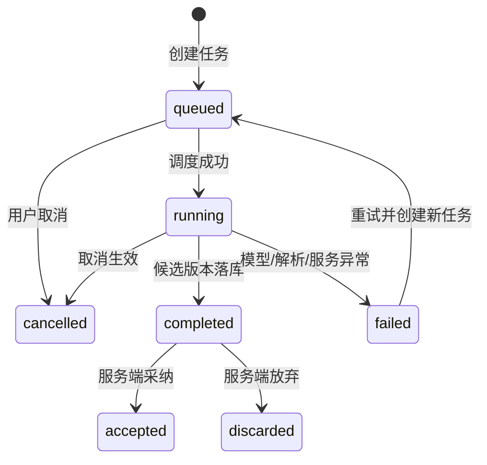

# 漫剧视频创作平台 PRD

> 文档版本：V2.0  
> 文档状态：研发评审稿  
> 编写日期：2026-08-06
> 需求来源：`未命名文件夹 4` 内 14 张腾讯视频智能制作平台截图  
> 适用对象：产品、交互、视觉、前端、后端、算法、测试、项目管理

---

## 1. 文档说明

### 1.1 编写目的

本文档用于定义“漫剧视频创作平台”从创作设置到文字分镜产出的完整产品需求，覆盖以下八阶段生产链路：

1. 创作设置
2. 小说上传与原文确认
3. 小说分析
4. 改编方案
5. 结构化文字剧本
6. 剧本正文
7. 审核修订
8. 文字分镜

本文档以截图、原始 PRD 和已确认交互原型为基础，补齐创作设置、审核修订、阶段确认、过渡进度、项目管理、任务恢复、版本比较及导出配置，使研发团队可以据此完成技术评审、任务拆分、工作量估算、开发与验收。V2.0 的八阶段定义优先于本文历史章节中沿用的旧步骤编号。

### 1.2 需求可信度标识

| 标识 | 含义 | 处理原则 |
|---|---|---|
| `截图确认` | 页面、字段或行为可从截图直接确认 | V1 必须实现 |
| `流程推导` | 根据上下游数据关系和常见创作流程补齐 | V1 按本文默认规则实现；业务变更需走需求变更流程 |
| `工程补齐` | 为保证系统可开发、可维护而增加 | V1 必须实现核心能力 |

### 1.3 产品边界

V1 聚焦“小说文本到可供后续视频制作使用的文字分镜”的 AI 辅助创作闭环。

V1 包含：

- 单项目八阶段串行创作流程，每一阶段均需显式确认后开放下一阶段。
- AI 内容生成、人工编辑、自动保存、版本留痕。
- 章节解析、人物与世界观分析、改编策略、分集结构、剧本与文字分镜生成。
- 生成任务状态管理、失败重试、取消、重新生成。
- 用户自主选择 3001 已配置模型；无可用模型时使用内置演示模型兜底。
- 采用与 3001 一致的积分扣减、预扣、结算和返还规则。
- 全部创作产物以 Obsidian 多文件 Markdown 文档库管理，并保留依赖、版本和变更影响。
- 项目级权限、操作审计、基础埋点。

V1 不包含：

- 图片、视频、配音、音乐等多媒体资产的真实生成。
- 视频时间线剪辑、合成、渲染及发布。
- 多人实时协同编辑与评论批注。
- 模型训练、模型市场及底层模型参数开放配置。
- 充值、人民币结算、发票、版权交易和内容分发；积分消耗记录属于 V1 范围。

---

## 2. 产品概述

### 2.1 产品定位

面向漫剧内容创作者与制作团队的 AI 智能改编工作台，将长篇小说逐层转换为结构化创作资产，降低人工拆书、提炼人物、设计高压场景、编写剧本和拆分镜头的成本。

### 2.2 核心问题

- 小说信息量大，人工提取人物、事件、世界观耗时且口径不一致。
- 小说叙事不天然适配短剧/漫剧节奏，需要重新设计开场、冲突、钩子和分集结构。
- 改编方案、结构化剧本、正文和分镜之间容易发生信息断层。
- AI 生成时间长且可能失败，缺少任务状态、重试和版本管理会显著影响可用性。
- 上游内容调整后，下游产物可能失效，需要明确依赖和重生成机制。

### 2.3 产品目标

| 目标 | V1 衡量方式 |
|---|---|
| 建立端到端创作闭环 | 用户可在同一项目中完成八阶段并导出文字分镜 |
| 降低信息整理成本 | 小说解析后自动生成故事、人物、事件、世界观结构化结果 |
| 提升改编可控性 | 用户可选择高压开场、编辑改编规则并逐集生成 |
| 保证生产过程可恢复 | 所有生成任务有状态、失败原因、重试入口和历史版本 |
| 保证上下游一致性 | 上游变更触发下游“可能已过期”提示及重生成决策 |

### 2.4 核心成功指标

| 指标 | 定义 | V1 目标 |
|---|---|---|
| 八阶段流程完成率 | 进入阶段 1 的项目中完成阶段 8 的比例 | 上线后基线观察，首月目标 ≥ 25% |
| 单步生成成功率 | 生成任务成功数 / 已结束生成任务数 | ≥ 95% |
| 失败可恢复率 | 失败后通过重试成功的任务数 / 发起重试任务数 | ≥ 80% |
| 人工保存成功率 | 成功保存次数 / 保存请求次数 | ≥ 99.9% |
| 下游过期识别率 | 上游关键版本变化后正确标记下游的比例 | 100% |
| 分镜导出成功率 | 导出成功次数 / 导出请求次数 | ≥ 99% |
| Markdown 同步正确率 | 内容修改后正确更新目标文档并标记关联文档的比例 | 100% |
| 积分账实一致率 | 平台积分流水与 3001 最终 quota 记录一致的任务比例 | 100% |

---

## 3. 用户与权限

### 3.1 用户角色

| 角色 | 核心诉求 | 默认权限 |
|---|---|---|
| 内容创作者 | 快速完成小说拆解、改编、剧本与分镜 | 新建项目、上传、生成、编辑、导出 |
| 内容审核人员 | 检查结构、内容风险和上下游一致性 | 查看、审核标记、导出；默认不可覆盖创作者版本 |
| 项目管理员 | 管理成员、配置项目、处理异常 | 项目全权限、成员权限、归档与恢复 |

### 3.2 权限矩阵

| 操作 | 内容创作者 | 内容审核人员 | 项目管理员 |
|---|:---:|:---:|:---:|
| 创建项目 | ✓ | — | ✓ |
| 上传/替换小说 | ✓ | — | ✓ |
| 发起/取消/重试生成 | ✓ | — | ✓ |
| 编辑生成结果 | ✓ | — | ✓ |
| 查看全部步骤 | ✓ | ✓ | ✓ |
| 查看版本历史 | ✓ | ✓ | ✓ |
| 导出 | ✓ | ✓ | ✓ |
| 成员与权限管理 | — | — | ✓ |
| 归档/恢复项目 | — | — | ✓ |

权限由后端校验，前端隐藏无权限入口并不能替代接口鉴权。

---

## 4. 核心流程与状态

### 4.1 八阶段主流程


### 4.2 步骤准入规则

| 目标步骤 | 前置条件 | 未满足时处理 |
|---|---|---|
| 小说上传与原文确认 | 创作设置已确认 | 显示缺失项目参数，返回阶段 1 |
| 小说分析 | 小说上传、解析成功且原文已确认 | 确认按钮保持可点击，点击后说明缺失条件并定位原文确认 |
| 改编方案 | 小说分析存在成功版本 | 展示缺失项和返回步骤 2 入口 |
| 结构化文字剧本 | 改编方案已确认 | 展示“请先确认改编方案” |
| 剧本正文 | 至少一集结构化文字剧本已确认 | 仅开放已有结构的集数 |
| 审核修订 | 对应集剧本正文检查完成 | 仅开放已有正文的集数 |
| 文字分镜 | 对应集审核通过 | 仅开放已审核通过的集数 |

用户可返回已完成步骤查看和编辑。跳转到未满足前置条件的步骤时，保留导航可见性，但内容区显示准入提示，不自动发起生成。

### 4.3 项目状态

| 状态 | 说明 | 可执行操作 |
|---|---|---|
| `DRAFT` | 已创建但未上传有效小说 | 上传、编辑项目名称、删除 |
| `IN_PROGRESS` | 八阶段流程处理中 | 查看、生成、编辑、导出已有产物 |
| `COMPLETED` | 已产生至少一份有效文字分镜 | 查看、编辑、重新生成、导出 |
| `ARCHIVED` | 项目归档 | 查看、恢复；禁止生成和编辑 |

项目状态不等于生成任务状态。只要存在可操作产物，单个任务失败不应将项目整体置为失败。

### 4.4 生成任务状态机



生产生成任务状态枚举：`queued`、`running`、`completed`、`failed`、`cancelled`。`completed` 只表示隔离的 candidate 已落库；`accepted`、`discarded` 是结果决定。阶段流转任务在页面层可继续使用 `QUEUED`、`RUNNING`、`SUCCEEDED`、`FAILED`、`CANCELED` 映射表示进度与持久化完成，但不得与生成候选状态混为一谈。

规则：

- 同一项目、同一步骤、同一目标集数仅允许一个活动任务。
- 重试必须创建新 `task_id`，并通过 `retry_of_task_id` 关联原任务。
- 取消为尽力而为；若模型已返回且结果完成落库，任务可转为成功，并提示“取消未生效，结果已生成”。
- 前端通过 SSE/WebSocket 接收状态；不可用时每 3 秒轮询，任务结束后停止。
- 任务失败必须返回稳定错误码、用户可读提示和可追踪 `request_id`。

### 4.5 上游变更与下游失效

每个步骤产物保存独立版本。生成下游产物时记录全部输入版本号。

| 变更位置 | 受影响范围 | 默认处理 |
|---|---|---|
| 修改创作设置关键字段 | 阶段 2–8 | 全部标记 `STALE` |
| 替换小说文件/章节内容 | 阶段 3–8 | 全部标记 `STALE` |
| 修改小说分析 | 阶段 4–8 | 全部标记 `STALE` |
| 修改改编方案 | 阶段 5–8 | 全部标记 `STALE` |
| 修改某集分集结构 | 该集阶段 6–8 | 对应集标记 `STALE` |
| 修改某集剧本正文 | 该集阶段 7–8 | 对应集标记 `STALE` |
| 修改审核通过后的正文 | 该集阶段 8 | 对应集标记 `STALE` |

`STALE` 仅表示“可能已过期”，不删除已有内容。用户进入受影响步骤时可选择：

1. 保留当前版本继续编辑。
2. 基于最新上游重新生成，并创建新版本。
3. 查看上游变更摘要后再决定。

### 4.6 阶段确认与过渡进度

阶段 1–7 的主内容底部固定展示统一操作区：左侧为“返回上一步”和“保存草稿”，右侧唯一主按钮为“确认当前阶段并进入下一步”。阶段 8 展示“返回上一步”“保存草稿”“导出创作包”“送入画布工作台”和“确认并锁定文字分镜”。

点击确认按钮后不得直接跳转，必须进入独立的**阶段过渡进度页**。该页面采用百分比加载形式，页面只展示“正在进入下一阶段”、下一阶段名称、大号百分比、单条进度条、简短状态文案和“返回当前阶段”。任务编号、请求编号及技术错误详情统一在任务中心查看，不在加载页常驻展示。

百分比规则：

- `QUEUED` 对应 `0%–20%`，`RUNNING` 对应 `21%–99%`；前端可在当前状态区间内平滑展示，但不得用计时结果判定任务成功。
- 到达 `99%` 后等待后端真实结果，只有 `SUCCEEDED` 可以显示 `100%`。
- 收到 `SUCCEEDED` 时先将下一阶段置为 `READY`，显示 `100%` 并停留 500ms，随后自动进入下一阶段，不再要求用户二次点击。
- `QUEUED/RUNNING` 时允许返回当前阶段并取消任务；取消不丢失当前产物和确认版本。
- `FAILED` 时百分比停止，页面显示“加载失败”、简短错误原因、“重新加载”和“返回当前阶段”；重新加载创建新任务并关联原失败任务。
- 刷新加载页时，根据任务真实状态恢复百分比；不得从 `0%` 无条件重新开始。
- 页面使用 `role="progressbar"`，同步维护 `aria-valuemin`、`aria-valuemax`、`aria-valuenow`，状态文案使用 `aria-live="polite"`。

流转确认必须创建不可变阶段快照，记录 `project_id`、`from_stage`、`to_stage`、`input_version_ids`、`confirmed_version_id`、`operator_id`、`task_id` 和时间。用户返回修改已确认内容时，新建版本并按 4.5 标记下游，不覆盖原快照。

验收要求：七次阶段流转共用同一百分比加载页；连续双击确认只创建一个活动任务；刷新可恢复真实状态；取消后仍停留在原阶段；失败可重试；`SUCCEEDED` 前不得显示 `100%`；显示 `100%` 500ms 后自动进入下一阶段；任务成功前下一阶段不可进入。

---

## 5. 全局页面与通用能力

### 5.1 页面框架（截图确认）

- 默认首页：提供快速创作、专业创作、上传小说、TVC 创作四类入口，展示待处理任务和最近项目。
- 项目列表页：支持状态筛选、搜索、继续创作、查看详情和归档项目。
- 项目详情页：展示项目配置、八阶段进度、最近任务、有效产物、版本和归档操作。
- 左上角显示面包屑：`全部项目 / 项目名称`。
- 左侧显示八阶段步骤条、阶段状态和按已完成阶段计算的总进度。
- 顶部中间展示当前处理范围和说明，例如“目前仅支持小说前 3 集分镜”。
- 顶部右侧展示章节范围，例如“取自前 50 章”。
- 主内容区根据步骤切换。
- 页面底部提供统一阶段确认区；确认后进入阶段过渡进度页。
- 部分步骤右侧提供“历史版本”入口。

### 5.1.1 全局功能页面清单

| 页面/弹层 | 入口 | 核心内容 | 关闭/完成后 |
|---|---|---|---|
| 默认首页 | 进入剧本创作模块 | 创作入口、待处理任务、最近项目 | 进入创作设置或指定项目 |
| 项目列表页 | 首页“全部项目” | 搜索、筛选、项目状态、当前阶段、更新时间 | 打开项目详情或继续创作 |
| 项目详情页 | 项目列表“查看详情” | 配置、进度、任务、版本、产物 | 返回列表或继续创作 |
| 任务中心 | 顶部任务入口 | 任务类型、范围、状态、错误、重试 | 定位到对应阶段 |
| 版本历史 | 工作台顶部 | 版本来源、创建人、输入版本 | 打开版本对比或恢复 |
| 版本对比 | 历史版本“对比” | 字段级/文本级差异和下游影响 | 返回历史版本 |
| 重新生成配置 | 工作台“重新生成” | 生成范围、输入版本、临时指令 | 创建异步任务 |
| 下游影响确认 | 保存上游变更 | 受影响阶段、旧版本保留策略 | 标记 `STALE` 或保持旧版 |
| 导出配置 | 工作台/阶段 8 | 范围、版本、格式、文件名 | 创建导出任务 |
| 阶段过渡进度页 | 阶段确认按钮 | 路径、状态、任务、进度、错误 | 进入下一阶段或返回当前阶段 |

### 5.1.2 工作台功能入口分层

阶段工作台顶部不固定展示“任务中心、历史版本、重新生成、依赖影响、创作设置、返回首页”六按钮组。顶部只保留项目面包屑、项目名称、阶段状态、自动保存状态、当前阶段版本和“更多”菜单，避免低频全局操作与当前阶段任务竞争。

| 功能 | 调整后入口 | 显示规则 |
|---|---|---|
| 任务中心 | 默认首页待办“查看全部”、项目详情 | 全局入口，不在每个阶段重复 |
| 历史版本 | 当前阶段标题右侧“Vx · 历史版本” | 阶段内常驻，默认筛选当前阶段 |
| 重新生成 | 当前阶段主要产物下方 | 阶段已有可重新生成产物时显示 |
| 依赖影响 | `STALE` 提示区或保存上游变更后的确认弹层 | 仅存在受影响下游时显示 |
| 创作设置 | 阶段 1 页面；阶段 2–8 的“更多 → 项目设置” | 修改确认版前展示下游影响 |
| 返回首页 | “全部项目 / 当前项目”面包屑 | 全阶段常驻；离开前完成即时保存 |

“更多”菜单只包含项目设置、项目详情和归档项目。菜单需支持鼠标点击、键盘聚焦和 `Esc` 关闭；关闭后焦点返回触发按钮。重新生成、历史版本和依赖影响不得重复放入“更多”菜单。

### 5.2 自动保存（工程补齐）

- 文本或结构化字段变更后 1 秒防抖自动保存。
- 页面离开、切换步骤和关闭浏览器前触发一次即时保存。
- 保存状态依次显示：`未保存`、`保存中`、`已保存`、`保存失败`。
- 保存请求携带 `base_version`；版本冲突返回 `409 VERSION_CONFLICT`。
- V1 不支持多人实时合并。发生冲突时保留本地草稿，提示用户刷新最新版本或复制本地内容后处理。
- 浏览器本地临时草稿保留 24 小时，服务端保存成功后清除。

### 5.3 历史版本（工程补齐）

- AI 每次成功生成创建一个主版本。
- 人工编辑按连续会话合并为编辑版本：最后一次输入后 5 分钟或离开页面时封版。
- 版本列表展示版本号、来源（AI 生成/人工编辑/回滚）、创建人、时间和输入版本。
- 用户可查看版本内容、对比当前版本、恢复为新版本。
- 恢复操作不覆盖历史记录。

### 5.4 重新生成

重新生成前弹窗展示：

- 本次使用的上游版本。
- 将生成的范围（全部/指定集/指定场景）。
- 当前人工修改是否会被新版本替代。
- “保留当前版本并生成新版本”作为唯一默认行为。

### 5.5 空、加载与错误状态

| 场景 | 页面反馈 | 可用操作 |
|---|---|---|
| 首次进入且无数据 | 解释前置步骤和产物价值 | 返回前置步骤 |
| 生成排队 | 展示排队状态，不展示虚假百分比 | 取消 |
| 生成中 | 展示阶段文案和已耗时 | 取消、离开页面 |
| 生成失败 | 展示错误原因和请求编号 | 重试、反馈问题 |
| 网络中断 | 保留本地草稿并提示离线 | 重连后保存 |
| 产物已过期 | 顶部黄色提示条 | 查看变更、重新生成、继续使用 |

### 5.6 阶段一：创作设置

创作设置必须位于小说上传之前，用于确定后续所有生成任务的全局约束。

| 字段 | 类型/约束 | 默认值 | 下游影响 |
|---|---|---|---|
| `project_name` | 1–80 字 | 自动取首句，可编辑 | 文件名、项目列表、导出 |
| `creation_type` / `generation_mode` | 短剧/长篇/TVC；快速/专业 | 短剧、专业创作 | 流程、结构模板与交付 |
| `source_type` / `target_type` | 来源及目标成片类型 | 小说文本、AI 漫剧 | 解析、正文与分镜模板 |
| `platform` / `audience` | 平台与受众枚举 | 抖音、女频 | 安全、节奏与推荐策略 |
| `episodes` / `episode_duration` | 1–200 集；60–180 秒 | 40 集、90 秒 | 分集规模与节拍 |
| `language` / `aspect_ratio` | 语言；9:16/16:9/1:1 | 简中、9:16 | 文本与分镜构图 |
| `safety_level` | 平台标准/青少年友好/品牌安全 | 平台标准 | 审核规则 |
| `genre` / `plots` / `tones` / `setting` | 题材单选；情节/情绪各最多 3 个；时空单选 | 用户选择 | 分析、改编、正文与视觉 |

用户点击“确认当前阶段并进入下一步”时校验必填字段，成功后创建配置快照并进入阶段过渡进度页。已生成下游内容后修改关键字段，必须先展示下游影响确认，不允许静默覆盖。

验收标准：默认值正确；多选上限有效；必填错误定位到字段；刷新后配置可恢复；确认后阶段 2 才开放；修改确认版会新建版本并正确标记阶段 2–8 为 `STALE`。

---

### 5.7 Obsidian Markdown 文档库

#### 5.7.1 管理原则

每个剧本项目对应一个独立 Obsidian Vault。业务数据库保存项目、任务、版本、依赖和权限等结构化索引；Markdown 文件保存可读、可迁移的创作内容。数据库是状态与权限事实源，Markdown 是内容交付事实源，两者通过 `artifact_id + version` 建立幂等映射。

任何人工保存、AI 生成、采纳 AI 差异、审核修订或阶段确认均需：

1. 创建产物新版本，不覆盖历史版本。
2. 原子更新当前 Markdown 文件。
3. 根据依赖图计算受影响产物，将下游标记为 `STALE`。
4. 追加 `90-变更影响.md`，记录来源、变更字段、下游产物和处理状态。
5. AI 操作追加 `99-生成与计费记录.md`；纯人工编辑不产生积分，但仍记录版本来源。

#### 5.7.2 Vault 目录规范

```text
项目名/
├── 00-项目主页.md
├── 01-创作设置.md
├── 02-小说原文/
│   └── 00-原文索引.md
├── 03-小说分析/
│   ├── 故事梗概.md
│   ├── 主要事件.md
│   ├── 章节大纲.md
│   ├── 世界观.md
│   └── 人物/
│       ├── 00-人物索引.md
│       └── CHAR-NNN-姓名.md
├── 04-场景资产/
│   ├── 00-场景资产索引.md
│   └── SCENE-ASSET-NNN-名称.md
├── 04-改编方案.md
├── 05-分集结构/
│   └── EP-NNN-单集结构.md
├── 06-剧本正文/
│   └── EP-NNN-剧本正文.md
├── 07-审核修订/
│   └── EP-NNN-审核记录.md
├── 08-文字分镜/
│   └── EP-NNN-文字分镜.md
├── 90-变更影响.md
└── 99-生成与计费记录.md
```

`00-项目主页.md` 为导航首页，使用 Obsidian `[[双链]]` 指向当前有效产物；`90-变更影响.md` 是待同步工作台；`99-生成与计费记录.md` 是生成任务与积分流水的用户可读镜像。

#### 5.7.3 Markdown Frontmatter

所有产物文件至少包含：`project_id`、`artifact_id`、`artifact_type`、`stage`、`status`、`version`、`updated_at`、`updated_by`、`depends_on`、`affects`、`stale`。依赖使用 Obsidian 双链表示。正文采用固定二级标题，数组使用列表，结构化复杂字段可使用 JSON 代码块，保证可读性和机器可解析性。

#### 5.7.4 关联修改规则

| 上游文件 | 典型变更 | 需要标记的下游文件 |
|---|---|---|
| `01-创作设置.md` | 类型、平台、受众、集数、题材分类 | 小说分析至文字分镜全部产物 |
| `03-小说分析/故事梗概.md` | 主线、结局、关键悬念 | 改编方案、分集结构、正文、审核、分镜 |
| 人物小传 | 身份、性格、关系、行为边界 | 改编方案、涉及该人物的正文和分镜 |
| `03-小说分析/世界观.md` | 地点、力量规则、势力阵营 | 改编方案、正文、分镜连续性锚点 |
| 单集结构 | 节拍、转折、钩子 | 对应集正文、审核、分镜 |
| 剧本正文 | 场景、动作、对白 | 对应集审核和分镜 |
| 审核修订 | 审核通过后的正文修订 | 对应集分镜 |

系统不得静默覆盖下游。影响确认弹层需逐项展示文件路径，并提供“人工修改”“使用模型同步”“保留旧版”三种决策；选择模型同步前必须再次展示模型与预计积分。

#### 5.7.5 预览、历史与恢复口径

- 小说原文 Markdown “仅预览”必须基于瞬时副本渲染，不得在尚未确认原文时创建 `SOURCE-001`、版本、任务或积分记录。
- 历史版本列表、正文内容和版本差异必须直接读取当前 artifact 与 `artifact.history`；禁止用固定示例文本伪造历史。恢复旧版时，以所选历史快照创建一个新版本，原历史和下游 `STALE` 记录均保留。
- Vault 双链使用真实 Markdown 路径和可读别名。导出内容按实际数据生成章节文件/章节索引、人物文件/人物索引、`source_versions`、其他产物 `versions`、`91-版本历史.md`、`90-变更影响.md` 与 `99-生成与计费记录.md`。

### 5.8 模型获取与积分计费

#### 5.8.1 模型来源与兜底

- 模型列表来源于 `http://localhost:3001` 的已配置、当前用户有权使用且支持目标端点的模型。
- 前端不得写死真实模型。服务端通过同源代理读取 3001 的模型与价格配置，避免浏览器跨域和泄露管理接口。
- 每次任务保存完整计价快照：payload `pricing_version`、`vendors`、`group_ratio`、`usable_group`、`supported_endpoint`、`auto_groups`，以及所选模型的供应商、端点、`quota_type`、固定价格、模型/输出/缓存创建/图片/音频倍率、计费模式和表达式。快照创建后不可随后台价格变化而改写。
- 3001 返回空列表、未登录、超时或不可用时，展示内置演示模型：剧本创作 Pro（演示）、长文本分析（演示）、快速修订（演示）。
- 演示模型只返回确定性的示例结果，必须标注“演示”；只有用户显式选择演示模型才允许 0 积分，不可把缺失的真实模型报价默认为 0，也不可伪装成真实模型输出。
- 用户在创作设置选择项目默认模型；在小说分析、重新生成、节拍生成、正文 AI 修订、审核强化和分镜生成时可单次覆盖。单次覆盖不修改项目默认值。

#### 5.8.2 积分口径

用户侧统一使用“积分”，不展示美元或人民币换算：**1 quota = 1 积分**。平台不得复制一套独立价格表，最终积分以 3001 返回的 quota 消耗为准。

倍率计费模型的估算遵循 3001 当前规则：

```text
预计积分 = ceil((预计输入 Token + 预计输出 Token × completion_ratio)
              × model_ratio × group_ratio)
```

缓存命中 Token 和缓存创建 Token 必须先从普通输入 Token 中扣除，再分别应用 `cache_ratio` 与 `create_cache_ratio`；最终按 3001 正数 quota 的四舍五入口径取整。`quota_type = 1` 的按次模型使用 `round(model_price × QuotaPerUnit × group_ratio)`，当前 `QuotaPerUnit = 500000`。分层表达式模型优先调用与模型列表同源的估算接口。

若同源估算接口不可用，页面可依据本次完整计价快照生成明确标记为“本地 fallback（3001 计价快照）”的非账务预计值；不得伪装成 3001 已返回的正式报价。缓存、音频、图片等扩展倍率及最终账单仍以 3001 结算为准。

#### 5.8.3 任务计费状态

| 阶段 | 页面展示 | 账务动作 |
|---|---|---|
| 配置任务 | 模型、生成范围、预计 Token、预计积分 | 不扣减 |
| 提交成功 | 预扣积分、任务编号 | 按 3001 预扣 quota |
| 生成 completed | 实际积分、返还积分、任务状态、结果决策 | 按实际 quota 结算并返还差额；服务端创建隔离 `candidate`，不自动切换当前版本 |
| 生成失败/取消 | 失败原因、已退积分 | 以 3001 最终结算为准，不自行假定全退 |

流水必须记录：`task_id`、`project_id`、`operation`、`model_id`、`pricing_snapshot`、输入/输出 Token、预计积分、预扣积分、实际积分、返还积分、状态、3001 请求编号和时间。接口重试使用同一幂等键，禁止重复扣减。

结算与内容决策是两条独立状态轴：生成成功即结算积分，但不自动采纳内容。任务 `completed` 时只写入一次积分流水、结果记录和 candidate 版本；用户随后“采纳”由服务端把候选更新为 `accepted` 并以生成基线切换当前版本，“放弃”更新为 `discarded` 且不改当前版本。重复采纳、放弃或重试不得产生第二笔结算。

#### 5.8.4 页面与验收

- 所有“重新生成当前产物”和局部 AI 操作先打开配置弹层，不得点击后无反馈。
- 配置弹层展示当前模型、来源、预计用量、预计积分和本次临时指令。
- 余额不足时禁止提交真实任务，保留人工编辑与演示模型入口。
- 任务中心展示预计、预扣、实际、返还四段数据；文档库同步写入 `99-生成与计费记录.md`。
- 验收需覆盖真实模型、空模型回退、3001 超时、余额不足、取消、失败重试、重复请求幂等和结算差额返还。

## 6. 功能需求一：小说上传

> 需求来源：截图确认 + 工程补齐  
> 优先级：P0

### 6.1 目标

让用户完成小说文件导入、解析和有效章节确认，为后续分析提供稳定文本输入。

### 6.2 页面与交互

| 编号 | 需求 |
|---|---|
| UP-01 | 页面中央提供上传区域，支持点击选择文件和拖拽上传。 |
| UP-02 | V1 支持 `.docx`；文件扩展名、MIME 和文件头需一致。 |
| UP-03 | 单文件最大 50 MB；一次仅允许上传一个文件。 |
| UP-04 | 上传中展示真实上传进度；解析中展示“正在识别章节与正文”。 |
| UP-05 | 上传并解析成功后展示文件名、章节数、有效字数、截取范围和解析警告。 |
| UP-06 | 默认取前 50 章作为后续输入；若不足 50 章则取全部。 |
| UP-07 | 用户可删除并重新上传；重新上传前需确认对下游版本的影响。 |
| UP-08 | 解析成功后“下一步”可点击，进入小说分析。 |

### 6.3 解析规则

- 章节识别优先使用 Word 标题样式，其次匹配“第 X 章/回/节”等标题模式。
- 连续空白段落合并；页眉、页脚和页码默认剔除。
- 无法识别章节时，将全文作为“第 1 章”，同时提示用户确认。
- 有效字数少于 500 字时判定为内容不足，不允许进入下一步。
- 解析结果保留段落顺序，不修改原文。
- 服务端保存原文件和标准化纯文本；两者使用独立对象存储地址。

### 6.4 异常提示

| 错误码 | 用户提示 | 处理 |
|---|---|---|
| `FILE_TYPE_INVALID` | 仅支持 DOCX 文件 | 重新选择 |
| `FILE_TOO_LARGE` | 文件超过 50 MB | 更换文件 |
| `FILE_CORRUPTED` | 文件损坏或无法打开 | 重新导出后上传 |
| `CONTENT_TOO_SHORT` | 有效正文不足 500 字 | 检查文件内容 |
| `PARSE_FAILED` | 小说解析失败，请重试 | 重试或反馈问题 |

### 6.5 验收标准

- 合法 DOCX 可上传并解析出文件、章节和字数信息。
- 不合法文件无法进入步骤 2，错误信息与错误码匹配。
- 替换小说后，步骤 2–6 的已有产物全部被标记为 `STALE`。
- 刷新页面后仍能恢复上传和解析结果。

---

## 7. 功能需求二：小说分析

> 需求来源：截图确认 + 工程补齐  
> 优先级：P0

### 7.1 目标

把小说原文转化为后续改编所需的故事、人物、事件、章节和世界观结构化资产。

### 7.2 信息架构

页面主要包含：

1. 基础信息。
2. 人物小传。
3. 世界观。

基础信息包含三个页签：`故事梗概`、`主要事件列表`、`章节大纲`。

世界观包含四个页签：`整体世界类型与时间`、`主要地点`、`力量体系/规则`、`势力阵营`。

### 7.3 生成输出

#### 7.3.1 故事梗概

- 300–800 字故事摘要。
- 明确主角、核心目标、主要阻力、关键转折和主线结局方向。
- 支持富文本编辑和重新生成。

#### 7.3.2 主要事件列表

每条事件字段：

| 字段 | 必填 | 说明 |
|---|:---:|---|
| `event_code` | ✓ | 项目内唯一，如 `E1` |
| `title` | ✓ | 事件标题 |
| `summary` | ✓ | 事件说明 |
| `characters` | ✓ | 关联人物 ID 列表 |
| `conflict_type` | ✓ | 人 vs 人/自我/组织/环境/其他 |
| `emotion` | ✓ | 主要情绪 |
| `pressure_level` | ✓ | 低/中/高；截图中以“高压”标签呈现 |
| `source_chapters` | ✓ | 来源章节范围 |

支持新增、编辑、删除、拖拽排序。删除已被下游引用的事件时，必须提示影响范围。

#### 7.3.3 章节大纲

- 每章生成标题、摘要、主要人物、关键事件和钩子。
- 默认按章节顺序展示。
- 支持按章节搜索和折叠。

#### 7.3.4 人物小传

人物卡片展示：姓名、角色类型、与主角关系、外貌特征、身份演变、原型标签、核心特质、反差点、行为边界和互动模式。

点击“人物形象描述”打开详情弹窗，字段包括：

- 标签。
- 演化阶段及时间线锚点。
- 身体参数、面部特征、气场效果。
- 服装套装、绑定阶段、服装描述、配饰、脏污程度。
- 关键道具。
- 漫画模式表情、风格提示和触发事件。

V1 默认展示前 6 个主要人物，完整人物列表可通过“查看全部”进入抽屉查看。

#### 7.3.5 世界观

- 整体世界类型与时间：世界描述、类型基调、时间设定、核心冲突。
- 主要地点：地点名称、类型、视觉特征、剧情功能、关联事件。
- 力量体系/规则：系统概述、能力规则、成功标准、禁忌与惩罚、特定术语。
- 势力阵营：阵营名称、目标、资源、代表人物、关系与冲突。

### 7.4 生成操作

- 首次进入自动检查是否已有成功结果；无结果时由用户点击“开始分析”。
- 分析按故事、人物、事件、世界观并行生成，但以一个父任务呈现总体状态。
- 子模块失败不丢弃其他成功结果；页面标记失败模块并支持单独重试。
- 用户编辑任一关键字段并保存后，分析版本递增。
- 点击“下一步”时执行完整性校验：故事梗概、主角、至少 2 个主要事件和世界观类型必须存在。

### 7.5 验收标准

- 生成结果具备基础信息、人物和世界观三大区域及对应页签。
- 人物卡片可打开详情弹窗，字段可编辑并保存。
- 事件增删改后，下游改编方案被标记为 `STALE`。
- 部分子模块失败时，成功内容仍可查看和编辑。
- 不满足完整性要求时，“下一步”提示具体缺失项。

---

## 8. 功能需求三：改编方案

> 需求来源：截图确认 + 工程补齐  
> 优先级：P0

### 8.1 目标

把小说分析结果转换为适配漫剧节奏的创作策略，明确核心机制、开场规则、角色规则和视觉方向。

### 8.2 页面结构

左侧为“卖点分析”，中间为“剧本创作策略”文档式编辑区，右侧提供历史版本入口，底部提供“下一步”。

卖点分析包含：

- 核心机制：核心设定、关键支撑事件。
- 人物卖点：主角、反派、关键配角及高光事件。
- 情绪基调：总体情绪、开场情绪、开场事件。
- 视觉奇观：视觉钩子、描述、关联事件。

### 8.3 剧本创作策略

系统根据小说分析生成以下可编辑策略：

| 字段 | 说明 |
|---|---|
| 整体改编重点 | 主角塑造、冲突强化、差异化表达 |
| 开场规则 | 前 1–3 集的开场节奏、信息密度和钩子要求 |
| 机制呈现规则 | 系统/能力如何视觉化，如何避免说明文字堆积 |
| 角色与情绪规则 | 角色动机、关系、反差和情绪递进 |
| 禁忌事项 | 需要避免的叙事、节奏和设定问题 |
| 更多规则 | 用户自定义规则，最多 20 条，每条不超过 500 字 |

### 8.4 高压场景候选

系统根据主要事件生成高压开场候选，每条包含：

- `hook_id`，如 `HP1`。
- 标题和一句话描述。
- 所在位置与大致情节。
- 压力类型、强度（1–5）、改编适配评分（1–5）。
- 为什么重要。
- 关联人物、事件和章节。

用户必须为第 1 集选择一个开场方案。第 2、3 集可复用推荐方案或分别选择。

### 8.5 规则

- 用户可编辑系统策略，但核心字段不得为空。
- “更多规则”支持新增、删除、排序。
- 选择高压开场后，右侧展示选择理由和前 3 集节拍摘要。
- 点击“确认方案”后生成不可变的确认快照，并开放步骤 4。
- 确认后仍可修改；保存新版本时，步骤 4–6 标记为 `STALE`。

### 8.6 验收标准

- 页面可展示卖点分析、高压场景候选和剧本创作策略。
- 至少选择一个第 1 集开场方案，才能确认改编方案。
- 自定义规则可增删改排并在刷新后恢复。
- 确认快照记录小说分析版本与用户选择。
- 改编方案变更正确影响步骤 4–6。

---

## 9. 功能需求四：结构化文字剧本

> 需求来源：截图确认 + 工程补齐  
> 优先级：P0

### 9.1 目标

在正式写剧本前，按集确定开场、故事梗概、核心内容、结尾钩子和节拍结构。

### 9.2 生成范围

- V1 默认生成小说前 3 集。
- 每集独立生成、保存和重试。
- 默认单集目标时长 60–180 秒，由项目配置控制。
- 用户可在第 1、2、3 集页签间切换。

### 9.3 页面结构

左侧：

- 高压场景列表。
- 主要事件。
- 当前开场方案详情。

主区域：

- 开场方案及前 3 集节拍。
- 当前集故事梗概。
- 当前集核心内容。
- 结尾钩子。
- 钩子要点。
- 节拍示意表。

### 9.4 单集数据结构

| 字段 | 必填 | 说明 |
|---|:---:|---|
| `episode_no` | ✓ | 集数，从 1 开始 |
| `title` | ✓ | 集标题 |
| `opening_hook_id` | ✓ | 选用的高压场景 |
| `story_summary` | ✓ | 本集故事梗概 |
| `core_content` | ✓ | 本集主要情节和冲突 |
| `ending_hook` | ✓ | 结尾钩子 |
| `hook_points` | ✓ | 钩子设计要点 |
| `target_duration_sec` | ✓ | 目标时长 |
| `beats` | ✓ | 节拍列表 |

节拍字段：`segment_id`、`summary`、`purpose`、`start_sec`、`end_sec`、`characters`、`event_refs`、`emotion_curve`。

### 9.5 编辑规则

- 用户可编辑所有文本字段，并对节拍新增、删除、排序。
- `segment_id` 由系统按集数自动编号，如 `1-1`。
- 节拍时间段必须连续、不可重叠，最后一个节拍结束时间等于目标时长。
- 删除被后续剧本场景引用的节拍时，提示受影响场景。
- 支持“重新生成本集”和“仅重新生成节拍”。
- 点击“下一步”时，只要至少一集通过完整性校验，即可进入步骤 5；未完成集数保持锁定状态。

### 9.6 验收标准

- 第 1–3 集可独立切换、生成和保存。
- 单集包含开场、核心内容、结尾钩子和节拍数据。
- 节拍时间校验可阻止重叠、倒序和超出总时长。
- 修改第 2 集时，仅第 2 集步骤 5、6 标记为 `STALE`。
- 历史版本可按集查看和恢复。

---

## 10. 功能需求五：剧本正文

> 需求来源：流程推导 + 工程补齐  
> 优先级：P0

### 10.1 目标

将每集结构化剧本扩写为可拍摄、可拆镜的标准文字剧本，保留人物、事件、世界观和创作策略的一致性。

### 10.2 页面结构

- 左侧：集数与场景目录，展示场景编号、地点和状态。
- 中间：剧本编辑器。
- 右侧：关联信息面板，可查看人物、事件、世界观规则和上游节拍。
- 顶部：生成状态、当前版本、过期提示、重新生成和导出。

### 10.3 剧本场景结构

每集由一个或多个场景组成，每个场景包含：

| 字段 | 必填 | 示例/说明 |
|---|:---:|---|
| `scene_id` | ✓ | `1-SC1` |
| `episode_no` | ✓ | 1 |
| `beat_ref` | ✓ | 对应结构化节拍 ID |
| `location_type` | ✓ | 内景/外景 |
| `location_name` | ✓ | 青桥城中村 |
| `time_of_day` | ✓ | 日/夜/黄昏/清晨 |
| `characters` | ✓ | 出场人物 ID 列表 |
| `scene_purpose` | ✓ | 建立冲突、揭示信息等 |
| `blocks` | ✓ | 剧本内容块列表 |
| `estimated_duration_sec` | ✓ | 场景预计时长 |

剧本内容块类型：

- `ACTION`：动作和环境描述。
- `DIALOGUE`：人物对白，含说话人和语气。
- `VOICE_OVER`：画外音/内心独白。
- `OFF_SCREEN`：画外对白。
- `SUBTITLE`：字幕或系统面板文字。
- `SFX`：音效提示。
- `VFX`：视觉特效和漫画化表达。
- `TRANSITION`：转场说明。

### 10.4 编辑能力

- 新增、删除、复制和拖拽排序场景。
- 新增、删除、编辑和排序内容块。
- 通过 `/` 快捷菜单插入内容块类型。
- 人物名支持从项目人物库选择，禁止产生未登记的同名异写；需要新人物时先创建临时人物。
- 世界观术语和系统能力引用时展示一致性提示。
- 支持按集重新生成、按场景重新生成和仅润色选中文本。
- 重新生成前可附加不超过 1,000 字的临时指令；临时指令仅对本次任务生效。

### 10.5 一致性检查

点击“检查剧本”后执行：

- 场景是否覆盖全部上游节拍。
- 人物是否在时间线中可出现。
- 人物称谓、能力、道具、阵营是否与人物/世界观一致。
- 场景时长总和与本集目标时长偏差是否超过 20%。
- 是否存在连续大段说明、无冲突场景或缺少结尾钩子。
- 敏感内容是否命中平台内容安全策略。

检查结果分为错误、警告、建议。错误必须修复才能进入阶段 7“审核修订”；警告允许用户确认后继续。

### 10.6 导出

支持按集导出 Markdown 和 DOCX。导出内容包含项目名、集数、版本、场景目录和完整剧本正文。

### 10.7 验收标准

- 已完成结构化剧本的集数可生成剧本正文。
- 场景与内容块可进行结构化编辑和排序。
- 按场景重新生成不会覆盖其他场景。
- 一致性检查能定位到具体场景或内容块。
- 存在阻断级错误时不可进入对应集的阶段 7“审核修订”。
- 导出的 Markdown 可完整还原场景与内容块顺序。

### 10.8 阶段七：审核修订

审核修订位于剧本正文和文字分镜之间。系统按集运行结构完整性、人物一致性、世界观规则、动机因果、节奏钩子、平台安全与格式规范检查，并输出综合评分与问题清单。

| 字段 | 说明 |
|---|---|
| `issue_id` | 问题唯一 ID |
| `episode_no` / `scene_id` / `block_id` | 集、场景、正文块精确定位 |
| `severity` | `BLOCKER`、`HIGH`、`MEDIUM`、`LOW` |
| `rule_code` | 稳定规则编码 |
| `description` / `suggestion` | 问题说明与修改建议 |
| `status` | `OPEN`、`FIXED`、`IGNORED`、`RECHECKED` |
| `source_version_id` | 被审核正文版本 |

页面支持按严重级别、集数、规则类型和状态筛选；点击问题定位到正文块；支持人工局部修订、采纳 AI 建议、保存为新版本、修订前后对比和重新审核。任何修订均不得覆盖原正文版本。

存在 `BLOCKER` 或未关闭的 `HIGH` 问题时，“审核通过本集”不可用；忽略问题必须填写理由并记录操作人。审核结果与正文版本绑定，正文变化后原审核自动失效。单集审核通过后才能生成该集文字分镜。

验收标准：问题能准确定位；筛选与统计一致；修订创建新版本；重新审核保留历史；阻断问题会阻止确认；全部阻断问题关闭后可确认并通过阶段过渡进度页开放阶段 8。

---

## 11. 阶段八：文字分镜脚本

> 需求来源：流程推导 + 工程补齐  
> 优先级：P0

### 11.1 目标

把剧本场景拆解为可执行的镜头清单，作为后续画面生成、配音、剪辑和视频制作的标准输入。

### 11.2 页面结构

- 左侧：集数、场景和镜头目录。
- 中间：文字分镜表格/卡片双视图。
- 右侧：人物、场景、道具和连续性信息。
- 顶部：生成范围、总时长、镜头数量、版本、检查和导出。

### 11.3 镜头字段

| 字段 | 必填 | 说明 |
|---|:---:|---|
| `shot_id` | ✓ | 如 `1-SC1-SH01` |
| `scene_id` | ✓ | 来源场景 |
| `order_no` | ✓ | 场景内顺序 |
| `duration_sec` | ✓ | 0.5–15 秒 |
| `shot_size` | ✓ | 特写/近景/中景/全景/远景等 |
| `camera_angle` | ✓ | 平视/俯视/仰视/主观等 |
| `camera_movement` | ✓ | 固定/推/拉/摇/移/跟/甩等 |
| `composition` | ✓ | 构图、主体位置和景深 |
| `visual_description` | ✓ | 环境、人物、动作和画面变化 |
| `characters` |  | 出镜人物及状态 |
| `dialogue_vo` |  | 对白、旁白或字幕 |
| `emotion` | ✓ | 镜头情绪 |
| `sfx_music` |  | 音效与音乐提示 |
| `vfx` |  | 漫画符号、系统面板、光效等 |
| `asset_refs` |  | 人物、服装、地点、道具版本引用 |
| `generation_prompt` | ✓ | 后续画面生成提示词 |
| `negative_prompt` |  | 负面提示词 |
| `continuity_note` |  | 连戏说明 |

### 11.4 生成与编辑

- 支持按集、场景生成分镜；默认按场景逐批返回结果。
- 用户可新增、复制、删除、拆分、合并和拖拽排序镜头。
- 拆分镜头时，默认平分时长并复制资产引用；用户需修改画面描述。
- 合并镜头仅允许相邻镜头，合并后时长相加。
- 修改人物、服装、地点或道具引用时，右侧展示对应设定摘要。
- 卡片视图用于阅读和检查；表格视图用于批量编辑。
- 支持批量设置镜头景别、画幅、风格和提示词后缀。

### 11.5 连续性与质量检查

- 镜头总时长与剧本场景预计时长偏差不得超过 10%。
- 镜头必须覆盖场景中的全部对白/旁白和关键动作。
- 相邻镜头检查人物、服装、道具、方位、时间和环境连续性。
- 单镜头时长超过 15 秒或少于 0.5 秒时阻断保存。
- 检查连续 3 个以上镜头使用相同景别，给出节奏建议但不阻断。
- 生成提示词必须包含主体、场景、动作、构图和风格五类信息；缺失时提示补充。

### 11.6 导出

| 格式 | 用途 | 内容 |
|---|---|---|
| XLSX | 制片、分镜师批量处理 | 一镜一行，包含全部镜头字段 |
| JSON | 对接后续生成和剪辑系统 | 项目、版本、集、场景、镜头层级结构 |
| Obsidian Vault ZIP | 完整项目迁移、审阅与归档 | 目录化 Markdown、双链、变更影响和积分记录 |
| Markdown | 单文件评审和流转 | 按集/场景展示镜头表 |

导出文件名：`项目名_第N集_文字分镜_V版本号_YYYYMMDD`。

### 11.7 验收标准

- 对通过剧本检查的集数可生成文字分镜。
- 镜头可进行增删改、排序、拆分和合并。
- 镜头字段、资产引用和来源剧本可追溯。
- 时长、覆盖度和连续性检查能够定位具体镜头。
- XLSX、JSON、Markdown 导出内容与当前版本一致。
- 完成至少一集有效分镜后，项目状态更新为 `COMPLETED`。

---

## 12. 数据模型

### 12.1 核心实体

| 实体 | 关键字段 |
|---|---|
| `Project` | id, name, owner_id, status, current_step, chapter_limit, episode_count, created_at, updated_at |
| `ProjectMember` | project_id, user_id, role, joined_at |
| `NovelSource` | id, project_id, file_name, object_url, file_hash, size, parse_status, word_count, chapter_count, version |
| `Chapter` | id, novel_source_id, chapter_no, title, content, word_count |
| `AnalysisVersion` | id, project_id, version, novel_version, status, created_by, created_at |
| `Character` | id, analysis_version_id, name, role_type, profile_json |
| `StoryEvent` | id, analysis_version_id, event_code, title, summary, pressure_level, source_chapters, data_json |
| `WorldSetting` | id, analysis_version_id, category, name, data_json |
| `AdaptationVersion` | id, project_id, version, analysis_version, selected_hooks, strategy_json, confirmed_at |
| `EpisodeStructure` | id, project_id, episode_no, version, adaptation_version, status, data_json |
| `ScriptVersion` | id, project_id, episode_no, version, structure_version, status, created_at |
| `Scene` | id, script_version_id, scene_code, beat_ref, order_no, data_json |
| `ScriptBlock` | id, scene_id, type, order_no, content, speaker_id, metadata_json |
| `StoryboardVersion` | id, project_id, episode_no, version, script_version, status, created_at |
| `Shot` | id, storyboard_version_id, scene_id, shot_code, order_no, data_json |
| `GenerationTask` | id, project_id, step, scope, status, progress_stage, input_versions, output_version, error_code, request_id, retry_of_task_id |
| `Artifact` | id, project_id, artifact_type, stage, episode_no, current_version, markdown_path, status, stale |
| `ArtifactDependency` | source_artifact_id, target_artifact_id, dependency_type, changed_fields, status |
| `ModelSelection` | project_id, stage, operation, model_id, source, endpoint, is_default |
| `PointLedger` | id, task_id, model_id, pricing_snapshot, estimated_points, preconsumed_points, actual_points, refunded_points, quota_request_id, status |
| `AuditLog` | id, project_id, user_id, action, target_type, target_id, before_json, after_json, created_at |

### 12.2 数据约束

- 所有业务主键使用不可枚举的 UUID/雪花 ID。
- 版本号在“项目 + 产物类型 + 集数”范围内单调递增。
- 生成产物采用逻辑删除，默认保留 180 天；项目归档不删除产物。
- `data_json` 必须由服务端 Schema 校验，不接受任意无约束 JSON。
- 所有时间使用 UTC 存储，前端按用户时区展示。
- 文件对象存储地址不得直接暴露，下载使用短时签名 URL。

---

## 13. 接口建议

接口采用 REST + SSE；以下为前后端评审基线，最终路径可按现有网关规范调整。

### 13.1 项目与上传

| 方法 | 路径 | 用途 |
|---|---|---|
| POST | `/api/v1/projects` | 创建项目 |
| GET | `/api/v1/projects/{projectId}` | 获取项目与步骤状态 |
| POST | `/api/v1/projects/{projectId}/novel/upload-url` | 获取上传签名 |
| POST | `/api/v1/projects/{projectId}/novel/parse` | 创建解析任务 |
| GET | `/api/v1/projects/{projectId}/novel` | 获取小说与章节摘要 |

### 13.2 生成与版本

| 方法 | 路径 | 用途 |
|---|---|---|
| POST | `/api/v1/projects/{projectId}/tasks` | 创建分析/改编/剧本/分镜任务 |
| GET | `/api/v1/tasks/{taskId}` | 获取任务状态 |
| POST | `/api/v1/tasks/{taskId}/cancel` | 取消任务 |
| POST | `/api/v1/tasks/{taskId}/retry` | 重试任务 |
| GET | `/api/v1/tasks/{taskId}/events` | SSE 任务事件流 |
| GET | `/api/v1/projects/{projectId}/{artifact}/versions` | 获取版本列表 |
| POST | `/api/v1/projects/{projectId}/{artifact}/versions/{version}/restore` | 恢复为新版本 |

### 13.3 内容读写

| 方法 | 路径 | 用途 |
|---|---|---|
| GET/PATCH | `/api/v1/projects/{projectId}/analysis` | 获取/保存小说分析 |
| GET/PATCH | `/api/v1/projects/{projectId}/adaptation` | 获取/保存改编方案 |
| GET/PATCH | `/api/v1/projects/{projectId}/episodes/{episodeNo}/structure` | 获取/保存结构化剧本 |
| GET/PATCH | `/api/v1/projects/{projectId}/episodes/{episodeNo}/script` | 获取/保存剧本正文 |
| GET/PATCH | `/api/v1/projects/{projectId}/episodes/{episodeNo}/storyboard` | 获取/保存文字分镜 |
| POST | `/api/v1/projects/{projectId}/exports` | 创建导出任务 |
| GET | `/api/v1/projects/{projectId}/vault/files` | 获取 Obsidian Vault 文件树与同步状态 |
| GET | `/api/v1/projects/{projectId}/vault/files/{artifactId}` | 获取指定 Markdown 与 Frontmatter |
| POST | `/api/v1/projects/{projectId}/vault/export` | 导出完整 Obsidian Vault ZIP |
| GET | `/api/v1/projects/{projectId}/impacts` | 获取 `90-变更影响.md` 对应待处理依赖 |

### 13.4 模型与积分

| 方法 | 路径 | 用途 |
|---|---|---|
| GET | `/api/v1/models?endpoint=chat` | 服务端代理 3001，返回当前用户可用模型及计费快照 |
| GET | `/api/v1/projects/{projectId}/model-selection` | 获取项目默认和阶段覆盖模型 |
| PUT | `/api/v1/projects/{projectId}/model-selection` | 保存模型选择，不写入 3001 配置 |
| POST | `/api/v1/projects/{projectId}/tasks/estimate` | 根据 3001 规则估算 Token 和积分 |
| GET | `/api/v1/projects/{projectId}/point-ledger` | 查询预计、预扣、实际、返还流水 |

创建生成任务请求必须包含 `model_id`、`pricing_snapshot_id`、`idempotency_key` 和范围；响应返回 `estimated_points`、`preconsumed_points` 及 3001 `quota_request_id`。任务结束事件返回 `actual_points` 与 `refunded_points`。前端不得根据本地预计值自行完成结算。

### 13.5 通用响应约定

```json
{
  "code": "OK",
  "message": "success",
  "data": {},
  "request_id": "req_xxx"
}
```

失败响应必须使用 HTTP 状态码表达大类，并用稳定业务 `code` 表达具体原因。所有 PATCH 请求携带 `base_version` 和幂等键；任务创建和导出接口必须支持幂等。

---

## 14. 非功能需求

### 14.1 性能

- 普通页面接口 P95 响应时间 ≤ 800 ms，不含 AI 生成和文件上传。
- 自动保存接口 P95 响应时间 ≤ 500 ms。
- 首屏在 10 Mbps 网络下可交互时间 ≤ 3 秒。
- 任务状态通知到前端的延迟 ≤ 3 秒。
- 单项目支持至少 50 章、3 集、单集 200 个场景、单场景 100 个镜头的数据规模；前端长列表必须虚拟化。

### 14.2 可用性与恢复

- 核心业务接口月可用性目标 ≥ 99.9%。
- AI 任务支持服务重启后恢复或明确失败，不允许长期停留在 `RUNNING`。
- 活动任务 30 分钟无心跳自动转为失败，错误码 `TASK_TIMEOUT`。
- 所有写操作支持幂等，防止重复点击造成多版本或重复任务。

### 14.3 安全与隐私

- 传输使用 TLS；存储中的小说原文和生成产物加密。
- 项目数据按租户和项目双重隔离。
- 下载 URL 默认 10 分钟失效。
- 日志不得记录小说全文、剧本全文、访问令牌和签名 URL。
- 删除项目进入 30 天回收站；到期后异步清理文件和业务数据。
- 所有导出、删除、恢复、成员变更写入审计日志。

### 14.4 内容安全

- 上传完成后执行文本安全扫描；命中明确违法内容时阻断生成。
- AI 输出在入库前执行安全扫描；高风险内容不直接展示，返回风险类别和处理入口。
- 安全策略版本随生成任务记录，便于追溯。

### 14.5 兼容性与可访问性

- 支持最新版及前一个大版本的 Chrome、Edge、Safari。
- 最小桌面宽度 1280 px；V1 不提供移动端创作，仅支持只读提示。
- 键盘可完成步骤切换、保存、打开历史版本等主要操作。
- 状态不能仅靠颜色表达；错误、成功和过期状态必须同时有文字或图标。

### 14.6 可观测性

- 统一记录 `project_id`、`task_id`、`request_id`、模型版本和提示词模板版本。
- 监控任务排队时长、生成时长、成功率、失败码分布和重试率。
- 针对任务成功率低于 90%、队列 P95 超过 10 分钟建立告警。

---

## 15. 埋点方案

### 15.1 通用字段

`user_id`、`project_id`、`project_status`、`step`、`episode_no`、`artifact_version`、`task_id`、`source`、`timestamp`。

### 15.2 核心事件

| 事件名 | 触发时机 | 关键属性 |
|---|---|---|
| `project_created` | 创建项目成功 | project_id |
| `novel_upload_started` | 开始上传 | file_size, file_type |
| `novel_parse_completed` | 解析结束 | result, chapter_count, word_count, error_code |
| `step_viewed` | 进入步骤 | step, entry_source, stale_status |
| `generation_started` | 创建生成任务 | task_type, scope, input_versions |
| `generation_completed` | 任务结束 | result, duration_ms, error_code, retry_count |
| `artifact_edited` | 人工编辑保存 | artifact_type, change_count |
| `artifact_regenerated` | 发起重新生成 | artifact_type, scope, reason |
| `stale_prompt_action` | 处理过期提示 | keep/regenerate/view_diff |
| `consistency_check_completed` | 检查结束 | error_count, warning_count, duration_ms |
| `export_completed` | 导出结束 | format, result, row_count, error_code |
| `workflow_completed` | 首次生成有效分镜 | total_duration_from_upload |

---

## 16. 研发拆分与优先级

### 16.1 建议迭代

| 迭代 | 范围 | 验收出口 |
|---|---|---|
| M1 基础闭环 | 项目框架、上传解析、任务中心、小说分析 | 可从 DOCX 得到可编辑分析结果 |
| M2 改编与结构 | 改编方案、高压场景、结构化文字剧本、版本依赖 | 可生成并确认前 3 集结构 |
| M3 剧本与分镜 | 剧本正文、审核修订、文字分镜、完整交付 | 可输出至少一集有效文字分镜 |
| M4 文档与模型 | Obsidian Vault、依赖同步、3001 模型代理、积分流水 | 文档与积分账实一致 |
| M5 稳定性 | 权限、审计、历史对比、可观测性、性能优化 | 达到上线非功能门槛 |

### 16.2 优先级

- P0：八阶段主链路、异步任务、保存、版本、上下游过期、Obsidian Markdown 同步、3001 模型选择与积分结算、基础权限、错误恢复、按集/场景局部重新生成、基础一致性检查、分镜导出。
- P1：版本可视化对比、高级批量编辑、扩展一致性规则和审核工作流。
- P2：多人评论、移动端适配、多媒体生成、模板市场、成本看板。

---

## 17. 业务动作反馈合同

### 17.1 Action Guard 规则

- 所有业务按钮可点击：不用 HTML `disabled` 属性掩盖业务条件，点击后由统一 Action Guard 根据当前项目、阶段、选中对象和产物状态评估是否允许执行。
- 条件不足时不创建任务、不预扣积分、不修改产物，而是打开可持续查看的 `action-guidance` 结果弹层。引导内容必须明确说明“操作前需要完成”什么，并提供直达补救动作。
- 引导对象统一字段：`allowed` 是否允许、`code` 条件码、`title` 标题、`message` 原因与要求、`targetAction` 补救动作、`targetLabel` 按钮文案。
- 标准条件码至少包括：`CREATION_CONFIG_REQUIRED`（创作设置不完整）、`SOURCE_CONFIRMATION_REQUIRED`（原文非空、已确认且已保存）、`SCRIPT_BLOCK_REQUIRED`（需选中正文块）、`REVIEW_BLOCKED`（需解决 `HIGH`/`BLOCKER` 问题）、`SHOT_REQUIRED`（需选中镜头）、`STAGE_ARTIFACT_REQUIRED`（需先保存当前阶段产物）、`STORYBOARD_HISTORY_REQUIRED`（暂无可撤销版本）、`EPISODE_NOT_AVAILABLE`（静态原型没有该集真实数据）、`PROJECT_ARCHIVED`（归档项目只读）。
- 八个阶段底部确认按钮与第 8 阶段锁定按钮必须调用同一个阶段确认守卫。守卫失败时不得创建 transition task、结果、积分、产物或版本；第 4 阶段还必须校验高压开场和至少一条改编规则，第 7 阶段还必须校验未关闭的 `HIGH`/`BLOCKER`。
- 引导后的目标元素需滚动到可见区并显示与现有界面一致的短暂聚焦态；审核高风险问题、分镜表格行与卡片都必须可见。
- Toast 只是补充反馈，不能仅以 Toast 作为业务动作的唯一结果。

### 17.2 生成与结果状态

1. 通过守卫后，AI 动作创建具有稳定 `taskId` 的任务，并进入 `queued → running → completed | failed | cancelled`。进度只能在 `completed` 时达到 100%，失败保留原产物并允许重试。
2. `generation-progress` 展示范围、模型、预计积分和进度；`generation-result` 展示生成前后差异、任务状态、结算状态、结果决策、估算来源、版本、Markdown 路径和积分。
3. 生成 completed 后结算并保存隔离 `candidate`。用户采纳时先由服务端把候选置为 `accepted` 并切换当前版本，再刷新页面和标记下游 `STALE`；放弃把候选置为 `discarded` 且不覆盖当前产物。成功任务、完整计价快照和积分流水仍可回访，同一 `taskId` 重复决定必须幂等。
4. 人工保存、检查、审核、导出、归档和交接也必须生成可回访的成功结果记录；静态演示中的人工任务记录 0 积分，但不得声称已写入生产后端。
5. 任务中心保留所有生成与人工结果。已采纳或已放弃的生成结果回访时只读，不再写入版本或重复计费；失败任务的“重试”创建新任务并保留 `retryOf`，不得覆盖原失败记录。
6. 审核局部修订必须携带真实 `sceneId` 和 `blockId`，写回对应正文块，并同时为剧本正文与审核记录创建新版本；缺少或找不到定位时零写入。

### 17.3 六阶段操作矩阵

| 阶段 | 操作 | 前置条件 / 不足时引导 | 点击后可见结果 | 持久结果 |
|---|---|---|---|---|
| 小说分析 | 编辑梗概 | 已进入分析阶段 | 梗概编辑弹层 | `03-小说分析/故事梗概.md` 新版本及人工结果 |
| 小说分析 | 新增事件 | 已进入分析阶段 | 事件编辑弹层 | `主要事件.md` 新版本及人工结果 |
| 小说分析 | 人物详情 | 已进入分析阶段 | 人物库与编辑入口 | `00-人物索引.md` 及人物文件新版本 |
| 小说分析 | 编辑世界观 | 已进入分析阶段 | 世界观编辑弹层 | `世界观.md` 新版本及人工结果 |
| 改编方案 | 确认改编方案 | 已生成可确认方案 | 确认结果弹层 | `04-改编方案.md` 新版本及任务记录 |
| 改编方案 | 选择高压开场 | 候选开场存在；未选择时保持可点击 | 开场选择弹层与选中态 | 改编方案新版本及人工结果 |
| 改编方案 | 新增改编规则 | 已进入改编阶段 | 规则编辑弹层 | 改编方案新版本及人工结果 |
| 改编方案 | 重新生成当前产物 | 需已保存阶段产物；否则 `STAGE_ARTIFACT_REQUIRED` 引导保存草稿 | 生成配置、进度和前后差异 | 采纳后新版本、任务、积分与下游过期记录 |
| 结构化文字剧本 | 打开单集结构 | 已有分集结构 | 单集结构弹层 | 无额外写入 |
| 结构化文字剧本 | 新增节拍 | 已打开可编辑的集 | 节拍编辑弹层 | `05-分集结构/EP-001-单集结构.md` 新版本及人工结果 |
| 结构化文字剧本 | 重新生成节拍 | 已有当前节拍 | 共享生成进度和差异 | 采纳后结构新版本及下游过期记录 |
| 结构化文字剧本 | 重新生成当前产物 | 需已保存阶段产物；否则引导保存 | 共享生成流 | 采纳后结构新版本、任务与积分记录 |
| 剧本正文 | 续写选中段落 / 增强冲突 / 精简对白 / 改写语气 / 检查角色一致性 | 必须选中正文块；否则 `SCRIPT_BLOCK_REQUIRED` 引导定位可选文本 | 共享生成进度和前后差异 | 采纳后正文新版本、任务、积分及审核/分镜过期记录 |
| 剧本正文 | 新增场景 | 已进入正文阶段 | 场景编辑弹层 | 正文 Markdown 新版本及人工结果 |
| 剧本正文 | 新增正文块 | 已有可编辑场景 | 正文块编辑弹层 | 正文 Markdown 新版本及人工结果 |
| 剧本正文 | 运行正文检查 | 已有正文内容 | 检查项和重新检查入口 | 检查结果与当前剧本版本关联 |
| 剧本正文 | 导出正文 | 已有正文产物 | 范围/格式预览与完成结果 | 独立导出任务、格式、路径、版本与积分记录 |
| 剧本正文 | 重新生成当前产物 | 需已保存正文产物；否则引导保存 | 共享生成流 | 采纳后正文新版本及下游过期记录 |
| 审核修订 | 筛选问题 | 已有审核问题 | 风险/状态筛选弹层与筛选后列表 | 当前筛选条件与可回访结果 |
| 审核修订 | 保存局部修订 | 已选审核问题 | 修订编辑弹层及保存结果 | 剧本与审核记录新版本、任务与积分记录 |
| 审核修订 | 对比修订前后 | 已选审核问题 | 修订前/后差异弹层 | 对比结果可回访 |
| 审核修订 | 审核通过本集 | 不得存在未解决 `HIGH`/`BLOCKER`；否则 `REVIEW_BLOCKED` 引导筛选并聚焦阻断项 | 允许时打开确认并显示通过结果 | `07-审核修订/EP-001-审核记录.md` 新版本及审核任务 |
| 审核修订 | 重新生成当前产物 | 需已保存审核产物；否则引导保存 | 共享生成流 | 采纳后审核新版本及任务记录 |
| 文字分镜 | 新增镜头 | 项目未归档 | 镜头编辑弹层 | 分镜 Markdown 新版本及人工结果 |
| 文字分镜 | 拆分镜头 / 合并镜头 | 必须选中镜头；否则 `SHOT_REQUIRED` 引导定位表格行/卡片 | 允许时显示镜头数变化和持久结果 | 分镜新版本、可撤销历史、任务与积分记录 |
| 文字分镜 | 切换卡片/表格 | 无业务前置，归档后仍可用 | 当前视图与可选镜头立即更新 | 仅当前页本地视图状态，不创建任务 |
| 文字分镜 | 连续性检查 | 已有分镜 | 角色、场景、道具和轴线检查弹层 | 检查结果与当前分镜版本关联 |
| 文字分镜 | 空历史撤销 | 需存在分镜历史；否则 `STORYBOARD_HISTORY_REQUIRED` | 引导选择镜头并完成一次编辑 | 条件不足时零写入；允许时恢复为新版本 |
| 文字分镜 | 完成并归档 | 项目未归档 | 归档确认与 `archive-result` | 项目切换 `ARCHIVED`，产物/版本/任务/导出记录全部保留 |
| 文字分镜 | 配置导图（现有界面对应“导出创作包/配置导出”） | 项目未归档 | 范围、版本、格式配置及 `export-result` | 独立导出任务、文件包路径、Vault 文件数和积分记录 |
| 文字分镜 | 创建画布项目 | 项目未归档且已有分镜 | 交接确认及 `canvas-result` | 静态演示交接任务、画布项目 ID、镜头/资产数与积分记录 |
| 文字分镜 | 重新生成当前产物 | 需已保存分镜产物；否则引导保存 | 共享生成流 | 采纳后分镜新版本及任务记录 |

### 17.4 交付与只读规则

- 全局“导出创作包”须产生 `export-result`，持久保存导出范围、版本、格式、文件包名、Vault 文件数和任务 ID。
- 归档后所有会写入产物、版本、任务、导出或交接记录的动作都由 `PROJECT_ARCHIVED` 守卫拦截，显示只读说明和查看项目详情入口；不创建新记录。查看结果和切换分镜视图仍可用。
- 归档只读覆盖原文输入、上传/文件选择、创作设置、模型选择/刷新、保存、生成、采纳/放弃、恢复版本、重试、导出、交接和阶段确认；Markdown 预览、版本/修订对比、任务查看、筛选与卡片/表格切换保持可用。
- 项目详情不得提供伪“继续创作”。用户必须先打开“恢复项目”，再在独立弹层确认恢复；只有“确认恢复”可以解除归档，并创建可回访的 `SUCCEEDED`、0 积分人工操作结果。
- 归档、导出和画布交接在静态原型中仅保存演示记录，结果页必须明确不会对外部后端、文件或画布项目造成真实变更。
- 静态交付不能唤起系统文件选择器时，按钮必须说明边界并提供显式标记的本地解析模拟；模拟结果保留文件名、解析任务和 0 积分记录。正文或分镜只有第 01 集有真实数据时，第 02 集及以后点击必须返回 `EPISODE_NOT_AVAILABLE` 引导，不得只切换视觉选中态。

### 17.5 行为结果测试

- 测试不以“按钮存在”或 Toast 出现为通过条件，必须逐项记录阶段、前置条件、点击后的可见结果、任务/版本/Markdown/积分等持久结果及通过状态。
- AI 编辑、审核通过、拆分镜头、合并镜头必须分别覆盖缺前提 blocked 路径和满足条件 allowed 路径。blocked 路径验证引导及零写入；allowed 路径验证持久结果可回访。
- 重新生成在改编方案、结构化文字剧本、剧本正文、审核修订和文字分镜阶段都要验证保存前的引导与保存后的生成/采纳流。
- 改编方案：artifact 缺失 blocked 零写入；artifact 存在 allowed 生成/采纳。
- 结构化文字剧本：artifact 缺失 blocked 零写入；artifact 存在 allowed 生成/采纳。
- 剧本正文：artifact 缺失 blocked 零写入；artifact 存在 allowed 生成/采纳。
- 审核修订：artifact 缺失 blocked 零写入；artifact 存在 allowed 生成/采纳。
- 文字分镜：artifact 缺失 blocked 零写入；artifact 存在 allowed 生成/采纳。
- 五个阶段的 blocked 核验必须在同一可执行状态函数中记录前后 `tasks`、`actionResults`、`billingEntries`、`artifacts` 计数并确认完全不变；补救保存后再执行 allowed 生成/采纳，验证 Markdown 路径、新版本、任务 ID、积分与下游 `STALE`。
- 必须覆盖空历史撤销、归档后写操作引导、全局导出创作包、归档结果和画布交接结果。
- 交互核验使用当前原型预览 URL；最终页面截图需显示具体业务结果，浏览器控制台不得有未处理错误。
- 若浏览器无法读取内存状态计数，使用可执行 DOM harness 加载完整内联脚本并通过真实 delegated click handler 触发操作，断言 overlay 与 `tasks`、`actionResults`、`billingEntries`、`artifacts` 前后值；禁止用仅匹配 HTML 字符串的测试冒充交互证据。浏览器可用时仍必须补充真实可见点击核验。

---

## 18. 测试重点

### 18.1 主链路

1. 创建项目并上传合法 DOCX。
2. 完成解析，生成小说分析。
3. 编辑人物和事件，生成并确认改编方案。
4. 选择高压开场并生成前 3 集结构。
5. 生成第 1 集剧本，修复一致性错误。
6. 解决高风险审核问题并审核通过第 1 集。
7. 生成第 1 集文字分镜，完成检查并导出 JSON/XLSX/Obsidian Vault。
8. 核对 `99-生成与计费记录.md` 与 3001 quota 流水一致。

### 18.2 必测异常

- 上传中断、重复上传、损坏文件、章节无法识别。
- 任务排队、超时、取消、失败、重复重试、页面刷新和跨页面恢复。
- 自动保存网络失败、版本冲突和本地草稿恢复。
- 上游版本变化后的精准失效范围。
- 第 1 集成功、第 2 集失败、第 3 集生成中的混合状态。
- 局部重新生成是否误覆盖其他场景或镜头。
- 无权限访问、越权修改和过期签名 URL。
- 大章节、大场景和大镜头列表性能。
- 导出内容、顺序、版本和文件名准确性。
- 3001 无模型、超时和未授权时是否自动显示演示模型且消耗 0 积分。
- 预计积分、预扣积分、实际积分、返还积分是否与 3001 最终 quota 完全一致且重试不重复扣减。
- 上游修改是否同步当前 Markdown 并正确追加 `90-变更影响.md`，且不静默覆盖下游。

---

## 19. 默认产品决策与可配置项

截图未提供完整规则的部分，V1 采用以下明确默认值，避免研发阶段出现解释分歧：

| 编号 | 默认决策 | 后续可配置方向 |
|---|---|---|
| A1 | 仅支持 DOCX，单文件 50 MB | 增加 TXT、EPUB、PDF |
| A2 | 最多取前 50 章 | 按套餐/模型上下文配置 |
| A3 | 默认生成前 3 集 | 项目级集数配置 |
| A4 | 单集目标 60–180 秒 | 按内容模板配置 |
| A5 | 所有 AI 产物均允许人工编辑 | 字段级锁定、审核后锁定 |
| A6 | AI 重生成创建新版本，不覆盖旧版本 | 增加版本保留策略 |
| A7 | 上游变更不自动重生成下游 | 支持批量自动重生成 |
| A8 | V1 不支持多人实时协同 | 增加评论、锁和协同编辑 |
| A9 | 剧本正文与文字分镜按集独立完成 | 增加全季批量任务 |
| A10 | 普通用户可选择 3001 已授权模型，但不开放底层倍率和管理配置 | 管理员策略配置中心 |
| A11 | 3001 无可用模型时展示内置演示模型，固定 0 积分 | 可按环境关闭演示模式 |
| A12 | 项目内容默认保存为 Obsidian 多文件 Markdown 文档库 | 增加 Git/对象存储双向同步 |
| A13 | 1 quota = 1 积分，不做货币换算 | 仅允许统一调整展示名称，不改变账务数值 |

---

## 20. 需求追溯矩阵

| 截图时间 | 主要内容 | 对应章节 |
|---|---|---|
| 05:54 | 小说上传成功、原截图六步导航（现已升级为八阶段） | 4、5、6 |
| 05:55 | 小说分析总览、基础信息、人物小传、世界观 | 7 |
| 05:56 | 主要事件列表 | 7.3.2 |
| 05:57 | 章节大纲 | 7.3.3 |
| 05:58 | 世界类型与时间 | 7.3.5 |
| 06:08 | 力量体系、规则和术语概览 | 7.3.5 |
| 06:09 | 特定术语详情 | 7.3.5 |
| 06:10 | 主角人物详情、演化、服装、道具和表情 | 7.3.4 |
| 06:11 | 配角人物详情、服装、道具和表情 | 7.3.4 |
| 06:12 | 反派人物详情、服装、道具和表情 | 7.3.4 |
| 06:13 | 卖点分析与剧本创作策略 | 8 |
| 06:14 | 高压场景、开场方案、分集节拍 | 8.4、9 |
| 06:15 | 主要事件 E1–E6 | 7.3.2 |
| 06:16 | 结构化剧本与正文入口 | 9、10 |

截图文件名均为：`WorkRally-漫剧视频创作全流程-腾讯视频智能制作平台-07-30-2026_<时间>_AM.png`。

---

## 21. 上线验收清单

- [ ] 八阶段导航、步骤准入和返回编辑符合规则。
- [ ] DOCX 上传、解析、章节截取和替换流程可用。
- [ ] 小说分析覆盖故事、事件、章节、人物和世界观。
- [ ] 改编方案支持高压场景选择、规则编辑和确认快照。
- [ ] 前 3 集结构化剧本可独立生成、编辑、重试和版本恢复。
- [ ] 剧本正文支持场景及内容块结构化编辑。
- [ ] 文字分镜支持镜头编辑、检查和三类导出。
- [ ] 审核修订可筛选、定位、保存局部修订、查看对比；未解决高风险问题阻断通过。
- [ ] 3001 模型可选择，空列表或异常时演示模型兜底且显示 0 积分。
- [ ] 预计、预扣、实际、返还积分与 3001 quota 流水一致，幂等重试不重复扣减。
- [ ] Obsidian Vault 文件结构、Frontmatter、双链、变更影响和计费记录完整可解析。
- [ ] 所有异步任务支持状态恢复、取消、失败原因和重试。
- [ ] 所有产物支持自动保存和历史版本。
- [ ] 上游变更能够精准标记受影响下游产物。
- [ ] 权限、审计、内容安全和数据隔离通过安全测试。
- [ ] 核心性能、可用性和可观测性达到第 14 章指标。
- [ ] 全链路埋点可用于计算完成率、成功率和导出成功率。

---

## 22. 评审结论记录

评审通过后，由项目负责人在需求管理系统记录以下内容，不在本文中覆盖历史：

- 评审日期与参会角色。
- 产品、研发、算法、测试的结论。
- 默认产品决策的变更项。
- 进入开发的版本号和冻结范围。
- 需求变更单及其影响分析链接。

---

## 23. 场景资产与原生工作台同步口径（2026-08-11）

### 23.1 路由和实现边界

`/script-gen` 是四入口启动台与最近项目列表；`/script-gen/:projectId/workspace` 是生产原生项目工作台。静态验收演示页只保存当前页会话状态，用于确认交互，不向生产后端、Obsidian 文件系统或画布项目写入数据，非生产持久化事实源。

八阶段权威顺序为：创作设置 → 小说上传 → 小说分析 → 改编方案 → 结构化文字剧本 → 剧本正文 → 审核修订 → 文字分镜。本文其他位置出现“分集结构”时只指阶段 5 的单集产物，不代表独立阶段或不同流程。

### 23.2 场景四层模型

场景资产是项目级共享能力，不增加第九阶段。数据按顺序分为：场景母资产、场景变体、剧本场景实例、分镜场景快照。

| 层级 | 产品定义 | 状态与版本规则 |
|---|---|---|
| 场景母资产 | 可跨集复用的空间与视觉语义 | 稳定 ID；`ACTIVE` / `DISABLED` / `ARCHIVED`；语义修改创建 immutable 新版本 |
| 场景变体 | 同一母资产的昼夜、天气、损毁等差异 | 独立稳定 ID 与递增版本；可选引用必须保持 ID/version 成对 |
| 剧本场景实例 | 某集某场景引用的母资产/变体具体版本 | `CURRENT` / `STALE` / `PINNED`；升级或保留旧版均需显式决策 |
| 分镜场景快照 | 分镜锁定时保存的不可变场景证据 | 服务端 fingerprint；locked 或 superseded 快照保持 `PINNED`，不随资产更新 |

归档场景前先读取权威影响；存在活动消费者时阻断并引导替换。恢复历史版本生成新版本而不覆盖历史。`DISABLED`/`ARCHIVED` 资产不得创建新绑定；缓存降级列表只读。数据库迁移事实到 `V17__asset_application_target_key.sql`，以稳定 `target_key` 定位剧本场景实例；分镜快照字段来自 V16。

### 23.3 生成候选与积分

原生工作台优先读取 3001 真实可用模型；只有无可用模型或接口不可达时才展示内置演示模型，且只有用户显式选择演示模型允许 0 积分。真实模型没有有限且大于零的积分预估时不创建任务。

生成任务后端状态使用 `queued`、`running`、`completed`、`failed`、`cancelled`。`completed` 只产生隔离的 `candidate` 版本；采纳/放弃必须服务端优先，采纳后成为 `accepted` 并按生成基线切换当前版本，放弃后成为 `discarded` 且当前内容不变。candidate/discarded 不得进入公开版本、恢复或下游生成上下文。

真实模型完整沿用 3001 现有积分规则：预估 → 预冻结/预消费 → 实际结算 → 退回差额或按规则补差。任务、`result_version_id`、`actual_credits`、积分流水和审计通过同一 task ID 追溯，幂等重试不得重复扣费。

### 23.4 Obsidian 与影响

Vault 固定增加 `04-场景资产/00-场景资产索引.md` 和按稳定 ID 命名的场景母资产文件；资产版本、场景变体、剧本场景实例与分镜场景快照通过稳定双链关联。语义变更将未锁旧版消费者标为 `STALE`，锁定快照保持 `PINNED`，并追加 `90-变更影响.md`；AI 操作同时追加 `99-生成与计费记录.md`。

完整路由、组件、API、V17、错误码、部署回滚和逐操作追溯见 [`docs/剧本创作模块_场景资产与八阶段融合说明.md`](docs/剧本创作模块_场景资产与八阶段融合说明.md)。
